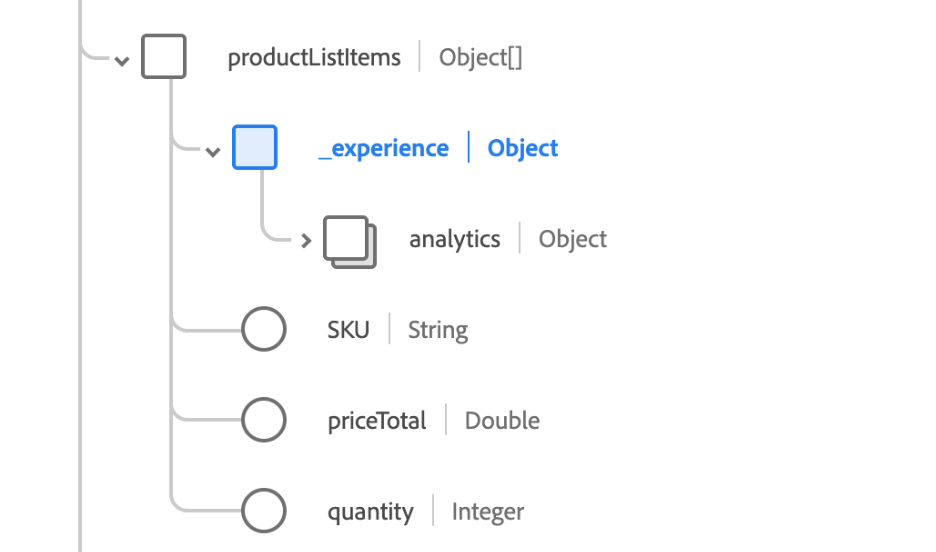

# Syntaxe SQL dans Query Service

Vous pouvez utiliser le langage SQL ANSI standard pour `SELECT` instructions et autres commandes limitées dans Adobe Experience Platform Query Service. Ce document couvre la syntaxe SQL prise en charge par [!DNL Query Service].

## SELECT requêtes {#select-queries}

La syntaxe suivante définit une `SELECT` requête prise en charge par [!DNL Query Service]:

```sql
[ WITH with_query [, ...] ]
SELECT [ ALL | DISTINCT [( expression [, ...] ) ] ]
    [ * | expression [ [ AS ] output_name ] [, ...] ]
    [ FROM from_item [, ...] ]
    [ SNAPSHOT { SINCE start_snapshot_id | AS OF end_snapshot_id | BETWEEN start_snapshot_id AND end_snapshot_id } ]
    [ WHERE condition ]
    [ GROUP BY grouping_element [, ...] ]
    [ HAVING condition [, ...] ]
    [ WINDOW window_name AS ( window_definition ) [, ...] ]
    [ { UNION | INTERSECT | EXCEPT | MINUS } [ ALL | DISTINCT ] select ]
    [ ORDER BY expression [ ASC | DESC | USING operator ] [ NULLS { FIRST | LAST } ] [, ...] ]
    [ LIMIT { count | ALL } ]
    [ OFFSET start ]
```

La section onglets ci-dessous fournit les options disponibles pour les mots-clés FROM, GROUP et WITH .

>[!BEGINTABS]

>[!TAB `from_item`]

```sql
table_name [ * ] [ [ AS ] alias [ ( column_alias [, ...] ) ] ]
```

```sql
[ LATERAL ] ( select ) [ AS ] alias [ ( column_alias [, ...] ) ]
```

```sql
with_query_name [ [ AS ] alias [ ( column_alias [, ...] ) ] ]
```

```sql
from_item [ NATURAL ] join_type from_item [ ON join_condition | USING ( join_column [, ...] ) ]
```

>[!TAB `grouping_element`]

```sql
( )
```

```sql
expression
```

```sql
( expression [, ...] )
```

```sql
ROLLUP ( { expression | ( expression [, ...] ) } [, ...] )
```

```sql
CUBE ( { expression | ( expression [, ...] ) } [, ...] )
```

```sql
GROUPING SETS ( grouping_element [, ...] )
```

>[!TAB `with_query`]

```sql
 with_query_name [ ( column_name [, ...] ) ] AS ( select | values )
```

>[!ENDTABS]

Les sous-sections suivantes fournissent des détails sur les clauses supplémentaires que vous pouvez utiliser dans vos requêtes, à condition qu’elles suivent le format indiqué ci-dessus.

### Clause SNAPSHOT

Cette clause peut être utilisée pour lire de manière incrémentielle les données d’une table en fonction des ID d’instantané. Un ID d’instantané est un marqueur de point de contrôle représenté par un nombre de type Long appliqué à un tableau de lac de données chaque fois que des données y sont écrites. La variable `SNAPSHOT` se lie à la relation de table à laquelle elle est utilisée.

```sql
    [ SNAPSHOT { SINCE start_snapshot_id | AS OF end_snapshot_id | BETWEEN start_snapshot_id AND end_snapshot_id } ]
```

#### Exemple

```sql
SELECT * FROM table_to_be_queried SNAPSHOT SINCE start_snapshot_id;

SELECT * FROM table_to_be_queried SNAPSHOT AS OF end_snapshot_id;

SELECT * FROM table_to_be_queried SNAPSHOT BETWEEN start_snapshot_id AND end_snapshot_id;

SELECT * FROM table_to_be_queried SNAPSHOT BETWEEN HEAD AND start_snapshot_id;

SELECT * FROM table_to_be_queried SNAPSHOT BETWEEN end_snapshot_id AND TAIL;

SELECT * FROM (SELECT id FROM table_to_be_queried BETWEEN start_snapshot_id AND end_snapshot_id) C 

(SELECT * FROM table_to_be_queried SNAPSHOT SINCE start_snapshot_id) a
  INNER JOIN 
(SELECT * from table_to_be_joined SNAPSHOT AS OF your_chosen_snapshot_id) b 
  ON a.id = b.id;
```

Le tableau ci-dessous explique la signification de chaque option de syntaxe dans la clause SNAPSHOT.

| Syntaxe | Signification |
|-------------------------------------------------------------------|------------------------------------------------------------------------------------------|
| `SINCE start_snapshot_id` | Lit les données à partir de l’ID d’instantané spécifié (exclusif). |
| `AS OF end_snapshot_id` | Lit les données telles qu’elles se trouvaient à l’ID d’instantané spécifié (inclus). |
| `BETWEEN start_snapshot_id AND end_snapshot_id` | Lit les données entre les ID d’instantané de début et de fin spécifiés. Il s’agit uniquement de l’événement `start_snapshot_id` et inclus de la variable `end_snapshot_id`. |
| `BETWEEN HEAD AND start_snapshot_id` | Lit les données du début (avant le premier instantané) vers l’ID d’instantané de début spécifié (inclus). Notez que cela ne renvoie que des lignes dans `start_snapshot_id`. |
| `BETWEEN end_snapshot_id AND TAIL` | Lit les données de juste après la valeur spécifiée `end-snapshot_id` à la fin du jeu de données (à l’exclusion de l’ID d’instantané). Cela signifie que si `end_snapshot_id` est le dernier instantané du jeu de données, la requête ne renvoie aucune ligne, car il n’y a aucun instantané au-delà de ce dernier. |
| `SINCE start_snapshot_id INNER JOIN table_to_be_joined AS OF your_chosen_snapshot_id ON table_to_be_queried.id = table_to_be_joined.id` | Lit les données à partir de l’ID d’instantané spécifié depuis `table_to_be_queried` et le joint aux données de `table_to_be_joined` en ce moment `your_chosen_snapshot_id`. La jointure est basée sur les identifiants correspondants des colonnes ID des deux tables jointes. |

A `SNAPSHOT` fonctionne avec un alias de table ou de table, mais pas sur une sous-requête ou une vue. A `SNAPSHOT` fonctionne partout où une clause `SELECT` sur une table peut être appliquée.

Vous pouvez également utiliser `HEAD` et `TAIL` comme valeurs de décalage spéciales pour les clauses d’instantané. Utilisation `HEAD` fait référence à un décalage avant le premier instantané, tandis que `TAIL` fait référence à un décalage après le dernier instantané.

>[!NOTE]
>
>Si vous interrogez deux ID d’instantané, les deux scénarios suivants peuvent se produire si l’instantané de début a expiré et que l’indicateur de comportement de secours facultatif (`resolve_fallback_snapshot_on_failure`) est défini :
>
>- Si l’indicateur facultatif de comportement de secours est défini, Query Service choisit l’instantané disponible le plus ancien, le définit comme instantané de début et renvoie les données entre l’instantané disponible le plus ancien et l’instantané de fin spécifié. Ces données sont **inclusif** de l’instantané disponible le plus ancien.

### Clause WHERE

Par défaut, les correspondances générées par un `WHERE` sur une clause `SELECT` les requêtes sont sensibles à la casse. Si vous souhaitez que les correspondances ne soient pas sensibles à la casse, utilisez le mot-clé `ILIKE` au lieu de `LIKE`.

```sql
    [ WHERE condition { LIKE | ILIKE | NOT LIKE | NOT ILIKE } pattern ]
```

La logique des clauses LIKE et ILIKE est expliquée dans le tableau suivant :

| Clause | Opérateur |
| ------ | -------- |
| `WHERE condition LIKE pattern` | `~~` |
| `WHERE condition NOT LIKE pattern` | `!~~` |
| `WHERE condition ILIKE pattern` | `~~*` |
| `WHERE condition NOT ILIKE pattern` | `!~~*` |

**Exemple**

```sql
SELECT * FROM Customers
WHERE CustomerName ILIKE 'a%';
```

Cette requête renvoie les clients dont le nom commence par &quot;A&quot; ou &quot;a&quot;.

### JOINDRE

A `SELECT` La requête qui utilise des jointures présente la syntaxe suivante :

```sql
SELECT statement
FROM statement
[JOIN | INNER JOIN | LEFT JOIN | LEFT OUTER JOIN | RIGHT JOIN | RIGHT OUTER JOIN | FULL JOIN | FULL OUTER JOIN]
ON join condition
```

### UNION, INTERSECT et EXCEPT

La variable `UNION`, `INTERSECT`, et `EXCEPT` des clauses sont utilisées pour combiner ou exclure des lignes similaires de plusieurs tables :

```sql
SELECT statement 1
[UNION | UNION ALL | UNION DISTINCT | INTERSECT | EXCEPT | MINUS]
SELECT statement 2
```

### CREATE TABLE AS SELECT {#create-table-as-select}

La syntaxe suivante définit une `CREATE TABLE AS SELECT` Requête (CTAS) :

```sql
CREATE TABLE table_name [ WITH (schema='target_schema_title', rowvalidation='false', label='PROFILE') ] AS (select_query)
```

| Paramètres | Description |
| ----- | ----- |
| `schema` | Titre du schéma XDM. Utilisez cette clause uniquement si vous souhaitez utiliser un schéma XDM existant pour le nouveau jeu de données créé par la requête CTAS. |
| `rowvalidation` | (Facultatif) Indique si l’utilisateur souhaite une validation au niveau des lignes de chaque nouveau lot ingéré pour le jeu de données nouvellement créé. La valeur par défaut est `true`. |
| `label` | Lorsque vous créez un jeu de données avec une requête CTAS, utilisez ce libellé avec la valeur de `profile` pour étiqueter votre jeu de données comme étant activé pour profile. Cela signifie que votre jeu de données est automatiquement marqué pour le profil lors de sa création. Consultez le document d’extension d’attribut dérivé pour plus d’informations sur l’utilisation de `label`. |
| `select_query` | A `SELECT` . La syntaxe de la variable `SELECT` se trouve dans la variable [Section SELECT query](#select-queries). |

**Exemple**

```sql
CREATE TABLE Chairs AS (SELECT color, count(*) AS no_of_chairs FROM Inventory i WHERE i.type=="chair" GROUP BY i.color)

CREATE TABLE Chairs WITH (schema='target schema title', label='PROFILE') AS (SELECT color, count(*) AS no_of_chairs FROM Inventory i WHERE i.type=="chair" GROUP BY i.color)

CREATE TABLE Chairs AS (SELECT color FROM Inventory SNAPSHOT SINCE 123)
```

>[!NOTE]
>
>La variable `SELECT` L’instruction doit comporter un alias pour les fonctions d’agrégat, telles que `COUNT`, `SUM`, `MIN`, etc. En outre, la variable `SELECT` peut être fournie avec ou sans parenthèses (). Vous pouvez fournir un `SNAPSHOT` pour lire les deltas incrémentiels dans la table cible.

## INSERT INTO

La variable `INSERT INTO` est définie comme suit :

```sql
INSERT INTO table_name select_query
```

| Paramètres | Description |
| ----- | ----- |
| `table_name` | Nom de la table dans laquelle vous souhaitez insérer la requête. |
| `select_query` | A `SELECT` . La syntaxe de la variable `SELECT` se trouve dans la variable [Section SELECT query](#select-queries). |

**Exemple**

>[!NOTE]
>
>L&#39;exemple suivant est un exemple concret et se résume à des fins pédagogiques.

```sql
INSERT INTO Customers SELECT SupplierName, City, Country FROM OnlineCustomers;

INSERT INTO Customers AS (SELECT * from OnlineCustomers SNAPSHOT AS OF 345)
```

>[!INFO]
> 
>Do **not** encadrez la fonction `SELECT` entre parenthèses (). En outre, le schéma du résultat du `SELECT` doit être conforme à celle de la table définie dans la variable `INSERT INTO` . Vous pouvez fournir un `SNAPSHOT` pour lire les deltas incrémentiels dans la table cible.

La plupart des champs d’un schéma XDM réel sont introuvables au niveau racine et SQL n’autorise pas l’utilisation de la notation par points. Pour obtenir un résultat réaliste en utilisant des champs imbriqués, vous devez mapper chaque champ de votre `INSERT INTO` chemin.

À `INSERT INTO` les chemins imbriqués, utilisez la syntaxe suivante :

```sql
INSERT INTO [dataset]
SELECT struct([source field1] as [target field in schema],
[source field2] as [target field in schema],
[source field3] as [target field in schema]) [tenant name]
FROM [dataset]
```

**Exemple**

```sql
INSERT INTO Customers SELECT struct(SupplierName as Supplier, City as SupplierCity, Country as SupplierCountry) _Adobe FROM OnlineCustomers;
```

## DROP TABLE

La variable `DROP TABLE` supprime du système de fichiers une table existante et supprime le répertoire associé à la table s’il ne s’agit pas d’une table externe. Si la table n’existe pas, une exception se produit.

```sql
DROP TABLE [IF EXISTS] [db_name.]table_name
```

| Paramètres | Description |
| ------ | ------ |
| `IF EXISTS` | Si cette valeur est spécifiée, aucune exception n’est générée si la table **not** existent. |

## CRÉER UNE BASE DE DONNÉES

La variable `CREATE DATABASE` crée une base de données Azure Data Lake Storage (ADLS).

```sql
CREATE DATABASE [IF NOT EXISTS] db_name
```

## DROP DABASE

La variable `DROP DATABASE` supprime la base de données d’une instance.

```sql
DROP DATABASE [IF EXISTS] db_name
```

| Paramètres | Description |
| ------ | ------ |
| `IF EXISTS` | Si cette valeur est spécifiée, aucune exception n’est générée si la base de données **not** existent. |

## DÉPOSER LE SCHÉMA

La variable `DROP SCHEMA` supprime un schéma existant.

```sql
DROP SCHEMA [IF EXISTS] db_name.schema_name [ RESTRICT | CASCADE]
```

| Paramètres | Description |
| ------ | ------ |
| `IF EXISTS` | Si ce paramètre est spécifié et que le schéma le fait **not** existe, aucune exception n’est générée. |
| `RESTRICT` | La valeur par défaut du mode. Si spécifié, le schéma ne disparaît que s’il l’est. **not** contiennent tous les tableaux. |
| `CASCADE` | Si spécifié, le schéma est déposé avec toutes les tables présentes dans le schéma. |

## CREATE VIEW

La syntaxe suivante définit une `CREATE VIEW` requête pour un jeu de données. Ce jeu de données peut être un jeu de données ADLS ou de magasin accéléré.

```sql
CREATE VIEW view_name AS select_query
```

| Paramètres | Description |
| ------ | ------ |
| `view_name` | Nom de la vue à créer. |
| `select_query` | A `SELECT` . La syntaxe de la variable `SELECT` se trouve dans la variable [Section SELECT query](#select-queries). |

**Exemple**

```sql
CREATE VIEW V1 AS SELECT color, type FROM Inventory

CREATE OR REPLACE VIEW V1 AS SELECT model, version FROM Inventory
```

La syntaxe suivante définit une `CREATE VIEW` qui crée une vue dans le contexte d&#39;une base de données et d&#39;un schéma.

**Exemple**

```sql
CREATE VIEW db_name.schema_name.view_name AS select_query
CREATE OR REPLACE VIEW db_name.schema_name.view_name AS select_query
```

| Paramètres | Description |
| ------ | ------ |
| `db_name` | Nom de la base de données. |
| `schema_name` | Nom du schéma. |
| `view_name` | Nom de la vue à créer. |
| `select_query` | A `SELECT` . La syntaxe de la variable `SELECT` se trouve dans la variable [Section SELECT query](#select-queries). |

**Exemple**

```sql
CREATE VIEW <dbV1 AS SELECT color, type FROM Inventory;

CREATE OR REPLACE VIEW V1 AS SELECT model, version FROM Inventory;
```

## AFFICHER LES VUES

La requête suivante affiche la liste des vues.

```sql
SHOW VIEWS;
```

```console
 Db Name  | Schema Name | Name  | Id       |  Dataset Dependencies | Views Dependencies | TYPE
----------------------------------------------------------------------------------------------
 qsaccel  | profile_agg | view1 | view_id1 | dwh_dataset1          |                    | DWH
          |             | view2 | view_id2 | adls_dataset          | adls_views         | ADLS
(2 rows)
```

## DROP VIEW

La syntaxe suivante définit une `DROP VIEW` query :

```sql
DROP VIEW [IF EXISTS] view_name
```

| Paramètres | Description |
| ------ | ------ |
| `IF EXISTS` | Si cette valeur est spécifiée, aucune exception n’est générée si la vue **not** existent. |
| `view_name` | Nom de la vue à supprimer. |

**Exemple**

```sql
DROP VIEW v1
DROP VIEW IF EXISTS v1
```

## Bloc anonyme {#anonymous-block}

Un bloc anonyme se compose de deux sections : les sections exécutable et de gestion des exceptions. Dans un bloc anonyme, la section exécutable est obligatoire. Toutefois, la section de gestion des exceptions est facultative.

L&#39;exemple suivant montre comment créer un bloc avec une ou plusieurs instructions à exécuter ensemble :

```sql
$$BEGIN
  statementList
[EXCEPTION exceptionHandler]
$$END

exceptionHandler:
      WHEN OTHER
      THEN statementList

statementList:
    : (statement (';')) +
```

Vous trouverez ci-dessous un exemple utilisant le bloc anonyme.

```sql
$$BEGIN
   SET @v_snapshot_from = select parent_id  from (select history_meta('email_tracking_experience_event_dataset') ) tab where is_current;
   SET @v_snapshot_to = select snapshot_id from (select history_meta('email_tracking_experience_event_dataset') ) tab where is_current;
   SET @v_log_id = select now();
   CREATE TABLE tracking_email_id_incrementally
     AS SELECT _id AS id FROM email_tracking_experience_event_dataset SNAPSHOT BETWEEN @v_snapshot_from AND @v_snapshot_to;

EXCEPTION
  WHEN OTHER THEN
    DROP TABLE IF EXISTS tracking_email_id_incrementally;
    SELECT 'ERROR';
$$END;
```

### Instructions conditionnelles dans un bloc anonyme {#conditional-anonymous-block-statements}

La structure de contrôle IF-THEN-ELSE permet l’exécution conditionnelle d’une liste d’instructions lorsqu’une condition est évaluée comme TRUE. Cette structure de contrôle ne s&#39;applique qu&#39;à l&#39;intérieur d&#39;un bloc anonyme. Si cette structure est utilisée comme commande autonome, une erreur de syntaxe s’affiche (&quot;Commande non valide en dehors du bloc anonyme&quot;).

Le fragment de code ci-dessous illustre le format correct d’une instruction conditionnelle IF-THEN-ELSE dans un bloc anonyme.

```javascript
IF booleanExpression THEN
   List of statements;
ELSEIF booleanExpression THEN 
   List of statements;
ELSEIF booleanExpression THEN 
   List of statements;
ELSE
   List of statements;
END IF
```

**Exemple**

L’exemple ci-dessous exécute `SELECT 200;`.

```sql
$$BEGIN
    SET @V = SELECT 2;
    SELECT @V;
    IF @V = 1 THEN
       SELECT 100;
    ELSEIF @V = 2 THEN
       SELECT 200;
    ELSEIF @V = 3 THEN
       SELECT 300;
    ELSE    
       SELECT 'DEFAULT';
    END IF;   

 END$$;
```

Cette structure peut être utilisée avec `raise_error();` pour renvoyer un message d’erreur personnalisé. Le bloc de code illustré ci-dessous met fin au bloc anonyme avec &quot;message d’erreur personnalisé&quot;.

**Exemple**

```sql
$$BEGIN
    SET @V = SELECT 5;
    SELECT @V;
    IF @V = 1 THEN
       SELECT 100;
    ELSEIF @V = 2 THEN
       SELECT 200;
    ELSEIF @V = 3 THEN
       SELECT 300;
    ELSE    
       SELECT raise_error('custom error message');
    END IF;   

 END$$;
```

#### Instructions IF imbriquées

Les instructions IF imbriquées sont prises en charge dans les blocs anonymes.

**Exemple**

```sql
$$BEGIN
    SET @V = SELECT 1;
    IF @V = 1 THEN
       SELECT 100;
       IF @V > 0 THEN
         SELECT 1000;
       END IF;   
    END IF;   

 END$$; 
```

#### Blocs d’exception

Les blocs d’exception sont pris en charge dans les blocs anonymes.

**Exemple**

```sql
$$BEGIN
    SET @V = SELECT 2;
    IF @V = 1 THEN
       SELECT 100;
    ELSEIF @V = 2 THEN
       SELECT raise_error(concat('custom-error for v= ', '@V' ));

    ELSEIF @V = 3 THEN
       SELECT 300;
    ELSE    
       SELECT 'DEFAULT';
    END IF;  
EXCEPTION WHEN OTHER THEN 
  SELECT 'THERE WAS AN ERROR';    
 END$$;
```

### Auto to JSON {#auto-to-json}

Query Service prend en charge un paramètre facultatif au niveau de la session pour renvoyer des champs complexes de niveau supérieur à partir de requêtes SELECT interactives sous forme de chaînes JSON. La variable `auto_to_json` permet de renvoyer les données de champs complexes sous la forme JSON, puis de les analyser dans des objets JSON à l’aide de bibliothèques standard.

DÉFINITION de l’indicateur de fonctionnalité `auto_to_json` sur true avant d’exécuter votre requête SELECT contenant des champs complexes.

```sql
set auto_to_json=true; 
```

#### Avant de définir la variable `auto_to_json` indicateur

Le tableau suivant fournit un exemple de résultat de requête avant le `auto_to_json` est appliquée. La même requête SELECT (comme illustré ci-dessous) qui cible un tableau avec des champs complexes a été utilisée dans les deux scénarios.

```sql
SELECT * FROM TABLE_WITH_COMPLEX_FIELDS LIMIT 2;
```

Les résultats sont les suivants :

```console
                _id                |                                _experience                                 | application  |                   commerce                   | dataSource |                               device                               |                       endUserIDs                       |                                                                                                environment                                                                                                |                     identityMap                     |                              placeContext                               |   receivedTimestamp   |       timestamp       | userActivityRegion |                                         web                                          | _adcstageforpqs
-----------------------------------+----------------------------------------------------------------------------+--------------+----------------------------------------------+------------+--------------------------------------------------------------------+--------------------------------------------------------+-----------------------------------------------------------------------------------------------------------------------------------------------------------------------------------------------------------+-----------------------------------------------------+-------------------------------------------------------------------------+-----------------------+-----------------------+--------------------+--------------------------------------------------------------------------------------+-----------------
 31892EE15DE00000-401D52664FF48A52 | ("("("(1,1)","(1,1)")","(-209479095,4085488201,-2105158467,2189808829)")") | (background) | (NULL,"(USD,NULL)",NULL,NULL,NULL,NULL,NULL) | (475341)   | (32,768,1024,205202,https://ns.adobe.com/xdm/external/deviceatlas) | ("("(31892EE080007B35-E6CE00000000000,"(AAID)",t)")")  | ("(en-US,f,f,t,1.6,"Mozilla/5.0 (iPhone; U; CPU iPhone OS 4_1 like Mac OS X; ja-jp) AppleWebKit/532.9 (KHTML, like Gecko) Version/4.0.5 Mobile/8B117 Safari/6531.22.7",490,1125)",xo.net,64.3.235.13)     | [AAID -> "{(31892EE080007B35-E6CE00000000000,t)}"]  | ("("(34.01,-84.0)",lawrenceville,US,524,30043,ga)",600)                 | 2022-09-02 19:47:14.0 | 2022-09-02 19:47:14.0 | (UT1)              | ("(f,Search Results,"(1.0)")","(http://www.google.com/search?ie=UTF-8&q=,internal)") |
 31892EE15DE00000-401B92664FF48AE8 | ("("("(1,1)","(1,1)")","(-209479095,4085488201,-2105158467,2189808829)")") | (background) | (NULL,"(USD,NULL)",NULL,NULL,NULL,NULL,NULL) | (475341)   | (32,768,1024,205202,https://ns.adobe.com/xdm/external/deviceatlas) | ("("(31892EE100007BF3-215FE00000000001,"(AAID)",t)")") | ("(en-US,f,f,t,1.5,"Mozilla/5.0 (iPhone; U; CPU iPhone OS 4_1 like Mac OS X; ja-jp) AppleWebKit/532.9 (KHTML, like Gecko) Version/4.0.5 Mobile/8B117 Safari/6531.22.7",768,556)",ntt.net,219.165.108.145) | [AAID -> "{(31892EE100007BF3-215FE00000000001,t)}"] | ("("(34.989999999999995,138.42)",shizuoka,JP,392005,420-0812,22)",-240) | 2022-09-02 19:47:14.0 | 2022-09-02 19:47:14.0 | (UT1)              | ("(f,Home - JJEsquire,"(1.0)")","(NULL,typed_bookmarked)")                           |
(2 rows)  
```

#### Après avoir défini la variable `auto_to_json` indicateur

Le tableau suivant montre la différence de résultats entre les `auto_to_json` a sur le jeu de données résultant. La même requête SELECT a été utilisée dans les deux scénarios.

```console
                _id                |   receivedTimestamp   |       timestamp       |                                                                                                                   _experience                                                                                                                   |           application            |             commerce             |    dataSource    |                                                                  device                                                                   |                                                   endUserIDs                                                   |                                                                                                                                                                                           environment                                                                                                                                                                                            |                             identityMap                              |                                                                                            placeContext                                                                                            |      userActivityRegion      |                                                                                     web                                                                                      | _adcstageforpqs
-----------------------------------+-----------------------+-----------------------+-------------------------------------------------------------------------------------------------------------------------------------------------------------------------------------------------------------------------------------------------+----------------------------------+----------------------------------+------------------+-------------------------------------------------------------------------------------------------------------------------------------------+----------------------------------------------------------------------------------------------------------------+--------------------------------------------------------------------------------------------------------------------------------------------------------------------------------------------------------------------------------------------------------------------------------------------------------------------------------------------------------------------------------------------------+----------------------------------------------------------------------+----------------------------------------------------------------------------------------------------------------------------------------------------------------------------------------------------+------------------------------+------------------------------------------------------------------------------------------------------------------------------------------------------------------------------+-----------------
 31892EE15DE00000-401D52664FF48A52 | 2022-09-02 19:47:14.0 | 2022-09-02 19:47:14.0 | {"analytics":{"customDimensions":{"eVars":{"eVar1":"1","eVar2":"1"},"props":{"prop1":"1","prop2":"1"}},"environment":{"browserID":-209479095,"browserIDStr":"4085488201","operatingSystemID":-2105158467,"operatingSystemIDStr":"2189808829"}}} | {"userPerspective":"background"} | {"order":{"currencyCode":"USD"}} | {"_id":"475341"} | {"colorDepth":32,"screenHeight":768,"screenWidth":1024,"typeID":"205202","typeIDService":"https://ns.adobe.com/xdm/external/deviceatlas"} | {"_experience":{"aaid":{"id":"31892EE080007B35-E6CE00000000000","namespace":{"code":"AAID"},"primary":true}}}  | {"browserDetails":{"acceptLanguage":"en-US","cookiesEnabled":false,"javaEnabled":false,"javaScriptEnabled":true,"javaScriptVersion":"1.6","userAgent":"Mozilla/5.0 (iPhone; U; CPU iPhone OS 4_1 like Mac OS X; ja-jp) AppleWebKit/532.9 (KHTML, like Gecko) Version/4.0.5 Mobile/8B117 Safari/6531.22.7","viewportHeight":490,"viewportWidth":1125},"domain":"xo.net","ipV4":"64.3.235.13"}     | {"AAID":[{"id":"31892EE080007B35-E6CE00000000000","primary":true}]}  | {"geo":{"_schema":{"latitude":34.01,"longitude":-84.0},"city":"lawrenceville","countryCode":"US","dmaID":524,"postalCode":"30043","stateProvince":"ga"},"localTimezoneOffset":600}                 | {"dataCenterLocation":"UT1"} | {"webPageDetails":{"isHomePage":false,"name":"Search Results","pageViews":{"value":1.0}},"webReferrer":{"URL":"http://www.google.com/search?ie=UTF-8&q=","type":"internal"}} |
 31892EE15DE00000-401B92664FF48AE8 | 2022-09-02 19:47:14.0 | 2022-09-02 19:47:14.0 | {"analytics":{"customDimensions":{"eVars":{"eVar1":"1","eVar2":"1"},"props":{"prop1":"1","prop2":"1"}},"environment":{"browserID":-209479095,"browserIDStr":"4085488201","operatingSystemID":-2105158467,"operatingSystemIDStr":"2189808829"}}} | {"userPerspective":"background"} | {"order":{"currencyCode":"USD"}} | {"_id":"475341"} | {"colorDepth":32,"screenHeight":768,"screenWidth":1024,"typeID":"205202","typeIDService":"https://ns.adobe.com/xdm/external/deviceatlas"} | {"_experience":{"aaid":{"id":"31892EE100007BF3-215FE00000000001","namespace":{"code":"AAID"},"primary":true}}} | {"browserDetails":{"acceptLanguage":"en-US","cookiesEnabled":false,"javaEnabled":false,"javaScriptEnabled":true,"javaScriptVersion":"1.5","userAgent":"Mozilla/5.0 (iPhone; U; CPU iPhone OS 4_1 like Mac OS X; ja-jp) AppleWebKit/532.9 (KHTML, like Gecko) Version/4.0.5 Mobile/8B117 Safari/6531.22.7","viewportHeight":768,"viewportWidth":556},"domain":"ntt.net","ipV4":"219.165.108.145"} | {"AAID":[{"id":"31892EE100007BF3-215FE00000000001","primary":true}]} | {"geo":{"_schema":{"latitude":34.989999999999995,"longitude":138.42},"city":"shizuoka","countryCode":"JP","dmaID":392005,"postalCode":"420-0812","stateProvince":"22"},"localTimezoneOffset":-240} | {"dataCenterLocation":"UT1"} | {"webPageDetails":{"isHomePage":false,"name":"Home - JJEsquire","pageViews":{"value":1.0}},"webReferrer":{"type":"typed_bookmarked"}}                                        |
(2 rows)
```

### Résoudre l’instantané de secours en cas d’échec {#resolve-fallback-snapshot-on-failure}

La variable `resolve_fallback_snapshot_on_failure` est utilisée pour résoudre le problème d’un ID d’instantané expiré. Les métadonnées d’instantané expirent au bout de deux jours et un instantané expiré peut invalider la logique d’un script. Cela peut poser problème lors de l&#39;utilisation de blocs anonymes.

Définissez la variable `resolve_fallback_snapshot_on_failure` sur true pour remplacer un instantané par un ID d’instantané précédent.

```sql
SET resolve_fallback_snapshot_on_failure=true;
```

La ligne de code suivante remplace l’`@from_snapshot_id` par l’`snapshot_id` disponible en premier à partir des métadonnées.

```sql
$$ BEGIN
    SET resolve_fallback_snapshot_on_failure=true;
    SET @from_snapshot_id = SELECT coalesce(last_snapshot_id, 'HEAD') FROM checkpoint_log a JOIN
                            (SELECT MAX(process_timestamp)process_timestamp FROM checkpoint_log
                                WHERE process_name = 'DIM_TABLE_ABC' AND process_status = 'SUCCESSFUL' )b
                                on a.process_timestamp=b.process_timestamp;
    SET @to_snapshot_id = SELECT snapshot_id FROM (SELECT history_meta('DIM_TABLE_ABC')) WHERE  is_current = true;
    SET @last_updated_timestamp= SELECT CURRENT_TIMESTAMP;
    INSERT INTO DIM_TABLE_ABC_Incremental
     SELECT  *  FROM DIM_TABLE_ABC SNAPSHOT BETWEEN @from_snapshot_id AND @to_snapshot_id WHERE NOT EXISTS (SELECT _id FROM DIM_TABLE_ABC_Incremental a WHERE _id=a._id);

Insert Into
   checkpoint_log
   SELECT
       'DIM_TABLE_ABC' process_name,
       'SUCCESSFUL' process_status,
      cast( @to_snapshot_id AS string) last_snapshot_id,
      cast( @last_updated_timestamp AS TIMESTAMP) process_timestamp;
EXCEPTION
  WHEN OTHER THEN
    SELECT 'ERROR';
END
$$;
```


## Organisation des ressources de données

Il est important d’organiser logiquement vos ressources de données dans le lac de données Adobe Experience Platform au fur et à mesure de leur croissance. Query Service étend les constructions SQL qui vous permettent de regrouper logiquement les ressources de données dans un environnement de test. Cette méthode d’organisation permet le partage de ressources de données entre les schémas sans avoir à les déplacer physiquement.

Les constructions SQL suivantes utilisant la syntaxe SQL standard sont prises en charge pour que vous puissiez organiser vos données de manière logique.

```SQL
CREATE DATABASE dg1;
CREATE SCHEMA dg1.schema1;
CREATE table t1 ...;
CREATE view v1 ...;
ALTER TABLE t1 ADD PRIMARY KEY (c1) NOT ENFORCED;
ALTER TABLE t2 ADD FOREIGN KEY (c1) REFERENCES t1(c1) NOT ENFORCED;
```

Voir [organisation logique des ressources de données](../best-practices/organize-data-assets.md) Guide pour une explication plus détaillée des bonnes pratiques de Query Service.

## Le tableau existe

La variable `table_exists` La commande SQL permet de confirmer si une table existe actuellement dans le système. La commande renvoie une valeur booléenne : `true` si le tableau **does** existent et `false` si le tableau fonctionne **not** existent.

En validant l’existence d’un tableau avant d’exécuter les instructions, la variable `table_exists` Cette fonctionnalité simplifie le processus d’écriture d’un bloc anonyme pour couvrir à la fois les `CREATE` et `INSERT INTO` cas d’utilisation.

La syntaxe suivante définit la variable `table_exists` command :

```SQL
$$
BEGIN

#Set mytableexist to true if the table already exists.
SET @mytableexist = SELECT table_exists('target_table_name');

#Create the table if it does not already exist (this is a one time operation).
CREATE TABLE IF NOT EXISTS target_table_name AS
  SELECT *
  FROM   profile_dim_date limit 10;

#Insert data only if the table already exists. Check if @mytableexist = 'true'
 INSERT INTO target_table_name           (
                     select *
                     from   profile_dim_date
                     WHERE  @mytableexist = 'true' limit 20
              ) ;
EXCEPTION
WHEN other THEN SELECT 'ERROR';

END $$; 
```

## Intégré {#inline}

La variable `inline` sépare les éléments d’un tableau de structs et génère les valeurs dans un tableau. Il ne peut être placé que dans la variable `SELECT` ou une liste `LATERAL VIEW`.

La variable `inline` function **cannot** être placés dans une liste sélectionnée, là où il existe d’autres fonctions de générateur.

Par défaut, les colonnes générées sont nommées &quot;col1&quot;, &quot;col2&quot;, etc. Si l’expression est `NULL` alors aucune ligne n’est générée.

>[!TIP]
>
>Les noms de colonne peuvent être renommés à l’aide de la variable `RENAME` .

**Exemple**

```sql
> SELECT inline(array(struct(1, 'a'), struct(2, 'b'))), 'Spark SQL';
```

L’exemple renvoie les éléments suivants :

```text
1  a Spark SQL
2  b Spark SQL
```

Ce deuxième exemple illustre le concept et l&#39;application de la méthode `inline` de la fonction Le modèle de données de l’exemple est illustré dans l’image ci-dessous.



**Exemple**

```sql
select inline(productListItems) from source_dataset limit 10;
```

Les valeurs provenant de la variable `source_dataset` sont utilisés pour remplir la table cible.

| SKU | _experience | quantity | priceTotal |
|---------------------|-----------------------------------|----------|--------------|
| product-id-1 | (&quot;(&quot;(&quot;(A,pass,B,NULL)&quot;)&quot;)&quot;) | 5 | 10,5 |
| product-id-5 | (&quot;(&quot;(&quot;(A, pass, B,NULL)&quot;)&quot;)&quot;) |          |              |
| product-id-2 | (&quot;(&quot;(&quot;(AF, C, D, NULL)&quot;)&quot;))&quot;) | 6 | 40 |
| product-id-4 | (&quot;(&quot;(&quot;(BM, pass, NA,NULL)&quot;)&quot;)&quot;) | 3 | 12 |

## [!DNL Spark] Commandes SQL

La sous-section ci-dessous couvre les commandes Spark SQL prises en charge par Query Service.

### SET

La variable `SET` définit une propriété et renvoie la valeur d’une propriété existante ou répertorie toutes les propriétés existantes. Si une valeur est fournie pour une clé de propriété existante, l’ancienne valeur est remplacée.

```sql
SET property_key = property_value
```

| Paramètres | Description |
| ------ | ------ |
| `property_key` | Nom de la propriété que vous souhaitez répertorier ou modifier. |
| `property_value` | La valeur sous laquelle vous souhaitez que la propriété soit définie. |

Pour renvoyer la valeur d’un paramètre, utilisez `SET [property key]` sans `property_value`.

## [!DNL PostgreSQL] Commandes

Les sous-sections ci-dessous couvrent la variable [!DNL PostgreSQL] Commandes prises en charge par Query Service.

### ANALYSER LE TABLEAU {#analyze-table}

La variable `ANALYZE TABLE` effectue une analyse de distribution et des calculs statistiques pour la ou les tables nommées. L’utilisation de `ANALYZE TABLE` varie selon que les jeux de données sont stockés sur la variable [boutique accélérée](#compute-statistics-accelerated-store) ou le [lac de données](#compute-statistics-data-lake). Consultez leurs sections respectives pour plus d’informations sur son utilisation.

#### CALCULER LES STATISTIQUES sur le magasin accéléré {#compute-statistics-accelerated-store}

La variable `ANALYZE TABLE` calcule les statistiques pour une table sur l’entrepôt accéléré. Les statistiques sont calculées sur les requêtes CTAS ou ITAS exécutées pour un tableau donné de la boutique accélérée.

**Exemple**

```sql
ANALYZE TABLE <original_table_name>
```

Voici une liste de calculs statistiques disponibles après l’utilisation de la variable `ANALYZE TABLE` command:-

| Valeurs calculées | Description |
|---|---|
| `field` | Nom de la colonne d’un tableau. |
| `data-type` | Type de données acceptable pour chaque colonne. |
| `count` | Nombre de lignes contenant une valeur non nulle pour ce champ. |
| `distinct-count` | Nombre de valeurs uniques ou distinctes pour ce champ. |
| `missing` | Nombre de lignes dont la valeur de ce champ est nulle. |
| `max` | Valeur maximale du tableau analysé. |
| `min` | Valeur minimale du tableau analysé. |
| `mean` | Valeur moyenne du tableau analysé. |
| `stdev` | Écart type du tableau analysé. |

#### CALCULER LES STATISTIQUES sur le lac de données {#compute-statistics-data-lake}

Vous pouvez maintenant calculer les statistiques au niveau des colonnes sur [!DNL Azure Data Lake Storage] (ADLS) des jeux de données avec la variable `COMPUTE STATISTICS` Commande SQL. Calculez les statistiques des colonnes sur l’ensemble du jeu de données, un sous-ensemble d’un jeu de données, toutes les colonnes ou un sous-ensemble de colonnes.

`COMPUTE STATISTICS` étend la propriété `ANALYZE TABLE` . Toutefois, la variable `COMPUTE STATISTICS`, `FILTERCONTEXT`, et `FOR COLUMNS` Les commandes ne sont pas prises en charge sur les tables de magasin accélérées. Ces extensions pour la variable `ANALYZE TABLE` ne sont actuellement prises en charge que pour les tables ADLS.

**Exemple**

```sql
ANALYZE TABLE tableName FILTERCONTEXT (timestamp >= to_timestamp('2023-04-01 00:00:00') and timestamp <= to_timestamp('2023-04-05 00:00:00')) COMPUTE STATISTICS  FOR COLUMNS (commerce, id, timestamp);
```

La variable `FILTER CONTEXT` calcule les statistiques sur un sous-ensemble du jeu de données en fonction de la condition de filtrage fournie. La variable `FOR COLUMNS` cible des colonnes spécifiques à des fins d’analyse.

>[!NOTE]
>
>La variable `Statistics ID` et les statistiques générées ne sont valides que pour chaque session et ne sont pas accessibles dans différentes sessions PSQL.<br><br>Limites :<ul><li>La génération de statistiques n’est pas prise en charge pour les types de données de tableau ou de mappage.</li><li>Les statistiques calculées sont **not** persistaient entre les sessions.</li></ul><br><br>Options :<br><ul><li>`skip_stats_for_complex_datatypes`</li></ul><br>Par défaut, l’indicateur est défini sur true. Par conséquent, lorsque des statistiques sont demandées sur un type de données qui n’est pas pris en charge, il n’échoue pas, mais ignore silencieusement les champs avec les types de données non pris en charge.<br>Pour activer les notifications d’erreurs lorsque des statistiques sont demandées sur un type de données non pris en charge, utilisez : `SET skip_stats_for_complex_datatypes = false`.

La sortie de la console s’affiche comme illustré ci-dessous.

```console
|     Statistics ID      | 
| ---------------------- |
| adc_geometric_stats_1  |
(1 row)
```

Vous pouvez ensuite interroger directement les statistiques calculées en référençant la variable `Statistics ID`. Utilisez la variable `Statistics ID` ou le nom d’alias tel qu’affiché dans l’exemple d’instruction ci-dessous, pour afficher la sortie dans son intégralité. Pour en savoir plus sur cette fonctionnalité, voir [documentation sur les noms d’alias](../key-concepts/dataset-statistics.md#alias-name).

```sql
-- This statement gets the statistics generated for `alias adc_geometric_stats_1`.
SELECT * FROM adc_geometric_stats_1;
```

Utilisez la variable `SHOW STATISTICS` pour afficher les métadonnées de toutes les statistiques temporaires générées dans la session. Vous pouvez ainsi affiner la portée de votre analyse statistique.

```sql
SHOW STATISTICS;
```

Vous trouverez ci-dessous un exemple de sortie de STATISTICS AFFICHAGE .

```console
      statsId         |   tableName   | columnSet |         filterContext       |      timestamp
----------------------+---------------+-----------+-----------------------------+--------------------
adc_geometric_stats_1 | adc_geometric |   (age)   |                             | 25/06/2023 09:22:26
demo_table_stats_1    |  demo_table   |    (*)    |       ((age > 25))          | 25/06/2023 12:50:26
age_stats             | castedtitanic |   (age)   | ((age > 25) AND (age < 40)) | 25/06/2023 09:22:26
```

Voir [documentation sur les statistiques des jeux de données](../key-concepts/dataset-statistics.md) pour plus d’informations.

#### TABLESAMPLE {#tablesample}

Adobe Experience Platform Query Service fournit des jeux de données d’exemple dans le cadre de ses fonctionnalités approximatives de traitement des requêtes.

Il est préférable d’utiliser des exemples de jeux de données lorsque vous n’avez pas besoin d’une réponse exacte pour une opération d’agrégat sur un jeu de données. Pour effectuer des requêtes exploratoires plus efficaces sur des jeux de données volumineux en émettant une requête approximative pour renvoyer une réponse approximative, utilisez la méthode `TABLESAMPLE` fonction .

Des exemples de jeux de données sont créés avec des exemples aléatoires uniformes issus de [!DNL Azure Data Lake Storage] Jeux de données (ADLS), utilisant uniquement un pourcentage d’enregistrements de l’original. L’exemple de fonction de jeu de données étend la fonction `ANALYZE TABLE` avec la commande `TABLESAMPLE` et `SAMPLERATE` Commandes SQL.

Dans l’exemple ci-dessous, la première ligne montre comment calculer un échantillon de 5 % du tableau. La deuxième ligne montre comment calculer un échantillon de 5 % à partir d’une vue filtrée des données du tableau.

**Exemple**

```sql {line-numbers="true"}
ANALYZE TABLE tableName TABLESAMPLE SAMPLERATE 5;
ANALYZE TABLE tableName FILTERCONTEXT (timestamp >= to_timestamp('2023-01-01')) TABLESAMPLE SAMPLERATE 5:
```

Voir [documentation sur les exemples de jeux de données](../key-concepts/dataset-samples.md) pour plus d’informations.

### BEGIN

La variable `BEGIN` ou le `BEGIN WORK` ou `BEGIN TRANSACTION` lance un bloc de transaction. Toutes les instructions saisies après la commande de début sont exécutées dans une seule transaction jusqu’à ce qu’une commande de COMMIT ou ROLLBACK explicite soit donnée. Cette commande est identique à `START TRANSACTION`.

```sql
BEGIN
BEGIN WORK
BEGIN TRANSACTION
```

### CLOSE

La variable `CLOSE` libère les ressources associées à un curseur ouvert. Une fois le curseur fermé, aucune opération n’est autorisée sur celui-ci. Un curseur doit être fermé lorsqu’il n’est plus nécessaire.

```sql
CLOSE name
CLOSE ALL
```

If `CLOSE name` est utilisé, `name` représente le nom d’un curseur ouvert qui doit être fermé. If `CLOSE ALL` est utilisée, tous les curseurs ouverts sont fermés.

### DEALLOCATE

Pour désaffecter une instruction SQL préparée précédemment, utilisez la méthode `DEALLOCATE` . Si vous n’avez pas explicitement désaffecté une instruction préparée, elle est désaffectée à la fin de la session. Vous trouverez plus d’informations sur les instructions préparées dans la section [PREPARE, commande](#prepare) .

```sql
DEALLOCATE name
DEALLOCATE ALL
```

If `DEALLOCATE name` est utilisé, `name` représente le nom de l’instruction préparée qui doit être désaffectée. If `DEALLOCATE ALL` est utilisée, toutes les instructions préparées sont désaffectées.

### DECLARE

La variable `DECLARE` permet à un utilisateur de créer un curseur qui peut être utilisé pour récupérer un petit nombre de lignes à partir d’une requête plus grande. Une fois le curseur créé, les lignes sont récupérées à l’aide de `FETCH`.

```sql
DECLARE name CURSOR FOR query
```

| Paramètres | Description |
| ------ | ------ |
| `name` | Le nom du curseur à créer. |
| `query` | A `SELECT` ou `VALUES` qui fournit les lignes à renvoyer par le curseur. |

### EXECUTE

La variable `EXECUTE` sert à exécuter une instruction préparée au préalable. Comme les instructions préparées n’existent que pendant une session, l’instruction préparée doit avoir été créée par une `PREPARE` exécutée plus tôt dans la session en cours. Vous trouverez plus d’informations sur l’utilisation des instructions préparées dans la section [`PREPARE` command](#prepare) .

Si la variable `PREPARE` qui a créé l’instruction spécifiait certains paramètres, un ensemble compatible de paramètres doit être transmis à l’instruction `EXECUTE` . Si ces paramètres ne sont pas transmis, une erreur s’affiche.

```sql
EXECUTE name [ ( parameter ) ]
```

| Paramètres | Description |
| ------ | ------ |
| `name` | Nom de l’instruction préparée à exécuter. |
| `parameter` | La valeur réelle d’un paramètre de l’instruction préparée. Il doit s’agir d’une expression donnant une valeur compatible avec le type de données de ce paramètre, tel que déterminé lors de la création de l’instruction préparée. S’il existe plusieurs paramètres pour l’instruction préparée, ils sont séparés par des virgules. |

### EXPLAIN

La variable `EXPLAIN` affiche le plan d’exécution de l’instruction fournie. Le plan d’exécution indique comment les tables référencées par l’instruction seront analysées. Si plusieurs tableaux sont référencés, il indique les algorithmes de jointure utilisés pour rassembler les lignes requises de chaque tableau d’entrée.

```sql
EXPLAIN statement
```

Pour définir le format de la réponse, utilisez la méthode `FORMAT` avec le mot-clé `EXPLAIN` .

```sql
EXPLAIN FORMAT { TEXT | JSON } statement
```

| Paramètres | Description |
| ------ | ------ |
| `FORMAT` | Utilisez la variable `FORMAT` pour spécifier le format de sortie. Les options disponibles sont les suivantes : `TEXT` ou `JSON`. Les sorties autres que text contiennent les mêmes informations que le format de sortie text, mais les programmes pourront plus facilement les analyser. Ce paramètre est défini par défaut sur `TEXT`. |
| `statement` | Quelconque `SELECT`, `INSERT`, `UPDATE`, `DELETE`, `VALUES`, `EXECUTE`, `DECLARE`, `CREATE TABLE AS`, ou `CREATE MATERIALIZED VIEW AS` dont vous souhaitez afficher le plan d’exécution. |

>[!IMPORTANT]
>
>Toute sortie qui `SELECT` L’instruction peut renvoyer est ignorée lors de l’exécution avec la variable `EXPLAIN` mot-clé. D&#39;autres effets secondaires de l&#39;instruction se produisent comme d&#39;habitude.

**Exemple**

L’exemple suivant montre le plan d’une requête simple sur une table avec une seule `integer` et 1 000 lignes :

```sql
EXPLAIN SELECT * FROM foo;
```

```console
                       QUERY PLAN
---------------------------------------------------------
 Seq Scan on foo (dataSetId = "6307eb92f90c501e072f8457", dataSetName = "foo") [0,1000000242,6973776840203d3d,6e616c58206c6153,6c6c6f430a3d4d20,74696d674c746365]
(1 row)
```

### FETCH

La variable `FETCH` récupère les lignes à l’aide d’un curseur créé précédemment.

```sql
FETCH num_of_rows [ IN | FROM ] cursor_name
```

| Paramètres | Description |
| ------ | ------ |
| `num_of_rows` | Nombre de lignes à récupérer. |
| `cursor_name` | Le nom du curseur à partir duquel vous récupérez des informations. |

### PREPARE {#prepare}

La variable `PREPARE` permet de créer une instruction préparée. Une instruction préparée est un objet côté serveur qui peut être utilisé pour modéliser des instructions SQL similaires.

Les instructions préparées peuvent prendre des paramètres, qui sont des valeurs qui sont substituées dans l’instruction lors de son exécution. Les paramètres sont référencés par position, à l’aide de $1, $2, etc., lors de l’utilisation d’instructions préparées.

Vous pouvez éventuellement spécifier une liste de types de données de paramètre. Si le type de données d’un paramètre n’est pas répertorié, le type peut être déduit du contexte.

```sql
PREPARE name [ ( data_type [, ...] ) ] AS SELECT
```

| Paramètres | Description |
| ------ | ------ |
| `name` | Nom de l’instruction préparée. |
| `data_type` | Types de données des paramètres de l’instruction préparée. Si le type de données d’un paramètre n’est pas répertorié, le type peut être déduit du contexte. Si vous devez ajouter plusieurs types de données, vous pouvez les ajouter dans une liste séparée par des virgules. |

### ROLLBACK

La variable `ROLLBACK` annule la transaction en cours et ignore toutes les mises à jour effectuées par la transaction.

```sql
ROLLBACK
ROLLBACK WORK
```

### SELECT INTO

La variable `SELECT INTO` crée une nouvelle table et la remplit avec des données calculées par une requête. Les données ne sont pas renvoyées au client, comme c’est le cas avec une `SELECT` . Les noms et les types de données des colonnes de la nouvelle table sont associés aux colonnes de sortie de la colonne `SELECT` .

```sql
[ WITH [ RECURSIVE ] with_query [, ...] ]
SELECT [ ALL | DISTINCT [ ON ( expression [, ...] ) ] ]
    * | expression [ [ AS ] output_name ] [, ...]
    INTO [ TEMPORARY | TEMP | UNLOGGED ] [ TABLE ] new_table
    [ FROM from_item [, ...] ]
    [ WHERE condition ]
    [ GROUP BY expression [, ...] ]
    [ HAVING condition [, ...] ]
    [ WINDOW window_name AS ( window_definition ) [, ...] ]
    [ { UNION | INTERSECT | EXCEPT } [ ALL | DISTINCT ] select ]
    [ ORDER BY expression [ ASC | DESC | USING operator ] [ NULLS { FIRST | LAST } ] [, ...] ]
    [ LIMIT { count | ALL } ]
    [ OFFSET start [ ROW | ROWS ] ]
    [ FETCH { FIRST | NEXT } [ count ] { ROW | ROWS } ONLY ]
    [ FOR { UPDATE | SHARE } [ OF table_name [, ...] ] [ NOWAIT ] [...] ]
```

Vous trouverez plus d’informations sur les paramètres de requête SELECT standard dans la section [Section de requête SELECT](#select-queries). Cette section répertorie uniquement les paramètres qui sont exclusifs à la variable `SELECT INTO` .

| Paramètres | Description |
| ------ | ------ |
| `TEMPORARY` ou `TEMP`. | Paramètre facultatif. Si le paramètre est spécifié, la table créée est une table temporaire. |
| `UNLOGGED` | Paramètre facultatif. Si le paramètre est spécifié, la table créée est une table non enregistrée. Vous trouverez plus d’informations sur les tables non enregistrées dans la section [[!DNL PostgreSQL] documentation](https://www.postgresql.org/docs/current/sql-createtable.html). |
| `new_table` | Nom de la table à créer. |

**Exemple**

La requête suivante crée une nouvelle table. `films_recent` constitué uniquement des entrées récentes de la table `films`:

```sql
SELECT * INTO films_recent FROM films WHERE date_prod >= '2002-01-01';
```

### SHOW

La variable `SHOW` affiche la configuration actuelle des paramètres d’exécution. Ces variables peuvent être définies à l’aide de la variable `SET` en modifiant l’instruction `postgresql.conf` fichier de configuration, via le `PGOPTIONS` Variable d’environnement (lors de l’utilisation de libpq ou d’une application basée sur libpq) ou par le biais d’indicateurs de ligne de commande lors du démarrage du serveur Postgres.

```sql
SHOW name
SHOW ALL
```

| Paramètres | Description |
| ------ | ------ |
| `name` | Nom du paramètre d’exécution dont vous souhaitez obtenir des informations. Les valeurs possibles du paramètre d’exécution sont les suivantes :<br>`SERVER_VERSION`: ce paramètre affiche le numéro de version du serveur.<br>`SERVER_ENCODING`: ce paramètre affiche le codage du jeu de caractères côté serveur.<br>`LC_COLLATE`: ce paramètre affiche les paramètres régionaux de la base de données pour le classement (ordre de texte).<br>`LC_CTYPE`: ce paramètre affiche le paramètre régional de la base de données pour la classification des caractères.<br>`IS_SUPERUSER`: ce paramètre indique si le rôle actuel possède des privilèges de super-utilisateur. |
| `ALL` | Affichez les valeurs de tous les paramètres de configuration avec des descriptions. |

**Exemple**

La requête suivante affiche le paramètre actuel `DateStyle`.

```sql
SHOW DateStyle;
```

```console
 DateStyle
-----------
 ISO, MDY
(1 row)
```

### COPY

La variable `COPY` duplique la sortie de tout `SELECT` à un emplacement spécifié. L’utilisateur doit avoir accès à cet emplacement pour que cette commande réussisse.

```sql
COPY query
    TO '%scratch_space%/folder_location'
    [  WITH FORMAT 'format_name']
```

| Paramètres | Description |
| ------ | ------ |
| `query` | La requête que vous souhaitez copier. |
| `format_name` | Format dans lequel vous souhaitez copier la requête. La variable `format_name` peut être l’un des `parquet`, `csv`, ou `json`. Par défaut, la valeur est `parquet`. |

>[!NOTE]
>
>Le chemin de sortie complet est : `adl://<ADLS_URI>/users/<USER_ID>/acp_foundation_queryService/folder_location/<QUERY_ID>`

### ALTER TABLE {#alter-table}

La variable `ALTER TABLE` permet d&#39;ajouter ou de déposer des contraintes de clé primaire ou étrangère et d&#39;ajouter des colonnes dans la table.

#### AJOUTER OU DÉPOSER UNE CONTRAINTE

Les requêtes SQL suivantes montrent des exemples d’ajout ou de suppression de contraintes dans un tableau. Les contraintes de clé de Principal et de clé étrangère peuvent être ajoutées à plusieurs colonnes avec des valeurs séparées par des virgules. Vous pouvez créer des clés composites en transmettant au moins deux valeurs de nom de colonne, comme illustré dans les exemples ci-dessous.

**Définition des clés primaires ou composites**

```sql
ALTER TABLE table_name ADD CONSTRAINT PRIMARY KEY ( column_name ) NAMESPACE namespace

ALTER TABLE table_name ADD CONSTRAINT PRIMARY KEY ( column_name1, column_name2 ) NAMESPACE namespace
```

**Définition d’une relation entre des tableaux à partir d’une ou de plusieurs clés**

```sql
ALTER TABLE table_name ADD CONSTRAINT FOREIGN KEY ( column_name ) REFERENCES referenced_table_name ( primary_column_name )

ALTER TABLE table_name ADD CONSTRAINT FOREIGN KEY ( column_name1, column_name2 ) REFERENCES referenced_table_name ( primary_column_name1, primary_column_name2 )
```

**Définition d’une colonne d’identité**

```sql
ALTER TABLE table_name ADD CONSTRAINT PRIMARY IDENTITY ( column_name ) NAMESPACE namespace

ALTER TABLE table_name ADD CONSTRAINT IDENTITY ( column_name ) NAMESPACE namespace
```

**Déposer une contrainte/relation/identité**

```sql
ALTER TABLE table_name DROP CONSTRAINT PRIMARY KEY ( column_name )

ALTER TABLE table_name DROP CONSTRAINT PRIMARY KEY ( column_name1, column_name2 )

ALTER TABLE table_name DROP CONSTRAINT FOREIGN KEY ( column_name )

ALTER TABLE table_name DROP CONSTRAINT FOREIGN KEY ( column_name1, column_name2 )

ALTER TABLE table_name DROP CONSTRAINT PRIMARY IDENTITY ( column_name )

ALTER TABLE table_name DROP CONSTRAINT IDENTITY ( column_name )
```

| Paramètres | Description |
| ------ | ------ |
| `table_name` | Nom de la table que vous modifiez. |
| `column_name` | Nom de la colonne à laquelle vous ajoutez une contrainte. |
| `referenced_table_name` | Nom de la table référencée par la clé étrangère. |
| `primary_column_name` | Nom de la colonne référencée par la clé étrangère. |

>[!NOTE]
>
>Le schéma de la table doit être unique et ne pas être partagé entre plusieurs tables. En outre, l’espace de noms est obligatoire pour les contraintes de clé primaire, d’identité principale et d’identité.

#### Ajout ou suppression d’identités primaires et secondaires

Pour ajouter ou supprimer des contraintes pour les colonnes de tableau d’identités principal et secondaire, utilisez la variable `ALTER TABLE` .

Les exemples suivants ajoutent une identité principale et une identité secondaire en ajoutant des contraintes.

```sql
ALTER TABLE t1 ADD CONSTRAINT PRIMARY IDENTITY (id) NAMESPACE 'IDFA';
ALTER TABLE t1 ADD CONSTRAINT IDENTITY(id) NAMESPACE 'IDFA';
```

Les identités peuvent également être supprimées en supprimant des contraintes, comme illustré dans l’exemple ci-dessous.

```sql
ALTER TABLE t1 DROP CONSTRAINT PRIMARY IDENTITY (c1) ;
ALTER TABLE t1 DROP CONSTRAINT IDENTITY (c1) ;
```

Pour plus d’informations, voir le document sur [définition des identités dans des jeux de données ad hoc](../data-governance/ad-hoc-schema-identities.md).

#### AJOUTER UNE COLONNE

Les requêtes SQL suivantes présentent des exemples d’ajout de colonnes à un tableau.

```sql
ALTER TABLE table_name ADD COLUMN column_name data_type

ALTER TABLE table_name ADD COLUMN column_name_1 data_type1, column_name_2 data_type2 
```

##### Types de données pris en charge

Le tableau suivant répertorie les types de données acceptés pour l’ajout de colonnes à un tableau avec [!DNL Postgres SQL], XDM et la variable [!DNL Accelerated Database Recovery] (MARC) dans Azure SQL.

| --- | Client PSQL | XDM | MARC | Description |
|---|---|---|---|---|
| 1 | `bigint` | `int8` | `bigint` | Type de données numérique utilisé pour stocker des entiers volumineux allant de -9 223 372 036 854 775 807 à 9 223 372 036 854 775 807 en 8 octets. |
| 2 | `integer` | `int4` | `integer` | Type de données numérique utilisé pour stocker des entiers compris entre -2 147 483 648 et 2 147 483 647 en 4 octets. |
| 3 | `smallint` | `int2` | `smallint` | Type de données numérique utilisé pour stocker des entiers compris entre -32 768 et 215-1 32 767 en 2 octets. |
| 4 | `tinyint` | `int1` | `tinyint` | Type de données numérique utilisé pour stocker des entiers compris entre 0 et 255 sur 1 octet. |
| 5 | `varchar(len)` | `string` | `varchar(len)` | Type de données de caractère de taille variable. `varchar` est mieux utilisée lorsque les tailles des entrées de données de colonne varient considérablement. |
| 6 | `double` | `float8` | `double precision` | `FLOAT8` et `FLOAT` sont des synonymes valides pour `DOUBLE PRECISION`. `double precision` est un type de données à virgule flottante. Les valeurs à virgule flottante sont stockées dans 8 octets. |
| 7 | `double precision` | `float8` | `double precision` | `FLOAT8` est un synonyme valide pour `double precision`.`double precision` est un type de données à virgule flottante. Les valeurs à virgule flottante sont stockées dans 8 octets. |
| 8 | `date` | `date` | `date` | La variable `date` Les types de données sont des valeurs de date de calendrier stockées sur 4 octets, sans informations d’horodatage. La plage de dates valides va de 01-01-0001 à 12-31-9999. |
| 9 | `datetime` | `datetime` | `datetime` | Type de données utilisé pour stocker un instant dans le temps exprimé sous la forme d’une date et d’une heure calendaires. `datetime` inclut les qualificateurs de : année, mois, jour, heure, seconde et fraction. A `datetime` La déclaration peut inclure n’importe quel sous-ensemble de ces unités temporelles qui sont jointes dans cette séquence, ou même ne comprendre qu’une seule unité temporelle. |
| 10 | `char(len)` | `string` | `char(len)` | La variable `char(len)` Le mot-clé est utilisé pour indiquer que l’élément est un caractère de longueur fixe. |

#### AJOUT D’UN SCHÉMA

La requête SQL suivante montre un exemple d&#39;ajout d&#39;une table à une base de données/un schéma.

```sql
ALTER TABLE table_name ADD SCHEMA database_name.schema_name
```

>[!NOTE]
>
> Il n’est pas possible d’ajouter des tableaux et des vues ADLS aux bases de données/schémas DWH.


#### SUPPRESSION DU SCHÉMA

La requête SQL suivante illustre un exemple de suppression d’une table d’une base de données/d’un schéma.

```sql
ALTER TABLE table_name REMOVE SCHEMA database_name.schema_name
```

>[!NOTE]
>
> Les tables et vues DWH ne peuvent pas être supprimées des bases de données/schémas DWH liés physiquement.


**Paramètres**

| Paramètres | Description |
| ------ | ------ |
| `table_name` | Nom de la table que vous modifiez. |
| `column_name` | Nom de la colonne à ajouter. |
| `data_type` | Type de données de la colonne à ajouter. Les types de données pris en charge sont les suivants : bigint, char, chaîne, date, datetime, double, double précision, entier, petit, minuscule, varchar. |

### AFFICHER LES CLÉS DE PRINCIPAL

La variable `SHOW PRIMARY KEYS` liste toutes les contraintes de clé primaire pour la base de données donnée.

```sql
SHOW PRIMARY KEYS
```

```console
    tableName | columnName    | datatype | namespace
------------------+----------------------+----------+-----------
 table_name_1 | column_name1  | text     | "ECID"
 table_name_2 | column_name2  | text     | "AAID"
```

### AFFICHER LES CLÉS ÉTRANGÈRES

La variable `SHOW FOREIGN KEYS` liste toutes les contraintes de clé étrangère pour la base de données donnée.

```sql
SHOW FOREIGN KEYS
```

```console
    tableName   |     columnName      | datatype | referencedTableName | referencedColumnName | namespace 
------------------+---------------------+----------+---------------------+----------------------+-----------
 table_name_1   | column_name1        | text     | table_name_3        | column_name3         |  "ECID"
 table_name_2   | column_name2        | text     | table_name_4        | column_name4         |  "AAID"
```


### AFFICHER LES GROUPES DE DONNÉES

La variable `SHOW DATAGROUPS` renvoie une table de toutes les bases de données associées. Pour chaque base de données, le tableau comprend le schéma, le type de groupe, le type enfant, le nom de l’enfant et l’ID enfant.

```sql
SHOW DATAGROUPS
```

```console
   Database   |      Schema       | GroupType |      ChildType       |                     ChildName                       |               ChildId
  -------------+-------------------+-----------+----------------------+----------------------------------------------------+--------------------------------------
   adls_db     | adls_scheema      | ADLS      | Data Lake Table      | adls_table1                                        | 6149ff6e45cfa318a76ba6d3
   adls_db     | adls_scheema      | ADLS      | Accelerated Store | _table_demo1                                       | 22df56cf-0790-4034-bd54-d26d55ca6b21
   adls_db     | adls_scheema      | ADLS      | View                 | adls_view1                                         | c2e7ddac-d41c-40c5-a7dd-acd41c80c5e9
   adls_db     | adls_scheema      | ADLS      | View                 | adls_view4                                         | b280c564-df7e-405f-80c5-64df7ea05fc3
```


### AFFICHER LES GROUPES DE DONNÉES POUR LE tableau

La variable `SHOW DATAGROUPS FOR 'table_name'` renvoie une table de toutes les bases de données associées contenant le paramètre comme son enfant. Pour chaque base de données, le tableau comprend le schéma, le type de groupe, le type enfant, le nom de l’enfant et l’ID enfant.

```sql
SHOW DATAGROUPS FOR 'table_name'
```

**Paramètres**

- `table_name`: nom de la table pour laquelle vous souhaitez trouver les bases de données associées.

```console
   Database   |      Schema       | GroupType |      ChildType       |                     ChildName                      |               ChildId
  -------------+-------------------+-----------+----------------------+----------------------------------------------------+--------------------------------------
   dwh_db_demo | schema2           | QSACCEL   | Accelerated Store | _table_demo2                                       | d270f704-0a65-4f0f-b3e6-cb535eb0c8ce
   dwh_db_demo | schema1           | QSACCEL   | Accelerated Store | _table_demo2                                       | d270f704-0a65-4f0f-b3e6-cb535eb0c8ce
   qsaccel     | profile_aggs      | QSACCEL   | Accelerated Store | _table_demo2                                       | d270f704-0a65-4f0f-b3e6-cb535eb0c8ce
```
