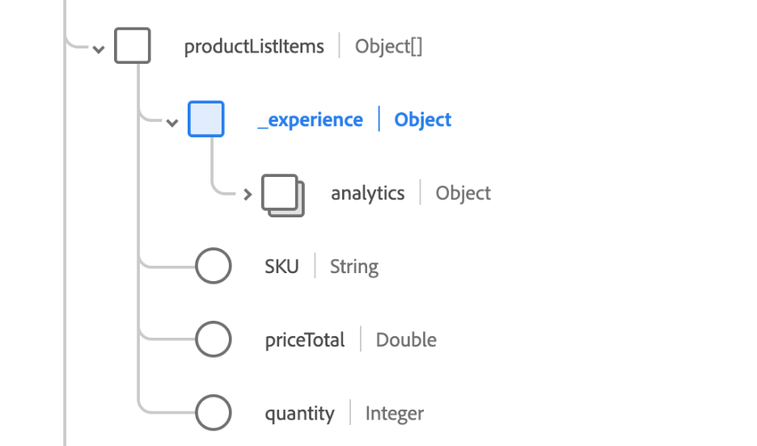

# Syntaxe SQL dans Query Service

Vous pouvez utiliser le langage SQL ANSI standard pour les instructions `SELECT` et d’autres commandes limitées dans Adobe Experience Platform Query Service. Ce document couvre la syntaxe SQL prise en charge par [!DNL Query Service].

## Requêtes SELECT {#select-queries}

La syntaxe suivante définit une requête `SELECT` prise en charge par [!DNL Query Service] :

```sql
[ WITH with_query [, ...] ]
SELECT [ ALL | DISTINCT [( expression [, ...] ) ] ]
    [ * | expression [ [ AS ] output_name ] [, ...] ]
    [ FROM from_item [, ...] ]
    [ SNAPSHOT { SINCE start_snapshot_id | AS OF end_snapshot_id | BETWEEN start_snapshot_id AND end_snapshot_id } ]
    [ WHERE condition ]
    [ GROUP BY grouping_element [, ...] ]
    [ HAVING condition [, ...] ]
    [ WINDOW window_name AS ( window_definition ) [, ...] ]
    [ { UNION | INTERSECT | EXCEPT | MINUS } [ ALL | DISTINCT ] select ]
    [ ORDER BY expression [ ASC | DESC | USING operator ] [ NULLS { FIRST | LAST } ] [, ...] ]
    [ LIMIT { count | ALL } ]
    [ OFFSET start ]
```

La section Onglets ci-dessous présente les options disponibles pour les mots-clés FROM, GROUP et WITH.

>[!BEGINTABS]

>[!TAB `from_item`]

```sql
table_name [ * ] [ [ AS ] alias [ ( column_alias [, ...] ) ] ]
```

```sql
[ LATERAL ] ( select ) [ AS ] alias [ ( column_alias [, ...] ) ]
```

```sql
with_query_name [ [ AS ] alias [ ( column_alias [, ...] ) ] ]
```

```sql
from_item [ NATURAL ] join_type from_item [ ON join_condition | USING ( join_column [, ...] ) ]
```

>[!TAB `grouping_element`]

```sql
( )
```

```sql
expression
```

```sql
( expression [, ...] )
```

```sql
ROLLUP ( { expression | ( expression [, ...] ) } [, ...] )
```

```sql
CUBE ( { expression | ( expression [, ...] ) } [, ...] )
```

```sql
GROUPING SETS ( grouping_element [, ...] )
```

>[!TAB `with_query`]

```sql
 with_query_name [ ( column_name [, ...] ) ] AS ( select | values )
```

>[!ENDTABS]

Les sous-sections suivantes fournissent des détails sur les clauses supplémentaires que vous pouvez utiliser dans vos requêtes, à condition qu’elles respectent le format décrit ci-dessus.

### Clause SNAPSHOT

Cette clause peut être utilisée pour lire de manière incrémentielle les données d’une table en fonction des ID d’instantané. Un ID d’instantané est un marqueur de point de contrôle représenté par un nombre de type Long appliqué à une table de lac de données chaque fois que des données y sont écrites. La clause `SNAPSHOT` s&#39;attache à la relation de table en regard de laquelle elle est utilisée.

```sql
    [ SNAPSHOT { SINCE start_snapshot_id | AS OF end_snapshot_id | BETWEEN start_snapshot_id AND end_snapshot_id } ]
```

#### Exemple

```sql
SELECT * FROM table_to_be_queried SNAPSHOT SINCE start_snapshot_id;

SELECT * FROM table_to_be_queried SNAPSHOT AS OF end_snapshot_id;

SELECT * FROM table_to_be_queried SNAPSHOT BETWEEN start_snapshot_id AND end_snapshot_id;

SELECT * FROM table_to_be_queried SNAPSHOT BETWEEN 'HEAD' AND start_snapshot_id;

SELECT * FROM table_to_be_queried SNAPSHOT BETWEEN end_snapshot_id AND 'TAIL';

SELECT * FROM (SELECT id FROM table_to_be_queried SNAPSHOT BETWEEN start_snapshot_id AND end_snapshot_id) C;

(SELECT * FROM table_to_be_queried SNAPSHOT SINCE start_snapshot_id) a
  INNER JOIN 
(SELECT * from table_to_be_joined SNAPSHOT AS OF your_chosen_snapshot_id) b 
  ON a.id = b.id;
```

>[!NOTE]
>
>Lors de l’utilisation de `HEAD` ou `TAIL` dans une clause de `SNAPSHOT`, vous devez les placer entre guillemets simples (par exemple, « HEAD », « TAIL »). Leur utilisation sans guillemets génère une erreur de syntaxe.

Le tableau ci-dessous explique la signification de chaque option de syntaxe dans la clause SNAPSHOT.

| Syntaxe | Signification |
|-------------------------------------------------------------------|------------------------------------------------------------------------------------------|
| `SINCE start_snapshot_id` | Lit les données à partir de l’ID d’instantané spécifié (exclusif). |
| `AS OF end_snapshot_id` | Lit les données telles qu’elles étaient à l’ID d’instantané spécifié (inclus). |
| `BETWEEN start_snapshot_id AND end_snapshot_id` | Lit les données comprises entre les ID d’instantané de début et de fin spécifiés. Il est exclusif de la `start_snapshot_id` et inclusif de la `end_snapshot_id`. |
| `BETWEEN HEAD AND start_snapshot_id` | Lit les données du début (avant le premier instantané) à l’ID d’instantané de début spécifié (inclus). Notez que cette opération renvoie uniquement des lignes dans `start_snapshot_id`. |
| `BETWEEN end_snapshot_id AND TAIL` | Lit les données juste après la `end_snapshot_id` spécifiée jusqu’à la fin du jeu de données (à l’exclusion de l’ID d’instantané). Cela signifie que si `end_snapshot_id` est le dernier instantané du jeu de données, la requête ne renvoie aucune ligne, car il n’existe aucun instantané au-delà de ce dernier. |
| `SINCE start_snapshot_id INNER JOIN table_to_be_joined AS OF your_chosen_snapshot_id ON table_to_be_queried.id = table_to_be_joined.id` | Lit les données à partir de l’ID d’instantané spécifié à partir de `table_to_be_queried` et le joint avec les données de `table_to_be_joined` telles qu’elles étaient au `your_chosen_snapshot_id`. La jointure est basée sur les identifiants correspondants des colonnes d&#39;identifiants des deux tables jointes. |

Une clause `SNAPSHOT` fonctionne avec une table ou un alias de table, mais pas au-dessus d&#39;une sous-requête ou d&#39;une vue. Une clause `SNAPSHOT` fonctionne partout où une requête `SELECT` sur une table peut être appliquée.

En outre, vous pouvez utiliser `HEAD` et `TAIL` comme valeurs de décalage spéciales pour les clauses de cliché. L&#39;utilisation de `HEAD` fait référence à un décalage avant le premier instantané, tandis que `TAIL` fait référence à un décalage après le dernier instantané.

>[!NOTE]
>
>Si vous effectuez une requête entre deux identifiants d’instantané, les deux scénarios suivants peuvent se produire si l’instantané de début a expiré et que l’indicateur de comportement de secours facultatif (`resolve_fallback_snapshot_on_failure`) est défini :
>
>- Si l’indicateur de comportement de secours facultatif est défini, Query Service choisit l’instantané disponible le plus ancien, le définit comme instantané de début et renvoie les données comprises entre l’instantané disponible le plus ancien et l’instantané de fin spécifié. Ces données **inclues** de l’instantané disponible le plus ancien.

### Clause WHERE

Par défaut, les correspondances générées par une clause `WHERE` sur une requête `SELECT` sont sensibles à la casse. Si vous souhaitez que les correspondances ne respectent pas la casse, vous pouvez utiliser le mot-clé `ILIKE` au lieu de `LIKE`.

```sql
    [ WHERE condition { LIKE | ILIKE | NOT LIKE | NOT ILIKE } pattern ]
```

La logique des clauses LIKE et ILIKE est expliquée dans le tableau suivant :

| Clause | Opérateur |
| ------ | -------- |
| `WHERE condition LIKE pattern` | `~~` |
| `WHERE condition NOT LIKE pattern` | `!~~` |
| `WHERE condition ILIKE pattern` | `~~*` |
| `WHERE condition NOT ILIKE pattern` | `!~~*` |

**Exemple**

```sql
SELECT * FROM Customers
WHERE CustomerName ILIKE 'a%';
```

Cette requête renvoie des clients dont le nom commence par « A » ou « a ».

### JOINTURE

Une requête `SELECT` qui utilise des jointures possède la syntaxe suivante :

```sql
SELECT statement
FROM statement
[JOIN | INNER JOIN | LEFT JOIN | LEFT OUTER JOIN | RIGHT JOIN | RIGHT OUTER JOIN | FULL JOIN | FULL OUTER JOIN]
ON join condition
```

### UNION, INTERSECT et EXCEPT

Les clauses `UNION`, `INTERSECT` et `EXCEPT` sont utilisées pour combiner ou exclure des lignes similaires de deux tableaux ou plus :

```sql
SELECT statement 1
[UNION | UNION ALL | UNION DISTINCT | INTERSECT | EXCEPT | MINUS]
SELECT statement 2
```

### CREATE TABLE AS SELECT {#create-table-as-select}

Utilisez la commande `CREATE TABLE AS SELECT` (CTAS) pour matérialiser les résultats d’une requête `SELECT` dans une nouvelle table. Cela s’avère utile pour créer des jeux de données transformés, effectuer des agrégations ou prévisualiser des données issues de l’ingénierie des fonctionnalités avant de les utiliser dans un modèle.

Si vous êtes prêt à entraîner un modèle à l&#39;aide de fonctions transformées, consultez la [documentation Modèles](../advanced-statistics/models.md) pour obtenir des conseils sur l&#39;utilisation de `CREATE MODEL` avec la clause `TRANSFORM`.

Vous pouvez éventuellement inclure une clause `TRANSFORM` pour appliquer une ou plusieurs fonctions d’ingénierie des fonctionnalités directement dans l’instruction CTAS. Utilisez `TRANSFORM` pour examiner les résultats de votre logique de transformation avant l’entraînement du modèle.

Cette syntaxe s&#39;applique à la fois aux tables permanentes et temporaires.

```sql
CREATE TABLE table_name 
  [WITH (schema='target_schema_title', rowvalidation='false', label='PROFILE')] 
  [TRANSFORM (transformFunctionExpression1, transformFunctionExpression2, ...)]
AS (select_query)
```

```sql
CREATE TEMP TABLE table_name 
  [WITH (schema='target_schema_title', rowvalidation='false', label='PROFILE')] 
  [TRANSFORM (transformFunctionExpression1, transformFunctionExpression2, ...)]
AS (select_query)
```

| Paramètre | Description |
| ----- | ----- |
| `schema` | Titre du schéma XDM. N’utilisez cette clause que si vous souhaitez associer la nouvelle table à un schéma XDM existant. |
| `rowvalidation` | (Facultatif) Active la validation au niveau des lignes pour chaque lot ingéré dans le jeu de données. La valeur par défaut est « true ». |
| `label` | (Facultatif) Utilisez la valeur `PROFILE` pour étiqueter le jeu de données comme étant activé pour l’ingestion de profils. |
| `transform` | (Facultatif) Applique des transformations d’ingénierie des fonctionnalités (telles que l’indexation de chaîne, l’encodage à chaud ou TF-IDF) avant de matérialiser le jeu de données. Cette clause est utilisée pour prévisualiser les fonctions transformées. Pour plus d’informations](#transform) consultez la documentation de la clause [`TRANSFORM` . |
| `select_query` | Instruction `SELECT` standard qui définit le jeu de données. Pour plus d’informations](#select-queries) consultez la section [`SELECT` des requêtes . |

>[!NOTE]
>
>L&#39;instruction `SELECT` doit inclure un alias pour les fonctions d&#39;agrégat telles que `COUNT`, `SUM` ou `MIN`. Vous pouvez fournir la requête `SELECT` avec ou sans parenthèses. Ceci s&#39;applique que la clause `TRANSFORM` soit utilisée ou non.

**Exemples**

Exemple de base utilisant une clause `TRANSFORM` pour prévisualiser quelques fonctionnalités techniques :

```sql
CREATE TABLE ctas_transform_table_vp14 
TRANSFORM(
  String_Indexer(additional_comments) si_add_comments,
  one_hot_encoder(si_add_comments) as ohe_add_comments,
  tokenizer(comments) as token_comments
)
AS SELECT * FROM movie_review_e2e_DND;
```

Exemple plus avancé avec plusieurs étapes de transformation :

```sql
CREATE TABLE ctas_transform_table 
TRANSFORM(
  String_Indexer(additional_comments) si_add_comments,
  one_hot_encoder(si_add_comments) as ohe_add_comments,
  tokenizer(comments) as token_comments,
  stop_words_remover(token_comments, array('and','very','much')) stp_token,
  ngram(stp_token, 3) ngram_token,
  tf_idf(ngram_token, 20) ngram_idf,
  count_vectorizer(stp_token, 13) cnt_vec_comments,
  tf_idf(token_comments, 10, 1) as cmts_idf
)
AS SELECT * FROM movie_review;
```

Exemple de table temporaire :

```sql
CREATE TEMP TABLE ctas_transform_table 
TRANSFORM(
  String_Indexer(additional_comments) si_add_comments,
  one_hot_encoder(si_add_comments) as ohe_add_comments,
  tokenizer(comments) as token_comments,
  stop_words_remover(token_comments, array('and','very','much')) stp_token,
  ngram(stp_token, 3) ngram_token,
  tf_idf(ngram_token, 20) ngram_idf,
  count_vectorizer(stp_token, 13) cnt_vec_comments,
  tf_idf(token_comments, 10, 1) as cmts_idf
)
AS SELECT * FROM movie_review;
```

#### Limites et comportement {#limitations-and-behavior}

Gardez à l’esprit les restrictions suivantes lors de l’utilisation de la clause `TRANSFORM` avec `CREATE TABLE` ou `CREATE TEMP TABLE` :

- Si une fonction de transformation génère une sortie vectorielle, elle est automatiquement convertie en tableau.
- Par conséquent, les tableaux créés à l’aide de `TRANSFORM` ne peuvent pas être utilisés directement dans les instructions `CREATE MODEL`. Vous devez redéfinir la logique de transformation lors de la création du modèle pour générer les vecteurs de fonction appropriés.
- Les transformations ne sont appliquées que lors de la création de la table. Les nouvelles données insérées dans la table avec `INSERT INTO` ne sont **pas automatiquement transformées**. Pour appliquer des transformations à de nouvelles données, vous devez recréer la table à l’aide de `CREATE TABLE AS SELECT` avec la clause `TRANSFORM`.
- Cette méthode est destinée à prévisualiser et valider les transformations à un moment donné, et non à créer des pipelines de transformation réutilisables.

>[!NOTE]
>
>For more details about available transformation functions and their output types, see [Feature transformation output data types](../advanced-statistics/feature-transformation.md#available-transformations).


### TRANSFORM clause {#transform}

Use the `TRANSFORM` clause to apply one or more feature engineering functions to a dataset before model training or table creation. This clause lets you preview, validate, or define the exact shape of your input features.

The `TRANSFORM` clause can be used in the following statements:

- `CREATE MODEL`
- `CREATE TABLE`
- `CREATE TEMP TABLE`

See the [Models documentation](../advanced-statistics/models.md) for detailed instructions on using CREATE MODEL, including how to define transformations, set model options, and configure training data.

For usage with `CREATE TABLE`, see the [CREATE TABLE AS SELECT section](#create-table-as-select).

#### CREATE MODEL example

```sql
CREATE MODEL review_model
TRANSFORM(
  String_Indexer(additional_comments) si_add_comments,
  one_hot_encoder(si_add_comments) AS ohe_add_comments,
  tokenizer(comments) AS token_comments,
  stop_words_remover(token_comments, array('and','very','much')) AS stp_token,
  ngram(stp_token, 3) AS ngram_token,
  tf_idf(ngram_token, 20) AS ngram_idf,
  count_vectorizer(stp_token, 13) AS cnt_vec_comments,
  tf_idf(token_comments, 10, 1) AS cmts_idf,
  vector_assembler(array(cmts_idf, viewsgot, ohe_add_comments, ngram_idf, cnt_vec_comments)) AS features
)
OPTIONS(MODEL_TYPE='logistic_reg', LABEL='reviews')
AS SELECT * FROM movie_review_e2e_DND;
```

#### Limites {#limitations}

The following limitations apply when using `TRANSFORM` with `CREATE TABLE`. See `CREATE TABLE AS SELECT` limitations and behavior section for a detailed explanation of how transformed data is stored, how vector outputs are handled, and why the results cannot be reused directly in model training workflows.

- Vector outputs are automatically converted to arrays, which cannot be used directly in `CREATE MODEL`.
- Transformation logic is not persisted as metadata and cannot be reused across batches.

## INSERT INTO

The `INSERT INTO` command is defined as follows:

>[!IMPORTANT]
>
>Query Service supports **append-only operations** using the ITAS engine. `INSERT INTO` is the only supported data manipulation command, **update** and **delete** operations are not available. To reflect changes in your data, insert new records that represent the desired state.

```sql
INSERT INTO table_name select_query
```

| Paramètres | Description |
| ----- | ----- |
| `table_name` | The name of the table that you want to insert the query into. |
| `select_query` | A `SELECT` statement. The syntax of the `SELECT` query can be found in the [SELECT queries section](#select-queries). |

**Exemple**

>[!NOTE]
>
>The following is a contrived example and simply for instructional purposes.

```sql
INSERT INTO Customers SELECT SupplierName, City, Country FROM OnlineCustomers;

INSERT INTO Customers AS (SELECT * from OnlineCustomers SNAPSHOT AS OF 345)
```

>[!INFO]
> 
>Do **not** enclose the `SELECT` statement in parentheses (). Also, the schema of the result of the `SELECT` statement must conform to that of the table defined in the `INSERT INTO` statement. You can provide a `SNAPSHOT` clause to read incremental deltas into the target table.

Most fields in a real XDM schema are not found at the root level and SQL does not permit the use of dot notation. To achieve a realistic result using nested fields, you must map each field in your `INSERT INTO` path.

Pour `INSERT INTO` des chemins imbriqués, utilisez la syntaxe suivante :

```sql
INSERT INTO [dataset]
SELECT struct([source field1] as [target field in schema],
[source field2] as [target field in schema],
[source field3] as [target field in schema]) [tenant name]
FROM [dataset]
```

**Exemple**

```sql
INSERT INTO Customers SELECT struct(SupplierName as Supplier, City as SupplierCity, Country as SupplierCountry) _Adobe FROM OnlineCustomers;
```

## DROP TABLE

La commande `DROP TABLE` supprime une table existante et le répertoire qui lui est associé du système de fichiers s&#39;il ne s&#39;agit pas d&#39;une table externe. Si la table n’existe pas, une exception se produit.

```sql
DROP TABLE [IF EXISTS] [db_name.]table_name
```

| Paramètres | Description |
| ------ | ------ |
| `IF EXISTS` | Si cette option est spécifiée, aucune exception n&#39;est générée si la table n&#39;existe **pas**. |

## CRÉER UNE BASE DE DONNÉES

La commande `CREATE DATABASE` permet de créer une base de données Azure Data Lake Storage (ADLS).

```sql
CREATE DATABASE [IF NOT EXISTS] db_name
```

## SUPPRIMER LA BASE DE DONNÉES

La commande `DROP DATABASE` supprime la base de données d&#39;une instance.

```sql
DROP DATABASE [IF EXISTS] db_name
```

| Paramètres | Description |
| ------ | ------ |
| `IF EXISTS` | Si cette option est spécifiée, aucune exception n&#39;est générée si la base de données n&#39;existe **pas**. |

## DÉPOSER LE SCHÉMA

La commande `DROP SCHEMA` supprime un schéma existant.

```sql
DROP SCHEMA [IF EXISTS] db_name.schema_name [ RESTRICT | CASCADE]
```

| Paramètres | Description |
| ------ | ------ |
| `IF EXISTS` | Si ce paramètre est spécifié et que le schéma n’existe **pas** aucune exception n’est générée. |
| `RESTRICT` | Valeur par défaut du mode. S’il est spécifié, le schéma n’est supprimé que s’il ne contient **pas** de tables. |
| `CASCADE` | S’il est spécifié, le schéma est déposé avec toutes les tables qu’il contient. |

## CREATE VIEW {#create-view}

Une vue SQL est une table virtuelle basée sur le jeu de résultats d&#39;une instruction SQL. Créez une vue avec l&#39;instruction `CREATE VIEW` et donnez-lui un nom. Vous pouvez ensuite utiliser ce nom pour faire référence aux résultats de la requête. Cela facilite la réutilisation des requêtes complexes.

La syntaxe suivante définit une requête `CREATE VIEW` pour un jeu de données. Ce jeu de données peut être un jeu de données de magasin ADLS ou accéléré.

```sql
CREATE VIEW view_name AS select_query
```

| Paramètres | Description |
| ------ | ------ |
| `view_name` | Nom de la vue à créer. |
| `select_query` | Une déclaration `SELECT`. La syntaxe de la requête `SELECT` se trouve dans la section [Requêtes SELECT](#select-queries). |

**Exemple**

```sql
CREATE VIEW V1 AS SELECT color, type FROM Inventory

CREATE OR REPLACE VIEW V1 AS SELECT model, version FROM Inventory
```

La syntaxe suivante définit une requête `CREATE VIEW` qui crée une vue dans le contexte d&#39;une base de données et d&#39;un schéma.

**Exemple**

```sql
CREATE VIEW db_name.schema_name.view_name AS select_query
CREATE OR REPLACE VIEW db_name.schema_name.view_name AS select_query
```

| Paramètres | Description |
| ------ | ------ |
| `db_name` | Nom de la base de données. |
| `schema_name` | The name of the schema. |
| `view_name` | The name of the view to be created. |
| `select_query` | Une déclaration `SELECT`. La syntaxe de la requête `SELECT` se trouve dans la section [Requêtes SELECT](#select-queries). |

**Exemple**

```sql
CREATE VIEW <dbV1 AS SELECT color, type FROM Inventory;

CREATE OR REPLACE VIEW V1 AS SELECT model, version FROM Inventory;
```

## SHOW VIEWS

The following query shows the list of views.

```sql
SHOW VIEWS;
```

```console
 Db Name  | Schema Name | Name  | Id       |  Dataset Dependencies | Views Dependencies | TYPE
|----------------------------------------------------------------------------------------------
 qsaccel  | profile_agg | view1 | view_id1 | dwh_dataset1          |                    | DWH
          |             | view2 | view_id2 | adls_dataset          | adls_views         | ADLS
(2 rows)
```

## DROP VIEW

The following syntax defines a `DROP VIEW` query:

```sql
DROP VIEW [IF EXISTS] view_name
```

| Paramètres | Description |
| ------ | ------ |
| `IF EXISTS` | If this is specified, no exception is thrown if the view does **not** exist. |
| `view_name` | The name of the view to be deleted. |

**Exemple**

```sql
DROP VIEW v1
DROP VIEW IF EXISTS v1
```

## Bloc anonyme {#anonymous-block}

An anonymous block consists of two sections: executable and exception-handling sections. In an anonymous block, the executable section is mandatory. However, the exception-handling section is optional.

The following example shows how to create a block with one or more statements to be executed together:

```sql
$$BEGIN
  statementList
[EXCEPTION exceptionHandler]
$$END

exceptionHandler:
      WHEN OTHERS
      THEN statementList

statementList:
    : (statement (';')) +
```

Below is an example using anonymous block.

```sql
$$BEGIN
   SET @v_snapshot_from = select parent_id  from (select history_meta('email_tracking_experience_event_dataset') ) tab where is_current;
   SET @v_snapshot_to = select snapshot_id from (select history_meta('email_tracking_experience_event_dataset') ) tab where is_current;
   SET @v_log_id = select now();
   CREATE TABLE tracking_email_id_incrementally
     AS SELECT _id AS id FROM email_tracking_experience_event_dataset SNAPSHOT BETWEEN @v_snapshot_from AND @v_snapshot_to;

EXCEPTION
  WHEN OTHERS THEN
    DROP TABLE IF EXISTS tracking_email_id_incrementally;
    SELECT 'ERROR';
$$END;
```

### Conditional statements in an anonymous block {#conditional-anonymous-block-statements}

The IF-THEN-ELSE control structure enables the conditional execution of a list of statements when a condition is evaluated as TRUE. This control structure is only applicable within an anonymous block. If this structure is used as a standalone command, it results in a syntax error (&quot;Invalid command outside Anonymous Block&quot;).

The code snippet below demonstrates the correct format for an IF-THEN-ELSE conditional statement in an anonymous block.

```javascript
IF booleanExpression THEN
   List of statements;
ELSEIF booleanExpression THEN 
   List of statements;
ELSEIF booleanExpression THEN 
   List of statements;
ELSE
   List of statements;
END IF
```

**Exemple**

The example below executes `SELECT 200;`.

```sql
$$BEGIN
    SET @V = SELECT 2;
    SELECT @V;
    IF @V = 1 THEN
       SELECT 100;
    ELSEIF @V = 2 THEN
       SELECT 200;
    ELSEIF @V = 3 THEN
       SELECT 300;
    ELSE    
       SELECT 'DEFAULT';
    END IF;   

 END$$;
```

This structure can be used with `raise_error();` to return a custom error message. The code block seen below terminates the anonymous block with &quot;custom error message&quot;.

**Exemple**

```sql
$$BEGIN
    SET @V = SELECT 5;
    SELECT @V;
    IF @V = 1 THEN
       SELECT 100;
    ELSEIF @V = 2 THEN
       SELECT 200;
    ELSEIF @V = 3 THEN
       SELECT 300;
    ELSE    
       SELECT raise_error('custom error message');
    END IF;   

 END$$;
```

#### Nested IF statements

Nested IF statements are supported within anonymous blocks.

**Exemple**

```sql
$$BEGIN
    SET @V = SELECT 1;
    IF @V = 1 THEN
       SELECT 100;
       IF @V > 0 THEN
         SELECT 1000;
       END IF;   
    END IF;   

 END$$; 
```

#### Exception blocks

Exception blocks are supported within anonymous blocks.

**Exemple**

```sql
$$BEGIN
    SET @V = SELECT 2;
    IF @V = 1 THEN
       SELECT 100;
    ELSEIF @V = 2 THEN
       SELECT raise_error(concat('custom-error for v= ', '@V' ));

    ELSEIF @V = 3 THEN
       SELECT 300;
    ELSE    
       SELECT 'DEFAULT';
    END IF;  
EXCEPTION WHEN OTHERS THEN 
  SELECT 'THERE WAS AN ERROR';    
 END$$;
```

### Auto to JSON {#auto-to-json}

Query Service supports an optional session-level setting to return top-level complex fields from interactive SELECT queries as JSON strings. The `auto_to_json` setting allows for data from complex fields to be returned as JSON then parsed into JSON objects using standard libraries.

SET the feature flag `auto_to_json` to true before executing your SELECT query that contains complex fields.

```sql
set auto_to_json=true; 
```

#### Before setting the `auto_to_json` flag

The following table provides an example query result before the `auto_to_json` setting is applied. The same SELECT query (as seen below) that targets a table with complex fields was used in both scenarios.

```sql
SELECT * FROM TABLE_WITH_COMPLEX_FIELDS LIMIT 2;
```

The results are as follows:

```console
                _id                |                                _experience                                 | application  |                   commerce                   | dataSource |                               device                               |                       endUserIDs                       |                                                                                                environment                                                                                                |                     identityMap                     |                              placeContext                               |   receivedTimestamp   |       timestamp       | userActivityRegion |                                         web                                          | _adcstageforpqs
|-----------------------------------+----------------------------------------------------------------------------+--------------+----------------------------------------------+------------+--------------------------------------------------------------------+--------------------------------------------------------+-----------------------------------------------------------------------------------------------------------------------------------------------------------------------------------------------------------+-----------------------------------------------------+-------------------------------------------------------------------------+-----------------------+-----------------------+--------------------+--------------------------------------------------------------------------------------+-----------------
 31892EE15DE00000-401D52664FF48A52 | ("("("(1,1)","(1,1)")","(-209479095,4085488201,-2105158467,2189808829)")") | (background) | (NULL,"(USD,NULL)",NULL,NULL,NULL,NULL,NULL) | (475341)   | (32,768,1024,205202,https://ns.adobe.com/xdm/external/deviceatlas) | ("("(31892EE080007B35-E6CE00000000000,"(AAID)",t)")")  | ("(en-US,f,f,t,1.6,"Mozilla/5.0 (iPhone; U; CPU iPhone OS 4_1 like Mac OS X; ja-jp) AppleWebKit/532.9 (KHTML, like Gecko) Version/4.0.5 Mobile/8B117 Safari/6531.22.7",490,1125)",xo.net,64.3.235.13)     | [AAID -> "{(31892EE080007B35-E6CE00000000000,t)}"]  | ("("(34.01,-84.0)",lawrenceville,US,524,30043,ga)",600)                 | 2022-09-02 19:47:14.0 | 2022-09-02 19:47:14.0 | (UT1)              | ("(f,Search Results,"(1.0)")","(http://www.google.com/search?ie=UTF-8&q=,internal)") |
 31892EE15DE00000-401B92664FF48AE8 | ("("("(1,1)","(1,1)")","(-209479095,4085488201,-2105158467,2189808829)")") | (background) | (NULL,"(USD,NULL)",NULL,NULL,NULL,NULL,NULL) | (475341)   | (32,768,1024,205202,https://ns.adobe.com/xdm/external/deviceatlas) | ("("(31892EE100007BF3-215FE00000000001,"(AAID)",t)")") | ("(en-US,f,f,t,1.5,"Mozilla/5.0 (iPhone; U; CPU iPhone OS 4_1 like Mac OS X; ja-jp) AppleWebKit/532.9 (KHTML, like Gecko) Version/4.0.5 Mobile/8B117 Safari/6531.22.7",768,556)",ntt.net,219.165.108.145) | [AAID -> "{(31892EE100007BF3-215FE00000000001,t)}"] | ("("(34.989999999999995,138.42)",shizuoka,JP,392005,420-0812,22)",-240) | 2022-09-02 19:47:14.0 | 2022-09-02 19:47:14.0 | (UT1)              | ("(f,Home - JJEsquire,"(1.0)")","(NULL,typed_bookmarked)")                           |
(2 rows)  
```

#### After setting the `auto_to_json` flag

The following table demonstrates the difference in results that the `auto_to_json` setting has on the resulting dataset. The same SELECT query was used in both scenarios.

```console
                _id                |   receivedTimestamp   |       timestamp       |                                                                                                                   _experience                                                                                                                   |           application            |             commerce             |    dataSource    |                                                                  device                                                                   |                                                   endUserIDs                                                   |                                                                                                                                                                                           environment                                                                                                                                                                                            |                             identityMap                              |                                                                                            placeContext                                                                                            |      userActivityRegion      |                                                                                     web                                                                                      | _adcstageforpqs
|-----------------------------------+-----------------------+-----------------------+-------------------------------------------------------------------------------------------------------------------------------------------------------------------------------------------------------------------------------------------------+----------------------------------+----------------------------------+------------------+-------------------------------------------------------------------------------------------------------------------------------------------+----------------------------------------------------------------------------------------------------------------+--------------------------------------------------------------------------------------------------------------------------------------------------------------------------------------------------------------------------------------------------------------------------------------------------------------------------------------------------------------------------------------------------+----------------------------------------------------------------------+----------------------------------------------------------------------------------------------------------------------------------------------------------------------------------------------------+------------------------------+------------------------------------------------------------------------------------------------------------------------------------------------------------------------------+-----------------
 31892EE15DE00000-401D52664FF48A52 | 2022-09-02 19:47:14.0 | 2022-09-02 19:47:14.0 | {"analytics":{"customDimensions":{"eVars":{"eVar1":"1","eVar2":"1"},"props":{"prop1":"1","prop2":"1"}},"environment":{"browserID":-209479095,"browserIDStr":"4085488201","operatingSystemID":-2105158467,"operatingSystemIDStr":"2189808829"}}} | {"userPerspective":"background"} | {"order":{"currencyCode":"USD"}} | {"_id":"475341"} | {"colorDepth":32,"screenHeight":768,"screenWidth":1024,"typeID":"205202","typeIDService":"https://ns.adobe.com/xdm/external/deviceatlas"} | {"_experience":{"aaid":{"id":"31892EE080007B35-E6CE00000000000","namespace":{"code":"AAID"},"primary":true}}}  | {"browserDetails":{"acceptLanguage":"en-US","cookiesEnabled":false,"javaEnabled":false,"javaScriptEnabled":true,"javaScriptVersion":"1.6","userAgent":"Mozilla/5.0 (iPhone; U; CPU iPhone OS 4_1 like Mac OS X; ja-jp) AppleWebKit/532.9 (KHTML, like Gecko) Version/4.0.5 Mobile/8B117 Safari/6531.22.7","viewportHeight":490,"viewportWidth":1125},"domain":"xo.net","ipV4":"64.3.235.13"}     | {"AAID":[{"id":"31892EE080007B35-E6CE00000000000","primary":true}]}  | {"geo":{"_schema":{"latitude":34.01,"longitude":-84.0},"city":"lawrenceville","countryCode":"US","dmaID":524,"postalCode":"30043","stateProvince":"ga"},"localTimezoneOffset":600}                 | {"dataCenterLocation":"UT1"} | {"webPageDetails":{"isHomePage":false,"name":"Search Results","pageViews":{"value":1.0}},"webReferrer":{"URL":"http://www.google.com/search?ie=UTF-8&q=","type":"internal"}} |
 31892EE15DE00000-401B92664FF48AE8 | 2022-09-02 19:47:14.0 | 2022-09-02 19:47:14.0 | {"analytics":{"customDimensions":{"eVars":{"eVar1":"1","eVar2":"1"},"props":{"prop1":"1","prop2":"1"}},"environment":{"browserID":-209479095,"browserIDStr":"4085488201","operatingSystemID":-2105158467,"operatingSystemIDStr":"2189808829"}}} | {"userPerspective":"background"} | {"order":{"currencyCode":"USD"}} | {"_id":"475341"} | {"colorDepth":32,"screenHeight":768,"screenWidth":1024,"typeID":"205202","typeIDService":"https://ns.adobe.com/xdm/external/deviceatlas"} | {"_experience":{"aaid":{"id":"31892EE100007BF3-215FE00000000001","namespace":{"code":"AAID"},"primary":true}}} | {"browserDetails":{"acceptLanguage":"en-US","cookiesEnabled":false,"javaEnabled":false,"javaScriptEnabled":true,"javaScriptVersion":"1.5","userAgent":"Mozilla/5.0 (iPhone; U; CPU iPhone OS 4_1 like Mac OS X; ja-jp) AppleWebKit/532.9 (KHTML, like Gecko) Version/4.0.5 Mobile/8B117 Safari/6531.22.7","viewportHeight":768,"viewportWidth":556},"domain":"ntt.net","ipV4":"219.165.108.145"} | {"AAID":[{"id":"31892EE100007BF3-215FE00000000001","primary":true}]} | {"geo":{"_schema":{"latitude":34.989999999999995,"longitude":138.42},"city":"shizuoka","countryCode":"JP","dmaID":392005,"postalCode":"420-0812","stateProvince":"22"},"localTimezoneOffset":-240} | {"dataCenterLocation":"UT1"} | {"webPageDetails":{"isHomePage":false,"name":"Home - JJEsquire","pageViews":{"value":1.0}},"webReferrer":{"type":"typed_bookmarked"}}                                        |
(2 rows)
```

### Resolve fallback snapshot on failure {#resolve-fallback-snapshot-on-failure}

The `resolve_fallback_snapshot_on_failure` option is used to resolve the issue of an expired snapshot ID.

Set the `resolve_fallback_snapshot_on_failure` option to true to override a snapshot with a previous snapshot ID.

```sql
SET resolve_fallback_snapshot_on_failure=true;
```

La ligne de code suivante remplace l’`@from_snapshot_id` par l’`snapshot_id` disponible en premier à partir des métadonnées.

```sql
$$ BEGIN
    SET resolve_fallback_snapshot_on_failure=true;
    SET @from_snapshot_id = SELECT coalesce(last_snapshot_id, 'HEAD') FROM checkpoint_log a JOIN
                            (SELECT MAX(process_timestamp)process_timestamp FROM checkpoint_log
                                WHERE process_name = 'DIM_TABLE_ABC' AND process_status = 'SUCCESSFUL' )b
                                on a.process_timestamp=b.process_timestamp;
    SET @to_snapshot_id = SELECT snapshot_id FROM (SELECT history_meta('DIM_TABLE_ABC')) WHERE  is_current = true;
    SET @last_updated_timestamp= SELECT CURRENT_TIMESTAMP;
    INSERT INTO DIM_TABLE_ABC_Incremental
     SELECT  *  FROM DIM_TABLE_ABC SNAPSHOT BETWEEN @from_snapshot_id AND @to_snapshot_id WHERE NOT EXISTS (SELECT _id FROM DIM_TABLE_ABC_Incremental a WHERE _id=a._id);

Insert Into
   checkpoint_log
   SELECT
       'DIM_TABLE_ABC' process_name,
       'SUCCESSFUL' process_status,
      cast( @to_snapshot_id AS string) last_snapshot_id,
      cast( @last_updated_timestamp AS TIMESTAMP) process_timestamp;
EXCEPTION
  WHEN OTHERS THEN
    SELECT 'ERROR';
END
$$;
```


## Organisation des ressources de données

It is important to logically organize your data assets within the Adobe Experience Platform data lake as they grow. Query Service extends SQL constructs that enable you to logically group data assets within a sandbox. This method of organization allows for the sharing of data assets between schemas without the need to move them physically.

The following SQL constructs using standard SQL syntax are supported for you to logically organize your data.

```SQL
CREATE DATABASE dg1;
CREATE SCHEMA dg1.schema1;
CREATE table t1 ...;
CREATE view v1 ...;
ALTER TABLE t1 ADD PRIMARY KEY (c1) NOT ENFORCED;
ALTER TABLE t2 ADD FOREIGN KEY (c1) REFERENCES t1(c1) NOT ENFORCED;
```

See the [logical organization of data assets](../best-practices/organize-data-assets.md) guide for a more detailed explanation on Query Service best practices.

## Le tableau existe

The `table_exists` SQL command is used to confirm whether a table currently exists in the system. La commande renvoie une valeur booléenne : `true` si le tableau **existe** et `false` si le tableau **n’existe pas**.

By validating whether a table exists before running the statements, the `table_exists` feature simplifies the process of writing an anonymous block to cover both the `CREATE` and `INSERT INTO` use cases.

The following syntax defines the `table_exists` command:

```SQL
$$
BEGIN

#Set mytableexist to true if the table already exists.
SET @mytableexist = SELECT table_exists('target_table_name');

#Create the table if it does not already exist (this is a one time operation).
CREATE TABLE IF NOT EXISTS target_table_name AS
  SELECT *
  FROM   profile_dim_date limit 10;

#Insert data only if the table already exists. Check if @mytableexist = 'true'
 INSERT INTO target_table_name           (
                     select *
                     from   profile_dim_date
                     WHERE  @mytableexist = 'true' limit 20
              ) ;
EXCEPTION
WHEN OTHERS THEN SELECT 'ERROR';

END $$; 
```

## Inline {#inline}

The `inline` function separates the elements of an array of structs and generates the values into a table. Il peut uniquement être placé dans la liste `SELECT` ou dans un `LATERAL VIEW`.

La fonction `inline` **ne peut pas** peut être placée dans une liste de sélection où il existe d&#39;autres fonctions de générateur.

Par défaut, les colonnes produites sont nommées « col1 », « col2 », etc. Si l’expression est `NULL`, aucune ligne n’est générée.

>[!TIP]
>
>Les noms des colonnes peuvent être renommés à l’aide de la commande `RENAME`.

**Exemple**

```sql
> SELECT inline(array(struct(1, 'a'), struct(2, 'b'))), 'Spark SQL';
```

L’exemple renvoie ce qui suit :

```text
1  a Spark SQL
2  b Spark SQL
```

Ce deuxième example illustre en outre le concept et l&#39;application de la fonction `inline`. Le modèle de données de l’exemple est illustré dans l’image ci-dessous.



**Exemple**

```sql
select inline(productListItems) from source_dataset limit 10;
```

Les valeurs extraites de la `source_dataset` sont utilisées pour renseigner la table cible.

| SKU | _experience | quantité | priceTotal |
|---------------------|-----------------------------------|----------|--------------|
| product-id-1 | (« (« (« (A,pass,B,NULL) ») ») | 5 | 10,5 |
| product-id-5 | (« (« (« (A, pass, B,NULL) ») ») |          |              |
| product-id-2 | (« (« (« (AF, C, D,NULL) ») ») | 6 | 40 |
| product-id-4 | (« (« (« (BM, pass, NA,NULL) ») ») | 3 | 12 |

## SET

La commande `SET` définit une propriété et renvoie la valeur d’une propriété existante ou répertorie toutes les propriétés existantes. Si une valeur est fournie pour une clé de propriété existante, l’ancienne valeur est remplacée.

```sql
SET property_key = property_value
```

| Paramètres | Description |
| ------ | ------ |
| `property_key` | Nom de la propriété que vous souhaitez répertorier ou modifier. |
| `property_value` | Valeur pour laquelle vous souhaitez définir la propriété. |

Pour renvoyer la valeur de n’importe quel paramètre, utilisez `SET [property key]` sans `property_value`.

## [!DNL PostgreSQL] des commandes

Les sous-sections ci-dessous couvrent les commandes [!DNL PostgreSQL] prises en charge par Query Service.

### ANALYSER LE TABLEAU {#analyze-table}

La commande `ANALYZE TABLE` effectue une analyse de répartition et des calculs statistiques pour la ou les tables nommées. L’utilisation de `ANALYZE TABLE` varie selon que les jeux de données sont stockés dans la [boutique accélérée](#compute-statistics-accelerated-store) ou dans le [lac de données](#compute-statistics-data-lake). Voir leurs sections respectives pour plus d’informations sur son utilisation.

#### COMPUTE STATISTICS sur la boutique accélérée {#compute-statistics-accelerated-store}

La commande `ANALYZE TABLE` calcule les statistiques d’une table sur la boutique accélérée. Les statistiques sont calculées sur les requêtes CTAS ou ITAS exécutées pour une table donnée sur la boutique accélérée.

**Exemple**

```sql
ANALYZE TABLE <original_table_name>
```

Voici une liste des calculs statistiques disponibles après avoir utilisé la commande `ANALYZE TABLE` :-

| Valeurs calculées | Description |
|---|---|
| `field` | Nom de la colonne dans un tableau. |
| `data-type` | Type de données acceptable pour chaque colonne. |
| `count` | Nombre de lignes contenant une valeur non nulle pour ce champ. |
| `distinct-count` | Nombre de valeurs uniques ou distinctes pour ce champ. |
| `missing` | Nombre de lignes ayant une valeur nulle pour ce champ. |
| `max` | Valeur maximale du tableau analysé. |
| `min` | Valeur minimale du tableau analysé. |
| `mean` | Valeur moyenne du tableau analysé. |
| `stdev` | Écart type du tableau analysé. |

#### CALCULER LES STATISTIQUES sur le lac de données {#compute-statistics-data-lake}

Vous pouvez désormais calculer les statistiques au niveau des colonnes sur les jeux de données [!DNL Azure Data Lake Storage] (ADLS) avec la commande SQL `COMPUTE STATISTICS`. Calculer les statistiques des colonnes sur l’ensemble du jeu de données, un sous-ensemble d’un jeu de données, toutes les colonnes ou un sous-ensemble de colonnes.

`COMPUTE STATISTICS` étend la commande `ANALYZE TABLE`. Toutefois, les commandes `COMPUTE STATISTICS`, `FILTERCONTEXT` et `FOR COLUMNS` ne sont pas prises en charge sur les tables de la boutique accélérée. Ces extensions pour la commande `ANALYZE TABLE` ne sont actuellement prises en charge que pour les tables ADLS.

**Exemple**

```sql
ANALYZE TABLE tableName FILTERCONTEXT (timestamp >= to_timestamp('2023-04-01 00:00:00') and timestamp <= to_timestamp('2023-04-05 00:00:00')) COMPUTE STATISTICS  FOR COLUMNS (commerce, id, timestamp);
```

La commande `FILTER CONTEXT` calcule les statistiques sur un sous-ensemble du jeu de données en fonction de la condition de filtre fournie. The `FOR COLUMNS` command targets specific columns for analysis.

>[!NOTE]
>
>The `Statistics ID` and the statistics generated are only valid for each session and cannot be accessed across different PSQL sessions.<br><br>Limitations:<ul><li>Statistics generation is not supported for array or map data types</li><li>Computed statistics are **not** persisted across sessions.</li></ul><br><br>Options :<br><ul><li>`skip_stats_for_complex_datatypes`</li></ul><br>By default, the flag is set to true. As a result, when statistics are requested on a datatype that is not supported, it does not error out but silently skips fields with the unsupported datatypes.<br>To enable notifications on errors when statistics are requested on unsupported datatype, use: `SET skip_stats_for_complex_datatypes = false`.

The console output appears as seen below.

```console
|     Statistics ID      |
| ---------------------- |
| adc_geometric_stats_1  |
(1 row)
```

You can then query the computed statistics directly by referencing the `Statistics ID`. Use the the `Statistics ID` or the alias name as shown in the example statement below, to view the output in full. To learn more about this feature, see the [alias name documentation](../key-concepts/dataset-statistics.md#alias-name).

```sql
-- This statement gets the statistics generated for `alias adc_geometric_stats_1`.
SELECT * FROM adc_geometric_stats_1;
```

Use the `SHOW STATISTICS` command to display the metadata for all the temporary statistics generated in the session. Vous pouvez ainsi affiner la portée de votre analyse statistique.

```sql
SHOW STATISTICS;
```

An example output of SHOW STATISTICS is seen below.

```console
      statsId         |   tableName   | columnSet |         filterContext       |      timestamp
|----------------------+---------------+-----------+-----------------------------+--------------------
adc_geometric_stats_1 | adc_geometric |   (age)   |                             | 25/06/2023 09:22:26
demo_table_stats_1    |  demo_table   |    (*)    |       ((age > 25))          | 25/06/2023 12:50:26
age_stats             | castedtitanic |   (age)   | ((age > 25) AND (age < 40)) | 25/06/2023 09:22:26
```

See the [dataset statistics documentation](../key-concepts/dataset-statistics.md) for more information.

#### TABLESAMPLE {#tablesample}

Le service de requête Adobe Experience Platform fournit des exemples de jeux de données dans le cadre de ses fonctionnalités approximatives de traitement des requêtes.

Data set samples are best used when you do not need an exact answer for an aggregate operation over a dataset. To conduct more efficient exploratory queries on large datasets by issuing an approximate query to return an approximate answer, use the `TABLESAMPLE` feature.

Sample datasets are created with uniform random samples from existing [!DNL Azure Data Lake Storage] (ADLS) datasets, using only a percentage of records from the original. The dataset sample feature extends the `ANALYZE TABLE` command with the `TABLESAMPLE` and `SAMPLERATE` SQL commands.

In the example below, line one demonstrates how to compute a 5% sample of the table. Line two demonstrates how to compute a 5% sample from a  filtered view of the data within the table.

**Exemple**

```sql {line-numbers="true"}
ANALYZE TABLE tableName TABLESAMPLE SAMPLERATE 5;
ANALYZE TABLE tableName FILTERCONTEXT (timestamp >= to_timestamp('2023-01-01')) TABLESAMPLE SAMPLERATE 5:
```

See the [dataset samples documentation](../key-concepts/dataset-samples.md) for more information.

### BEGIN

The `BEGIN` command, or alternatively the `BEGIN WORK` or `BEGIN TRANSACTION` command, initiates a transaction block. Any statements that are inputted after the begin command will be executed in a single transaction until an explicit COMMIT or ROLLBACK command is given. This command is the same as `START TRANSACTION`.

```sql
BEGIN
BEGIN WORK
BEGIN TRANSACTION
```

### CLOSE

La commande `CLOSE` libère les ressources associées à un curseur ouvert. Une fois le curseur fermé, aucune opération n’est autorisée sur celui-ci. Un curseur doit être fermé lorsqu’il n’est plus nécessaire.

```sql
CLOSE name
CLOSE ALL
```

Si `CLOSE name` est utilisé, `name` représente le nom d&#39;un curseur ouvert qui doit être fermé. Si `CLOSE ALL` est utilisé, tous les curseurs ouverts sont fermés.

### DEALLOCATE

Pour désallouer une instruction SQL préparée précédemment, utilisez la commande `DEALLOCATE`. Si vous n’avez pas désaffecté explicitement une instruction préparée, elle est désaffectée à la fin de la session. Vous trouverez plus d&#39;informations sur les instructions préparées dans la section [commande PREPARE](#prepare).

```sql
DEALLOCATE name
DEALLOCATE ALL
```

Si `DEALLOCATE name` est utilisé, `name` représente le nom de l&#39;instruction préparée qui doit être distribuée. Si `DEALLOCATE ALL` est utilisé, toutes les instructions préparées sont désallouées.

### DECLARE

La commande `DECLARE` permet à l’utilisateur de créer un curseur qui peut être utilisé pour récupérer un petit nombre de lignes dans une requête plus volumineuse. Une fois le curseur créé, les lignes sont récupérées à l’aide de `FETCH`.

```sql
DECLARE name CURSOR FOR query
```

| Paramètres | Description |
| ------ | ------ |
| `name` | Nom du curseur à créer. |
| `query` | Commande `SELECT` ou `VALUES` qui fournit les lignes à renvoyer par le curseur. |

### EXECUTE

La commande `EXECUTE` est utilisée pour exécuter une instruction préparée précédemment. Comme les instructions préparées n&#39;existent que pendant une session, elles doivent avoir été créées par une instruction `PREPARE` exécutée plus tôt dans la session en cours. Vous trouverez plus d&#39;informations sur l&#39;utilisation des instructions préparées dans la section [`PREPARE` command](#prepare).

Si l&#39;instruction `PREPARE` qui a créé l&#39;instruction spécifiait certains paramètres, un jeu de paramètres compatible doit être transmis à l&#39;instruction `EXECUTE`. Si ces paramètres ne sont pas transmis, une erreur est générée.

```sql
EXECUTE name [ ( parameter ) ]
```

| Paramètres | Description |
| ------ | ------ |
| `name` | Nom de l’instruction préparée à exécuter. |
| `parameter` | Valeur réelle d’un paramètre pour l’instruction préparée. Il doit s&#39;agir d&#39;une expression produisant une valeur compatible avec le type de données de ce paramètre, tel que déterminé lors de la création de l&#39;instruction préparée. S’il existe plusieurs paramètres pour l’instruction préparée, ils sont séparés par des virgules. |

### EXPLAIN

La commande `EXPLAIN` affiche le plan d&#39;exécution de l&#39;instruction fournie. Le plan d’exécution indique comment les tables référencées par l’instruction seront analysées. Si plusieurs tables sont référencées, cela indique quels algorithmes de jointure sont utilisés pour rassembler les lignes requises de chaque table d’entrée.

```sql
EXPLAIN statement
```

Pour définir le format de la réponse, utilisez le mot-clé `FORMAT` avec la commande `EXPLAIN`.

```sql
EXPLAIN FORMAT { TEXT | JSON } statement
```

| Paramètres | Description |
| ------ | ------ |
| `FORMAT` | Utilisez la commande `FORMAT` pour spécifier le format de sortie. Les options disponibles sont `TEXT` ou `JSON`. Les sorties autres que text contiennent les mêmes informations que le format de sortie text, mais les programmes pourront plus facilement les analyser. Ce paramètre est défini par défaut sur `TEXT`. |
| `statement` | Toute instruction `SELECT`, `INSERT`, `UPDATE`, `DELETE`, `VALUES`, `EXECUTE`, `DECLARE`, `CREATE TABLE AS` ou `CREATE MATERIALIZED VIEW AS` dont vous souhaitez afficher le plan d’exécution. |

>[!IMPORTANT]
>
>Toute sortie renvoyée par une instruction `SELECT` est ignorée lors de l’exécution avec le mot-clé `EXPLAIN`. Les autres effets indésirables de l’instruction se produisent comme d’habitude.

**Exemple**

L’exemple suivant illustre le plan d’une requête simple sur une table avec une seule colonne `integer` et 10000 lignes :

```sql
EXPLAIN SELECT * FROM foo;
```

```console
                       QUERY PLAN
|---------------------------------------------------------
 Seq Scan on foo (dataSetId = "6307eb92f90c501e072f8457", dataSetName = "foo") [0,1000000242,6973776840203d3d,6e616c58206c6153,6c6c6f430a3d4d20,74696d674c746365]
(1 row)
```

### FETCH

La commande `FETCH` récupère les lignes à l&#39;aide d&#39;un curseur créé précédemment.

```sql
FETCH num_of_rows [ IN | FROM ] cursor_name
```

| Paramètres | Description |
| ------ | ------ |
| `num_of_rows` | Nombre de lignes à récupérer. |
| `cursor_name` | Nom du curseur à partir duquel vous récupérez des informations. |

### PREPARE {#prepare}

La commande `PREPARE` permet de créer une instruction préparée. Une instruction préparée est un objet côté serveur qui peut être utilisé pour modéliser des instructions SQL similaires.

Les instructions préparées peuvent prendre des paramètres qui sont des valeurs qui sont remplacées dans l&#39;instruction lors de son exécution. Les paramètres sont référencés par position, en utilisant $1, $2, etc., lors de l&#39;utilisation d&#39;instructions préparées.

Vous pouvez éventuellement spécifier une liste de types de données de paramètre. Si le type de données d’un paramètre n’est pas répertorié, il peut être déduit du contexte.

```sql
PREPARE name [ ( data_type [, ...] ) ] AS SELECT
```

| Paramètres | Description |
| ------ | ------ |
| `name` | Nom de l&#39;instruction préparée. |
| `data_type` | Types de données des paramètres de l&#39;instruction préparée. Si le type de données d’un paramètre n’est pas répertorié, il peut être déduit du contexte. Si vous devez ajouter plusieurs types de données, vous pouvez les ajouter dans une liste séparée par des virgules. |

### RESTAURER

La commande `ROLLBACK` annule la transaction en cours et ignore toutes les mises à jour effectuées par la transaction.

```sql
ROLLBACK
ROLLBACK WORK
```

### SELECT INTO

La commande `SELECT INTO` crée une table et la remplit avec les données calculées par une requête. Les données ne sont pas renvoyées au client, comme c’est le cas avec une commande `SELECT` normale. Les colonnes du nouveau tableau portent les noms et les types de données associés aux colonnes de sortie de la commande `SELECT`.

```sql
[ WITH [ RECURSIVE ] with_query [, ...] ]
SELECT [ ALL | DISTINCT [ ON ( expression [, ...] ) ] ]
    * | expression [ [ AS ] output_name ] [, ...]
    INTO [ TEMPORARY | TEMP | UNLOGGED ] [ TABLE ] new_table
    [ FROM from_item [, ...] ]
    [ WHERE condition ]
    [ GROUP BY expression [, ...] ]
    [ HAVING condition [, ...] ]
    [ WINDOW window_name AS ( window_definition ) [, ...] ]
    [ { UNION | INTERSECT | EXCEPT } [ ALL | DISTINCT ] select ]
    [ ORDER BY expression [ ASC | DESC | USING operator ] [ NULLS { FIRST | LAST } ] [, ...] ]
    [ LIMIT { count | ALL } ]
    [ OFFSET start [ ROW | ROWS ] ]
    [ FETCH { FIRST | NEXT } [ count ] { ROW | ROWS } ONLY ]
    [ FOR { UPDATE | SHARE } [ OF table_name [, ...] ] [ NOWAIT ] [...] ]
```

Vous trouverez plus d’informations sur les paramètres de requête SELECT standard dans la section [Requête SELECT](#select-queries). Cette section répertorie uniquement les paramètres exclusifs à la commande `SELECT INTO`.

| Paramètres | Description |
| ------ | ------ |
| `TEMPORARY` ou `TEMP`. | Paramètre facultatif. Si le paramètre est spécifié, la table créée est une table temporaire. |
| `UNLOGGED` | Paramètre facultatif. Si le paramètre est spécifié, la table créée est une table non enregistrée. Vous trouverez plus d’informations sur les tables non enregistrées dans la [[!DNL PostgreSQL] documentation](https://www.postgresql.org/docs/current/sql-createtable.html). |
| `new_table` | Nom de la table à créer. |

**Exemple**

La requête suivante crée un `films_recent` de table composé uniquement des entrées récentes du `films` de table :

```sql
SELECT * INTO films_recent FROM films WHERE date_prod >= '2002-01-01';
```

### SHOW

La commande `SHOW` affiche le paramètre actuel des paramètres d’exécution. Ces variables peuvent être définies à l’aide de l’instruction `SET`, en modifiant le fichier de configuration `postgresql.conf`, par le biais de la variable d’environnement `PGOPTIONS` (lors de l’utilisation de libpq ou d’une application basée sur libpq) ou par des indicateurs de ligne de commande lors du démarrage du serveur Postgres.

```sql
SHOW name
SHOW ALL
```

| Paramètres | Description |
| ------ | ------ |
| `name` | Nom du paramètre d’exécution à propos duquel vous souhaitez obtenir des informations. Les valeurs possibles pour le paramètre d’exécution sont les suivantes :<br>`SERVER_VERSION` : ce paramètre indique le numéro de version du serveur.<br>`SERVER_ENCODING` : ce paramètre indique le codage du jeu de caractères côté serveur.<br>`LC_COLLATE` : ce paramètre indique le paramètre régional de la base de données pour le classement (tri des textes).<br>`LC_CTYPE` : ce paramètre indique le paramètre régional de la base de données pour la classification des caractères.<br>`IS_SUPERUSER` : ce paramètre indique si le rôle actuel dispose de privilèges de superutilisateur. |
| `ALL` | Affichez les valeurs de tous les paramètres de configuration avec des descriptions. |

**Exemple**

La requête suivante affiche le paramètre actuel du `DateStyle` de paramètres.

```sql
SHOW DateStyle;
```

```console
 DateStyle
|-----------
 ISO, MDY
(1 row)
```

### COPIER

La commande `COPY` duplique la sortie de toute requête `SELECT` vers un emplacement spécifié. L’utilisateur doit avoir accès à cet emplacement pour que cette commande réussisse.

```sql
COPY query
    TO '%scratch_space%/folder_location'
    [  WITH FORMAT 'format_name']
```

| Paramètres | Description |
| ------ | ------ |
| `query` | Requête à copier. |
| `format_name` | Format dans lequel vous souhaitez copier la requête. Le `format_name` peut être `parquet`, `csv` ou `json`. Par défaut, la valeur est `parquet`. |

>[!NOTE]
>
>Le chemin de sortie complet est `adl://<ADLS_URI>/users/<USER_ID>/acp_foundation_queryService/folder_location/<QUERY_ID>`

### ALTER TABLE {#alter-table}

La commande `ALTER TABLE` permet d’ajouter ou de supprimer des contraintes de clé primaire ou étrangère et d’ajouter des colonnes au tableau.

#### AJOUTER OU SUPPRIMER UNE CONTRAINTE

Les requêtes SQL suivantes présentent des exemples d’ajout ou de suppression de contraintes dans une table. Les contraintes de clé de Principal et de clé étrangère peuvent être ajoutées à plusieurs colonnes avec des valeurs séparées par des virgules. Vous pouvez créer des clés composites en transmettant plusieurs valeurs de nom de colonne, comme illustré dans les exemples ci-dessous.

**Définir des clés primaires ou composites**

```sql
ALTER TABLE table_name ADD CONSTRAINT PRIMARY KEY ( column_name ) NAMESPACE namespace

ALTER TABLE table_name ADD CONSTRAINT PRIMARY KEY ( column_name1, column_name2 ) NAMESPACE namespace
```

**Définir une relation entre des tables basée sur une ou plusieurs clés**

```sql
ALTER TABLE table_name ADD CONSTRAINT FOREIGN KEY ( column_name ) REFERENCES referenced_table_name ( primary_column_name )

ALTER TABLE table_name ADD CONSTRAINT FOREIGN KEY ( column_name1, column_name2 ) REFERENCES referenced_table_name ( primary_column_name1, primary_column_name2 )
```

**Définir une colonne d’identité**

```sql
ALTER TABLE table_name ADD CONSTRAINT PRIMARY IDENTITY ( column_name ) NAMESPACE namespace

ALTER TABLE table_name ADD CONSTRAINT IDENTITY ( column_name ) NAMESPACE namespace
```

**Déposer une contrainte/relation/identité**

```sql
ALTER TABLE table_name DROP CONSTRAINT PRIMARY KEY ( column_name )

ALTER TABLE table_name DROP CONSTRAINT PRIMARY KEY ( column_name1, column_name2 )

ALTER TABLE table_name DROP CONSTRAINT FOREIGN KEY ( column_name )

ALTER TABLE table_name DROP CONSTRAINT FOREIGN KEY ( column_name1, column_name2 )

ALTER TABLE table_name DROP CONSTRAINT PRIMARY IDENTITY ( column_name )

ALTER TABLE table_name DROP CONSTRAINT IDENTITY ( column_name )
```

| Paramètres | Description |
| ------ | ------ |
| `table_name` | Nom de la table que vous modifiez. |
| `column_name` | Nom de la colonne à laquelle vous ajoutez une contrainte. |
| `referenced_table_name` | Nom de la table référencée par la clé étrangère. |
| `primary_column_name` | Nom de la colonne référencée par la clé étrangère. |

>[!NOTE]
>
>Le schéma de la table doit être unique et non partagé entre plusieurs tables. En outre, l’espace de noms est obligatoire pour les contraintes de clé primaire, d’identité primaire et d’identité.

#### Ajouter ou supprimer des identités principales et secondaires

Pour ajouter ou supprimer des contraintes pour les colonnes du tableau d’identités principal et secondaire, utilisez la commande `ALTER TABLE`.

Les exemples suivants ajoutent une identité principale et une identité secondaire en ajoutant des contraintes.

```sql
ALTER TABLE t1 ADD CONSTRAINT PRIMARY IDENTITY (id) NAMESPACE 'IDFA';
ALTER TABLE t1 ADD CONSTRAINT IDENTITY(id) NAMESPACE 'IDFA';
```

Les identités peuvent également être supprimées en supprimant des contraintes, comme illustré dans l’exemple ci-dessous.

```sql
ALTER TABLE t1 DROP CONSTRAINT PRIMARY IDENTITY (c1) ;
ALTER TABLE t1 DROP CONSTRAINT IDENTITY (c1) ;
```

Pour plus d’informations, consultez le document sur la [définition d’identités dans des jeux de données ad hoc](../data-governance/ad-hoc-schema-identities.md).

#### AJOUTER UNE COLONNE

Les requêtes SQL suivantes présentent des exemples d’ajout de colonnes à une table.

```sql
ALTER TABLE table_name ADD COLUMN column_name data_type

ALTER TABLE table_name ADD COLUMN column_name_1 data_type1, column_name_2 data_type2 
```

##### Types de données pris en charge

Le tableau suivant répertorie les types de données acceptés pour l’ajout de colonnes à un tableau avec [!DNL Postgres SQL], XDM et le [!DNL Accelerated Database Recovery] (ADR) dans Azure SQL.

| --- | Client PSQL | XDM | ADR | Description |
|---|---|---|---|---|
| 1 | `bigint` | `int8` | `bigint` | Type de données numériques utilisé pour stocker des entiers volumineux allant de -9 223 372 036 854 775 807 à 9 223 372 036 854 775 807 dans 8 octets. |
| 2 | `integer` | `int4` | `integer` | Type de données numériques utilisé pour stocker des entiers compris entre -2 147 483 648 et 2 147 483 647 en 4 octets. |
| 3 | `smallint` | `int2` | `smallint` | Type de données numériques utilisé pour stocker des entiers allant de -32 768 à 215-1 32 767 en 2 octets. |
| 4 | `tinyint` | `int1` | `tinyint` | Type de données numérique utilisé pour stocker des entiers compris entre 0 et 255 sur 1 octet. |
| 5 | `varchar(len)` | `string` | `varchar(len)` | Type de données de caractères de taille variable. `varchar` est préférable de l’utiliser lorsque la taille des entrées de données de colonne varie considérablement. |
| 6 | `double` | `float8` | `double precision` | `FLOAT8` et `FLOAT` sont des synonymes valides pour `DOUBLE PRECISION`. `double precision` est un type de données à virgule flottante. Les valeurs à virgule flottante sont stockées sur 8 octets. |
| 7 | `double precision` | `float8` | `double precision` | `FLOAT8` est un synonyme valide pour `double precision`.`double precision` est un type de données à virgule flottante. Les valeurs à virgule flottante sont stockées sur 8 octets. |
| 8 | `date` | `date` | `date` | Les types de données `date` sont des valeurs de date de calendrier stockées sur 4 octets sans informations d’horodatage. La plage de dates valides s’étend du 01-01-0001 au 12-31-9999. |
| 9 | `datetime` | `datetime` | `datetime` | Type de données utilisé pour stocker un instant dans le temps exprimé sous la forme d’une date et d’une heure de calendrier. `datetime` inclut les qualificateurs de : année, mois, jour, heure, seconde et fraction. Une déclaration de `datetime` peut inclure n&#39;importe quel sous-ensemble de ces unités de temps qui sont reliées dans cette séquence, ou même comprendre une seule unité de temps. |
| 10 | `char(len)` | `string` | `char(len)` | Le mot-clé `char(len)` est utilisé pour indiquer que l’élément est un caractère de longueur fixe. |

#### AJOUTER UN SCHÉMA

La requête SQL suivante illustre un exemple d&#39;ajout d&#39;une table à une base de données/un schéma.

```sql
ALTER TABLE table_name ADD SCHEMA database_name.schema_name
```

>[!NOTE]
>
> Les tables et vues ADLS ne peuvent pas être ajoutées aux bases de données / schémas DWH.


#### SUPPRIMER LE SCHÉMA

La requête SQL suivante illustre un exemple de suppression d&#39;une table d&#39;une base de données/d&#39;un schéma.

```sql
ALTER TABLE table_name REMOVE SCHEMA database_name.schema_name
```

>[!NOTE]
>
> Les tables et vues DWH ne peuvent pas être supprimées des bases de données/schémas DWH physiquement liés.


**Paramètres**

| Paramètres | Description |
| ------ | ------ |
| `table_name` | Nom de la table que vous modifiez. |
| `column_name` | Nom de la colonne à ajouter. |
| `data_type` | Type de données de la colonne à ajouter. Les types de données pris en charge sont les suivants : bigint, char, string, date, datetime, double, double précision, integer, smallint, tinyint, varchar. |

### AFFICHER LES CLÉS DE PRINCIPAL

La commande `SHOW PRIMARY KEYS` répertorie toutes les contraintes de clé primaire pour la base de données donnée.

```sql
SHOW PRIMARY KEYS
```

```console
    tableName | columnName    | datatype | namespace
|------------------+----------------------+----------+-----------
 table_name_1 | column_name1  | text     | "ECID"
 table_name_2 | column_name2  | text     | "AAID"
```

### AFFICHER LES CLÉS ÉTRANGÈRES

La commande `SHOW FOREIGN KEYS` répertorie toutes les contraintes de clé étrangère pour la base de données donnée.

```sql
SHOW FOREIGN KEYS
```

```console
    tableName   |     columnName      | datatype | referencedTableName | referencedColumnName | namespace 
|------------------+---------------------+----------+---------------------+----------------------+-----------
 table_name_1   | column_name1        | text     | table_name_3        | column_name3         |  "ECID"
 table_name_2   | column_name2        | text     | table_name_4        | column_name4         |  "AAID"
```


### AFFICHER LES GROUPES DE DONNÉES

La commande `SHOW DATAGROUPS` renvoie un tableau de toutes les bases de données associées. Pour chaque base de données, le tableau comprend un schéma, un type de groupe, un type enfant, un nom enfant et un ID enfant.

```sql
SHOW DATAGROUPS
```

```console
   Database   |      Schema       | GroupType |      ChildType       |                     ChildName                       |               ChildId
  -------------+-------------------+-----------+----------------------+----------------------------------------------------+--------------------------------------
   adls_db     | adls_scheema      | ADLS      | Data Lake Table      | adls_table1                                        | 6149ff6e45cfa318a76ba6d3
   adls_db     | adls_scheema      | ADLS      | Accelerated Store | _table_demo1                                       | 22df56cf-0790-4034-bd54-d26d55ca6b21
   adls_db     | adls_scheema      | ADLS      | View                 | adls_view1                                         | c2e7ddac-d41c-40c5-a7dd-acd41c80c5e9
   adls_db     | adls_scheema      | ADLS      | View                 | adls_view4                                         | b280c564-df7e-405f-80c5-64df7ea05fc3
```


### AFFICHER LES GROUPES DE DONNÉES POUR LE TABLEAU

La commande `SHOW DATAGROUPS FOR 'table_name'` renvoie une table de toutes les bases de données associées qui contiennent le paramètre en tant qu’enfant. Pour chaque base de données, le tableau comprend un schéma, un type de groupe, un type enfant, un nom enfant et un ID enfant.

```sql
SHOW DATAGROUPS FOR 'table_name'
```

**Paramètres**

- `table_name` : nom de la table pour laquelle vous souhaitez rechercher les bases de données associées.

```console
   Database   |      Schema       | GroupType |      ChildType       |                     ChildName                      |               ChildId
  -------------+-------------------+-----------+----------------------+----------------------------------------------------+--------------------------------------
   dwh_db_demo | schema2           | QSACCEL   | Accelerated Store | _table_demo2                                       | d270f704-0a65-4f0f-b3e6-cb535eb0c8ce
   dwh_db_demo | schema1           | QSACCEL   | Accelerated Store | _table_demo2                                       | d270f704-0a65-4f0f-b3e6-cb535eb0c8ce
   qsaccel     | profile_aggs      | QSACCEL   | Accelerated Store | _table_demo2                                       | d270f704-0a65-4f0f-b3e6-cb535eb0c8ce
```
