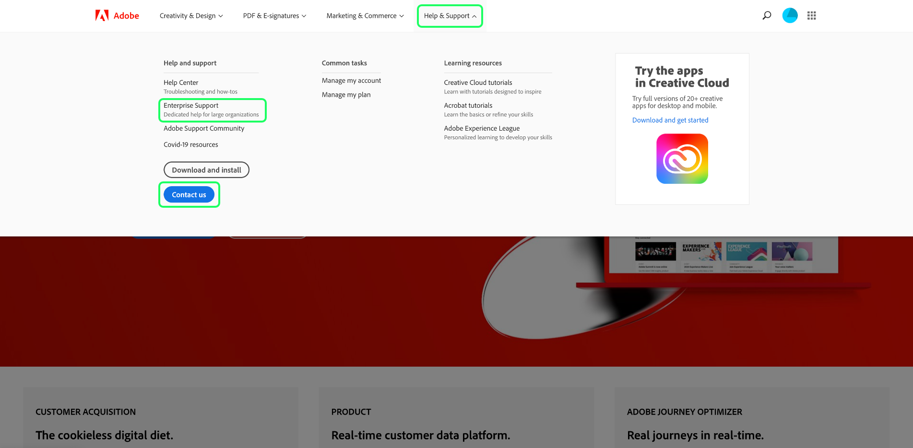

# Questions fréquentes sur Query Service et Data Distiller

Ce document répond aux questions fréquentes sur Query Service et Data Distiller. Il comprend également des codes d’erreur courants lors de l’utilisation du produit « Requêtes » pour la validation des données ou l’écriture de données transformées dans le lac de données. Pour toute question ou tout dépannage concernant d’autres services Adobe Experience Platform, consultez le [guide de dépannage d’Experience Platform](../landing/troubleshooting.md).

Pour clarifier la façon dont Query Service et Data Distiller fonctionnent ensemble dans Adobe Experience Platform, voici deux questions fondamentales.

## Quelle est la relation entre Query Service et Data Distiller ?

Query Service et Data Distiller sont des composants distincts et complémentaires qui fournissent des fonctionnalités d’interrogation de données spécifiques. Query Service est conçu pour que les requêtes ad hoc explorent, valident et testent les données ingérées sans modifier le lac de données. En revanche, Data Distiller se concentre sur les requêtes par lots qui transforment et enrichissent les données, avec des résultats stockés dans le lac de données pour une utilisation ultérieure. Les requêtes par lots dans Data Distiller peuvent être planifiées, surveillées et gérées, ce qui permet un traitement et une manipulation des données plus approfondis que Query Service ne facilite pas à lui seul.

Ensemble, Query Service facilite la collecte rapide d’informations, tandis que Data Distiller permet des transformations de données approfondies et persistantes.

## Quelle est la différence entre Query Service et Data Distiller ?

**Query Service** : utilisé pour les requêtes SQL axées sur l’exploration, la validation et l’expérimentation des données. Les sorties ne sont pas stockées dans le lac de données et le temps d’exécution est limité à 10 minutes. Les requêtes ad hoc sont adaptées aux vérifications et analyses de données légères et interactives.

**Distiller de données** : permet d’exécuter des requêtes par lots qui traitent, nettoient et enrichissent les données, avec des résultats stockés dans le lac de données. Ces requêtes prennent en charge une exécution plus longue (jusqu’à 24 heures) et des fonctionnalités supplémentaires telles que la planification, la surveillance et la création de rapports accélérée. Data Distiller est idéal pour les tâches de manipulation de données approfondies et de traitement de données planifié.

Pour plus d’informations, consultez le document [Package Query Service](./packaging.md).

## Catégories de questions {#categories}

La liste suivante de réponses aux questions fréquentes est divisée en plusieurs catégories :

- [Général](#general)
- [Data Distiller](#data-distiller)
- [Interface utilisateur des requêtes](#queries-ui)
- [Échantillon de jeux de données](#dataset-samples)
- [Exportation des données](#exporting-data)
- [ Syntaxe SQL ](#sql-syntax) 
- [Requêtes ITAS ](#itas-queries)
- [Outils tiers](#third-party-tools)
- [Erreurs de l’API PostgreSQL](#postgresql-api-errors)
- [Erreurs de l’API REST](#rest-api-errors)

## Questions générales sur Query Service {#general}

Cette section contient des informations sur les performances, les limites et les processus.

### Puis-je désactiver la fonction de saisie automatique dans l’éditeur de Query Service ?

+++Réponse
Non. La désactivation de la fonction de saisie semi-automatique n’est actuellement pas prise en charge par l’éditeur.
+++

### Pourquoi Query Editor ralentit-il parfois lorsque je tape une requête ?

+++Réponse
C’est peut être dû à la fonction de saisie automatique. La fonction traite certaines commandes de métadonnées qui peuvent parfois ralentir l’éditeur lors de la modification des requêtes.
+++

### Puis-je utiliser [!DNL Postman] pour l’API Query Service ?

+++Réponse
Oui, vous pouvez visualiser tous les services API d’Adobe et interagir avec eux à l’aide de [!DNL Postman] (une application tierce gratuite). Regardez le [[!DNL Postman] guide de configuration](https://video.tv.adobe.com/v/28832) pour obtenir des instructions détaillées sur la configuration d’un projet dans l’Adobe Developer Console et l’acquisition de toutes les informations d’identification nécessaires à l’utilisation avec [!DNL Postman]. Consultez la documentation officielle pour obtenir des [conseils sur le démarrage, l’exécution et le partage de collections [!DNL Postman] ](https://learning.postman.com/docs/running-collections/intro-to-collection-runs/).
+++

### Existe-t-il un nombre maximal de lignes renvoyées par une requête via l’interface utilisateur ?

+++Réponse
Oui, Query Service applique en interne une limite de 50 000 lignes, sauf si une limite explicite est spécifiée en externe. Pour plus d’informations, consultez les conseils relatifs à l’[exécution de requêtes interactives](./best-practices/writing-queries.md#interactive-query-execution).
+++

### Puis-je utiliser des requêtes pour mettre à jour des lignes ?

+++Réponse
Dans les requêtes par lots, la mise à jour d’une ligne dans le jeu de données n’est pas prise en charge.
+++

### Existe-t-il une limite de taille des données pour la sortie obtenue à partir d’une requête ?

+++Réponse
Non. La taille des données n’est pas limitée, mais le délai d’expiration de la requête est limité à 10 minutes dans une session interactive. Si la requête est exécutée en tant que CTAS par lot, le délai d’expiration de 10 minutes ne s’applique pas. Pour plus d’informations, consultez les conseils relatifs à l’[exécution de requêtes interactives](./best-practices/writing-queries.md#interactive-query-execution).
+++

### Comment empêcher mes requêtes d’expirer au bout de 10 minutes ?

+++Réponse
Nous recommandons l’une ou plusieurs des solutions suivantes en cas d’expiration des requêtes.

- [Convertissez la requête en requête CTAS](./sql/syntax.md#create-table-as-select) et planifiez l’exécution. Vous pouvez planifier une exécution [via l’interface utilisateur](./ui/user-guide.md#scheduled-queries) ou l’[API](./api/scheduled-queries.md#create).
- Exécutez la requête sur un bloc de données plus petit en appliquant des [conditions de filtrage](https://spark.apache.org/docs/latest/api/sql/index.html#filter) supplémentaires.
- [Exécutez la commande EXPLAIN](./sql/syntax.md#explain) pour en savoir plus.
- Examinez les statistiques des données du jeu de données.
- Convertissez la requête en formulaire simplifié pour l’exécuter à nouveau à l’aide d’[instructions préparées](./sql/prepared-statements.md).
+++

### Y a-t-il un problème ou un impact sur les performances de Query Service si plusieurs requêtes s’exécutent simultanément ?

+++Réponse
Non. Query Service dispose d’une fonctionnalité de mise à l’échelle automatique qui garantit que les requêtes simultanées n’ont aucun impact perceptible sur les performances du service.
+++

### Puis-je utiliser des mots-clés réservés comme nom de colonne ?

+++Réponse
Certains mots-clés réservés ne peuvent pas être utilisés comme nom de colonne, tels que `ORDER`, `GROUP BY`, `WHERE`, `DISTINCT`. Si vous souhaitez utiliser ces mots-clés, vous devez ajouter une séquence d’échappement à ces colonnes.
+++

### Comment puis-je trouver un nom de colonne à partir d’un jeu de données hiérarchique ?

+++Réponse
Les étapes suivantes décrivent comment afficher une vue tabulaire d’un jeu de données via l’interface utilisateur, y compris tous les champs et colonnes imbriqués dans un formulaire aplati.

- Une fois connecté(e) à Experience Platform, sélectionnez **[!UICONTROL Jeux de données]** dans le volet de navigation de gauche de l’interface utilisateur pour accéder au tableau de bord [!UICONTROL Jeux de données].
- L’onglet pour [!UICONTROL Parcourir] les jeux de données s’ouvre. Vous pouvez utiliser la barre de recherche pour affiner les options disponibles. Sélectionnez un jeu de données dans la liste.


- L’écran [!UICONTROL Activité des jeux de données] s’affiche. Sélectionnez **[!UICONTROL Prévisualiser le jeu de données]** pour ouvrir une boîte de dialogue du schéma XDM et une vue tabulaire des données aplaties du jeu de données sélectionné. Vous trouverez plus de détails dans la [documentation sur la prévisualisation d’un jeu de données](../catalog/datasets/user-guide.md#preview-a-dataset).


- Sélectionnez un champ du schéma pour afficher son contenu dans une colonne aplatie. Le nom de la colonne s’affiche au-dessus de son contenu sur le côté droit de la page. Vous devez copier le nom pour interroger ce jeu de données.


Consultez la documentation pour obtenir des conseils complets sur [comment travailler avec des structures de données imbriquées](./key-concepts/nested-data-structures.md) à l’aide de Query Editor ou d’un client tiers.
+++

### Comment accélérer une requête sur un jeu de données contenant des tableaux ?

+++Réponse
Pour améliorer les performances des requêtes sur les jeux de données contenant des tableaux, vous devez [fractionner le tableau](https://spark.apache.org/docs/latest/api/sql/index.html#explode) grâce à une [requête CTAS](./sql/syntax.md#create-table-as-select) au moment de l’exécution, puis l’explorer pour en savoir plus sur les opportunités d’amélioration de son temps de traitement.
+++

### Pourquoi ma requête CTAS est-elle toujours en cours de traitement après de nombreuses heures alors qu’elle concerne peu de lignes ?

+++Réponse
Si la requête a pris beaucoup de temps sur un très petit jeu de données, contactez le service clientèle.

Une requête peut être bloquée pendant le traitement pour plusieurs raisons. Pour déterminer la cause exacte, il faut effectuer une analyse approfondie au cas par cas. [Contactez le service clientèle d’Adobe](#customer-support) pour lancer ce processus.
+++

### Comment contacter le service clientèle d’Adobe ? {#customer-support}

+++Réponse
[Une liste complète des numéros de téléphone du service clientèle d’Adobe](https://helpx.adobe.com/fr/contact/phone.html) est disponible sur la page d’aide d’Adobe. Vous pouvez également trouver de l’aide en ligne en procédant comme suit :

- Accédez à [https://www.adobe.com/](https://www.adobe.com/) dans votre navigateur web.
- Sur le côté droit de la barre de navigation supérieure, sélectionnez **[!UICONTROL Se connecter]**.


- Utilisez l’Adobe ID et le mot de passe associés à votre licence Adobe.
- Sélectionnez **[!UICONTROL Aide et assistance]** dans la barre de navigation supérieure.



Une bannière déroulante s’affiche avec une section [!UICONTROL Aide et assistance]. Sélectionnez **[!UICONTROL Nous contacter]** pour ouvrir l’assistant virtuel de l’assistance clientèle Adobe ou sélectionnez **[!UICONTROL Assistance aux entreprises]** pour obtenir une aide destinées aux grandes organisations.
+++

### Comment mettre en œuvre une série séquentielle de tâches sans exécuter les tâches suivantes si la tâche précédente ne se termine pas correctement ?

+++Réponse
La fonction de bloc anonyme vous permet d’enchaîner une ou plusieurs instructions SQL exécutées de manière séquentielle. Les blocs anonymes permettent également de gérer les exceptions.

Pour en savoir plus, consultez la [documentation sur les blocs anonymes](./key-concepts/anonymous-block.md).
+++

### Comment mettre en œuvre l’attribution personnalisée dans Query Service ?

+++Réponse
Il existe deux façons de mettre en œuvre l’attribution personnalisée :

1. Utilisez une combinaison de [fonctions existantes définies par Adobe](./sql/adobe-defined-functions.md) pour déterminer si les besoins du cas d’utilisation sont satisfaits.
1. Si la suggestion précédente ne répond pas à votre cas d’utilisation, vous devez utiliser une combinaison de [fonctions de fenêtre](./sql/adobe-defined-functions.md#window-functions). Les fonctions de fenêtre examinent tous les événements d’une séquence. Elles permettent également de consulter les données historiques et peuvent être utilisées dans n’importe quelle combinaison.
+++

### Puis-je modéliser mes requêtes afin de pouvoir les réutiliser facilement ?

+++Réponse
Oui, vous pouvez modéliser des requêtes à l’aide d’instructions préparées. Les instructions préparées peuvent optimiser les performances et éviter de réanalyser fréquemment une requête. Pour plus de détails, consultez la [documentation sur les instructions préparées](./sql/prepared-statements.md).
+++

### Comment récupérer les journaux d’erreur d’une requête ? {#error-logs}

+++Réponse
Pour récupérer les journaux d’erreur d’une requête spécifique, vous devez d’abord utiliser l’API Query Service pour récupérer les détails du journal de la requête. La réponse HTTP contient les identifiants de requête requis pour rechercher une erreur de requête.

Utilisez la commande GET pour récupérer plusieurs requêtes. Découvrez comment effectuer un appel à l’API dans la [documentation sur les exemples d’appels d’API](./api/queries.md#sample-api-calls).

À partir de la réponse, identifiez la requête que vous souhaitez analyser et effectuez une autre requête GET à l’aide de sa valeur `id`. Vous trouverez des instructions complètes dans la [documentation sur la récupération d’une requête à l’aide de l’ID](./api/queries.md#retrieve-a-query-by-id).

Une réponse réussie renvoie un statut HTTP 200 et contient le tableau `errors`. Par souci de concision, la réponse a été raccourcie.

```json
{
    "isInsertInto": false,
    "request": {
                "dbName": "prod:all",
                "sql": "SELECT *\nFROM\n  accounts\nLIMIT 10\n"
            },
    "clientId": "8c2455819a624534bb665c43c3759877",
    "state": "SUCCESS",
    "rowCount": 0,
    "errors": [{
      'code': '58000', 
      'message': 'Batch query execution gets : [failed reason ErrorCode: 58000 Batch query execution gets : [Analysis error encountered. Reason: [sessionId: f055dc73-1fbd-4c9c-8645-efa609da0a7b Function [varchar] not defined.]]]', 
      'errorType': 'USER_ERROR'
      }],
    "isCTAS": false,
    "version": 1,
    "id": "343388b0-e0dd-4227-a75b-7fc945ef408a",
}
```

La [documentation de référence sur l’API Query Service](https://www.adobe.io/experience-platform-apis/references/query-service/) fournit plus d’informations sur tous les points d’entrée disponibles.
+++

### Que signifie « Erreur de validation du schéma » ?

+++Réponse
Le message « Erreur de validation du schéma » signifie que le système ne peut pas localiser un champ dans le schéma. Nous vous recommandons de lire le document des bonnes pratiques relatives à l’[organisation des ressources de données dans Query Service](./best-practices/organize-data-assets.md) ainsi que la [documentation sur la requête Create Table As Select (CTAS)](./sql/syntax.md#create-table-as-select).

L’exemple suivant illustre l’utilisation d’une syntaxe CTAS et d’un type de données struct :

```sql
CREATE TABLE table_name WITH (SCHEMA='schema_name')

AS SELECT '1' as _id,

 STRUCT

  ('2021-02-17T15:39:29.0Z' AS taskActualCompletionDate,

    '2020-09-09T21:21:16.0Z' AS taskActualStartDate,

    'Consulting' AS taskdescription,

    '5f6527c10011e09b89666c52d9a8c564' AS taskguide,

    'Stakeholder Consulting Engagement' AS taskname, 

    '2020-09-09T15:00:00.0Z' AS taskPlannedStartDate,

    '2021-02-15T11:00:00.0Z' AS taskPlannedCompletionDate

  ) AS _workfront ;
```

+++

### Comment traiter rapidement les nouvelles données qui entrent chaque jour dans le système ?

+++Réponse
Vous pouvez utiliser la clause [`SNAPSHOT`](./sql/syntax.md#snapshot-clause) pour lire de manière incrémentielle les données d’une table en fonction d’un identifiant d’instantané. Ceci est idéal pour une utilisation avec le modèle de conception de [chargement incrémentiel](./key-concepts/incremental-load.md) qui traite uniquement les informations du jeu de données qui ont été créées ou modifiées depuis la dernière exécution du chargement. Cela permet d’augmenter l’efficacité du traitement et peut être utilisé avec le traitement des données en flux continu et par lots.
+++

### Pourquoi y a-t-il une différence entre les nombres affichés dans l’interface utilisateur du profil et les nombres calculés à partir du jeu de données d’exportation du profil ?

+++Réponse
Les nombres affichés dans le tableau de bord du profil sont précis à partir du dernier instantané. Les nombres générés dans le tableau d’exportation du profil dépendent entièrement de la requête d’exportation. L’interrogation du nombre de profils admissibles pour une audience particulière constitue donc une cause courante de cette incohérence.

>[!NOTE]
>
>La requête inclut des données historiques, tandis que l’interface utilisateur affiche uniquement les données de profil actuelles.

+++

### Pourquoi ma requête a-t-elle renvoyé un sous-ensemble vide et que dois-je faire ?

+++Réponse
La cause la plus probable est que la portée de votre requête est trop limitée. Vous devez supprimer systématiquement une section de la clause `WHERE` jusqu’à ce que vous commenciez à voir des données.

Vous pouvez également confirmer que votre jeu de données contient des données à l’aide d’une requête courte telle que :

```sql
SELECT count(1) FROM myTableName
```

+++

### Puis-je échantillonner mes données ?

+++Réponse
Cette fonctionnalité est actuellement en développement. Des détails seront disponibles dans les [notes de mise à jour](../release-notes/latest/latest.md) et dans les boîtes de dialogue de l’interface utilisateur d’Experience Platform, une fois que la fonctionnalité sera prête à être publiée.
+++

### Quelles fonctions d’assistant sont prises en charge par Query Service ?

+++Réponse
Query Service fournit plusieurs fonctions d’assistant SQL intégrées pour étendre les fonctionnalités SQL. Consultez le document pour obtenir la liste complète des [fonctions SQL prises en charge par Query Service](./sql/spark-sql-functions.md).
+++

### Toutes les fonctions [!DNL Spark SQL] natives sont-elles prises en charge, ou les utilisateurs et utilisatrices sont-ils limités aux fonctions [!DNL Spark SQL] wrapper fournies par Adobe ?

+++Réponse
Toutes les fonctions [!DNL Spark SQL] open source n’ont pas encore été testées sur les données du lac de données. Une fois testées et confirmées, elles seront ajoutées à la liste des fonctions prises en charge. Reportez-vous à la [liste des fonctions [!DNL Spark SQL] prises en charge](./sql/spark-sql-functions.md) pour rechercher une fonction spécifique.
+++

### Les utilisateurs et utilisatrices peuvent-ils définir leurs propres fonctions définies par l’utilisateur (UDF) pour les utiliser dans d’autres requêtes ?

+++Réponse
Pour des raisons de sécurité des données, la définition personnalisée des champs définis par l’utilisateur n’est pas autorisée.
+++

### Que dois-je faire si ma requête planifiée échoue ?

+++Réponse
Commencez par consulter les journaux pour connaître les détails de l’erreur. La section Questions fréquentes sur la [recherche d’erreurs dans les journaux](#error-logs) fournit des informations supplémentaires sur la manière de procéder.

Vous pouvez également consulter la documentation pour obtenir des conseils sur la manière d’effectuer des [requêtes planifiées dans l’interface utilisateur](./ui/user-guide.md#scheduled-queries) et par le biais de [l’API](./api/scheduled-queries.md).

Gardez à l’esprit que lorsque vous utilisez le [!DNL Query Editor], vous pouvez uniquement ajouter un planning à une requête qui a déjà été créée et enregistrée. Ceci ne s’applique pas à l’API [!DNL Query Service].
+++

### Que signifie l’erreur « Limite de session atteinte » ?

+++Réponse
« Limite de session atteinte » signifie que le nombre maximal de sessions Query Service autorisées pour votre organisation a été atteint. Contactez l’administrateur ou l’administratrice Adobe Experience Platform de votre organisation.
+++

### Comment le journal de requête gère-t-il les requêtes relatives à un jeu de données supprimé ?

+++Réponse
Query Service ne supprime jamais l’historique des requêtes. Cela signifie que toute requête référençant un jeu de données supprimé renvoie le résultat « Aucun jeu de données valide ».
+++

### Comment puis-je obtenir uniquement les métadonnées d’une requête ?

+++Réponse
Vous pouvez exécuter une requête qui renvoie zéro ligne pour obtenir uniquement les métadonnées en réponse. Cet exemple de requête renvoie uniquement les métadonnées de la table spécifiée.

```sql
SELECT * FROM <table> WHERE 1=0
```

+++

### Comment puis-je itérer rapidement sur une requête CTAS (Create Table As Select) sans la matérialiser ?

+++Réponse
Vous pouvez créer des tables temporaires pour itérer rapidement une requête et l’expérimenter avant de la matérialiser pour l’utiliser. Vous pouvez également utiliser des tables temporaires pour vérifier si une requête est fonctionnelle.

Vous pouvez, par exemple, créer une table temporaire :

```sql
CREATE temp TABLE temp_dataset AS
SELECT *
FROM actual_dataset
WHERE 1 = 0;
```

Vous pouvez ensuite utiliser la table temporaire comme suit :

```sql
INSERT INTO temp_dataset
SELECT a._company AS _company,
a._id AS _id,
a.timestamp AS timestamp
FROM actual_dataset a
WHERE timestamp >= TO_TIMESTAMP('2021-01-21 12:00:00')
AND timestamp < TO_TIMESTAMP('2021-01-21 13:00:00')
LIMIT 100;
```

+++

### Comment modifier le fuseau horaire en heure et date UTC ?

+++Réponse
Adobe Experience Platform conserve les données au format d’heure et date UTC (temps universel coordonné). Exemple de format UTC : `2021-12-22T19:52:05Z`.

Query Service prend en charge les fonctions SQL intégrées pour convertir une date et une heure données au format UTC et inversement à partir de ce format. Les deux méthodes `to_utc_timestamp()` et `from_utc_timestamp()` prennent deux paramètres : la date et l’heure, ainsi que le fuseau horaire.

| Paramètre | Description |
|-----------|---------------|
| Date et heure | La date et l’heure peuvent être écrites au format UTC ou au format `{year-month-day}` simple. Si aucune heure n’est fournie, la valeur par défaut est minuit le matin du jour donné. |
| Fuseau horaire | Le fuseau horaire est écrit dans le format `{continent/city})`. Il doit s’agir de l’un des codes de fuseau horaire reconnus, comme indiqué dans la [base de données TZ du domaine public](https://data.iana.org/time-zones/tz-link.html#tzdb). |

#### Convertir en date et heure UTC

La méthode `to_utc_timestamp()` interprète les paramètres donnés et les convertit **à l’heure et à la date de votre fuseau horaire local** au format UTC. Par exemple, le fuseau horaire à Séoul, en Corée du Sud, est UTC/GMT +9 heures. En fournissant une date uniquement, la méthode utilise une valeur par défaut de minuit le matin. L’heure, la date et le fuseau horaire sont convertis au format UTC de l’heure de cette région en date et heure UTC de votre région locale.

```SQL
SELECT to_utc_timestamp('2021-08-31', 'Asia/Seoul');
```

La requête renvoie une date et une heure à l’heure locale de l’utilisateur ou utilisatrice. Dans ce cas, la veille à 15h00 comme à Séoul, il y a neuf heures d’avance.

```
2021-08-30 15:00:00
```

Autre exemple : si la date et l’heure données ont été `2021-07-14 12:40:00.0` pour le fuseau horaire `Asia/Seoul`, la date et l’heure UTC renvoyées seraient `2021-07-14 03:40:00.0`.

La sortie de console fournie dans l’interface utilisateur de Query Service est plus lisible :

```
8/30/2021, 3:00 PM
```

#### Convertir à partir de la date et heure UTC

La méthode `from_utc_timestamp()` interprète les paramètres donnés **à partir de la date et de l’heure de votre fuseau horaire local**, et fournit la date et l’heure équivalentes de la région souhaitée au format UTC. Dans l’exemple ci-dessous, l’heure est 14h40 dans le fuseau horaire local de l’utilisateur ou utilisatrice. Le fuseau horaire de Séoul passé en tant que variable est neuf heures en avance sur le fuseau horaire local.

```SQL
SELECT from_utc_timestamp('2021-08-31 14:40:00.0', 'Asia/Seoul');
```

La requête renvoie une date et une heure au format UTC pour le fuseau horaire transmis en tant que paramètre. Le résultat est neuf heures en avance sur le fuseau horaire qui a exécuté la requête.

```
8/31/2021, 11:40 PM
```

### Comment dois-je filtrer mes données de série temporelle ?

+++Réponse
Lors de l’interrogation de données de série temporelle, vous devez utiliser le filtre Date et heure chaque fois que cela est possible pour une analyse plus précise.

>[!NOTE]
>
> La chaîne de date **doit** être au format `yyyy-mm-ddTHH24:MM:SS`.

Vous trouverez ci-dessous un exemple d’utilisation du filtre Date et heure :

```sql
SELECT a._company  AS _company,
       a._id       AS _id,
       a.timestamp AS timestamp
FROM   dataset a
WHERE  timestamp >= To_timestamp('2021-01-21 12:00:00')
       AND timestamp < To_timestamp('2021-01-21 13:00:00')
```

+++

### Comment utiliser correctement l’opérateur `CAST` pour convertir mes dates et heures dans les requêtes SQL ?

+++Réponse
Lors de l’utilisation de l’opérateur `CAST` pour convertir une date et une heure, vous devez inclure la date **et** l’heure.

Par exemple, l’absence du composant Heure, comme illustré ci-dessous, entraînera une erreur :

```sql
SELECT * FROM ABC
WHERE timestamp = CAST('07-29-2021' AS timestamp)
```

L’utilisation correcte de l’opérateur `CAST` est illustrée ci-dessous :

```sql
SELECT * FROM ABC
WHERE timestamp = CAST('07-29-2021 00:00:00' AS timestamp)
```

+++

### Dois-je utiliser des caractères génériques, tels que * pour obtenir toutes les lignes de mes jeux de données ?

+++Réponse
Vous ne pouvez pas utiliser de caractères génériques pour obtenir toutes les données de vos lignes, car Query Service doit être traité comme un **entrepôt orienté colonnes** plutôt qu’un système d’entrepôt traditionnel basé sur les lignes.
+++

### Dois-je utiliser `NOT IN` dans ma requête SQL ?

+++Réponse
L’opérateur `NOT IN` est souvent utilisé pour récupérer les lignes qui ne figurent pas dans une autre table ou instruction SQL. Cet opérateur peut ralentir les performances et renvoyer des résultats inattendus si les colonnes comparées acceptent `NOT NULL`, ou si vous avez un grand nombre d’enregistrements.

Au lieu d’utiliser `NOT IN`, vous pouvez utiliser `NOT EXISTS` ou `LEFT OUTER JOIN`.

Par exemple, si vous avez les tables suivantes créées :

```sql
CREATE TABLE T1 (ID INT)
CREATE TABLE T2 (ID INT)
INSERT INTO T1 VALUES (1)
INSERT INTO T1 VALUES (2)
INSERT INTO T1 VALUES (3)
INSERT INTO T2 VALUES (1)
INSERT INTO T2 VALUES (2)
```

Si vous utilisez l’opérateur `NOT EXISTS`, vous pouvez répliquer à l’aide de l’opérateur `NOT IN` en utilisant la requête suivante :

```sql
SELECT ID FROM T1
WHERE NOT EXISTS
(SELECT ID FROM T2 WHERE T1.ID = T2.ID)
```

Si vous utilisez l’opérateur `LEFT OUTER JOIN`, vous pouvez répliquer à l’aide de l’opérateur `NOT IN` en utilisant la requête suivante :

```sql
SELECT T1.ID FROM T1
LEFT OUTER JOIN T2 ON T1.ID = T2.ID
WHERE T2.ID IS NULL
```

+++

### Puis-je créer un jeu de données à l’aide d’une requête CTAS avec un nom de soulignement double comme celui affiché dans l’interface utilisateur ? Par exemple : `test_table_001`.

+++Réponse
Non, il s’agit d’une limitation intentionnelle dans Experience Platform qui s’applique à tous les services Adobe, y compris Query Service. Un nom comportant deux traits de soulignement est acceptable en tant que nom de schéma et de jeu de données, mais le nom de la table du jeu de données ne peut contenir qu’un seul trait de soulignement.
+++

### Combien de requêtes simultanées est-il possible d’exécuter à la fois ?

+++Réponse
Il n’existe aucune limite de simultanéité des requêtes, car les requêtes par lots s’exécutent en tant que tâches d’arrière-plan. Cependant, une limite de délai d’expiration de requête est définie sur 24 heures.
+++

### Y a-t-il un tableau de bord d’activité dans lequel vous pouvez voir les activités et le statut des requêtes ?

+++Réponse
Il existe des fonctionnalités de surveillance et d’alerte permettant de vérifier les statuts et les activités des requêtes. Voir les documents concernant l’[intégration du journal d’audit de Query Service](./data-governance/audit-log-guide.md) et les [journaux de requête](./ui/overview.md#log) pour plus d’informations.
+++

### Existe-t-il un moyen de restaurer les mises à jour ? Par exemple, en cas d’erreur ou si certains calculs doivent être reconfigurés lors de l’écriture de données dans Experience Platform, comment ce scénario doit-il être géré ?

+++Réponse
Actuellement, nous ne prenons pas en charge les restaurations ou les mises à jour de cette manière.
+++

### Comment optimiser les requêtes dans Adobe Experience Platform ?

+++Réponse
Le système ne possède pas d’index, car il ne s’agit pas d’une base de données, mais d’autres optimisations sont en place, liées à l’entrepôt de données. Les options suivantes sont disponibles pour régler vos requêtes :

- Filtre temporel basé sur les données de série temporelle.
- Optimisation du pushdown pour le type de données struct.
- Optimisation du coût et du pushdown de la mémoire pour les types de données de tableaux et de mappage.
- Traitement incrémentiel à l’aide d’instantanés.
- Format de données persistant.
+++

### Les connexions peuvent-elles être limitées à certains aspects de Query Service ou s’agit-il d’une solution « tout ou rien » ?

+++Réponse
Query Service est une solution « tout ou rien ». Un accès partiel ne peut pas être fourni.
+++

### Puis-je restreindre les données que Query Service peut utiliser ou accède-t-il simplement à l’ensemble du lac de données d’Adobe Experience Platform ?

+++Réponse
Oui, vous pouvez restreindre l’interrogation des jeux de données avec un accès en lecture seule.
+++

### Quelles autres options existe-t-il pour limiter les données auxquelles Query Service peut accéder ?

+++Réponse
Il existe trois approches pour restreindre l’accès. En voici la liste :

- Utilisez les instructions SELECT uniquement et accordez aux jeux de données un accès en lecture seule. Attribuez également l’autorisation de gestion des requêtes.
- Utilisez des instructions SELECT/INSERT/CREATE et accordez aux jeux de données un accès en écriture. Attribuez également l’autorisation de gestion des requêtes.
- Utilisez un compte d’intégration avec les suggestions précédentes et attribuez l’autorisation d’intégration de requête.

+++

### Une fois les données renvoyées par Query Service, existe-t-il des vérifications pouvant être exécutées par Experience Platform pour s’assurer qu’elles n’ont renvoyé aucune donnée protégée ?

- Query Service prend en charge le contrôle d’accès basé sur les attributs. Vous pouvez restreindre l’accès aux données au niveau de la colonne, de la feuille et/ou au niveau struct. Consultez la documentation pour en savoir plus sur le contrôle d’accès basé sur les attributs.

### Puis-je spécifier un mode SSL pour la connexion à un client tiers ? Par exemple, puis-je utiliser « verify-full » avec Power BI ?

+++Réponse
Oui, les modes SSL sont pris en charge. Voir la [documentation sur les modes SSL](./clients/ssl-modes.md) pour une présentation des différents modes SSL disponibles et du niveau de protection qu’ils offrent.
+++

### Utilisons-nous TLS 1.2 pour toutes les connexions des clients Power BI à Query Service ?

+++Réponse
Oui. Les données en transit sont toujours conformes au protocole HTTPS. La version actuellement prise en charge est TLS1.2.
+++

### Une connexion établie sur le port 80 utilise-t-elle toujours https ?

+++Réponse
Oui, une connexion établie sur le port 80 utilise toujours SSL. Vous pouvez également utiliser le port 5432.
+++

### Puis-je contrôler l’accès à des jeux de données et à des colonnes spécifiques pour une connexion particulière ? Comment cela est-il configuré ?

+++Réponse
Oui, le contrôle d’accès basé sur les attributs est appliqué s’il est configuré. Pour plus d’informations, consultez la [présentation du contrôle d’accès basé sur les attributs](../access-control/abac/overview.md).
+++

### Query Service prend-il en charge la commande « INSERT OVERWRITE INTO » ?

+++Réponse
Non, Query Service ne prend pas en charge la commande « INSERT OVERWRITE INTO ».
+++

### À quelle fréquence les données d’utilisation du tableau de bord d’utilisation de la licence sont-elles mises à jour pour les heures de calcul de Data Distiller ?

+++Réponse
Le tableau de bord d’utilisation de la licence pour les heures d’utilisation de l’ordinateur Data Distiller est mis à jour quatre fois par jour, toutes les six heures.
+++

### Puis-je utiliser la commande CREATE VIEW sans accès à Data Distiller ?

+++Réponse
Oui, vous pouvez utiliser `CREATE VIEW` commande sans accès à Data Distiller. Cette commande fournit une vue logique des données mais ne les réécrit pas dans le lac de données.
+++

### Puis-je utiliser des blocs anonymes dans DBVisualizer ?

+++Réponse
Oui. Cependant, certains clients tiers, tels que DbVisualizer, peuvent nécessiter un identifiant distinct avant et après un bloc SQL pour indiquer qu’une partie d’un script doit être traitée comme une seule instruction. Vous trouverez plus d’informations dans la [documentation sur les blocs anonymes](./key-concepts/anonymous-block.md) ou dans [la documentation officielle de DbVisualizer](https://confluence.dbvis.com/display/UG120/Executing+Complex+Statements#ExecutingComplexStatements-UsinganSQLDialect).
+++

## Data Distiller {#data-distiller}

### Comment l’utilisation de la licence de Distiller de données est-elle suivie et où puis-je voir ces informations ?

+++Réponse\
La principale mesure utilisée pour suivre l’utilisation des requêtes par lots est l’heure de calcul. Vous avez accès à ces informations et à votre consommation actuelle via le tableau de bord [ Utilisation des licences ](../dashboards/guides/license-usage.md).
+++

### Qu’est-ce qu’une heure de calcul ?

+++Réponse\
Les heures de calcul sont la mesure du temps pris par les moteurs de Query Service pour lire, traiter et écrire des données dans le lac de données lorsqu’une requête par lots est exécutée.
+++

### Comment les heures de calcul sont-elles mesurées ?

+++Réponse\
Les heures de calcul sont mesurées de manière cumulative sur tous vos sandbox autorisés.
+++

### Pourquoi est-ce que je remarque parfois une variation de la consommation des heures de calcul même lorsque j’exécute la même requête de manière consécutive ?

+++Réponse\
Les heures de calcul d’une requête peuvent fluctuer en raison de plusieurs facteurs. Il s’agit notamment du volume de données traitées, de la complexité des opérations de transformation dans la requête SQL, etc. Query Service met à l’échelle le cluster en fonction des paramètres ci-dessus pour chaque requête, ce qui peut entraîner des différences dans les heures de calcul.
+++

### Est-il normal de constater une réduction des heures de calcul lorsque j’exécute la même requête à l’aide des mêmes données sur une longue période ? Pourquoi cela pourrait-il se produire ?

+++Réponse\
L’infrastructure principale est constamment améliorée afin d’optimiser l’utilisation des heures de calcul et le temps de traitement. Par conséquent, vous remarquerez peut-être des changements au fil du temps à mesure que des améliorations de performances sont mises en œuvre.
+++

## Interface utilisateur des requêtes

### L’action « Créer une requête » est bloquée sur « Initialisation de la connexion... » lors de la tentative de connexion à Query Service. Comment résoudre le problème ?

+++Réponse
Si l’action « Créer une requête » est bloquée sur « Initialisation de la connexion... », il s’agit probablement d’un problème de connexion ou de session. Actualisez le navigateur si vous utilisez l’interface utilisateur d’Experience Platform et réessayez.
+++

## Échantillon de jeux de données

### Puis-je créer des exemples sur un jeu de données système ?

+++Réponse
Non. Les autorisations d’écriture sont restreintes sur les jeux de données système afin que vous ne puissiez pas créer d’exemples.
+++

## Exportation des données {#exporting-data}

Cette section fournit des informations sur l’exportation des données et des limites.

### Existe-t-il un moyen d’extraire des données de Query Service après le traitement des requêtes et d’enregistrer les résultats dans un fichier CSV ? {#export-csv}

+++Réponse
Oui. Les données peuvent être extraites de Query Service et il est également possible de stocker les résultats au format CSV via une commande SQL.

Il existe deux manières d’enregistrer les résultats d’une requête quand on utilise un client PSQL. Vous pouvez utiliser la commande `COPY TO` ou créez une instruction en respectant le format suivant :

```sql
SELECT column1, column2 
FROM <table_name>  
\g <table_name>.out
```

[Les instructions sur l’utilisation de la commande `COPY TO`](./sql/syntax.md#copy) se trouvent dans la documentation de référence de syntaxe SQL.
+++

### Puis-je extraire le contenu du jeu de données final qui a été ingéré par le biais de requêtes CTAS (en supposant qu’il s’agisse de grandes quantités de données telles que des Terabytes) ?

+++Réponse
Non. Actuellement, il n’existe aucune fonctionnalité permettant l’extraction des données ingérées.
+++

### Pourquoi le connecteur de données Analytics ne renvoie-t-il pas de données ?

+++Réponse
Une cause courante de ce problème est l’interrogation de données de série temporelle sans filtre temporel. Par exemple :

```sql
SELECT * FROM prod_table LIMIT 1;
```

Doit être écrit comme suit :

```sql
SELECT * FROM prod_table
WHERE
timestamp >= to_timestamp('2022-07-22')
and timestamp < to_timestamp('2022-07-23');
```

+++

## Syntaxe SQL

### La fonctionnalité MERGE INTO est-elle prise en charge par Data Distiller ou Query Service ?

+++Réponse
La structure MERGE INTO SQL n&#39;est pas prise en charge par Data Distiller ou Query Service.
+++

## Requêtes ITAS

### Que sont les requêtes ITAS ?

+++Réponse
Les requêtes INSERT INTO sont appelées requêtes ITAS. Notez que les requêtes CREATE TABLE sont appelées requêtes CTAS.
+++

## Outils tiers {#third-party-tools}

Cette section contient des informations sur l’utilisation d’outils tiers tels que PSQL et Power BI.

### Puis-je connecter Query Service à un outil tiers ?

+++Réponse
Oui, vous pouvez connecter plusieurs clients de bureau tiers à Query Service. Consultez la documentation sur les [détails complets sur les clients disponibles et comment les connecter à Query Service](./clients/overview.md).
+++

### Existe-t-il un moyen de connecter Query Service une seule fois pour une utilisation continue avec un outil tiers ?

+++Réponse
Oui, les clients de bureau tiers peuvent être connectés à Query Service par le biais d’une configuration unique avec des informations d’identification non expirantes. Les informations d’identification sans expiration peuvent être générées par un utilisateur ou une utilisatrice autorisé(e) et reçues dans un fichier JSON automatiquement téléchargé sur son ordinateur local. Suivez la [procédure de création et de téléchargement d’informations d’identification non expirantes](./ui/credentials.md#non-expiring-credentials) dans la documentation.
+++

### Pourquoi mes informations d’identification non expirantes ne fonctionnent-elles pas ?

+++Réponse
La valeur des informations d’identification non expirantes sont les arguments concaténés des paramètres `technicalAccountID` et `credential` extraits du fichier de configuration JSON. La valeur du mot de passe se présente comme suit : `{{technicalAccountId}:{credential}}`.
Pour plus d’informations sur la [connexion à des clients externes à l’aide d’informations d’identification](./ui/credentials.md#using-credentials-to-connect-to-external-clients), consultez la documentation.
+++

### Quels types d’éditeurs SQL tiers puis-je connecter à Query Service Editor ?

+++Réponse
Tout éditeur SQL tiers compatible avec le client PSQL ou [!DNL Postgres] peut être connecté à Query Service Editor. Consultez la documentation sur la [connexion des clients à Query Service](./clients/overview.md) pour obtenir une liste des instructions disponibles.
+++

### Puis-je connecter l’outil Power BI à Query Service ?

+++Réponse
Oui, vous pouvez connecter Power BI à Query Service. Consultez la documentation pour obtenir des [instructions sur la connexion de l’application de bureau Power BI à Query Service](./clients/power-bi.md).
+++

### Pourquoi le chargement des tableaux de bord est-il long lorsque le système est connecté à Query Service ?

+++Réponse
Lorsque le système est connecté à Query Service, il est connecté à un moteur de traitement interactif ou par lots. Cela peut entraîner des temps de chargement plus longs pour refléter les données traitées.

Si vous souhaitez améliorer les temps de réponse de vos tableaux de bord, vous devez mettre en oeuvre un serveur Business Intelligence (BI) en tant que couche de mise en cache entre Query Service et les outils de BI. La plupart des outils de BI offrent une option de serveur dans leur assortiment.

L’ajout de la couche de serveur de mise en cache a pour but de mettre en cache les données de Query Service et d’utiliser les mêmes données pour les tableaux de bord, à des fins de temps de réponse réduits. Pour ce faire, les résultats des requêtes exécutées sont mis en cache sur le serveur BI quotidiennement. Le serveur de mise en cache fournit ensuite ces résultats à tout(e) utilisateur ou utilisatrice soumettant la même requête afin de réduire la latence. Pour plus d’informations sur cette mise en œuvre, consultez la documentation de l’utilitaire ou de l’outil tiers que vous utilisez.
+++

### Est-il possible d’accéder à Query Service à l’aide de l’outil de connexion pgAdmin ?

+++Réponse
Non, la connectivité pgAdmin n’est pas prise en charge. Consultez la [liste des clients tiers disponibles et les instructions pour les connecter à Query Service](./clients/overview.md) dans la documentation.
+++

## Erreurs de l’API PostgreSQL {#postgresql-api-errors}

Le tableau suivant fournit les codes d’erreur PSQL et leurs causes possibles.

| Code d’erreur | État de la connexion | Description | Cause possible |
|------------|---------------------------|-------------|----------------|
| **08P01** | S/O | Type de message non pris en charge | Type de message non pris en charge |
| **28P01** | Démarrage - authentication | Mot de passe non valide | Jeton d’authentification non valide |
| **28000** | Démarrage - authentication | Type d’autorisation non valide | Type d’autorisation non valide. Doit être `AuthenticationCleartextPassword`. |
| **42P12** | Démarrage - authentication | Aucune table trouvée | Aucune table n’a été trouvée pour utilisation |
| **42601** | Requête | Erreur de syntaxe | Erreur de syntaxe ou de commande non valide |
| **42P01** | Requête | Tableau introuvable | La table spécifiée dans la requête est introuvable |
| **42P07** | Requête | Le tableau existe | Une table portant le même nom existe déjà (CREATE TABLE). |
| **53400** | Requête | LIMIT dépasse la valeur maximale | L’utilisateur a spécifié une clause LIMIT supérieure à 100 000 |
| **53400** | Requête | Délai d’expiration de la déclaration | La déclaration soumise en direct a duré plus de 10 minutes au maximum |
| **58000** | Requête | Erreur système | Échec du système interne |
| **0A000** | Requête/Commande | Non pris en charge | La fonctionnalité de la requête/commande n’est pas prise en charge. |
| **42501** | Requête DROP TABLE | Déposer une table non créée par Query Service | La table en train d’être déposée n’a pas été créée par Query Service à l’aide de l’instruction `CREATE TABLE`. |
| **42501** | Requête DROP TABLE | Table non créée par l’utilisateur ou l’utilisatrice authentifié(e) | La table en train d’être déposée n’a pas été créée par l’utilisateur ou l’utilisatrice actuellement connecté(e). |
| **42P01** | Requête DROP TABLE | Tableau introuvable | La table spécifiée dans la requête est introuvable. |
| **42P12** | Requête DROP TABLE | Aucune table trouvée pour `dbName` : vérifiez le nom `dbName`. | Aucune table n’a été trouvée dans la base de données actuelle. |

### Pourquoi ai-je reçu un code d’erreur 58000 lors de l’utilisation de la méthode history_meta() sur ma table ?

+++Réponse
La méthode `history_meta()` sert à accéder à un instantané d’un jeu de données. Auparavant, si vous deviez exécuter une requête sur un jeu de données vide dans Azure Data Lake Storage (ADLS), vous receviez un code d’erreur 58000 indiquant que le jeu de données n’existe pas. Consultez ci-dessous un exemple de l’ancienne erreur système.

```shell
ErrorCode: 58000 Internal System Error [Invalid table your_table_name. historyMeta can be used on datalake tables only.]
```

Cette erreur se produisait car aucune valeur n’était renvoyée pour la requête. Ce comportement est désormais corrigé et renvoie le message suivant :

```text
Query complete in {timeframe}. 0 rows returned. 
```

+++

## Erreurs de l’API REST {#rest-api-errors}

Le tableau suivant fournit des codes d’erreur HTTP et leurs causes possibles.

| Code d’état HTTP | Description | Causes possibles |
|------------------|-----------------------|----------------------------|
| 400 | Mauvaise requête | Requête malformée ou illégale |
| 401 | Échec de l’authentification | Jeton d’authentification non valide |
| 500 | Erreur interne du serveur | Échec du système interne |
