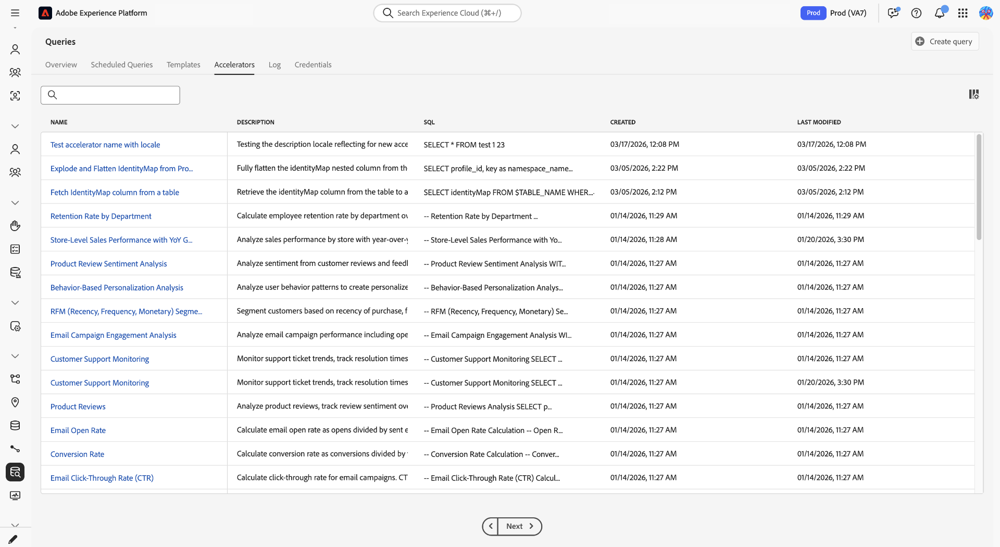
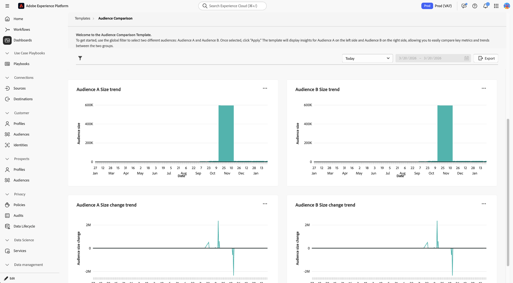

# Accélérateurs de Distiller de données {#data-distiller-accelerators}

Les accélérateurs de Distiller de données sont des modèles SQL paramétrés créés par Adobe et conçus pour des scénarios analytiques courants. Utilisez des accélérateurs pour exécuter des analyses courantes sans écrire SQL en partant de zéro. Les accélérateurs sont en lecture seule et gérés par Adobe, ce qui permet d’assurer la cohérence au sein de votre organisation. Si vous devez en modifier un, vous pouvez le cloner en tant que modèle personnalisé.

Lisez ce guide pour savoir comment exécuter, planifier et cloner des accélérateurs dans l’espace de travail [!UICONTROL Queries].

>[!AVAILABILITY]
>
>Les accélérateurs de Distiller de données ne sont disponibles que pour les organisations qui disposent d’un SKU Data Distiller. L’onglet [!UICONTROL Accelerators] et les workflows associés nécessitent le module complémentaire Distiller de données . Voir la [présentation de Data Distiller](../data-distiller/overview.md) ou contacter votre représentant Adobe pour plus d’informations.

## Conditions préalables {#prerequisites}

Avant de commencer, vérifiez que vous répondez aux exigences suivantes :

* Vous avez accès à l’espace de travail [!UICONTROL Queries] dans Experience Platform.
* Vous comprenez [comment utiliser Query Editor et exécuter des requêtes](./user-guide.md).
* Vous connaissez le [requêtes paramétrées](./parameterized-queries.md) (espaces réservés dans SQL remplacés au moment de l’exécution).

## Quand utiliser des accélérateurs {#when-to-use}

Utilisez des accélérateurs lorsque vous avez besoin de code SQL préconfiguré pour les modèles analytiques courants tels que l’analyse funnel, les moyennes glissantes ou le chevauchement des audiences. Si aucun accélérateur ne correspond à votre cas d’utilisation, [écrivez une requête personnalisée dans le Query Editor](./user-guide.md#query-authoring) ou demandez un nouvel accélérateur (voir [Demande d’un nouvel accélérateur](#request-accelerator)).

Un petit ensemble d’accélérateurs s’ouvre en tant que tableaux de bord pour une analyse immédiate, tandis que d’autres s’ouvrent dans le Query Editor où vous pouvez exécuter, planifier ou adapter la logique. Consultez la section [Accélérateurs liés au tableau de bord](#dashboard-accelerators) pour découvrir comment ces visualisations préconfigurées fournissent des informations sur vos données d’audience.

Pour commencer à utiliser des accélérateurs, accédez à l’espace de travail **[!UICONTROL Queries]** et ouvrez l’onglet **[!UICONTROL Accelerators]** ou l’onglet **[!UICONTROL Overview]** .

## Chemins de découverte de l’accélérateur {#discovery-paths}

Vous pouvez accéder aux accélérateurs à partir de l’espace de travail Requêtes de deux manières, selon que vous souhaitez obtenir le catalogue complet ou les modèles recommandés.

### Utilisation de l’onglet Accélérateurs

Utilisez ce chemin d’accès lorsque vous souhaitez parcourir tous les accélérateurs disponibles. Pour ouvrir le catalogue complet d’accélérateurs, sélectionnez **[!UICONTROL Queries]** dans le volet de navigation de gauche, puis sélectionnez l’onglet **[!UICONTROL Accelerators]** .

L’espace de travail affiche un tableau d’accélérateurs avec des noms, des aperçus SQL et des horodatages. Sélectionnez un nom d’accélérateur pour l’ouvrir dans le Query Editor.

>[!NOTE]
>
>Tous les accélérateurs sélectionnés dans l’onglet **[!UICONTROL Accelerators]** s’ouvrent dans le Query Editor.

### Utiliser l’onglet Aperçu

Utilisez ce chemin d’accès lorsque vous souhaitez accéder rapidement à des accélérateurs fortement recommandés. Accédez à **[!UICONTROL Queries]**, puis sélectionnez l’onglet **[!UICONTROL Overview]** . Sélectionnez ensuite une carte dans la section **[!UICONTROL Recommended Data Distiller accelerators]** .

La plupart des accélérateurs s’ouvrent dans le Query Editor. Un petit ensemble d’accélérateurs s’ouvre en tant que tableaux de bord avec des visualisations préconfigurées. Si la carte ouvre un tableau de bord au lieu du Query Editor, reportez-vous à la section [Accélérateurs liés au tableau de bord](#dashboard-accelerators).

## Ouvrir un accélérateur dans le Query Editor {#open-accelerator}

Cette section explique ce qui se produit lorsque vous ouvrez un accélérateur dans le Query Editor et les actions que vous pouvez entreprendre ensuite, y compris l’exécution de l’accélérateur, sa planification ou la création d’un modèle personnalisé.

Après avoir ouvert un accélérateur, vous pouvez **exécuter** l’accélérateur pour afficher les résultats, **planifier** l’accélérateur pour qu’il s’exécute automatiquement ou **créer un modèle personnalisé** pour modifier le code SQL.

>[!NOTE]
>
>Lorsque vous ouvrez un accélérateur dans le Query Editor, le code SQL est préchargé en lecture seule et les actions de la barre d’outils telles que [!UICONTROL Show results], [!UICONTROL Undo text] [!UICONTROL Format text] sont désactivées.

Le panneau de droite affiche des métadonnées telles que les détails de **[!UICONTROL Accelerator ID]**, de **[!UICONTROL Name]** et de modification, et permet d’accéder à la planification via **[!UICONTROL Add schedule]**.

### Fournir des paramètres et exécuter un accélérateur {#provide-parameters-execute}

Pour exécuter l’accélérateur, vous devez d’abord fournir des valeurs pour tous les paramètres requis. Les paramètres utilisent la syntaxe `${PARAMETER_NAME}` et apparaissent dans l&#39;onglet **[!UICONTROL Query parameters]** situé sous l&#39;éditeur. Par exemple, `${START_DATE}` nécessite une valeur de date au format `YYYY-MM-DD` (par exemple, `2024-01-01`) et `${AUDIENCE_ID}` nécessite un identifiant d’audience spécifique.

Pour exécuter un accélérateur :

1. Sélectionnez **[!UICONTROL Query parameters]** et saisissez une valeur pour chaque paramètre.
2. Sélectionnez l’icône de lecture (). dans la barre d’outils.

L’accélérateur s’exécute et affiche les résultats dans l’onglet **[!UICONTROL Results]** . Ces résultats ne sont pas conservés dans un jeu de données, sauf si vous utilisez **[!UICONTROL Run as CTAS]** ou planifiez l’accélérateur.

Pour plus d’informations sur les requêtes paramétrées, voir [Requêtes paramétrées dans Query Editor](./parameterized-queries.md).

## Conserver les résultats d’un accélérateur {#persist-results}

Après avoir exécuté un accélérateur et confirmé les résultats, vous pouvez conserver la sortie dans un jeu de données.

Pour créer un jeu de données à partir des résultats, sélectionnez **[!UICONTROL Save]** pour enregistrer l’accélérateur en tant que modèle, puis sélectionnez **[!UICONTROL Run as CTAS]**. La boîte de dialogue **[!UICONTROL Enter output dataset details]** s’affiche. Saisissez un nom de jeu de données et une description facultative, puis confirmez pour créer le jeu de données. Cette action crée un jeu de données et y écrit les résultats.

![&#x200B; Boîte de dialogue [!UICONTROL Enter output dataset details] avec un nom et une description de jeu de données renseignés.](../images/ui/accelerators/output-dataset-details-dialog.png)

## Planification d’un accélérateur {#schedule-accelerator}

Pour planifier l’exécution automatique d’un accélérateur avec des valeurs de paramètre fixes, sélectionnez **[!UICONTROL Add schedule]** dans le panneau de droite.

>[!TIP]
>
>Avant de planifier, assurez-vous de comprendre les valeurs de paramètre requises. Exécutez d’abord l’accélérateur pour valider les résultats.

La boîte de dialogue de configuration du planning s’affiche.

Dans la boîte de dialogue de configuration du planning, vous devez fournir à nouveau une fréquence, un délai, un jeu de données de sortie et des valeurs de paramètre. Les valeurs de paramètre saisies dans le Query Editor ne sont pas transférées dans la configuration du planning. Dans la section **[!UICONTROL Dataset details]**, vous pouvez choisir de **[!UICONTROL Append into existing dataset]** ou de **[!UICONTROL Create and append into new dataset]**. Une fois le planning configuré, l’accélérateur s’exécute automatiquement en fonction de vos paramètres et écrit les résultats dans le jeu de données sélectionné.

Pour obtenir des instructions détaillées complètes, consultez le guide [Créer un planning de requête](./query-schedules.md#create-schedule).

## Création d’un modèle personnalisé à partir d’un accélérateur {#create-custom-template}

Si vous devez modifier le code SQL ou réutiliser la logique sous votre propre configuration, vous pouvez créer un modèle personnalisé à partir d’un accélérateur. Tout d’abord, ouvrez un accélérateur dans le Query Editor, puis sélectionnez **[!UICONTROL Create custom template]**. Modifiez le code SQL et les détails selon vos besoins, puis sélectionnez **[!UICONTROL Save]** ou **[!UICONTROL Save and close]** pour stocker le modèle.

Une fois enregistré, le modèle est modifiable et peut être exécuté, planifié ou utilisé avec CTAS. Le modèle est enregistré dans l’onglet **[!UICONTROL Templates]** , où vous pouvez le gérer comme n’importe quel autre modèle. Pour plus d’informations, voir [Modèles de requête](./query-templates.md).

### Ce qui change lorsque vous créez un modèle personnalisé {#custom-template-differences}

Le modèle cloné diffère de l’accélérateur d’origine, car le code SQL est modifiable, vous pouvez enregistrer les modifications, supprimer le modèle et le planifier. Le champ **[!UICONTROL Modified by]** affiche votre nom. Le modèle se trouve dans l’onglet **[!UICONTROL Templates]** au lieu de **[!UICONTROL Accelerators]**.

## Accélérateurs liés au tableau de bord {#dashboard-accelerators}

Certains accélérateurs de l’onglet **[!UICONTROL Overview]** s’ouvrent sous forme de tableaux de bord au lieu de requêtes SQL. Ces accélérateurs fournissent des visualisations préconfigurées pour analyser les données d’audience et ne nécessitent pas de saisie de paramètre ni d’exécution manuelle.

Les accélérateurs suivants s’ouvrent dans l’espace de travail **[!UICONTROL Dashboards]** :

**[!UICONTROL Advanced Audience Overlaps]** analyse les intersections entre les audiences sélectionnées ou sur l’ensemble de votre audience afin d’identifier les modèles de chevauchement. Utilisez ces informations pour affiner la segmentation et réduire le ciblage redondant.

**[!UICONTROL Audience Comparison]** compare les mesures clés entre deux audiences côte à côte, y compris la taille, la composition de l’identité et les modifications au fil du temps. Utilisez cette vue pour évaluer les différences de performance et éclairer les décisions de ciblage.

**[!UICONTROL Audience Trends]** suit l’évolution des mesures d’audience au fil du temps, y compris la taille de l’audience et le nombre d’identités. Utilisez ces tendances pour surveiller la croissance et évaluer l’impact des stratégies de segmentation.

**[!UICONTROL Audience Identity Overlaps]** examine la manière dont les types d’identité se chevauchent dans les audiences sélectionnées pour comprendre les relations d’identité. Utilisez cette analyse pour améliorer la combinaison d’identités et la précision de la segmentation.

Une fois le tableau de bord ouvert, utilisez les contrôles et filtres disponibles pour explorer et comparer les données d’audience. Pour plus d’informations, voir [modèles de tableau de bord](../../dashboards/sql-insights-query-pro-mode/templates/overview.md).

## Demander un nouvel accélérateur {#request-accelerator}

Si vous disposez d’un cas d’utilisation récurrent qui n’est pas couvert par les accélérateurs existants, envoyez une demande par l’intermédiaire de votre canal d’assistance Adobe. Adobe évalue les requêtes en fonction des schémas d’utilisation courants et de l’applicabilité du secteur.

## Étapes suivantes {#next-steps}

Vous pouvez désormais utiliser des accélérateurs pour exécuter et automatiser les requêtes analytiques courantes.

Pour étendre vos workflows, créez et parcourez [modèles de requête](./query-templates.md#browse), créez [requêtes paramétrées](./parameterized-queries.md), planifiez [requêtes](./query-schedules.md) ou explorez [workflows Query Service](./user-guide.md).
