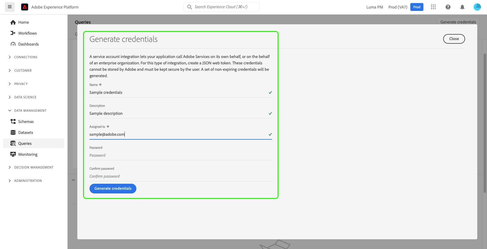

# Guide d’identification

Adobe Experience Platform Query Service vous permet de vous connecter à des clients externes. Vous pouvez vous connecter à ces clients externes à l’aide d’informations d’identification arrivant à expiration ou d’informations d’identification non arrivant à expiration.

## Expiration des informations d’identification

Vous pouvez utiliser des informations d’identification arrivant à expiration pour configurer rapidement une connexion à un client externe.


Le **[!UICONTROL Expiration des informations d’identification]** fournit les informations suivantes :

- **[!UICONTROL Hôte]**: Nom de l’hôte auquel vous vous connectez. Pour la connexion à Query Service, cela inclut le nom de l’organisation IMS que vous utilisez actuellement.
- **[!UICONTROL Port]**: Numéro de port de l’hôte auquel vous vous connectez.
- **[!UICONTROL Base]**: Nom de la base de données à laquelle vous vous connectez.
- **[!UICONTROL Nom d’utilisateur]**: Nom d’utilisateur que vous utiliserez pour vous connecter à Query Service.
- **[!UICONTROL Mot de passe]**: mot de passe que vous utiliserez pour vous connecter à Query Service.
- **[!UICONTROL PSQL, commande]**: Une commande qui a automatiquement inséré toutes les informations pertinentes pour vous connecter à Query Service à l’aide de PSQL sur la ligne de commande.
- **[!UICONTROL Expires]**: Date d’expiration des informations d’identification arrivant à expiration. Les informations d’identification expirent 24 heures après leur génération.

## Informations d’identification non arrivant à expiration

Vous pouvez utiliser des informations d’identification non arrivant à expiration pour configurer une connexion plus permanente à un client externe.

### Conditions préalables

Avant de pouvoir générer des informations d’identification non arrivant à expiration, vous devez effectuer les étapes suivantes dans Adobe Admin Console :

1. Se connecter [Adobe Admin Console](https://adminconsole.adobe.com/) et sélectionnez l’organisation appropriée dans la barre de navigation supérieure.
2. [Sélection dʼun profil de produit.](../../access-control/ui/browse.md)
3. [Configurez les **Environnements de test** et **Gestion de l’intégration de Query Service** permissions](../../access-control/ui/permissions.md) pour le profil de produit.
4. [Ajout d’un nouvel utilisateur à un profil de produit](../../access-control/ui/users.md) ils reçoivent donc les autorisations configurées.
5. [Ajout de l’utilisateur en tant qu’administrateur de profil de produit](https://helpx.adobe.com/fr/enterprise/using/manage-product-profiles.html) pour permettre la création d’un compte pour tout profil de produit principal.
6. [Ajout de l’utilisateur en tant que développeur de profil de produit](https://helpx.adobe.com/fr/enterprise/using/manage-developers.html) afin de créer une intégration.

Pour en savoir plus sur l’affectation d’autorisations, consultez la documentation sur [contrôle d&#39;accès](../../access-control/home.md).

Toutes les autorisations requises sont désormais configurées dans Adobe Developer Console pour que l’utilisateur puisse utiliser la fonction des informations d’identification arrivant à expiration.

### Génération des informations d’identification

Pour créer un ensemble d’informations d’identification non arrivant à expiration, revenez à l’interface utilisateur de Platform et sélectionnez **[!UICONTROL Requêtes]** dans le volet de navigation de gauche pour accéder à la fonction [!UICONTROL Requêtes] workspace. Sélectionnez ensuite le **[!UICONTROL Informations d’identification]** suivi de **[!UICONTROL Génération des informations d’identification]**.


Une boîte de dialogue s’affiche, vous permettant de générer des informations d’identification. Pour créer des informations d’identification non expirantes, vous devez fournir les détails suivants :

- **[!UICONTROL Nom]**: Nom des informations d’identification que vous générez.
- **[!UICONTROL Description]**: (Facultatif) Description des informations d’identification que vous générez.
- **[!UICONTROL Affecté à]**: L’utilisateur auquel les informations d’identification seront attribuées. Cette valeur doit correspondre à l’adresse électronique de l’utilisateur qui crée les informations d’identification.
- **[!UICONTROL Mot de passe]** (Facultatif) Mot de passe facultatif pour vos informations d’identification. Si le mot de passe n’est pas défini, Adobe génère automatiquement un mot de passe.

Une fois que vous avez fourni tous les détails requis, sélectionnez **[!UICONTROL Génération des informations d’identification]** pour générer vos informations d’identification.



>[!IMPORTANT]
>
>Une fois que la variable **[!UICONTROL Génération des informations d’identification]** est sélectionné, un fichier de configuration JSON est téléchargé sur votre ordinateur local. Puisque l’Adobe fonctionne **not** Enregistrez les informations d’identification générées, vous devez stocker le fichier téléchargé en toute sécurité et conserver un enregistrement des informations d’identification.
>
>De plus, si les informations d’identification ne sont pas utilisées pendant 90 jours, elles seront expurgées.

Le fichier de configuration JSON contient des informations telles que le nom du compte technique, l’identifiant de compte technique et les informations d’identification. Il est fourni au format suivant.

```json
{"technicalAccountName":"9F0A21EE-B8F3-4165-9871-846D3C8BC49E@TECHACCT.ADOBE.COM","credential":"3d184fa9e0b94f33a7781905c05203ee","technicalAccountId":"4F2611B8613AA3670A495E55"}
```

Après avoir enregistré vos informations d’identification générées, sélectionnez **[!UICONTROL Fermer]**. Vous pouvez maintenant voir une liste de toutes vos informations d’identification qui ne expirent pas.


Vous pouvez modifier ou supprimer vos informations d’identification non arrivant à expiration. Pour modifier des informations d’identification non expirantes, sélectionnez l’icône représentant un crayon (). Pour supprimer des informations d’identification non arrivant à expiration, sélectionnez l’icône de suppression ().

Lors de la modification d’informations d’identification non expirantes, un modal s’affiche. Vous pouvez fournir les détails suivants à mettre à jour :

- **[!UICONTROL Nom]**: Nom des informations d’identification que vous générez.
- **[!UICONTROL Description]**: (Facultatif) Description des informations d’identification que vous générez.
- **[!UICONTROL Affecté à]**: L’utilisateur auquel les informations d’identification seront attribuées. Cette valeur doit correspondre à l’adresse électronique de l’utilisateur qui crée les informations d’identification.


Une fois que vous avez fourni tous les détails requis, sélectionnez **[!UICONTROL Mettre à jour le compte]** pour terminer la mise à jour de vos informations d’identification.

## Utilisation des informations d’identification pour se connecter à des clients externes

Vous pouvez utiliser les informations d’identification arrivant à expiration ou non pour vous connecter à des clients externes, tels qu’Aqua Data Studio, Looker ou Power BI. La méthode de saisie de ces informations d’identification varie en fonction du client externe. Reportez-vous à la documentation du client externe pour obtenir des instructions spécifiques sur l’utilisation de ces informations d’identification.

L’image indique l’emplacement de chaque paramètre trouvé dans l’interface utilisateur, à l’exception du mot de passe des informations d’identification non arrivant à expiration. Bien que les informations d’identification non expirantes soient fournies par leurs fichiers de configuration JSON, vous pouvez afficher vos informations d’identification arrivant à expiration sous le **Informations d’identification** dans l’interface utilisateur.


Le tableau ci-dessous décrit les paramètres généralement requis pour se connecter à des clients externes.

>[!NOTE]
>
>Lors de la connexion à un hôte à l’aide d’informations d’identification non arrivant à expiration, il est toujours nécessaire d’utiliser tous les paramètres répertoriés dans la variable [!UICONTROL EXPIRATION DES INFORMATIONS D’IDENTIFICATION] sauf pour le mot de passe et le nom d’utilisateur.

| Paramètre | Description |
|---|---|
| Serveur/Hôte | Nom du serveur/hôte auquel vous vous connectez. <ul><li>Cette valeur est utilisée pour les informations d’identification arrivant à expiration et les informations d’identification non arrivant à expiration et prend la forme `server.adobe.io`. La valeur se trouve sous **[!UICONTROL Hôte]** dans le [!UICONTROL EXPIRATION DES INFORMATIONS D’IDENTIFICATION] .</ul></li> |
| Port | port du serveur/hôte auquel vous vous connectez. <ul><li>Cette valeur est utilisée pour les informations d’identification arrivant à expiration et les informations d’identification non arrivant à expiration. Elle se trouve sous **[!UICONTROL Port]** dans le [!UICONTROL EXPIRATION DES INFORMATIONS D’IDENTIFICATION] . Exemple de valeur pour le port : `80`.</ul></li> |
| Base de données | La base de données à laquelle vous vous connectez. <ul><li>Cette valeur est utilisée pour les informations d’identification arrivant à expiration et les informations d’identification non arrivant à expiration et se trouve sous **[!UICONTROL Base]** dans le [!UICONTROL EXPIRATION DES INFORMATIONS D’IDENTIFICATION] . Exemple de valeur pour la base de données : `prod:all`.</ul></li> |
| Nom d’utilisateur | Nom d’utilisateur de l’utilisateur qui se connecte au client externe. <ul><li>Cette valeur est utilisée pour les informations d’identification arrivant à expiration et les informations d’identification non arrivant à expiration. Il prend la forme d’une chaîne alphanumérique avant `@AdobeOrg`. Cette valeur se trouve sous **[!UICONTROL Nom d’utilisateur]**.</li></ul> |
| Mot de passe | Mot de passe de l’utilisateur qui se connecte au client externe. <ul><li>Si vous utilisez des informations d’identification arrivant à expiration, vous pouvez le trouver sous **[!UICONTROL Mot de passe]** dans le [!UICONTROL EXPIRATION DES INFORMATIONS D’IDENTIFICATION] .</li><li>Si vous utilisez des informations d’identification qui ne expirent pas, cette valeur correspond aux arguments concaténés de l’ID de compte technique et aux informations d’identification extraites du fichier JSON de configuration. La valeur du mot de passe se présente comme suit : `{technicalAccountId}:{credential}`.</li></ul> |

## Étapes suivantes

Maintenant que vous comprenez le fonctionnement des informations d’identification arrivant à expiration et non arrivant à expiration, vous pouvez utiliser ces informations d’identification pour vous connecter à des clients externes. Pour plus d’informations sur les clients externes, veuillez lire la section [Guide de connexion des clients à Query Service](../clients/overview.md).
