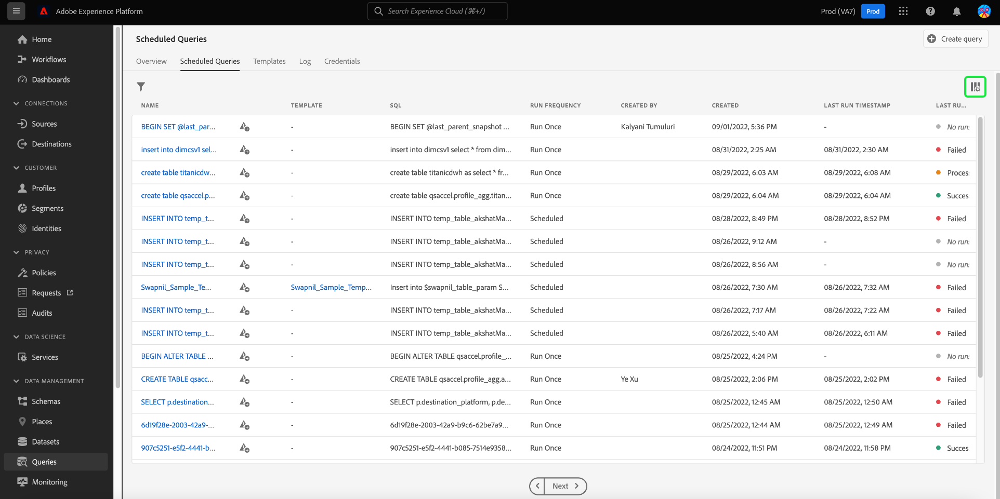
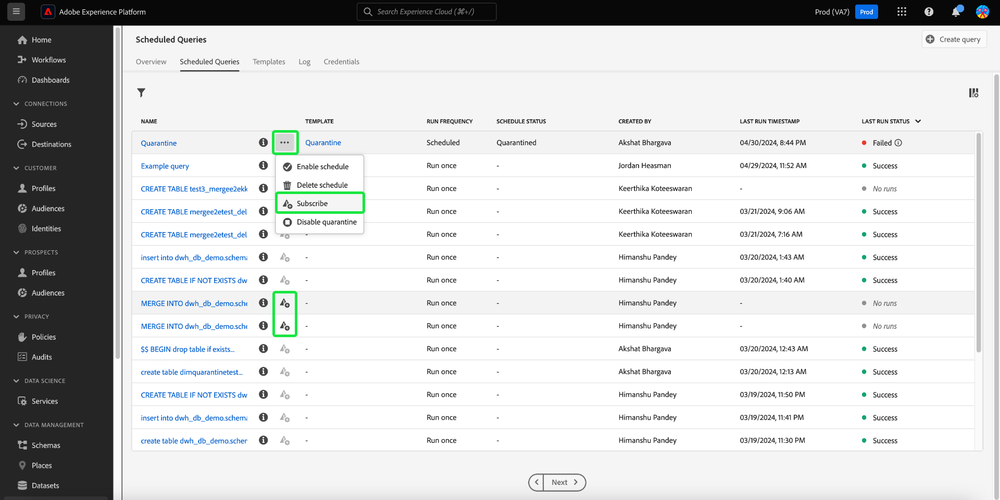
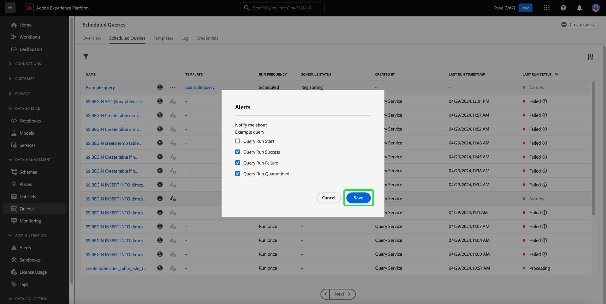
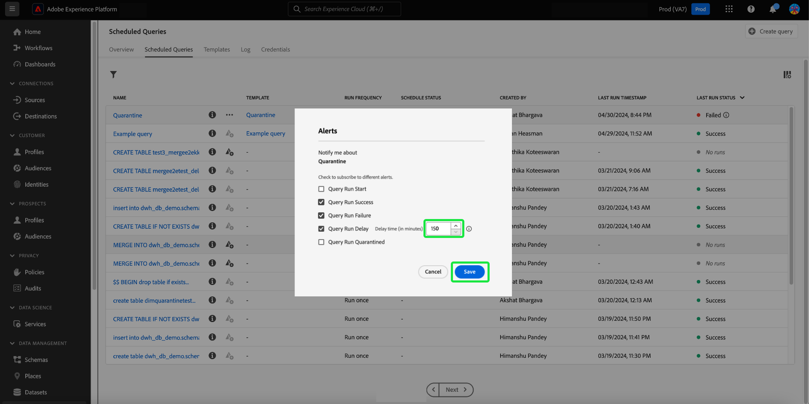
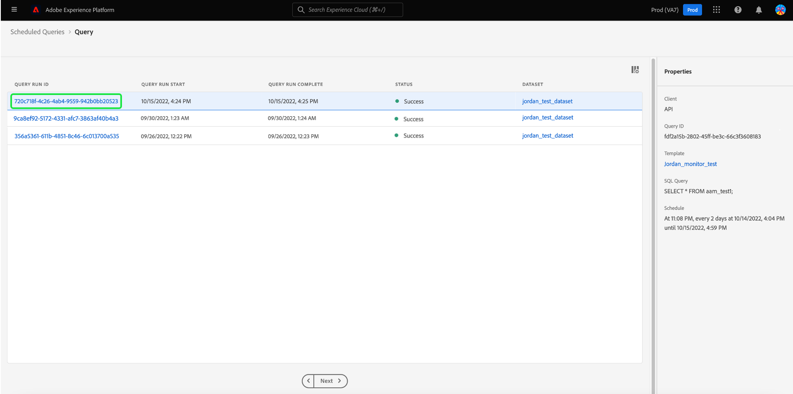
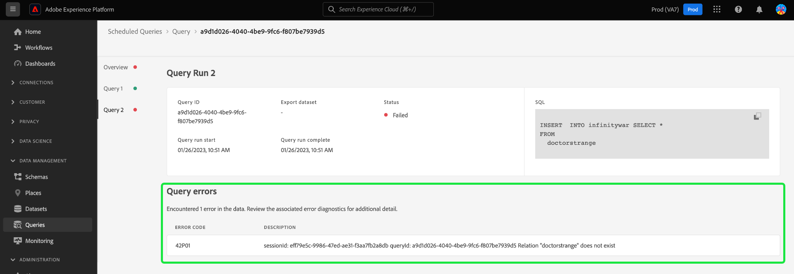

# Surveiller les requêtes planifiées

Adobe Experience Platform offre une meilleure visibilité du statut de toutes les tâches de requête via l’interface utilisateur. Depuis l’onglet [!UICONTROL &#x200B; Requêtes planifiées &#x200B;], vous pouvez maintenant trouver des informations importantes sur les exécutions de requête qui incluent l’état, les détails de planification et les messages/codes d’erreur en cas d’échec. Vous pouvez également vous abonner à des alertes pour les requêtes en fonction de leur statut par le biais de l’interface utilisateur pour l’une de ces requêtes via l’onglet [!UICONTROL Requêtes planifiées].

## [!UICONTROL Requêtes planifiées]

L’onglet [!UICONTROL Requêtes planifiées] fournit un aperçu de toutes vos requêtes CTAS et ITAS planifiées. Vous trouverez des détails sur l’exécution pour toutes les requêtes planifiées, ainsi que des codes d’erreur et des messages pour toutes les requêtes ayant échoué.

Pour accéder à l’onglet [!UICONTROL Requêtes planifiées], sélectionnez **[!UICONTROL Requêtes]** dans la barre de navigation de gauche, suivi de **[!UICONTROL Requêtes planifiées]**

Le tableau ci-dessous décrit chaque colonne disponible.

>[!NOTE]
>
>Icône d’abonnement aux alertes () est contenu dans chaque ligne d’une colonne sans titre. Consultez la section [Abonnements aux alertes](#alert-subscription) pour plus d’informations.

| Colonne | Description |
|---|---|
| **[!UICONTROL Nom]** | Le champ nom correspond soit au nom du modèle, soit aux premiers caractères de votre requête SQL. Toute requête créée à l’aide de l’interface utilisateur avec le Query Editor est nommée dès le départ. Si la requête a été créée via l’API, son nom devient un fragment de code SQL initial utilisé pour créer la requête. Pour afficher la liste de toutes les exécutions associées à la requête, sélectionnez un élément dans la colonne [!UICONTROL Nom]. Pour plus d’informations, voir la section [détails du planning d’exécution de requête](#query-runs) . |
| **[!UICONTROL Modèle]** | Nom du modèle de la requête. Sélectionnez un nom de modèle pour accéder à l’éditeur de requêtes. Le modèle de requête est affiché dans l’éditeur de requêtes pour plus de commodité. S’il n’existe aucun nom de modèle, la ligne est marquée d’un trait d’union et il n’est pas possible d’effectuer une redirection vers l’éditeur de requêtes pour afficher la requête. |
| **[!UICONTROL SQL]** | Fragment de la requête SQL. |
| **[!UICONTROL Fréquence d’exécution]** | La cadence d’exécution de votre requête. Les valeurs disponibles sont `Run once` et `Scheduled`. |
| **[!UICONTROL Créé par]** | Nom de la personne qui a créé la requête. |
| **[!UICONTROL Créé]** | La date et l’heure de création de la requête, au format UTC. |
| **[!UICONTROL Horodatage de la dernière exécution]** | La date et l’heure les plus récentes auxquelles la requête a été exécutée. Cette colonne met en évidence si une requête a été exécutée conformément à son planning actuel. |
| **[!UICONTROL État de la dernière exécution]** | Statut de la dernière exécution de la requête. Les valeurs d’état sont : `Success`, `Failed`, `In progress` et `No runs`. |
| **[!UICONTROL État de planification]** | État actuel de la requête planifiée. Il existe six valeurs potentielles, [!UICONTROL Enregistrement], [!UICONTROL Actif], [!UICONTROL Inactif], [!UICONTROL Supprimé], un trait d&#39;union et [!UICONTROL Quarantiné].<ul><li>L’état **[!UICONTROL Enregistrement]** indique que le système traite toujours la création du nouveau planning pour la requête. Remarque : vous ne pouvez pas désactiver ou supprimer une requête planifiée lors de son enregistrement.</li><li>L’état **[!UICONTROL Actif]** indique que la requête planifiée n’a **pas encore dépassé** sa date et son heure d’achèvement.</li><li>L’état **[!UICONTROL Inactif]** indique que la requête planifiée a **transmis** sa date et son heure d’achèvement ou a été marquée par un utilisateur pour être dans un état inactif.</li><li>L’état **[!UICONTROL Supprimé]** indique que le planning de requête a été supprimé.</li><li>Le trait d’union indique que la requête planifiée est une requête ponctuelle non récurrente.</li><li>L’état **[!UICONTROL Quarantined]** indique que la requête a échoué dix exécutions consécutives et nécessite votre intervention avant que d’autres exécutions puissent avoir lieu.</li></ul> |

>[!TIP]
>
>Si vous accédez à l’éditeur de requêtes, vous pouvez sélectionner **[!UICONTROL Requêtes]** pour revenir à l’onglet [!UICONTROL Modèles].

## Personnaliser les paramètres des tableaux pour les requêtes planifiées {#customize-table}

Vous pouvez ajuster les colonnes de l’onglet [!UICONTROL Requêtes planifiées] à vos besoins. Pour ouvrir la boîte de dialogue de paramètres [!UICONTROL Personnaliser le tableau] et modifier les colonnes disponibles, sélectionnez l’icône de paramètres () en haut à droite de l’écran.

>[!NOTE]
>
>La colonne [!UICONTROL Créée] qui fait référence à la date de création du planning est masquée par défaut.

Activez/désactivez les cases à cocher appropriées pour supprimer ou ajouter une colonne de tableau. Ensuite, sélectionnez **[!UICONTROL Appliquer]** pour confirmer vos choix.

>[!NOTE]
>
>Toute requête créée via l’interface utilisateur devient un modèle nommé dans le cadre du processus de création. Le nom du modèle est indiqué dans la colonne de modèle. Si la requête a été créée via l’API, la colonne de modèle est vide.

## Gestion des requêtes planifiées avec des actions intégrées {#inline-actions}

La vue [!UICONTROL Requêtes planifiées] offre diverses actions intégrées pour gérer toutes vos requêtes planifiées à partir d’un seul emplacement. Les actions intégrées sont indiquées par des points de suspension dans chaque ligne. Sélectionnez les points de suspension d’une requête planifiée que vous souhaitez gérer pour afficher les options disponibles dans un menu contextuel. Les options disponibles sont les suivantes : [[!UICONTROL Désactiver le planning]](#disable) ou [!UICONTROL Activer le planning], [[!UICONTROL Supprimer le planning]](#delete), [[!UICONTROL S’abonner]](#alert-subscription) aux alertes de requête, et [Activer ou [!UICONTROL Désactiver la quarantaine]](#quarantined-queries).

### Désactivation ou activation d’une requête planifiée {#disable}

Pour désactiver une requête planifiée, sélectionnez les points de suspension de la requête planifiée que vous souhaitez gérer, puis sélectionnez **[!UICONTROL Désactiver la planification]** dans les options du menu contextuel. Une boîte de dialogue s’affiche pour confirmer votre action. Sélectionnez **[!UICONTROL Désactiver]** pour confirmer votre paramètre.

Une fois qu’une requête planifiée est désactivée, vous pouvez activer le planning par le biais du même processus. Sélectionnez les points de suspension, puis **[!UICONTROL Activer le planning]** parmi les options disponibles.

>[!NOTE]
>
>Si une requête a été mise en quarantaine, vous devez consulter le code SQL du modèle avant d’activer son planning. Cela permet d’éviter le gaspillage d’heures de calcul si la requête de modèle présente toujours des problèmes.

### Suppression d’une requête planifiée {#delete}

Pour supprimer une requête planifiée, sélectionnez les points de suspension de la requête planifiée que vous souhaitez gérer, puis sélectionnez **[!UICONTROL Supprimer le planning]** dans les options du menu contextuel. Une boîte de dialogue s’affiche pour confirmer votre action. Sélectionnez **[!UICONTROL Supprimer]** pour confirmer votre paramètre.

Une fois qu’une requête planifiée est supprimée, elle n’est **pas** supprimée de la liste des requêtes planifiées. Les actions intégrées fournies par les ellipses sont supprimées et remplacées par l’icône d’abonnement d’une alerte grisée. Vous ne pouvez pas vous abonner à des alertes pour le planning supprimé. La ligne reste dans l’interface utilisateur pour fournir des informations sur les exécutions effectuées dans le cadre de la requête planifiée.

Si vous souhaitez planifier des exécutions pour ce modèle de requête, sélectionnez le nom du modèle dans la ligne appropriée pour accéder à l’éditeur de requêtes, puis suivez les [ instructions pour ajouter un planning à une requête](./query-schedules.md#create-schedule) comme décrit dans la documentation.

### S’abonner aux alertes {#alert-subscription}

Pour vous abonner aux alertes pour les exécutions de requête planifiées, sélectionnez l’icône `...` (points de suspension) ou l’icône d’abonnement aux alertes () pour la requête planifiée que vous souhaitez gérer. Le menu déroulant des actions intégrées s’affiche. Sélectionnez ensuite **[!UICONTROL S’abonner]** parmi les options disponibles.

La boîte de dialogue [!UICONTROL Alertes] s’ouvre. La boîte de dialogue [!UICONTROL Alertes] vous abonne à la fois aux notifications de l’interface utilisateur et aux alertes par e-mail. Plusieurs options d’abonnement aux alertes sont disponibles : `start`, `success`, `failure`, `quarantine` et `delay`. Cochez la ou les cases correspondantes et sélectionnez **[!UICONTROL Enregistrer]** pour vous abonner.

Le tableau ci-dessous décrit les types d’alerte de requête pris en charge :

| Type d’alerte | Description |
|---|---|
| `start` | Cette alerte vous avertit lorsqu’une exécution de requête planifiée est lancée ou commence à être traitée. |
| `success` | Cette alerte vous informe lorsqu’une requête planifiée s’exécute correctement, ce qui indique que la requête s’est exécutée sans erreur. |
| `failed` | Cette alerte se déclenche lorsqu’une exécution de requête planifiée rencontre une erreur ou échoue à s’exécuter correctement. Il vous aide à identifier et à résoudre rapidement les problèmes. |
| `quarantine` | Cette alerte est activée lorsqu’une exécution de requête planifiée est mise en quarantaine. Lorsque des requêtes sont inscrites dans la [fonction de quarantaine](#quarantined-queries), toute requête planifiée qui échoue dix exécutions consécutives est automatiquement placée dans un état [!UICONTROL Quarantined]. Elles nécessitent alors votre intervention avant toute autre exécution. |
| `delay` | Cette alerte vous avertit si le résultat d’une exécution de requête [&#128279;](#query-run-delay) est retardé au-delà d’un seuil spécifié. Vous pouvez définir une heure personnalisée qui déclenche l’alerte lorsque la requête s’exécute pendant cette durée sans avoir terminé ou échoué. |

>[!NOTE]
>
>Pour être informé de la mise en quarantaine des exécutions de requête, vous devez d’abord inscrire les exécutions de requête planifiées dans la [fonction de mise en quarantaine](#quarantined-queries).

Pour plus d’informations, consultez la [documentation de l’API d’abonnements aux alertes](../api/alert-subscriptions.md) .

### Afficher les détails de la requête {#query-details}

Sélectionnez l’icône d’information () pour afficher le panneau des détails de la requête. Le panneau Détails contient toutes les informations pertinentes sur la requête, au-delà des faits inclus dans le tableau des requêtes planifiées. Les informations supplémentaires incluent l’identifiant de la requête, la date de dernière modification, le code SQL de la requête, l’identifiant de planification et le planning défini actuel.

## Requêtes en quarantaine {#quarantined-queries}

>[!NOTE]
>
>L’alerte de quarantaine n’est pas disponible pour les requêtes ad hoc &quot;run-once&quot;. L’alerte de quarantaine ne s’applique qu’aux requêtes par lots planifiées (CTAS et ITAS).

Lorsqu’elle est inscrite dans la fonction de quarantaine, toute requête planifiée qui échoue dix exécutions consécutives est automatiquement placée dans un état [!UICONTROL Quarantined]. Une requête avec ce statut devient inactive et ne s’exécute pas à sa cadence planifiée. Il nécessite ensuite votre intervention avant toute autre exécution. Cela permet de protéger les ressources système, car vous devez examiner et corriger les problèmes liés à votre SQL avant d’autres exécutions.

Pour activer une requête planifiée pour la fonction de quarantaine, sélectionnez les ellipses (`...`) suivies de l’option [!UICONTROL Activer la quarantaine] dans le menu déroulant qui s’affiche.

Les requêtes peuvent également être inscrites dans la fonction de quarantaine lors du processus de création du planning. Pour plus d’informations, consultez la [documentation sur les plannings de requête](./query-schedules.md#quarantine) .

## Délai d’exécution de la requête {#query-run-delay}

Contrôlez les heures de votre ordinateur en définissant des alertes pour les délais des requêtes. Vous pouvez surveiller les performances des requêtes et recevoir des notifications si l’état d’une requête reste inchangé après une période spécifique. Utilisez l’alerte &quot;[!UICONTROL Délai d’exécution de requête]&quot; pour être averti si une requête continue à traiter après une période spécifique sans avoir terminé.

Lorsque vous [ vous abonnez aux alertes](#alert-subscription) pour les exécutions de requête planifiées, l’une des alertes disponibles est le [!UICONTROL &#x200B; &lbrace;délai d’exécution de requête]. Cette alerte nécessite de définir un seuil pour la durée de l’exécution, à ce stade, vous serez informé du retard de traitement.

Pour choisir une durée de seuil qui déclenche la notification, saisissez un nombre dans le champ de saisie de texte ou utilisez les flèches haut et bas pour augmenter d&#39;une minute. Puisque le seuil est défini en minutes, la durée maximale d’observation d’un délai d’exécution de requête est de 1 440 minutes (24 heures). La période par défaut d’un délai d’exécution est de 150 minutes.

>[!NOTE]
>
>Une exécution de requête ne peut avoir qu’un seul délai d’exécution. Si vous modifiez le seuil de délai, il est modifié pour l’utilisateur abonné à l’alerte et pour l’ensemble de votre organisation.

Consultez la section abonner aux alertes pour savoir comment [s’abonner aux [!UICONTROL alertes de délai d’exécution de requête]](#alert-subscription).

## Filtrer des requêtes {#filter}

Vous pouvez filtrer les requêtes selon la fréquence d’exécution. Dans l’onglet [!UICONTROL Requêtes planifiées], sélectionnez l’icône de filtre () pour ouvrir la barre latérale du filtre.

Pour filtrer la liste des requêtes en fonction de leur fréquence d’exécution, cochez les cases de filtre **[!UICONTROL Planifié]** ou **[!UICONTROL Exécuter une fois]** .

>[!NOTE]
>
>Toute requête qui a été exécutée mais n’a pas été planifiée est qualifiée selon l’option [!UICONTROL Exécuter une fois].

Une fois que vos critères de filtre sont activés, sélectionnez **[!UICONTROL Masquer les filtres]** pour fermer le panneau de filtrage.

## Détails du planning des exécutions de requête {#query-runs}

Pour ouvrir la page des détails du planning, sélectionnez un nom de requête dans l’onglet [!UICONTROL Requêtes planifiées] . Cette vue fournit une liste de toutes les exécutions exécutées dans le cadre de cette requête planifiée. Les informations fournies incluent l’heure de début et de fin, le statut et le jeu de données utilisé.

Ces informations apparaissent dans un tableau à cinq colonnes. Chaque ligne indique l’exécution d’une requête.

| Nom de la colonne | Description |
|---|---|
| **[!UICONTROL ID d’exécution de requête]** | Identifiant d’exécution de requête pour l’exécution quotidienne. Sélectionnez l’ **[!UICONTROL identifiant d’exécution de requête]** pour accéder à la  présentation de l’exécution de requête. |
| **[!UICONTROL Démarrage de l’exécution de requête]** | Date et heure de l’exécution de la requête. L’horodatage est au format UTC. |
| **[!UICONTROL Fin de requête]** | Date et heure de la fin de la requête. L’horodatage est au format UTC. |
| **[!UICONTROL Statut]** | Statut de la dernière exécution de la requête. Les valeurs d’état sont : `Success`, `Failed`, `In progress` ou `Quarantined`. |
| **[!UICONTROL Jeu de données]** | Jeu de données présent dans l’exécution. |

Les détails de la requête en cours de planification sont visibles dans le panneau [!UICONTROL Propriétés]. Ce panneau comprend l’ID de requête initial, le type de client, le nom du modèle, la requête SQL et la cadence du planning.

Sélectionnez un ID d’exécution de requête pour accéder à la page des détails de l’exécution et afficher les informations de la requête.

## Vue d’ensemble de l’exécution de la requête {#query-run-overview}

La [!UICONTROL présentation de l’exécution de requête] fournit des informations sur les exécutions individuelles pour cette requête planifiée et une ventilation plus détaillée de l’état de l’exécution. Cette page contient également les informations sur le client et les détails des erreurs qui ont pu entraîner l’échec de la requête.

La section du statut de la requête indique le code d’erreur et le message correspondant en cas d’échec de la requête.

Vous pouvez copier la requête SQL dans le presse-papiers à partir de cette vue. Pour copier la requête, sélectionnez l’icône de copie en haut à droite du fragment de code SQL. Un message contextuel confirme que le code a été copié.

### Exécution des détails des requêtes avec bloc anonyme {#anonymous-block-queries}

Les requêtes qui utilisent des blocs anonymes pour comprendre leurs instructions SQL sont séparées dans leurs sous-requêtes individuelles. La séparation en sous-requêtes vous permet d’examiner individuellement les détails d’exécution de chaque bloc de requête.

>[!NOTE]
>
>Les détails d&#39;exécution d&#39;un bloc anonyme qui utilise la commande DROP **not** seront signalés comme une sous-requête distincte. Des détails d’exécution distincts sont disponibles pour les requêtes CTAS, les requêtes ITAS et les instructions COPY utilisées comme sous-requêtes de bloc anonymes. Les détails d’exécution de la commande DROP ne sont actuellement pas pris en charge.

Les blocs anonymes sont identifiés à l&#39;aide d&#39;un préfixe `$$` avant la requête. Pour en savoir plus sur les blocs anonymes dans le service de requête, consultez le [document de bloc anonyme](../key-concepts/anonymous-block.md).

Les sous-requêtes de bloc anonymes ont des onglets à gauche de l’état d’exécution. Sélectionnez un onglet pour afficher les détails de l’exécution.

En cas d’échec d’une requête bloquée anonyme, vous pouvez trouver le code d’erreur correspondant à ce bloc spécifique via cette interface utilisateur.

Sélectionnez **[!UICONTROL Requête]** pour revenir à l’écran des détails du planning, ou **[!UICONTROL Requêtes planifiées]** pour revenir à l’onglet [!UICONTROL Requêtes planifiées].

