# Surveiller les requêtes planifiées

Adobe Experience Platform offre une meilleure visibilité du statut de toutes les tâches de requête via l’interface utilisateur. Depuis l’onglet [!UICONTROL Requêtes planifiées], vous pouvez désormais trouver des informations importantes sur vos exécutions de requêtes qui incluent le statut, les détails de la planification et les messages/codes d’erreur en cas d’échec. Vous pouvez également vous abonner à des alertes pour les requêtes en fonction de leur statut par le biais de l’interface utilisateur pour l’une de ces requêtes via l’onglet [!UICONTROL Requêtes planifiées].

## [!UICONTROL Requêtes planifiées]

L’onglet [!UICONTROL Requêtes planifiées] donne un aperçu de toutes vos requêtes CTAS et ITAS planifiées. Vous trouverez des détails sur l’exécution pour toutes les requêtes planifiées, ainsi que des codes d’erreur et des messages pour toutes les requêtes ayant échoué.

Pour accéder à l’onglet [!UICONTROL &#x200B; Requêtes planifiées &#x200B;], sélectionnez **[!UICONTROL Requêtes]** dans la barre de navigation de gauche, suivi de **[!UICONTROL Requêtes planifiées]**

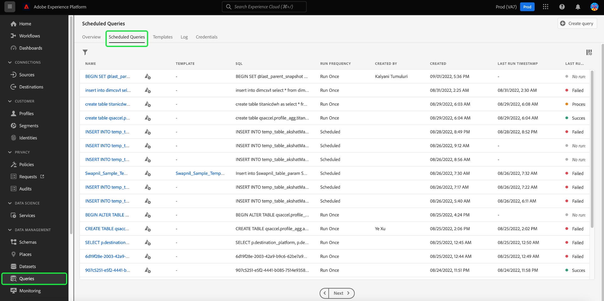

Le tableau ci-dessous décrit chaque colonne disponible.

>[!NOTE]
>
>L’icône d’abonnement aux alertes () est contenu dans chaque ligne d’une colonne sans titre. Consultez la section [Abonnements aux alertes](#alert-subscription) pour plus d’informations.

| Colonne | Description |
|---|---|
| **[!UICONTROL Nom]** | Le champ nom correspond soit au nom du modèle, soit aux premiers caractères de votre requête SQL. Toute requête créée à l’aide de l’interface utilisateur avec le requêteur est nommée dès le départ. Si la requête a été créée via l’API, son nom devient un extrait du SQL initial utilisé pour créer la requête. Pour afficher la liste de toutes les exécutions associées à la requête, sélectionnez un élément dans la colonne [!UICONTROL Nom]. Pour plus d’informations, voir la section [détails du planning d’exécution des requêtes](#query-runs). |
| **[!UICONTROL Modèle]** | Nom du modèle de la requête. Sélectionnez un nom de modèle pour accéder au requêteur. Le modèle de requête est affiché dans le requêteur pour plus de commodité. S’il n’existe aucun nom de modèle, la ligne est marquée d’un trait d’union et il n’est pas possible d’effectuer une redirection vers le requêteur pour afficher la requête. |
| **[!UICONTROL SQL]** | Fragment de la requête SQL. |
| **[!UICONTROL Fréquence d’exécution]** | La cadence d’exécution de votre requête. Les valeurs disponibles sont `Run once` et `Scheduled`. |
| **[!UICONTROL Créé par]** | Nom de la personne qui a créé la requête. |
| **[!UICONTROL Créé]** | La date et l’heure de création de la requête, au format UTC. |
| **[!UICONTROL Date et heure de la dernière exécution]** | La date et l’heure les plus récentes auxquelles la requête a été exécutée. Cette colonne met en évidence si une requête a été exécutée conformément à son planning actuel. |
| **[!UICONTROL Statut de la dernière exécution]** | Statut de la dernière exécution de la requête. Les valeurs de statut sont les suivantes : `Success`, `Failed`, `In progress` et `No runs`. |
| **[!UICONTROL Statut de la planification]** | Statut actuel de la requête planifiée. Il existe six valeurs potentielles : [!UICONTROL Enregistrement], [!UICONTROL Actif], [!UICONTROL Inactif], [!UICONTROL Supprimé], un trait d’union et [!UICONTROL En quarantaine].<ul><li>Le statut **[!UICONTROL Enregistrement]** indique que le système est toujours en train de traiter la création du nouveau planning pour la requête. Notez que vous ne pouvez pas désactiver ni supprimer une requête planifiée pendant son enregistrement.</li><li>Le statut **[!UICONTROL Actif]** indique que la requête planifiée n’a **pas encore expiré** sa date et son heure de fin.</li><li>Le statut **[!UICONTROL Inactif]** indique que la requête planifiée a **dépassé** sa date et son heure de fin ou qu’elle a été marquée par un utilisateur comme étant inactive.</li><li>Le statut **[!UICONTROL Supprimé]** indique que le planning de la requête a été supprimé.</li><li>Le trait d’union indique que la requête planifiée est une requête unique et non récurrente.</li><li>Le statut **[!UICONTROL En quarantaine]** indique que la requête a échoué dix exécutions consécutives et nécessite votre intervention avant que d’autres exécutions ne puissent avoir lieu.</li></ul> |

>[!TIP]
>
>Si vous accédez à l’éditeur de requêtes, vous pouvez sélectionner **[!UICONTROL Requêtes]** pour revenir à l’onglet [!UICONTROL Modèles].

## Personnaliser les paramètres des tableaux pour les requêtes planifiées {#customize-table}

Vous pouvez ajuster les colonnes de l’onglet [!UICONTROL Requêtes planifiées] à vos besoins. Pour ouvrir la boîte de dialogue des paramètres [!UICONTROL Personnaliser le tableau] et modifier les colonnes disponibles, sélectionnez l’icône des paramètres () en haut à droite de l’écran.

>[!NOTE]
>
>La colonne [!UICONTROL Créé] qui fait référence à la date de création de la planification est masquée par défaut.

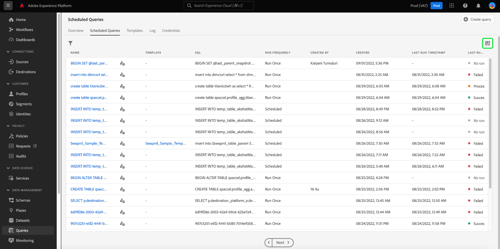

Activez/désactivez les cases à cocher appropriées pour supprimer ou ajouter une colonne de tableau. Sélectionnez ensuite **[!UICONTROL Appliquer]** pour confirmer vos choix.

>[!NOTE]
>
>Toute requête créée via l’interface utilisateur devient un modèle nommé dans le cadre du processus de création. Le nom du modèle est indiqué dans la colonne de modèle. Si la requête a été créée via l’API, la colonne de modèle est vide.

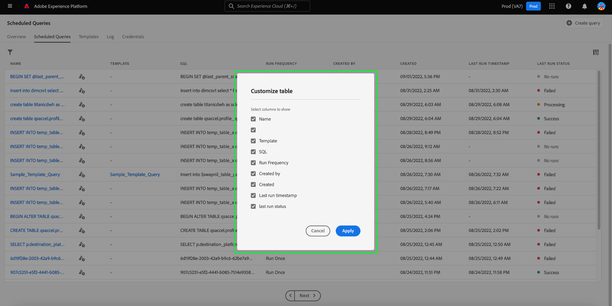

## Gestion des requêtes planifiées avec des actions intégrées {#inline-actions}

La vue [!UICONTROL Requêtes planifiées] offre diverses actions intégrées pour gérer toutes vos requêtes planifiées à partir d’un seul emplacement. Les actions intégrées sont indiquées dans chaque ligne par des points de suspension. Sélectionnez les points de suspension d’une requête planifiée que vous souhaitez gérer pour afficher les options disponibles dans un menu pop-up. Les options disponibles sont les suivantes : [[!UICONTROL Désactiver le planning]](#disable) ou [!UICONTROL Activer le planning], [[!UICONTROL Modifier le planning]](#edit), [[!UICONTROL Supprimer le planning]](#delete), [[!UICONTROL S’abonner]](#alert-subscription) pour envoyer des alertes de requête, et [Activer ou [!UICONTROL Désactiver la quarantaine]](#quarantined-queries).

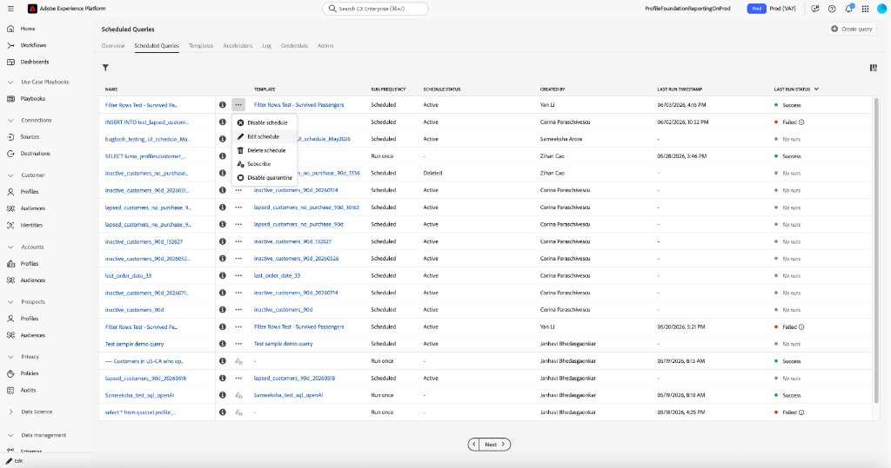

### Désactiver ou activer une requête planifiée {#disable}

Pour désactiver une requête planifiée, sélectionnez les points de suspension de la requête planifiée que vous souhaitez gérer, puis sélectionnez **[!UICONTROL Désactiver le planning]** dans les options du menu pop-up. Une boîte de dialogue s’affiche pour confirmer votre action. Sélectionnez **[!UICONTROL Désactiver]** pour confirmer votre paramètre.

Une fois qu’une requête planifiée est désactivée, vous pouvez activer le planning par le même processus. Sélectionnez les points de suspension, puis sélectionnez **[!UICONTROL Activer le planning]** dans les options disponibles.

>[!NOTE]
>
>Si une requête a été mise en quarantaine, vous devez vérifier le code SQL du modèle avant d’activer son planning. Cela évite le gaspillage d’heures de calcul si la requête de modèle présente toujours des problèmes.

### Modification d’une requête planifiée {#edit}

Pour modifier une requête planifiée, sélectionnez les points de suspension (**...**) pour le planning que vous souhaitez modifier, puis sélectionnez **[!UICONTROL Modifier le planning]** dans les options du menu pop-up. Le workflow de modification s’ouvre, vous permettant de mettre à jour les paramètres de planification pris en charge, tels que la fréquence, la date de fin, l’inscription à la quarantaine de requête et les abonnements aux alertes.

L’option **[!UICONTROL Modifier le planning]** n’est disponible que pour les plannings actifs. Les planifications terminées, supprimées ou en cours d&#39;enregistrement n&#39;affichent pas cette option.

Pour obtenir des instructions complètes sur le workflow de modification, les champs modifiables et les exigences d’éligibilité, consultez [Modifier un planning](./query-schedules.md#edit-schedule).

### Supprimer une requête planifiée {#delete}

Pour supprimer une requête planifiée, sélectionnez les points de suspension de la requête planifiée que vous souhaitez gérer, puis sélectionnez **[!UICONTROL Supprimer le planning]** dans les options du menu pop-up. Une boîte de dialogue s’affiche pour confirmer votre action. Sélectionnez **[!UICONTROL Supprimer]** pour confirmer votre paramètre.

Une fois qu’une requête planifiée est supprimée, elle n’est **pas** supprimée de la liste des requêtes planifiées. Les actions intégrées fournies par les points de suspension sont supprimées et remplacées par l’icône grisée Ajouter un abonnement aux alertes. Vous ne pouvez pas vous abonner aux alertes pour le planning supprimé. La ligne reste dans l’interface utilisateur pour fournir des informations sur les exécutions effectuées dans le cadre de la requête planifiée.

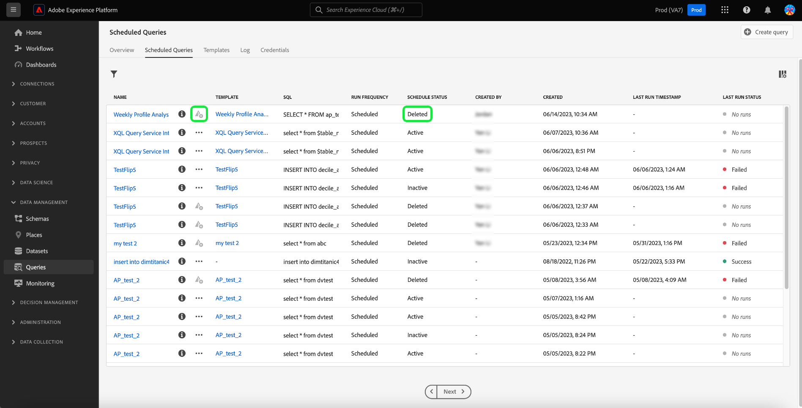

Si vous souhaitez planifier des exécutions pour ce modèle de requête, sélectionnez le nom du modèle à partir de la ligne appropriée pour accéder à Query Editor, puis suivez les [instructions pour ajouter un planning à une requête](./query-schedules.md#create-schedule) comme décrit dans la documentation.

### S’abonner aux alertes {#alert-subscription}

Pour vous abonner à des alertes pour les exécutions de requête planifiées, sélectionnez l’icône d’abonnement aux `...` (points de suspension) ou aux alertes () pour la requête planifiée que vous souhaitez gérer. Le menu déroulant des actions intégrées s’affiche. Sélectionnez ensuite **[!UICONTROL S’abonner]** parmi les options disponibles.

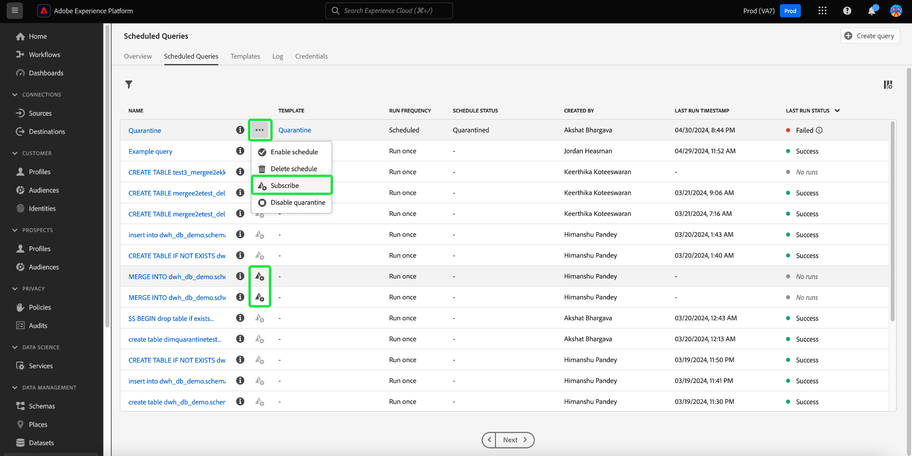

La boîte de dialogue [!UICONTROL Alertes] s’ouvre. La boîte de dialogue [!UICONTROL Alertes] vous abonne à la fois aux notifications de l’interface utilisateur et aux alertes par e-mail. Plusieurs options d’abonnement aux alertes sont disponibles : `start`, `success`, `failure`, `quarantine` et `delay`. Cochez la ou les cases correspondantes et sélectionnez **[!UICONTROL Enregistrer]** pour vous abonner.

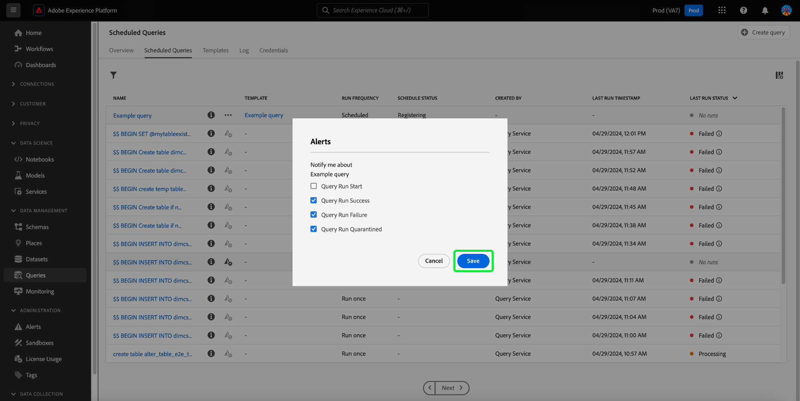

Le tableau ci-dessous décrit les types d’alerte de requête pris en charge :

| Type d’alerte | Description |
|---|---|
| `start` | Cette alerte vous avertit lorsqu’une exécution de requête planifiée est lancée ou commence à être traitée. |
| `success` | Cette alerte vous informe lorsqu’une exécution de requête planifiée se termine avec succès, indiquant que la requête s’est exécutée sans erreur. |
| `failed` | Cette alerte se déclenche lorsqu’une exécution de requête planifiée rencontre une erreur ou ne s’exécute pas correctement. Cela vous aide à identifier et à résoudre les problèmes rapidement. |
| `quarantine` | Cette alerte est activée lorsqu’une exécution de requête planifiée est mise en quarantaine. Lorsque des requêtes sont inscrites dans la [fonction de quarantaine](#quarantined-queries), toute requête planifiée qui échoue dix exécutions consécutives est automatiquement placée dans un état [!UICONTROL Quarantaine]. Elles nécessitent ensuite votre intervention avant que d’autres exécutions ne puissent avoir lieu. |
| `delay` | Cette alerte vous avertit en cas de [&#x200B; retard dans le résultat de l’exécution d’une requête](#query-run-delay) au-delà d’un seuil spécifié. Vous pouvez définir une heure personnalisée qui déclenche l’alerte lorsque la requête s’exécute pendant cette durée sans terminer ni échouer. |

>[!NOTE]
>
>Pour être averti de la mise en quarantaine des exécutions de requête, vous devez d’abord inscrire les exécutions de requête planifiées à la [fonction de quarantaine](#quarantined-queries).

Pour plus d’informations, consultez la [documentation de l’API d’abonnements aux alertes](../api/alert-subscriptions.md).

### Affichage des détails de la requête {#query-details}

Sélectionnez l’icône d’information () pour afficher le panneau des détails de la requête. Le panneau de détails contient toutes les informations pertinentes sur la requête au-delà des faits inclus dans le tableau des requêtes planifiées. Les informations supplémentaires incluent l’identifiant de la requête, la date de dernière modification, le code SQL de la requête, l’identifiant du planning et le planning défini actuel.

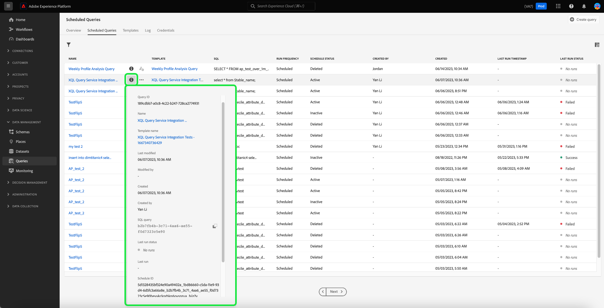

## Requêtes mises en quarantaine {#quarantined-queries}

>[!NOTE]
>
>L’alerte de quarantaine n’est pas disponible pour les requêtes ad hoc « run-once ». L’alerte de quarantaine s’applique uniquement aux requêtes par lots planifiées (CTAS et ITAS).

Lorsqu’elle est inscrite à la fonction de quarantaine, toute requête planifiée qui échoue dix exécutions consécutives passe automatiquement au statut [!UICONTROL Quarantaine]. Une requête avec ce statut devient inactive et ne s’exécute pas à sa cadence planifiée. Il nécessite ensuite votre intervention avant que d’autres exécutions ne puissent avoir lieu. Cela permet de préserver les ressources système, car vous devez examiner et corriger les problèmes liés à votre SQL avant que d’autres exécutions ne se produisent.

Pour activer une requête planifiée pour la fonction de quarantaine, sélectionnez les points de suspension (`...`) suivis de [!UICONTROL Activer la quarantaine] dans le menu déroulant qui s’affiche.

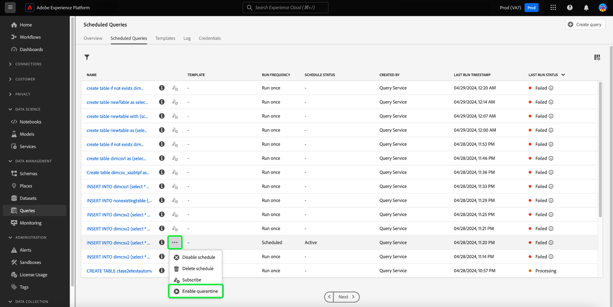

Les requêtes peuvent également être inscrites à la fonction de quarantaine pendant le processus de création du planning. Pour plus d’informations, consultez la [documentation sur les plannings de requête](./query-schedules.md#quarantine).

## Retard d’exécution de la requête {#query-run-delay}

Gardez le contrôle de vos heures de calcul en définissant des alertes pour les retards de requête. Vous pouvez surveiller les performances des requêtes et recevoir des notifications si le statut d’une requête reste inchangé après une période spécifique. Utilisez l’alerte « [!UICONTROL Délai d’exécution de la requête] » pour recevoir une notification si une requête continue à être traitée après une période spécifique sans être terminée.

Lorsque vous vous [abonnez à des alertes](#alert-subscription) pour les exécutions de requête planifiées, l’une des alertes disponibles est le [!UICONTROL Délai d’exécution de requête]. Cette alerte nécessite de définir un seuil pour le temps d’exécution. Vous serez alors informé du retard de traitement.

Pour choisir une durée seuil qui déclenche la notification, saisissez un nombre dans le champ de saisie de texte ou utilisez les flèches vers le haut et vers le bas pour augmenter par incréments d’une minute. Comme le seuil est défini en minutes, la durée maximale d’observation d’un délai d’exécution de requête est de 1 440 minutes (24 heures). La période par défaut d’un délai d’exécution est de 150 minutes.

>[!NOTE]
>
>Une exécution de requête ne peut avoir qu’un seul délai d’exécution. Si vous modifiez le seuil de délai, il est également modifié pour l’utilisateur ou l’utilisatrice abonné à l’alerte et pour l’ensemble de l’organisation.

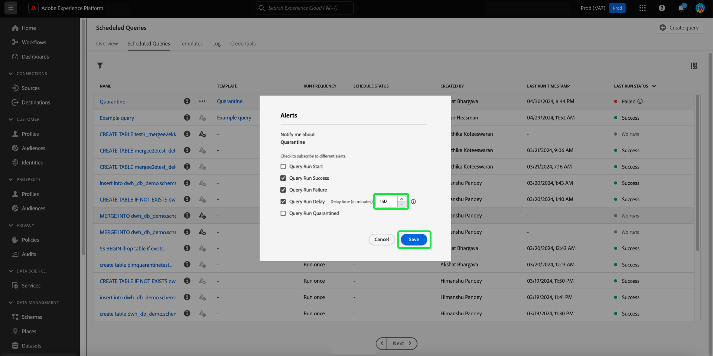

Consultez la section Abonnement aux alertes pour savoir comment [vous abonner aux alertes [!UICONTROL Délai d’exécution des requêtes]](#alert-subscription).

## Filtrer des requêtes {#filter}

Vous pouvez filtrer les requêtes selon la fréquence d’exécution. Dans l’onglet [!UICONTROL Requêtes planifiées], sélectionnez l’icône de filtre () pour ouvrir la barre latérale du filtre.

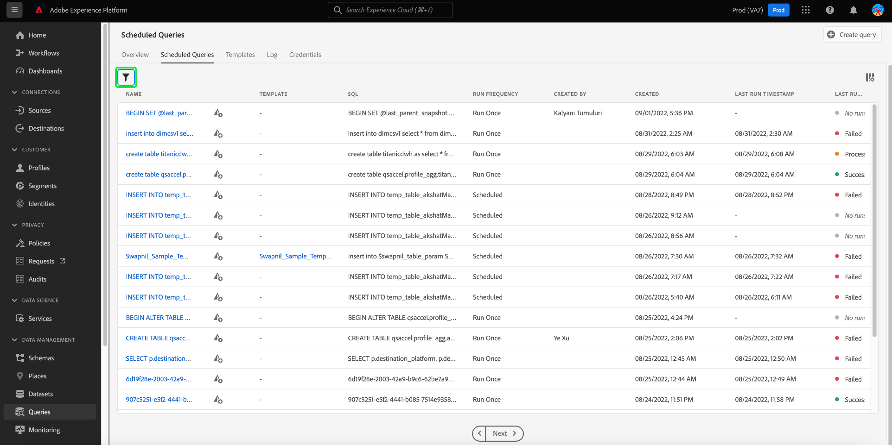

Pour filtrer la liste des requêtes en fonction de leur fréquence d’exécution, cochez les cases de filtrage **[!UICONTROL Planifié]** ou **[!UICONTROL Exécuter une fois]**.

>[!NOTE]
>
>Toute requête qui a été exécutée mais n’a pas été planifiée est qualifiée [!UICONTROL Exécutée une fois].

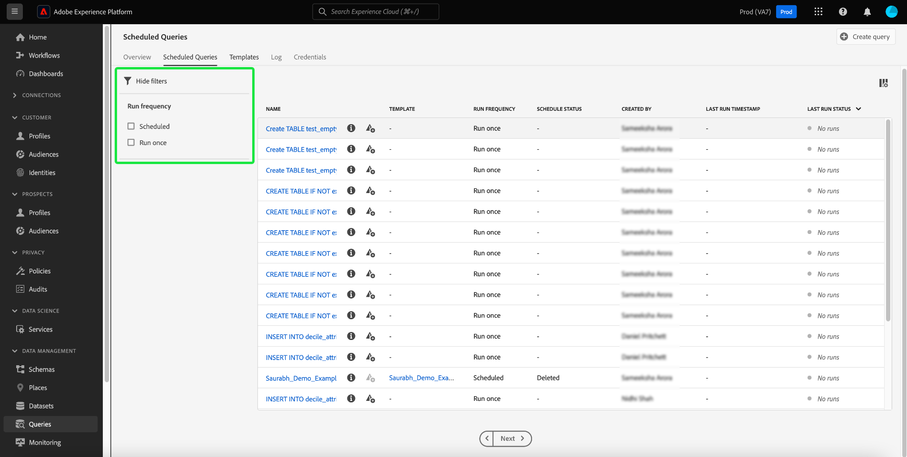

Une fois vos critères de filtre activés, sélectionnez **[!UICONTROL Masquer les filtres]** pour fermer le panneau de filtrage.

## Page Détails du planning {#query-runs}

Pour ouvrir la page des détails du planning, sélectionnez un nom de requête dans l’onglet [!UICONTROL Requêtes planifiées]. Cette vue fournit une liste de toutes les exécutions exécutées dans le cadre de cette requête planifiée. Les informations fournies incluent l’heure de début et de fin, le statut et le jeu de données utilisé. Pour les plannings actifs, sélectionnez **[!UICONTROL Modifier le planning]** dans le coin supérieur droit pour modifier la configuration du planning. Voir [Modifier un planning](./query-schedules.md#edit-schedule) pour obtenir des instructions complètes.

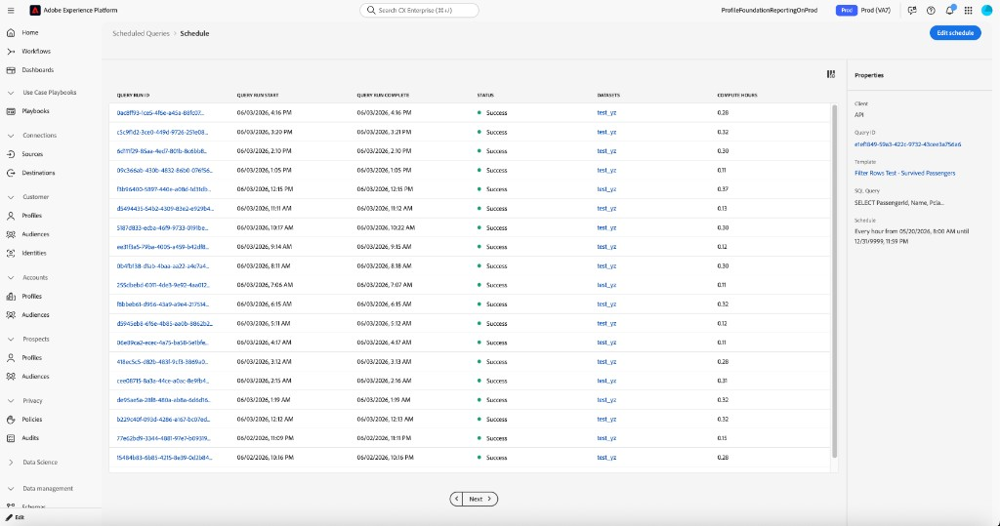

Ces informations apparaissent dans un tableau à cinq colonnes. Chaque ligne indique l’exécution d’une requête.

| Nom de la colonne | Description |
|---|---|
| **[!UICONTROL ID d’exécution de requête]** | Identifiant d’exécution de requête pour l’exécution quotidienne. Sélectionnez l’**[!UICONTROL ID d’exécution de requête]** pour accéder à l’[!UICONTROL aperçu de l’exécution de requête]. |
| **[!UICONTROL Démarrage de l’exécution de la requête]** | Date et heure de l’exécution de la requête. La date et l’heure sont au format UTC. |
| **[!UICONTROL Exécution de la requête terminée]** | Date et heure de la fin de la requête. La date et l’heure sont au format UTC. |
| **[!UICONTROL Statut]** | Statut de la dernière exécution de la requête. Les valeurs de statut sont les suivantes : `Success`, `Failed`, `In progress` ou `Quarantined`. |
| **[!UICONTROL Jeu de données]** | Jeu de données présent dans l’exécution. |

Les détails de la requête en cours de planification sont visibles dans le panneau [!UICONTROL Propriétés]. Ce panneau comprend l’ID de requête initial, le type de client, le nom du modèle, la requête SQL et la cadence du planning.

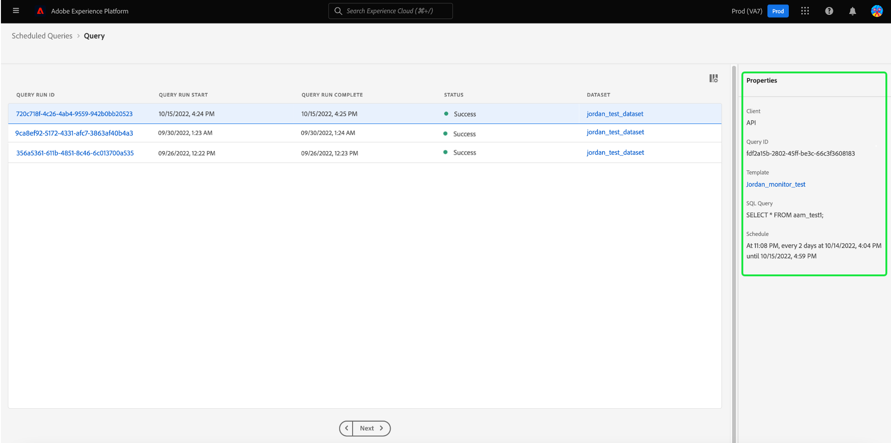

Sélectionnez un ID d’exécution de requête pour accéder à la page des détails de l’exécution et afficher les informations de la requête.

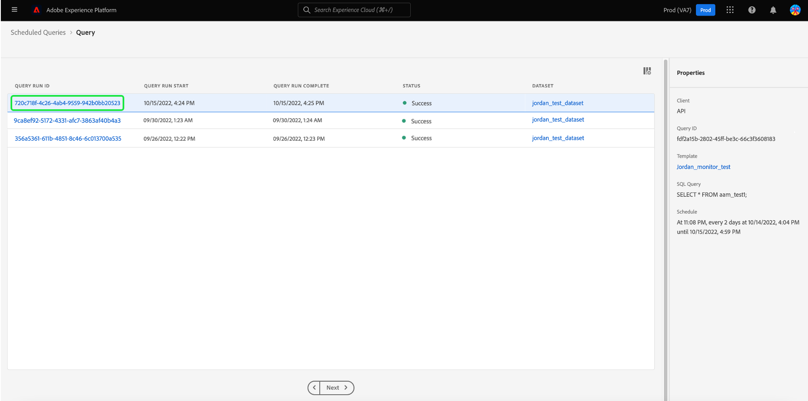

## Vue d’ensemble de l’exécution de la requête {#query-run-overview}

La [!UICONTROL présentation de l’exécution de la requête] fournit des informations sur les exécutions individuelles de cette requête planifiée et une répartition plus détaillée du statut de l’exécution. Cette page inclut également les informations sur le client et les détails de toutes les erreurs qui ont pu entraîner l’échec de la requête.

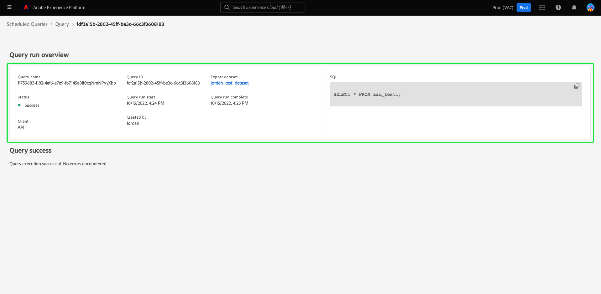

La section du statut de la requête indique le code d’erreur et le message correspondant en cas d’échec de la requête.

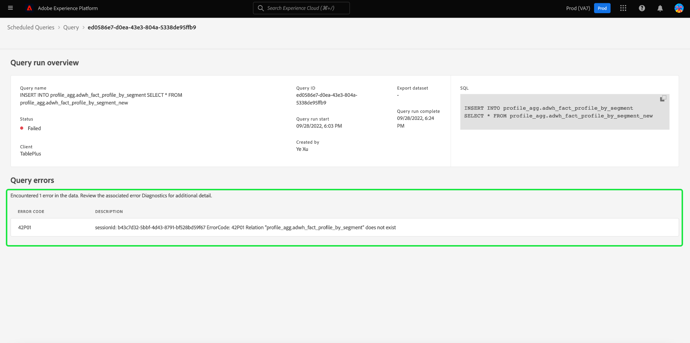

Vous pouvez copier la requête SQL dans le presse-papiers à partir de cette vue. Pour copier la requête, sélectionnez l’icône de copie en haut à droite du fragment de code SQL. Un message contextuel confirme que le code a été copié.

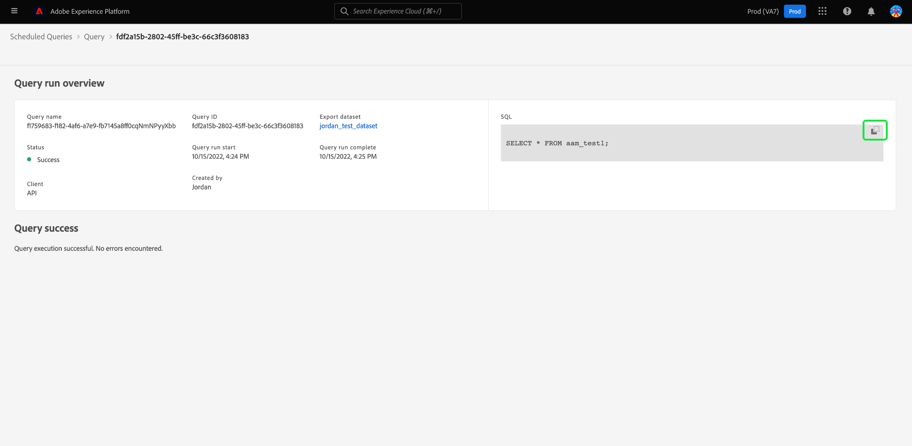

### Exécuter les détails des requêtes avec un bloc anonyme {#anonymous-block-queries}

Les requêtes qui utilisent des blocs anonymes pour comprendre leurs instructions SQL sont séparées dans leurs sous-requêtes individuelles. La séparation en sous-requêtes vous permet d’examiner individuellement les détails d’exécution de chaque bloc de requête.

>[!NOTE]
>
>Les détails d’exécution d’un bloc anonyme qui utilise la commande DROP ne sont **pas** signalés comme une sous-requête distincte. Des détails d’exécution distincts sont disponibles pour les requêtes CTAS, les requêtes ITAS et les instructions COPY utilisées comme sous-requêtes de bloc anonymes. Les détails d’exécution de la commande DROP ne sont actuellement pas pris en charge.

Les blocs anonymes sont signalés par l’utilisation d’un préfixe `$$` avant la requête. Pour en savoir plus sur les blocs anonymes dans Query Service, consultez le document [Bloc anonyme](../key-concepts/anonymous-block.md).

Les sous-requêtes en bloc anonymes comportent des onglets à gauche du statut d’exécution. Sélectionnez un onglet pour afficher les détails de l’exécution.

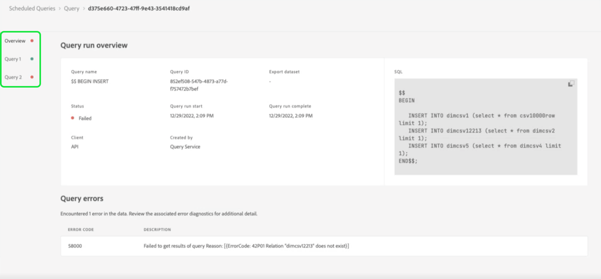

Dans le cas où une requête de bloc anonyme échoue, vous pouvez trouver le code d’erreur pour ce bloc spécifique via cette interface utilisateur.

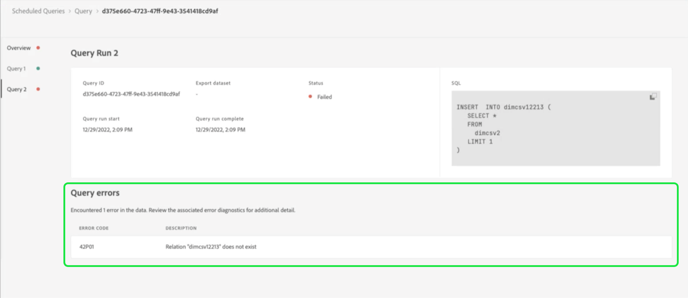

Sélectionnez **[!UICONTROL Requête]** pour revenir à l’écran des détails du planning, ou **[!UICONTROL Requêtes planifiées]** pour revenir à l’onglet [!UICONTROL Requêtes planifiées].

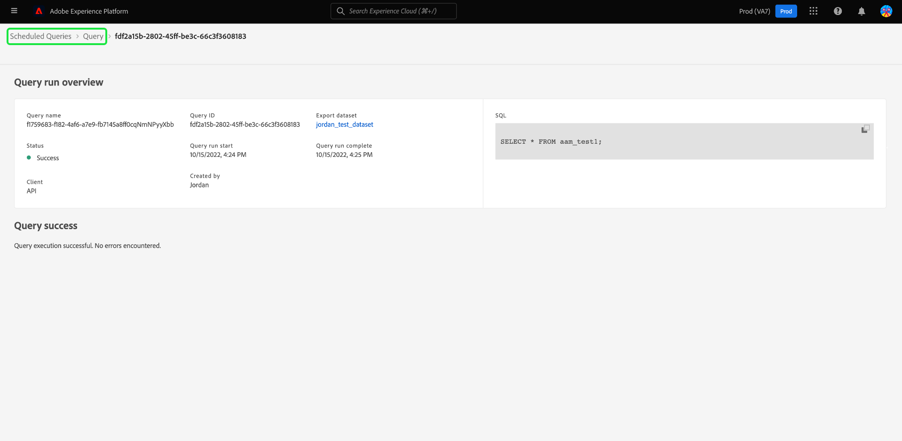
