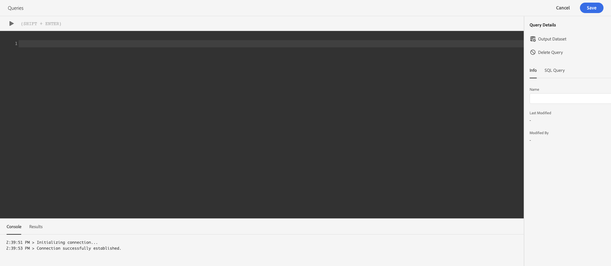

# Guide du service 

Le service de Adobe Experience Platform fournit une interface utilisateur qui permet d’écrire et d’exécuter des  de, des précédemment exécutés et d’accéder aux enregistrés par les utilisateurs au sein de votre organisation IMS. Pour accéder à l’interface utilisateur d’ [Adobe Experience Platform][platform-ui], sélectionnez **de** dans le volet de navigation de gauche.

## Éditeur de 

L’éditeur de  de vous permet d’écrire et d’exécuter des  de sans utiliser de client externe. Cliquez sur **Créer un** pour ouvrir l’éditeur de  de et créer un nouveau . Vous pouvez également accéder à l’éditeur de  de en sélectionnant un  de dans les onglets *Journal* ou *Parcourir* . La sélection d&#39;un  exécuté ou enregistré précédemment ouvrira l&#39;éditeur de  de et affichera le code SQL pour le sélectionné.

L’éditeur de  offre un espace de modification dans lequel vous pouvez commencer à saisir un  de. Au fur et à mesure que vous tapez, l&#39;éditeur complète automatiquement les mots réservés SQL, les tables et les noms de champ dans les tables. Lorsque vous avez terminé d’écrire votre  de, cliquez sur **Lecture** pour exécuter le  de. L&#39;onglet *Console* situé sous l&#39;éditeur indique ce que fait actuellement le service de  de, indiquant le moment où un  de a été renvoyé. L’onglet *Résultat* , en regard de la Console, affiche les résultats . Pour plus d’informations sur l’utilisation de l’éditeur de  de, reportez-vous au guide [de l’éditeur de][query-editor] .

## Parcourir

L’onglet *Parcourir* affiche les  enregistrées par les utilisateurs de votre entreprise. Il est utile de les voir comme des projets , car les  sauvés ici peuvent encore être en construction. Les  affichées dans l’onglet *Parcourir* s’affichent également sous la forme de exécutés dans l’onglet *Journal* s’ils ont été exécutés par le service denavigation.

| Colonne | Description |
| --- | --- |
| Nom | Nom de  créé par l’utilisateur. Vous pouvez cliquer sur le nom pour ouvrir le  dans l’éditeur de  de. Vous pouvez également utiliser la barre de recherche pour effectuer une recherche sur le nom d’un . Les recherches sont sensibles à la casse. |
| SQL | Les premiers caractères du SQL . Placez le pointeur de la souris sur le code pour afficher le  complet du. |
| Modifié par | Dernier utilisateur qui a modifié le . Tout utilisateur de votre entreprise ayant accès au service  peut modifier les  de. |
| Dernière modification | date et heure de la dernière modification apportée au , dans le fuseau horaire du navigateur. |

## Journal

L’onglet *Journal* fournit un de  de qui ont été exécutés précédemment. Par défaut, le de journaux  le dans la chronologie inverse.

| Colonne | Description |
| --- | --- |
| Nom | Nom du , composé des premiers caractères de la  SQL. En cliquant sur le nom, vous ouvrez l’éditeur de , ce qui vous permet de modifier le  du. Vous pouvez utiliser la barre de recherche pour effectuer une recherche sur le nom d’un. Les recherches sont sensibles à la casse. |
| Créé par | Nom de la personne qui a créé le . |
| Client | Client utilisé pour le  de. |
| Jeu de données | Jeu de données d’entrée utilisé par le . Cliquez sur le jeu de données pour accéder à l&#39;écran des détails du jeu de données d&#39;entrée. |
| État | Statut actuel du . |
| Dernière exécution | Quand le a été exécuté en dernier. Vous pouvez trier le  par ordre croissant ou décroissant en cliquant sur la flèche au-dessus de cette colonne. |
| Heure d’exécution | Le temps nécessaire pour exécuter le . |

## Informations d&#39;identification

L’onglet *Informations d’identification* affiche les informations d’identification des publications. Cliquez sur l’icône **Copier** en regard d’un champ pour stocker son contenu dans la mémoire tampon du clavier. Pour plus d’informations sur l’utilisation de ces informations d’identification pour établir une connexion avec des clients externes, consultez le guide [][connect-clients]Connexion avec des clients.

## Étapes suivantes

Maintenant que vous connaissez l’interface utilisateur du service  sur Plateforme, vous pouvez accéder à l’éditeur de  de pour créer vos propres projets deformulaire à partager avec d’autres utilisateurs de votre organisation. Pour plus d’informations sur la création et l’exécution de  de dans l’éditeur de  de, consultez le guide [d’utilisation de l’éditeur de][query-editor]de  dede l’éditeur de contenu.

[platform-ui]: https://platform.adobe.com
[query-editor]: user-guide.md
[connect-clients]: ../clients/overview.md
