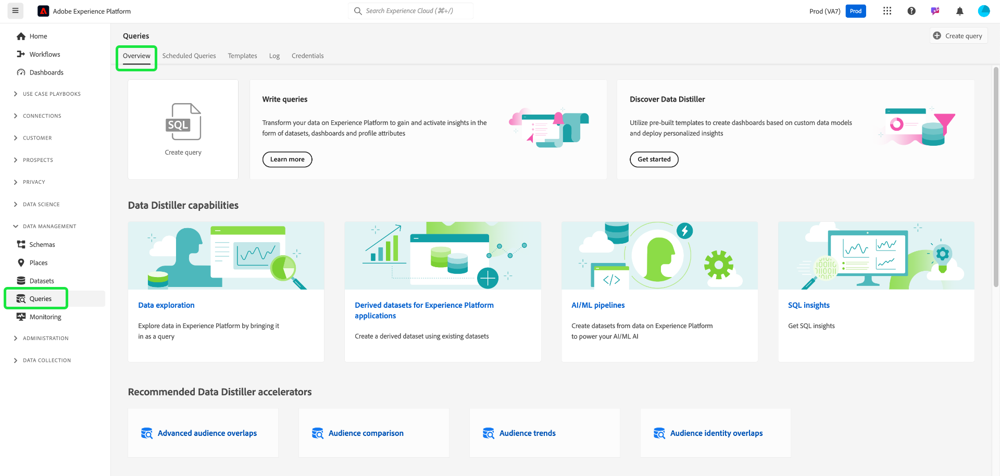
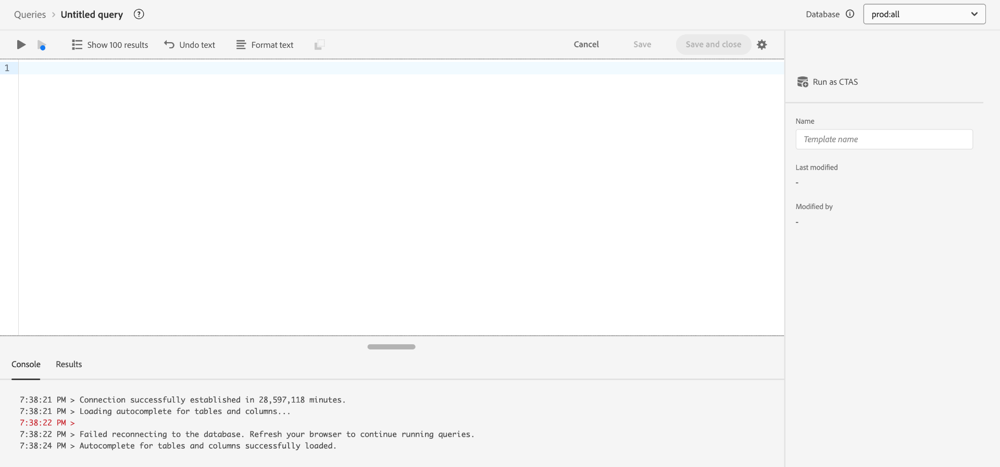

# Guide de l’interface utilisateur de Query Service

Adobe Experience Platform Query Service fournit une interface utilisateur qui permet d’écrire et d’exécuter des requêtes, d’afficher des requêtes précédemment exécutées et d’accéder aux requêtes enregistrées par les utilisateurs de votre entreprise. Pour accéder à l’interface utilisateur dans [Adobe Experience Platform](https://platform.adobe.com), sélectionnez **[!UICONTROL Requêtes]** dans le volet de navigation de gauche. La [!UICONTROL Requêtes] [!UICONTROL Présentation] s’affiche.

## Vue d’ensemble {#overview}

L’onglet [!UICONTROL Aperçu] fournit un point d’entrée rationalisé pour l’utilisation des requêtes et des modèles Distiller de données. Ici, vous pouvez accéder à toutes les fonctionnalités nécessaires pour écrire des requêtes, explorer des jeux de données et analyser les données d’audience, afin d’assurer un workflow fluide pour vos analyses de données et vos insights d’audience. Utilisez cet aperçu pour découvrir ce que vous pouvez réaliser avec Data Distiller et découvrir des mesures clés sur l’utilisation de Query Service.

### Panneaux principaux {#main-panels}

La page [!UICONTROL Overview] contient plusieurs sections principales pour vous aider à démarrer :

1. Sélectionnez **[!UICONTROL Créer une requête]** pour accéder rapidement à l’éditeur de requêtes afin d’écrire et d’exécuter de nouvelles requêtes.
2. Sélectionnez **[!UICONTROL En savoir plus]** pour afficher la documentation détaillée sur la **[!UICONTROL écriture de requêtes]**.
3. Sélectionnez **[!UICONTROL Commencer]** dans la section **[!UICONTROL Discover Data Distiller]** pour ouvrir la présentation de Data Distiller et découvrir les fonctionnalités disponibles.

### Capacités de Data Distiller {#data-distiller-capabilities}

La section [!UICONTROL Fonctionnalités de Data Distiller] fournit des liens vers la documentation vers des fonctionnalités plus avancées de Data Distiller :

- **[[!UICONTROL Exploration des données]](../use-cases/data-exploration.md)** : découvrez comment explorer, dépanner et vérifier les données ingérées par lots à l’aide de SQL.
- **[[!UICONTROL Jeux de données dérivés pour applications Experience Platform]](../data-distiller/derived-datasets/overview.md)** : découvrez comment créer des jeux de données dérivés pour prendre en charge des cas d’utilisation complexes et variés qui optimisent votre utilitaire de données.
- **[[!UICONTROL Pipelines AI/ML]](../data-distiller/ml-feature-pipelines/overview.md)** : découvrez les concepts importants derrière vos outils d’apprentissage automatique préférés et comment créer des modèles personnalisés qui prennent en charge vos cas d’utilisation marketing. Cette série de guides décrit les étapes nécessaires à la création de pipelines de fonctionnalités qui préparent les données d’Experience Platform pour alimenter les modèles personnalisés dans votre environnement d’apprentissage automatique.
- **[[!UICONTROL Statistiques SQL]](../data-distiller/sql-insights/overview.md)** : découvrez les fonctionnalités clés et les étapes requises pour développer un tableau de bord d’insights à partir de SQL avec Data Distiller.

### Accélérateurs de Data Distiller recommandés {#recommended-accelerators}

Sélectionnez un lien rapide pour accéder aux tableaux de bord Data Distiller [!UICONTROL Modèles] correspondants. Chaque accélérateur fournit de puissants outils et visualisations pour vous aider à analyser les données d’audience, à optimiser la segmentation et à améliorer les stratégies de ciblage.

- **[[!UICONTROL Chevauchement d’audience avancé]](../../dashboards/sql-insights-query-pro-mode/templates/overlaps.md)** : à partir de ce tableau de bord, vous pouvez analyser les intersections d’audience entre plusieurs segments d’audience afin de découvrir des informations précieuses et d’optimiser les stratégies de segmentation. Vous pouvez également exporter vos informations à des fins d’analyse hors ligne ou de création de rapports.
- **[[!UICONTROL Comparaison d’audience]](../../dashboards/sql-insights-query-pro-mode/templates/comparison.md)** : dans ce tableau de bord, vous pouvez comparer et contraster les mesures d’audience clés côte à côte pour analyser deux groupes d’audience en détail. Ces informations vous aident à comprendre la taille, la croissance et d’autres indicateurs clés de performances de l’audience, ce qui vous permet d’affiner la segmentation et d’optimiser les stratégies de ciblage grâce à des décisions basées sur les données.
- **[[!UICONTROL Tendances d’audience]](../../dashboards/sql-insights-query-pro-mode/templates/trends.md)** : utilisez le tableau de bord [!UICONTROL Tendances d’audience] pour visualiser l’évolution de vos audiences au fil du temps au moyen de mesures clés telles que la croissance de l’audience, le nombre d’identités et les profils d’identité uniques. Suivez les tendances pour découvrir des informations précieuses sur le comportement des audiences, ce qui vous permet d’affiner la segmentation, d’améliorer l’engagement et d’optimiser les stratégies de ciblage pour des campagnes plus efficaces.
Effectuez le suivi des mesures d’audience au fil du temps afin de surveiller les modifications de la taille de l’audience, la croissance de l’identité et l’engagement global.
- **[[!UICONTROL Chevauchement d’identité d’audience]](../../dashboards/sql-insights-query-pro-mode/templates/identity-overlaps.md)** : utilisez le tableau de bord Chevauchement d’identité d’audience pour analyser les chevauchements d’identité au sein des audiences sélectionnées. Les visualisations et les données tabulées fournissent des informations pour optimiser le groupement d’identités, réduire la redondance et améliorer la segmentation. Ces informations permettent un ciblage plus efficace, une personnalisation améliorée et des interactions client simplifiées.

### Exemples Data Distiller  {#data-distiller-examples}

Sélectionnez une carte pour ouvrir des guides et des exemples de documentation afin de vous aider à tirer le meilleur parti de Data Distiller :

- **[[!UICONTROL Jeux de données dérivés basés sur des déciles]](../use-cases/deciles-use-case.md)** : découvrez comment créer des jeux de données dérivés basés sur des déciles pour la segmentation et la création d’audiences dans Adobe Experience Platform. À l’aide d’un scénario de fidélité aérienne, il couvre la conception de schémas, les calculs de déciles et les exemples de requêtes pour classer et agréger les données.
- **[[!UICONTROL Valeur de durée de vie du client]](../use-cases/customer-lifetime-value.md)** : découvrez comment effectuer le suivi et visualiser la valeur de durée de vie du client avec Real-Time CDP et des tableaux de bord personnalisés. Utilisez ces informations pour développer des stratégies d’acquisition de nouveaux clients, conserver les clients existants et maximiser les marges bénéficiaires.
- **[[!UICONTROL Score de propension]](../use-cases/propensity-score.md)** : découvrez comment déterminer des scores de propension à l’aide de modèles prédictifs d’apprentissage automatique. Ce guide couvre l’envoi de données pour la formation, l’application de modèles formés avec SQL et la prédiction de la probabilité d’achat des clients.
- **[[!UICONTROL Analyse du consentement]](../../dashboards/insights-use-cases/consent-analysis.md)** : découvrez comment analyser et suivre le consentement des clients à l’aide de Real-Time CDP, Query Service et Data Distiller. Ce guide couvre la création de tableaux de bord de consentement, l’amélioration de la segmentation, le suivi des tendances et la conformité, ce qui vous aide à créer la confiance et à offrir des expériences personnalisées.
- **[[!UICONTROL Correspondance approximative]](../use-cases/fuzzy-match.md)** : découvrez comment effectuer une correspondance approximative sur vos données Experience Platform pour rechercher des correspondances approximatives et analyser la similarité de chaînes dans les jeux de données. Suivez ce guide pour gagner du temps et rendre vos données plus accessibles. L’exemple illustre la manière de faire correspondre les attributs des chambres d’hôtel entre deux jeux de données des agences de voyage, en montrant comment associer, comparer et réconcilier efficacement des jeux de données volumineux et complexes pour garantir cohérence et précision.

### Mesures clés {#key-metrics}

La section Mesures clés affiche des visualisations de données importantes qui vous aident à surveiller l’utilisation de Query Service. Pour chaque graphique, vous pouvez sélectionner les points de suspension (`...`) en haut à droite, suivis de l’option [!UICONTROL  Afficher plus] pour afficher une forme tabulée des résultats, ou télécharger les données sous forme de fichier CSV à afficher dans une feuille de calcul. Pour plus d&#39;informations, consultez le [guide d&#39;affichage supplémentaire](../../dashboards/sql-insights-query-pro-mode/view-more.md).

#### Définition d’un filtre de date {#set-date-filter}

Pour appliquer un filtre de date global pour ces visualisations, sélectionnez l’icône de filtre () et ajustez la période dans la boîte de dialogue **[!UICONTROL Filtres]** . Appliquez ce filtre pour personnaliser les mesures affichées pour une période spécifique et améliorer la pertinence de votre analyse.

#### [!UICONTROL Requêtes par lots Distiller] {#distiller-batch-queries}

Le graphique [!UICONTROL Requêtes par lots Distiller] fournit une ventilation de l’activité de requête par jour, soulignant le nombre de requêtes CTAS et ITAS (interactives et planifiées) traitées. Le graphique met en évidence les schémas, tels que les pics dans les requêtes interactives certains jours et l’utilisation rare de requêtes planifiées. Utilisez ces informations pour optimiser les performances en identifiant les périodes de pointe des activités, en affinant les stratégies de planification et en équilibrant l’exécution des requêtes afin d’améliorer l’efficacité des workflows et l’utilisation des ressources.

#### [!UICONTROL Calculer les heures consommées] {#compute-hours-consumed}

Le graphique [!UICONTROL Nombre d’heures de calcul consommées] offre une visualisation quotidienne des heures de calcul utilisées pour traiter les opérations de Query Service. Utilisez ces tendances d’heure de calcul pour surveiller la consommation des ressources, identifier les périodes à forte demande et optimiser l’exécution des requêtes afin d’assurer une affectation et des performances des ressources efficaces.

#### [!UICONTROL  Requêtes exploratoires de données ]

Le graphique [!UICONTROL  Requêtes exploratoires de données ] affiche le nombre de requêtes SELECT traitées à la demande chaque jour. Cette visualisation présente les tendances des activités de requête, telles que les pics d’utilisation sur des jours spécifiques, afin de vous aider à comprendre quand vos efforts d’exploration des données sont les plus actifs. Utilisez ces informations pour surveiller les schémas d’utilisation des requêtes, équilibrer les charges de travail et optimiser l’affectation des ressources pour l’analyse exploratoire des données. Cette analyse permet une utilisation plus efficace de Query Service et une meilleure planification pour les périodes à forte demande.

## Requêteur

Utilisez Query Editor pour écrire et exécuter des requêtes sans utiliser de client externe. Sélectionnez **[!UICONTROL Créer une requête]** pour ouvrir l’éditeur de requêtes et créer une requête. Vous pouvez également accéder à Query Editor en sélectionnant une requête dans les onglets **[!UICONTROL Journal]** ou **[!UICONTROL Modèles]** . Si vous sélectionnez une requête exécutée ou enregistrée précédemment, l’éditeur de requêtes s’ouvre et affiche le code SQL de la requête sélectionnée.

Lorsque vous tapez dans Query Editor, l’éditeur complète automatiquement les mots réservés SQL, les tableaux et les noms de champ dans les tableaux. Lorsque vous avez terminé d’écrire votre requête, sélectionnez l’icône de lecture () pour exécuter la requête. L’onglet **[!UICONTROL Console]** situé sous l’éditeur indique ce que fait actuellement Query Service et indique quand une requête a été renvoyée. L’onglet **[!UICONTROL Result]**, en regard de [!UICONTROL Console], affiche les résultats de la requête. Pour plus d’informations sur l’utilisation de Query Editor, consultez le [guide de Query Editor](./user-guide.md) .

## Requêtes planifiées {#scheduled-queries}

Les requêtes qui ont déjà été enregistrées en tant que modèle peuvent être planifiées pour une exécution régulière. Lors de la planification d’une requête, vous pouvez choisir la fréquence des exécutions, la date de début et de fin, le jour de la semaine où la requête planifiée s’exécute, ainsi que le jeu de données vers lequel exporter la requête. Les plannings de requête sont définis à l’aide de Query Editor.

Pour savoir comment planifier une requête via l’interface utilisateur, consultez le [guide des requêtes planifiées](./user-guide.md#scheduled-queries). Pour savoir comment ajouter des plannings à l’aide de l’API, veuillez lire le [guide de point d’entrée des requêtes planifiées](../api/scheduled-queries.md).

Une fois qu’une requête a été planifiée, elle apparaît dans la liste des requêtes planifiées de l’onglet [!UICONTROL Requêtes planifiées] . Vous trouverez des détails complets sur la requête, les exécutions, le créateur et les minutages en sélectionnant une requête planifiée dans la liste.

<!--  -->

| Colonne | Description |
| --- | --- |
| **[!UICONTROL Nom]** | Le champ nom correspond soit au nom du modèle, soit aux premiers caractères de votre requête SQL. Toute requête créée à l’aide de l’interface utilisateur avec le Query Editor est nommée dès le départ. Si la requête a été créée via l’API, alors le nom de la requête est un extrait de code SQL initial utilisé pour créer la requête. |
| **[!UICONTROL Modèle]** | Nom du modèle de la requête. Sélectionnez un nom de modèle pour accéder à l’éditeur de requêtes. Le modèle de requête est affiché dans l’éditeur de requêtes pour plus de commodité. S’il n’existe aucun nom de modèle, la ligne est marquée d’un trait d’union et il n’est pas possible d’effectuer une redirection vers l’éditeur de requêtes pour afficher la requête. |
| **[!UICONTROL SQL]** | Fragment de la requête SQL. |
| **[!UICONTROL Fréquence d’exécution]** | Cette colonne indique la cadence d’exécution de votre requête. Les valeurs disponibles sont `Run once` et `Scheduled`. Les requêtes peuvent être filtrées en fonction de leur fréquence d’exécution. |
| **[!UICONTROL Créé par]** | Nom de la personne qui a créé la requête. |
| **[!UICONTROL Créé]** | La date et l’heure de création de la requête, au format UTC. |
| **[!UICONTROL Horodatage de la dernière exécution]** | La date et l’heure les plus récentes auxquelles la requête a été exécutée. Cette colonne met en évidence si une requête a été exécutée conformément à son planning actuel. |
| **[!UICONTROL État de la dernière exécution]** | Statut de la dernière exécution de la requête. Les trois valeurs de statut sont les suivantes : `successful` `failed` ou `in progress`. |

Consultez la documentation pour plus d’informations sur la façon de [surveiller les requêtes via l’interface utilisateur de Query Service](./monitor-queries.md).

## Modèles {#browse}

L’onglet **[!UICONTROL Modèles]** affiche les requêtes enregistrées par les utilisateurs de votre organisation. Il est utile de les voir comme des projets de requêtes, car les requêtes enregistrées ici peuvent encore être en cours de construction. Les requêtes affichées dans l’onglet **[!UICONTROL Modèles]** s’affichent également sous forme de requêtes exécutées dans l’onglet **[!UICONTROL Journal]** si elles ont déjà été exécutées par Query Service.

| Colonne | Description |
| --- | --- |
| **[!UICONTROL Nom]** | Le nom du champ est soit le nom de la requête donné par l’utilisateur, soit les premiers caractères de votre requête SQL. Toute requête créée à l’aide de l’interface utilisateur avec le Query Editor est nommée dès le départ. Si la requête a été créée via l’API, le nom de la requête est un extrait du SQL initial utilisé pour créer la requête. Vous pouvez sélectionner le nom de la requête pour l’ouvrir dans Query Editor. Vous pouvez également utiliser la barre de recherche pour rechercher le [!UICONTROL nom] d’une requête. Les recherches sont sensibles à la casse. |
| **[!UICONTROL SQL]** | Premiers caractères de la requête SQL. Placez le pointeur de la souris sur le code pour afficher la requête entière. |
| **[!UICONTROL Modifié par]** | Dernier utilisateur à avoir modifié la requête. Tout utilisateur de votre organisation ayant accès à Query Service peut modifier les requêtes. |
| **[!UICONTROL Dernière modification]** | Date et heure de la dernière modification apportée à la requête, dans le fuseau horaire du navigateur. |

Pour plus d’informations sur les modèles dans l’interface utilisateur de Platform, consultez la documentation [Modèles de requête](./query-templates.md) .

## Journal {#log}

L’onglet **[!UICONTROL Journal]** fournit une liste de requêtes qui ont été exécutées précédemment. Par défaut, le journal répertorie les requêtes dans l’ordre chronologique décroissant.

| Colonne | Description |
| --- | --- |
| **[!UICONTROL Nom]** | Nom de la requête, composé des premiers caractères de la requête SQL. Sélectionnez le nom du modèle pour ouvrir la vue [!UICONTROL Détails du journal de requête] pour cette exécution. Vous pouvez utiliser la barre de recherche pour effectuer une recherche sur le nom d’une requête. Les recherches sont sensibles à la casse. |
| **[!UICONTROL Heure de début]** | Heure à laquelle la requête a été exécutée. |
| **[!UICONTROL Durée complète]** | Heure à laquelle la requête s’est exécutée. |
| **[!UICONTROL Statut]** | Statut actuel de la requête. |
| **[!UICONTROL Jeu de données]** | Jeu de données d’entrée utilisé par la requête. Cliquez sur le jeu de données pour accéder à l’écran des détails du jeu de données d’entrée. |
| **[!UICONTROL Client]** | Client utilisé pour la requête. |
| **[!UICONTROL Créé par]** | Nom de la personne qui a créé la requête. |

>
>
>Sélectionnez l’icône en forme de crayon () de n’importe quelle ligne du journal de requête pour accéder à l’éditeur de requêtes. La requête est prérenseignée pour faciliter la modification.

Pour plus d’informations sur les fichiers journaux générés automatiquement par un événement de requête, reportez-vous à la [documentation sur les journaux de requête](./query-logs.md) .

## Informations d’identification

L’onglet **[!UICONTROL Informations d’identification]** affiche vos informations d’identification arrivant à expiration et les autres. Pour plus d’informations sur l’utilisation de ces informations d’identification pour établir une connexion avec des clients externes, consultez le [guide des informations d’identification](../clients/overview.md).

## Étapes suivantes

Maintenant que vous connaissez l’interface utilisateur de Query Service sur [!DNL Platform], vous pouvez accéder à Query Editor pour commencer à créer vos propres projets de requête à partager avec d’autres utilisateurs de votre entreprise. Pour plus d’informations sur la création et l’exécution de requêtes dans l’éditeur de requêtes, consultez le [guide d’utilisation de l’éditeur de requêtes](./user-guide.md).

