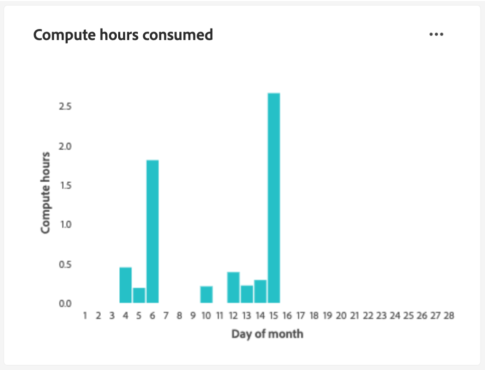

# Guide de l’interface utilisateur de Query Service

Le service de requête Adobe Experience Platform fournit une interface utilisateur qui peut être utilisée pour écrire et exécuter des requêtes, afficher des requêtes précédemment exécutées et accéder à des requêtes enregistrées par des utilisateurs et utilisatrices au sein de votre organisation. Pour accéder à l’interface utilisateur dans [Adobe Experience Platform](https://platform.adobe.com), sélectionnez **[!UICONTROL Requêtes]** dans le volet de navigation de gauche. Le [!UICONTROL Requêtes] [!UICONTROL Aperçu] s’affiche.

## Vue d’ensemble {#overview}

L’onglet [!UICONTROL Aperçu] offre un point d’entrée simplifié pour l’utilisation des requêtes et des modèles de Distiller de données. Ici, vous pouvez accéder à toutes les fonctionnalités nécessaires à l’écriture de requêtes, à l’exploration de jeux de données et à l’analyse des données d’audience, afin d’assurer un workflow fluide pour vos analyses de données et informations d’audience. Utilisez cette présentation pour découvrir ce que vous pouvez obtenir avec Data Distiller ainsi que les mesures clés relatives à l’utilisation de Query Service.

### Panneaux principaux {#main-panels}

La page [!UICONTROL Aperçu] contient plusieurs sections principales pour vous aider à commencer :

1. Sélectionnez **[!UICONTROL Créer une requête]** pour accéder rapidement à l’éditeur de requêtes afin d’écrire et d’exécuter de nouvelles requêtes.
2. Sélectionnez **[!UICONTROL En savoir plus]** pour consulter la documentation détaillée sur la manière d’**[!UICONTROL Écrire des requêtes]**.
3. Sélectionnez **[!UICONTROL Commencer]** dans la section **[!UICONTROL Découvrir la Distiller de données]** pour ouvrir la présentation de la Distiller de données et en savoir plus sur les fonctionnalités disponibles.

### Fonctionnalités de Data Distiller {#data-distiller-capabilities}

La section [!UICONTROL Fonctionnalités de Data Distiller] fournit des liens vers la documentation de fonctionnalités de Data Distiller plus avancées :

- **[[!UICONTROL Exploration des données]](../use-cases/data-exploration.md)** : découvrez comment explorer, dépanner et vérifier les données ingérées par lots à l’aide de SQL.
- **[[!UICONTROL Jeux de données dérivés pour les applications Experience Platform]](../data-distiller/derived-datasets/overview.md)** : découvrez comment créer des jeux de données dérivés pour prendre en charge des cas d’utilisation complexes et variés afin d’optimiser votre utilitaire de données.
- **[[!UICONTROL Pipelines AI/ML]](../data-distiller/ml-feature-pipelines/overview.md)** : découvrez les concepts importants sous-jacents à vos outils de machine learning préférés et comment créer des modèles personnalisés qui prennent en charge vos cas d’utilisation marketing. Cette série de guides décrit les étapes nécessaires à la création de pipelines de fonctionnalités qui préparent les données d’Experience Platform pour alimenter des modèles personnalisés dans votre environnement de machine learning.
- **[[!UICONTROL Informations SQL]](../data-distiller/sql-insights/overview.md)** : découvrez les fonctionnalités clés et les étapes requises pour développer un tableau de bord d’informations à partir de SQL avec Data Distiller.

### Accélérateurs de Data Distiller recommandés {#recommended-accelerators}

Sélectionnez un lien rapide pour accéder aux tableaux de bord Data Distiller appropriés [!UICONTROL Modèles]. Chaque accélérateur fournit des outils et des visualisations puissants pour vous aider à analyser les données d’audience, à optimiser la segmentation et à améliorer les stratégies de ciblage.

- **[[!UICONTROL Chevauchements d’audience avancés]](../../dashboards/sql-insights-query-pro-mode/templates/overlaps.md)** : depuis ce tableau de bord, vous pouvez analyser les intersections d’audience entre plusieurs segments d’audience pour découvrir des informations précieuses et optimiser les stratégies de segmentation. Vous pouvez également exporter vos informations à des fins d’analyse hors ligne ou de création de rapports.
- **[[!UICONTROL Comparaison d’audiences]](../../dashboards/sql-insights-query-pro-mode/templates/comparison.md)** : depuis ce tableau de bord, vous pouvez comparer et mettre en contraste les mesures d’audience clés côte à côte pour analyser deux groupes d’audiences en détail. Ces informations vous aident à comprendre la taille de l’audience, la croissance et d’autres indicateurs clés de performances, ce qui vous permet d’affiner la segmentation et d’optimiser les stratégies de ciblage avec des décisions axées sur les données.
- **[[!UICONTROL Tendances d’audience]](../../dashboards/sql-insights-query-pro-mode/templates/trends.md)** : utilisez le tableau de bord [!UICONTROL Tendances d’audience] pour visualiser l’évolution de vos audiences au fil du temps grâce à des mesures clés telles que la croissance de l’audience, le nombre d’identités et les profils d’identité uniques. Suivez les tendances pour découvrir de précieuses informations sur le comportement de l’audience, ce qui vous permet d’affiner la segmentation, d’améliorer l’engagement et d’optimiser les stratégies de ciblage pour des campagnes plus efficaces.
Suivez les mesures d’audience au fil du temps pour surveiller les modifications de la taille de l’audience, la croissance des identités et l’engagement global.
- **[[!UICONTROL Chevauchements d’identités d’audience]](../../dashboards/sql-insights-query-pro-mode/templates/identity-overlaps.md)** : utilisez le tableau de bord Chevauchements d’identités d’audience pour analyser les chevauchements d’identités dans les audiences sélectionnées. Les visualisations et les données tabulées fournissent des informations pour optimiser la combinaison d’identités, réduire la redondance et améliorer la segmentation. Ces informations permettent un ciblage plus efficace, une personnalisation améliorée et des interactions client rationalisées.

### Exemples Data Distiller {#data-distiller-examples}

Sélectionnez une carte pour ouvrir les guides de documentation et les exemples qui vous aideront à tirer le meilleur parti de Data Distiller :

- **[[!UICONTROL Jeux de données dérivés basés sur des déciles]](../use-cases/deciles-use-case.md)** : découvrez comment créer des jeux de données dérivés basés sur des déciles pour la segmentation et la création d’audiences dans Adobe Experience Platform. En utilisant un scénario de fidélité à une compagnie aérienne, il couvre la conception de schéma, les calculs de déciles et les exemples de requête pour le classement et l’agrégation des données.
- **[[!UICONTROL Valeur de la durée de vie du client]](../use-cases/customer-lifetime-value.md)** : découvrez comment suivre et visualiser la valeur de la durée de vie du client avec Real-Time CDP et les tableaux de bord personnalisés. Utilisez ces informations pour développer des stratégies d&#39;acquisition de nouveaux clients, fidéliser les clients existants et maximiser les marges bénéficiaires.
- **[[!UICONTROL Score de propension]](../use-cases/propensity-score.md)** : découvrez comment déterminer des scores de propension à l’aide de modèles prédictifs de machine learning. Ce guide couvre l’envoi de données pour la formation, l’application de modèles formés avec SQL et la prédiction de la probabilité d’achat du client.
- **[[!UICONTROL Analyse du consentement]](../../dashboards/insights-use-cases/consent-analysis.md)** : découvrez comment analyser et suivre le consentement des clients à l’aide de Real-Time CDP, de Query Service et de Data Distiller. Ce guide couvre la création de tableaux de bord de consentement, l’affinement de la segmentation, le suivi des tendances et la garantie de conformité, ce qui vous aide à établir la confiance et à offrir des expériences personnalisées.
- **[[!UICONTROL Correspondance approximative]](../use-cases/fuzzy-match.md)** : découvrez comment effectuer une correspondance approximative sur vos données Experience Platform pour rechercher des correspondances approximatives et analyser la similitude des chaînes entre les jeux de données. Suivez ce guide pour gagner du temps et rendre vos données plus accessibles. L’exemple montre comment faire correspondre les attributs de chambre d’hôtel entre deux jeux de données d’agence de voyage, en montrant comment faire correspondre, comparer et réconcilier efficacement de grands jeux de données complexes par souci de cohérence et d’exactitude.

### Mesures clés {#key-metrics}

La section Mesures clés affiche des visualisations de données importantes qui vous permettent de surveiller l’utilisation de Query Service. Pour chaque graphique, vous pouvez sélectionner les points de suspension (`...`) en haut à droite, puis [!UICONTROL Afficher plus] pour afficher un formulaire tabulé des résultats ou télécharger les données sous la forme d’un fichier CSV à afficher dans une feuille de calcul. Pour plus d’informations, consultez le guide [Afficher plus](../../dashboards/sql-insights-query-pro-mode/view-more.md).

#### Définir un filtre de date {#set-date-filter}

Pour appliquer un filtre de date global à ces visualisations, sélectionnez l’icône de filtre () et ajustez la période dans la boîte de dialogue **[!UICONTROL Filtres]**. Appliquez ce filtre afin de personnaliser les mesures affichées pour une période spécifique et d’améliorer la pertinence de votre analyse.

#### [!UICONTROL Requêtes par lots Distiller] {#distiller-batch-queries}

Le graphique [!UICONTROL Requêtes par lots Distiller] fournit une répartition de l&#39;activité des requêtes par jour, en mettant en surbrillance le nombre de requêtes CTAS et ITAS (interactives et planifiées) traitées. Le graphique met en évidence les modèles, tels que les pics de requêtes interactives certains jours et l’utilisation peu fréquente des requêtes planifiées. Utilisez ces informations pour optimiser les performances en identifiant les périodes de pointe des activités, en affinant les stratégies de planification et en équilibrant l’exécution des requêtes afin d’améliorer l’efficacité des workflows et l’utilisation des ressources.

#### [!UICONTROL Heures de calcul consommées] {#compute-hours-consumed}

Le graphique [!UICONTROL Heures de calcul consommées] fournit une visualisation quotidienne des heures de calcul utilisées pour traiter les opérations de Query Service. Utilisez ces tendances d’heures de calcul pour surveiller la consommation des ressources, identifier les périodes de forte demande et optimiser l’exécution des requêtes afin d’assurer une allocation des ressources et des performances efficaces.

#### [!UICONTROL Requêtes exploratoires de données]

Le graphique [!UICONTROL Requêtes exploratoires de données] affiche le nombre de requêtes SELECT traitées à la demande chaque jour. Cette visualisation met en évidence les tendances des activités de requête, telles que les pics d’utilisation à des jours spécifiques, afin de vous aider à comprendre à quel moment vos efforts d’exploration des données sont les plus actifs. Utilisez ces informations pour surveiller les modèles d’utilisation des requêtes, équilibrer les charges de travail et optimiser l’allocation des ressources pour l’analyse exploratoire des données. Cette analyse garantit une utilisation plus efficace de Query Service et une meilleure planification pour les périodes de forte demande.

## Requêteur

Utilisez le Query Editor pour écrire et exécuter des requêtes sans utiliser de client externe. Sélectionnez **[!UICONTROL Créer une requête]** pour ouvrir le Query Editor et créer une requête. Vous pouvez également accéder à Query Editor en sélectionnant une requête dans les onglets **[!UICONTROL Journal]** ou **[!UICONTROL Modèles]**. Si vous sélectionnez une requête exécutée ou enregistrée précédemment, Query Editor s’ouvre et affiche le code SQL de la requête sélectionnée.

Au fur et à mesure que vous tapez dans Query Editor, l’éditeur complète automatiquement les mots réservés SQL, les tables et les noms de champ dans les tables. Une fois la requête rédigée, sélectionnez l’icône de lecture () pour exécuter la requête. L’onglet **[!UICONTROL Console]** situé sous l’éditeur indique ce que Query Service fait actuellement et indique quand une requête a été renvoyée. L’onglet **[!UICONTROL Résultat]**, en regard de [!UICONTROL Console], affiche les résultats de la requête. Pour plus d’informations sur l’utilisation de Query Editor[&#128279;](./user-guide.md) consultez le guide de Query Editor.

### Télécharger les résultats de la requête {#download-query-results}

>[!AVAILABILITY]
>
>Les fonctionnalités de téléchargement sont disponibles uniquement pour les clients qui utilisent le module complémentaire Data Distiller. Pour en savoir plus sur Data Distiller, contactez votre représentant ou représentante Adobe.

Vous pouvez désormais télécharger les résultats de la requête directement depuis l’interface utilisateur de Query Editor. Une fois la requête exécutée, vous pouvez télécharger la sortie au format CSV, XLSX ou JSON. Cette fonctionnalité simplifie les workflows pour les équipes de marketing et d’analyse en permettant un accès immédiat aux résultats des requêtes pour les analyses hors ligne, les rapports et les processus Excel.

Pour télécharger les résultats de votre requête, sélectionnez **[!UICONTROL Télécharger]** dans le coin supérieur droit de l’onglet Query Editor **[!UICONTROL Résultat]**. Sélectionnez ensuite **[!UICONTROL CSV]**, **[!UICONTROL XLSX]** ou **[!UICONTROL JSON]** dans le menu déroulant. Le fichier est téléchargé automatiquement sur votre ordinateur local.

>[!NOTE]
>
>Le bouton **[!UICONTROL Télécharger]** s’affiche uniquement lorsqu’une requête renvoie des résultats. Si aucun enregistrement n’est renvoyé, l’onglet **[!UICONTROL Résultat]** affiche un message « Aucun résultat » et l’option de téléchargement est désactivée.

>[!NOTE]
>
>Lors de l’ouverture d’un fichier CSV dans Excel, l’avertissement suivant peut s’afficher :  « Perte possible de données. Certaines fonctionnalités risquent d’être perdues si vous enregistrez ce classeur au format .csv (délimité par des virgules). Pour conserver ces fonctionnalités, enregistrez-le au format de fichier Excel. » Notez également que le formatage de la date et de l’heure peut varier en fonction du type de fichier. Les fichiers CSV conservent le format indiqué dans les résultats de la requête, tandis que les fichiers XLSX peuvent appliquer automatiquement une mise en forme localisée dans Excel.

### Affichage des résultats en plein écran {#view-results}

Une fois la requête exécutée, sélectionnez **[!UICONTROL Afficher les résultats]** dans l’onglet **[!UICONTROL Résultat]** pour ouvrir un affichage tabulé en plein écran de vos résultats.

L’affichage plein écran affiche la sortie dans une grille redimensionnable, ce qui facilite la révision des jeux de données volumineux et l’analyse sur plusieurs colonnes. Ce mode d’aperçu est particulièrement utile lors de l’analyse de tableaux larges ou de la révision de détails au niveau des lignes.

>[!NOTE]
>
>L’aperçu est en lecture seule et ne modifie pas votre requête ou votre jeu de données.

### Copier les résultats {#copy-results}

Utilisez la fonctionnalité de copie améliorée de Query Editor pour copier rapidement les résultats de la requête sous forme de valeurs séparées par des virgules (CSV). Collez facilement les données copiées dans des tableurs comme Excel pour une analyse plus approfondie. Cette fonctionnalité améliore la lisibilité, préserve la mise en forme et rationalise les workflows de validation et de création de rapports sans recourir à des outils tiers.

Vous pouvez copier les résultats de la requête à partir de l’onglet [!UICONTROL Résultat] ou de l’aperçu des résultats en plein écran. Dans l’onglet **[!UICONTROL Résultat]**, sélectionnez l’icône de copie () pour copier tous les résultats de la requête dans le presse-papiers. Dans l’onglet Résultats du requêteur , sélectionnez des lignes individuelles ou utilisez l’en-tête de colonne de case à cocher pour sélectionner toutes les lignes. Sélectionnez une seule ligne pour activer l’icône de copie.

Vous pouvez également sélectionner **[!UICONTROL Afficher les résultats]** pour ouvrir l’aperçu en plein écran. Dans cette boîte de dialogue, sélectionnez des lignes individuelles ou utilisez la case à cocher située dans le coin supérieur gauche pour sélectionner toutes les lignes, puis sélectionnez l’icône de copie () pour copier les données sélectionnées.

## Requêtes planifiées {#scheduled-queries}

Les requêtes qui ont déjà été enregistrées en tant que modèle peuvent être planifiées pour s’exécuter à intervalles réguliers. Lors de la planification d’une requête, vous pouvez choisir la fréquence des exécutions, la date de début et de fin, le jour de la semaine où la requête planifiée s’exécute, ainsi que le jeu de données vers lequel exporter la requête. Les plannings de requête sont définis à l’aide de Query Editor.

Pour savoir comment planifier une requête via l’interface utilisateur, consultez le [guide des requêtes planifiées](./user-guide.md#scheduled-queries). Pour savoir comment ajouter des plannings à l’aide de l’API, veuillez lire le [guide de point d’entrée des requêtes planifiées](../api/scheduled-queries.md).

Une fois qu’une requête a été planifiée, elle apparaît dans la liste des requêtes planifiées sur l’onglet [!UICONTROL Requêtes planifiées]. Vous trouverez des détails complets sur la requête, les exécutions, le créateur et les durées en sélectionnant une requête planifiée dans la liste.

| Colonne | Description |
| --- | --- |
| **[!UICONTROL Nom]** | Le champ nom correspond soit au nom du modèle, soit aux premiers caractères de votre requête SQL. Toute requête créée à l’aide de l’interface utilisateur avec le Query Editor est nommée dès le départ. Si la requête a été créée via l’API, le nom de la requête est un extrait du SQL initial utilisé pour créer la requête. |
| **[!UICONTROL Modèle]** | Nom du modèle de la requête. Sélectionnez un nom de modèle pour accéder à l’éditeur de requêtes. Le modèle de requête est affiché dans l’éditeur de requêtes pour plus de commodité. S’il n’existe aucun nom de modèle, la ligne est marquée d’un trait d’union et il n’est pas possible d’effectuer une redirection vers l’éditeur de requêtes pour afficher la requête. |
| **[!UICONTROL SQL]** | Fragment de la requête SQL. |
| **[!UICONTROL Fréquence d’exécution]** | Cette colonne indique la cadence d’exécution de votre requête. Les valeurs disponibles sont `Run once` et `Scheduled`. Les requêtes peuvent être filtrées en fonction de leur fréquence d’exécution. |
| **[!UICONTROL Créé par]** | Nom de la personne qui a créé la requête. |
| **[!UICONTROL Créé]** | La date et l’heure de création de la requête, au format UTC. |
| **[!UICONTROL Date et heure de la dernière exécution]** | La date et l’heure les plus récentes auxquelles la requête a été exécutée. Cette colonne met en évidence si une requête a été exécutée conformément à son planning actuel. |
| **[!UICONTROL Statut de la dernière exécution]** | Statut de la dernière exécution de la requête. Les trois valeurs de statut sont les suivantes : `successful` `failed` ou `in progress`. |

Pour plus d’informations sur la [surveillance des requêtes via l’interface utilisateur de Query Service](./monitor-queries.md), consultez la documentation.

## Modèles {#browse}

L’onglet **[!UICONTROL Modèles]** affiche les requêtes enregistrées par les utilisateurs de votre organisation. Il est utile de les voir comme des projets de requêtes, car les requêtes enregistrées ici peuvent encore être en cours de construction. Les requêtes affichées dans l’onglet **[!UICONTROL Modèles]** s’affichent également sous la forme de requêtes exécutées dans l’onglet **[!UICONTROL Journal]** si elles ont été exécutées par Query Service.

| Colonne | Description |
| --- | --- |
| **[!UICONTROL Nom]** | Le nom du champ est soit le nom de la requête donné par l’utilisateur, soit les premiers caractères de votre requête SQL. Toute requête créée à l’aide de l’interface utilisateur avec le Query Editor est nommée dès le départ. Si la requête a été créée via l’API, le nom de la requête est un extrait du SQL initial utilisé pour créer la requête. Vous pouvez sélectionner le nom de la requête à ouvrir dans l’éditeur de requêtes. Vous pouvez également utiliser la barre de recherche pour rechercher le [!UICONTROL nom] d’une requête. Les recherches sont sensibles à la casse. |
| **[!UICONTROL SQL]** | Premiers caractères de la requête SQL. Placez le pointeur de la souris sur le code pour afficher la requête entière. |
| **[!UICONTROL Modifié par]** | Dernier utilisateur à avoir modifié la requête. Tout utilisateur de votre organisation ayant accès à Query Service peut modifier les requêtes. |
| **[!UICONTROL Dernière modification]** | Date et heure de la dernière modification apportée à la requête, dans le fuseau horaire du navigateur. |

Consultez la documentation [modèles de requête](./query-templates.md) pour plus d’informations sur les modèles dans l’interface utilisateur d’Experience Platform.

## Journal {#log}

L’onglet **[!UICONTROL Journal]** fournit une liste de requêtes qui ont été exécutées précédemment. Par défaut, le journal répertorie les requêtes dans l’ordre chronologique décroissant.

| Colonne | Description |
| --- | --- |
| **[!UICONTROL Nom]** | Nom de la requête, composé des premiers caractères de la requête SQL. Sélectionnez le nom du modèle pour ouvrir la vue [!UICONTROL Détails du journal de requête] pour cette exécution. Vous pouvez utiliser la barre de recherche pour effectuer une recherche sur le nom d’une requête. Les recherches sont sensibles à la casse. |
| **[!UICONTROL Heure de début]** | Heure à laquelle la requête a été exécutée. |
| **[!UICONTROL Heure de fin]** | Heure à laquelle l’exécution de la requête s’est terminée. |
| **[!UICONTROL Statut]** | Statut actuel de la requête. |
| **[!UICONTROL Jeu de données]** | Jeu de données d’entrée utilisé par la requête. Cliquez sur le jeu de données pour accéder à l’écran des détails du jeu de données d’entrée. |
| **[!UICONTROL Client]** | Client utilisé pour la requête. |
| **[!UICONTROL Créé par]** | Nom de la personne qui a créé la requête. |

>
>
>Sélectionnez l’icône en forme de crayon () à partir de n’importe quelle ligne du journal de requête pour accéder à Query Editor. La requête est prérenseignée pour une modification pratique.

Pour plus d’informations sur les fichiers journaux générés automatiquement par un événement de requête, consultez la [documentation sur les journaux de requête](./query-logs.md).

## Informations d’identification

L’onglet **[!UICONTROL Informations d’identification]** affiche vos informations d’identification arrivant à expiration et les autres. Pour plus d’informations sur l’utilisation de ces informations d’identification pour établir une connexion avec des clients externes, consultez le [guide des informations d’identification](../clients/overview.md).

## Étapes suivantes

Maintenant que vous connaissez l’interface utilisateur de Query Service sur [!DNL Experience Platform], vous pouvez accéder à Query Editor pour commencer à créer vos propres projets de requêtes à partager avec d’autres utilisateurs de votre organisation. Pour plus d’informations sur la création et l’exécution de requêtes dans l’éditeur de requêtes, consultez le [guide d’utilisation de l’éditeur de requêtes](./user-guide.md).
