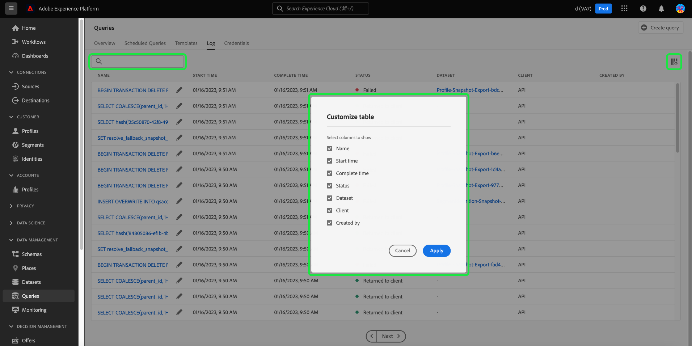

# Journaux de requête

Adobe Experience Platform conserve un journal de tous les événements de requête qui se produisent via l’API et l’interface utilisateur. Ces informations sont disponibles dans l’interface utilisateur de Query Service à partir de l’onglet [!UICONTROL Journaux].

Les fichiers journaux sont générés automatiquement par tout événement de requête et contiennent des informations, notamment le code SQL utilisé, l’état de la requête, sa durée et la dernière exécution. Vous pouvez utiliser les données du journal de requête comme un outil puissant pour résoudre les problèmes liés aux requêtes inefficaces ou problématiques. Des informations plus complètes sur le journal sont conservées dans le cadre de la fonctionnalité de journal d’audit et sont disponibles dans la documentation du [&#x200B; journal d’audit](../../landing/governance-privacy-security/audit-logs/overview.md).

## Vérifier les logs de requête {#check-query-logs}

Pour vérifier les journaux de requête, sélectionnez [!UICONTROL Requêtes] pour accéder à l’espace de travail de Query Service et sélectionnez [!UICONTROL Journal] dans les options disponibles.

>[!NOTE]
>
>Les requêtes système et les requêtes de tableau de bord sont exclues par défaut. Voir la section [filtres](#filter-logs) pour plus d’informations sur la manière d’affiner les journaux affichés en fonction de vos paramètres.

## Personnalisation et recherche {#customize-and-search}

Les journaux de Query Service sont présentés dans un format de tableau personnalisable. Pour personnaliser les colonnes du tableau, sélectionnez l’icône des paramètres (icône des paramètres ) à droite de l’écran. Une boîte de dialogue [!UICONTROL Personnaliser le tableau] s’affiche et vous pouvez désélectionner chaque colonne.

Vous pouvez également rechercher des journaux relatifs à des modèles de requête spécifiques en saisissant le nom du modèle dans le champ de recherche.

Vous trouverez une [description de chacune des colonnes du tableau des journaux](./overview.md#log) dans la section Journal de la présentation de Query Service.

## Découvrir les données du journal

Chaque ligne représente les données de journal d’une exécution de requête associée à un modèle de requête. Sélectionnez une ligne du tableau pour remplir la barre latérale droite avec les données de journal pour cette exécution.

Dans le panneau des détails du journal, vous pouvez effectuer diverses actions. Vous pouvez exécuter la requête en tant que CTAS, ce qui crée un jeu de données de sortie, afficher ou copier la requête SQL complète utilisée dans l’exécution, ou supprimer la requête.

>[!NOTE]
>
>L’option [!UICONTROL Exécuter en tant que CTAS] n’est disponible que pour une requête SELECT.

Vous pouvez également sélectionner un nom de modèle de requête dans la colonne [!UICONTROL Nom] pour accéder directement à la vue [!UICONTROL Détails du journal de requête].

>[!NOTE]
>
>Si la requête a été créée à l’aide de l’API et qu’aucun nom de modèle n’a été fourni lors de l’initialisation, les premières dizaines de caractères de la requête SQL s’affichent à la place.

## Modifier les journaux {#edit-logs}

Une icône en forme de crayon () que vous pouvez utiliser pour accéder à Query Editor. La requête est ensuite prérenseignée dans l’éditeur pour modification.

## Filtrer les logs {#filter-logs}

Vous pouvez filtrer la liste des journaux de requête en fonction de différents paramètres. Sélectionnez l’icône de filtre () en haut à gauche de l’espace de travail pour ouvrir un ensemble d’options de filtre dans le rail de gauche.

La liste des filtres disponibles s’affiche.

Le tableau suivant fournit une description de chaque filtre.

| Filtre | Description |
| ------ | ----------- |
| [!UICONTROL Exclure des requêtes de tableau de bord] | Cette case à cocher est activée par défaut et exclut les journaux générés par les requêtes utilisées pour générer des informations. Ces requêtes sont générées par le système et masquent les enregistrements des journaux générés par l’utilisateur, nécessaires à la surveillance, à l’administration et au dépannage. Pour afficher les journaux générés par le système, désélectionnez la case. |
| [!UICONTROL Exclure les requêtes système] | Cette case à cocher est activée par défaut et exclut les journaux générés par le système. Les requêtes générées par le système incluent souvent des tâches en arrière-plan ou des opérations de maintenance qui peuvent ne pas être pertinentes à des fins de surveillance, d’administration ou de dépannage des utilisateurs et utilisatrices. Si vous devez inspecter les journaux générés par le système, désélectionnez cette case pour les inclure dans la vue du journal. |
| [!UICONTROL Date de début] | Pour filtrer les journaux pour les requêtes créées au cours d’une période spécifique, définissez les dates [!UICONTROL Début] et [!UICONTROL Fin] dans la section [!UICONTROL Date de début]. |
| [!UICONTROL Date de fin] | Pour filtrer les journaux pour les requêtes qui ont été terminées au cours d’une période spécifique, définissez les dates [!UICONTROL Début] et [!UICONTROL Fin] dans la section [!UICONTROL Date de fin]. |
| [!UICONTROL Statut] | Pour filtrer les logs en fonction du [!UICONTROL Statut] de la requête, sélectionnez le bouton radio approprié. Les options disponibles sont les suivantes : [!UICONTROL Envoyé], [!UICONTROL En cours], [!UICONTROL Succès] et [!UICONTROL Échec]. Vous ne pouvez filtrer les journaux qu’en fonction d’une seule condition de statut à la fois. |
| [!UICONTROL Client] | Pour filtrer les journaux en fonction du client de requête utilisé, saisissez l’une des valeurs acceptées suivantes dans le champ de texte libre : `API`, `Adobe Query Service UI` ou `QsAccel`. |
| [!UICONTROL Mes requêtes] | Utilisez le bouton (bascule) [!UICONTROL Mes requêtes] pour filtrer les journaux des requêtes que vous exécutez. |
| [!UICONTROL ID du journal des requêtes] | Pour filtrer en fonction de l’ID de journal unique d’une requête, saisissez l’ID de journal dans le champ de texte libre. Ces informations se trouvent dans le [!UICONTROL Détails du journal]. |

Tous les filtres appliqués s’affichent au-dessus des résultats du journal filtré.

## Étapes suivantes

Grâce à la lecture de ce document, vous comprenez mieux comment les journaux de requête sont accessibles et utilisés dans l’interface utilisateur de Query Service.

Voir la [présentation de l’interface utilisateur](./overview.md), ou le [guide de l’API Query Service](../api/getting-started.md) pour en savoir plus sur les fonctionnalités de Query Service.

Consultez le document [surveiller les requêtes](./monitor-queries.md) pour découvrir comment Query Service améliore la visibilité des exécutions de requêtes planifiées.
