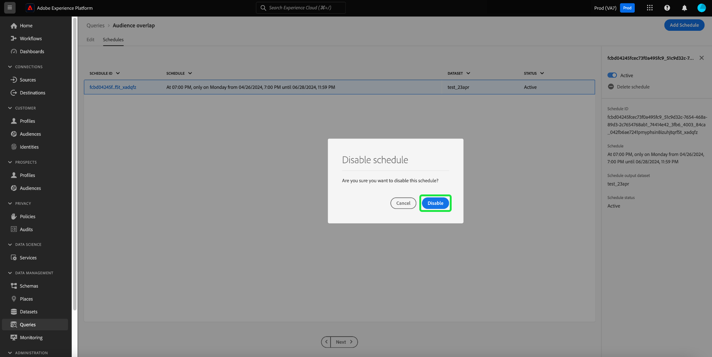
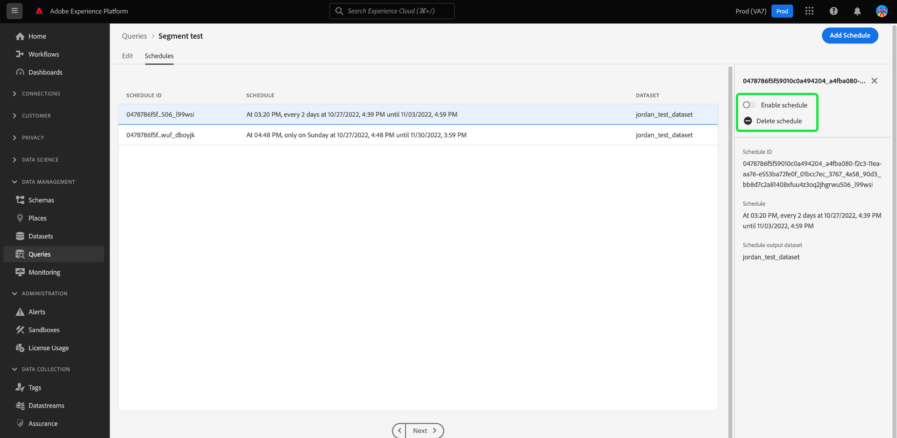

# Plannings de requête

Vous pouvez automatiser les exécutions de requête en créant des plannings de requête. Les requêtes planifiées s’exécutent à une cadence personnalisée pour gérer vos données en fonction de la fréquence, de la date et de l’heure. Vous pouvez également choisir un jeu de données de sortie pour vos résultats, si nécessaire. Les requêtes qui ont été enregistrées en tant que modèle peuvent être planifiées à partir de Query Editor.

>[!IMPORTANT]
>
>Vous pouvez uniquement ajouter un planning à une requête qui a déjà été créée et enregistrée.

## Exigences de compte pour les requêtes planifiées {#technical-account-user-requirements}

Pour que les requêtes planifiées s’exécutent de manière fiable, Adobe recommande aux administrateurs de configurer un compte technique (à l’aide des informations d’identification de serveur à serveur OAuth) pour créer des requêtes planifiées. Les requêtes planifiées peuvent également être créées avec un compte utilisateur personnel, mais les requêtes créées de cette manière cesseront de s’exécuter si l’accès de cet utilisateur est supprimé ou désactivé.

Pour plus d’informations sur la configuration des comptes techniques et l’attribution des autorisations requises, consultez les [Conditions préalables du guide d’identification](./credentials.md#prerequisites) et [Authentification de l’API](../../landing/api-authentication.md).

Pour plus d’informations sur la création et la configuration d’un compte technique, voir :

- [Configuration de Developer Console ](https://experienceleague.adobe.com/en/docs/platform-learn/getting-started-for-data-architects-and-data-engineers/set-up-developer-console-and-postman) : instructions détaillées pour configurer Adobe Developer Console et obtenir les informations d’identification OAuth.
- [Configuration de compte technique de bout en bout](https://experienceleague.adobe.com/en/docs/platform-learn/tutorial-comprehensive-technical/setup) : présentation complète de la création et de la configuration d’un compte technique dans Adobe Experience Platform.

Si vous utilisez uniquement l’interface utilisateur de Query Service, assurez-vous de disposer des autorisations nécessaires ou contactez un administrateur qui gère les comptes techniques. Toutes les requêtes planifiées sont ajoutées à la liste dans l’onglet [!UICONTROL Scheduled queries] , où vous pouvez surveiller le statut, les détails de la planification et les messages d’erreur de tous les traitements de requête planifiés, ainsi que vous abonner aux alertes. Pour plus d’informations sur la surveillance et la gestion de vos requêtes, consultez le document [surveiller les requêtes planifiées](./monitor-queries.md).

Ce workflow couvre le processus de planification dans l’interface utilisateur de Query Service. Pour savoir comment ajouter des plannings à l’aide de l’API, reportez-vous au guide de point d’entrée [des requêtes planifiées](../api/scheduled-queries.md).

>[!NOTE]
>
>Utilisez un compte technique pour vous assurer que les requêtes planifiées continuent à s’exécuter même si les utilisateurs et utilisatrices quittent l’organisation ou si leurs rôles changent. Choisissez un compte technique chaque fois que cela est possible pour une automatisation ininterrompue des requêtes.

## Créer un planning de requête {#create-schedule}

Pour planifier une requête, sélectionnez un modèle de requête dans l’onglet [!UICONTROL Templates] ou dans la colonne [!UICONTROL Template] de l’onglet [!UICONTROL Scheduled Queries] . La sélection du nom du modèle vous permet d’accéder au Query Editor.

Si vous accédez à une requête enregistrée à partir du Query Editor, vous pouvez créer un planning pour la requête ou afficher le planning de la requête à partir du panneau des détails.

>[!TIP]
>
>Sélectionnez **[!UICONTROL View schedule]** pour accéder à l’espace de travail des plannings et voir en un coup d’œil toutes les exécutions de requête planifiées.

![Query Editor avec [!UICONTROL View schedule] et [!UICONTROL Add schedule] mis en surbrillance.](../images/ui/query-schedules/view-add-schedule.png)

Sélectionnez **[!UICONTROL Add schedule]** pour accéder à la page [détails du planning](#schedule-details).

Vous pouvez également sélectionner l’onglet **[!UICONTROL Schedules]** sous le nom de la requête.

L’espace de travail des plannings s’affiche. L’interface utilisateur affiche une liste de toutes les exécutions planifiées auxquelles le modèle est associé. Sélectionnez **[!UICONTROL Add Schedule]** pour créer un planning.

### Ajouter les détails du planning {#schedule-details}

La page Détails du planning s’affiche. Sur cette page, vous pouvez modifier différents détails pour la requête planifiée. Les détails incluent la [fréquence et jour de la semaine de la requête planifiée](#scheduled-query-frequency) l’exécution, les dates de début et de fin, le jeu de données vers lequel exporter les résultats et les [alertes de statut de la requête](#alerts-for-query-status).

>[!IMPORTANT]
>
>L’interface utilisateur du planificateur de requêtes ne prend pas en charge la planification indéfinie ou permanente. Une date de fin doit être spécifiée. Il n’existe pas de limite supérieure pour la date de fin.

#### Périodicité de requête planifiée {#scheduled-query-frequency}

Vous pouvez choisir les options suivantes pour **[!UICONTROL Frequency]** :

- **[!UICONTROL Hourly]** : la requête planifiée s’exécute toutes les heures pour la période que vous avez sélectionnée.
- **[!UICONTROL Daily]** : la requête planifiée s’exécute tous les X jours à l’heure et à la période que vous avez sélectionnées. Notez que l’heure sélectionnée est indiquée en **UTC**, et non dans votre fuseau horaire local.
- **[!UICONTROL Weekly]** : la requête sélectionnée sera exécutée aux jours de la semaine, à l&#39;heure et à la période que vous avez sélectionnés. Notez que l’heure sélectionnée est indiquée en **UTC**, et non dans votre fuseau horaire local.
- **[!UICONTROL Monthly]** : la requête sélectionnée s’exécute tous les mois au jour, à l’heure et à la période que vous avez sélectionnés. Notez que l’heure sélectionnée est indiquée en **UTC**, et non dans votre fuseau horaire local.
- **[!UICONTROL Yearly]** : la requête sélectionnée s’exécute chaque année au jour, au mois, à l’heure et à la période que vous avez sélectionnés. Notez que l’heure sélectionnée est indiquée en **UTC**, et non dans votre fuseau horaire local.

### Fournir des détails sur le jeu de données {#dataset-details}

Gérez les résultats de la requête en ajoutant les données à un jeu de données existant ou en créant un nouveau jeu de données et en y ajoutant les données.

Sélectionnez **[!UICONTROL Create and append into new dataset]** pour créer un jeu de données lorsque vous exécutez une requête pour la première fois. Les exécutions suivantes continuent d’insérer des données dans ce jeu de données. Enfin, indiquez un nom et une description pour le jeu de données.

>[!IMPORTANT]
>
> Puisque vous utilisez un jeu de données existant ou que vous en créez un nouveau, vous n’avez **pas** besoin d’inclure `INSERT INTO` ou `CREATE TABLE AS SELECT` dans le cadre de la requête, puisque les jeux de données sont déjà définis. L’inclusion de `INSERT INTO` ou `CREATE TABLE AS SELECT` dans le cadre de vos requêtes planifiées entraînera une erreur.

![Panneau Détails du planning avec les détails du jeu de données et les options de [!UICONTROL Create and append into new dataset] mises en surbrillance.](../images/ui/query-schedules/dataset-details-create-and-append.png)

Vous pouvez également sélectionner **[!UICONTROL Append into existing dataset]** suivi de l’icône du jeu de données ().

La boîte de dialogue **[!UICONTROL Select output dataset]** s’affiche.

Ensuite, parcourez les jeux de données existants ou utilisez le champ de recherche pour filtrer les options. Sélectionnez la ligne du jeu de données que vous souhaitez utiliser. Les détails du jeu de données s’affichent dans le panneau de droite. Sélectionnez **[!UICONTROL Done]** pour confirmer votre choix.

### Les requêtes en quarantaine en cas d’échec continu {#quarantine}

Lors de la création d’un planning, vous pouvez inscrire votre requête à la fonction de quarantaine afin de protéger les ressources système et d’éviter des perturbations potentielles. La fonction de quarantaine identifie et isole automatiquement les requêtes qui échouent à plusieurs reprises en les plaçant dans un état [!UICONTROL Quarantined]. En mettant les requêtes en quarantaine après dix échecs consécutifs, vous pouvez intervenir, réviser et corriger les problèmes avant d’autoriser d’autres exécutions. Cela permet de maintenir votre efficacité opérationnelle et l’intégrité des données.

![Espace de travail Plannings de requêtes avec [!UICONTROL Query Quarantine] en surbrillance et Oui sélectionné.](../images/ui/query-schedules/quarantine-enroll.png)

Une fois qu’une requête est inscrite à la fonction de quarantaine, vous pouvez vous abonner à des alertes pour ce changement de statut de la requête. Si une requête planifiée n’est pas mise en quarantaine, elle n’apparaît pas comme option dans [la boîte de dialogue Alertes](./monitor-queries.md#alert-subscription).

Vous pouvez également inscrire une requête planifiée à la fonction de quarantaine à partir des actions intégrées de l’onglet [!UICONTROL Scheduled Queries] . Pour plus d’informations, consultez la documentation [surveiller les requêtes](./monitor-queries.md#alert-subscription).

### Définir des alertes pour le statut d’une requête planifiée {#alerts-for-query-status}

Vous pouvez également vous abonner aux alertes de requêtes dans le cadre des paramètres de vos requêtes planifiées. Vous pouvez configurer vos paramètres pour recevoir des notifications pour diverses situations. Les alertes peuvent être définies pour un statut mis en quarantaine, des retards dans le traitement des requêtes ou un changement de statut de votre requête. Les options d’alerte d’état de requête disponibles incluent le début, la réussite et l’échec. Les alertes peuvent être reçues sous la forme de notifications pop-up ou d’e-mails. Cochez la case pour vous abonner aux alertes concernant ce statut de requête planifiée.

Le tableau ci-dessous décrit les types d’alerte de requête pris en charge :

| Type d’alerte | Description |
|---|---|
| `start` | Cette alerte vous avertit lorsqu’une exécution de requête planifiée est lancée ou commence à être traitée. |
| `success` | Cette alerte vous informe lorsqu’une exécution de requête planifiée se termine avec succès, indiquant que la requête s’est exécutée sans erreur. |
| `failed` | Cette alerte se déclenche lorsqu’une exécution de requête planifiée rencontre une erreur ou ne s’exécute pas correctement. Cela vous aide à identifier et à résoudre les problèmes rapidement. |
| `quarantine` | Cette alerte est activée lorsqu’une exécution de requête planifiée est mise en quarantaine. Une fois qu’une requête est [inscrite dans la fonction de quarantaine](#quarantine), toute requête planifiée qui échoue dix exécutions consécutives est automatiquement mise en état de [!UICONTROL Quarantined]. Une requête en quarantaine nécessite ensuite votre intervention avant que d’autres exécutions ne puissent avoir lieu. Remarque : les requêtes doivent être inscrites à la fonction de quarantaine pour que vous puissiez vous abonner aux alertes de quarantaine. |
| `delay` | Cette alerte vous avertit en cas de [ retard dans le résultat d’une exécution de requête planifiée](./monitor-queries.md#query-run-delay) au-delà d’un seuil spécifié. Vous pouvez définir une heure personnalisée qui déclenche l’alerte lorsque la requête s’exécute pendant cette durée sans terminer ni échouer. Le comportement par défaut définit une alerte pendant 150 minutes après le début du traitement de la requête. |

>[!NOTE]
>
>Si vous choisissez de définir une alerte [!UICONTROL Query Run Delay], vous devez définir le délai d’attente souhaité en minutes dans l’interface utilisateur d’Experience Platform. Saisissez la durée en minutes. Le délai maximal est de 24 heures (1 440 minutes).

Pour obtenir un aperçu des alertes dans Adobe Experience Platform, y compris la structure de la définition des règles d’alerte, reportez-vous à la [présentation des alertes](../../observability/alerts/overview.md). Pour obtenir des conseils sur la gestion des alertes et des règles d’alerte dans l’interface utilisateur de Adobe Experience Platform, consultez le [ Guide de l’interface utilisateur des alertes](../../observability/alerts/ui.md).

### Définition des paramètres d’une requête paramétrée planifiée {#set-parameters}

Si vous créez une requête planifiée pour une requête paramétrée, vous devez maintenant définir les valeurs de paramètre pour ces exécutions de requête.

Après avoir confirmé les détails de votre planning, sélectionnez **[!UICONTROL Save]** pour créer un planning. Vous revenez sur l’onglet Plannings de votre modèle. Cet espace de travail affiche les détails du planning nouvellement créé, y compris l’identifiant du planning, le planning lui-même et le jeu de données de sortie du planning.

## Afficher les exécutions de requête planifiées {#scheduled-query-runs}

Dans l’onglet [!UICONTROL Schedules] de votre modèle, sélectionnez l’ID de planning pour accéder à la liste des exécutions de requête pour votre nouvelle requête planifiée.

Vous pouvez également afficher la liste des exécutions planifiées d’un modèle de requête en accédant à l’onglet **[!UICONTROL Scheduled queries]** et en sélectionnant un nom de modèle dans la liste disponible.

La liste des exécutions de requête pour cette requête planifiée s’affiche.

### Heures de calcul au niveau de la tâche {#compute-hours}

Effectuez le suivi des heures de calcul consommées au niveau de l’exécution des requêtes pour vos requêtes par lots CTAS/ITAS. Cette fonctionnalité offre des informations sur l’utilisation du calcul, ce qui vous permet d’optimiser l’allocation des ressources et d’améliorer les performances des requêtes.

>[!AVAILABILITY]
>
>La fonctionnalité Heures de calcul est réservée aux utilisateurs qui ont acheté le [SKU de Data Distiller](../data-distiller/overview.md). Contactez votre représentant ou représentante Adobe pour plus d’informations.

Le tableau suivant fournit des descriptions de chaque colonne disponible dans la section détails qui répertorie les exécutions de requête planifiées.

| Titre de colonne | Description |
|---------------------|----------------------------------|
| [!UICONTROL Query Run ID] | Affiche un identifiant unique pour chaque exécution de requête, ce qui vous permet de suivre et de référencer les exécutions individuelles de vos requêtes planifiées. |
| [!UICONTROL Query Run Start] | Indique la date et l’heure de début de l’exécution de la requête afin de vous aider à surveiller le début de chaque exécution. |
| [!UICONTROL Query Run Complete] | Affiche la date et l’heure d’achèvement de l’exécution de la requête, afin de fournir à insight la durée et le statut d’exécution. |
| [!UICONTROL Status] | Affiche le statut actuel de l’exécution de la requête, tel que `Completed,` `Running,` ou `Failed,` pour évaluer le résultat rapidement. |
| [!UICONTROL Datasets] | Répertorie les jeux de données utilisés dans l’exécution de la requête afin d’indiquer les sources de données impliquées dans l’exécution. |
| [!UICONTROL Compute Hours] | Affiche le temps de calcul utilisé pour chaque exécution de requête, mesuré en heures. Cela permet de suivre l’utilisation des ressources et d’optimiser les performances des requêtes. |

{style="table-layout:auto"}

>[!NOTE]
>
>Les données des heures de calcul sont disponibles à partir du 08/15/2024. Les données antérieures à cette date apparaissent comme « Non disponibles ».

Consultez le [guide de surveillance des requêtes planifiées](./monitor-queries.md#inline-actions) pour obtenir des informations complètes sur la manière de surveiller le statut de toutes les tâches de requête via l’interface utilisateur.

Sélectionnez un **[!UICONTROL Query run ID]** dans la liste pour accéder à la vue d’ensemble de l’exécution de la requête. Pour obtenir une répartition complète des informations disponibles dans la [présentation de l’exécution des requêtes](./monitor-queries.md#query-run-overview), consultez la documentation sur la surveillance des requêtes planifiées.

Pour surveiller les requêtes planifiées à l’aide de l’API Query Service, consultez le guide [des points d’entrée d’exécution de requête planifiée](../api/runs-scheduled-queries.md).

## Activation, désactivation ou suppression d’un planning {#delete-schedule}

Vous pouvez activer, désactiver ou supprimer un planning dans l’espace de travail des plannings d’une requête spécifique ou dans l’espace de travail des [!UICONTROL Scheduled Queries] qui répertorie toutes les requêtes planifiées.

Pour accéder à l’onglet [!UICONTROL Schedules] de la requête de votre choix, vous devez sélectionner le nom d’un modèle de requête dans l’onglet [!UICONTROL Templates] ou l’onglet [!UICONTROL Scheduled Queries] . Cette action permet d’accéder à l’éditeur de requêtes pour cette requête. Dans le Query Editor, sélectionnez **[!UICONTROL Schedules]** pour accéder à l’espace de travail des plannings.

Sélectionnez un planning dans les lignes des plannings disponibles pour remplir le panneau des détails. Utilisez le bouton (bascule) pour désactiver (ou activer) la requête planifiée.

### Supprimer les requêtes désactivées

>[!IMPORTANT]
>
>Vous devez désactiver le planning avant de pouvoir supprimer un planning pour une requête.

Une boîte de dialogue de confirmation s’affiche. Sélectionnez **[!UICONTROL Disable]** pour confirmer l’action.

Sélectionnez **[!UICONTROL Delete a schedule]** pour supprimer le planning désactivé.

L’onglet [!UICONTROL Scheduled Queries] propose également une collection d’actions intégrées pour chaque requête planifiée. Les actions intégrées disponibles incluent [!UICONTROL Disable schedule] ou [!UICONTROL Enable schedule], [!UICONTROL Delete schedule] et [!UICONTROL Subscribe] aux alertes pour la requête planifiée. Pour obtenir des instructions complètes sur la suppression ou la désactivation d’une requête planifiée via l’onglet Requêtes planifiées , consultez le guide [surveiller les requêtes planifiées](./monitor-queries.md#inline-actions).
