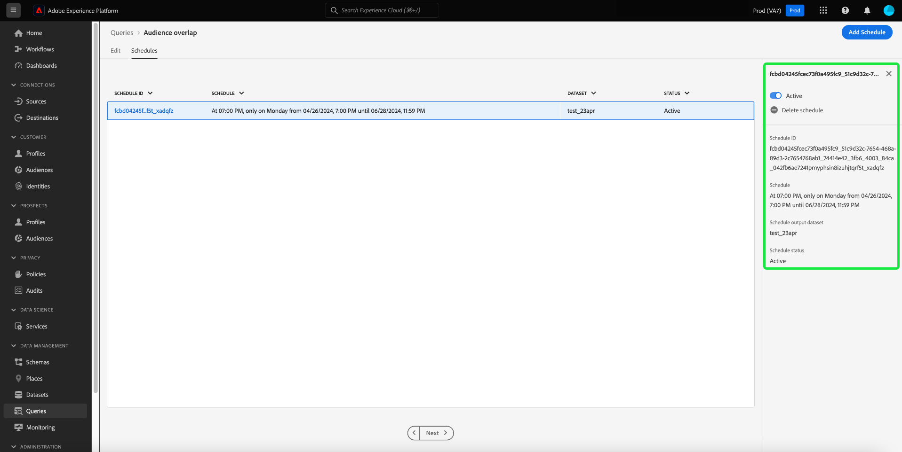

# Plannings de requête

Vous pouvez automatiser les exécutions de requêtes en créant des plannings de requête. Les requêtes planifiées s’exécutent sur une cadence personnalisée pour gérer vos données en fonction de la fréquence, de la date et de l’heure. Vous pouvez également choisir un jeu de données de sortie pour vos résultats, si nécessaire. Les requêtes qui ont été enregistrées en tant que modèle peuvent être planifiées à partir de l’éditeur de requêtes.

>[!IMPORTANT]
>
>Vous pouvez uniquement ajouter un planning à une requête qui a déjà été créée et enregistrée.

Toutes les requêtes planifiées sont ajoutées à la liste dans l’onglet [!UICONTROL Requêtes planifiées] . Depuis cet espace de travail, vous pouvez surveiller l’état de toutes les tâches de requête planifiées via l’interface utilisateur. Dans l’onglet [!UICONTROL  Requêtes planifiées ], vous pouvez trouver des informations importantes sur les exécutions de vos requêtes et vous abonner à des alertes. Les informations disponibles incluent l’état, les détails de planification et les codes/messages d’erreur en cas d’échec de l’exécution. Pour plus d’informations, consultez le document [Surveiller les requêtes planifiées](./monitor-queries.md) .

Ce workflow couvre le processus de planification dans l’interface utilisateur de Query Service. Pour savoir comment ajouter des plannings à l’aide de l’API, veuillez lire le [guide de point d’entrée des requêtes planifiées](../api/scheduled-queries.md).

## Créer un planning de requête {#create-schedule}

Pour planifier une requête, sélectionnez un modèle de requête à partir de l’onglet [!UICONTROL Modèles] ou de la colonne [!UICONTROL Modèle] de l’onglet [!UICONTROL Requêtes planifiées]. Lorsque vous sélectionnez le nom du modèle, vous accédez à l’éditeur de requêtes.

Si vous accédez à une requête enregistrée à partir de l’éditeur de requêtes, vous pouvez créer un planning pour la requête ou afficher le planning de la requête à partir du panneau Détails.

>[!TIP]
>
>Sélectionnez **[!UICONTROL Afficher la planification]** pour accéder à l’espace de travail des plannings et afficher les exécutions de requête planifiées en un coup d’oeil.

![L’éditeur de requêtes avec [!UICONTROL Afficher le planning] et [!UICONTROL Ajouter le planning] surligné.](../images/ui/query-schedules/view-add-schedule.png)

Sélectionnez **[!UICONTROL Ajouter un planning]** pour accéder à la [page des détails du planning](#schedule-details).

Vous pouvez également sélectionner l’onglet **[!UICONTROL Planifications]** sous le nom de la requête.

L’espace de travail des plannings s’affiche. L’interface utilisateur affiche la liste des exécutions planifiées auxquelles le modèle est associé. Sélectionnez **[!UICONTROL Ajouter un planning]** pour créer un planning.

### Ajout des détails du planning {#schedule-details}

La page Détails du planning s’affiche. Sur cette page, vous pouvez modifier divers détails pour la requête planifiée. Les détails incluent la [fréquence et le jour de semaine de l’exécution de la requête planifiée](#scheduled-query-frequency), la date de début et de fin, le jeu de données vers lequel exporter les résultats et les [alertes d’état de la requête](#alerts-for-query-status).

>[!IMPORTANT]
>
>L’interface utilisateur du planificateur de requêtes ne prend pas en charge la planification indéfinie ou perpétuelle. Une date de fin doit être spécifiée. Il n’existe pas de limite supérieure pour la date de fin.

#### Fréquence de requête planifiée {#scheduled-query-frequency}

Vous pouvez choisir les options suivantes pour **[!UICONTROL Fréquence]** :

- **[!UICONTROL Horaire]** : la requête planifiée s’exécute toutes les heures pour la période que vous avez sélectionnée.
- **[!UICONTROL Quotidien]** : la requête planifiée s’exécute tous les X jours à l’heure et à la période que vous avez sélectionnées. Notez que l’heure sélectionnée est indiquée en **UTC**, et non dans votre fuseau horaire local.
- **[!UICONTROL Hebdomadaire]** : la requête sélectionnée sera exécutée aux jours de la semaine, à l’heure et à la période que vous avez sélectionnés. Notez que l’heure sélectionnée est indiquée en **UTC**, et non dans votre fuseau horaire local.
- **[!UICONTROL Mensuel]** : la requête sélectionnée s’exécute tous les mois au jour, à l’heure et à la période que vous avez sélectionnés. Notez que l’heure sélectionnée est indiquée en **UTC**, et non dans votre fuseau horaire local.
- **[!UICONTROL Annuel]** : la requête sélectionnée s’exécute chaque année au jour, au mois, à l’heure et à la période que vous avez sélectionnés. Notez que l’heure sélectionnée est indiquée en **UTC**, et non dans votre fuseau horaire local.

### Fournir des détails sur les jeux de données {#dataset-details}

Gérez les résultats de la requête en ajoutant les données à un jeu de données existant ou en créant un nouveau jeu de données et en y ajoutant les données.

Sélectionnez **[!UICONTROL Créer et ajouter dans un nouveau jeu de données]** pour créer un jeu de données lorsque vous exécutez une requête pour la première fois. Les exécutions suivantes continuent à insérer des données dans ce jeu de données. Enfin, fournissez un nom et une description pour le jeu de données.

>[!IMPORTANT]
>
> Puisque vous utilisez un jeu de données existant ou que vous en créez un nouveau, vous n’avez **pas** besoin d’inclure `INSERT INTO` ou `CREATE TABLE AS SELECT` dans le cadre de la requête, puisque les jeux de données sont déjà définis. L’inclusion de `INSERT INTO` ou `CREATE TABLE AS SELECT` dans le cadre de vos requêtes planifiées entraînera une erreur.

![Le panneau Détails de la planification avec les détails du jeu de données et les options [!UICONTROL Créer et ajouter dans un nouveau jeu de données] mises en surbrillance.](../images/ui/query-schedules/dataset-details-create-and-append.png)

Vous pouvez également sélectionner **[!UICONTROL Ajouter au jeu de données existant]** suivi de l’icône du jeu de données ().

La boîte de dialogue **[!UICONTROL Sélectionner le jeu de données de sortie]** s’affiche.

Ensuite, parcourez les jeux de données existants ou utilisez le champ de recherche pour filtrer les options. Sélectionnez la ligne du jeu de données que vous souhaitez utiliser. Les détails du jeu de données s’affichent dans le panneau de droite. Sélectionnez **[!UICONTROL Terminé]** pour confirmer votre choix.

### Requêtes de mise en quarantaine en cas d’échec continu {#quarantine}

Lors de la création d’un planning, vous pouvez inscrire votre requête dans la fonctionnalité de quarantaine afin de protéger les ressources système et d’éviter toute interruption potentielle. La fonction de quarantaine identifie et isole automatiquement les requêtes qui échouent à plusieurs reprises en les plaçant dans un état [!UICONTROL Quarantined]. En mettant en quarantaine les requêtes après dix échecs consécutifs, vous pouvez intervenir, examiner et corriger les problèmes avant d’autoriser d’autres exécutions. Cela permet de préserver l’efficacité opérationnelle et l’intégrité des données.

![ L&#39;espace de travail des planifications de requêtes avec la [!UICONTROL mise en quarantaine de requête] mise en surbrillance et Oui sélectionné.](../images/ui/query-schedules/quarantine-enroll.png)

Une fois qu’une requête est inscrite pour la fonction de quarantaine, vous pouvez vous abonner à des alertes pour ce changement de statut de la requête. Si une requête planifiée n’est pas inscrite en quarantaine, elle n’apparaît pas comme option dans la [boîte de dialogue Alertes](./monitor-queries.md#alert-subscription).

Vous pouvez également inscrire une requête planifiée dans la fonction de quarantaine à partir des actions intégrées de l’onglet [!UICONTROL Requêtes planifiées] . Pour plus d’informations, consultez la [documentation sur les requêtes de moniteur](./monitor-queries.md#alert-subscription) .

### Définition d’alertes pour un état de requête planifié {#alerts-for-query-status}

Vous pouvez également vous abonner aux alertes de requête dans le cadre des paramètres de requête planifiés. Vous pouvez configurer vos paramètres pour recevoir des notifications dans diverses situations. Les alertes peuvent être définies pour un état en quarantaine, des retards dans le traitement des requêtes ou une modification de l’état de votre requête. Les options d’alerte d’état de requête disponibles incluent le début, la réussite et l’échec. Les alertes peuvent être reçues sous la forme de notifications contextuelles ou d’emails. Cochez la case pour vous abonner à des alertes pour cet état de requête planifiée.

Le tableau ci-dessous décrit les types d’alerte de requête pris en charge :

| Type d’alerte | Description |
|---|---|
| `start` | Cette alerte vous avertit lorsqu’une exécution de requête planifiée est lancée ou commence à être traitée. |
| `success` | Cette alerte vous informe lorsqu’une requête planifiée s’exécute correctement, ce qui indique que la requête s’est exécutée sans erreur. |
| `failed` | Cette alerte se déclenche lorsqu’une exécution de requête planifiée rencontre une erreur ou échoue à s’exécuter correctement. Il vous aide à identifier et à résoudre rapidement les problèmes. |
| `quarantine` | Cette alerte est activée lorsqu’une exécution de requête planifiée est mise en quarantaine. Une fois qu’une requête est [inscrite dans la fonctionnalité de quarantaine](#quarantine), toute requête planifiée qui échoue dix exécutions consécutives est automatiquement placée dans un état [!UICONTROL Quarantined]. Une requête mise en quarantaine requiert alors votre intervention avant que d’autres exécutions ne puissent avoir lieu. Remarque : les requêtes doivent être inscrites pour la fonction de quarantaine pour que vous puissiez vous abonner aux alertes de quarantaine. |
| `delay` | Cette alerte vous avertit en cas de [ retard dans le résultat d’une exécution de requête planifiée](./monitor-queries.md#query-run-delay) au-delà d’un seuil spécifié. Vous pouvez définir une heure personnalisée qui déclenche l’alerte lorsque la requête s’exécute pendant cette durée sans avoir terminé ou échoué. Le comportement par défaut définit une alerte de 150 minutes après le début du traitement de la requête. |

>[!NOTE]
>
>Si vous choisissez de définir une alerte [!UICONTROL Délai d’exécution de requête], vous devez définir le délai souhaité en minutes dans l’interface utilisateur de Platform. Saisissez la durée en minutes. Le délai maximal est de 24 heures (1 440 minutes).

Pour un aperçu des alertes dans Adobe Experience Platform, y compris la structure de la définition des règles d’alerte, consultez la [présentation des alertes](../../observability/alerts/overview.md). Pour plus d’informations sur la gestion des alertes et des règles d’alerte dans l’interface utilisateur de Adobe Experience Platform, consultez le [guide de l’interface utilisateur des alertes](../../observability/alerts/ui.md).

### Définir les paramètres d’une requête planifiée planifiée {#set-parameters}

>[!IMPORTANT]
>
>La fonctionnalité d’IU de requête paramétrée est actuellement disponible dans une **version limitée uniquement** et n’est pas disponible pour tous les clients. Si vous n’avez pas accès aux requêtes paramétrées, passez à la section [supprimer ou désactiver un planning](#delete-schedule) .

Si vous créez une requête planifiée pour une requête paramétrée, vous devez maintenant définir les valeurs des paramètres pour ces exécutions de requête.

Après avoir confirmé les détails de votre planification, sélectionnez **[!UICONTROL Enregistrer]** pour créer une planification. Vous revenez alors à l’onglet Planifications de votre modèle. Cet espace de travail affiche les détails du planning nouvellement créé, y compris l’identifiant du planning, le planning lui-même et le jeu de données de sortie du planning.

## Afficher les exécutions de requête planifiées {#scheduled-query-runs}

Dans l’onglet [!UICONTROL Planifications] de votre modèle, sélectionnez l’ID de planification pour accéder à la liste des exécutions de requête pour votre requête nouvellement planifiée.

Ou bien, pour afficher la liste des exécutions planifiées d’un modèle de requête, accédez à l’onglet **[!UICONTROL Requêtes planifiées]** et sélectionnez un nom de modèle dans la liste disponible.

La liste des exécutions de requête pour cette requête planifiée s’affiche.

Pour obtenir des informations complètes sur la manière de surveiller l’état de toutes les tâches de requête via l’interface utilisateur, consultez le [guide de surveillance des requêtes planifiées](./monitor-queries.md#inline-actions) .

Sélectionnez un **[!UICONTROL identifiant d’exécution de requête]** dans la liste pour accéder à la présentation de l’exécution de requête. Pour obtenir une ventilation complète des informations disponibles sur la [présentation de l’exécution de requête](./monitor-queries.md#query-run-overview), consultez la documentation de surveillance des requêtes planifiées .

Pour surveiller les requêtes planifiées à l’aide de l’API Query Service, consultez le [guide des points de terminaison d’exécution de requête planifiés](../api/runs-scheduled-queries.md).

## Activation, désactivation ou suppression d’une planification {#delete-schedule}

Vous pouvez activer, désactiver ou supprimer une planification dans l’espace de travail des plannings d’une requête spécifique ou dans l’espace de travail [!UICONTROL  Requêtes planifiées] qui répertorie toutes les requêtes planifiées.

Pour accéder à l’onglet [!UICONTROL Planifications] de la requête choisie, vous devez sélectionner le nom d’un modèle de requête à partir de l’onglet [!UICONTROL  Modèles] ou de l’onglet [!UICONTROL Requêtes planifiées]. L’éditeur de requêtes de cette requête est alors accessible. Dans l’éditeur de requêtes, sélectionnez **[!UICONTROL Planifications]** pour accéder à l’espace de travail des planifications.

Sélectionnez une planification dans les lignes des plannings disponibles pour remplir le panneau Détails. Utilisez le bouton d’activation/désactivation pour désactiver (ou activer) la requête planifiée.

### Suppression de requêtes désactivées

>[!IMPORTANT]
>
>Vous devez désactiver le planning avant de pouvoir supprimer un planning pour une requête.

Une boîte de dialogue de confirmation s’affiche. Sélectionnez **[!UICONTROL Désactiver]** pour confirmer l’action.

Sélectionnez **[!UICONTROL Supprimer un planning]** pour supprimer le planning désactivé.

L’onglet [!UICONTROL  Requêtes planifiées] offre également une collection d’actions intégrées pour chaque requête planifiée. Les actions intégrées disponibles sont les suivantes : [!UICONTROL Désactiver le planning] ou [!UICONTROL Activer le planning], [!UICONTROL Supprimer le planning] et [!UICONTROL S’abonner] aux alertes pour la requête planifiée. Pour obtenir des instructions complètes sur la manière de supprimer ou de désactiver une requête planifiée via l’onglet Requêtes planifiées, consultez le [guide de surveillance des requêtes planifiées](./monitor-queries.md#inline-actions).
