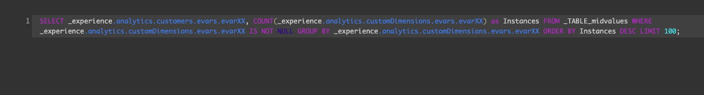
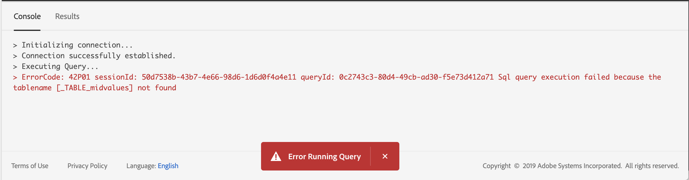

# Guide de l’utilisateur de l’éditeur de 

 Editor est un outil interactif fourni par Adobe Experience Platform Service, qui vous permet d’écrire, de valider et d’exécuter des  pour les données d’expérience client dans l’interface utilisateur de la plateforme d’expérience.  Editor prend en charge le développement d’ pour l’exploration de données et de l’de données, et vous permet d’exécuter des interactifs à des fins de développement, ainsi que des non interactifs pour renseigner les jeux de données dans la plateforme d’expérience.

Pour plus d&#39;informations sur les concepts et les fonctionnalités du service , consultez la présentation [du service ][query-service-overview]. Pour en savoir plus sur la manière de naviguer dans l’interface utilisateur du service  sur Platform, consultez la présentation [de l’interface utilisateur du service de ][query-service-ui].

## Prise en main

 Editor permet l&#39;exécution flexible des  de en se connectant àle service d&#39; et le ne s&#39;exécute que lorsque cette connexion est active.

### Connexion au service 

L’éditeur  prend quelques secondes pour initialiser et se connecter au service  lorsqu’il est ouvert. La console vous indique quand elle est connectée, comme illustré ci-dessous. Si vous tentez d’exécuter un  avant que l’éditeur ne se connecte, l’exécution est retardée jusqu’à ce que la connexion soit terminée.

### Mode d&#39;exécution des  à partir de l&#39;éditeur de  de

 exécuté à partir de l’éditeur  de s’exécute de manière interactive. Cela signifie que si vous fermez le navigateur ou quittez le navigateur, le  est annulé. Cela est également vrai pour les  de génération de jeux de données à partir de sorties .

## Création de  à l’aide de l’éditeur  de

L’éditeur de  vous permet d’écrire, d’exécuter et d’enregistrer des  de pour les données d’expérience client. Tous les  exécutés dans l’éditeur de  de, ou enregistrés, sont accessibles à tous les utilisateurs de votre organisation qui ont accès au service de  de publication de contenu.

### Accès à l’éditeur de  de

Dans l’interface utilisateur de la plateforme d’expérience, cliquez sur **** dans le menu de navigation de gauche pour ouvrir l’espace de travail du service . Cliquez ensuite sur **Créer un** dans la partie supérieure droite de l’écran pour  l’écriture d’un . Ce lien est disponible à partir de n’importe quelle page de l’espace de travail du service .

### Ecriture de

 éditeur de  est organisé pour rendre l&#39;écriture de aussi facile que possible. La capture d’écran ci-dessous montre comment l’éditeur s’affiche dans l’interface utilisateur, le bouton **Lecture** et le champ d’entrée SQL étant mis en surbrillance.

Pour réduire le temps de développement, il est recommandé de développer les  de votre avec des limites sur les lignes renvoyées. Par exemple : `SELECT fields FROM table WHERE conditions LIMIT number_of_rows`. Une fois que vous avez vérifié que votre  produit la sortie attendue, supprimez les limites et exécutez le avec `CREATE TABLE tablename AS SELECT` pour générer un jeu de données avec la sortie.

### Outils d’écriture dans l’éditeur de 

- **Mise en surbrillance automatique de la syntaxe :** Facilite la lecture et l&#39;organisation de SQL.

- **Mot clé SQL à saisie semi-automatique :**  taper votre  puis utilisez les touches fléchées pour accéder au terme souhaité et appuyez sur **Entrée**.

- **Remplissage automatique du tableau et du champ :**  taper le nom de la table à `SELECT` partir de laquelle vous souhaitez accéder, puis utilisez les touches fléchées pour accéder à la table que vous recherchez, puis appuyez sur **Entrée**. Une fois qu’un tableau est sélectionné, la saisie semi-automatique reconnaît les champs de ce tableau.

### Détection des erreurs

L’éditeur de  de valide automatiquement un  au fur et à mesure que vous l’écrivez, en fournissant une validation SQL générique et une validation d’exécution spécifique. Si un trait de soulignement rouge apparaît sous le  du (comme illustré dans l’image ci-dessous), il représente une erreur dans le  du.

Lorsque des erreurs sont détectées, vous pouvez  les messages d&#39;erreur spécifiques en passant la souris sur le code SQL.

### Détails 

Pendant que vous affichez un  dans l’éditeur de  de, le panneau Détails *de l’* de l’ delade lade lafeuille de calcul fournit des outils pour gérer le sélectionné.

Ce panneau vous permet de générer un jeu de données de sortie directement à partir de l&#39;interface utilisateur, de supprimer ou de nommer le  affiché, et de  le code SQL dans un format facile à copier sur l&#39;onglet ** SQL. Ce panneau présente également des métadonnées utiles, telles que la dernière fois que le a été modifié et qui l’a modifié, le cas échéant. Pour générer un jeu de données, cliquez sur **Output Dataset**. La boîte de dialogue *Output Dataset* (Jeu de données de sortie) s’affiche. Entrez un nom et une description, puis cliquez sur **Exécuter le**. Le nouveau jeu de données s’affiche dans l’onglet *Datasets* de l’interface utilisateur du service de  sur la plateforme.

### Enregistrement du 

 Editor fournit une fonction d’enregistrement qui vous permet d’enregistrer un  de et d’y travailler ultérieurement. Pour enregistrer un  de, cliquez sur **Enregistrer** dans le coin supérieur droit de l’éditeur de  de. Avant de pouvoir enregistrer un  de, vous devez indiquer un nom pour le  à l’aide du panneau Détails *de l’* de l’.

### Comment trouver le précédent 

Tous les  exécutés à partir de l’éditeur  de sont capturés dans le tableau Journal. Vous pouvez utiliser la fonctionnalité de recherche dans l’onglet *Journal* pour rechercher des exécutions de . Les  enregistrées sont répertoriées dans l’onglet *Parcourir* .

Pour plus d’informations, reportez-vous à la présentation [de l’interface utilisateur du service][query-service-ui] .

>[!NOTE] Les  non exécutées ne sont pas enregistrées par le journal. Pour que le soit disponible dans le service , il doit être exécuté ou enregistré dans l’éditeur de  de l’éditeur deformulaires.

## Exécution de  à l’aide de l’éditeur  de

Pour exécuter un dans l’éditeur de  de, vous pouvez saisir SQL dans l’éditeur ou charger un autre *à partir de l’onglet Journal* ou *Parcourir* , puis cliquer sur **Lecture**. L’état de l’exécution des  du s’affiche dans l’onglet *Console* ci-dessous et les données de sortie s’affichent dans l’onglet *Résultats* .

### Console

La console fournit des informations sur l’état et le fonctionnement du service . La console affiche l’état de la connexion au service , les opérations de  en cours d’exécution et tout message d’erreur résultant de ces .

>[!NOTE] La console affiche uniquement les erreurs résultant de l’exécution d’un  de. Il n’affiche pas les erreurs de validation  avant l’exécution d’un .

### Résultats 

Une fois un  terminé, les résultats s’affichent dans l’onglet *Résultats* , en regard de l’onglet *Console* . Ce affiche la sortie tabulaire de votre , affichant jusqu’à 100 lignes. Ce  vous permet de vérifier que votre  produit la sortie attendue. Pour générer un jeu de données avec votre  de, supprimez les limites sur les lignes renvoyées, puis exécutez le  avec `CREATE TABLE tablename AS SELECT` pour générer un jeu de données avec la sortie. Consultez le didacticiel [sur la][query-service-create-datasets] génération de jeux de données pour savoir comment générer un jeu de données à partir des résultats  dans l’éditeur de  de.

## Étapes suivantes

Maintenant que vous savez quelles fonctionnalités sont disponibles dans l’éditeur de  et comment naviguer dans l’application, vous pouvez  la création de votre proprejournal directement dans Platform. Pour plus d&#39;informations sur l&#39;exécution des  SQL par rapport aux jeux de données dans Data Lake, consultez le guide sur l&#39; [exécution des][query-service-running-queries]de. Pour obtenir un exemple de  SQL pour l’utilisation des données d’ d’Adobe Analytics et d’Adobe, reportez-vous à l’ [exemple de référence][query-service-sample-queries]demodèle de.

[query-service-overview]: ../home.md
[query-service-ui]: overview.md
[query-service-running-queries]: ../creating-queries/creating-queries.md
[query-service-sample-queries]: ../sample-queries/overview.md
[query-service-create-datasets]: ../creating-queries/create-datasets.md
