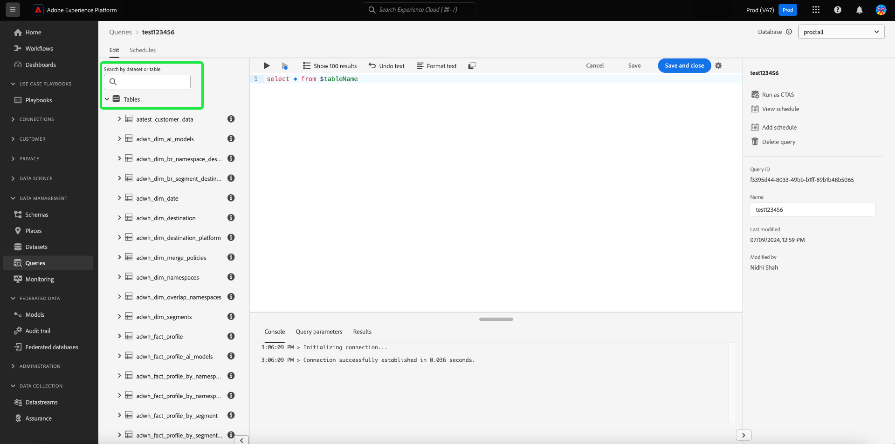
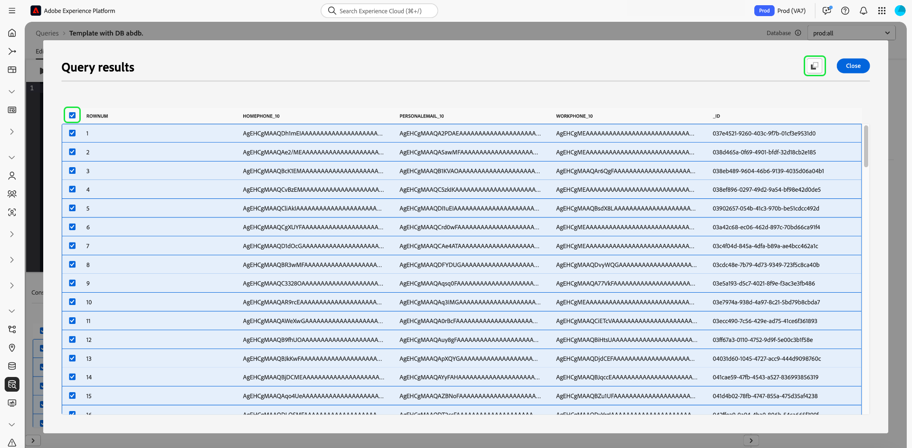

# Guide de l’interface utilisateur de Query Editor

Query Editor est un outil interactif fourni par Adobe Experience Platform Query Service. Il permet d’écrire, de valider et d’exécuter des requêtes pour les données d’expérience client dans l’interface utilisateur d’[!DNL Experience Platform]. Query Editor prend en charge le développement de requête pour l’analyse et l’exploration de données. Il vous permet également d’exécuter des requêtes interactives à des fins de développement, ainsi que des requêtes non interactives pour renseigner les jeux de données dans [!DNL Experience Platform].

Pour plus d’informations sur les concepts et les fonctionnalités du service de requête, consultez la [Présentation du service de requête](../home.md). Pour en savoir plus sur la navigation dans l’interface utilisateur du service de requête sur [!DNL Experience Platform], consultez la [Présentation de l’interface utilisateur du service de requête](./overview.md).

## Prise en main {#getting-started}

Query Editor offre une exécution flexible des requêtes en se connectant à Query Service, et les requêtes ne s’exécutent que lorsque cette connexion est active.

## Accès au requêteur {#accessing-query-editor}

Dans l’interface utilisateur de [!DNL Experience Platform], sélectionnez **[!UICONTROL Queries]** dans le menu de navigation de gauche pour ouvrir l’espace de travail de Query Service. Ensuite, pour commencer à écrire des requêtes, sélectionnez **[!UICONTROL Create Query]** en haut à droite de l’écran. Ce lien est disponible depuis n’importe quelle page de l’espace de travail du service de requête.

### Connexion au service de requête {#connecting-to-query-service}

Query Editor prend quelques secondes pour s’initialiser et se connecter à Query Service lorsqu’il est ouvert. La console vous indique qu’il est connecté, comme illustré ci-dessous. Si vous tentez d’exécuter une requête avant que l’éditeur ne soit connecté, l’exécution est retardée jusqu’à ce que la connexion soit établie.

### Exécution des requêtes depuis le requêteur {#run-a-query}

Les requêtes exécutées à partir du Query Editor s’exécutent de manière interactive, ce qui signifie que si vous fermez le navigateur ou quittez la page, la requête est annulée. Il en va de même pour les requêtes effectuées pour générer des jeux de données à partir de sorties de requête.

## Création de requêtes à l’aide de l’éditeur de requêtes amélioré {#query-authoring}

Avec le requêteur, vous pouvez écrire, exécuter et enregistrer des requêtes de données d’expérience client. Toutes les requêtes exécutées ou enregistrées dans Query Editor sont disponibles pour tous les utilisateurs de votre organisation qui ont accès à Query Service.

### Sélecteur de base de données {#database-selector}

Sélectionnez une base de données à interroger dans le menu déroulant en haut à droite de Query Editor. La base de données sélectionnée s’affiche dans la liste déroulante.

### Paramètres {#settings}

Une icône de paramètres située au-dessus du champ de saisie du Query Editor inclut des options permettant d’activer/désactiver le thème sombre ou de désactiver/activer la saisie automatique.

>[!TIP]
>
>Vous pouvez [!UICONTROL Disable syntax auto complete] lors de la création d’une requête sans perdre votre progression.

Pour activer les thèmes sombres ou clairs, sélectionnez l’icône des paramètres () suivi de l’option dans le menu déroulant qui s’affiche.

#### Saisie automatique {#auto-complete}

Le Query Editor suggère automatiquement des mots-clés SQL potentiels ainsi que des détails de tableau ou de colonne pour la requête au fur et à mesure que vous l’écrivez. La fonction de saisie automatique est activée par défaut et peut être désactivée ou activée à tout moment à partir des paramètres du Query Editor.

Le paramètre de configuration de saisie automatique est défini par utilisateur et mémorisé pour les connexions consécutives de cet utilisateur. La désactivation de cette fonction arrête le traitement de plusieurs commandes de métadonnées et la suggestion de recommandations qui accélère généralement la vitesse de l’auteur lors de la modification des requêtes.

### Exécution de plusieurs requêtes séquentielles {#execute-multiple-sequential-queries}

Utilisez l’éditeur de requêtes amélioré pour écrire plusieurs requêtes et exécuter toutes les requêtes de manière séquentielle. L’exécution de plusieurs requêtes dans une séquence génère chacune une entrée de journal. Cependant, seuls les résultats de la première requête s’affichent dans la console du Query Editor. Vérifiez le journal des requêtes si vous devez dépanner ou confirmer les requêtes qui ont été exécutées. Pour plus d’informations, consultez la [documentation sur les journaux de requêtes](./query-logs.md).

>[!NOTE]
> 
>Si une requête CTAS est exécutée après la première requête dans le Query Editor, une table est toujours créée, mais aucune sortie n’est générée sur la console Query Editor.

### Exécuter la requête sélectionnée {#execute-selected-query}

Si vous avez écrit plusieurs requêtes, mais ne devez exécuter qu’une seule, vous pouvez mettre en surbrillance la requête choisie et sélectionner la requête
Icône [!UICONTROL Run selected query]. Cette icône est désactivée par défaut jusqu’à ce que vous sélectionniez la syntaxe de la requête dans l’éditeur.

![Query Editor avec l’icône [!UICONTROL Run selected query] mise en surbrillance.](../images/ui/query-editor/run-selected-query.png)

### Annuler la session du Query Editor {#cancel-query}

Prenez le contrôle de l’exécution des requêtes et améliorez votre productivité en annulant les requêtes de longue durée. Cette action efface le Query Editor lors de l’exécution d’une requête. N’oubliez pas que la requête continue de s’exécuter en arrière-plan. S’il s’agit d’une requête CTAS, elle génère toujours un jeu de données de sortie. Pour annuler l’exécution dans l’éditeur et continuer à composer une instruction SQL, sélectionnez **[!UICONTROL Cancel query]** après l’exécution d’une requête.

![Query Editor avec les [!UICONTROL Cancel query] mises en surbrillance.](../images/ui/query-editor/cancel-query-run.png)

Une boîte de dialogue de confirmation s’affiche. Sélectionnez **[!UICONTROL Confirm]** pour annuler l’exécution de la requête.

### Nombre de résultats {#result-count}

Le Query Editor a une sortie de ligne maximale de 50 000. Vous pouvez choisir le nombre de lignes à afficher en même temps dans la console du Query Editor. Pour modifier le nombre de lignes affichées dans la console, sélectionnez la liste déroulante **[!UICONTROL Result count]** et sélectionnez l’une des options suivantes : 50, 100, 150, 300, 500 et 1 000.

>[!NOTE]
>
>Comme l’interface utilisateur d’Experience Platform peut prendre en charge jusqu’à 1 000 lignes, la transmission d’une valeur LIMIT supérieure à 1 000 est ignorée.

## Rédaction de requêtes {#writing-queries}

[!UICONTROL Query Editor] est organisé de manière à rendre l’écriture de requête aussi facile que possible. La copie d’écran ci-dessous présente l’affichage de l’éditeur dans l’interface utilisateur. Le champ d’entrée SQL et le bouton **Lire** sont mis en surbrillance.

Pour réduire au minimum le temps de développement, il est recommandé de développer vos requêtes avec des limites sur le nombre de lignes renvoyées. Par exemple : `SELECT fields FROM table WHERE conditions LIMIT number_of_rows`. Une fois que vous avez vérifié que votre requête produit la sortie attendue, supprimez les limites et exécutez la requête avec `CREATE TABLE tablename AS SELECT`, afin de générer un jeu de données avec la sortie.

## Outils d’écriture dans le requêteur {#writing-tools}

Utilisez les outils d’écriture de Query Editor pour améliorer votre processus de création de requêtes. Les fonctionnalités incluent des options pour formater le texte, copier le code SQL, gérer les détails de la requête et enregistrer ou planifier votre travail au fur et à mesure de votre progression.

### Mettre le texte en forme {#format-text}

La fonctionnalité [!UICONTROL Format text] rend votre requête plus lisible en ajoutant un style de syntaxe normalisé. Sélectionnez **[!UICONTROL Format text]** pour normaliser tout le texte dans Query Editor.

>[!NOTE]
>
>La fonction [!UICONTROL Format text] ne fonctionne pas avec les blocs anonymes. Pour savoir comment enchaîner séquentiellement une ou plusieurs instructions SQL, consultez la documentation sur les blocs anonymes [anonyme](../key-concepts/anonymous-block.md).

![Query Editor avec les [!UICONTROL Format text] et les instructions SQL mises en surbrillance.](../images/ui/query-editor/format-text.png)

<!-- ### Undo text {#undo-text}

If you format your SQL in the Query Editor, you can undo the formatting applied by the [!UICONTROL Format text] feature. To return your SQL back to its original form, select **[!UICONTROL Undo text]**.

![The Query Editor with [!UICONTROL Undo text] and the SQL statements highlighted.](../images/ui/query-editor/undo-text.png) -->

### Copier le SQL {#copy-sql}

Sélectionnez l’icône Copier pour copier le code SQL de Query Editor dans le presse-papiers. Cette fonctionnalité de copie est disponible pour les modèles de requête et les requêtes nouvellement créées dans Query Editor.

### Détails de la requête {#query-details}

Pour afficher une requête dans le Query Editor, sélectionnez n’importe quel modèle enregistré dans l’onglet [!UICONTROL Templates] . Le panneau des détails de la requête fournit plus d’informations et d’outils pour gérer la requête sélectionnée. Elle affiche également des métadonnées utiles, telles que la dernière fois où la requête a été modifiée et qui l’a modifiée, le cas échéant.

>[!NOTE]
>
>Les options [!UICONTROL View schedule], [!UICONTROL Add schedule] et [!UICONTROL Delete query] ne sont disponibles qu’une fois la requête enregistrée en tant que modèle. L’option [!UICONTROL Add schedule] vous permet d’accéder directement au créateur de planning à partir du Query Editor. L’option [!UICONTROL View schedule] vous permet d’accéder directement à l’inventaire planifié pour cette requête. Consultez la documentation sur les plannings de requête pour savoir comment [&#x200B; créer des plannings de requête dans l’interface utilisateur &#x200B;](./query-schedules.md#create-schedule).

Dans le panneau des détails, vous pouvez générer un jeu de données de sortie directement à partir de l’interface utilisateur, supprimer ou nommer la requête affichée, afficher le planning d’exécution de la requête et ajouter la requête à un planning.

Pour générer un jeu de données de sortie, sélectionnez **[!UICONTROL Run as CTAS]**. La boîte de dialogue **[!UICONTROL Enter output dataset details]** s’affiche. Saisissez un nom et une description, puis sélectionnez **[!UICONTROL Run as CTAS]**. Le nouveau jeu de données s’affiche dans l’onglet Parcourir **[!UICONTROL Datasets]** . Voir [documentation sur l’affichage des jeux de données](../../catalog/datasets/user-guide.md#view-datasets) pour en savoir plus sur les jeux de données disponibles pour votre organisation.

>[!NOTE]
>
>L’option [!UICONTROL Run as CTAS] n’est disponible que si la requête n’a **pas** été planifiée.

![Boîte de dialogue [!UICONTROL Enter output dataset details].](../images/ui/query-editor/output-dataset-details.png)

Une fois l’action **[!UICONTROL Run as CTAS]** exécutée, un message de confirmation s’affiche pour vous informer de la réussite de l’action. Ce message contextuel contient un lien qui permet d’accéder facilement à l’espace de travail des journaux de requête. Pour plus d’informations sur les journaux de requêtes[&#x200B; consultez la &#x200B;](./query-logs.md) documentation sur les journaux de requêtes .

### Enregistrement des requêtes {#saving-queries}

Le Query Editor fournit une fonction de sauvegarde qui vous permet d’enregistrer une requête et d’y revenir ultérieurement. Pour enregistrer une requête, sélectionnez **[!UICONTROL Save]** dans le coin supérieur droit de Query Editor. Avant de pouvoir enregistrer une requête, vous devez lui donner un nom à l’aide du panneau **[!UICONTROL Query Details]**.

>[!NOTE]
>
>Les requêtes nommées et enregistrées dans à l’aide du Query Editor sont disponibles sous forme de modèles dans l’onglet [!UICONTROL Templates] du tableau de bord Requête . Pour plus d’informations, consultez la [documentation sur les modèles](./query-templates.md).

Lorsque vous enregistrez une requête dans le Query Editor, un message de confirmation s’affiche pour vous informer de la réussite de l’action. Ce message contextuel contient un lien qui permet d&#39;accéder facilement à l&#39;espace de travail de planification des requêtes. Consultez la [documentation sur la planification des requêtes](./query-schedules.md) pour savoir comment exécuter des requêtes à une cadence personnalisée.

### Requêtes planifiées {#scheduled-queries}

Les requêtes qui ont été enregistrées en tant que modèle peuvent être planifiées à partir de Query Editor. La planification des requêtes vous permet d’automatiser l’exécution des requêtes selon une cadence personnalisée. Vous pouvez planifier des requêtes en fonction de la fréquence, de la date et de l’heure, mais aussi choisir un jeu de données de sortie pour vos résultats, si nécessaire. Les plannings de requête peuvent également être désactivés ou supprimés via l’interface utilisateur.

Les plannings sont définis dans le Query Editor. Lors de l’utilisation de Query Editor, vous pouvez uniquement ajouter un planning à une requête qui a déjà été créée et enregistrée. La même limitation ne s’applique pas à l’API Query Service.

>[!NOTE]
>
>Les requêtes planifiées qui échouent dix exécutions consécutives sont automatiquement mises à l’état [!UICONTROL Quarantined]. Une requête avec ce statut nécessite votre intervention avant que d’autres exécutions puissent avoir lieu. Consultez la documentation [requêtes en quarantaine](./monitor-queries.md#quarantined-queries) pour plus d’informations.

Consultez la documentation sur les plannings de requête pour savoir comment [&#x200B; créer des plannings de requête dans l’interface utilisateur &#x200B;](./query-schedules.md). Vous pouvez également découvrir comment ajouter des plannings à l’aide de l’API dans le guide de point d’entrée [des requêtes planifiées](../api/scheduled-queries.md).

Toutes les requêtes planifiées sont ajoutées à la liste dans l’onglet [!UICONTROL Scheduled queries] . Depuis cet espace de travail, vous pouvez surveiller le statut de toutes les tâches de requête planifiées via l’interface utilisateur. Sur l’onglet [!UICONTROL Scheduled queries] , vous pouvez trouver des informations importantes sur les exécutions de vos requêtes et vous abonner aux alertes. Les informations disponibles incluent le statut, les détails du planning et les messages/codes d’erreur en cas d’échec de l’exécution. Pour plus d’informations, consultez le document [Surveiller les requêtes planifiées](./monitor-queries.md) .

### Accès aux requêtes précédentes {#previous-queries}

Toutes les requêtes exécutées depuis le requêteur sont capturées dans le tableau Journal. Vous pouvez utiliser la fonctionnalité de recherche dans l’onglet **[!UICONTROL Log]** pour rechercher des exécutions de requête. Les requêtes enregistrées sont répertoriées dans l’onglet **[!UICONTROL Templates]** .

Si une requête a été planifiée, l’onglet [!UICONTROL Scheduled Queries] offre une meilleure visibilité à travers l’interface utilisateur pour ces tâches de requête. Pour plus d’informations, consultez la [documentation sur la surveillance des requêtes](./monitor-queries.md).

>[!NOTE]
>
>Les requêtes non exécutées ne sont pas enregistrées dans le journal. Pour que la requête soit disponible dans Query Service, elle doit être exécutée ou enregistrée dans le requêteur.

### Explorateur d’objets {#object-browser}

Utilisez l’explorateur d’objets pour rechercher et filtrer facilement des jeux de données. L’explorateur d’objets réduit le temps passé à rechercher des tables et des jeux de données dans des environnements volumineux avec de nombreux jeux de données. Grâce à un accès simplifié aux données et métadonnées pertinentes, vous pouvez vous concentrer davantage sur la création de requêtes et moins sur la navigation.

Pour parcourir votre base de données avec l’explorateur d’objets, saisissez un nom de tableau dans le champ de recherche ou sélectionnez **[!UICONTROL Tables]** pour développer la liste des jeux de données et des tableaux disponibles. Lors de l’utilisation du champ de recherche, la liste des tableaux disponibles est filtrée de manière dynamique en fonction de vos entrées.

Chaque jeu de données contenu dans [la base de données sélectionnée](#database-dropdown) est répertorié dans un rail de navigation à gauche du Query Editor.

Le schéma affiché dans l’explorateur d’objets est un schéma observable. Cela signifie que vous pouvez l’utiliser pour surveiller les modifications et les mises à jour en temps réel, car les modifications sont immédiatement visibles. Les schémas observables permettent d’assurer la synchronisation des données et facilitent les tâches de débogage ou d’analyse.

#### Limitation actuelle {#current-limitation}

Le système traite les requêtes de manière séquentielle, ce qui signifie qu’une seule requête peut être exécutée à la fois. Lorsqu’une requête est en cours, les tables supplémentaires ne sont pas accessibles dans le volet de navigation de gauche.

#### Accès aux métadonnées de la table {#table-metadata}

Outre les recherches rapides, vous pouvez désormais accéder facilement aux métadonnées de n’importe quel tableau en sélectionnant l’icône « i » en regard du nom du tableau. Vous obtenez ainsi des informations détaillées sur la table sélectionnée, ce qui vous aide à prendre des décisions éclairées lors de la rédaction de requêtes.

#### Explorer les tables enfants

Pour explorer les tableaux enfants ou liés, sélectionnez la flèche déroulante en regard d’un nom de tableau dans la liste. Cela développe la table pour afficher toutes les tables enfants associées, et donne une vue claire de la structure des données et permet des constructions de requête plus complexes. L’icône en regard du nom du champ indique le type de données de la colonne, afin de vous aider à l’identifier lors de requêtes complexes.

## Exécution de requêtes à l’aide du requêteur {#executing-queries}

Pour exécuter une requête dans Query Editor, vous pouvez saisir le langage SQL dans l’éditeur ou charger une requête précédente depuis l’onglet **[!UICONTROL Log]** ou **[!UICONTROL Templates]** , et sélectionner **Lire**. Le statut de l’exécution de la requête est affiché dans l’onglet **[!UICONTROL Console]** ci-dessous, et les données de sortie sont affichées dans l’onglet **[!UICONTROL Results]** .

### Console {#console}

La console fournit des informations sur l’état et le fonctionnement du service de requête. La console affiche l’état de la connexion au service de requête, les opérations des requêtes en cours d’exécution et tout message d’erreur résultant de ces requêtes.

>[!NOTE]
>
>La console affiche uniquement les erreurs résultant de l’exécution d’une requête. Elle n’affiche pas les erreurs de validation de requête qui se produisent avant l’exécution d’une requête.

## Résultats de requête {#query-results}

Une fois une requête terminée, les résultats s’affichent dans l’onglet **[!UICONTROL Results]** , en regard de l’onglet **[!UICONTROL Console]** . Cette vue affiche la sortie tabulaire de votre requête, affichant entre 50 et 1 000 lignes de résultats en fonction du nombre de [résultats](#result-count) choisi. Il vous permet de vérifier que votre requête produit la sortie attendue. Pour générer un jeu de données avec votre requête, supprimez les limites sur les lignes renvoyées, puis exécutez la requête avec `CREATE TABLE tablename AS SELECT` pour générer un jeu de données avec la sortie. Consultez le [tutoriel sur la génération de jeux de données](./create-datasets.md) pour apprendre à générer un jeu de données à partir des résultats de requête dans le requêteur.

### Télécharger les résultats de la requête {#download-query-results}

>[!AVAILABILITY]
>
>Les fonctionnalités de téléchargement sont disponibles uniquement pour les clients qui utilisent le module complémentaire Data Distiller. Pour en savoir plus sur Data Distiller, contactez votre représentant ou représentante Adobe.

Après avoir exécuté une requête réussie, téléchargez les résultats au format CSV, XLSX ou JSON à utiliser dans les workflows d’analyse, de création de rapports ou de feuilles de calcul hors ligne. Cette fonctionnalité simplifie les workflows pour les équipes de marketing et d’analyse en permettant un accès immédiat aux résultats des requêtes pour les analyses hors ligne, les rapports et les processus Excel.

Pour télécharger les résultats de votre requête, sélectionnez **[!UICONTROL Download]** dans le coin supérieur droit de l’onglet **[!UICONTROL Result]** de Query Editor. Choisissez ensuite **[!UICONTROL CSV]**, **[!UICONTROL XLSX]** ou **[!UICONTROL JSON]** dans le menu déroulant. Le fichier est téléchargé automatiquement sur votre ordinateur local. Choisissez le format qui correspond à votre cas d’utilisation, CSV pour les exportations légères, XLSX pour les feuilles de calcul formatées ou JSON pour la gestion des données structurées.

>[!NOTE]
>
>Si le bouton **[!UICONTROL Download]** est manquant, vérifiez les résultats de votre requête. Le bouton s’affiche uniquement lorsque des enregistrements sont renvoyés. Si aucun enregistrement n’est renvoyé, l’onglet **[!UICONTROL Result]** affiche un message « Aucun résultat » et l’option de téléchargement est désactivée.

>[!NOTE]
>
>Lors de l’ouverture d’un fichier CSV dans Excel, l’avertissement suivant peut s’afficher :  « Perte possible de données. Certaines fonctionnalités risquent d’être perdues si vous enregistrez ce classeur au format .csv (délimité par des virgules). Pour conserver ces fonctionnalités, enregistrez-le au format de fichier Excel. » Notez également que le formatage de la date et de l’heure peut varier en fonction du type de fichier. Les fichiers CSV conservent le format indiqué dans les résultats de la requête, tandis que les fichiers XLSX peuvent appliquer automatiquement une mise en forme localisée dans Excel. Si cet avertissement s’affiche, vous pouvez continuer en toute sécurité. Pour conserver une mise en forme spécifique à Excel, enregistrez le fichier en tant que XLSX à la place.

### Affichage des résultats en plein écran {#view-results}

Une fois la requête exécutée, sélectionnez **[!UICONTROL View results]** dans l’onglet **[!UICONTROL Result]** pour ouvrir un affichage tabulé en plein écran de vos résultats.

Utilisez l’aperçu plein écran pour numériser facilement des tableaux larges et inspecter les détails au niveau des lignes sans défilement horizontal. L’affichage plein écran affiche la sortie dans une grille redimensionnable, ce qui facilite la révision des jeux de données volumineux et l’analyse sur plusieurs colonnes.

>[!NOTE]
>
>L’aperçu est en lecture seule et ne modifie pas votre requête ou votre jeu de données.

### Copier les résultats {#copy-results}

Utilisez la fonctionnalité de copie améliorée de Query Editor pour copier les résultats de la requête sous forme de valeurs séparées par des virgules (CSV) et les coller dans des outils de feuille de calcul tels qu’Excel pour une validation ou un compte rendu des performances immédiats. Cette fonctionnalité améliore la lisibilité, préserve la mise en forme et rationalise les workflows sans recourir à des outils tiers.

Vous pouvez copier les résultats de la requête à partir de l’onglet [!UICONTROL Result] ou de l’aperçu des résultats en plein écran. Dans l’onglet **[!UICONTROL Result]** , sélectionnez l’icône de copie () pour copier tous les résultats de la requête dans le presse-papiers. Pour activer l’icône de copie, sélectionnez d’abord une ligne. Vous pouvez sélectionner des lignes individuelles ou utiliser la case à cocher située en haut pour sélectionner toutes les lignes à la fois.

Vous pouvez également sélectionner **[!UICONTROL View results]** pour ouvrir l’aperçu en plein écran. Dans cette boîte de dialogue, sélectionnez des lignes individuelles ou utilisez la case à cocher située dans le coin supérieur gauche pour sélectionner toutes les lignes, puis sélectionnez l’icône de copie () pour copier les données sélectionnées.

### Ancien tableau de résultats (disponibilité limitée) {#legacy-results-table}

>[!AVAILABILITY]
>
>Le tableau des résultats hérité n’est disponible que pour certains utilisateurs et utilisatrices par le biais d’un indicateur de fonctionnalité et peut ne pas s’afficher dans votre expérience Query Editor actuelle. Si votre équipe s&#39;appuie sur des workflows glisser-sélectionner, contactez votre représentant Adobe pour demander l&#39;accès.

La version héritée de Query Editor est destinée aux utilisateurs qui dépendent de workflows de données manuels flexibles tels que l’assurance qualité ou la révision basée sur des feuilles de calcul.

Il prend en charge la sélection native basée sur le navigateur. Vous pouvez ainsi mettre en surbrillance et copier n’importe quelle partie de la sortie (y compris des cellules ou des blocs individuels) à l’aide du comportement de sélection standard. Cela contraste avec le tableau amélioré, qui utilise une sélection de lignes structurée et des actions de copie dédiées.

Les données copiées sont délimitées par des tabulations. Ainsi, lorsque vous les collez dans des outils tels qu’Excel, les colonnes restent alignées et lisibles. Les en-têtes de colonne sont également inclus lorsque vous faites glisser la sélection sur la ligne d’en-tête.

## Exemples {#examples}

Query Service fournit des solutions à divers cas d’utilisation dans des scénarios d’industries et d’entreprises. Ces exemples démontrent la souplesse et l&#39;incidence du service pour répondre à divers besoins. Pour [découvrir comment Query Service peut apporter de la valeur à vos besoins professionnels spécifiques](../use-cases/overview.md), explorez la collection complète de documents de cas d’utilisation. Découvrez comment utiliser Query Service pour fournir des informations et des solutions afin d’améliorer l’efficacité opérationnelle et la réussite commerciale.

<!-- This video is from 2019. The logic is sounds but the workflow is too outdated. -->

## Tutoriel vidéo sur l’exécution de requêtes avec Query Service {#query-tutorial-video}

La vidéo suivante montre comment exécuter des requêtes dans l’interface Adobe Experience Platform et dans un client PSQL. La vidéo explique également l’utilisation de propriétés individuelles dans un objet XDM, les fonctions définies par Adobe et l’utilisation des requêtes CREATE TABLE AS SELECT (CTAS).

>[!NOTE]
>
>L’interface utilisateur illustrée dans la vidéo est obsolète, mais la logique utilisée dans le workflow reste la même.

>[!VIDEO](https://video.tv.adobe.com/v/32943?captions=fre_fr&quality=12&learn=on)

## Surveiller et gérer les sessions simultanées {#monitor-manage-sessions}

Utilisez la gestion des sessions pour afficher les sessions Query Editor actives dans les sandbox, identifier les sessions inactives et les terminer sur une capacité partagée gratuite. Vous ne pouvez pas interrompre les sessions qui exécutent des requêtes de manière active. Cette fonctionnalité est réservée aux administrateurs et nécessite l’autorisation **[!UICONTROL Manage Query Session]**.

Pour accéder à la gestion des sessions, sélectionnez l’onglet **[!UICONTROL Admin]** dans l’espace de travail de Query Service. Pour obtenir des instructions détaillées sur l’affichage des détails des sessions, l’interprétation du statut des sessions et la fin des sessions inactives, voir [Gérer les sessions Query Service](session-management.md).

## Étapes suivantes

Maintenant que vous connaissez les fonctionnalités disponibles dans Query Editor et que vous savez naviguer dans l’application, vous pouvez commencer à créer vos propres requêtes directement dans [!DNL Experience Platform]. Pour plus d’informations sur l’exécution de requêtes SQL par rapport aux jeux de données dans [!DNL Data Lake], consultez le guide sur ’[exécution de requêtes](../best-practices/writing-queries.md).
