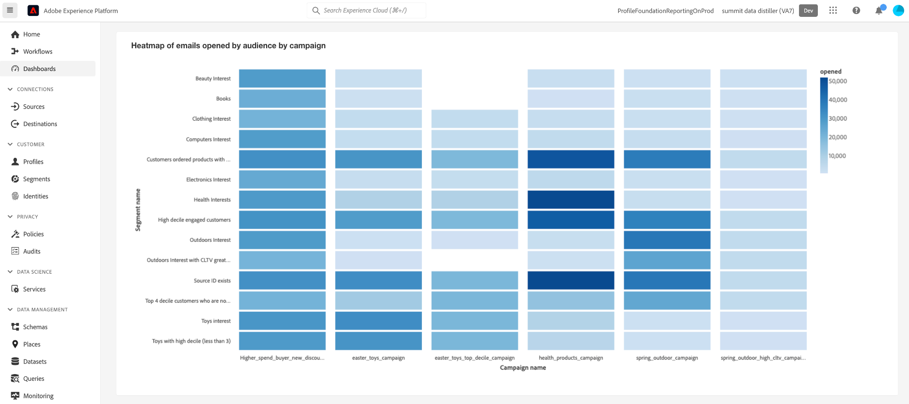

# Suivre les signaux de données pour générer la valeur de la durée de vie du client

Vous pouvez utiliser Real-Time Customer Data Platform pour effectuer le suivi de la valeur de durée de vie du client (CLV) et visualiser cette mesure avec des tableaux de bord définis par l’utilisateur. Grâce à la Distiller de données et aux tableaux de bord définis par l’utilisateur, vous pouvez mesurer la valeur d’un client pour votre société tout au long de votre relation. Connaître la NSI peut vous aider à développer les stratégies de votre entreprise pour acquérir de nouveaux clients tout en conservant les clients existants et en maintenant les marges bénéficiaires.

L’infographie suivante décrit le cycle de la collecte, de la manipulation, de l’analyse et de l’activation des données qui génère des données haute performance pour améliorer vos campagnes marketing.

Ce cas d’utilisation complet montre comment les signaux de données peuvent être capturés et modifiés pour calculer l’attribut dérivé de la valeur de durée de vie du client. Ces jeux de données dérivés peuvent ensuite être appliqués à vos données de profil Real-Time CDP et peuvent être utilisés avec des tableaux de bord définis par l’utilisateur ou l’utilisatrice pour créer un tableau de bord pour l’analyse insight. Grâce à Data Distiller, vous pouvez étendre le modèle de données Real-Time CDP Insights et utiliser les jeux de données dérivés de la CLV ainsi que les informations contenues dans les tableaux de bord pour créer une nouvelle audience et l’activer vers une destination souhaitée. Ces audiences hautement performantes peuvent ensuite être utilisées pour alimenter votre prochaine campagne marketing.

Ce guide est conçu pour vous aider à mieux comprendre votre expérience client en mesurant les signaux de données entre les points de contact clés qui pilotent la CLV et en implémentant un cas d’utilisation similaire dans votre environnement. L’ensemble du processus est résumé dans l’image ci-dessous.

## Commencer {#getting-started}

Ce guide nécessite une connaissance pratique des composants suivants de Adobe Experience Platform :

* [Query Service](../home.md) : fournit une interface utilisateur et une API RESTful dans lesquelles vous pouvez utiliser des requêtes SQL pour analyser et enrichir vos données.
* [Service de segmentation](../../segmentation/home.md) : permet de générer des audiences à partir de vos données du profil client en temps réel.

## Conditions préalables

Ce guide nécessite que vous disposiez du SKU [Data Distiller](../data-distiller/overview.md) dans le cadre de votre offre de package. Si vous ne savez pas si vous l’avez, contactez votre représentant de service Adobe.

## Créer un jeu de données dérivé {#create-derived-dataset}

La première étape pour établir votre CLV consiste à créer un jeu de données dérivé à partir des signaux de données capturés à partir des actions de l&#39;utilisateur. Ce cas d’utilisation particulier est capturé dans un document distinct sur un programme de fidélité des compagnies aériennes. Consultez le guide pour savoir comment [utiliser Query Service pour créer des jeux de données dérivés basés sur des déciles à utiliser avec vos données de profil](./deciles-use-case.md). Des exemples complets et des explications sont fournis dans le document pour expliquer les étapes suivantes :

* Créez un schéma pour permettre le regroupement des déciles.
* Utilisez Query Service pour créer des déciles.
* Générez des jeux de données de déciles.
* Activez le schéma à utiliser dans le profil client en temps réel.
* Créez un espace de noms d’identité et marquez-le comme identifiant principal.
* Créez une requête pour calculer les déciles sur une période de recherche en amont.

## Extension du modèle de données d’informations et planification des mises à jour {#extend-data-model-and-set-refresh-schedule}

Ensuite, vous devez créer un modèle de données personnalisé ou étendre un modèle de données Adobe Real-Time CDP existant pour interagir avec vos informations de rapports CLV. Consultez la documentation pour savoir comment [créer un modèle de données de rapport d’informations via Query Service à utiliser avec des données de magasin accélérées et des tableaux de bord définis par l’utilisateur](../data-distiller/sql-insights/reporting-insights-data-model.md#build-a-reporting-insights-data-model). Ce tutoriel couvre les étapes suivantes :

* Créez un modèle de rapport d’informations avec Data Distiller.
* Créez des tables, des relations et renseignez des données.
* Effectuez une requête sur le modèle de données d’insight de création de rapports.
* Étendez votre modèle de données avec le modèle de données d’informations Real-Time CDP.
* Créez des tableaux des dimensions pour étendre votre modèle de rapport d’informations.
* Interroger votre modèle de données d’informations de rapports de magasin accéléré et étendu

Consultez la documentation du modèle de données Real-time Customer Data Platform Insights pour savoir comment [personnaliser vos modèles de requête SQL pour créer des rapports Real-Time CDP pour vos cas d’utilisation de marketing et d’indicateurs clés de performance (ICP)](../../dashboards/data-models/cdp-insights-data-model-b2c.md).

Veillez à définir une planification pour actualiser régulièrement votre modèle de données personnalisé. Cela permet de s’assurer que les données reviennent dans le cadre de votre pipeline d’ingestion selon les besoins et renseigne vos tableaux de bord définis par l’utilisateur. Consultez le [guide de planification des requêtes](../ui/query-schedules.md#create-schedule) pour savoir comment configurer votre planification.

## Créer un tableau de bord pour capturer des informations {#build-a-custom-dashboard}

Maintenant que vous avez créé votre modèle de données personnalisé, vous êtes prêt à visualiser vos données à l’aide de requêtes personnalisées et de tableaux de bord définis par l’utilisateur. Consultez la présentation des tableaux de bord définis par l’utilisateur pour obtenir des conseils complets sur la [création d’un tableau de bord personnalisé](../../dashboards/standard-dashboards.md). Le guide de l’interface utilisateur comprend des détails sur les éléments suivants :

* Création d’un widget.
* Utilisation du compositeur de widgets.

Vous trouverez ci-dessous des exemples de widgets CLV personnalisés qui utilisent des intervalles de déciles.

## Création et activation d’audiences hautes performances {#create-and-activate-audiences}

L’étape suivante consiste à créer une définition de segment et à générer des audiences à partir de vos données du profil client en temps réel. Consultez le guide de l’interface utilisateur du créateur de segments pour savoir comment [créer et activer des audiences dans Experience Platform](../../segmentation/ui/segment-builder.md). Le guide contient des sections sur les éléments suivants :

* créer des définitions de segment en utilisant une combinaison d’attributs, d’événements et d’audiences existants comme blocs de création ;
* Utilisez la zone de travail et les conteneurs du créateur de règles pour contrôler l’ordre dans lequel les règles de segmentation sont exécutées.
* visualiser les estimations de votre audience potentielle, ce qui vous permet d’ajuster vos définitions de segment selon vos besoins ;
* activer toutes les définitions de segment pour la segmentation planifiée ;
* activer des définitions de segment spécifiques pour la segmentation par flux.

Vous pouvez également consulter un [tutoriel vidéo sur le créateur de segments](https://experienceleague.adobe.com/docs/platform-learn/tutorials/audiences/create-segments.html) disponible pour plus d’informations.

## Activer votre audience pour une campagne par e-mail {#activate-audience-for-campaign}

Une fois que vous avez créé votre audience, vous êtes prêt à l’activer vers une destination. Experience Platform prend en charge différents fournisseurs de service de messagerie (ESP) qui vous permettent de gérer vos activités de marketing par e-mail, telles que l’envoi de campagnes promotionnelles par e-mail.

Consultez la [présentation des destinations de marketing par e-mail](../../destinations/catalog/email-marketing/overview.md#connect-destination) pour obtenir une liste des destinations prises en charge vers lesquelles vous souhaitez exporter des données (par exemple, la page [Oracle Eloqua](../../destinations/catalog/email-marketing/oracle-eloqua-api.md)).

## Afficher les données d’analyse renvoyées par votre campagne {#post-campaign-data-analysis}

Les données provenant des sources peuvent désormais être [traitées de manière incrémentielle](../key-concepts/incremental-load.md) dans le cadre d’une actualisation planifiée de votre modèle de données dans la banque de données accélérée. Tous les événements de réponse des clients peuvent être ingérés dans Adobe Experience Platform au fur et à mesure qu’ils se produisent ou par lots. Votre modèle de données peut être actualisé une ou plusieurs fois par jour, selon vos paramètres ou vos connecteurs source. [ Pour plus d’informations](../../ingestion/batch-ingestion/api-overview.md) consultez la présentation de l’API d’ingestion par lots ou la [présentation de l’ingestion par flux](../../ingestion/streaming-ingestion/overview.md).

Une fois votre modèle de données mis à jour, vos widgets de tableau de bord personnalisés fournissent des signaux significatifs qui vous permettent de mesurer et de visualiser la valeur de la durée de vie du client.

Plusieurs options de visualisation sont fournies pour votre analyse personnalisée.

Ces informations peuvent vous aider à développer vos stratégies commerciales pour les campagnes suivantes.

## Étapes suivantes

En lisant ce document, vous devriez mieux comprendre comment utiliser Real-Time Customer Data Platform pour suivre et visualiser la mesure de la valeur de durée de vie du client (CLV). Pour en savoir plus sur les nombreux cas d’utilisation commerciale traités par Query Service et Experience Platform, nous vous recommandons de lire les documents suivants :

* [Exemple complet d’un cas d’utilisation de navigation abandonné qui démontre la polyvalence et les avantages de Query Service.](./abandoned-browse.md)
* [Comment utiliser Query Service et le machine learning pour déterminer et filtrer l’activité des robots à partir du trafic réel des visiteurs et visiteuses du site web](./bot-filtering.md)
* [Comment effectuer une correspondance sur vos données Experience Platform qui combine les résultats de plusieurs jeux de données en correspondant approximativement à une chaîne de votre choix.](./fuzzy-match.md)

<!-- "Data signals are actions taken by consumers while online that offer clues about intent that can be acted upon. This includes anything from visiting a website to filling out a change of address or clicking an ad."  -->

<!-- "Customer touchpoints are your brand's points of customer contact, from start to finish." -->
