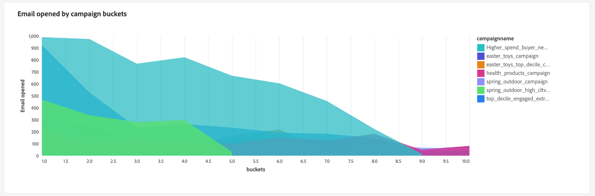

# Suivi des signaux de données pour générer la valeur de durée de vie de votre client

Vous pouvez utiliser Real-Time Customer Data Platform pour effectuer le suivi de la valeur de durée de vie des clients et visualiser cette mesure à l’aide de tableaux de bord définis par l’utilisateur. Grâce au Distiller de données et aux tableaux de bord définis par l’utilisateur, vous pouvez mesurer l’importance d’un client pour votre entreprise dans l’ensemble de vos relations. Connaître le CLV peut vous aider à développer les stratégies de votre entreprise pour acquérir de nouveaux clients tout en conservant les clients existants et en maintenant les marges bénéficiaires.

L’infographie suivante illustre le cycle de collecte, de manipulation, d’analyse et d’activation de données qui génère des données hautement performantes afin d’améliorer vos campagnes marketing.

Ce cas pratique de bout en bout montre comment les signaux de données peuvent être capturés et modifiés pour calculer l’attribut dérivé de la valeur de durée de vie du client. Ces jeux de données dérivés peuvent ensuite être appliqués à vos données de profil Real-Time CDP et peuvent être utilisés avec des tableaux de bord définis par l’utilisateur pour créer un tableau de bord en vue de l’analyse des informations. Grâce à Data Distiller, vous pouvez étendre le modèle de données d’insights Real-Time CDP et utiliser les jeux de données et les informations de tableau de bord dérivés du CLV pour créer une nouvelle audience et l’activer vers une destination souhaitée. Ces audiences hautement performantes peuvent ensuite être utilisées pour alimenter votre prochaine campagne marketing.

Ce guide est conçu pour vous aider à mieux comprendre l’expérience client en mesurant les signaux de données sur les points de contact clés qui pilotent la ligne de commande et en mettant en oeuvre un cas d’utilisation similaire dans votre environnement. L’ensemble du processus est résumé dans l’image ci-dessous.

## Commencer {#getting-started}

Ce guide nécessite une compréhension pratique des composants suivants de Adobe Experience Platform :

* [Query Service](../home.md) : fournit une interface utilisateur et une API RESTful dans lesquelles vous pouvez utiliser des requêtes SQL pour analyser et enrichir vos données.
* [Segmentation Service](../../segmentation/home.md) : vous permet de générer des audiences à partir de vos données Real-time Customer Profile.

## Conditions préalables

Ce guide nécessite que vous disposiez du SKU [Data Distiller](../data-distiller/overview.md) dans le cadre de votre offre de package. Si vous n’êtes pas certain d’avoir reçu cette notification, contactez votre représentant Adobe.

## Création d’un jeu de données dérivé {#create-derived-dataset}

La première étape de la création de votre CLV consiste à créer un jeu de données dérivé à partir des signaux de données capturés à partir des actions de l’utilisateur. Ce cas d’utilisation particulier est capturé dans un document distinct sur un schéma de fidélité des compagnies aériennes. Consultez le guide pour savoir comment [utiliser Query Service pour créer des jeux de données dérivés basés sur des déciles à utiliser avec vos données de profil](./deciles-use-case.md). Des exemples complets et des explications sont fournis dans le document qui explique les étapes suivantes :

* Créez un schéma pour permettre le groupement des déciles.
* Utilisez Query Service pour créer des déciles.
* Générez des jeux de données de décile.
* Activez le schéma à utiliser dans Real-time Customer Profile.
* Créez un espace de noms d’identité et marquez-le comme identifiant principal.
* Créez une requête pour calculer les déciles sur une période de recherche arrière.

## Étendre le modèle de données d’insights et planifier les mises à jour {#extend-data-model-and-set-refresh-schedule}

Ensuite, vous devez créer un modèle de données personnalisé ou étendre un modèle de données Adobe Real-Time CDP existant pour interagir avec vos informations de création de rapports CLV. Consultez la documentation pour savoir comment [créer un modèle de données d’informations sur les rapports via Query Service pour l’utiliser avec des données de magasin accélérées et des tableaux de bord définis par l’utilisateur](../data-distiller/customizable-insights/reporting-insights-data-model.md#build-a-reporting-insights-data-model). Ce tutoriel couvre les étapes suivantes :

* Créez un modèle pour créer des rapports d’informations avec Data Distiller.
* Créer des tableaux, des relations et renseigner des données.
* Interrogez le modèle de données d’informations sur les rapports.
* Étendez votre modèle de données avec le modèle de données d’insights Real-Time CDP.
* Créez des tableaux de dimension pour étendre votre modèle d’informations sur les rapports.
* Interroger votre modèle de données d’informations de rapports de magasin accéléré et étendu

Consultez la documentation du modèle de données Real-time Customer Data Platform Insights pour savoir comment [personnaliser vos modèles de requête SQL pour créer des rapports Real-Time CDP pour vos cas d’utilisation de marketing et d’indicateurs clés de performance (ICP)](../../dashboards/data-models/cdp-insights-data-model-b2c.md).

Veillez à définir un planning pour actualiser votre modèle de données personnalisé à un rythme normal. Cela permet de s’assurer que les données reviennent dans votre pipeline d’ingestion selon les besoins et renseigne vos tableaux de bord définis par l’utilisateur. Consultez le [guide de planification des requêtes](../ui/query-schedules.md#create-schedule) pour savoir comment configurer votre planification.

## Création d’un tableau de bord pour recueillir des informations {#build-a-custom-dashboard}

Maintenant que vous avez créé votre modèle de données personnalisé, vous êtes prêt à visualiser vos données avec des requêtes personnalisées et des tableaux de bord définis par l’utilisateur. Consultez la présentation des tableaux de bord définis par l’utilisateur pour obtenir des instructions complètes sur la [création d’un tableau de bord personnalisé](../../dashboards/user-defined-dashboards.md). Le guide de l’interface utilisateur comprend des détails sur :

* Comment créer un widget.
* Comment utiliser le compositeur de widgets.

Vous trouverez ci-dessous des exemples de widgets CLV personnalisés qui utilisent des buckets de décile.

## Créer et activer des audiences haute performance {#create-and-activate-audiences}

L’étape suivante consiste à créer une définition de segment et à générer des audiences à partir de vos données Real-Time Customer Profile. Consultez le guide de l’interface utilisateur du créateur de segments pour savoir comment [créer et activer des audiences dans Platform](../../segmentation/ui/segment-builder.md). Ce guide contient des sections sur la manière de :

* créer des définitions de segment en utilisant une combinaison d’attributs, d’événements et d’audiences existants comme blocs de création ;
* Utilisez le canevas et les conteneurs du créateur de règles pour contrôler l’ordre d’exécution des règles de segmentation.
* visualiser les estimations de votre audience potentielle, ce qui vous permet d’ajuster vos définitions de segment selon vos besoins ;
* activer toutes les définitions de segment pour la segmentation planifiée ;
* activer des définitions de segment spécifiques pour la segmentation par flux.

Vous pouvez également trouver un [tutoriel vidéo du créateur de segments](https://experienceleague.adobe.com/docs/platform-learn/tutorials/audiences/create-segments.html) pour plus d’informations.

## Activation de l’audience pour une campagne par e-mail {#activate-audience-for-campaign}

Une fois que vous avez créé votre audience, vous êtes prêt à l’activer vers une destination. Platform prend en charge divers fournisseurs de services de messagerie électronique (ESP) qui vous permettent de gérer vos activités de marketing par e-mail, telles que l’envoi de campagnes promotionnelles par e-mail.

Consultez la [ présentation des destinations de marketing par e-mail](../../destinations/catalog/email-marketing/overview.md#connect-destination) pour obtenir la liste des destinations prises en charge vers lesquelles vous souhaitez exporter des données (par exemple, la page [Oracle Eloqua](../../destinations/catalog/email-marketing/oracle-eloqua-api.md) ).

## Afficher les données d’analyse renvoyées de votre campagne {#post-campaign-data-analysis}

Les données provenant de sources peuvent désormais être [traitées de manière incrémentielle](../key-concepts/incremental-load.md) dans le cadre d’une actualisation planifiée de votre modèle de données dans l’entrepôt de données accéléré. Tous les événements de réponse des clients peuvent être ingérés dans Adobe Experience Platform au fur et à mesure ou par lots. Votre modèle de données peut être actualisé une ou plusieurs fois par jour en fonction de vos paramètres ou des connecteurs source. Pour plus d’informations, consultez la [présentation de l’API d’ingestion par lots](../../ingestion/batch-ingestion/api-overview.md) ou la [présentation de l’ingestion par flux](../../ingestion/streaming-ingestion/overview.md) .

Une fois votre modèle de données mis à jour, vos widgets de tableau de bord personnalisés fournissent des signaux significatifs qui vous permettent de mesurer et de visualiser la valeur de durée de vie des clients.

Diverses options de visualisation sont fournies pour votre analyse personnalisée.

Ces informations peuvent à leur tour vous aider à développer vos stratégies commerciales pour les campagnes suivantes.

## Étapes suivantes

En lisant ce document, vous devriez mieux comprendre comment utiliser Real-Time Customer Data Platform pour effectuer le suivi et visualiser la mesure de la valeur de durée de vie du client (CLV). Pour en savoir plus sur les nombreux cas d’utilisation professionnels traités par Query Service et Experience Platform, il est recommandé de lire les documents suivants :

* [Exemple de bout en bout d’un cas d’utilisation de navigation abandonné qui démontre la polyvalence et les avantages de Query Service.](./abandoned-browse.md)
* [Comment utiliser Query Service et l’apprentissage automatique pour déterminer et filtrer l’activité des robots à partir du trafic de visiteurs d’un site web réel](./bot-filtering.md)
* [Comment effectuer une correspondance sur vos données Platform qui combine des résultats de plusieurs jeux de données en faisant correspondre approximativement une chaîne de votre choix.](./fuzzy-match.md)

<!-- "Data signals are actions taken by consumers while online that offer clues about intent that can be acted upon. This includes anything from visiting a website to filling out a change of address or clicking an ad."  -->

<!-- "Customer touchpoints are your brand's points of customer contact, from start to finish." -->
