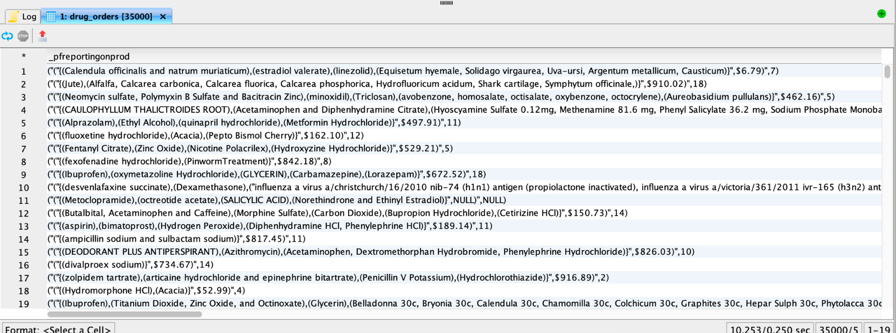

# Exploration, dépannage et vérification de l’ingestion par lots avec SQL

Ce document explique comment vérifier et valider les enregistrements dans les lots ingérés avec SQL. Ce document vous explique comment :

- Accès aux métadonnées de lot du jeu de données
- Dépannage et intégrité des données en interrogeant des lots

>[!NOTE]
>
>Certaines captures d’écran de ce guide proviennent de [!DNL DBVisualizer]. Pour savoir comment [connecter Query Service à DBVisualizer](../clients/dbvisulaizer.md) ou à d’autres [outils de BI tiers](../clients/overview.md), consultez la documentation liée.

## Conditions préalables

Pour mieux comprendre les concepts abordés dans ce document, vous devez connaître les sujets suivants :

- **Ingestion de données** : consultez la [présentation de l’ingestion de données](../../ingestion/home.md) pour en savoir plus sur la manière dont les données sont ingérées dans Platform, y compris les différentes méthodes et processus impliqués.
- **Ingestion par lots** : consultez la [présentation de l’API d’ingestion par lots](../../ingestion/batch-ingestion/overview.md) pour découvrir les concepts de base de l’ingestion par lots. Plus précisément, ce qu’est un &quot;lot&quot; et son fonctionnement dans le processus d’ingestion de données de Platform.
- **Métadonnées système dans les jeux de données** : consultez la [présentation du service de catalogue](../../catalog/home.md) pour découvrir comment les champs de métadonnées système sont utilisés pour effectuer le suivi et interroger les données ingérées.
- **Modèle de données d’expérience (XDM)** : consultez la [présentation de l’interface utilisateur des schémas](../../xdm/ui/overview.md) et les [&#39;basics of schema composition&#39;](../../xdm/schema/composition.md) pour en savoir plus sur les schémas XDM et sur la manière dont ils représentent et valident la structure et le format des données ingérées dans Platform.

## Accès aux métadonnées de lot du jeu de données {#access-dataset-batch-metadata}

Pour vous assurer que les colonnes système (colonnes de métadonnées) sont incluses dans les résultats de la requête, utilisez la commande SQL `set drop_system_columns=false` dans votre éditeur de requêtes. Cela configure le comportement de votre session de requête SQL. Cette entrée doit être répétée si vous démarrez une nouvelle session.

Ensuite, pour afficher les champs système du jeu de données, exécutez une instruction SELECT all pour afficher les résultats du jeu de données, par exemple `select * from movie_data`. Les résultats incluent deux nouvelles colonnes sur le côté droit `_acp_system_metadata` et `_ACP_BATCHID`. Les colonnes de métadonnées `_acp_system_metadata` et `_ACP_BATCHID` permettent d’identifier les partitions logiques et physique des données ingérées.


Lorsque des données sont ingérées dans Platform, une partition logique leur est affectée en fonction des données entrantes. Cette partition logique est représentée par `_acp_system_metadata.sourceBatchId`. Cet identifiant permet de regrouper et d’identifier logiquement les lots de données avant qu’ils ne soient traités et stockés.

Une fois les données traitées et ingérées dans le lac de données, une partition physique représentée par `_ACP_BATCHID` lui est affectée. Cet identifiant reflète la partition de stockage réelle dans le lac de données où se trouvent les données ingérées.

### Utiliser SQL pour comprendre les partitions logiques et physique {#understand-partitions}

Pour mieux comprendre comment les données sont groupées et distribuées après l’ingestion, utilisez la requête suivante pour compter le nombre de partitions physiques distinctes (`_ACP_BATCHID`) pour chaque partition logique (`_acp_system_metadata.sourceBatchId`).

```SQL
SELECT  _acp_system_metadata, COUNT(DISTINCT _ACP_BATCHID) FROM movie_data
GROUP BY _acp_system_metadata
```

Les résultats de cette requête sont présentés dans l&#39;image ci-dessous.


Ces résultats montrent que le nombre de lots d’entrée ne correspond pas nécessairement au nombre de lots de sortie, car le système détermine le moyen le plus efficace de grouper et de stocker les données dans le lac de données.

Pour les besoins de cet exemple, on suppose que vous avez ingéré un fichier CSV dans Platform et créé un jeu de données appelé `drug_checkout_data`.

Le fichier `drug_checkout_data` est un ensemble profondément imbriqué de 35 000 enregistrements. Utilisez l’instruction SQL `SELECT * FROM drug_orders;` pour prévisualiser le premier ensemble d’enregistrements du jeu de données `drug_orders` basé sur JSON.

L’image ci-dessous présente un aperçu du fichier et de ses enregistrements.



### Utilisation de SQL pour générer des informations sur le processus d’ingestion par lots {#sql-insights-on-batch-ingestion}

Utilisez l’instruction SQL ci-dessous pour fournir des informations sur la manière dont le processus d’ingestion des données a regroupé et traité les enregistrements d’entrée dans des lots.

```sql
SELECT _acp_system_metadata,
       Count(DISTINCT _acp_batchid) AS numoutputbatches,
       Count(_acp_batchid)          AS recordcount
FROM   drug_orders
GROUP  BY _acp_system_metadata 
```

Les résultats de la requête sont affichés dans l’image ci-dessous.


Les résultats démontrent l’efficacité et le comportement du processus d’ingestion des données. Bien que trois lots d’entrée aient été créés — chacun contenant 2 000, 2 400 et 9 000 enregistrements — lorsque les enregistrements ont été combinés et dédupliqués, il ne restait qu’un seul lot unique.

>[!NOTE]
>
>Tous les enregistrements visibles dans un jeu de données sont ceux qui ont été correctement ingérés. Une ingestion par lots réussie ne signifie pas que tous les enregistrements envoyés à partir de l’entrée source sont présents. Vous devez rechercher les échecs d’ingestion de données pour trouver les lots/enregistrements qui n’ont pas été intégrés.

## Validation d’un lot avec SQL {#validate-a-batch-with-SQL}

Ensuite, validez et vérifiez les enregistrements ingérés dans le jeu de données avec SQL.

>[!TIP]
>
>Pour récupérer l’identifiant de lot et les enregistrements de requête associés à cet identifiant de lot, vous devez d’abord créer un lot dans Platform. Si vous souhaitez tester le processus vous-même, vous pouvez ingérer des données CSV dans Platform. Lisez le guide sur la façon de [mapper un fichier CSV à un schéma XDM existant à l’aide de recommandations générées par l’IA](../../ingestion/tutorials/map-csv/recommendations.md).

Une fois que vous avez ingéré un lot, vous devez accéder à l’onglet [!UICONTROL Activité des jeux de données] pour le jeu de données dans lequel vous avez ingéré des données.

Dans l’interface utilisateur de l’Experience Platform, sélectionnez **[!UICONTROL Jeux de données]** dans le volet de navigation de gauche pour ouvrir le tableau de bord [!UICONTROL Jeux de données]. Sélectionnez ensuite le nom du jeu de données dans l’onglet [!UICONTROL Parcourir] pour accéder à l’écran [!UICONTROL Activité du jeu de données] .


La vue [!UICONTROL Activité du jeu de données] s’affiche. Cette vue contient les détails du jeu de données sélectionné. Il inclut tous les lots ingérés qui sont affichés dans un format de tableau.

Sélectionnez un lot dans la liste des lots disponibles et copiez l’[!UICONTROL identifiant de lot] dans le panneau des détails à droite.


Utilisez ensuite la requête suivante pour récupérer tous les enregistrements inclus dans le jeu de données dans le cadre de ce lot :

```sql
SELECT * FROM movie_data
WHERE  _acp_batchid='01H00BKCTCADYRFACAAKJTVQ8P' 
LIMIT 1;
```

Le mot-clé `_ACP_BATCHID` est utilisé pour filtrer l&#39;[!UICONTROL identifiant de lot].

>[!TIP]
>
>La clause `LIMIT` s’avère utile si vous souhaitez limiter le nombre de lignes affichées, mais une condition de filtre est plus souhaitable.

Lorsque vous exécutez cette requête dans l’éditeur de requêtes, les résultats sont tronqués à 100 lignes. Query Editor est conçu pour des aperçus et des recherches rapides. Pour récupérer jusqu’à 50 000 lignes, vous pouvez utiliser un outil tiers comme DBVisualizer ou DBeaver.

## Étapes suivantes {#next-steps}

En lisant ce document, vous avez appris les principes de base de la vérification et de la validation des enregistrements dans les lots ingérés dans le cadre du processus d’ingestion des données. Vous avez également obtenu des informations sur l’accès aux métadonnées de lot des jeux de données, la compréhension des partitions logiques et physiques et l’interrogation de lots spécifiques à l’aide de commandes SQL. Ces connaissances peuvent vous aider à garantir l’intégrité des données et à optimiser votre stockage de données sur Platform.

Ensuite, vous devez pratiquer l’ingestion de données pour appliquer les concepts appris. Ingérez un jeu de données d’exemple dans Platform avec les fichiers d’exemple fournis ou vos propres données. Si vous ne l’avez pas déjà fait, lisez le tutoriel sur la [ingestion de données dans Adobe Experience Platform](../../ingestion/tutorials/ingest-batch-data.md).

Vous pouvez également apprendre à [connecter et vérifier Query Service avec diverses applications clientes](../clients/overview.md) pour améliorer vos fonctionnalités d’analyse de données.
