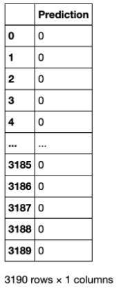

# Déterminer un score de propension à l’aide d’un modèle prédictif généré par l’apprentissage automatique

Grâce à Query Service, vous pouvez exploiter des modèles prédictifs, tels que les scores de propension, créés sur votre plateforme d’apprentissage automatique pour analyser les données Experience Platform.

Ce guide explique comment utiliser Query Service pour envoyer des données à votre plateforme d’apprentissage automatique afin d’entraîner un modèle dans un notebook de calcul. Le modèle formé peut être appliqué aux données à l’aide de SQL pour prédire la propension d’un client à acheter pour chaque visite.

## Commencer

Dans le cadre de ce processus, vous devez entraîner un modèle d’apprentissage automatique. Ce document suppose une connaissance pratique d’un ou de plusieurs environnements d’apprentissage automatique.

Cet exemple utilise [!DNL Jupyter Notebook] comme environnement de développement. Bien qu’il existe de nombreuses options disponibles, [!DNL Jupyter Notebook] est recommandé car il s’agit d’une application web open source qui a de faibles exigences en matière de calcul. Il peut être [téléchargé à partir du site officiel](https://jupyter.org/).

Si vous ne l’avez pas déjà fait, suivez les étapes pour [vous connecter [!DNL Jupyter Notebook] à Adobe Experience Platform Query Service](../clients/jupyter-notebook.md) avant de poursuivre avec ce guide.

Les bibliothèques utilisées dans cet exemple sont les suivantes :

```console
python=3.6.7
psycopg2
sklearn
pandas
matplotlib
numpy
tqdm
```

## Importation de tables d’analyse de Platform dans [!DNL Jupyter Notebook] {#import-analytics-tables}

Pour générer un modèle de score de propension, une projection des données d’analyse stockées dans Platform doit être importée dans [!DNL Jupyter Notebook]. À partir d’un [!DNL Python] 3 [!DNL Jupyter Notebook] connecté à Query Service, les commandes suivantes importent un jeu de données de comportement client à partir de Luma, un magasin de vêtements fictif. Comme les données Platform sont stockées au format XDM (Experience Data Model), un exemple d’objet JSON doit être généré, conforme à la structure du schéma. Consultez la documentation pour obtenir des instructions sur la manière de [générer l’exemple d’objet JSON](../../xdm/ui/sample.md).

![ Le tableau de bord [!DNL Jupyter Notebook] avec plusieurs commandes en surbrillance.](../images/use-cases/jupyter-commands.png)

La sortie affiche une vue tabulée de toutes les colonnes du jeu de données comportementales de Luma dans le tableau de bord [!DNL Jupyter Notebook].

![Sortie tabulée du jeu de données de comportement client importé de Luma dans [!DNL Jupyter Notebook].](../images/use-cases/behavioural-dataset-results.png)

## Préparation des données pour l’apprentissage automatique {#prepare-data-for-machine-learning}

Une colonne cible doit être identifiée pour entraîner un modèle d’apprentissage automatique. Comme la propension à acheter est l’objectif de ce cas d’utilisation, la colonne `analytic_action` est choisie comme colonne cible dans les résultats Luma. La valeur `productPurchase` est l’indicateur d’un achat client. Les colonnes `purchase_value` et `purchase_num` sont également supprimées, car elles sont directement liées à l’action d’achat de produit.

Les commandes pour effectuer ces actions sont les suivantes :

```python
#define the target label for prediction
df['target'] = (df['analytic_action'] == 'productPurchase').astype(int)
#remove columns that are dependent on the label
df.drop(['analytic_action','purchase_value'],axis=1,inplace=True)
```

Ensuite, les données du jeu de données Luma doivent être transformées en représentations appropriées. Deux étapes sont requises :

1. Transforme les colonnes représentant des nombres en colonnes numériques. Pour ce faire, convertissez explicitement le type de données dans le `dataframe`.
1. Transformez également les colonnes catégoriques en colonnes numériques.

```python
#convert columns that represent numbers
num_cols = ['purchase_num', 'value_cart', 'value_lifetime']
df[num_cols] = df[num_cols].apply(pd.to_numeric, errors='coerce')
```

Une technique appelée *un codage à chaud* est utilisée pour convertir les variables de données catégorielles à utiliser avec les algorithmes d’apprentissage automatique et profond. Cela améliore à son tour les prédictions ainsi que la précision de classification d’un modèle. Utilisez la bibliothèque `Sklearn` pour représenter chaque valeur catégorique dans une colonne distincte.

```python
from sklearn.preprocessing import OneHotEncoder

#get the categorical columns
cat_columns = list(set(df.columns) - set(num_cols + ['target']))

#get the dataframe with categorical columns only
df_cat = df.loc[:,cat_columns]

#initialize sklearn's OneHotEncoder
enc = OneHotEncoder(handle_unknown='ignore')

#fit the data into the encoder
enc.fit(df_cat)

#define OneHotEncoder's columns names
ohc_columns = [[c+'='+c_ for c_ in cat] for c,cat in zip(cat_columns,enc.categories_)]
ohc_columns = [item for sublist in ohc_columns for item in sublist]

#finalize the data input to the ML models
X = pd.DataFrame( np.concatenate((enc.transform(df_cat).toarray(),df[num_cols]),axis=1),
                 columns =  ohc_columns + num_cols)

#define target column
y = df['target']
```

Les données définies comme `X` sont tabulées et apparaissent comme ci-dessous :

![Sortie tabulée de X dans [!DNL Jupyter Notebook].](../images/use-cases/x-output-table.png)


Maintenant que les données nécessaires à l’apprentissage automatique sont disponibles, elles peuvent s’adapter aux modèles d’apprentissage automatique préconfigurés dans la bibliothèque `sklearn` de [!DNL Python]. [!DNL Logistics Regression] est utilisé pour entraîner le modèle de propension et vous permet de voir la précision des données de test. Dans ce cas, il est d’environ 85 %.

L’algorithme [!DNL Logistic Regression] et la méthode de division train-test, utilisés pour estimer les performances des algorithmes d’apprentissage automatique, sont importés dans le bloc de code ci-dessous :

```python
from sklearn.linear_model import LogisticRegression
from sklearn.model_selection import train_test_split

X_train, X_test, y_train, y_test = train_test_split(
    X, y, test_size=0.33, random_state=42)

clf = LogisticRegression(max_iter=2000, random_state=0).fit(X_train, y_train)

print("Test data accuracy: {}".format(clf.score(X_test, y_test)))
```

La précision des données de test est de 0,8518518518518519.

Grâce à la régression logistique, vous pouvez visualiser les raisons d’un achat et trier les fonctionnalités qui déterminent la propension en fonction de leur importance classée dans les commandes décroissantes. Les premières colonnes indiquent une causalité plus élevée qui conduit au comportement d’achat. Ces dernières colonnes indiquent les facteurs qui n’entraînent pas de comportement d’achat.

Le code permettant de visualiser les résultats sous forme de deux graphiques à barres est le suivant :

```python
from matplotlib import pyplot as plt

#get feature importance as a sorted list of columns
feature_importance = np.argsort(-clf.coef_[0])
top_10_features_purchase_names = X.columns[feature_importance[:10]]
top_10_features_purchase_values = clf.coef_[0][feature_importance[:10]]
top_10_features_not_purchase_names = X.columns[feature_importance[-10:]]
top_10_features_not_purchase_values = clf.coef_[0][feature_importance[-10:]]

#plot the figures
fig, (ax1, ax2) = plt.subplots(1, 2,figsize=(10,5))

ax1.bar(np.arange(10),top_10_features_purchase_values)
ax1.set_xticks(np.arange(10))
ax1.set_xticklabels(top_10_features_purchase_names,rotation = 90)
ax1.set_ylim([np.min(clf.coef_[0])-0.1,np.max(clf.coef_[0])+0.1])
ax1.set_title("Top 10 features to define \n a propensity to purchase")

ax2.bar(np.arange(10),top_10_features_not_purchase_values, color='#E15750')
ax2.set_xticks(np.arange(10))
ax2.set_xticklabels(top_10_features_not_purchase_names,rotation = 90)
ax2.set_ylim([np.min(clf.coef_[0])-0.1,np.max(clf.coef_[0])+0.1])
ax2.set_title("Top 10 features to define \n a propensity to NOT purchase")

plt.show()
```

Vous trouverez ci-dessous une visualisation en graphique à barres verticales des résultats :


Le graphique à barres permet de distinguer plusieurs modèles. Les rubriques Point de vente (POS) et Appels du canal comme remboursement sont les facteurs les plus importants qui déterminent un comportement d’achat. Bien que les rubriques Appel en tant que plaintes et factures soient des rôles importants pour définir le comportement de non-achat. Il s’agit d’informations quantifiables et exploitables que les marketeurs peuvent exploiter pour mener des campagnes marketing afin de répondre à la propension à acheter de ces clients.

## Utilisation de Query Service pour appliquer le modèle formé {#use-query-service-to-apply-trained-model}

Une fois le modèle formé créé, il doit être appliqué aux données conservées dans Experience Platform. Pour ce faire, la logique du pipeline d’apprentissage automatique doit être convertie en SQL. Les deux composants clés de cette transition sont les suivants :

- Tout d’abord, SQL doit remplacer le module [!DNL Logistics Regression] pour obtenir la probabilité d’un libellé de prédiction. Le modèle créé par la Régression logistique a produit le modèle de régression `y = wX + c` où les poids `w` et l’ordonnée à l’origine `c` sont la sortie du modèle. Les fonctions SQL peuvent être utilisées pour multiplier les poids pour obtenir une probabilité.

- Deuxièmement, le processus d&#39;ingénierie réalisé dans [!DNL Python] avec un encodage à chaud doit également être incorporé dans SQL. Par exemple, dans la base de données d’origine, nous avons une colonne `geo_county` pour stocker le comté, mais la colonne est convertie en `geo_county=Bexar`, `geo_county=Dallas`, `geo_county=DeKalb`. L’instruction SQL suivante effectue la même transformation, où `w1`, `w2` et `w3` peuvent être remplacés par les poids appris du modèle dans [!DNL Python] :

```sql
SELECT  CASE WHEN geo_state = 'Bexar' THEN FLOAT(w1) ELSE 0 END AS f1,
        CASE WHEN geo_state = 'Dallas' THEN FLOAT(w2) ELSE 0 END AS f2,
        CASE WHEN geo_state = 'Bexar' THEN FLOAT(w3) ELSE 0 END AS f3,
```

Pour les fonctions numériques, vous pouvez multiplier directement les colonnes avec les poids, comme illustré dans l’instruction SQL ci-dessous.

```sql
SELECT FLOAT(purchase_num) * FLOAT(w4) AS f4,
```

Une fois les nombres obtenus, ils peuvent être transférés vers une fonction sigmoid où l’algorithme de régression logistique produit les prédictions finales. Dans l’instruction ci-dessous, `intercept` est le numéro de l’ordonnée à l’origine dans la régression.
        

```sql
SELECT CASE WHEN 1 / (1 + EXP(- (f1 + f2 + f3 + f4 + FLOAT(intercept)))) > 0.5 THEN 1 ELSE 0 END AS Prediction;
```
 
### Exemple de bout en bout

Dans une situation où vous avez deux colonnes (`c1` et `c2`), si `c1` comporte deux catégories, l’algorithme [!DNL Logistic Regression] est entraîné avec la fonction suivante :
 

```python
y = 0.1 * "c1=category 1"+ 0.2 * "c1=category 2" +0.3 * c2+0.4
```
 
L’équivalent en SQL est le suivant :

```sql
SELECT
  CASE WHEN 1 / (1 + EXP(- (f1 + f2 + f3 + FLOAT(0.4)))) > 0.5 THEN 1 ELSE 0 END AS Prediction
FROM
  (
    SELECT
      CASE WHEN c1 = 'Cateogry 1' THEN FLOAT(0.1) ELSE 0 END AS f1,
      CASE WHEN c1 = 'Cateogry 2' THEN FLOAT(0.2) ELSE 0 END AS f2,
      FLOAT(c2) * FLOAT(0.3) AS f3
    FROM TABLE
  )
```
 
Le code [!DNL Python] pour automatiser le processus de traduction est le suivant :

```python
def generate_lr_inference_sql(ohc_columns, num_cols, clf, db):
    features_sql = []
    category_sql_text = "case when {col} = '{val}' then float({coef}) else 0 end as f{name}"
    numerical_sql_text = "float({col}) * float({coef}) as f{name}"
    for i, (column, coef) in enumerate(zip(ohc_columns+num_cols, clf.coef_[0])):
        if i < len(ohc_columns):
            col,val = column.split('=')
            val = val.replace("'","%''%")
            sql = category_sql_text.format(col=col,val=val,coef=coef,name=i+1)
        else:
            sql = numerical_sql_text.format(col=column,coef=coef,name=i+1)
        features_sql.append(sql)
    features_sum = '+'.join(['f{}'.format(i) for i in range(1,len(features_sql)+1)])
    final_sql = '''
    select case when 1/(1 + EXP(-({features} + float({intercept})))) > 0.5 then 1 else 0 end as Prediction
    from
        (select {cols}
        from {db})
    '''.format(features=features_sum,cols=",".join(features_sql),intercept=clf.intercept_[0],db=db)
    return final_sql
```

Lorsque SQL est utilisé pour déduire la base de données, la sortie est la suivante :

```python
sql = generate_lr_inference_sql(ohc_columns, num_cols, clf, "fdu_luma_raw")
cur.execute(sql)    
samples = [r for r in cur]
colnames = [desc[0] for desc in cur.description]
pd.DataFrame(samples,columns=colnames)
```

Les résultats tabulés affichent la propension à acheter pour chaque session de client avec `0`, ce qui signifie qu’il n’y a aucune propension à acheter et `1`, ce qui signifie une propension à acheter confirmée.



## Utilisation de données échantillonnées : Bootstrapping {#working-on-sampled-data}

Si la taille des données est trop importante pour que votre ordinateur local stocke les données pour la formation de modèle, vous pouvez prendre des exemples au lieu des données complètes de Query Service. Pour connaître la quantité de données à échantillonner à partir de Query Service, vous pouvez appliquer une technique appelée bootstrapping. À cet égard, l’amorçage signifie que le modèle est entraîné plusieurs fois avec divers échantillons et que la variance de la précision du modèle entre différents échantillons est inspectée. Pour ajuster l’exemple de modèle de propension donné ci-dessus, commencez par encapsuler l’ensemble du processus d’apprentissage automatique dans une fonction. Le code est le suivant :

```python
def end_to_end_pipeline(df):
    
    #define the target label for prediction
    df['target'] = (df['analytic_action'] == 'productPurchase').astype(int)
    #remove columns that are dependent on the label
    df.drop(['analytic_action','purchase_value'],axis=1,inplace=True)
    
    num_cols = ['purchase_num','value_cart','value_lifetime']
    df[num_cols] = df[num_cols].apply(pd.to_numeric, errors='coerce')
    
    #get the categorical columns
    cat_columns = list(set(df.columns) - set(num_cols + ['target']))

    #get the dataframe with categorical columns only
    df_cat = df.loc[:,cat_columns]

    #initialize sklearn's One Hot Encoder
    enc = OneHotEncoder(handle_unknown='ignore')

    #fit the data into the encoder
    enc.fit(df_cat)

    #define one hot encoder's columns names
    ohc_columns = [[c+'='+c_ for c_ in cat] for c,cat in zip(cat_columns,enc.categories_)]
    ohc_columns = [item for sublist in ohc_columns for item in sublist]

    #finalize the data input to the ML models
    X = pd.DataFrame( np.concatenate((enc.transform(df_cat).toarray(),df[num_cols]),axis=1),
                     columns =  ohc_columns + num_cols)

    #define target column
    y = df['target']
    
    X_train, X_test, y_train, y_test = train_test_split(
    X, y, test_size=0.33, random_state=42)

    clf = LogisticRegression(max_iter=2000,random_state=0).fit(X_train, y_train)

    return clf.score(X_test, y_test)
```

Cette fonction peut ensuite être exécutée plusieurs fois dans une boucle, par exemple 10 fois. La différence avec le code précédent réside dans le fait que l’exemple n’est désormais pas tiré de l’ensemble du tableau, mais uniquement d’un échantillon de lignes. Par exemple, l’exemple de code ci-dessous ne prend que 1 000 lignes. Les précisions de chaque itération peuvent être stockées.

```python
from tqdm import tqdm

bootstrap_accuracy = []
for i in tqdm(range(100)):
    
    #sample data from QS
    cur.execute('''SELECT *
    FROM fdu_luma_raw
    ORDER BY random()
    LIMIT 1000
    ''')    
    samples = [r for r in cur]
    colnames = [desc[0] for desc in cur.description]
    df_samples = pd.DataFrame(samples,columns=colnames)
    df_samples.fillna(0,inplace=True)
    
    #train the propensity model with sampled data and output its accuracy
    bootstrap_accuracy.append(end_to_end_pipeline(df_samples))
    
bootstrap_accuracy = np.sort(bootstrap_accuracy)
```

Les précisions du modèle amorcé sont ensuite triées. Ensuite, les 10 et 90 quantiles des précisions du modèle deviennent un intervalle de confiance de 95 % pour les précisions du modèle avec la taille d’échantillon donnée.


La figure ci-dessus indique que si vous ne prenez que 1 000 lignes pour entraîner vos modèles, vous pouvez vous attendre à une baisse de précision entre 84 % et 88 % environ. Vous pouvez ajuster la clause `LIMIT` dans les requêtes Query Service en fonction de vos besoins pour garantir les performances des modèles.
