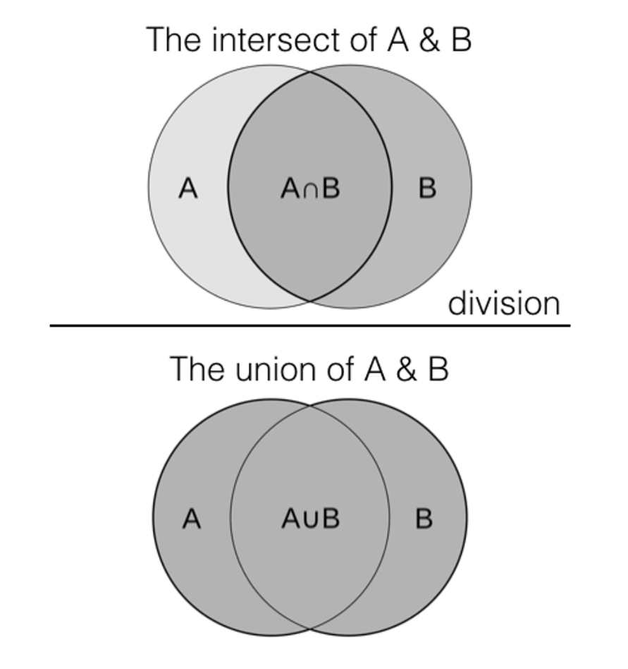

# Récupérer des enregistrements similaires avec des fonctions d’ordre supérieur

Utilisez les fonctions d’ordre supérieur de la Distiller de données pour résoudre divers cas d’utilisation courants. Pour identifier et récupérer des enregistrements similaires ou associés à partir d’un ou de plusieurs jeux de données, utilisez les fonctions de filtrage, de transformation et de réduction comme décrit dans ce guide. Pour découvrir comment des fonctions d&#39;ordre supérieur peuvent être utilisées pour traiter des types de données complexes, consultez la documentation sur la [gestion des types de données de tableau et de mappage](../sql/higher-order-functions.md).

Utilisez ce guide pour identifier les produits provenant de différents jeux de données dont les caractéristiques ou les attributs sont très similaires. Cette méthodologie fournit des solutions pour, entre autres, le dédoublonnage des données, la liaison des enregistrements, les systèmes de recommandation, la récupération des informations et l’analyse de texte.

Le document décrit le processus d’implémentation d’une jointure par similarité, qui utilise ensuite des fonctions d’ordre supérieur de la Distiller de données pour calculer la similarité entre les ensembles de données et les filtrer en fonction des attributs sélectionnés. Des fragments de code SQL et des explications sont fournis pour chaque étape du processus. Le workflow implémente des jointures par similarité à l’aide de la mesure de similarité Jaccard et de la segmentation en unités lexicales à l’aide de fonctions d’ordre supérieur Data Distiller. Ces méthodes sont ensuite utilisées pour identifier et récupérer des enregistrements similaires ou associés à partir d’un ou de plusieurs jeux de données en fonction d’une mesure de similarité. Les sections clés du processus incluent : [tokenisation à l’aide de fonctions d’ordre supérieur](#data-transformation), [jointure croisée d’éléments uniques](#cross-join-unique-elements), le [calcul de similarité Jaccard](#compute-the-jaccard-similarity-measure) et le [filtrage basé sur le seuil](#similarity-threshold-filter).

## Conditions préalables

Avant de poursuivre avec ce document, vous devez connaître les concepts suivants :

- Une **jointure par similarité** est une opération qui identifie et récupère des paires d&#39;enregistrements d&#39;une ou de plusieurs tables en fonction d&#39;une mesure de similarité entre les enregistrements. Les principales exigences d’une jointure par similarité sont les suivantes :
   - **Mesure de similarité** : une jointure de similarité repose sur une mesure ou une mesure de similarité prédéfinie. Ces mesures incluent : la similarité de Jaccard, la similarité de cosinus, la distance d’édition, etc. La mesure dépend de la nature des données et du cas d’utilisation. Cette mesure quantifie la similitude ou la dissimilitude de deux enregistrements.
   - **Seuil** : un seuil de similarité est utilisé pour déterminer à quel moment les deux enregistrements sont considérés comme suffisamment similaires pour être inclus dans le résultat de la jointure. Les enregistrements avec un score de similarité supérieur au seuil sont considérés comme des correspondances.
- L’index **similarité de Jaccard**, ou mesure de similarité de Jaccard, est une statistique utilisée pour évaluer la similarité et la diversité des ensembles d’échantillons. Il est défini comme la taille de l’intersection divisée par la taille de l’union des ensembles d’échantillons. La mesure de similarité de Jaccard va de zéro à un. Une similarité Jaccard égale à zéro indique qu’il n’y a aucune similarité entre les visionneuses, et une similarité Jaccard égale à un indique que les visionneuses sont identiques.
  
- **Les fonctions d’ordre supérieur** dans la Distiller de données sont des outils dynamiques intégrés qui traitent et transforment les données directement dans les instructions SQL. Ces fonctions polyvalentes éliminent la nécessité de plusieurs étapes dans la manipulation des données, en particulier lorsque [ traitez des types complexes tels que les tableaux et les mappages](../sql/higher-order-functions.md). En améliorant l’efficacité des requêtes et en simplifiant les transformations, les fonctions d’ordre supérieur contribuent à des analyses plus agiles et à une meilleure prise de décision dans divers scénarios commerciaux.

## Prise en main

Le SKU de Data Distiller est nécessaire pour exécuter les fonctions d’ordre supérieur sur vos données Adobe Experience Platform. Si vous ne disposez pas du SKU de Data Distiller, contactez votre représentant du service client Adobe pour plus d’informations.

## Établir la similarité {#establish-similarity}

Ce cas d’utilisation nécessite une mesure de similarité entre les chaînes de texte qui peut être utilisée ultérieurement pour établir un seuil de filtrage. Dans cet exemple, les produits des ensembles A et B représentent les mots de deux documents.

La mesure de similarité Jaccard peut être appliquée à un large éventail de types de données, y compris les données textuelles, les données catégorielles et les données binaires. Il convient également au traitement en temps réel ou par lots, car il peut s’avérer efficace sur le plan informatique pour calculer des jeux de données volumineux.

Les ensembles de produits A et B contiennent les données de test de ce workflow.

- Jeu de produits A : `{iPhone, iPad, iWatch, iPad Mini}`
- Ensemble de produits B : `{iPhone, iPad, Macbook Pro}`

Pour calculer la similarité Jaccard entre les ensembles de produits A et B, recherchez d’abord l’**intersection** (éléments communs) des ensembles de produits. Dans ce cas, `{iPhone, iPad}`. Recherchez ensuite l’**union** (tous les éléments uniques) des deux ensembles de produits. Dans cet exemple, `{iPhone, iPad, iWatch, iPad Mini, Macbook Pro}`.

Enfin, utilisez la formule de similarité de Jaccard : `J(A,B) = A∪B / A∩B` pour calculer la similarité.

J = distance de Jaccard
A = ensemble 1
B = ensemble 2

La similarité Jaccard entre les ensembles de produits A et B est de 0,4. Cela indique un degré modéré de similitude entre les mots utilisés dans les deux documents. Cette similarité entre les deux ensembles définit les colonnes dans la jointure par similarité. Ces colonnes représentent des informations, ou caractéristiques associées aux données, qui sont stockées dans une table et utilisées pour effectuer les calculs de similarité.

### Calcul Jaccard par paires avec similarité de chaîne {#pairwise-similarity}

Pour comparer plus précisément les similitudes entre les chaînes, la similarité par paires doit être calculée. La similarité par paires divise les objets de dimensions élevées en objets de dimensions plus petites pour la comparaison et l&#39;analyse. Pour ce faire, une chaîne de texte est divisée en parties ou unités plus petites (jetons). Il peut s’agir de lettres individuelles, de groupes de lettres (comme des syllabes) ou de mots entiers. La similarité est calculée pour chaque paire de jetons entre chaque élément de l’ensemble A et chaque élément de l’ensemble B. Cette segmentation en unités lexicales fournit une base pour les comparaisons analytiques et computationnelles, les relations et les informations à tirer des données.

Pour le calcul de similarité par paires, cet exemple utilise des bi-grammes de caractères (deux jetons de caractère) pour comparer une correspondance de similarité entre les chaînes de texte des produits dans l’ensemble A et l’ensemble B. Un bi-gramme est une séquence consécutive de deux éléments dans une séquence ou un texte donné. Vous pouvez généraliser cela à n grammes.

Cet exemple suppose que la casse n’a pas d’importance et que les espaces ne doivent pas être pris en compte. Selon ces critères, les ensembles A et B ont les bi-grammes suivants :

Ensemble de produits A bi-grammes :

- iPhone (5) : « ip », « ph », « ho », « on », « ne »
- iPad (3) : « ip », « pa », « ad »
- iWatch (5) : « iw », « wa », « at », « tc », « ch »
- iPad Mini (7) : « ip », « pa », « ad », « dm », « mi », « in », « ni »

Ensemble de produits B bi-grammes :

- iPhone (5) : « ip », « ph », « ho », « on », « ne »
- iPad (3) : « ip », « pa », « ad »
- Macbook Pro (9) : « Ma », « ac », « cb », « bo », « oo », « ok », « kp », « pr », « ro »

Calculez ensuite le coefficient de similarité de Jaccard pour chaque paire :

|                   | iPhone (Ensemble B) | iPad (Ensemble B) | Macbook Pro (Set B) |
|-------------------|----------------------------------------------|---------------------------------------------|-------------------------------------------|
| iPhone (Ensemble A) | (Intersection : 5, Union : 5) = 5 / 5 = 1 | (Intersection : 1, Union : 7) =1 / 7 ≈ 0,14 | (Intersection : 0, Union : 14) = 0 / 14 = 0 |
| iPad (Ensemble A) | (Intersection : 1, Union : 7) = 1 / 7 ≈ 0,14 | (Intersection : 3, Union : 3) = 3 / 3 = 1 | (Intersection : 0, Union : 12) = 0 / 12 = 0 |
| iWatch (Set A) | (Intersection : 0, Union : 8) = 0 / 8 = 0 | (Intersection : 0, Union : 8) = 0 / 8 = 0 | (Intersection : 0, Union : 8) = 0 / 8 =0 |
| iPad Mini (Set A) | (Intersection : 1, Union : 11) = 1 / 11 ≈ 0,09 | (Intersection : 3, Union : 7) = 3 / 7 ≈ 0,43 | (Intersection : 0, Union : 16) = 0 / 16 = 0 |

{style="table-layout:auto"}

## Créer les données de test avec SQL {#create-test-data}

Pour créer manuellement une table de test pour les ensembles de produits, utilisez l&#39;instruction SQL CREATE TABLE.

```SQL {line-numbers="true"}
CREATE TABLE featurevector1 AS SELECT *
FROM (
    SELECT 'iPad' AS ProductName
    UNION ALL
    SELECT 'iPhone'
    UNION ALL
    SELECT 'iWatch'
     UNION ALL
    SELECT 'iPad Mini'
);
SELECT * FROM featurevector1;
```

Les descriptions suivantes fournissent une répartition du bloc de code SQL ci-dessus :

- Ligne 1 : `CREATE TEMP TABLE featurevector1 AS` : cette instruction crée une table temporaire nommée `featurevector1`. Les tables temporaires ne sont généralement accessibles que pendant la session en cours et sont automatiquement ignorées à la fin de la session.
- Ligne 1 et 2 : `SELECT * FROM (...)` : cette partie du code est une sous-requête utilisée pour générer les données insérées dans la table `featurevector1`.
Dans la sous-requête, plusieurs instructions de `SELECT` sont combinées à l’aide de la commande `UNION ALL`. Chaque instruction `SELECT` génère une ligne de données avec les valeurs spécifiées pour la colonne `ProductName`.
- Ligne 3 : `SELECT 'iPad' AS ProductName` : génère une ligne avec la valeur `iPad` dans la colonne `ProductName`.
- Ligne 5 : `SELECT 'iPhone'` : génère une ligne avec la valeur `iPhone` dans la colonne `ProductName`.

L&#39;instruction SQL crée une table comme dans l&#39;exemple ci-dessous :

|   | `ProductName` |
|---|---------------|
| 1 | iPad |
| 2 | iPhone |
| 3 | iWatch |
| 4 | iPad Mini |

{style="table-layout:auto"}

Pour créer le deuxième vecteur de caractéristique, utilisez l&#39;instruction SQL suivante :

```SQL
CREATE TABLE featurevector2 AS SELECT *
FROM (
    SELECT 'iPad' AS ProductName
    UNION ALL
    SELECT 'iPhone'
    UNION ALL
    SELECT 'Macbook Pro'
);
SELECT * FROM featurevector2;
```

## Transformations de données {#data-transformation}

Dans cet exemple, plusieurs actions doivent être effectuées pour comparer précisément les visionneuses. Tout d&#39;abord, tous les espaces sont supprimés des vecteurs de caractéristiques car on suppose qu&#39;ils ne contribuent pas à la mesure de similarité. Ensuite, tous les doublons présents dans le vecteur de caractéristiques sont supprimés car ils gaspillent le traitement informatique. Ensuite, des jetons de deux caractères (bi-grammes) sont extraits des vecteurs de caractéristiques. Dans cet exemple, ils sont supposés se chevaucher.

>[!NOTE]
>
>À des fins d’illustration, les colonnes traitées sont ajoutées en regard du vecteur de caractéristique pour chacune des étapes.

Les sections suivantes illustrent les transformations de données préalables requises telles que la déduplication, la suppression des espaces et la conversion en minuscules avant de commencer le processus de segmentation en unités lexicales.

### Déduplication {#deduplication}

Ensuite, utilisez la clause `DISTINCT` pour supprimer les doublons. Il n’existe aucun doublon dans cet exemple, mais il s’agit d’une étape importante pour améliorer la précision de toute comparaison. Le code SQL nécessaire est affiché ci-dessous :

```SQL
SELECT DISTINCT(ProductName) AS featurevector1_distinct FROM featurevector1
SELECT DISTINCT(ProductName) AS featurevector2_distinct FROM featurevector2
```

### Suppression des espaces {#whitespace-removal}

Dans l’instruction SQL suivante, les espaces sont supprimés des vecteurs de caractéristiques. La partie `replace(ProductName, ' ', '') AS featurevector1_nospaces` de la requête récupère la colonne `ProductName` de la table `featurevector1` et utilise la fonction `replace()`. La fonction `REPLACE` remplace toutes les occurrences d&#39;un espace (&#39; &#39;) par une chaîne vide (&#39;&#39;). Cela supprime tous les espaces des valeurs `ProductName`. Le résultat est alias comme `featurevector1_nospaces`.

```SQL
SELECT DISTINCT(ProductName) AS featurevector1_distinct, replace(ProductName, ' ', '') AS featurevector1_nospaces FROM featurevector1
```

Les résultats sont présentés dans le tableau ci-dessous :

|   | featurevector1_distinct | featurevector1_nospaces |
|---|---|---|
| 1 | iPad Mini | iPadMini |
| 2 | iPad | iPad |
| 3 | iWatch | iWatch |
| 4 | iPhone | iPhone |

{style="table-layout:auto"}

L’instruction SQL et ses résultats sur le deuxième vecteur de caractéristique sont affichés ci-dessous :

+++Sélectionner pour développer

```SQL
SELECT DISTINCT(ProductName) AS featurevector2_distinct, replace(ProductName, ' ', '') AS featurevector2_nospaces FROM featurevector2
```

Les résultats se présentent comme suit :

|   | featurevector2_distinct | featurevector2_nospaces |
|---|---|---|
| 1 | iPad | iPad |
| 2 | Macbook Pro | MacbookPro |
| 3 | iPhone | iPhone |

{style="table-layout:auto"}

+++

### Convertit en minuscules {#lowercase-conversion}

Le code SQL est ensuite amélioré pour convertir les noms de produit en minuscules et supprimer les espaces. La fonction inférieure (`lower(...)`) est appliquée au résultat de la fonction `replace()`. La fonction lower convertit tous les caractères des valeurs `ProductName` modifiées en minuscules. Cela permet de s’assurer que les valeurs sont en minuscules, quelle que soit leur casse d’origine.

```SQL
SELECT DISTINCT(ProductName) AS featurevector1_distinct, lower(replace(ProductName, ' ', '')) AS featurevector1_transform FROM featurevector1;
```

Le résultat de cette instruction est le suivant :

|   | featurevector1_distinct | featurevector1_transform |
|---|---|---|
| 1 | iPad Mini | ipadmini |
| 2 | iPad | iPad |
| 3 | iWatch | iWatch |
| 4 | iPhone | iPhone |

{style="table-layout:auto"}

L’instruction SQL et ses résultats sur le deuxième vecteur de caractéristique sont affichés ci-dessous :

+++Sélectionner pour développer

```SQL
SELECT DISTINCT(ProductName) AS featurevector2_distinct, lower(replace(ProductName, ' ', '')) AS featurevector2_transform FROM featurevector2
```

Les résultats se présentent comme suit :

|   | featurevector2_distinct | featurevector2_transform |
|---|---|---|
| 1 | iPad | ipad |
| 2 | Macbook Pro | macbookpro |
| 3 | iPhone | iphone |

{style="table-layout:auto"}

+++

### Extraction de jetons à l’aide de SQL {#tokenization}

L’étape suivante consiste en une segmentation en unités lexicales, ou division du texte. La segmentation en unités lexicales est le processus consistant à prendre le texte et à le diviser en termes individuels. Généralement, cela implique de diviser les phrases en mots. Dans cet exemple, les chaînes sont divisées en deux grammes (et n grammes d’ordre supérieur) en extrayant des jetons à l’aide de fonctions SQL telles que `regexp_extract_all`. Des bi-grammes qui se chevauchent doivent être générés pour une segmentation en unités lexicales efficace.

Le SQL est encore amélioré pour utiliser `regexp_extract_all`. `regexp_extract_all(lower(replace(ProductName, ' ', '')), '.{2}', 0) AS tokens:` Cette partie de la requête traite en outre les valeurs de `ProductName` modifiées créées à l’étape précédente. Elle utilise la fonction `regexp_extract_all()` pour extraire toutes les sous-chaînes ne se chevauchant pas de un à deux caractères à partir des valeurs `ProductName` modifiées et minuscules. Le modèle d’expression régulière `.{2}` correspond à des sous-chaînes de deux caractères de longueur. La partie `regexp_extract_all(..., '.{2}', 0)` de la fonction extrait ensuite toutes les sous-chaînes correspondantes du texte d’entrée.

```SQL
SELECT DISTINCT(ProductName) AS featurevector1_distinct, lower(replace(ProductName, ' ', '')) AS featurevector1_transform, 
regexp_extract_all(lower(replace(ProductName, ' ', '')) , '.{2}', 0) AS tokens
FROM featurevector1;
```

Les résultats sont présentés dans le tableau ci-dessous :

+++Sélectionner pour développer

|   | featurevector1_distinct | featurevector1_transform | jetons |
|---|--------------------------|--------------|------------------------|
| 1 | iPad Mini | ipadmini | {« ip »,« ad »,« mi »,« ni »} |
| 2 | iPad | iPad | {« ip »,« ad »} |
| 3 | iWatch | iWatch | {« iw »,« at », « ch »} |
| 4 | iPhone | iPhone | {« ip »,« ho »,« ne »} |

{style="table-layout:auto"}

+++

Pour améliorer encore la précision, le code SQL doit être utilisé pour créer des jetons qui se chevauchent. Par exemple, la chaîne « iPad » ci-dessus ne contient pas de jeton « pa ». Pour corriger ce problème, décalez d’une étape l’opérateur d’anticipation (utilisant `substring`) et générez les deux grammes.

Comme à l’étape précédente, `regexp_extract_all(lower(replace(substring(ProductName, 2), ' ', '')), '.{2}', 0):` extrait des séquences de deux caractères à partir du nom de produit modifié, mais commence par le deuxième caractère à l’aide de la méthode `substring` pour créer des jetons qui se chevauchent. Ensuite, dans les lignes 3 à 7 (`array_union(...) AS tokens`), la fonction `array_union()` combine les tableaux de séquences à deux caractères obtenus par les deux extractions d&#39;expressions régulières. Cela garantit que le résultat contient des jetons uniques provenant de séquences qui ne se chevauchent pas et qui se chevauchent.

```SQL {line-numbers="true"}
SELECT DISTINCT(ProductName) AS featurevector1_distinct, 
       lower(replace(ProductName, ' ', '')) AS featurevector1_transform, 
       array_union(
           regexp_extract_all(lower(replace(ProductName, ' ', '')), '.{2}', 0),
           regexp_extract_all(lower(replace(substring(ProductName, 2), ' ', '')), '.{2}', 0)
       ) AS tokens
FROM featurevector1;
```

Les résultats sont présentés dans le tableau ci-dessous :

+++Sélectionner pour développer

|   | featurevector1_distinct | featurevector1_transform | jetons |
|---|--------------------------|--------------|------------------------|
| 1 | iPad Mini | ipadmini | {« ip »,« ad »,« mi »,« ni »,« pa »,« dm »,« in »} |
| 2 | iPad | iPad | {« ip »,« ad »,« pa »} |
| 3 | iWatch | iWatch | {« iw »,« at »,« ch »,« wa »,« tc »} |
| 4 | iPhone | iPhone | {« ip »,« ho »,« ne »,« ph »,« on »} |

{style="table-layout:auto"}

+++

Cependant, l&#39;utilisation de `substring` comme solution au problème présente des limites. Si vous deviez créer des jetons à partir du texte en fonction de trois grammes (trois caractères), il faudrait utiliser deux `substrings` pour regarder devant deux fois afin d’obtenir les décalages requis. Pour faire 10 grammes, il vous faudrait neuf expressions `substring`. Cela ferait gonfler le code et le rendrait intenable. L’utilisation d’expressions régulières simples ne convient pas. Une nouvelle approche est nécessaire.

### Ajuster en fonction de la longueur du nom du produit {#length-adjustment}

Le SQl peut être amélioré avec les fonctions de séquence et de longueur. Dans l’exemple suivant, `sequence(1, length(lower(replace(ProductName, ' ', ''))) - 3)` génère une séquence de nombres allant de un à la longueur du nom de produit modifié moins trois. Par exemple, si le nom du produit modifié est « ipadmini » avec une longueur de caractères de huit, il génère des nombres de un à cinq (huit-trois).

L’instruction ci-dessous extrait les noms de produits uniques, puis ventile chaque nom en séquences de caractères (jetons) de quatre longueurs de caractères, à l’exclusion des espaces, et les présente sous la forme de deux colonnes. Une colonne affiche les noms de produits uniques et l’autre colonne affiche leurs jetons générés.

```SQL
SELECT
   DISTINCT(ProductName) AS featurevector1_distinct,
  transform(
    sequence(1, length(lower(replace(ProductName, ' ', ''))) - 3),
    i -> substring(lower(replace(ProductName, ' ', '')), i, 4)
  ) AS tokens
FROM
  featurevector1;
```

Les résultats sont présentés dans le tableau ci-dessous :

+++Sélectionner pour développer

|   | featurevector1_distinct | jetons |
|---|--------------------------|------------------------|
| 1 | iPad Mini | {« ipad »,« padm »,« admin »,« admin »,« mini »} |
| 2 | iPad | {« ipad »} |
| 3 | iWatch | {« iwat »,« watch »,« atch »} |
| 4 | iPhone | {« ipho »,« phone »,« phone »} |

{style="table-layout:auto"}

+++

### Vérifier la longueur du jeton défini {#ensure-set-token-length}

Vous pouvez ajouter des conditions supplémentaires à l’instruction pour vous assurer que les séquences générées ont une longueur spécifique. L’instruction SQL suivante développe la logique de génération de jeton en rendant la fonction `transform` plus complexe. L’instruction utilise la fonction `filter` dans `transform` pour s’assurer que les séquences générées ont une longueur de six caractères. Il gère les cas où cela n’est pas possible en attribuant des valeurs NULL à ces positions.

```SQL
SELECT
  DISTINCT(ProductName) AS featurevector1_distinct,
  transform(
    filter(
      sequence(1, length(lower(replace(ProductName, ' ', ''))) - 5),
      i -> i + 5 <= length(lower(replace(ProductName, ' ', '')))
    ),
    i -> CASE WHEN length(substring(lower(replace(ProductName, ' ', '')), i, 6)) = 6
               THEN substring(lower(replace(ProductName, ' ', '')), i, 6)
               ELSE NULL
          END
  ) AS tokens
FROM
  featurevector1;
```

Les résultats sont présentés dans le tableau ci-dessous :

+++Sélectionner pour développer

|   | featurevector1_distinct | jetons |
|---|--------------------------|------------------------|
| 1 | iPad Mini | {« ipadmin »,« padmin »,« admin »} |
| 2 | iPad | {null} |
| 3 | iWatch | {« iwatch »} |
| 4 | iPhone | {« iphone »} |

{style="table-layout:auto"}

+++

## Explorer des solutions à l’aide des fonctions d’ordre supérieur de Data Distiller {#higher-order-function-solutions}

Les fonctions d’ordre supérieur sont des éléments puissants qui vous permettent d’implémenter une « programmation » telle que la syntaxe dans la Distiller de données. Ils peuvent être utilisés pour itérer une fonction sur plusieurs valeurs dans un tableau.

Dans le cadre de Data Distiller, les fonctions d’ordre supérieur sont idéales pour créer n grammes et pour itérer sur des séquences de caractères.

La fonction `reduce`, en particulier lorsqu’elle est utilisée dans des séquences générées par `transform`, permet d’obtenir des valeurs cumulées ou des agrégats qui peuvent jouer un rôle essentiel dans divers processus d’analyse et de planification.

Par exemple, dans l’instruction SQl ci-dessous, la fonction `reduce()` agrège les éléments d’un tableau à l’aide d’un agrégateur personnalisé. Il simule une boucle for pour **créer les sommes cumulées de tous les entiers** de un à cinq. `1, 1+2, 1+2+3, 1+2+3+4, 1+2+3+4`.

```SQL {line-numbers="true"}
SELECT transform(
    sequence(1, 5), 
    x -> reduce(
        sequence(1, x),  
        0,  -- Initial accumulator value
        (acc, y) -> acc + y  -- Higher-order function to add numbers
    )
) AS sum_result;
```

Voici une analyse de l&#39;instruction SQL :

- Ligne 1 : `transform` applique la fonction `x -> reduce` sur chaque élément généré dans la séquence.
- Ligne 2 : `sequence(1, 5)` génère une séquence de numéros de un à cinq.
- Ligne 3: `x -> reduce(sequence(1, x), 0, (acc, y) -> acc + y)` effectue une réduction pour chaque élément x de la séquence (de 1 à 5).
   - La fonction `reduce` prend une valeur d&#39;accumulateur initiale de 0, une séquence de un à la valeur actuelle de `x`, et une fonction d&#39;ordre supérieur `(acc, y) -> acc + y` d&#39;ajouter les nombres.
   - La fonction d&#39;ordre supérieur accumule `acc + y` la somme en ajoutant la valeur actuelle `y` à la `acc` d&#39;accumulation.
- Ligne 8 : `AS sum_result` renomme la colonne résultante en sum_result.

En résumé, cette fonction d&#39;ordre supérieur prend deux paramètres (`acc` et `y`) et définit l&#39;opération à effectuer, ce qui dans ce cas ajoute du `y` au `acc` d&#39;accumulateur. Cette fonction d’ordre supérieur est exécutée pour chaque élément de la séquence pendant le processus de réduction.

La sortie de cette instruction est une colonne unique (`sum_result`) qui contient les sommes cumulées de nombres de un à cinq.

### Valeur des fonctions d’ordre supérieur {#value-of-higher-order-functions}

Cette section analyse une version allégée d’une instruction SQL de trois grammes afin de mieux comprendre l’intérêt des fonctions d’ordre supérieur dans le Distiller de données pour créer n grammes plus efficacement.

L’instruction ci-dessous fonctionne sur la colonne `ProductName` du tableau `featurevector1`. Il produit un ensemble de sous-chaînes à trois caractères dérivées des noms de produits modifiés dans le tableau, à l’aide des positions obtenues à partir de la séquence générée.

```SQL {line-numbers="true"}
SELECT
  transform(
    sequence(1, length(lower(replace(ProductName, ' ', ''))) - 2),
    i -> substring(lower(replace(ProductName, ' ', '')), i, 3)
  ) 
FROM
  featurevector1
```

Voici une analyse de l&#39;instruction SQL :

- Ligne 2 : `transform` applique une fonction d’ordre supérieur à chaque entier de la séquence.
- Ligne 3 : `sequence(1, length(lower(replace(ProductName, ' ', ''))) - 2)` génère une séquence d’entiers comprise entre `1` et la longueur du nom de produit modifié moins deux.
   - `length(lower(replace(ProductName, ' ', '')))` calcule la longueur du `ProductName` après l&#39;avoir mis en minuscules et avoir supprimé les espaces.
   - `- 2` soustrait deux de la longueur pour s’assurer que la séquence génère des positions de départ valides pour les sous-chaînes de 3 caractères. Le fait de soustraire 2 garantit que vous disposez de suffisamment de caractères après chaque position de départ pour extraire une sous-chaîne de 3 caractères. La fonction de sous-chaîne fonctionne ici comme un opérateur Lookahead.
- Ligne 4 : `i -> substring(lower(replace(ProductName, ' ', '')), i, 3)` est une fonction d’ordre supérieur qui fonctionne sur chaque `i` entier de la séquence générée.
   - La fonction `substring(...)` extrait une sous-chaîne de 3 caractères de la colonne `ProductName`.
   - Avant d’extraire la sous-chaîne, `lower(replace(ProductName, ' ', ''))` convertit les `ProductName` en minuscules et supprime les espaces pour garantir la cohérence.

La sortie est une liste de sous-chaînes de trois caractères de longueur, extraites des noms de produits modifiés, en fonction des positions spécifiées dans la séquence.

## Filtrer les résultats {#filter-results}

La fonction `filter`, avec les transformations de données [ suivantes](#data-transformation), permet une extraction plus affinée et plus précise des informations pertinentes des données de texte. Vous pouvez ainsi obtenir des informations, améliorer la qualité des données et faciliter de meilleurs processus de prise de décision.

La fonction `filter` de l’instruction SQL suivante permet d’affiner et de limiter la séquence de positions dans la chaîne à partir de laquelle les sous-chaînes sont extraites à l’aide de la fonction de transformation suivante.

```SQL
SELECT
  transform(
    filter(
      sequence(1, length(lower(replace(ProductName, ' ', ''))) - 6),
      i -> i + 6 <= length(lower(replace(ProductName, ' ', '')))
    ),
    i -> CASE WHEN length(substring(lower(replace(ProductName, ' ', '')), i, 7)) = 7
               THEN substring(lower(replace(ProductName, ' ', '')), i, 7)
               ELSE NULL
          END
  )
FROM
  featurevector1;
```

La fonction `filter` génère une séquence de positions de départ valides dans la `ProductName` modifiée et extrait les sous-chaînes d&#39;une longueur spécifique. Seules les positions de départ qui permettent l’extraction d’une sous-chaîne de sept caractères sont autorisées.

La condition `i -> i + 6 <= length(lower(replace(ProductName, ' ', '')))` assure que la position de départ `i` plus `6` (la longueur de la sous-chaîne de sept caractères souhaitée moins un) ne dépasse pas la longueur du `ProductName` modifié.

L’instruction `CASE` est utilisée pour inclure ou exclure de manière conditionnelle des sous-chaînes en fonction de leur longueur. Seules les sous-chaînes de sept caractères sont incluses ; les autres sont remplacées par NULL. Ces sous-chaînes sont ensuite utilisées par la fonction `transform` pour créer une séquence de sous-chaînes à partir de la colonne `ProductName` dans le tableau `featurevector1`.

>[!TIP]
>
>Vous pouvez utiliser la fonction [modèles paramétrés](../ui/parameterized-queries.md) pour réutiliser et abstraire la logique dans vos requêtes. Par exemple, lorsque vous créez des fonctions utilitaires d’usage général (comme celle affichée ci-dessus pour la segmentation en unités lexicales de chaînes), vous pouvez utiliser des modèles paramétrés de Distiller de données dans lesquels le nombre de caractères serait un paramètre.

## Calculer la jointure croisée d&#39;éléments uniques sur deux vecteurs de fonction {#cross-join-unique-elements}

L’identification des différences ou des incohérences entre les deux jeux de données en fonction d’une transformation spécifique des données est un processus courant pour maintenir la précision des données, améliorer la qualité des données et assurer la cohérence entre les jeux de données.

L’instruction SQL ci-dessous extrait les noms de produits uniques présents dans `featurevector2` mais pas dans `featurevector1` après l’application des transformations.

```SQL
SELECT lower(replace(ProductName, ' ', '')) FROM featurevector2
EXCEPT
SELECT lower(replace(ProductName, ' ', '')) FROM featurevector1;
```

>[!TIP]
>
>En plus de `EXCEPT`, vous pouvez également utiliser `UNION` et `INTERSECT` selon votre cas d’utilisation. Vous pouvez également tester les clauses `ALL` ou `DISTINCT` pour voir la différence entre inclure toutes les valeurs et renvoyer uniquement les valeurs uniques des colonnes spécifiées.

Les résultats sont présentés dans le tableau ci-dessous :

+++Sélectionner pour développer

|   | lower(replace(ProductName, &#39; &#39;, &#39;&#39;)) |
|---|---------------------------------------|
| 1 | macbookpro |

{style="table-layout:auto"}

+++

Ensuite, effectuez une jointure croisée pour combiner des éléments des deux vecteurs de fonction afin de créer des paires d&#39;éléments à comparer. La première étape de ce processus consiste à créer un vecteur segmenté en unités lexicales.

Un vecteur segmenté en unités lexicales est une représentation structurée de données textuelles où chaque mot, expression ou unité de signification (jeton) est converti en format numérique. Cette conversion permet aux algorithmes de traitement du langage naturel de comprendre et d’analyser les informations textuelles.

Le SQl ci-dessous crée un vecteur segmenté en unités lexicales.

```SQL
CREATE TABLE featurevector1tokenized AS SELECT
  DISTINCT(ProductName) AS featurevector1_distinct,
  transform(
    filter(
      sequence(1, length(lower(replace(ProductName, ' ', ''))) - 1),
      i -> i + 1 <= length(lower(replace(ProductName, ' ', '')))
    ),
    i -> CASE WHEN length(substring(lower(replace(ProductName, ' ', '')), i, 2)) = 2
               THEN substring(lower(replace(ProductName, ' ', '')), i, 2)
               ELSE NULL
          END
  ) AS tokens
FROM
  (SELECT lower(replace(ProductName, ' ', '')) AS ProductName FROM featurevector1);
SELECT * FROM featurevector1tokenized;
```

>[!NOTE]
>
>Si vous utilisez [!DNL DbVisualizer], après avoir créé ou supprimé une table, actualisez la connexion à la base de données afin d&#39;actualiser le cache de métadonnées de la table. Data Distiller ne publie pas les mises à jour de métadonnées.

Les résultats sont présentés dans le tableau ci-dessous :

+++Sélectionner pour développer

|   | featurevector1_distinct | jetons |
|---|--------------------------|------------------------|
| 1 | ipadmini | {« ip »,« pa »,« ad »,« dm »,« mi »,« in »,« ni »} |
| 2 | ipad | {« ip »,« pa »,« ad »} |
| 3 | iwatch | {« iw »,« wa »,« at »,« tc »,« ch »} |
| 4 | iphone | {« ip »,« ph »,« ho »,« on »,« ne »} |

{style="table-layout:auto"}

+++

Répétez ensuite le processus pour `featurevector2` :

```SQL
CREATE TABLE featurevector2tokenized AS 
SELECT
  DISTINCT(ProductName) AS featurevector2_distinct,
  transform(
    filter(
      sequence(1, length(lower(replace(ProductName, ' ', ''))) - 1),
      i -> i + 1 <= length(lower(replace(ProductName, ' ', '')))
    ),
    i -> CASE WHEN length(substring(lower(replace(ProductName, ' ', '')), i, 2)) = 2
               THEN substring(lower(replace(ProductName, ' ', '')), i, 2)
               ELSE NULL
          END
  ) AS tokens
FROM
(SELECT lower(replace(ProductName, ' ', '')) AS ProductName FROM featurevector2
);
SELECT * FROM featurevector2tokenized;
```

Les résultats sont présentés dans le tableau ci-dessous :

+++Sélectionner pour développer

|   | featurevector2_distinct | jetons |
|---|--------------------------|------------------------|
| 1 | ipadmini | {« ip »,« pa »,« ad »} |
| 2 | macbookpro | {« ma »,« ac »,« cb »,« bo »,« oo »,« ok »,« kp »,« pr »,« ro »} |
| 3 | iphone | {« ip »,« ph »,« ho »,« on »,« ne »} |

{style="table-layout:auto"}

+++

Une fois les deux vecteurs segmentés terminés, vous pouvez créer la jointure croisée. Cela est visible dans le code SQL ci-dessous :

```SQL {line-numbers="true"}
SELECT
    A.featurevector1_distinct AS SetA_ProductNames,
    B.featurevector2_distinct AS SetB_ProductNames,
    A.tokens AS SetA_tokens1,
    B.tokens AS SetB_tokens2
FROM
    featurevector1tokenized A
CROSS JOIN
    featurevector2tokenized B;
```

Voici un résumé du langage SQL utilisé pour créer la jointure croisée :

- Ligne 2 : `A.featurevector1_distinct AS SetA_ProductNames` sélectionne la colonne `featurevector1_distinct` dans la table `A` et lui affecte un `SetA_ProductNames` d&#39;alias. Cette section de SQL génère une liste de noms de produits distincts à partir du premier jeu de données.
- Ligne 4 : `A.tokens AS SetA_tokens1` sélectionne la colonne `tokens` dans le `A` de la table ou de la sous-requête et lui affecte un `SetA_tokens1` d&#39;alias. Cette section de SQL génère une liste de valeurs segmentées en unités lexicales associées aux noms de produits du premier jeu de données.
- Ligne 8 : l’opération `CROSS JOIN` combine toutes les combinaisons possibles de lignes des deux jeux de données. En d&#39;autres termes, il associe chaque nom de produit et ses jetons associés de la première table (`A`) à chaque nom de produit et ses jetons associés de la seconde table (`B`). Cela génère un produit cartésien des deux jeux de données, où chaque ligne de la sortie représente une combinaison d’un nom de produit et de ses jetons associés des deux jeux de données.

Les résultats sont présentés dans le tableau ci-dessous :

+++Sélectionner pour développer

| * | SetA_ProductNames | SetB_ProductNames | SetA_tokens 1 | SetB_tokens 2 |
|---|---------------------|-------------------|---|---|
| 1 | ipadmini | ipad | {« ip »,« pa »,« ad »,« dm »,« mi »,« in »,« ni »} | {« ip »,« pa »,« ad »} |
| 2 | ipadmini | macbookpro | {« ip »,« pa »,« ad »,« dm »,« mi »,« in »,« ni »} | {« ma »,« ac »,« cb »,« bo »,« oo »,« ok »,« kp »,« pr »,« ro »} |
| 3 | ipadmini | iphone | {« ip »,« pa »,« ad »,« dm »,« mi »,« in »,« ni »} | {« ip »,« ph »,« ho »,« on »,« ne »} |
| 4 | ipad | ipad | {« ip »,« pa »,« ad »} | {« ip »,« pa »,« ad »} |
| 5 | ipad | macbookpro | {« ip »,« pa »,« ad »} | {« ma »,« ac »,« cb »,« bo »,« oo »,« ok »,« kp »,« pr »,« ro »} |
| 6 | ipad | iphone | {« ip »,« pa »,« ad »} | {« ip »,« ph »,« ho »,« on »,« ne »} |
| 7 | iwatch | ipad | {« iw »,« wa »,« at »,« tc »,« ch »} | {« ip »,« pa »,« ad »} |
| 8 | iwatch | macbookpro | {« iw »,« wa »,« at »,« tc »,« ch »} | {« ma »,« ac »,« cb »,« bo »,« oo »,« ok »,« kp »,« pr »,« ro »} |
| 9 | iwatch | iphone | {« iw »,« wa »,« at »,« tc »,« ch »} | {« ip »,« ph »,« ho »,« on »,« ne »} |
| 10 | iphone | ipad | {« ip »,« ph »,« ho »,« on »,« ne »} | {« ip »,« pa »,« ad »} |
| 11 | iphone | macbookpro | {« ip »,« ph »,« ho »,« on »,« ne »} | {« ma »,« ac »,« cb »,« bo »,« oo »,« ok »,« kp »,« pr »,« ro »} |
| 12 | iphone | iphone | {« ip »,« ph »,« ho »,« on »,« ne »} | {« ip »,« ph »,« ho »,« on »,« ne »} |

{style="table-layout:auto"}

+++

## Calculer la mesure de similarité de Jaccard {#compute-the-jaccard-similarity-measure}

Ensuite, calculez à l’aide du coefficient de similarité Jaccard pour effectuer une analyse de similarité entre les deux ensembles de noms de produits en comparant leurs représentations segmentées en unités lexicales. La sortie du script SQL ci-dessous fournit les éléments suivants : les noms de produits des deux jeux, leurs représentations segmentées en unités lexicales, le nombre de jetons uniques communs et totaux et le coefficient de similarité Jaccard calculé pour chaque paire de jeux de données.


```SQL {line-numbers="true"}
SELECT 
    SetA_ProductNames, 
    SetB_ProductNames, 
    SetA_tokens1,
    SetB_tokens2,
    size(array_intersect(SetA_tokens1, SetB_tokens2)) AS token_intersect_count,
    size(array_union(SetA_tokens1, SetB_tokens2)) AS token_union_count,
    ROUND(
        CAST(size(array_intersect(SetA_tokens1, SetB_tokens2)) AS DOUBLE) /    size(array_union(SetA_tokens1, SetB_tokens2)), 2) AS jaccard_similarity
FROM
    (SELECT
        A.featurevector1_distinct AS SetA_ProductNames,
        B.featurevector2_distinct AS SetB_ProductNames,
        A.tokens AS SetA_tokens1,
        B.tokens AS SetB_tokens2
    FROM
        featurevector1tokenized A
    CROSS JOIN
        featurevector2tokenized B
    );
```

Voici un résumé du langage SQL utilisé pour calculer le coefficient de similarité de Jaccard :

- Ligne 6 : `size(array_intersect(SetA_tokens1, SetB_tokens2)) AS token_intersect_count` calcule le nombre de jetons communs aux `SetA_tokens1` et aux `SetB_tokens2`. Ce calcul est réalisé en calculant la taille de l’intersection des deux tableaux de jetons.
- Ligne 7 : `size(array_union(SetA_tokens1, SetB_tokens2)) AS token_union_count` calcule le nombre total de jetons uniques pour les `SetA_tokens1` et les `SetB_tokens2`. Cette ligne calcule la taille de l’union des deux tableaux de jetons.
- Ligne 8-10 : `ROUND(CAST(size(array_intersect(SetA_tokens1, SetB_tokens2)) AS DOUBLE) / size(array_union(SetA_tokens1, SetB_tokens2)), 2) AS jaccard_similarity` calcule la similarité Jaccard entre les jeux de jetons. Ces lignes divisent la taille de l’intersection du jeton par la taille de l’union du jeton et arrondissent le résultat à deux décimales. Le résultat est une valeur comprise entre zéro et un, où un indique une similarité complète.

Les résultats sont présentés dans le tableau ci-dessous :

+++Sélectionner pour développer

| * | SetA_ProductNames | SetB_ProductNames | SetA_tokens 1 | SetB_tokens 2 | token_intersect_count | token_intersect_count | Similarité Jaccard |
|---|---------------------|-------------------|---------------------------------------|-------------------------------------------------|----|----|----|
| 1 | ipadmini | ipad | {« ip »,« pa »,« ad »,« dm »,« mi »,« in »,« ni »} | {« ip »,« pa »,« ad »} | 3 | 7 | 0,43 |
| 2 | ipadmini | macbookpro | {« ip »,« pa »,« ad »,« dm »,« mi »,« in »,« ni »} | {« ma »,« ac »,« cb »,« bo »,« oo »,« ok »,« kp »,« pr »,« ro »} | 0 | 16 | 0,0 |
| 3 | ipadmini | iphone | {« ip »,« pa »,« ad »,« dm »,« mi »,« in »,« ni »} | {« ip »,« ph »,« ho »,« on »,« ne »} | 1 | 11 | 0,09 |
| 4 | ipad | ipad | {« ip »,« pa »,« ad »} | {« ip »,« pa »,« ad »} | 3 | 3 | 1.0 |
| 5 | ipad | macbookpro | {« ip »,« pa »,« ad »} | {« ma »,« ac »,« cb »,« bo »,« oo »,« ok »,« kp »,« pr »,« ro »} | 0 | 12 | 0,0 |
| 6 | ipad | iphone | {« ip »,« pa »,« ad »} | {« ip »,« ph »,« ho »,« on »,« ne »} | 1 | 7 | 0,14 |
| 7 | iwatch | ipad | {« iw »,« wa »,« at »,« tc »,« ch »} | {« ip »,« pa »,« ad »} | 0 | 8 | 0,0 |
| 8 | iwatch | macbookpro | {« iw »,« wa »,« at »,« tc »,« ch »} | {« ma »,« ac »,« cb »,« bo »,« oo »,« ok »,« kp »,« pr »,« ro »} | 0 | 14 | 0,0 |
| 9 | iwatch | iphone | {« iw »,« wa »,« at »,« tc »,« ch »} | {« ip »,« ph »,« ho »,« on »,« ne »} | 0 | 10 | 0,0 |
| 10 | iphone | ipad | {« ip »,« ph »,« ho »,« on »,« ne »} | {« ip »,« pa »,« ad »} | 1 | 7 | 0,14 |
| 11 | iphone | macbookpro | {« ip »,« ph »,« ho »,« on »,« ne »} | {« ma »,« ac »,« cb »,« bo »,« oo »,« ok »,« kp »,« pr »,« ro »} | 0 | 14 | 0,0 |
| 12 | iphone | iphone | {« ip »,« ph »,« ho »,« on »,« ne »} | {« ip »,« ph »,« ho »,« on »,« ne »} | 5 | 5 | 1.0 |

{style="table-layout:auto"}

+++

## Filtrer les résultats en fonction du seuil de similarité Jaccard {#similarity-threshold-filter}

Enfin, filtrez les résultats en fonction d’un seuil prédéfini afin de ne sélectionner que les paires répondant aux critères de similarité. L’instruction SQL ci-dessous filtre les produits avec un coefficient de similarité Jaccard d’au moins 0,4. Ceci réduit les résultats à des paires qui présentent un degré de similarité important.

```SQL
SELECT 
    SetA_ProductNames, 
    SetB_ProductNames
FROM 
(SELECT 
    SetA_ProductNames, 
    SetB_ProductNames, 
    SetA_tokens1,
    SetB_tokens2,
    size(array_intersect(SetA_tokens1, SetB_tokens2)) AS token_intersect_count,
    size(array_union(SetA_tokens1, SetB_tokens2)) AS token_union_count,
    ROUND(
        CAST(size(array_intersect(SetA_tokens1, SetB_tokens2)) AS DOUBLE) / size(array_union(SetA_tokens1, SetB_tokens2)),
        2
    ) AS jaccard_similarity
FROM
    (SELECT
        A.featurevector1_distinct AS SetA_ProductNames,
        B.featurevector2_distinct AS SetB_ProductNames,
        A.tokens AS SetA_tokens1,
        B.tokens AS SetB_tokens2
    FROM
        featurevector1tokenized A
    CROSS JOIN
        featurevector2tokenized B
    )
)
WHERE jaccard_similarity>=0.4
```

Les résultats de cette requête donnent les colonnes de la jointure par similarité, comme illustré ci-dessous :

+++ Sélectionner pour développer

|   | SetA_ProductNames | SetA_ProductNames |
|---|--------------------------|------------------------|
| 1 | ipadmini | ipad |
| 2 | ipad | ipad |
| 3 | iphone | iphone |

{style="table-layout:auto"}

+++

### Étapes suivantes {#next-steps}

En lisant ce document, vous pouvez maintenant utiliser cette logique pour mettre en évidence des relations significatives ou des chevauchements entre des jeux de données disparates. La possibilité d’identifier des produits provenant de différents jeux de données dont les caractéristiques ou les attributs sont très similaires trouve de nombreuses applications concrètes. Cette logique peut être utilisée dans des scénarios tels que :

- Correspondance de produits : pour regrouper ou recommander des produits similaires aux clients.
- Nettoyage des données : pour améliorer la qualité des données.
- Analyse du panier de consommation : fournir des renseignements sur le comportement, les préférences et les possibilités de vente croisée des clients.

Si vous ne l’avez pas déjà fait, nous vous recommandons de lire la présentation du pipeline de fonctionnalités [AI/ML](../data-distiller/ml-feature-pipelines/overview.md). Utilisez cette présentation pour découvrir comment Data Distiller et votre machine learning préféré peuvent créer des modèles de données personnalisés qui prennent en charge vos cas d’utilisation marketing avec les données Experience Platform.
