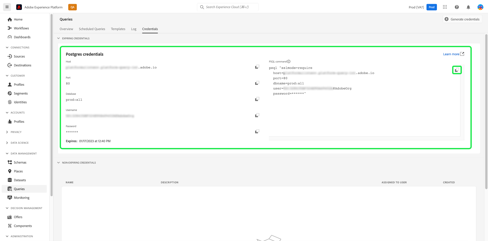

# Gestion des données Experience Platform à l’aide de [!DNL Python] et de [!DNL SQLAlchemy]

Découvrez comment utiliser SQLAlchemy pour une plus grande flexibilité dans la gestion de vos données Adobe Experience Platform. Pour ceux qui ne sont pas aussi familiers avec SQL, SQLAlchemy peut grandement améliorer le temps de développement en travaillant avec des bases de données relationnelles. Ce document fournit des instructions et des exemples pour connecter [!DNL SQLAlchemy] à Query Service et commencer à utiliser Python pour interagir avec vos bases de données.

[!DNL SQLAlchemy] est un mappeur relationnel d&#39;objets (ORM) et une bibliothèque de code [!DNL Python] qui peut transférer des données stockées dans une base de données SQL vers des objets [!DNL Python]. Vous pouvez ensuite effectuer des opérations CRUD sur les données contenues dans le lac de données d’Experience Platform à l’aide du code [!DNL Python]. Cela supprime la nécessité de gérer les données à l’aide de PSQL uniquement.

## Prise en main

Pour acquérir les informations d’identification nécessaires à la connexion de [!DNL SQLAlchemy] à Experience Platform, vous devez avoir accès à l’espace de travail Requêtes dans l’interface utilisateur d’Experience Platform. Contactez l’administrateur ou administratrice de votre organisation si vous n’avez pas actuellement accès à l’espace de travail Requêtes.

## [!DNL Query Service] des informations d’identification {#credentials}

Pour trouver vos informations d’identification, connectez-vous à l’interface utilisateur d’Experience Platform et sélectionnez **[!UICONTROL Requêtes]** dans le volet de navigation de gauche, suivi de **[!UICONTROL Informations d’identification]**. Pour obtenir des instructions complètes sur la façon de trouver vos informations d’identification, veuillez lire le [&#x200B; guide des informations d’identification &#x200B;](../ui/credentials.md).



Bien que le port 80 soit le port recommandé pour une connexion à Query Service, vous pouvez également utiliser le port 5432.

>[!IMPORTANT]
>
>Si vous utilisez des informations d’identification arrivant à expiration (comme illustré dans l’image ci-dessus) pour vous connecter à Query Service, la durée de vie de session de votre connexion expirera après la période définie définie dans les paramètres de votre organisation. Par défaut, cette période est de 24 heures. Consultez la documentation pour savoir comment [connecter un client avec des informations d’identification non expirantes](../ui/credentials.md#non-expiring-credentials) ou [modifier la durée de vie de session de vos informations d’identification arrivant à expiration](../ui/credentials.md#expiring-credentials).

Une fois que vous avez accès à vos informations d’identification QS, ouvrez l’éditeur de [!DNL Python] de votre choix.

### Stocker les informations d’identification dans [!DNL Python] {#store-credentials}

Dans l’éditeur de [!DNL Python], importez la bibliothèque `urllib.parse.quote` et enregistrez chaque variable d’identification en tant que paramètre. Le module `urllib.parse` fournit une interface standard pour diviser les chaînes URL en composants. La fonction quote remplace les caractères spéciaux dans la chaîne URL afin de rendre les données plus sûres pour une utilisation en tant que composants URL. Vous trouverez ci-dessous un exemple du code requis :

>[!TIP]
>
>Utilisez les guillemets [!DNL Python] pour saisir votre chaîne de mot de passe à plusieurs lignes.

```python
from urllib.parse import quote

host = "<YOUR_HOST>"

port = "<YOUR_PORT>"

dbname = "<YOUR_DATABASE>"

user = "<YOUR_USERNAME>"

password = quote('''
<YOUR_PASSWORD>
''')
```

>[!NOTE]
>
>Le mot de passe que vous fournissez pour se connecter [!DNL SQLAlchemy] à Experience Platform expirera si vous utilisez des informations d’identification arrivant à expiration. Voir la [section Informations d’identification](#credentials) pour plus d’informations.

### Créer une instance de moteur []

Une fois les variables créées, importez la fonction `create_engine` et créez une chaîne pour compiler et formater vos informations d’identification Query Service dans SQLAlchemy. La fonction `create_engine` est ensuite utilisée pour construire une instance de moteur.

>[!NOTE]
>
>`create_engine`renvoie une instance d’un moteur. Toutefois, il n’ouvre la connexion à Query Service que lorsqu’une requête nécessitant une connexion est appelée.

SSL doit être activé lors de l’accès à Experience Platform à l’aide de clients tiers. Dans le cadre de votre moteur, utilisez l’`connect_args` pour saisir des arguments de mot-clé supplémentaires. Il est recommandé de définir le mode SSL sur `require`. Consultez la [documentation sur les modes SSL](../clients/ssl-modes.md) pour plus d’informations sur les valeurs acceptées.

L’exemple ci-dessous affiche le code [!DNL Python] nécessaire à l’initialisation d’un moteur et d’une chaîne de connexion.

```python
from sqlalchemy import create_engine

db_string = "postgresql://{user}:{password}@{host}:{port}/{dbname}".format(
    user=user,
    password=password,
    host=host,
    port = port,
    dbname = dbname
)

engine = create_engine(db_string, connect_args={'sslmode':'require'})
```

>[!NOTE]
>
>Le mot de passe que vous fournissez pour se connecter [!DNL SQLAlchemy] à Experience Platform expirera si vous utilisez des informations d’identification arrivant à expiration. Voir la [section Informations d’identification](#credentials) pour plus d’informations.

Vous êtes maintenant prêt à interroger les données d’Experience Platform à l’aide de [!DNL Python]. L’exemple illustré ci-dessous renvoie un tableau de noms de table Query Service.

```python
from sqlalchemy import inspect
insp = inspect(engine)
print(insp.get_table_names())
```
