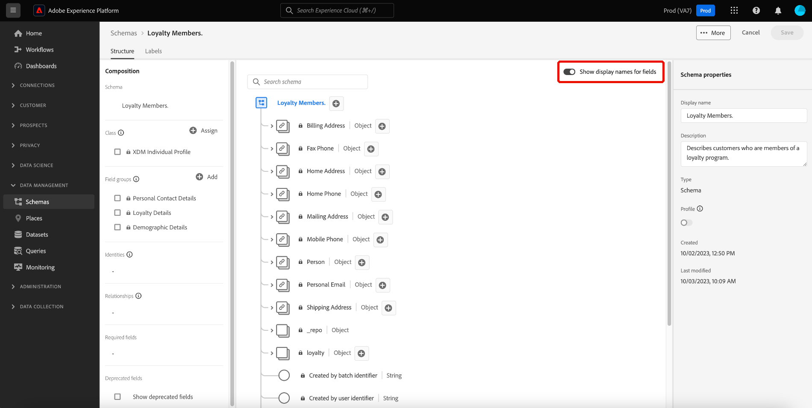

# Notes de mise à jour d’Adobe Experience Platform

>[!IMPORTANT]
>
>Depuis le 15 mai 2023, le statut `Existing` est supprimé du mappage de l’appartenance à un segment, afin de supprimer la redondance dans le cycle de vie de cette dernière. Depuis ce changement, les profils qualifiés dans un segment sont représentés comme `Realized` et les profils disqualifiés continuent à être représentés comme `Exited`. Pour plus d’informations sur cette modification, veuillez lire la [Section Segmentation Service](#segmentation).

**Date de publication : 26 avril 2023**

Mises à jour des fonctionnalités existantes dans Adobe Experience Platform :

- [Tableaux de bord](#dashboards)
- [Préparation des données](#data-prep)
- [Collecte de données](#data-collection)
- [Destinations](#destinations)
- [Modèle de données d’expérience](#xdm)
- [Real-Time Customer Data Platform](#rtcdp)
- [Profil client en temps réel](#profile)
- [Service de segmentation](#segmentation)
- [Sources](#sources)

## Tableaux de bord {#dashboards}

Adobe Experience Platform fournit de nombreux tableaux de bord grâce auxquels vous pouvez afficher des informations importantes sur les données de votre organisation, telles quʼelles sont capturées lors dʼinstantanés quotidiens.

**Fonctionnalités nouvelles ou mises à jour** {#dashboards-new-updated-features}

| Fonctionnalité | Description |
| --- | --- |
| Tableaux de bord définis par l’utilisateur ou l’utilisatrice | Vous pouvez désormais **filtrer les données historiques** à partir de vos informations sur les widgets et utiliser des données récentes ou une période d’analyse personnalisée. Pour plus d’informations, consultez le [guide des tableaux de bord définis par l’utilisateur](../../dashboards/standard-dashboards.md#filter-historical-data). Vous pouvez également **dupliquer vos widgets existants**. En personnalisant un doublon et en modifiant ses attributs, vous pouvez éviter de redémarrer de zéro lors de la création d’un widget unique. Lisez le [guide de duplication des widgets](../../dashboards/standard-dashboards.md#duplicate-a-widget) pour en savoir plus. |

{style="table-layout:auto"}

Pour plus dʼinformations sur les tableaux de bord, notamment sur la manière dʼoctroyer des autorisations dʼaccès et de créer des widgets personnalisés, commencez par lire la [Présentation des tableaux de bord](../../dashboards/home.md).

## Préparation des données {#data-prep}

La préparation des données permet aux personnes travaillant dans l’ingénierie de données de mapper, de transformer et de valider les données vers et à partir du modèle de données d’expérience (XDM).

**Fonctionnalités mises à jour**

| Fonctionnalité | Description |
| --- | --- |
| Met à jour la période de renvoi d’Adobe Analytics dans les sandbox hors production | La période de renvoi d’Adobe Analytics dans les sandbox hors production a été réduite à trois mois. Le renvoi des sandbox de production reste le même au bout de 13 mois. Cette modification s’applique uniquement aux nouveaux flux et n’affecte pas les flux existants. Pour plus d’informations, consultez la [présentation d’Adobe Analytics](../../sources/connectors/adobe-applications/analytics.md). |
| Nouvelle fonction de mappeur pour convertir les chaînes FPID en ECID | Utilisez la fonction `fpid_to_ecid` pour convertir des chaînes FPID en ECID en vue de les utiliser dans des applications Experience Platform et Experience Cloud. Pour plus d’informations, consultez le [guide des fonctions de préparation de données](../../data-prep/functions.md). |

{style="table-layout:auto"}

Pour plus d’informations sur la préparation des données, consultez la [présentation de la préparation des données](../../data-prep/home.md).

## Collecte de données {#data-collection}

Adobe Experience Platform fournit une suite de technologies qui vous permettent de collecter des données d’expérience client côté client. Vous pouvez ensuite les envoyer à Adobe Experience Platform Edge Network pour les enrichir, les transformer et les distribuer vers des destinations Adobe ou autres qu’Adobe.

**Fonctionnalités nouvelles ou mises à jour**

| Fonctionnalité | Description |
| --- | --- |
| Obscurcissement des adresses IP pour les trains de données | Vous pouvez désormais définir des options d’obscurcissement d’IP au niveau d’un train de données partiel ou complet dans l’[interface utilisateur de configuration des trains de données](../../datastreams/configure.md).   Le paramètre d’obscurcissement de l’adresse IP au niveau du train de données est prioritaire par rapport à tout obscurcissement d’adresse IP configuré dans Adobe Target et Audience Manager.   Les données envoyées à Adobe Analytics ne sont pas affectées par le paramètre [!UICONTROL Obscurcissement d’IP] au niveau du train de données. Adobe Analytics reçoit actuellement des adresses IP non obscurcies. Pour qu’Analytics reçoive des adresses IP obscurcies, vous devez configurer l’obscurcissement des adresses IP séparément, dans Adobe Analytics. Ce comportement sera mis à jour dans les prochaines versions.   Pour plus d’informations sur l’obscurcissement des adresses IP et pour obtenir des instructions sur la façon de le configurer, consultez la [documentation sur la configuration des trains de données](../../datastreams/configure.md#advanced-options). |
| [Remplacements de la configuration des trains de données](../../datastreams/overrides.md) | Vous pouvez désormais définir des options de configuration supplémentaires pour les trains de données, que vous utiliserez pour remplacer des paramètres spécifiques, tels que les jeux de données d’événement, les jetons de propriété Target, les conteneurs de synchronisation d’identifiants et les suites de rapports Analytics.   Le remplacement des configurations de trains de données est un processus en deux étapes : <ol><li>Tout d’abord, vous devez définir vos remplacements de configuration de trains de données sur la page de [configuration des trains de données](../../datastreams/configure.md).</li><li>Ensuite, vous devez envoyer les remplacements au réseau Edge par le biais d’une commande de SDK Web ou à l’aide de l’[extension de balise](/help/tags/extensions/client/web-sdk/configure/configuration-overrides.md) du SDK Web.</li></ol> |
| Secret JWT OAuth | Le [secret JWT OAuth](https://experienceleague.adobe.com/docs/experience-platform/tags/event-forwarding/secrets.html?lang=fr) permet aux clients et clientes d’utiliser des jetons Adobe et Google Service pour prendre en charge les interactions serveur à serveur dans le transfert d’événement. |
| Extension [!DNL Pinterest Conversions API] | L’extension de transfert d’événement [[!DNL Pinterest Conversions API]](https://experienceleague.adobe.com/docs/experience-platform/tags/extensions/server/pinterest/overview.html?lang=fr) vous permet de tirer parti des données capturées dans le réseau Edge d’Adobe Experience Platform et de les envoyer à [!DNL Pinterest] sous la forme d’événements côté serveur à l’aide de l’[!DNL Pinterest Conversions API]. |

{style="table-layout:auto"}

## Destinations {#destinations}

Les [!DNL Destinations] sont des intégrations préconfigurées à des plateformes de destination qui permettent d’activer facilement des données provenant d’Adobe Experience Platform. Vous pouvez utiliser les destinations pour activer vos données connues et inconnues pour les campagnes marketing cross-canal, les campagnes par e-mail, la publicité ciblée et de nombreux autres cas d’utilisation.

**Nouvelles destinations** {#new-destinations}

| Destination | Description |
| ----------- | ----------- |
| Connexion [[!DNL Salesforce Marketing Cloud Account Engagement] ](../../destinations/catalog/email-marketing/salesforce-marketing-cloud-account-engagement.md) | Utilisez la destination Engagement du compte de Marketing Cloud Salesforce (anciennement Pardot) pour capturer, suivre, noter et évaluer des pistes. Utilisez cette destination pour les cas d’utilisation B2B impliquant plusieurs services et décideurs/décideuses qui nécessitent des cycles de vente et de décision plus longs. |

{style="table-layout:auto"}

**Fonctionnalité nouvelle ou mise à jour** {#destinations-new-updated-functionality}

| Fonction | Description |
| ----------- | ----------- |
| Surveillance du flux de données pour les destinations [!DNL Custom Personalization] et [!DNL Adobe Commerce] | 
 Vous pouvez désormais afficher les mesures d’activation pour les connexions [Adobe Commerce](/help/destinations/catalog/personalization/adobe-commerce.md), [Personnalisation personnalisée](../../destinations/catalog/personalization/custom-personalization.md) et [Personnalisation avec les attributs](../../destinations/catalog/personalization/custom-personalization.md). 
 
{width="100" zoomable="yes"}
  Voir [Surveillance des flux de données dans l’espace de travail des destinations](../../dataflows/ui/monitor-destinations.md#monitor-dataflows-in-the-destinations-workspace) pour plus d’informations. |
| Nouveau champ **[!UICONTROL Ajouter un identifiant de segment au nom du segment]** pour les destinations [!DNL Google Ad Manager] et [!DNL Google Ad Manager 360] | 
Vous pouvez à présent faire en sorte que le nom du segment dans [[!DNL Google Ad Manager]](/help/destinations/catalog/advertising/google-ad-manager.md#parameters) et [[!DNL Google Ad Manager 360]](/help/destinations/catalog/advertising/google-ad-manager-360-connection.md#destination-details) inclue l’identifiant du segment d’Experience Platform, comme suit : `Segment Name (Segment ID)`.

{width="100" zoomable="yes"}
 |
| Renvois d’audience planifiés | 
Pour la destination [[!DNL Google Display & Video 360]](/help/destinations/catalog/advertising/google-dv360.md#specifics), l’activation des renvois d’audience vers la destination est planifiée 24 à 48 heures après le premier mappage d’un segment à une connexion de destination. Cette mise à jour répond à la politique de Google consistant à attendre 24 heures avant d’ingérer des données. Elle améliore les taux de correspondance entre Real-Time CDP et [!DNL Google Display & Video 360].
 
Notez qu’il s’agit d’une configuration de serveur principal applicable uniquement à cette destination et qui n’est liée à aucune option de planification configurable par le client ou la cliente dans l’interface utilisateur.
 |

{style="table-layout:auto"}

**Correctifs et améliorations** {#destinations-fixes-and-enhancements}

- Nous avons corrigé un problème dans les mesures de reporting **Identités exclues** pour les exportations de destination basées sur des fichiers. Les clients recevaient tous les identifiants exportés à partir de l’exportation activée comme prévu. Toutefois, la mesure de reporting **Identités exclues** dans l’interface utilisateur affichait incorrectement un grand nombre d’identités exclues en raison d’un comptage incorrect des identités qui n’étaient jamais censées être exportées. (PLAT-149774)
- Nous avons corrigé un problème dans l’étape **Planification** du workflow d’activation. Pour les destinations qui nécessitent un ID de mappage, les clients et clientes ne pouvaient pas ajouter d’ID de mappage pour les segments ajoutés aux connexions de destination existantes. (PLAT-148808)

<!--
- We have fixed an issue with the beta SFTP destination where the port number was previously hardcoded to 22. The port is now configurable for this destination. 

-->

Pour des informations plus générales sur les destinations, consultez la [présentation des destinations](../../destinations/home.md).

## Modèle de données d’expérience (XDM) {#xdm}

XDM est une spécification Open Source qui fournit des structures et des définitions communes (schémas) pour les données introduites dans Adobe Experience Platform. En adhérant aux normes XDM, toutes les données d’expérience client peuvent être intégrées dans une représentation commune afin de fournir des informations plus rapidement et de manière plus intégrée. Vous pouvez obtenir des informations précieuses à partir des actions des clients, définir des types d’audiences clientes par le biais de segments et utiliser les attributs du client à des fins de personnalisation.

**Fonctionnalités mises à jour**

| Fonctionnalité | Description |
| --- | --- |
| Bouton bascule des noms d’affichage | L’éditeur de schémas propose désormais un bouton bascule pour basculer entre les noms de champ d’origine et les noms d’affichage plus lisibles. {width="100" zoomable="yes"} Cette flexibilité permet d’améliorer la visibilité des champs et l’édition de vos schémas. Les noms d’affichage des groupes de champs standard sont générés par le système, mais peuvent également être personnalisés via l’interface utilisateur si nécessaire. Veuillez lire la [documentation sur le bouton bascule des noms d’affichage](https://experienceleague.adobe.com/docs/experience-platform/xdm/ui/resources/schemas.html?lang=fr#display-name-toggle) pour en savoir plus. |

{style="table-layout:auto"}

**Nouveaux composants XDM**

| Type de composant | Nom | Description |
| --- | --- | --- |
| Schéma | [[!UICONTROL Champs De Classification ]](https://github.com/adobe/xdm/pull/1719/files) | Un nouveau schéma XDM pour les jeux de données de classification Target contenant un ensemble de champs de métadonnées pour classer les activités et expériences Target. |

{style="table-layout:auto"}

**Composants XDM mis à jour**

| Type de composant | Nom | Description |
| --- | --- | --- |
| Groupe de champs | [[!UICONTROL Extension D’Union De Compte De Service De Profil Unifié ]](https://github.com/adobe/xdm/pull/1696/files) | Ajout d’un groupe de champs d’extension de compte pour Real-Time Customer Profile, qui permet aux utilisateurs et aux utilisatrices d’ajouter une appartenance à un segment sur l’union de compte. |
| Schéma | [[!UICONTROL Schéma du système des attributs calculés]](https://github.com/adobe/xdm/pull/1696/files) | Le groupe de champs Attributs calculés utilisé par Real-Time Customer Profile a été mis à jour vers un schéma global en lecture seule du système. |
| Groupe de champs | Multiple | Ajout de plusieurs événements en tant que champs pour [[!UICONTROL schéma de série temporelle]](https://github.com/adobe/xdm/pull/1718/files). |
| Groupe de champs | Détails de fidélité du profil | [Modification du titre](https://github.com/adobe/xdm/pull/1717/files) de `xdm:upgradeDate` de « Nom du programme » en « Date de mise à niveau ». |
| Groupe de champs | Multiple | Plusieurs champs de [[!UICONTROL Élément de décision]](https://github.com/adobe/xdm/pull/1714/files) ont été mis à jour afin de supprimer la double hiérarchie imbriquée. |

{style="table-layout:auto"}

Pour plus d’informations sur XDM dans Experience Platform, consultez la [ Présentation du système XDM ](../../xdm/home.md).

## Real-Time Customer Data Platform

Basée sur Experience Platform, Real-time Customer Data Platform ([!DNL Real-Time CDP]) aide les entreprises à rassembler des données connues et inconnues pour activer les profils des clients et clientes avec une prise de décision intelligente tout au long du parcours client. [!DNL Real-Time CDP] associe plusieurs sources de données d’entreprise pour créer des profils client en temps réel. Les segments créés à partir de ces profils peuvent ensuite être envoyés vers des destinations en aval afin de fournir des expériences personnalisées et individuelles aux clients et clientes sur tous les canaux et appareils.

**Nouvelles fonctionnalités**

| Fonctionnalité | Description |
| ------- | ----------- |
| Page d’accueil Real-Time CDP améliorée | La [page d’accueil Real-Time CDP](https://experience.adobe.com?lang=fr) a été améliorée. Son aspect a été actualisé et ses performances sont accrues. La page d’accueil prend désormais en charge les autorisations et présente des widgets pertinents pour les fonctionnalités auxquelles vous avez accès. Pour plus d’informations, reportez-vous à la section [Présentation du tableau de bord de la page d’accueil Real-Time CDP](../../rtcdp/home-page-dashboards.md). |
| Enquête d’auto-identification | L’enquête d’auto-identification est un court questionnaire présenté sur la page d’accueil de l’interface utilisateur d’Adobe Experience Platform. Utilisez l’enquête d’auto-identification pour créer votre profil personnel Experience Platform et recevoir des directives personnalisées basées sur vos sélections. Pour plus d’informations, consultez la [présentation de l’enquête d’auto-identification](../../landing/self-identification.md). |

Pour plus d’informations sur [!DNL Real-Time CDP], consultez la présentation [[!DNL Real-Time CDP] ](../../rtcdp/overview.md).

## Profil client en temps réel {#profile}

Adobe Experience Platform vous permet d’offrir aux clients des expériences coordonnées, cohérentes et pertinentes, quel que soit l’endroit ou le moment où ils interagissent avec votre marque. Le profil client en temps réel offre une vue holistique de chaque client qui combine des données issues de plusieurs canaux, notamment des données en ligne, hors ligne, CRM et tierces. Le Profil vous permet de consolider vos données client en une vue unifiée offrant un compte horodaté et exploitable de chaque interaction client.

**Fonctionnalités mises à jour**

| Fonctionnalité | Description |
| ------- | ----------- |
| Expiration des données de profil pseudonymes | L’expiration des données de profil pseudonymes est désormais disponible. Cette version supprimera en permanence les profils pseudonymes obsolètes de votre instance d’Experience Platform une fois activée. Pour en savoir plus sur cette fonctionnalité et les profils pseudonymes, veuillez lire la section [Guide d’expiration des données de profil pseudonyme](../../profile/pseudonymous-profiles.md). |

{style="table-layout:auto"}

## Service de segmentation {#segmentation}

[!DNL Segmentation Service] définit un sous-ensemble particulier de profils en décrivant les critères qui identifient un groupe de clients potentiels de votre base. Les segments peuvent être basés sur des données d’enregistrement (telles que des informations démographiques) ou des événements de séries temporelles représentant les interactions de la clientèle avec votre marque.

**Fonctionnalités nouvelles ou mises à jour**

| Fonctionnalité | Description |
| ------- | ----------- |
| Mappage de l’appartenance à des segments | Comme suite à l’annonce précédente de février, depuis le 15 mai 2023, le statut `Existing` est abandonné du mappage de l’appartenance à un segment, afin de supprimer la redondance dans le cycle de vie cette dernière. Après cette modification, les profils qualifiés dans un segment seront représentés comme `Realized` et les profils disqualifiés continueront à être représentés comme `Exited`.   Cette modification peut vous impacter si vous utilisez des [destinations d’entreprise](../../destinations/destination-types.md#advanced-enterprise-destinations) (Amazon Kinesis, Azure Event Hubs, API HTTP) et si vous avez mis en place en aval des processus automatisés, en fonction du statut de la `Existing`. Si c’est le cas, consultez vos intégrations en aval. Si vous souhaitez identifier les profils nouvellement qualifiés au-delà d’un certain temps, envisagez d’utiliser une combinaison du statut `Realized` et du `lastQualificationTime` dans votre mappage d’appartenance aux segments. Pour plus d’informations, contactez votre représentant ou représentante Adobe. |

{style="table-layout:auto"}

Pour plus d’informations sur [!DNL Segmentation Service], consultez la [présentation de la segmentation](../../segmentation/home.md).

## Sources {#sources}

Adobe Experience Platform peut ingérer des données à partir de sources externes et vous permet de structurer, d’étiqueter et d’améliorer ces données à l’aide des services d’Experience Platform. Vous pouvez ingérer des données à partir de diverses sources telles que les applications Adobe, le stockage dans le cloud, des logiciels tiers et votre système de gestion de la relation client.

Experience Platform fournit une API RESTful et une interface utilisateur interactive qui vous permet de configurer facilement des connexions source à différents fournisseurs de données. Ces connexions source vous permettent de vous authentifier et de vous connecter à des services de gestion de la relation client et à des systèmes de stockage externes, de définir des heures d’ingestion et de gérer le débit d’ingestion des données.

**Fonctionnalités mises à jour**

| Fonctionnalité | Description |
| --- | --- |
| Prise en charge de l’API pour le filtrage des données au niveau des lignes pour la source Salesforces CRM. | Utilisez des opérateurs logiques et de comparaison pour filtrer les données au niveau des lignes pour la source Salesforce CRM. Pour plus d’informations, lisez le guide sur le [filtrage des données d’une source à l’aide de l’API](../../sources/tutorials/api/filter.md). |
| Disponibilité Beta du streaming Shopify | La [source de streaming Shopify](../../sources/connectors/ecommerce/shopify-streaming.md) est désormais disponible en version Beta. Utilisez la source de streaming Shopify pour diffuser des données de votre compte de partenaires Shopify vers Experience Platform. |
| Disponibilité générale de l’intégration OneTrust | La [source d’intégration OneTrust](../../sources/connectors/consent-and-preferences/onetrust.md) est désormais généralement disponible. Utilisez la source d’intégration OneTrust pour importer les données de consentement et de préférences de votre compte d’intégration OneTrust vers Experience Platform. |

{style="table-layout:auto"}

Pour en savoir plus sur les sources, lisez la [présentation des sources](../../sources/home.md).
