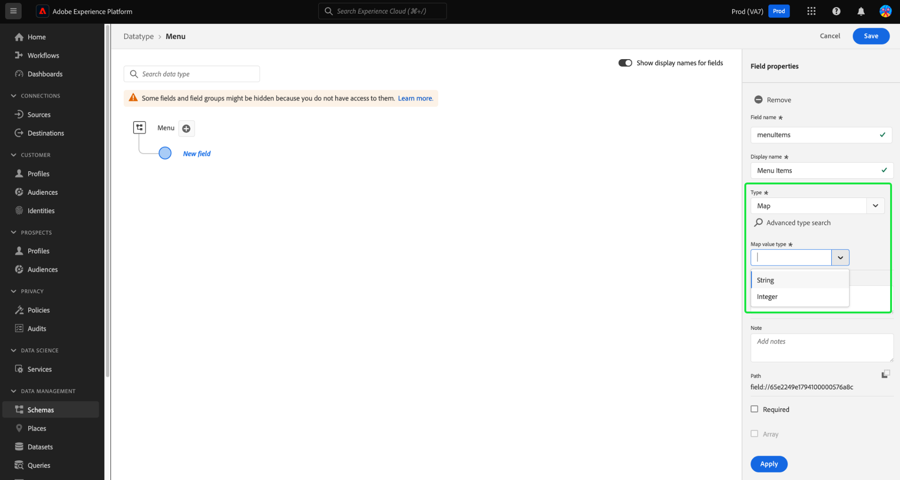
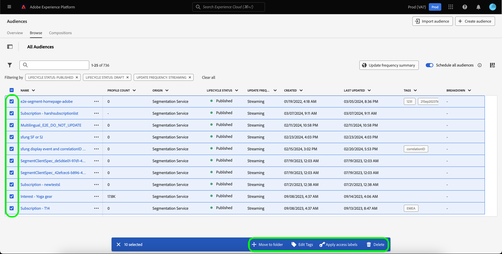
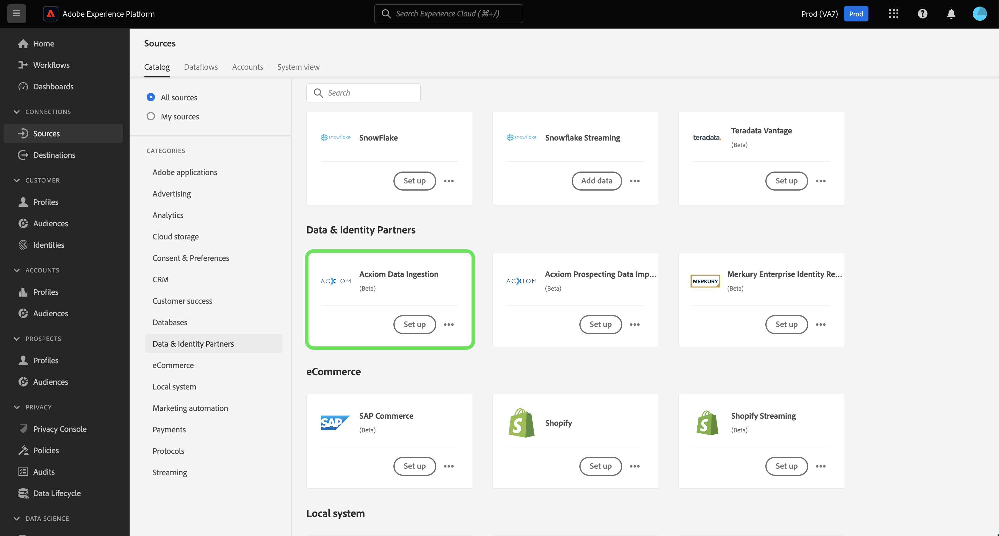
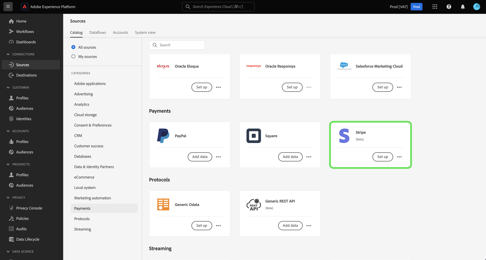
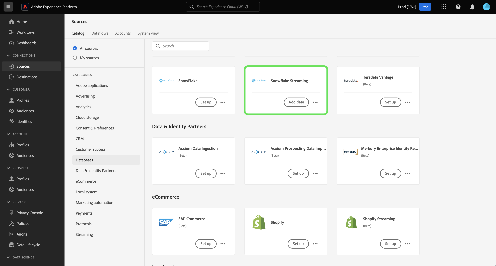

# Notes de mise à jour d’Adobe Experience Platform

**Date de publication : mercredi 19 mars 2024**

>[!TIP]
>
>Utilisez le glossaire [&#128279;](/help/landing/glossary.md) pour vous familiariser avec la terminologie utilisée dans Real-Time Customer Data Platform et Adobe Experience Platform. Si vous ne trouvez pas un terme spécifique que vous recherchez, utilisez les options de commentaires de la page pour demander l’ajout de nouveaux termes au glossaire.

Mises à jour des fonctionnalités existantes dans Experience Platform :

- [Catalog Service](#catalog-service)
- [Collecte de données](#data-collection)
- [Préparation des données](#data-prep)
- [Destinations](#destinations)
- [Modèle de données d’expérience (XDM)](#xdm)
- [Service de segmentation](#segmentation)
- [Sources](#sources)

## Catalog Service {#catalog-service}

Catalog Service est le système d’enregistrement pour l’emplacement et la parenté des données au sein d’Adobe Experience Platform. Bien que toutes les données ingérées dans Experience Platform soient stockées dans le lac de données sous forme de fichiers et de répertoires, Catalog conserve les métadonnées et la description de ces fichiers et répertoires à des fins de recherche et de surveillance.

| Fonctionnalité | Description |
| --- | --- |
| Actions supplémentaires | Pour rendre les opérations plus flexibles et vous aider à gérer vos données, vous pouvez désormais utiliser la fonctionnalité « Plus d’actions » de la vue des détails pour effectuer des tâches supplémentaires sur un jeu de données. Vous pouvez soit supprimer le jeu de données, soit l’activer pour une utilisation avec le profil client en temps réel à partir de la page de détails d’un jeu de données choisi. **Remarque :** si vous activez un jeu de données pour l’ingestion de profil, le schéma du jeu de données doit être compatible avec le profil client en temps réel. ![L’espace de travail Jeux de données avec le [!UICONTROL ... Plus &#x200B;] menu déroulant mis en surbrillance.](../2024/assets/march/more-actions.png "Espace de travail Jeux de données avec le menu déroulant Plus en surbrillance."){width="100" zoomable="yes"}. Pour plus d’informations, consultez la documentation du [guide d’utilisation des jeux de données](../../catalog/datasets/user-guide.md) . |

{style="table-layout:auto"}

Pour plus d’informations sur Catalog Service, consultez la [vue d’ensemble de Catalog Service](../../catalog/home.md).

## Préparation de données {#data-prep}

La préparation des données permet aux personnes travaillant dans l’ingénierie de données de mapper, de transformer et de valider les données vers et à partir du modèle de données d’expérience (XDM).

**Fonctionnalités nouvelles ou mises à jour**

| Fonctionnalité | Description |
| --- | --- |
| Nouvelles fonctions de mappeur pour Adobe Analytics | Vous pouvez désormais utiliser les fonctions suivantes pour extraire des données d’événement d’Adobe Analytics : <ul><li>`aa_get_event_id`</li><li>`aa_get_event_value`</li><li>`aa_get_product_categories`</li><li>`aa_get_product_names`</li><li>`aa_get_product_quantities`</li><li>`aa_get_product_prices`</li><li>`aa_get_product_event_values`</li><li>`aa_get_product_evars`</li></ul> Pour plus d’informations sur ces fonctions, consultez le guide des fonctions de [préparation des données](../../data-prep/functions.md#analytics-functions) |

{style="table-layout:auto"}

Pour plus d’informations sur la préparation des données, consultez la [présentation de la préparation des données](../../data-prep/home.md).

## Collecte de données {#data-collection}

Adobe Experience Platform fournit une suite de technologies qui vous permettent de collecter des données d’expérience client côté client. Vous pouvez ensuite les envoyer à Adobe Experience Platform Edge Network pour les enrichir, les transformer et les distribuer vers des destinations Adobe ou autres qu’Adobe.

**Nouvelles fonctionnalités**

| Type | Fonctionnalité | Description |
| --- | --- | --- |
| Extensions | Extension de balise [!DNL Merkury] | L’extension [[!DNL Merkury] tag](https://exchange.adobe.com/apps/ec/600027/merkury-tag) fournit des taux de correspondance de pointe pour les visiteurs anonymes de sites web vers un ID de [!DNL Merkury]. Les marques peuvent tirer parti de la puissance de la balise [!DNL Merkury] et d’Adobe pour offrir des expériences personnalisées de site web en temps réel. En outre, la balise [!DNL Merkury] permet la croissance des données numériques propriétaires ainsi que des profils clients en ligne et hors ligne connectés. |

{style="table-layout:auto"}

Pour en savoir plus sur la collecte de données, consultez la [vue d’ensemble des collectes de données](../../tags/home.md).

## Destinations {#destinations}

Les [!DNL Destinations] sont des intégrations préconfigurées à des plateformes de destination qui permettent d’activer facilement des données provenant d’Adobe Experience Platform. Vous pouvez utiliser les destinations pour activer vos données connues et inconnues pour les campagnes marketing cross-canal, les campagnes par e-mail, la publicité ciblée et de nombreux autres cas d’utilisation.

**Destinations nouvelles et mises à jour** {#new-updated-destinations}

| Destination | Type | Description |
| ----------- | --------- | ----------- |
| Connexion à l’amélioration des données d’Acxiom [(Beta)](../../destinations/catalog/data-partner/acxiom-data-enhancement.md) | Nouveau | Utilisez ce connecteur pour activer les profils propriétaires de Real-Time CDP vers Acxiom à des fins d’enrichissement des données et d’utilisation sur les canaux marketing. Vous pouvez ensuite utiliser la source Acxiom pour importer les profils avec des données améliorées et les utiliser dans Real-Time CDP. |
| Connexion [&#x200B; (Beta) Acxiom Prospect Suppression](../../destinations/catalog/data-partner/acxiom-prospect-suppression.md) | Nouveau | Exportez vos audiences propriétaires vers la destination Acxiom pour permettre à Acxiom de supprimer les clients connus ou convertis. Ensuite, utilisez le connecteur source [Import de données de prospection Acxiom](../../sources/connectors/data-partners/acxiom-prospecting-data-import.md) pour ingérer et activer des listes de prospects à partir d’Acxiom, en supprimant vos clients connus ou convertis. |
| [Connexion Amazon Ads](../../destinations/catalog/advertising/amazon-ads.md) | Mise à jour | Lors de l’exportation de données vers la destination Amazon Ads, vous pouvez désormais acheminer les données vers Amazon DSP ou Amazon Marketing Cloud (nouveau). |
| [Connexion à l’intégration LiveRamp](../../destinations/catalog/advertising/liveramp-onboarding.md) | Mise à jour | La destination d’intégration LiveRamp prend désormais en charge les diffusions vers l’Europe et l’Australie [!DNL LiveRamp] les instances [!DNL SFTP]. La taille maximale du fichier exporté a également été augmentée à 10 millions de lignes (contre 5 millions auparavant). |

{style="table-layout:auto"}

<!--

**New or updated functionality** {#destinations-new-updated-functionality}

-->

Pour des informations plus générales sur les destinations, consultez la [présentation des destinations](../../destinations/home.md).

## Modèle de données d’expérience (XDM) {#xdm}

XDM est une spécification Open Source qui fournit des structures et des définitions communes (schémas) pour les données introduites dans Adobe Experience Platform. En adhérant aux normes XDM, toutes les données d’expérience client peuvent être intégrées dans une représentation commune afin de fournir des informations plus rapidement et de manière plus intégrée. Vous pouvez obtenir des informations précieuses à partir des actions des clients, définir des types d’audiences clientes par le biais de segments et utiliser les attributs du client à des fins de personnalisation.

**Nouvelles fonctionnalités**

| Fonctionnalité | Description |
| --- | --- |
| Prise en charge du type de données de mappage de l’interface utilisateur d’Experience Platform | Personnalisez davantage la structure de données de votre modèle de données d’expérience (XDM) en définissant des champs de mappage dans l’interface utilisateur d’Experience Platform. Vous pouvez désormais créer des champs de mappage dans l’éditeur de schémas pour modéliser des structures de données flexibles ou stocker efficacement des paires clé-valeur. Sélectionnez « Mapper » dans la liste déroulante Type lors de la définition d’un nouveau champ pour configurer des sous-champs et les affecter à des groupes de champs. Les types de valeurs de mappage pris en charge sont string et integer. {width="100" zoomable="yes"}  Pour savoir comment [définir des champs de mappage dans l’interface utilisateur](../../xdm/ui/fields/map.md), consultez le guide de l’interface utilisateur. |

{style="table-layout:auto"}

Pour plus d’informations sur XDM dans Experience Platform, consultez la [vue d’ensemble du système XDM](../../xdm/home.md).

## Segmentation Service {#segmentation}

[!DNL Segmentation Service] permet de segmenter en audiences les données stockées dans [!DNL Experience Platform] qui se rapportent aux personnes (tels que les clientes et clients, les prospects, les utilisateurs et utilisatrices ou les organisations). Vous pouvez créer des audiences par le biais de définitions de segment ou d’autres sources à partir de vos données [!DNL Real-Time Customer Profile]. Ces audiences sont configurées et conservées de manière centralisée sur [!DNL Experience Platform] et sont facilement accessibles à partir de n’importe quelle solution Adobe.

**Nouvelle fonctionnalité**

| Fonctionnalité | Description |
| ------- | ----------- |
| Actions en masse | L’inventaire des audiences prend désormais en charge les actions en masse. Grâce aux actions en masse, vous pouvez sélectionner rapidement plusieurs audiences pour les déplacer vers un dossier, appliquer des balises, appliquer des libellés d’accès ou les supprimer.   {width="100" zoomable="yes"}  Pour plus d’informations sur cette fonctionnalité, consultez la [présentation d’Audience Portal](../../segmentation/ui/audience-portal.md#bulk-actions). |

{style="table-layout:auto"}

Pour en savoir plus sur Segmentation Service, consultez la [présentation de Segmentation Service](../../segmentation/home.md).

## Sources {#sources}

Experience Platform fournit une API RESTful et une interface utilisateur interactive qui vous permet de configurer facilement des connexions source à différents fournisseurs de données. Ces connexions source vous permettent de vous authentifier et de vous connecter à des services de gestion de la relation client et à des systèmes de stockage externes, de définir des heures d’ingestion et de gérer le débit d’ingestion des données.

**Sources nouvelles et mises à jour**

| Fonctionnalité | Type | Description |
| --- | --- | --- |
| [!BADGE Version bêta]{type=Informative} [!DNL Acxiom Data Ingestion] | Nouveau | Utilisez la [[!DNL Acxiom Data Ingestion] source](../../sources/tutorials/ui/create/data-partners/acxiom-data-ingestion.md) pour ingérer des données [!DNL Acxiom] dans Real-Time Customer Data Platform et enrichir les profils propriétaires. Ensuite, vous pouvez utiliser vos profils propriétaires enrichis de [!DNL Acxiom] pour améliorer les audiences et les activer sur l’ensemble des canaux marketing.   {width="100" zoomable="yes"}   Lisez la [[!DNL Acxiom Data Ingestion] présentation](../../sources/connectors/data-partners/acxiom-data-ingestion.md) pour plus d’informations sur la prise en main. |
| [!BADGE Version bêta]{type=Informative} [!DNL Stripe] | Nouveau | Utilisez la [[!DNL Stripe] source](../../sources/connectors/payments/stripe.md) pour ingérer dans Experience Platform les données capturées pendant le flux d’achat par vos clients. Une fois ingérées, vous pouvez utiliser ces données pour créer des offres personnalisées et déverrouiller des informations commerciales plus riches.   {width="100" zoomable="yes"}   Lisez la [[!DNL Stripe] présentation](../../sources/connectors/payments/stripe.md) pour plus d’informations sur la prise en main. |
| Prise en charge de l’interface utilisateur de [!DNL Snowflake Streaming] | Nouveau | Vous pouvez désormais utiliser la [[!DNL Snowflake Streaming] source](../../sources/tutorials/ui/create/databases/snowflake-streaming.md) dans l’interface utilisateur d’Experience Platform pour diffuser des données à partir de votre base de données [!DNL Snowflake].   {width="100" zoomable="yes"}   Lisez la [[!DNL Snowflake Streaming] présentation](../../sources/connectors/databases/snowflake-streaming.md) pour plus d’informations sur la prise en main. |

{style="table-layout:auto"}

Pour plus d’informations sur les sources, consultez la [vue d’ensemble des sources](../../sources/home.md).
