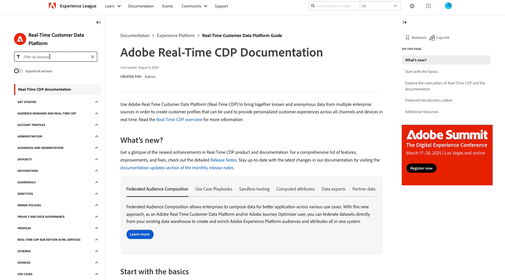

# Notes de mise à jour d’Adobe Experience Platform

>[!TIP]
>
>La nouvelle [documentation du produit Assistant IA](../../ai-assistant/landing.md) est désormais disponible. Utilisez cette page en tant que point central pour toutes les ressources liées à l’Assistant IA.

**Date de publication : 26 novembre 2024**

Mises à jour des fonctionnalités et de la documentation existantes dans Adobe Experience Platform :

- [Assistant IA](#ai-assistant)
- [Destinations](#destinations)
- [Service de requête](#query-service)
- [Sandbox](#sandboxes)
- [Mises à jour de la documentation](#documentation-updates)
   - [Documentation interactive de l’API Experience Platform](#interactive-experience-platform-api-documentation)
   - [Nouvelle table des matières sur Experience League](#new-table-of-contents-on-experience-league)
   - [Nouvelle page de destination Assistant IA](#new-ai-assistant-landing-page)

## Assistant IA {#ai-assistant}

L’Assistant IA dans Adobe Experience Platform est une expérience conversationnelle que vous pouvez utiliser pour accélérer vos workflows dans les applications Adobe. Vous pouvez utiliser l’Assistant IA pour développer vos connaissances sur le produit, résoudre les problèmes ou rechercher des informations et trouver des informations opérationnelles. L’Assistant IA prend en charge Experience Platform, Real-Time Customer Data Platform, Adobe Journey Optimizer et Customer Journey Analytics.

**Nouvelles fonctionnalités**

| Fonctionnalité | Description |
| --- | --- |
| {type=Informative} Surveillez les modifications importantes et la croissance prévue de l’audience. | Utilisez l’Assistant IA pour surveiller les changements significatifs et fournir des prévisions de croissance de votre audience et de la taille des jeux de données. Vous pouvez ensuite utiliser ces informations pour garantir l’intégrité de vos données d’audience et proposer des projections prospectives à l’appui d’une prise de décision éclairée par les données. Pour plus d’informations, consultez le guide sur la [surveillance des changements significatifs et la prévision de la croissance de l’audience](../../ai-assistant/new-features/audience-forecasting.md). |
| [!BADGE Alpha &#x200B;]{type=Informative} Estimation en langage naturel | Utilisez les fonctionnalités d’estimation du langage naturel d’Assistant IA pour estimer la taille des audiences et prédire la propension des audiences sur la base de questions simples et conversationnelles. Pour plus d’informations, consultez le guide sur l’[utilisation de l’estimation du langage naturel avec l’Assistant IA](../../ai-assistant/new-features/natural-language.md). |

{style="table-layout:auto"}

## Destinations {#destinations}

Les [!DNL Destinations] sont des intégrations préconfigurées à des plateformes de destination qui permettent d’activer facilement des données provenant d’Adobe Experience Platform. Vous pouvez utiliser les destinations pour activer vos données connues et inconnues pour les campagnes marketing cross-canal, les campagnes par e-mail, la publicité ciblée et de nombreux autres cas d’utilisation.

**Fonctionnalités nouvelles ou mises à jour** {#new-updated-destinations}

| Destination | Description |
| --- | --- |
| [Streaming Magnite en temps réel](/help/destinations/catalog/advertising/magnite-streaming.md) | Exportez des audiences pour activation, ciblage ou suppression dans la plateforme de streaming Magnite. Notez que pour que les audiences soient correctement exportées vers Magnite, vous devez utiliser les destinations en temps réel et par lots. |
| [Lot de streaming Magnite](/help/destinations/catalog/advertising/magnite-batch.md) | Exportez des audiences pour activation, ciblage ou suppression dans la plateforme de streaming Magnite. Notez que pour que les audiences soient correctement exportées vers Magnite, vous devez utiliser les destinations en temps réel et par lots. |

{style="table-layout:auto"}

**Fonctionnalité nouvelle ou mise à jour** {#destinations-new-updated-functionality}

| Fonctionnalité | Description |
| --- | --- |
| [Rechercher des attributs de profil en temps réel sur Edge](/help/destinations/ui/activate-edge-profile-lookup.md) | Découvrez comment rechercher des attributs de profil Edge en temps réel pour offrir des expériences de personnalisation ou éclairer les règles de prise de décision par le biais d’applications en aval, à l’aide de la destination Personnalisation personnalisée et de l’API Edge Network. |

{style="table-layout:auto"}

Pour plus d’informations, reportez-vous à la [vue d’ensemble des destinations](../../destinations/home.md).

## Service de requête {#query-service}

Interrogez des données dans le lac de données Adobe Experience Platform à l’aide de SQL standard avec le service de requête. Combinez en toute transparence des jeux de données et générez-en de nouveaux à partir des résultats de vos requêtes pour alimenter les rapports, activer les workflows de science des données ou faciliter l’ingestion dans le profil client en temps réel. Vous pouvez, par exemple, fusionner les données de transaction client avec les données comportementales afin d’identifier les audiences à forte valeur ajoutée pour les campagnes marketing ciblées.

**Fonctionnalités mises à jour**

| Fonctionnalité | Description |
| --- | --- |
| API Data Distiller Authorization | Gérez et appliquez des restrictions d’accès basées sur les adresses IP pour les sandbox du service de requête afin d’améliorer la sécurité des données et de garantir la conformité aux politiques organisationnelles. Reportez-vous au [guide de l’API Data Distiller Authorization](../../query-service/auth-api/overview.md) pour plus d’informations sur ses principales fonctions et fonctionnalités ou à la [documentation d’OpenAPI](https://developer.adobe.com/experience-platform-apis/references/data-distiller-auth/) pour obtenir des informations complètes, notamment des détails de point d’entrée, des listes de paramètres, des exemples de requête/réponse et des fonctionnalités de test. |

Pour plus d’informations sur Query Service [!DNL Query Service], consultez la [[!DNL Query Service] présentation](../../query-service/home.md) de Query Service.

## Sandbox {#sandboxes}

Adobe Experience Platform est conçu pour enrichir les applications d’expérience digitale à l’échelle mondiale. Les entreprises exécutent souvent plusieurs applications d’expérience digitale en parallèle et doivent prendre en charge le développement, les tests et le déploiement de ces applications tout en assurant la conformité opérationnelle. Pour répondre à ce besoin, Experience Platform fournit des sandbox qui divisent une instance d’Experience Platform unique en plusieurs environnements virtuels pour favoriser le développement et l’évolution d’applications d’expérience digitale.

**Fonctionnalités nouvelles ou mises à jour**

| Fonctionnalité | Description |
| --- | --- |
| Partage de packages avec l’API d’outils sandbox | Utilisez deux nouveaux points d’entrée d’API, [`/handshake`](../../sandboxes/sandbox-tooling-api/packages.md#org-linking) et [`/transfers`](../../sandboxes/sandbox-tooling-api/packages.md#transfer-packages), pour gérer le partage de packages entre les organisations, tels que les approbations de requêtes, la visibilité des packages et l’import de packages, à l’aide de l’API d’outils sandbox. |

Pour plus d’informations sur les sandbox, consultez la [vue d’ensemble des sandbox](../../sandboxes/home.md).

## Mises à jour de la documentation {#documentation-updates}

### Documentation interactive de l’API Experience Platform {#interactive-api-documentation}

La [documentation de l’API Experience Platform](https://developer.adobe.com/experience-platform-apis/) est désormais entièrement interactive, ce qui vous permet d’authentifier et d’explorer les API directement sur la page de documentation de référence de l’API. Vous pouvez maintenant accéder à la page de documentation de référence de l’API souhaitée, créer ou obtenir vos informations d’authentification API, les coller dans le bloc **[!UICONTROL Try it]** et exécuter l’appel. Tout ceci sur une seule et même page. [En savoir plus](/help/landing/api-authentication.md#get-credentials-functionality) à propos de la fonctionnalité.

### Nouvelle table des matières sur Experience League {#new-table-of-contents-on-experience-league}

La table des matières des pages de documentation d’Experience League a été améliorée afin de fournir une meilleure expérience aux lecteurs et lectrices, notamment grâce à l’ajout d’un filtre de mot-clé pour découvrir la page exacte dont vous avez besoin, de la possibilité de développer toutes les pages, et de bien d’autres choses.  {width="250" align="center" zoomable="yes"}

### Nouvelle page de destination Assistant IA {#new-ai-assistant-landing-page}

Utilisez la nouvelle page de [documentation du produit Assistant IA](../../ai-assistant/landing.md) en tant que point central pour tout ce qui concerne l’Assistant IA. Reportez-vous à la documentation du produit pour des tutoriels vidéo, de la documentation technique, des cas d’utilisation et des liens vers des publications de blog sur l’Assistant IA.
