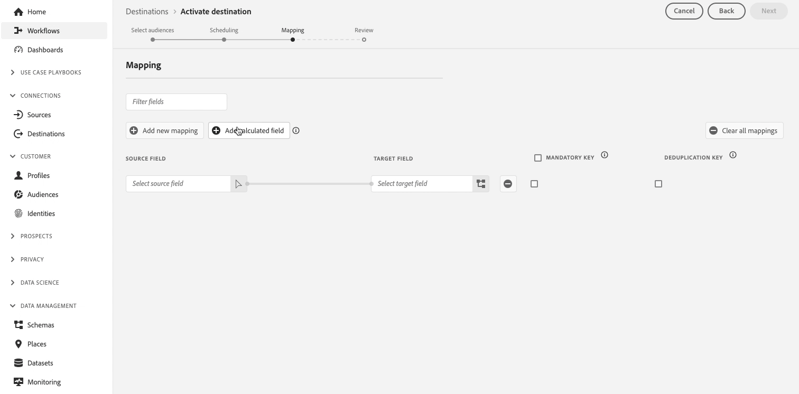

# Notes de mise à jour d’Adobe Experience Platform

**Date de publication : 29 octobre 2024**

Mises à jour des fonctionnalités et de la documentation existantes dans Adobe Experience Platform :

- [Tableaux de bord](#dashboards)
- [Collecte de données](#data-collection-)
- [Destinations](#destinations)
- [Service de segmentation](#segmentation-service)
- [Sandbox](#sandboxes)
- [Sources](#sources)

## Tableaux de bord {#dashboards}

Experience Platform propose de nombreux tableaux de bord qui vous permettent d’afficher des informations importantes sur les données de votre organisation, telles quʼelles ont été capturées lors dʼinstantanés quotidiens.

**Fonctionnalités nouvelles ou mises à jour**

| Fonctionnalité | Description |
| --- | --- |
| Modèles de Data Distiller | Explorez plusieurs modèles pour obtenir des informations structurées sur les données d’audience. Utilisez des tableaux de bord tels que **Advanced[!UICONTROL Audience Overlaps]**, **[!UICONTROL Audience Comparison]**, **[!UICONTROL Audience Trends]** et **[!UICONTROL Audience Identity Overlaps]** pour prendre des décisions basées sur les données, optimiser la segmentation et améliorer les stratégies d’engagement. Pour plus d’informations, consultez le [guide des modèles de Data Distiller](../../dashboards/sql-insights-query-pro-mode/templates/overview.md). |
| Chevauchements avancés des audiences | Analysez rapidement les intersections d’audience pour des audiences spécifiques ou en observant tous les chevauchements afin de découvrir des informations précieuses sur l’ensemble de votre jeu d’audiences. Utilisez ces informations pour affiner la segmentation, réduire les messages redondants et créer des campagnes plus ciblées pour une meilleure efficacité marketing. Pour plus d’informations, consultez le [guide des chevauchements avancés des audiences](../../dashboards/sql-insights-query-pro-mode/templates/overlaps.md). |
| Améliorations de la comparaison des audiences | Affichez une comparaison côte à côte des mesures clés entre différents groupes d’audiences à l’aide du tableau de bord **Comparaison des audiences**. Ce tableau de bord vous permet de sélectionner des périodes et des KPI spécifiques, tels que la taille de l’audience et la composition de l’identité, afin de prendre des décisions plus éclairées sur la segmentation et les stratégies de ciblage de l’audience. Pour plus d’informations, consultez le [guide de comparaison des audiences](../../dashboards/sql-insights-query-pro-mode/templates/comparison.md). |
| Visualisation des tendances des audiences | Analysez les mesures d’audience au fil du temps avec le tableau de bord **[!UICONTROL Audience Trends]**. Visualisez les tendances relatives à la taille des audiences, au nombre d’identités et au nombre de profils d&#39;identité unique afin de mieux surveiller l’évolution de l’audience, mesurer la croissance et affiner vos stratégies d’engagement. Pour plus d’informations, consultez le [guide sur les tendances des audiences](../../dashboards/sql-insights-query-pro-mode/templates/trends.md). |
| Analyse des chevauchements d’identités | Analysez les chevauchements d’identités dans les audiences sélectionnées avec le tableau de bord **[!UICONTROL Audience Identity Overlaps]**. Affichez les tendances et les répartitions des identités pour comprendre les liens entre les différents types d’identités au sein de votre audience, ce qui améliore le regroupement des identités et la précision de la segmentation de la clientèle. Pour plus d’informations, consultez le [guide des chevauchements des identités d’audience](../../dashboards/sql-insights-query-pro-mode/templates/identity-overlaps.md). |

{style="table-layout:auto"}

Pour plus dʼinformations sur les tableaux de bord, notamment sur la manière dʼoctroyer des autorisations dʼaccès et de créer des widgets personnalisés, commencez par lire la [Présentation des tableaux de bord](../../dashboards/home.md).

## Collecte de données {#collection}

Adobe Experience Platform fournit une suite de technologies qui vous permettent de collecter des données d’expérience client côté client. Vous pouvez ensuite les envoyer à Experience Platform Edge Network pour les enrichir, les transformer et les distribuer vers des destinations Adobe ou autres qu’Adobe.

**Nouvelles fonctionnalités**

| Type | Fonctionnalité | Description |
| --- | --- | --- |
| Balises et extensions | Vue JSON Adobe Analytics | Vous pouvez désormais utiliser l’extension de balises Adobe Analytics pour examiner les eVars, les props et les paramètres d’événement au format JSON, qui peuvent maintenant être inclus dans l’extension du SDK Web et exportés en vue de leur modification. Vous pouvez également charger ou copier ces données et les stocker sur votre appareil. Pour plus d’informations, consultez la [documentation de l’extension Adobe Analytics](../../tags/extensions/client/analytics/overview.md). |

{style="table-layout:auto"}

Pour plus d’informations, consultez la [vue d’ensemble de la collecte des données](../../collection/home.md).

## Destinations {#destinations}

Les [!DNL Destinations] sont des intégrations préconfigurées à des plateformes de destination qui permettent d’activer facilement des données provenant d’Adobe Experience Platform. Vous pouvez utiliser les destinations pour activer vos données connues et inconnues pour les campagnes marketing cross-canal, les campagnes par e-mail, la publicité ciblée et de nombreux autres cas d’utilisation.

**Fonctionnalité nouvelle ou mise à jour** {#destinations-new-updated-functionality}

| Fonctionnalité | Description |
| ----------- | ----------- |
| [Prise en charge de l’export de tableaux disponible pour toutes les personnes utilisatrices](../../destinations/ui/export-arrays-maps-objects.md) | Tous les clients peuvent désormais utiliser l’option **[!UICONTROL Add calculated field]** lors de l’activation des audiences *vers des destinations basées sur des fichiers* pour exporter des tableaux entiers ou des éléments de tableaux. Notez que vous devez toujours utiliser la fonction `array_to_string` pour aplatir le tableau en une chaîne dans le fichier cible.   {width="250" align="center" zoomable="yes"} |
| [Améliorations de la précision des rapports pour les destinations de streaming](/help/destinations/ui/export-datasets.md) | Depuis octobre 2024, Adobe propose une mise à jour améliorant la précision des rapports pour les destinations de streaming. Cette amélioration assure un meilleur alignement entre les rapports Experience Platform et les plateformes de destination.   Avant cette mise à jour, **[!UICONTROL Identities failed]** incluait toutes les reprises d’activation. Après cette mise à jour, seule la dernière reprise d’activation est incluse dans le nombre total.   Cette amélioration s’applique actuellement à la destination [Google Customer Match](../../destinations/catalog/advertising/google-customer-match.md) mais sera progressivement déployée vers d’autres destinations de streaming Experience Platform. Suite à cette amélioration, les utilisateurs de la destination [Correspondance client ](../../destinations/catalog/advertising/google-customer-match.md) peuvent voir une baisse attendue de leur nombre de **[!UICONTROL Identities failed]**. |
| Implications de l’évaluation des audiences flexibles sur l’[activation de l’audience par lot](../../destinations/ui/activate-batch-profile-destinations.md#export-full-files) | Si vous exécutez l’[évaluation d’audience flexible](../../segmentation/ui/audience-portal.md#flexible-audience-evaluation) sur des audiences qui sont déjà définies pour être activées après l’évaluation du segment, les audiences seront activées dès que la tâche d’évaluation d’audience flexible se terminera, quels que soient les tâches d’activation quotidiennes précédentes.   Cela peut entraîner l’exportation d’audiences plusieurs fois par jour, en fonction de vos actions. |

{style="table-layout:auto"}

Pour plus d’informations, reportez-vous à la [vue d’ensemble des destinations](../../destinations/home.md).

## Service de segmentation {#segmentation-service}

[!DNL Segmentation Service] définit un sous-ensemble particulier de profils en décrivant les critères qui identifient un groupe de clients potentiels de votre base. Les segments peuvent être basés sur des données d’enregistrement (telles que des informations démographiques) ou des événements de séries temporelles représentant les interactions de la clientèle avec votre marque.

**Fonctionnalités nouvelles ou mises à jour**

| Fonctionnalité | Description |
| ------- | ----------- |
| [!BADGE Disponibilité limitée]{type=Informative} Évaluation flexible des audiences | L’évaluation des audiences flexibles vous permet de créer rapidement de nouvelles audiences à la demande pour des communications sensibles au temps. Vous trouverez plus d’informations sur cette nouvelle fonctionnalité dans la [documentation du portail d’audience](../../segmentation/ui/audience-portal.md#flexible-audience-evaluation). |

{style="table-layout:auto"}

Pour plus d’informations sur [!DNL Segmentation Service], consultez la [vue d’ensemble de la segmentation](../../segmentation/home.md).

## Sandbox {#sandboxes}

Adobe Experience Platform est conçu pour enrichir les applications d’expérience digitale à l’échelle mondiale. Les entreprises exécutent souvent plusieurs applications d’expérience digitale en parallèle et doivent prendre en charge le développement, les tests et le déploiement de ces applications tout en assurant la conformité opérationnelle. Pour répondre à ce besoin, Experience Platform fournit des sandbox qui divisent une instance d’Experience Platform unique en plusieurs environnements virtuels pour favoriser le développement et l’évolution d’applications d’expérience digitale.

**Fonctionnalités nouvelles ou mises à jour**

| Fonctionnalité | Description |
| --- | --- |
| Partage du package d’outils sandbox | Vous pouvez désormais utiliser l’outil sandbox pour exporter et importer facilement des configurations de sandbox entre les sandbox de différentes organisations. Deux catégories de packages partagés sont désormais disponibles : <ul><li>**[Package privé](../../sandboxes/ui/sharing-packages-across-orgs.md#private-packages) :** utilisez le partage de package privé avec les organisations qui ont approuvé la demande de partage de l’organisation source.</li><li>**[Package public](../../sandboxes/ui/sharing-packages-across-orgs.md#public-packages) :** les packages publics peuvent être partagés sans validation supplémentaire et sont facilement importés à l’aide du payload du package.</li></ul> Pour plus d’informations sur ces fonctionnalités, consultez le guide sur le [partage de packages dans l’ensemble des organisations](../../sandboxes/ui/sharing-packages-across-orgs.md). |
| [Partage de packages](https://experienceleague.adobe.com/fr/docs/experience-platform/sandbox/sandbox-tooling-api/packages#org-linking) dans l’API d’outils sandbox | Utilisez l’API d’outils sandbox pour envoyer des requêtes à deux nouveaux points d’entrée, `/handshake` et `/transfer`, pour le partage entre les organisations, la récupération et la création de requêtes de partage de packages. Une requête supplémentaire a été ajoutée au point d’entrée `/packages` pour récupérer le payload d’un package. |

{style="table-layout:auto"}

Pour plus d’informations sur les sandbox, consultez la [vue d’ensemble des sandbox](../../sandboxes/home.md).

## Sources {#sources}

Experience Platform fournit une API RESTful et une interface utilisateur interactive qui vous permet de configurer facilement des connexions source à différents fournisseurs de données. Ces connexions source vous permettent de vous authentifier et de vous connecter à des services de gestion de la relation client et à des systèmes de stockage externes, de définir des heures d’ingestion et de gérer le débit d’ingestion des données.

Utilisez les sources dans Experience Platform pour ingérer des données à partir d’une application Adobe ou d’une source de données tierce.

**Fonctionnalité mise à jour**

| Fonctionnalité | Description |
| --- | --- |
| Prise en charge du filtrage des entités d’activité standard dans [!DNL Marketo Engage] | Vous pouvez utiliser l’API [!DNL Flow Service] pour filtrer les entités d’activité standard lors de l’ingestion de données provenant de votre source [!DNL Marketo Engage]. Pour plus d’informations, consultez le guide sur le [filtrage [!DNL Marketo]  des données d’activité standard](../../sources/tutorials/api/filter.md#filter-activity-entities-for-marketo-engage). |

{style="table-layout:auto"}

Pour plus d’informations, consultez la [vue d’ensemble des sources](../../sources/home.md).
