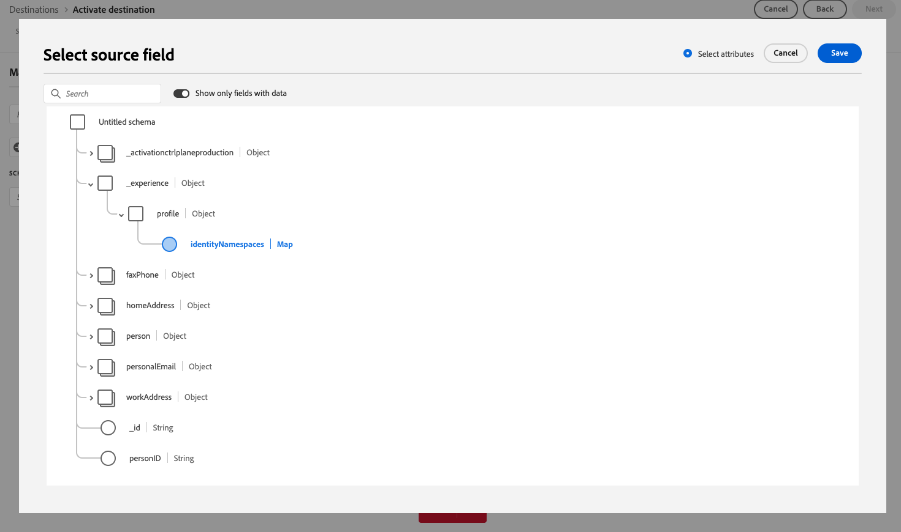

# Notes de mise à jour d’Adobe Experience Platform

**Date de publication : 26 mars 2025**

Mises à jour des fonctionnalités et de la documentation existantes dans Adobe Experience Platform :

- [Notes de mise à jour d’Adobe Experience Platform](#adobe-experience-platform-release-notes)
   - [Tableaux de bord](#dashboards)
   - [Destinations](#destinations)
   - [Composition d’audiences fédérées](#federated-audience-composition)
   - [Service de segmentation](#segmentation-service)
   - [Sources](#sources)

## Tableaux de bord {#dashboards}

Experience Platform propose de nombreux tableaux de bord qui vous permettent d’afficher des informations importantes sur les données de votre organisation, telles quʼelles ont été capturées lors dʼinstantanés quotidiens.

**Fonctionnalités nouvelles ou mises à jour**

| Fonctionnalité | Description |
| ------- | ----------- |
| Tableau de bord d’utilisation des licences basée sur les mesures | Le tableau de bord d’utilisation des licences comprend désormais une interface d’utilisation rationalisée avec deux onglets : **Mesures** et **Produits**. Le nouvel onglet **Mesures** offre une vue consolidée de toutes les mesures de licence pouvant faire l’objet d’un suivi pour vos produits achetés. Chaque mesure comprend une icône d’informations intégrée affichant les descriptions et les produits associés. Les utilisateurs et utilisatrices peuvent sélectionner des sandbox de production ou de développement, afficher les tendances d’utilisation historiques dans les graphiques interactifs et exporter des données spécifiques aux sandbox au format CSV. Ces mises à jour rationalisent le suivi des licences et fournissent des informations plus claires. Pour en savoir plus, consultez le [guide du tableau de bord d’utilisation des licences](../../dashboards/guides/license-usage.md). |
| Mise à jour de la fréquence de prédiction | Le tableau de bord d’utilisation des licences fournit désormais des informations plus précises sur la consommation prévue en mettant à jour les prédictions d’utilisation **chaque semaine** plutôt que chaque mois. Ces prévisions indiquent l’utilisation estimée au cours des six prochaines semaines en fonction des tendances récentes. Ce changement permet une prise de décision plus rapide, une intervention plus précoce et une meilleure planification des licences. Pour en savoir plus, consultez le [guide du tableau de bord d’utilisation des licences](../../dashboards/guides/license-usage.md#predicted-usage). |
| Mise à jour des descriptions des mesures dans l’interface d’utilisation | Les définitions des mesures dans le tableau de bord d’utilisation des licences ont été révisées par souci de clarté et de cohérence. Vous pouvez désormais afficher les descriptions mises à jour directement dans le tableau de bord à l’aide d’icônes d’informations intégrées en regard de chaque mesure dans l’onglet **Mesures**. Ces mises à jour permettent de comprendre plus facilement comment les mesures sont suivies et à quels produits elles s’appliquent. Pour en savoir plus, consultez le [guide du tableau de bord d’utilisation des licences](../../dashboards/guides/license-usage.md#available-metrics). |

{style="table-layout:auto"}

Pour plus dʼinformations sur les tableaux de bord, notamment sur la manière dʼoctroyer des autorisations dʼaccès et de créer des widgets personnalisés, commencez par lire la [présentation des tableaux de bord](../../dashboards/home.md).

## Destinations {#destinations}

Les [!DNL Destinations] sont des intégrations préconfigurées à des plateformes de destination qui permettent d’activer facilement des données provenant d’Adobe Experience Platform. Vous pouvez utiliser les destinations pour activer vos données connues et inconnues pour les campagnes marketing cross-canal, les campagnes par e-mail, la publicité ciblée et de nombreux autres cas d’utilisation.

**Fonctionnalités nouvelles ou mises à jour** {#new-updated-destinations}

| Destination | Description |
| --- | --- |
| [Connexion Demandbase People](/help/destinations/catalog/advertising/demandbase-people.md) | Utilisez la connexion [!DNL Demandbase People] pour activer des profils pour vos campagnes Demandbase pour le ciblage, la personnalisation et la suppression des audiences. |
| [Connexion au compte Bombora](/help/destinations/catalog/advertising/bombora.md) | Utilisez la connexion [!DNL Bombora] pour activer des profils pour vos campagnes Bombora pour le ciblage, la personnalisation et la suppression des audiences, en fonction des [audiences de comptes](/help/segmentation/types/account-audiences.md). |
| Mise à niveau d’[Attributs Airship](/help/destinations/catalog/mobile-engagement/airship-attributes.md) | À compter du mercredi 25 mars 2025, vous pourrez voir deux cartes **[!UICONTROL Airship Attributes]** côte à côte dans le catalogue des destinations. Cela est dû à une mise à niveau interne du service de destinations. Le connecteur de destination **[!UICONTROL Airship Attributes]** existant a été renommé **[!UICONTROL (Deprecated) Airship Attributes]** et une nouvelle carte portant le nom **[!UICONTROL Airship Attributes]** est désormais disponible.   Utilisez la connexion **[!UICONTROL Airship Attributes]** dans le catalogue pour les nouveaux flux de données d’activation. Si vous avez des flux de données actifs vers la destination [!DNL (Deprecated) Airship Attributes], ils seront automatiquement mis à jour. Aucune action n’est donc requise de votre part.   Si vous créez des flux de données par le biais de l’[API Flow Service](https://developer.adobe.com/experience-platform-apis/references/destinations/), vous devez mettre à jour vos [!DNL flow spec ID] et [!DNL connection spec ID] aux valeurs suivantes : <ul><li> ID de spécification de flux : `a862e0be-966e-4e5a-80d3-1bb566461986`</li><li> ID de spécification de connexion : `594bc002-4a47-49b7-8a98-ac0d21045502`</li> </ul> |

{style="table-layout:auto"}

**Fonctionnalité nouvelle ou mise à jour** {#destinations-new-updated-functionality}

| Fonctionnalité | Description |
| --- | --- |
| [Améliorations de la précision des rapports pour les destinations de streaming](../../dataflows/ui/monitor-destinations.md) | Depuis mars 2025, Adobe propose une mise à jour améliorant la précision des rapports pour les destinations de streaming. Cette amélioration assure un meilleur alignement entre les rapports dans Experience Platform et les plateformes de destination.   Avant cette mise à jour, **[!UICONTROL Identities failed]** incluait toutes les reprises d’activation. Après cette mise à jour, seule la dernière reprise d’activation est incluse dans le nombre total.   Cette amélioration s’applique à toutes les destinations de diffusion en continu.   Suite à cette amélioration, les utilisateurs et utilisatrices de destinations de diffusion en continu peuvent voir une baisse attendue de leur nombre de **[!UICONTROL Identities failed]**. |
| [Prise en charge de l’export de champs de type mappage pour les destinations d’entreprise et edge](/help/destinations/ui/export-arrays-maps-objects.md) | Lors de l’exportation de données vers les destinations [Amazon Kinesis](/help/destinations/catalog/cloud-storage/amazon-kinesis.md), [API HTTP](/help/destinations/catalog/streaming/http-destination.md) et [Azure Event Hubs](/help/destinations/catalog/cloud-storage/azure-event-hubs.md), vous pouvez désormais sélectionner des champs de type map pour l’exportation à l’étape de mappage du workflow d’activation.   {width="250" align="center" zoomable="yes"} |

{style="table-layout:auto"}

Pour plus d’informations, reportez-vous à la [vue d’ensemble des destinations](../../destinations/home.md).

## Composition d’audiences fédérées {#federated-audience-composition}

Pour plus d’informations sur les dernières mises à jour de la composition d’audiences fédérées, lisez les [notes de mise à jour dédiées](https://experienceleague.adobe.com/fr/docs/federated-audience-composition/using/release-notes) ici.

## Service de segmentation {#segmentation-service}

[!DNL Segmentation Service] définit un sous-ensemble particulier de profils en décrivant les critères qui identifient un groupe de clients potentiels de votre base. Les segments peuvent être basés sur des données d’enregistrement (telles que des informations démographiques) ou des événements de séries temporelles représentant les interactions de la clientèle avec votre marque.

| Fonctionnalité | Description |
| ------- | ----------- |
| Améliorations du créateur d’audience de compte | Dans le créateur d’audience, vous pouvez désormais filtrer les attributs pour afficher uniquement les attributs renseignés, ainsi que pour afficher les données récapitulatives de ceux-ci. Vous trouverez plus d’informations sur ces améliorations dans la documentation du [créateur d’audience](../../rtcdp/segmentation/audience-builder.md). |
| Disponibilité générale de l’évaluation d’audience flexible | L’évaluation d’audience flexible est désormais disponible pour toute la clientèle. Vous pouvez utiliser l’évaluation d’audience flexible pour créer de nouvelles audiences à la demande pour les communications sensibles au facteur temps. Vous trouverez plus d’informations sur l’évaluation d’audience flexible dans la [vue d’ensemble de l’évaluation d’audience flexible](../../segmentation/methods/flexible-audience-evaluation.md). |

Pour plus d’informations sur [!DNL Segmentation Service], consultez la [présentation de la segmentation](../../segmentation/home.md).

## Sources {#sources}

Experience Platform fournit une API RESTful et une interface utilisateur interactive qui vous permet de configurer facilement des connexions source à différents fournisseurs de données. Ces connexions source vous permettent de vous authentifier et de vous connecter à des services de gestion de la relation client et à des systèmes de stockage externes, de définir des heures d’ingestion et de gérer le débit d’ingestion des données.

Utilisez les sources dans Experience Platform pour ingérer des données à partir d’une application Adobe ou d’une source de données tierce.

**Nouvelles sources**

| Fonctionnalité | Description |
| --- | --- |
| [!DNL Bombora Intent] | La source [!DNL Bombora Intent] est désormais disponible dans le catalogue des sources. Utilisez cette source pour : <ul><li>Intégrer les données d’intention Company Surge de Bombora pour identifier les comptes qui recherchent activement vos produits ou services.</li><li>Hiérarchiser les comptes de marché afin de créer des segments précis et d’exécuter des campagnes ABM hyper-ciblées, veillant à ce que vos efforts marketing se concentrent sur les comptes les plus susceptibles d’être convertis.</li><li>Tirer parti des stratégies axées sur les intentions pour optimiser les dépenses publicitaires, stimuler l’engagement et maximiser le retour sur investissement.</li></ul> Pour plus d’informations, consultez le guide sur la [connexion d’un compte  [!DNL Bombora]  à Experience Platform](../../sources/tutorials/ui/create/data-partners/bombora.md). |
| [!DNL Demandbase Intent] | La source [!DNL Demandbase Intent] est désormais disponible dans le catalogue des sources. Utilisez cette source pour : <ul><li>Intégrez les données d’intention de comptes de Demandbase pour identifier les comptes à taux d’intérêt élevé en fonction des engagements en temps réel.</li><li>En donnant la priorité aux signaux d’intention les plus forts, vous pouvez créer des segments précis et diffuser des campagnes hyper-ciblées afin de vous assurer que vos efforts marketing se concentrent sur les comptes les plus susceptibles d’être convertis.</li><li>Activez les stratégies basées sur l’intention pour optimiser les dépenses publicitaires, augmenter l’engagement et le retour sur investissement.</li></ul> Pour plus d’informations, consultez le guide sur la [connexion d’un compte  [!DNL Demandbase]  à Experience Platform](../../sources/tutorials/ui/create/data-partners/demandbase.md). |

{style="table-layout:auto"}

**Fonctionnalités mises à jour**

| Fonctionnalité | Description |
| --- | --- |
| Améliorations apportées à la source [!DNL Google Ads] | Vous pouvez désormais utiliser la source [[!DNL Google Ads] &#x200B;](../../sources/connectors/advertising/ads.md) pour ingérer des données agrégées. Vous pouvez utiliser [!DNL Google Ads Query Builder] pour spécifier les attributs, les segments et les ressources à ingérer dans Experience Platform. Pour plus d’informations, consultez le guide sur la [connexion d’un compte  [!DNL Google Ads]  à Experience Platform](../../sources/tutorials/ui/create/advertising/ads.md). |
| Améliorations apportées à la source [!DNL Microsoft Dynamics] | Vous pouvez désormais spécifier la clé primaire d’une table [!DNL Microsoft Dynamics] donnée lors de l’exploration du contenu et de la structure de vos données. Utilisez cette fonctionnalité pour optimiser vos requêtes avec la source [!DNL Microsoft Dynamics]. Pour plus d’informations, consultez le guide sur la [connexion d’une source  [!DNL Microsoft Dynamics]  à Experience Platform à l’aide de l’API](../../sources/tutorials/api/create/crm/ms-dynamics.md). |
| Prise en charge de l’authentification par clé API dans les sources en libre-service (SDK par lots) | Vous pouvez désormais utiliser l’authentification par clé API comme type d’authentification lors de l’intégration d’une nouvelle source à des sources en libre-service (SDK par lots). Pour plus d’informations, consultez le guide sur la [configuration de votre spécification d’authentification dans le SDK par lots](../../sources/sources-sdk/config/authspec.md). |
| Prise en charge du contrôle d’accès basé sur les attributs dans les sources | Vous pouvez désormais utiliser des fonctions de contrôle d’accès basé sur les attributs sur vos flux de données sources. Pour plus d’informations, consultez les guides suivants : <ul><li>[Appliquer des libellés à vos flux de données sources à l’aide de l’API](../../sources/tutorials/api/labels.md)</li><li>[Appliquer des libellés à vos flux de données sources à l’aide de l’interface d’utilisation](../../sources/tutorials/ui/labels.md). |

{style="table-layout:auto"}

Pour plus d’informations, consultez la [vue d’ensemble des sources](../../sources/home.md).
