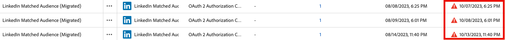

# Notes de mise à jour d’Adobe Experience Platform

>[!TIP]
>
>Reportez-vous à la documentation suivante pour les notes de mise à jour des autres applications Adobe Experience Platform :
>
>- [Adobe Journey Optimizer](https://experienceleague.adobe.com/fr/docs/journey-optimizer/using/whats-new/release-notes)
>- [Adobe Journey Optimizer B2B](https://experienceleague.adobe.com/fr/docs/journey-optimizer-b2b/user/release-notes)
>- [Customer Journey Analytics](https://experienceleague.adobe.com/fr/docs/analytics-platform/using/releases/pre-release-notes)
>- [Composition d’audiences fédérées](https://experienceleague.adobe.com/fr/docs/federated-audience-composition/using/e-release-notes)
>- [Collaboration dans Real-Time CDP](https://experienceleague.adobe.com/fr/docs/real-time-cdp-collaboration/using/latest)

**Date de publication : 23 septembre 2025**

Nouvelles fonctionnalités et mises à jour des fonctionnalités existantes dans Adobe Experience Platform :

- [Agent Orchestrator](#agent-orchestrator)
- [Alertes](#alerts)
- [Destinations](#destinations)
- [Modèle de données d’expérience (XDM)](#xdm)
- [Profil client en temps réel](#profile)
- [Service de segmentation](#segmentation-service)
- [Sources](#sources)

## Agent Orchestrator {#agent-orchestrator}

Adobe Experience Platform Agent Orchestrator est la nouvelle couche agentique d’Adobe Experience Platform.

**Nouvelles fonctionnalités**

| Fonctionnalité | Description |
| --- | --- |
| Agent Orchestrator | Adobe Experience Platform Agent Orchestrator est la nouvelle couche agentique d’Adobe Experience Platform. Conçu pour exploiter la richesse des données et des connaissances clientèle de la plateforme, Experience Platform Agent Orchestrator alimente l’intelligence et le raisonnement d’agents experts spécialement conçus pour Adobe Experience Platform, leur permettant d’exécuter des prises de décision complexes et de résoudre des problèmes à grande vitesse et à grande échelle, le tout sous supervision humaine. Lorsque vous posez des questions ou demandez de l’aide en langage naturel dans une interface conversationnelle telle que l’assistant IA, Agent Orchestrator fait automatiquement appel à des agentes et agents spécialisés pour vous fournir les bonnes réponses. Agent Orchestrator se souvient de l’historique de vos conversations, ce qui lui permet de s’appuyer naturellement sur vos questions précédentes sans répéter le contexte et de combiner les informations issues de plusieurs agentes et agents afin de vous présenter des réponses claires et unifiées. Pour en savoir plus, consultez la [documentation d’Agent Orchestrator](https://experienceleague.adobe.com/fr/docs/experience-cloud-ai/experience-cloud-ai/agents/agent-orchestrator). |
| Agent Audience | L’agent Audience vous permet d’obtenir des informations sur vos audiences, notamment : détecter des changements significatifs de taille d’audience, identifier les audiences dupliquées, explorer votre inventaire d’audiences et récupérer la taille de vos audiences. Pour en savoir plus, consultez la [documentation de l’agent Audience](https://experienceleague.adobe.com/fr/docs/experience-cloud-ai/experience-cloud-ai/agents/audience). |

Pour en savoir plus, consultez la [documentation d’Agent Orchestrator](https://experienceleague.adobe.com/fr/docs/experience-cloud-ai/experience-cloud-ai/home).

## Alertes {#alerts}

Experience Platform vous permet de vous abonner à des alertes basées sur des événements pour diverses activités Experience Platform. Vous pouvez vous abonner à différentes règles d’alerte par le biais de l’onglet [!UICONTROL Alertes] de l’interface utilisateur d’Experience Platform et choisir de recevoir des messages d’alerte dans l’interface utilisateur elle-même ou par le biais de notifications par e-mail.

**Nouvelles fonctionnalités**

| Fonctionnalité | Description |
| --- | --- |
| Alertes d’ingestion de profil en streaming | Vous pouvez désormais vous abonner à deux nouvelles alertes pour l’ingestion en flux continu au niveau du flux de données : <ul><li>Taux d’échec d’ingestion en flux continu dépassé</li><li>Taux de saut d’ingestion en flux continu dépassé</li></ul> Des alertes dans la plateforme ou par e-mail vous avertissent lorsque les seuils sont dépassés : soit le seuil par défaut, soit un seuil personnalisé que vous définissez. Pour plus d’informations, consultez le guide des [alertes de profil](../../observability/alerts/rules.md#profile). |

{style="table-layout:auto"}

Pour plus d’informations sur les alertes, consultez la [[!DNL Observability Insights] vue d’ensemble](../../observability/home.md).

## Destinations {#destinations}

Les [!DNL Destinations] sont des intégrations préconfigurées à des plateformes de destination qui permettent d’activer facilement des données provenant d’Experience Platform. Vous pouvez utiliser les destinations pour activer vos données connues et inconnues pour les campagnes marketing cross-canal, les campagnes par e-mail, la publicité ciblée et de nombreux autres cas d’utilisation.

**Fonctionnalités nouvelles ou mises à jour**

| Destination | Description |
| --- | --- |
| Connecteur [[!DNL Snowflake Batch]](../../destinations/catalog/warehouses/snowflake-batch.md) [!BADGE version bêta]{type=Informative} | Un nouveau connecteur [!DNL Snowflake Batch] est désormais disponible, offrant une alternative au connecteur de streaming pour certains cas d’utilisation spécifiques. |
| Prise en charge du chiffrement [[!DNL Data Landing Zone]](../../destinations/catalog/cloud-storage/data-landing-zone.md) | Vous pouvez désormais joindre des clés publiques au format RSA pour chiffrer vos fichiers exportés, vous offrant le même niveau de sécurité que celui fourni par d’autres destinations de stockage cloud pour vos informations sensibles. |
| Détails d’expiration de l’authentification pour les destinations [[!DNL Pinterest]](../../destinations/catalog/advertising/pinterest.md) | Les informations d’expiration de l’authentification pour les destinations [!DNL Pinterest] sont désormais visibles directement dans l’interface d’Experience Platform. Vous pouvez ainsi voir à quel moment votre authentification arrivera à expiration et la renouveler avant qu’elle ne provoque des interruptions de vos flux de données. Vous pouvez surveiller les dates d’expiration de votre jeton à partir de la colonne **[!UICONTROL Date d’expiration du compte]** dans les onglets **[[!UICONTROL Comptes]](../../destinations/ui/destinations-workspace.md#accounts)** ou **[[!UICONTROL Parcourir]](../../destinations/ui/destinations-workspace.md#browse)**. |

**Fonctionnalité nouvelle ou mise à jour**

| Fonctionnalité | Description |
| --- | --- |
| Capacités améliorées de gestion des destinations dans l’interface d’utilisation d’Experience Platform | Améliorez votre workflow de gestion des destinations avec de nouvelles fonctionnalités de tri dans les onglets [[!UICONTROL Parcourir]](../../destinations/ui/destinations-workspace.md#browse) et [[!UICONTROL Comptes]](../../destinations/ui/destinations-workspace.md#accounts). Vous pouvez désormais voir un indicateur visuel lorsque l’authentification de votre compte est sur le point d’expirer.   {width="100" zoomable="yes"} |
| Paramètres persistants de largeur de colonne | Les paramètres de largeur de colonne sont désormais conservés lorsque vous quittez une page et que vous y revenez. Par exemple, si vous ajustez la largeur d’une colonne dans l’onglet [[!UICONTROL &#x200B; Parcourir &#x200B;]](../../destinations/ui/destinations-workspace.md#browse), la largeur de votre colonne personnalisée reste la même lorsque vous quittez la page et revenez à cet onglet. |

Pour plus d’informations, consultez la [vue d’ensemble des destinations](../../destinations/home.md).

## Modèle de données d’expérience (XDM) {#xdm}

XDM est une spécification Open Source qui fournit des structures et des définitions communes (schémas) pour les données introduites dans Experience Platform. En adhérant aux normes XDM, toutes les données d’expérience client peuvent être intégrées dans une représentation commune afin de fournir des informations plus rapidement et de manière plus intégrée. Vous pouvez obtenir des informations précieuses à partir des actions des clients, définir des types d’audiences clientes par le biais de segments et utiliser les attributs du client à des fins de personnalisation.

**Nouvelles fonctionnalités**

| Fonctionnalité | Description |
| ------- | ----------- |
| Schémas relationnels | Simplifiez la modélisation de vos données à l’aide de schémas relationnels (anciennement appelés schémas basés sur des modèles). Vous pouvez désormais créer plus facilement des schémas à l’aide d’exemples et de conseils pratiques complets. Cette fonctionnalité est actuellement disponible pour les personnes titulaires de licences d’orchestration de campagne. Elle sera étendue aux clientes et clients de Data Distiller lors de la phase de disponibilité générale, ce qui rendra la modélisation des données plus accessible et plus efficace. Cette fonctionnalité prend en charge les données de série temporelle et les fonctionnalités de capture de données de modification. |

Pour plus d’informations, consultez la [vue d’ensemble XDM](../../xdm/home.md).

<!--

| Data Mirror | Ingest row-level changes from cloud data warehouses (e.g., Snowflake, Databricks, BigQuery) into Adobe Experience Platform using relational schemas. Data Mirror eliminates upstream ETL and preserves relationships, versioning, and deletions by mirroring existing database structures directly into the data lake. Time-series and record event schema behavior with change data capture capabilities are all supported. This feature is currently available for Campaign Orchestration license holders and will expand through this limited release, also including Customer Journey Analytics customers. See the [Data Mirror documentation](../../xdm/data-mirror/overview.md) for more details. Contact your Adobe representative for access. |
-->

## Profil client en temps réel {#profile}

Adobe Experience Platform vous permet d’offrir aux clients des expériences coordonnées, cohérentes et pertinentes, quel que soit l’endroit ou le moment où ils interagissent avec votre marque. Le profil client en temps réel offre une vue holistique de chaque client qui combine des données issues de plusieurs canaux, notamment des données en ligne, hors ligne, CRM et tierces. Le Profil vous permet de consolider vos données client en une vue unifiée offrant un compte horodaté et exploitable de chaque interaction client.

**Fonctionnalités mises à jour**

| Fonctionnalité | Description |
| ------- | ----------- |
| [!BADGE Alpha &#x200B;]{type=Informative} Cette fonctionnalité est actuellement disponible dans Alpha. Améliorations de la visionneuse de profils | La version de septembre 2025 comprend les améliorations suivantes pour la visionneuse de profils. <ul><li>**Vue combinée** : les attributs, événements et informations ont été combinés en une seule vue.</li><li>**Informations générées par l’IA** : la page des détails du profil affiche désormais des informations générées par l’IA, vous permettant de connaître les détails générés à partir de votre profil. Ces informations peuvent inclure des informations telles que les scores de propension et l’analyse des tendances.</li><li>**Mise à jour du style** : la page des détails du profil a été actualisée visuellement.</li><li>**Parcourir** : vous pouvez désormais explorer vos profils à l’aide d’un carrousel interactif basé sur une carte avec recherche et personnalisation.</li></ul> |

**Mises à jour importantes**

| Mise à jour | Description |
| ------ | ----------- |
| Abandon de l’API de suppression de profil | L’[API de suppression de profil](/help/profile/api/entities.md#delete-entity) sera abandonnée d’ici la fin octobre 2025. Si vous souhaitez effectuer des opérations de suppression d’enregistrements, vous pouvez utiliser le workflow [&#x200B; API de suppression des enregistrements du cycle de vie des données &#x200B;](/help/hygiene/api/workorder.md) ou le workflow de l’interface utilisateur de suppression des enregistrements du cycle de vie des données [&#128279;](/help/hygiene/ui/record-delete.md) à la place. Les workflows de cycle de vie des données fournissent un suivi de bout en bout du cycle de vie ainsi que des quotas mensuels que vous pouvez afficher et gérer.   Une fois le point d’entrée obsolète, tout utilisateur qui l’utilise actuellement continuera à y avoir accès. La fin de vie de ce sera annoncée séparément. Pour toute question, contactez l’Assistance clientèle d’Adobe. |

Pour plus d’informations, consultez la [vue d’ensemble du profil client en temps réel](../../profile/home.md).

## Service de segmentation {#segmentation-service}

[!DNL Segmentation Service] définit un sous-ensemble particulier de profils en décrivant les critères qui identifient un groupe de clients potentiels de votre base. Les audiences peuvent être basées sur des données d’enregistrement (telles que des informations démographiques) ou des événements de séries temporelles représentant les interactions de la clientèle avec votre marque.

**Fonctionnalités nouvelles ou mises à jour**

| Fonctionnalité | Description |
| ------- | ----------- |
| Abandon des audiences de comptes avec événements d’expérience | Après la mise à niveau de l’architecture B2B, les audiences de comptes avec événements d’expérience ne sont plus prises en charge. Utilisez plutôt la nouvelle approche segment de segments : créez une audience Personnes avec des événements d’expérience, puis référencez cette audience Personnes lors de la création d’une audience de compte. Cela offre une approche plus flexible et plus facile à maintenir pour la création d’audiences B2B. |

**Mises à jour importantes**

| Mise à jour | Description |
| ------- | ----------- |
| Annulation de l’actualisation automatique des estimations d’audience | L’amélioration relative à l’actualisation automatique des estimations d’audience a été annulée. Les estimations d’audience continueront d’être générées dans le créateur de segments, mais la fonctionnalité d’actualisation automatique a été supprimée. |
| Audience externe | À partir du 30 septembre, les audiences externes seront récupérées via la recherche unifiée dans le créateur de segments. Si vous utilisez la correspondance de segments, vous pouvez activer l’expérience héritée dans le créateur de segments. |

Pour plus d’informations, consultez la [[!DNL Segmentation Service] vue d’ensemble](../../segmentation/home.md).

## Sources {#sources}

Experience Platform fournit une API RESTful et une interface utilisateur interactive qui vous permet de configurer facilement des connexions source à différents fournisseurs de données. Ces connexions source vous permettent de vous authentifier et de vous connecter à des services de gestion de la relation client et à des systèmes de stockage externes, de définir des heures d’ingestion et de gérer le débit d’ingestion des données.

**Fonctionnalités nouvelles ou mises à jour**

| Fonctionnalité | Description |
| --- | --- |
| Nouvelles sources en disponibilité générale | Les sources suivantes sont désormais en disponibilité générale : plusieurs connecteurs de sources ont été mis à jour de la version bêta vers la disponibilité générale. <ul><li>[Ingestion de données Acxiom](../../sources/connectors/data-partners/acxiom-data-ingestion.md)</li><li>[Ingestion de données prospects Acxiom](../../sources/connectors/data-partners/acxiom-prospecting-data-import.md)</li><li>[Merkury Enterprise](../../sources/connectors/data-partners/merkury.md)</li><li>[SAP Commerce](../../sources/connectors/ecommerce/sap-commerce.md)</li></ul>. Ces sources sont désormais entièrement prises en charge et prêtes pour une utilisation en production. |
| Prise en charge de l’authentification par paire de clés [!DNL Snowflake] | Sécurité renforcée pour les connexions Snowflake, avec prise en charge de l’authentification par paire de clés. L’authentification de base (nom d’utilisateur ou d’utilisatrice/mot de passe) sera abandonnée d’ici novembre 2025 ; les clientes et clients sont donc encouragés à migrer vers l’authentification par paire de clés afin d’améliorer la sécurité. Pour plus d’informations, consultez la [[!DNL Snowflake] documentation](../../sources/connectors/databases/snowflake.md). |
| [!BADGE Version bêta]{type=Informative} [!DNL Capillary Streaming Events] | Utilisez la source [[!DNL Capillary Streaming Events] &#x200B;](../../sources/connectors/loyalty/capillary.md) pour diffuser les données de fidélité de votre compte [!DNL Capillary] vers Experience Platform. |
| [!BADGE Version bêta]{type=Informative} [!DNL Relay Connector] | Utilisez l’[[!DNL Relay Connector]](../../sources/tutorials/ui/create/marketing-automation/relay-connector.md) pour diffuser des données d’événements à partir de votre intégration [!DNL Relay Network] dans Experience Platform. |
| Disponibilité générale de la prise en charge des liens privés dans les sources | Vous pouvez désormais utiliser des **liens privés** pour un groupe de sources sélectionné. Utilisez cette fonctionnalité pour créer un point d’entrée privé auquel votre source peut se connecter. Grâce aux points d’entrée privés, vous pouvez configurer des connexions et des flux de données qui contournent l’Internet public, ce qui vous offre une sécurité et un isolement réseau accrus pour vos données sensibles. La prise en charge de liens privés est disponible pour les sources suivantes : <ul><li>[[!DNL Azure Blob Storage]](../../sources/connectors/cloud-storage/blob.md)</li><li>[[!DNL ADLS Gen2]](../../sources/connectors/cloud-storage/adls-gen2.md)</li><li>[[!DNL Azure File Storage]](../../sources/connectors/cloud-storage/azure-file-storage.md)</li></ul>. Pour plus d’informations, consultez les guides sur la création de liens privés [dans l’API](../../sources/tutorials/api/private-link.md) et [dans l’interface d’utilisation](../../sources/tutorials/ui/private-link.md). |

Pour plus d’informations, consultez la [vue d’ensemble des sources](../../sources/home.md).