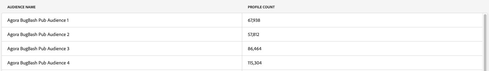

# Notes de mise à jour d’Adobe Experience Platform

>[!TIP]
>
>Reportez-vous à la documentation suivante pour les notes de mise à jour des autres applications Adobe Experience Platform :
>
>- [Adobe Journey Optimizer](https://experienceleague.adobe.com/fr/docs/journey-optimizer/using/whats-new/release-notes)
>- [Adobe Journey Optimizer B2B](https://experienceleague.adobe.com/fr/docs/journey-optimizer-b2b/user/release-notes)
>- [Customer Journey Analytics](https://experienceleague.adobe.com/fr/docs/analytics-platform/using/releases/latest)
>- [Composition d’audiences fédérées](https://experienceleague.adobe.com/fr/docs/federated-audience-composition/using/release-notes)
>- [Collaboration dans Real-Time CDP](https://experienceleague.adobe.com/fr/docs/real-time-cdp-collaboration/using/latest)

**Date de publication : 28 avril 2026**

Nouvelles fonctionnalités et mises à jour des fonctionnalités existantes dans Adobe Experience Platform :

- [Collecte de données](#data-collection)
- [Destinations](#destinations)
- [Modèle de données d’expérience (XDM)](#xdm)
- [Service de requête](#query-service)
- [Real-Time CDP](#rtcdp)
- [Sandbox](#sandboxes)
- [Sources](#sources)

## Collecte de données {#data-collection}

Adobe Experience Platform fournit une suite de technologies qui vous permettent de collecter des données d’expérience client côté client. Vous pouvez ensuite les envoyer à Adobe Experience Platform Edge Network pour les enrichir, les transformer et les distribuer vers des destinations Adobe ou autres qu’Adobe.

**Fonctionnalités nouvelles ou mises à jour**

| Fonctionnalité | Description |
| --- | --- |
| Afficher les détails de la version | Vous pouvez désormais accéder aux versions et aux détails de la version à partir d’une bibliothèque ou d’un environnement pour afficher la version actuellement active et inspecter le contenu (extensions, éléments de données et règles). Pour plus d’informations, consultez la [présentation des versions](../../tags/ui/publishing/builds.md#build-details). |

{style="table-layout:auto"}

Pour plus d’informations, consultez la [présentation de la collecte de données](../../tags/home.md).

## Destinations {#destinations}

[!DNL Destinations] sont des intégrations préconfigurées à des plateformes de destination. Utilisez les destinations pour activer vos données connues et inconnues pour les campagnes marketing cross-canal, les campagnes par e-mail, la publicité ciblée et de nombreux autres cas d’utilisation.

**Fonctionnalités nouvelles ou mises à jour**

| Destination | Description |
| --- | --- |
| [!BADGE Beta ]{type=Informative} [Correspondance client Microsoft Ads](../../destinations/catalog/advertising/microsoft-ads-customer-match.md) | Faites correspondre les clients par adresse e-mail et reprenez contact avec eux dans l’ensemble du [!DNL Microsoft Advertising Network], y compris grâce aux annonces Search et Audience. Liez votre compte [!DNL Microsoft Advertising] à Real-Time CDP pour automatiser la création et la gestion des listes de correspondance client directement depuis Experience Platform. Pour obtenir l’accès, contactez votre gestionnaire de compte Adobe. |
| [!BADGE ]{type=Informative} [Audience Personnalisée Reddit](../../destinations/catalog/advertising/reddit-custom-audience.md) | Envoyez des audiences d’Experience Platform vers [!DNL Reddit Ads]. Connectez votre compte [!DNL Reddit], mappez des identités et activez des audiences pour atteindre les personnes qui explorent activement leurs intérêts sur [!DNL Reddit]. |
| [Amazon Ads v2](../../destinations/catalog/advertising/amazon-ads-v2.md) | Utilisez la carte [!DNL Amazon Ads v2] pour toutes les nouvelles connexions [!DNL Amazon Ads]. [!DNL Amazon Ads v2] se connecte à [!DNL Ads Data Manager], qui prend en charge les types d’identité étendus, les champs liés aux adresses et le partage de données entre les produits [!DNL Amazon Ads], ce qui améliore le ciblage et les taux de correspondance d’audience. Le connecteur [!DNL Amazon Ads] existant dans le catalogue a été renommé [ (hérité) [!DNL Amazon Ads]](../../destinations/catalog/advertising/amazon-ads.md). Si vous disposez d’une connexion héritée existante, elle continue à fonctionner sans aucune modification requise. |
| [[!DNL Rokt]](../../destinations/catalog/advertising/rokt.md) | Utilisez [!DNL Rokt] pour connecter les audiences Experience Platform à la prise de décision en temps réel pilotée par l’IA, améliorant ainsi les performances des campagnes grâce à un ciblage, une suppression et une personnalisation plus précis. |
| [Connexion à l’audience Acxiom](../../destinations/catalog/advertising/acxiom-audience-connection.md) | La destination [!DNL Acxiom Audience Connection] est désormais disponible pour tous. Utilisez-le pour améliorer les audiences avec la technologie [!DNL Acxiom's Real ID] et les activer en [!DNL Altice], [!DNL Ampersand], [!DNL Comcast], [!DNL Cox], [!DNL Facebook], [!DNL Amazon], [!DNL Pinterest], [!DNL Vizio], [!DNL LG Ads], [!DNL Spectrum] et [!DNL Viant]. |
| [Connexion à l’audience Acxiom Real ID](../../destinations/catalog/advertising/acxiom-real-id-audience-connection.md) | La destination [!DNL Acxiom Real ID Audience Connection] est désormais disponible pour tous. Utilisez-la pour activer les audiences à l’aide de [!DNL Acxiom's Real ID] comme clé de correspondance dans [!DNL Altice], [!DNL Ampersand], [!DNL Comcast], [!DNL Cox], [!DNL Facebook], [!DNL Amazon], [!DNL Pinterest], [!DNL Vizio], [!DNL LG Ads], [!DNL Spectrum] et [!DNL Viant]. |

{style="table-layout:auto"}

**Correctifs et améliorations**

| Corriger | Description |
| --- | --- |
| Nouvelle colonne `TS` pour les destinations [Snowflake Streaming](../../destinations/catalog/warehouses/snowflake.md) | La destination [Snowflake Streaming](../../destinations/catalog/warehouses/snowflake.md) inclut désormais une colonne d’horodatage `TS` dans le tableau partagé, indiquant la date de la dernière mise à jour de chaque ligne. Cette mise à jour sera déployée jusqu’à la fin du mois d’avril. |
| Prise en charge de la surveillance des destinations [Custom Personalization](../../destinations/catalog/personalization/custom-personalization.md) | La page [exécutions de flux de données](../../dataflows/ui/monitor-destinations.md#dataflow-runs-for-streaming-destinations) affiche désormais les mesures pour les destinations [Personalization personnalisé](../../destinations/catalog/personalization/custom-personalization.md). Auparavant, ces mesures n’étaient pas disponibles pour ce type de destination. Utilisez-les pour vérifier que les audiences s’activent comme prévu et pour diagnostiquer les problèmes.   {zoomable="yes"} |
| Nombre de profils dans l’étape de révision du workflow d’activation | L’étape de révision du workflow d’activation affiche désormais le nombre de profils pour les audiences déjà activées. Le nombre de profils est également affiché pour les [destinations de diffusion en continu](../../destinations/ui/activate-segment-streaming-destinations.md), et pas seulement pour les [destinations par lots](../../destinations/ui/activate-batch-profile-destinations.md).   {zoomable="yes"} |
| Visibilité de l’expiration du jeton d’[!DNL Pinterest] | La destination [[!DNL Pinterest]](../../destinations/catalog/advertising/pinterest.md) affiche désormais la date d’expiration du jeton afin que vous puissiez voir quand une réauthentification est nécessaire. [!DNL Pinterest] jetons expirent tous les 30 jours. Lorsqu’un jeton expire, les exportations de données cessent de fonctionner. Pour éviter les interruptions, [actualisez vos informations d’authentification](../../destinations/catalog/advertising/pinterest.md#refresh-authentication-credentials) avant l’expiration du jeton. |
| Exporter le fichier maintenant désactivé pour les plannings expirés | Lorsque le planning de votre audience a expiré, **[!UICONTROL Export file now]** est désormais désactivé avant que vous ne tentiez de l’utiliser et une info-bulle explique pourquoi. Auparavant, la sélection de l’action entraînait une erreur.   {zoomable="yes"} |
| Correctif de visibilité de colonne dans le workflow d’activation | Correction d’un problème en raison duquel la modification des colonnes visibles dans une table affectait incorrectement les autres tables du workflow d’activation. |

{style="table-layout:auto"}

Pour plus d’informations, consultez la [vue d’ensemble des destinations](../../destinations/home.md).

## Modèle de données d’expérience (XDM) {#xdm}

XDM est une spécification Open Source qui fournit des structures et des définitions communes (schémas) pour les données introduites dans Experience Platform. En adhérant aux normes XDM, toutes les données d’expérience client peuvent être intégrées dans une représentation commune afin de fournir des informations plus rapidement et de manière plus intégrée. Vous pouvez obtenir des informations précieuses à partir des actions des clients, définir des types d’audiences clientes par le biais de segments et utiliser les attributs du client à des fins de personnalisation.

| Fonctionnalité | Description |
| --- | --- |
| Améliorations De L’Utilisation Et De La Découverte Des Groupes De Champs | Affichez les schémas qui utilisent un groupe de champs et accédez aux métadonnées telles que les classes compatibles, les attributs requis et les libellés de gouvernance directement dans l’interface utilisateur. Vous pouvez également filtrer les groupes de champs par compatibilité de classe et balises de secteur pour découvrir plus efficacement les ressources pertinentes et évaluer l’impact avant d’apporter des modifications. Pour plus d’informations, consultez le guide [Explorer les groupes de champs](../../xdm/ui/explore.md#explore-field-groups.md) . |

Pour plus d’informations, consultez la [vue d’ensemble XDM](../../xdm/home.md).

## Service de requête {#query-service}

Utilisez Query Service pour interroger des données dans Adobe Experience Platform [!DNL Data Lake] avec le langage SQL standard. Rejoignez n’importe quel jeu de données du [!DNL Data Lake] et capturez les résultats de la requête sous la forme d’un nouveau jeu de données à utiliser dans les rapports, dans le Workspace de science des données ou lors de l’ingestion dans le profil client en temps réel.

**Fonctionnalités nouvelles ou mises à jour**

| Fonctionnalité | Description |
| --- | --- |
| Gestion de session Query Service | Affichez et mettez fin aux sessions Query Service actives à partir de l’onglet [!UICONTROL Admin] pour surveiller l’utilisation et libérer la capacité de session inactive. Cela permet aux administrateurs de gérer des workflows Data Distiller fiables en récupérant de la capacité à partir de sessions inactives. Pour plus d’informations, consultez le guide [Gérer les sessions de Query Service](../../query-service/ui/session-management.md). |

{style="table-layout:auto"}

Pour plus d’informations, consultez la [présentation de Query Service](../../query-service/home.md).

## Real-Time CDP {#rtcdp}

Real-Time CDP fournit des profils clients unifiés et exploitables en ingérant, traitant et activant des données sur plusieurs canaux en temps réel. Avec Real-Time CDP, les entreprises peuvent connecter des sources de données existantes, créer et activer des audiences enrichies et assurer une activation conforme à la confidentialité entre les destinations, le tout depuis Experience Platform. Les spécialistes marketing, les analystes et les équipes informatiques peuvent ainsi proposer à leurs clients des expériences hautement personnalisées en temps voulu, grâce à des campagnes marketing cross-canal transparentes.

**Fonctionnalités nouvelles ou mises à jour**

| Fonctionnalité | Description |
| --- | --- |
| Real-Time CDP MCP (Beta) | Utilisez le [MCP ](../../rtcdp/rtcdp-mcp.md) pour importer Real-Time CDP dans les agents d’IA et les clients compatibles avec MCP, ce qui vous permet d’interagir avec les outils Real-Time CDP directement via votre expérience LLM native. En connectant un client compatible MCP (tel que Claude, ChatGPT, Claude Code, Codex, Curseur ou VS Code) au point d’entrée fourni par votre représentant Adobe, vous pouvez utiliser un langage naturel pour inspecter les audiences, la configuration de destination et l’historique d’exécution de l’activation, sans écrire d’appels d’API REST Experience Platform ni parcourir plusieurs workflows d’interface utilisateur. Après vous être connecté à Adobe à l’aide d’un navigateur, vous disposez d’un accès en lecture seule aux outils suivants : <ul><li>Rechercher des audiences existantes</li><li>Prévisualiser L’Appartenance À Une Audience</li><li>Liste des types de destination</li><li>Liste des comptes configurés</li><li>Liste des destinations configurées</li><li>Liste des connexions Source</li><li>Liste des connexions cibles</li><li>Inspecter les exécutions d’activation</li></ul>. Chaque requête nécessite des paramètres `imsOrgId` et `sandboxName` pour s’assurer que les actions sont limitées à votre organisation et à votre sandbox. **Remarque** : les opérations d’écriture ne sont pas prises en charge dans cette version de Beta. |

{style="table-layout:auto"}

Pour plus d&#39;informations, lisez la présentation de Real-Time CDP .

## Sandbox {#sandboxes}

Adobe Experience Platform est conçu pour enrichir les applications d’expérience digitale à l’échelle mondiale. Les entreprises exécutent souvent plusieurs applications d’expérience digitale en parallèle et doivent prendre en charge le développement, les tests et le déploiement de ces applications tout en assurant la conformité opérationnelle.

**Fonctionnalités nouvelles ou mises à jour**

| Fonctionnalité | Description |
| --- | --- |
| Copie express | Utilisez Express Copy pour copier des objets dans un sandbox cible en une seule action à partir de l’[interface utilisateur de l’outil Sandbox](/help/sandboxes/ui/sandbox-tooling.md#express-copy). Les objets dépendants sont détectés automatiquement et sont créés dans le sandbox cible ou réutilisés lorsqu’ils existent déjà. |

{style="table-layout:auto"}

Pour plus d’informations, consultez la [présentation des sandbox](../../sandboxes/home.md).

## Sources {#sources}

Experience Platform fournit une API RESTful et une interface utilisateur interactive qui vous permet de configurer facilement des connexions source à différents fournisseurs de données. Ces connexions source vous permettent de vous authentifier et de vous connecter à des services de gestion de la relation client et à des systèmes de stockage externes, de définir des heures d’ingestion et de gérer le débit d’ingestion des données.

**Sources nouvelles ou mises à jour**

| Source | Description |
| --- | --- |
| [!BADGE Version bêta]{type=Informative} [!DNL Talon.One] | La [[!DNL Talon.One] source](../../sources/connectors/loyalty/talon-one.md) pour Experience Platform est désormais disponible en modes batch et streaming. Utilisez le [[!DNL Talon.One Batch Source Connector]](../../sources/tutorials/ui/create/loyalty/talon-one-batch.md) pour ingérer régulièrement des sessions fermées et des transactions de fidélité historiques, ainsi que la source de [[!DNL Talon.One Streaming Events]](../../sources/tutorials/ui/create/loyalty/talon-one-streaming.md) pour importer des événements [!DNL Talon.One] dans Experience Platform en temps quasi réel. Ensemble, ils facilitent le chargement et l’activation des données de fidélité [!DNL Talon.One] dans Real-Time CDP, Adobe Journey Optimizer et Offer Decisioning. |
| Prise en charge du filtrage au niveau des lignes pour les [!DNL Salesforce] utilisant SOQL | Vous pouvez désormais appliquer des filtres SOQL (Object Query Language) [!DNL Salesforce] directement dans [!DNL Salesforce] connexions source, ce qui vous permet de restreindre les données au niveau des lignes avant qu’elles ne soient ingérées dans Experience Platform. Utilisez cette fonctionnalité pour : <ul><li>Définissez des conditions de style SOQL avec clause WHERE sur les objets Salesforce (par exemple, seuls les prospects dont la != e-mail est nulle ou les opportunités dans des étapes spécifiques).</li><li>Limitez l’ingestion aux seules lignes qui répondent à vos critères, ce qui réduit les déplacements de données, le stockage et le traitement en aval inutiles</li><li>Alignez plus étroitement l’ingestion Experience Platform sur vos règles de conformité et d’accès aux données CRM, en contrôlant quels enregistrements sont importés dans Experience Platform à la source</li></ul>. Pour plus d’informations, consultez le guide sur le [filtrage au niveau des lignes pour les sources](../../sources/tutorials/api/filter.md). |

{style="table-layout:auto"}

Pour plus d’informations, consultez la [vue d’ensemble des sources](../../sources/home.md).

<!--

| Data Distiller Accelerators | Run and schedule Adobe-managed, parameterized SQL templates in the Query Service UI to perform common analyses without writing SQL. This helps you standardize analytics workflows and reuse trusted query logic across your organization. See the [Data Distiller accelerators guide](../../query-service/ui/accelerators.md) for more details. |

| [!DNL Delta Sharing] | You can use the [!DNL Delta Sharing] source to bring Delta tables into Experience Platform through a secure, open data‑sharing protocol. After you configure a [!DNL Delta Sharing] connection and select the shares and tables you want to ingest, Platform automatically brings that data into your datasets so you can use it for analysis, segmentation, and activation. |
| [!DNL Meta Ads] (Beta) | You can use the [!DNL Meta Ads] source connector (Beta) in the Sources workspace to authenticate to [!DNL Meta], select your ad accounts, and schedule ingestion of [!DNL Meta Ads] campaign and performance data into Experience Platform datasets. |

| Automatic dataflow disabling | Sources ingestion dataflows that fail continuously for 30 days are automatically disabled, helping to surface unhealthy dataflows and reduce repeated failed runs. |

-->
