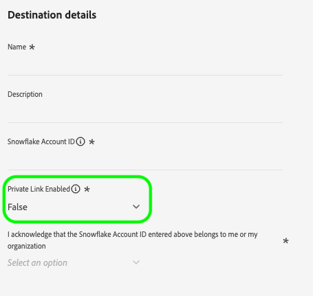
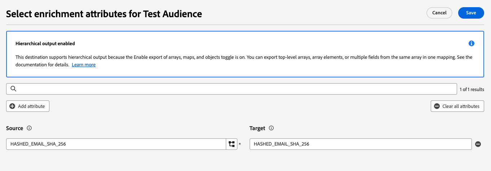
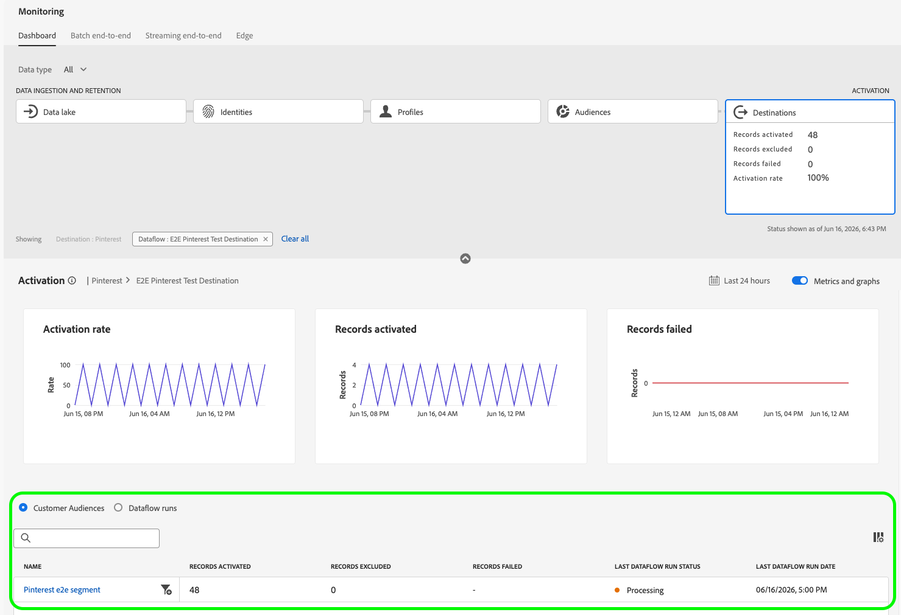
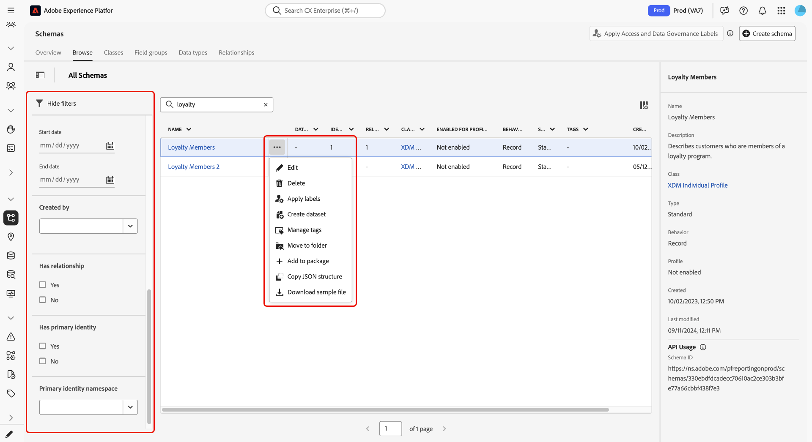

# Notes de mise à jour d’Adobe Experience Platform

>[!TIP]
>
>Reportez-vous à la documentation suivante pour les notes de mise à jour des autres applications Adobe Experience Platform :
>
>- [Adobe Journey Optimizer](https://experienceleague.adobe.com/fr/docs/journey-optimizer/using/whats-new/release-notes)
>- [Adobe Journey Optimizer B2B](https://experienceleague.adobe.com/fr/docs/journey-optimizer-b2b/user/release-notes)
>- [Customer Journey Analytics](https://experienceleague.adobe.com/fr/docs/analytics-platform/using/releases/latest)
>- [Composition d’audiences fédérées](https://experienceleague.adobe.com/fr/docs/federated-audience-composition/using/release-notes)
>- [Collaboration dans Real-Time CDP](https://experienceleague.adobe.com/fr/docs/real-time-cdp-collaboration/using/latest)

**Date de publication : 16 juin 2026**

Nouvelles fonctionnalités et mises à jour des fonctionnalités existantes dans Adobe Experience Platform :

- [Agent Orchestrator](#agent-orchestrator)
- [Destinations](#destinations)
- [Modèle de données d’expérience (XDM)](#xdm)
- [Service de requête](#query-service)
- [Profil client en temps réel](#profile)
- [Exécuter et exploiter](#run-and-operate)
- [Service de segmentation](#segmentation-service)
- [Sources](#sources)

## Agent Orchestrator {#agent-orchestrator}

Utilisez Agent Orchestrator pour automatiser les workflows et impliquer les clients sur plusieurs canaux à l’aide d’agents optimisés par l’IA.

**Fonctionnalités nouvelles ou mises à jour**

| Fonctionnalité | Description |
| --- | --- |
| Valider vos données dans l’assistant d’IA | Identifiez plus rapidement les problèmes de qualité des données et fiez-vous davantage à vos jeux de données Adobe Experience Platform grâce à la validation des données dans l’assistant AI. Optimisée par Agent Orchestrator, cette fonctionnalité analyse les jeux de données, identifie les problèmes de qualité des données et fournit des informations exploitables pour faciliter le diagnostic et la résolution des problèmes. Pour plus d’informations, consultez le guide sur la [validation de vos données dans l’assistant AI](https://experienceleague.adobe.com/en/docs/experience-cloud-ai/experience-cloud-ai/agents/data-validation). |

{style="table-layout:auto"}

Pour en savoir plus, consultez la [documentation d’Agent Orchestrator](https://experienceleague.adobe.com/fr/docs/experience-cloud-ai/experience-cloud-ai/agents/agent-orchestrator).

## Destinations {#destinations}

Les [!DNL Destinations] sont des intégrations préconfigurées à des plateformes de destination qui permettent d’activer facilement des données provenant d’Experience Platform. Vous pouvez utiliser les destinations pour activer vos données connues et inconnues pour les campagnes marketing cross-canal, les campagnes par e-mail, la publicité ciblée et de nombreux autres cas d’utilisation.

**Fonctionnalités nouvelles ou mises à jour**

| Fonctionnalité | Description |
| --- | --- |
| {type=Informative} [Quand activer &#x200B;](../../destinations/ui/when-to-activate.md) | Contrôler les types de modification de profil qui déclenchent des exportations vers une destination. Activez ou désactivez trois types de déclencheurs par flux de données : modifications d’attributs, qualification et disqualification d’audience et modifications d’identité. Les trois déclencheurs sont activés par défaut. En version bêta, cette fonctionnalité est disponible sur demande. Contactez votre représentant Adobe pour demander l’accès.   {zoomable="yes"} |
| [Lien privé Azure pour les destinations Azure](../../destinations/catalog/cloud-storage/azure-private-link.md) | Acheminez les exportations de données vers [[!DNL Azure Blob Storage]](../../destinations/catalog/cloud-storage/azure-blob.md), [[!DNL Azure Data Lake Storage Gen2]](../../destinations/catalog/cloud-storage/adls-gen2.md) et [[!DNL Azure Event Hubs]](../../destinations/catalog/cloud-storage/azure-event-hubs.md) via des adresses IP privées sur la colonne vertébrale [!DNL Microsoft Azure] plutôt que sur l’Internet public. Cette fonctionnalité est disponible pour les clients et clientes disposant de droits **Healthcare Shield** ou **Privacy and Security Shield**. Contactez votre représentant Adobe pour demander la configuration. |
| Prise en charge d’[[!DNL Snowflake Streaming]](../../destinations/catalog/warehouses/snowflake.md) et de [[!DNL Snowflake Batch]](../../destinations/catalog/warehouses/snowflake-batch.md) Private Link | Un nouveau sélecteur de liste déroulante **[!UICONTROL Lien privé activé]** est désormais disponible lors de la configuration de connexions de destination par lots et en flux continu [!DNL Snowflake]. Activez cette option uniquement si votre compte [!DNL Snowflake] est configuré pour un accès entrant privé uniquement lié. Si vous laissez ce paramètre défini sur **[!UICONTROL False]** pour les comptes de liaison privés uniquement, le partage des données échoue. Cette mise à jour est déployée jusqu’au 19 juin 2026.   {zoomable="yes"} |
| {type=Informative} [Exportez des tableaux en tant qu’attributs d’enrichissement](../../destinations/ui/activate-batch-profile-destinations.md#select-enrichment-attributes) | Exportez les champs du tableau en tant qu’attributs d’enrichissement lors de l’activation des audiences vers des destinations d’espace de stockage. Sélectionnez des champs individuels dans un tableau d’objets ou exportez le tableau complet. Les données sont ensuite exportées en tant que colonnes distinctes dans les sorties JSON et Parquet.   {zoomable="yes"} |
| [[!DNL Google Ad Manager 360]](../../destinations/catalog/advertising/google-ad-manager-360-connection.md) désormais généralement disponible | La destination [!DNL Google Ad Manager 360] (anciennement en version Beta) est désormais disponible pour tous. |
| [[!DNL Google Customer Match + Display & Video 360]](../../destinations/catalog/advertising/google-customer-match-dv360.md) désormais généralement disponible | La destination [!DNL Google Customer Match + Display & Video 360] (anciennement en disponibilité limitée) est désormais disponible pour tous. |
| [Rapports au niveau de l’audience pour les destinations supplémentaires](../../dataflows/ui/monitor-destinations.md#audience-level-view) | Les rapports au niveau de l’audience sont désormais disponibles pour plusieurs destinations à forte utilisation : [Facebook](../../destinations/catalog/social/facebook.md), [TikTok](../../destinations/catalog/social/tiktok.md), [(hérité) Amazon Ads](../../destinations/catalog/advertising/amazon-ads.md), [Braze](../../destinations/catalog/mobile-engagement/braze.md), [LinkedIn Matched Audiences](../../destinations/catalog/social/linkedin.md), [(Entreprises) LinkedIn](../../destinations/catalog/social/linkedin-b2b.md), [Twitter Custom Audiences](../../destinations/catalog/social/twitter.md), [Pinterest Customer List](../../destinations/catalog/advertising/pinterest.md), [Salesforce CRM](../../destinations/catalog/crm/salesforce.md), [Mailchimp Tags](../../destinations/catalog/email-marketing/mailchimp-tags.md), [Gainsight PX](../../destinations/catalog/analytics/gainsight-px.md) et [Demandbase People](../../destinations/catalog/advertising/demandbase-people.md). Auparavant, ces destinations ne prenaient en charge que les rapports au niveau de l’exécution du flux de données, ce qui rendait plus difficile la compréhension du nombre de profils activés pour chaque audience. Pour plus d’informations, consultez la documentation sur la [vue au niveau de l’audience](../../dataflows/ui/monitor-destinations.md#audience-level-view).   {zoomable="yes"} |
| [[!DNL Amazon Ads]](../../destinations/catalog/advertising/amazon-ads-v2.md) renommé [!DNL Amazon Ads v2] | [!DNL Amazon Ads] (anciennement [!DNL Amazon Ads v2]) est désormais la destination recommandée pour l’exportation de données vers [!DNL Amazon Ads]. La carte de destination [(héritée) Amazon Ads](../../destinations/catalog/advertising/amazon-ads.md) sera masquée à la fin du mois de juillet 2026. |

{style="table-layout:auto"}

**Correctifs et améliorations**

| Corriger | Description |
| --- | --- |
| [[!DNL Reddit Custom Audience]](../../destinations/catalog/advertising/reddit-custom-audience.md) le correctif d’activation | Correction d’un problème qui empêchait les clients d’activer les données lorsqu’ils le tentaient plus de 24 heures après l’authentification. |
| Application d’audience restreinte [[!DNL Facebook]](../../destinations/catalog/social/facebook.md) | À compter du 8 juin 2026, [!DNL Facebook] bloquera les audiences contenant des données restreintes ou sensibles (telles que des informations financières ou de santé) en vertu de ses Conditions d’utilisation. Consultez la section [données d’audience restreintes](../../destinations/catalog/social/facebook.md#restricted-audiences) pour connaître les étapes de dépannage. |
| [Mise à jour du mécanisme de sécurisation pour l’activation des audiences externes](../../destinations/guardrails.md#batch-file-based-activation) | Le nombre maximal d’audiences externes (telles que le chargement personnalisé, la composition d’audiences fédérées et la composition d’audiences) pouvant être activées par instance de destination a été porté à 100. |
| [Fractionnement de fichier d’exportation de jeu de données](../../destinations/ui/export-datasets.md) | Auparavant, les jeux de données contenant moins de 50 000 enregistrements étaient parfois divisés en plusieurs fichiers. Les jeux de données contenant 50 000 enregistrements ou moins sont désormais toujours exportés en tant que fichier unique. |

{style="table-layout:auto"}

Pour plus d’informations, consultez la [vue d’ensemble des destinations](../../destinations/home.md).

## Modèle de données d’expérience (XDM) {#xdm}

Le modèle de données d’expérience (XDM) est une spécification open source qui fournit des structures et des définitions communes (schémas) pour les données introduites dans Experience Platform.

**Fonctionnalités nouvelles ou mises à jour**

| Fonctionnalité | Description |
| --- | --- |
| [Améliorations de l’inventaire des schémas](../../xdm/ui/resources/schemas.md) | La page de navigation des schémas comprend désormais des métadonnées de schéma supplémentaires, des options de filtrage amélioré, des balises et des dossiers définis par l’utilisateur, ainsi que des actions intégrées pour les tâches courantes de gestion des schémas. Ces mises à jour vous aident à rechercher, organiser et gérer des schémas plus efficacement à partir d’un seul emplacement.   {zoomable="yes"} |

{style="table-layout:auto"}

Pour plus d’informations, consultez la [vue d’ensemble XDM](../../xdm/home.md).

## Profil client en temps réel {#real-time-customer-profile}

Le profil client en temps réel offre une vue complète de chaque client en combinant des données issues de plusieurs canaux, notamment des données en ligne, hors ligne, CRM et tierces. Utilisez le profil pour consolider vos données client en une vue unifiée offrant un compte horodaté et exploitable de chaque interaction client.

**Fonctionnalités nouvelles ou mises à jour**

| Fonctionnalité | Description |
| ------- | ----------- |
| Ingestion de profils par lots | L’ingestion de profils par lots applique désormais la validation du format sur les valeurs de `_id` des événements d’expérience. Les enregistrements contenant des caractères restreints dans le champ `_id` sont rejetés au moment de l’ingestion dans le magasin de profils. Cette validation est appliquée au niveau des enregistrements. Les lots continuent à être traités avec succès, tandis que seuls les enregistrements non conformes sont ignorés par le magasin de profils. Les clients et clientes peuvent corriger les valeurs de `_id` non valides et renvoyer les enregistrements concernés, sans perte de données permanente. Pour plus d’informations, consultez la documentation de la classe [XDM ExperienceEvent](/help/xdm/classes/experienceevent.md). |

## Exécuter et exploiter {#run-and-operate}

**Fonctionnalités nouvelles ou mises à jour**

| Fonctionnalité | Description |
| --- | --- |
| [Détection de motifs dans les planifications de tâches](../../run-and-operate/job-schedules-anti-patterns.md) | Trois antimodèles sont désormais automatiquement détectés dans la vue Planifications de tâches : plus de 90 exécutions d’ingestion de profils par jour, ingestion de profils planifiée trop proche de la segmentation et segmentation planifiée trop proche de l’activation de destination. La recherche en amont des 7 derniers jours comprend désormais une vue Calendrier pour la sélection de la date. Cette fonctionnalité sera déployée jusqu’à la fin juin 2026. |
| [Contrôles d’intégrité pour P-TTL et e-TTL](../../run-and-operate/health-checks.md) | Deux nouveaux contrôles d’intégrité sont désormais disponibles : Pseudonyme Profile TTL (P-TTL), qui vérifie si la politique d’expiration est active pour votre sandbox et répertorie les espaces de noms non authentifiés pertinents. La TTL des jeux de données d’événements d’expérience (e-TTL) analyse les jeux de données de lac de données et d’événements de profil pour identifier les endroits où l’expiration automatique des données n’est pas configurée. |

{style="table-layout:auto"}

## Service de segmentation {#segmentation-service}

Utilisez Segmentation Service pour créer des audiences à partir des données de vos clients et gérer leur cycle de vie complet dans Experience Platform.

**Fonctionnalités nouvelles ou mises à jour**

| Fonctionnalité | Description |
| ------- | ----------- |
| Prise en charge du partage persistant | Vous pouvez désormais choisir entre les divisions de pourcentage persistantes et aléatoires dans la composition de l’audience. La division persistante conserve le même profil dans le même compartiment entre les évaluations, tandis que la division aléatoire peut placer un profil dans un compartiment différent entre les évaluations. Lors de l’utilisation de la division persistante, sélectionnez un espace de noms d’identité avec peu de variance pour garantir une appartenance fiable à l’audience. Lisez le [Guide de composition de l’audience](/help/segmentation/ui/audience-composition.md) pour plus d’informations. |

{style="table-layout:auto"}

Pour plus d’informations, consultez la [présentation des audiences](../../segmentation/home.md).

## Sources {#sources}

Experience Platform fournit une API RESTful et une interface utilisateur interactive qui vous permet de configurer facilement des connexions source à différents fournisseurs de données. Ces connexions source vous permettent de vous authentifier et de vous connecter à des services de gestion de la relation client et à des systèmes de stockage externes, de définir des heures d’ingestion et de gérer le débit d’ingestion des données.

**Sources nouvelles ou mises à jour**

| Source | Description |
| --- | --- |
| Disponibilité générale de la nouvelle source [!DNL LAVA] | Vous pouvez désormais importer des données de fidélité et d’engagement de [[!DNL LAVA]](https://www.lava.ai/) dans Experience Platform à l’aide de la [[!DNL LAVA] source](../../sources/connectors/loyalty/lava.md). Diffusez les profils, les récompenses et les événements des membres à partir des intégrations [!DNL LAVA] et [!DNL LAVA] pour enrichir le profil client en temps réel et prendre en charge la segmentation, la personnalisation et l’activation. Créez une connexion source distincte pour chaque type de données dont vous avez besoin et mappez les e-mails sur les profils membres pour regrouper les enregistrements [!DNL LAVA] avec vos profils existants. Pour connaître les conditions préalables, le package de configuration facultatif et la configuration détaillée, consultez la [[!DNL LAVA] documentation sur les sources](../../sources/connectors/loyalty/lava.md). |

{style="table-layout:auto"}

**Mises à jour et correctifs**

| Source | Description |
| --- | --- |
| Désactivation automatique des flux de données pour les flux de données sources ayant échoué | Les flux de données des sources qui échouent en continu pendant 30 jours sont automatiquement désactivés. Lorsqu’un flux de données est désactivé, passez en revue la raison de l’échec dans Surveillance, appliquez les mises à jour nécessaires et réactivez le flux de données. Les raisons d’échec courantes incluent les informations d’identification, les autorisations ou les modifications de configuration des schémas et des mappages. |
| Prise en charge de l’authentification basée sur HMAC pour [!DNL Shopify Streaming] | L’authentification HMAC est désormais prise en charge pour le connecteur source [!DNL Shopify Streaming], disponible dans l’interface utilisateur et l’API. Voir la [[!DNL Shopify Streaming] présentation](../../sources/connectors/ecommerce/shopify-streaming.md) pour connaître le comportement de rotation des clés et les instructions de configuration. |
| Amélioration de la gestion de l’inventaire des flux de données sources | L’inventaire des flux de données des sources a été modernisé avec une recherche et un filtrage avancés, la prise en charge des balises et des dossiers, des colonnes redimensionnables et davantage d’actions contextuelles pour aider les utilisateurs à organiser et gérer les flux de données plus efficacement. Pour plus d’informations, consultez la [documentation](../../sources/tutorials/ui/manage.md) . |

{style="table-layout:auto"}

Pour plus d’informations, consultez la [vue d’ensemble des sources](../../sources/home.md).

<!--

| [Scheduled queries with no end date](../../query-service/api/scheduled-queries.md) | Create scheduled queries that run indefinitely without specifying an end date. Use this for continuous recurring workflows. The UI may display indefinite schedules using a far-future date such as 31.12.9999. |

## Advanced data lifecycle management {#advanced-data-lifecycle-management}

Experience Platform provides a suite of data hygiene capabilities that let you manage your stored data through programmatic deletions of consumer records and datasets.

**New or updated features**

| Feature | Description |
| --- | --- |
| [Multi-dataset and targeted services for work orders](../../hygiene/api/jobs.md) | Two new API-only capabilities are now available for data lifecycle work orders. Use targeted services to scope deletion to specific services (profile, identity, or [!DNL Adobe Journey Optimizer]) without modifying data in the lake. Use multi-dataset support to target one, many, or all datasets in a single work order submission. |

{style="table-layout:auto"}

For more information, read the [advanced data lifecycle management overview](../../hygiene/home.md).

-->

