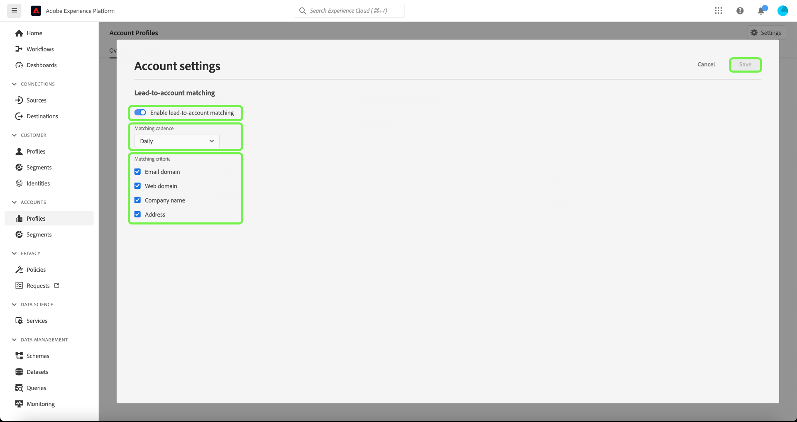
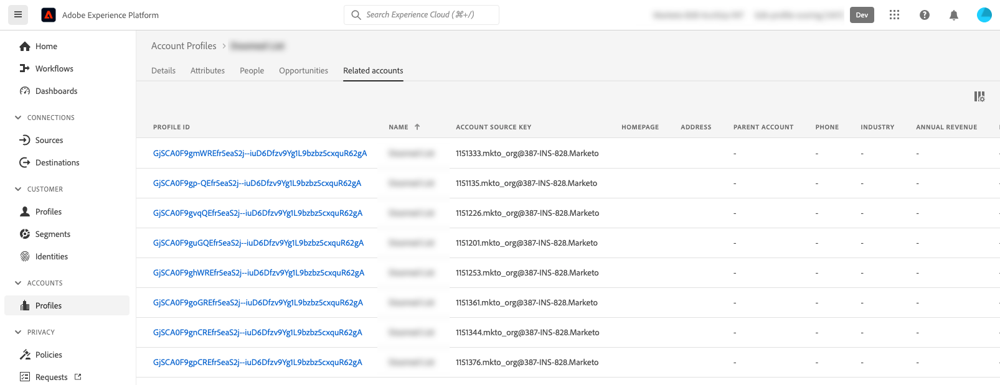

# Guide de l’interface utilisateur des profils de compte

>[!NOTE]
>
>Les profils de compte ne sont disponibles que pour les clients Real-Time Customer Data Platform B2B edition. Pour en savoir plus sur Real-Time CDP, y compris sur les fonctionnalités disponibles pour chaque type de licence, commencez par lire la présentation de [Real-Time CDP](../overview.md).

Les profils de compte vous permettent d’unifier les informations de compte provenant de plusieurs sources. Cette vue unifiée d’un compte rassemble les données de vos nombreux canaux marketing et des différents systèmes actuellement utilisés par votre organisation pour stocker les informations du compte client. Ce document fournit un guide sur l’interaction avec les profils de compte à l’aide des fonctionnalités B2B edition de Real-Time CDP disponibles dans l’interface utilisateur (IU) de Adobe Experience Platform.

Pour en savoir plus sur la manière dont les profils de compte sont créés dans le cadre du workflow B2B, reportez-vous au [tutoriel de bout en bout](../b2b-tutorial.md).

## Présentation des profils de compte {#account-profiles-overview}

Sélectionnez **[!UICONTROL Profils]** sous [!UICONTROL Comptes] dans le volet de navigation de gauche pour afficher la vue d’ensemble des profils de compte. Sous l’onglet [!UICONTROL Aperçu], le tableau de bord affiche un graphique ou un graphique affichant des widgets dans un seul point d’entrée.

Consultez la documentation du tableau de bord [[!UICONTROL Profils de compte]](../../dashboards/guides/account-profiles.md) pour en savoir plus. Pour plus d’informations sur la manière dont vos modèles de données d’informations peuvent être utilisés pour créer des graphiques personnalisés pour vos tableaux de bord, consultez la documentation de la [B2B edition du modèle de données d’informations Real-time Customer Data Platform Insights](../../dashboards/data-models/cdp-insights-data-model-b2b.md).

## Configurer la correspondance des prospects et des comptes {#configure-lead-to-account-matching}

>[!IMPORTANT]
>
> Seuls les administrateurs de l’IA B2B peuvent activer, désactiver et configurer le service de correspondance des prospects et des comptes. Lors de la désactivation du service, les résultats correspondants seront supprimés dans les 24 heures.

Pour configurer la correspondance des prospects et des comptes, sélectionnez **[!UICONTROL Profils]** sous [!UICONTROL Comptes] dans le volet de navigation de gauche. Dans l’onglet **[!UICONTROL Aperçu]**, sélectionnez **[!UICONTROL Paramètres]** en haut à droite.

La boîte de dialogue **[!UICONTROL Paramètres du compte]** s’ouvre. À partir de là, sélectionnez le bouton (bascule) **[!UICONTROL Activer la correspondance des prospects et des comptes]** pour activer la fonctionnalité. Utilisez le menu déroulant pour sélectionner **[!UICONTROL Quotidien]** pour le paramètre **[!UICONTROL Cadence correspondante]**. Enfin, sélectionnez les options appropriées **[!UICONTROL Critères de correspondance]** puis **[!UICONTROL Enregistrer]** pour confirmer les paramètres et revenir à l’écran **[!UICONTROL Profils de compte]**.

>[!NOTE]
>
> L&#39;adresse ne peut pas être utilisée comme seul critère correspondant. Un ou plusieurs des autres critères correspondants doivent être sélectionnés.

Pour en savoir plus sur la correspondance des prospects et des comptes, reportez-vous à la section [Correspondance des prospects et des comptes) de la présentation B2B de Real-Time CDP](../../rtcdp/b2b-ai-ml-services/lead-to-account-matching.md).

## Parcourir les profils de compte {#browse-account-profiles}

Pour parcourir les profils de compte, commencez par sélectionner **[!UICONTROL Profils]** sous [!UICONTROL Comptes] dans le volet de navigation de gauche.

Dans l’onglet **[!UICONTROL Parcourir]**, vous pouvez explorer les profils de compte à l’aide d’un identifiant de compte provenant d’une source d’entreprise connectée ou en saisissant directement les détails de la source.

### Parcourir par [!UICONTROL source d’entreprise connectée] {#browse-by-connected-enterprise-source}

Pour parcourir les profils de compte par source d’entreprise connectée, sélectionnez **[!UICONTROL Source d’entreprise connectée]** dans la liste déroulante **[!UICONTROL Parcourir par]**, puis choisissez une source connectée à l’aide du bouton de sélection situé en regard du champ **[!UICONTROL Source]**.

Cela ouvre la boîte de dialogue **[!UICONTROL Sélectionner la source]**, dans laquelle vous pouvez sélectionner une source en fonction des connexions établies par votre organisation.

>[!NOTE]
>
>Plusieurs sources peuvent être configurées pour le même fournisseur de services (par exemple, Marketo) pour votre organisation. Il est donc important de vérifier le nom de la connexion, le système source et l’instance du système source pour vous assurer que vous utilisez la bonne instance source pour votre recherche.

Pour en savoir plus sur la connexion des sources d’entreprise, consultez la [présentation des sources](../sources/sources-overview.md).

Vous pouvez choisir une source en sélectionnant le bouton radio en regard du nom de la connexion, puis en utilisant **[!UICONTROL Sélectionner]** pour revenir à l’onglet [!UICONTROL Parcourir].

Une fois la source sélectionnée, vous devez saisir un **[!UICONTROL identifiant de compte]** associé à la source. Par exemple, pour sélectionner une source Salesforce, vous devez saisir un identifiant de compte à partir de l’instance Salesforce afin d’afficher le profil de compte associé à cet identifiant.

>[!NOTE]
>
>Pour les identifiants de compte Marketo, deux tables de compte peuvent être référencées. Vous devez donc utiliser une syntaxe spécifique pour vous assurer que vous consultez le compte approprié.
>
>La syntaxe standard la plus courante est l’identifiant de compte Marketo suivi de `.mkto_org` (par exemple, `1234567.mkto_org`). Les clients Marketing basés sur un compte Marketo peuvent avoir des valeurs supplémentaires qui se trouvent à l’aide de l’identifiant de compte Marketo suivi de `.mkto_account`. Si vous ne savez pas quelle syntaxe utiliser, contactez votre administrateur Marketo.

### Parcourir par [!UICONTROL Autres] {#browse-by-others}

Real-Time CDP, B2B edition prend en charge la possibilité d’effectuer une recherche directe en vous permettant de saisir un **[!UICONTROL nom de Source]** une **[!UICONTROL instance de Source]** et un **[!UICONTROL ID de compte]** pour un compte que vous souhaitez afficher. En saisissant directement le nom et l’instance de la source, vous fournissez le contexte nécessaire pour qu’Experience Platform recherche et affiche les données de profil de compte correctes.

La possibilité d’effectuer une recherche directe est utile dans les cas où une connexion source directe aux données n’est pas possible. Par exemple, si votre entreprise a mis en place des politiques de gouvernance des données qui empêchent la connexion directe à un CRM, vous pouvez exporter ces données vers un système de stockage dans le cloud, puis les ingérer dans Experience Platform.

Autre exemple : vous effectuez une transformation sur les données entre le moment où elles quittent un système et celui où elles entrent dans Experience Platform. Vous pouvez utiliser la fonctionnalité de recherche directe pour fournir un contexte aux données (par exemple, en indiquant qu’il s’agit de données Marketo, bien qu’elles proviennent d’un compartiment Amazon S3) afin que le système sache où chercher les données et comment en effectuer le rendu correct.

Pour lancer une recherche directe, sélectionnez **[!UICONTROL Autres]** dans la liste déroulante **[!UICONTROL Parcourir par]**, puis saisissez un **[!UICONTROL Nom source]**, une **[!UICONTROL Instance source]** et un **[!UICONTROL ID de compte]** pour le compte que vous souhaitez afficher.

## Affichage des détails du profil de compte {#view-account-profile-details}

Après avoir utilisé l’onglet **[!UICONTROL Parcourir]** pour localiser un profil de compte, sélectionner l’**[!UICONTROL Identifiant de profil]** ouvre l’onglet **[!UICONTROL Détail]** du profil de compte. Les informations de profil affichées dans l’onglet **[!UICONTROL Détail]** ont été fusionnées à partir de plusieurs fragments de profil afin de former une vue unique du compte individuel. Cela inclut les détails du compte, tels que les attributs de base et les données de médias sociaux.

L’affichage des champs par défaut peut également être modifié au niveau de l’organisation afin d’afficher les attributs de profils de compte préférés.

>[!NOTE]
>
>Des fonctionnalités similaires sont disponibles pour les profils clients. Un guide détaillé a également été créé et fournit des instructions sur l’ajout et la suppression d’attributs, le redimensionnement des panneaux, etc. Pour en savoir plus, consultez le [guide de personnalisation des détails du profil](../../profile/ui/profile-customization.md).

Vous pouvez afficher des détails supplémentaires concernant le compte en sélectionnant l’un des autres onglets disponibles. Ces onglets comprennent les attributs, les personnes et l’onglet relatif aux opportunités, qui affiche les opportunités ouvertes et clôturées liées au compte sur l’ensemble de vos systèmes d’entreprise. Pour plus d’informations sur chaque onglet, consultez les sections suivantes.

## Onglet Attributs {#attributes-tab}

L’onglet **[!UICONTROL Attributs]** répertorie toutes les informations d’enregistrement liées au compte. Cela inclut les données d’attributs provenant de plusieurs sources qui ont été fusionnées pour former une vue unique du compte.

En plus de pouvoir afficher les données dans une liste, vous pouvez utiliser la barre de recherche pour rechercher des attributs spécifiques ou afficher les données d’enregistrement au format JSON.

## Onglet Personnes {#people-tab}

L’onglet **[!UICONTROL Personnes]** fournit une liste des personnes associées au compte. Ces personnes peuvent être des contacts et des prospects provenant de différents systèmes d’entreprise gérés par différentes équipes au sein de votre organisation. Toutefois, dans Real-Time CDP, B2B edition, elles sont présentées sous la forme d’une liste unique, ce qui vous permet d’obtenir une vue plus holistique des contacts de votre compte.

>[!NOTE]
>
>L’onglet [!UICONTROL Personnes] affiche une liste comportant au maximum 25 personnes associées au compte. Pour les comptes comptant plus de 25 personnes associées, le système affiche un échantillonnage aléatoire de 25 enregistrements.

Outre l’affichage d’un instantané des informations du contact, chaque personne répertoriée inclut également un **[!UICONTROL Identifiant de profil]**, qui est un lien cliquable qui vous permet d’explorer le profil client en temps réel de cet individu. Pour en savoir plus sur l’affichage des profils clients individuels liés à vos comptes, consultez le guide [navigation dans les profils de Real-Time CDP, B2B edition](../profile/profile-browse.md).

## Onglet Opportunités {#opportunities-tab}

L’onglet **[!UICONTROL Opportunités]** fournit des informations sur les opportunités ouvertes et clôturées liées au compte. Ces opportunités peuvent être ingérées dans Experience Platform à partir de plusieurs sources. Toutefois, Real-Time CDP, B2B edition permet aux spécialistes marketing de voir facilement toutes ces opportunités au même endroit.

>[!NOTE]
>
>L’onglet [!UICONTROL Opportunités] affiche une liste comportant au maximum 25 opportunités associées au compte. Pour les comptes comportant plus de 25 opportunités associées, le système affiche un échantillonnage aléatoire de 25 enregistrements.

Chaque opportunité inclut des informations telles que son nom, son montant, son avancée et si elle est ouverte, clôturée, gagnée ou perdue.

## Onglet Comptes associés {#related-accounts-tab}

L’onglet **[!UICONTROL Comptes associés]** fournit des informations sur d’autres comptes qui peuvent être associés au compte que vous êtes en train de parcourir. Pour obtenir des informations détaillées sur cette fonctionnalité, reportez-vous à la [présentation des comptes associés](/help/rtcdp/b2b-ai-ml-services/related-accounts.md).

>[!NOTE]
>
>* Un groupe Comptes associés peut avoir un maximum de 30 profils de compte. Si plus de 30 profils de compte ont été trouvés liés, ils sont arbitrairement divisés en plusieurs groupes, chacun n’ayant pas plus de 30 membres. Le groupe Comptes associés d’un profil de compte s’inclut toujours lui-même.
>* L’onglet [!UICONTROL Comptes associés] affiche actuellement une liste comportant au maximum 25 comptes associés au compte que vous êtes en train de parcourir. Il s’agit d’une limitation qui sera traitée dans une mise à jour ultérieure. Malgré cette limitation de l’interface utilisateur, lorsque vous utilisez des comptes associés dans les définitions de segment, pour les groupes de 30 profils de compte associés, tous les profils sont utilisés pour le ciblage.

Chaque compte associé contient des informations telles que l’identifiant et le nom du profil de compte, sa clé de source de compte, ainsi que des informations supplémentaires relatives à la page d’accueil, l’adresse, le compte parent, le téléphone, le secteur et le chiffre d’affaires annuel.

Vous pouvez utiliser les comptes associés dans cette liste à des fins de segmentation. Consultez un [exemple de segmentation](/help/rtcdp/segmentation/b2b.md#related-account) pour comprendre comment utiliser les comptes associés afin d’étendre votre portée dans les définitions de segment.