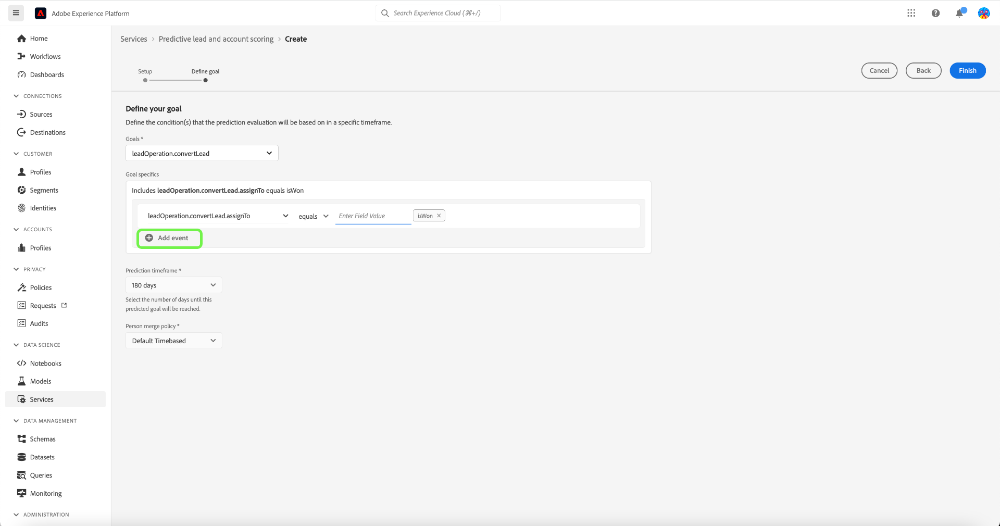

# Gestion des scores de piste et de compte prédictifs dans Adobe Real-Time Customer Data Platform, Édition B2B

>[!NOTE]
>
>Seuls les utilisateurs disposant de l’autorisation Gérer l’IA B2B peuvent créer, modifier et supprimer des objectifs de score.

Ce tutoriel vous guide tout au long des étapes à suivre pour gérer les objectifs de score du service de notation de compte et de prospect prédictif. Les objectifs de score peuvent concerner soit un profil de personne, soit un profil de compte.

## Création d’un score

Pour créer un score, sélectionnez les **[!UICONTROL Services]** dans la barre latérale et sélectionnez **[!UICONTROL Créer un score]**.

L’écran **[!UICONTROL Informations de base]** s’affiche, vous invitant à sélectionner un type de profil, à saisir un nom et une description facultative. Lorsque vous avez terminé, sélectionnez **[!UICONTROL Suivant]**.

L’écran **[!UICONTROL Définir votre objectif]** s’affiche. Sélectionnez la flèche de liste déroulante, puis un type d’objectif dans la fenêtre déroulante qui s’affiche.

La boîte de dialogue **[!UICONTROL Particularités des objectifs]** s’ouvre. Sélectionnez la flèche de liste déroulante, puis le nom du champ d’objectif dans la fenêtre déroulante qui s’affiche.

La sélection **[!UICONTROL Conditions de l’objectif]** s’affiche. Sélectionnez la flèche de liste déroulante, puis sélectionnez une condition dans la fenêtre déroulante qui s’affiche.

Le champ **[!UICONTROL Valeur de l’objectif]** s’affiche. Ensuite, configurez vos [!UICONTROL caractéristiques de l’objectif]. Sélectionnez le panneau [!UICONTROL Saisir la valeur du champ] et saisissez votre valeur d’objectif.

>[!NOTE]
>
>Plusieurs valeurs d’objectif peuvent être ajoutées.

Pour ajouter des champs supplémentaires, sélectionnez **[!UICONTROL Ajouter un champ]**.

Pour configurer la période de prédiction, sélectionnez la flèche de liste déroulante, puis sélectionnez la période de votre choix.

La stratégie de fusion sélectionnée détermine la manière dont les valeurs de champ d’un profil de personne sont sélectionnées. À l’aide de la flèche de liste déroulante, sélectionnez la stratégie de fusion de votre choix, puis sélectionnez **[!UICONTROL Terminer]**.

La boîte de dialogue **[!UICONTROL Configuration de la notation terminée]** s’affiche pour confirmer que le nouveau score a été créé. Sélectionnez **[!UICONTROL OK]**.

>[!NOTE]
>
>Chaque processus de notation peut prendre jusqu’à 24 heures.

Vous revenez à l’onglet **[!UICONTROL Services]** où vous pouvez voir le nouveau score créé dans la liste des scores.

Sélectionnez le score pour afficher les détails et des informations supplémentaires sur les détails de la dernière exécution.

Pour plus d’informations sur les codes d’erreur visibles sous les détails de la dernière exécution, reportez-vous à la section sur les [&#x200B; codes d’erreur de pipeline d’IA dédiés aux pistes &#x200B;](#leads-ai-pipeline-error-codes) de ce document.

## Modifier un score

Pour modifier un score, sélectionnez un score dans l’onglet **[!UICONTROL Services]** et sélectionnez **[!UICONTROL Modifier]** dans le panneau des détails supplémentaires sur le côté droit de l’écran.

La boîte de dialogue **[!UICONTROL Modifier l’instance]** s’affiche, dans laquelle vous pouvez modifier la description du score. Apportez vos modifications et sélectionnez **[!UICONTROL Enregistrer]**.

>[!NOTE]
>
>La configuration du score ne peut pas être modifiée, car cela déclenchera une nouvelle formation et une nouvelle notation du modèle. C&#39;est l&#39;équivalent de supprimer le score et de créer un nouveau score. Pour modifier la configuration du score, vous devez cloner ce score ou créer un nouveau score.

Vous revenez à l&#39;onglet **[!UICONTROL Services]** . Sélectionnez le score pour afficher les détails de la description mise à jour dans le panneau des détails supplémentaires sur le côté droit de l’écran.

## Clonage d’un score

Pour cloner un score, sélectionnez un score dans l’onglet **[!UICONTROL Services]** et sélectionnez **[!UICONTROL Cloner]** dans le panneau des détails supplémentaires sur le côté droit de l’écran.

L’écran **[!UICONTROL Informations de base]** s’affiche. Le type, le nom et la description du profil sont clonés à partir du score d’origine. Modifiez ces détails et sélectionnez **[!UICONTROL Suivant]**.

L’écran **[!UICONTROL Définir votre objectif]** s’affiche. Renseignez la section des objectifs comme vous le feriez lors de la création d’un nouveau score et sélectionnez **[!UICONTROL Terminer]**.

Vous revenez à l’onglet **[!UICONTROL Services]** où vous pouvez voir le score nouvellement cloné dans la liste.

>[!NOTE]
>
>La section **[!UICONTROL Définir votre objectif]** n’est pas clonée à partir du score d’origine.

## Supprimer un score

Pour supprimer un score, sélectionnez un score dans l’onglet **[!UICONTROL Services]** et sélectionnez **[!UICONTROL Supprimer]** dans le panneau des détails supplémentaires sur le côté droit de l’écran.

La boîte de dialogue de confirmation **[!UICONTROL Supprimer la documentation]** s’affiche. Sélectionnez **[!UICONTROL Supprimer]**.

>[!NOTE]
>
>La suppression de la définition de score supprimerait également tous les scores prévus sur le profil de la personne ou le profil du compte, mais pas le groupe de champs créé pour la définition de score. Le groupe de champs restera &quot;orphelin&quot; dans le modèle de données.

Vous revenez à l’onglet **[!UICONTROL Services]** où vous ne pouvez plus voir le score dans la liste.

## Passe en revue les codes d’erreur de pipeline AI

| Code d’erreur | Message d’erreur |
| --- | --- |
| 401 | Erreur 401. Le pipeline Leads AI est arrêté : nombre de comptes valides insuffisants pour la notation des comptes. Nombre de comptes : {}. |
| 402 | Erreur 402. Le pipeline Leads AI s’est arrêté : pas assez de contacts valides pour la notation des contacts. Nombre de contacts : {}. |
| 403 | Erreur 403. Le pipeline Leads AI est arrêté : volume d’activité insuffisant pour la formation des modèles. Nombre d&#39;événements : {}. |
| 404 | Erreur 404. Le pipeline Leads AI est arrêté : conversions insuffisantes pour la formation des modèles. Nombre de conversions : {}. |
| 405 | Erreur 405. Le pipeline Leads AI est arrêté : l’activité est trop éparse pour une formation de modèle valide. Seul {} % des comptes ont une activité. |
| 406 | Erreur 406. Le pipeline Leads AI est arrêté : l’activité est trop éparse pour une formation de modèle valide. Seul {} % des contacts ont une activité. |
| 407 | Erreur 407. Le pipeline Leads AI est arrêté : les types d’activité de notation de données ne correspondent pas aux données d’entraînement. |
| 408 | Erreur 408. Pipeline Leads AI arrêté : le taux d’absence est trop élevé pour les fonctionnalités d’activité. Taux manquant : {}. |
| 409 | Erreur 409. Le pipeline Leads AI est arrêté : test auc est trop faible. Test auc : {}. |
| 410 | Erreur 410. Le pipeline Leads AI est arrêté : le test auc est trop faible après réglage des paramètres. Test auc : {}. |
| 411 | Erreur 411. Le pipeline Leads AI est arrêté : les données d’apprentissage n’ont pas assez de conversions pour produire un modèle fiable. Conversions : {}. |
| 412 | Erreur 412. Le pipeline Leads AI est arrêté : les données de test n’ont aucune conversion pour calculer AUC-ROC. |

| Code d’avertissement/d’information | Message |
| --- | --- |
| 100 | INFO 100. Contrôle la qualité de l’IA : le nombre de comptes est : {}. |
| 101 | INFO 101. Contrôle la qualité de l’IA : le nombre de contacts est : {}. |
| 102 | INFO 102. Contrôle la qualité de l’IA : le nombre d’opportunités est : {}. |
| 103 | INFO 103. Contrôle la qualité de l’IA : le test de l’authentification est faible. Démarrez le réglage des paramètres. Test d’auc : {}. |
| 200 | AVERTISSEMENT 200. Contrôle la qualité de l’IA : le taux manquant de fonctionnalités démographiques est : {}. |
| 201 | AVERTISSEMENT 201. Contrôle la qualité de l’IA : le taux manquant des fonctionnalités d’activité est : {}. |

## Étapes suivantes

En suivant ce tutoriel, vous pouvez désormais créer et gérer des scores. Consultez les documents suivants pour plus d’informations :

* [Notation prédictive des prospects et des comptes](/help/rtcdp/b2b-ai-ml-services/predictive-lead-and-account-scoring.md)
* [Surveillance des tâches de notation de compte et de piste prédictives](/help/dataflows/ui/b2b/monitor-profile-enrichment.md)
