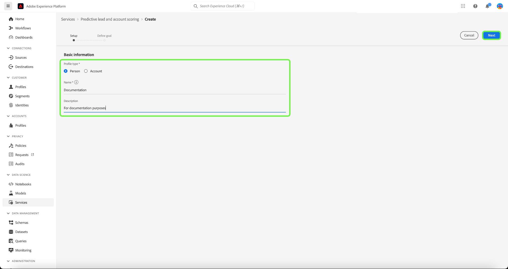
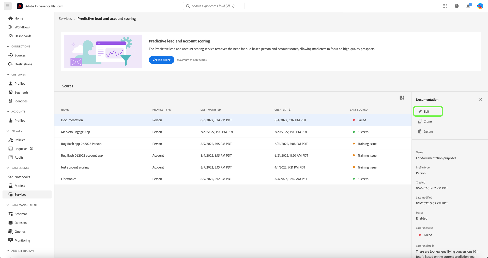
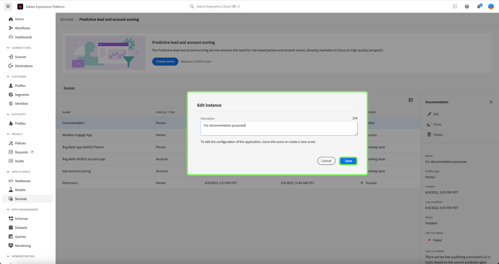
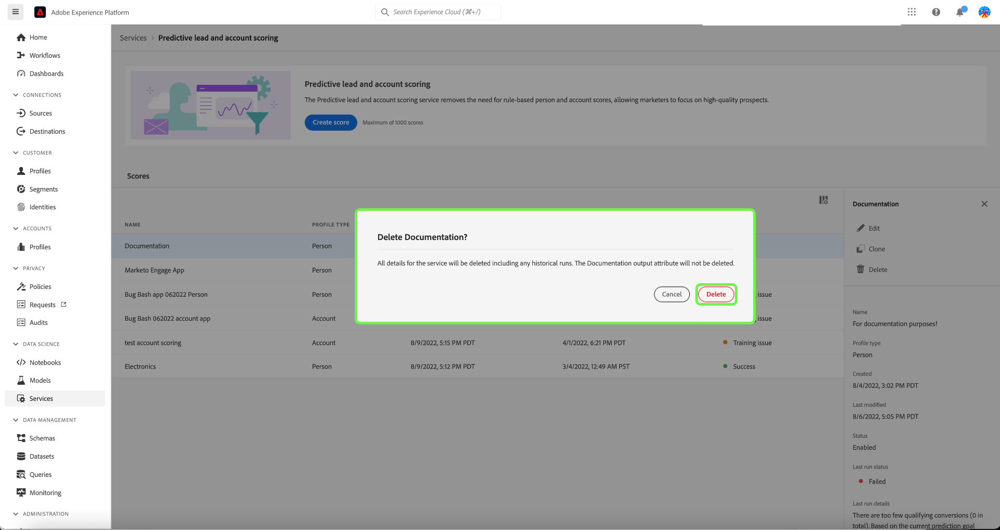

# Gérer la notation prédictive des prospects et des comptes dans Adobe Real-Time Customer Data Platform, B2B edition

>[!NOTE]
>
>Seuls les utilisateurs disposant d’une autorisation Gérer l’IA B2B peuvent créer, modifier et supprimer des objectifs de score.

Ce tutoriel vous guide tout au long des étapes de gestion des objectifs de score du service de notation prédictive des prospects et des comptes. Les objectifs de score peuvent être attribués au profil d’une personne ou au profil d’un compte

## Créer un nouveau score

Pour créer une note, sélectionnez l’**[!UICONTROL Services]** dans la barre latérale et sélectionnez **[!UICONTROL Créer une note]**.

L’écran **[!UICONTROL Informations de base]** s’affiche et vous invite à sélectionner un type de profil, à saisir un nom et une description facultative. Lorsque vous avez terminé, sélectionnez **[!UICONTROL Suivant]**.

L’écran **[!UICONTROL Définir votre objectif]** s’affiche. Sélectionnez la flèche déroulante, puis sélectionnez un type d’objectif dans la fenêtre déroulante qui s’affiche.

La boîte de dialogue **[!UICONTROL Détails de l’objectif]** s’ouvre. Sélectionnez la flèche déroulante, puis sélectionnez nom du champ de l’objectif dans la fenêtre déroulante qui s’affiche.

La sélection **[!UICONTROL Conditions de l’objectif]** s’affiche. Sélectionnez la flèche déroulante, puis sélectionnez condition dans la fenêtre déroulante qui s’affiche.

Le champ **[!UICONTROL Valeur de l’objectif]** s’affiche. Configurez ensuite vos [!UICONTROL Détails de l’objectif]. Sélectionnez le panneau [!UICONTROL Saisir la valeur du champ] et saisissez la valeur de votre objectif.

>[!NOTE]
>
>Plusieurs valeurs d’objectif peuvent être ajoutées.

Pour ajouter des champs supplémentaires, sélectionnez **[!UICONTROL Ajouter un champ]**.

Pour configurer le délai de prédiction, sélectionnez la flèche déroulante, puis sélectionnez le délai de votre choix.

La politique de fusion sélectionnée détermine la manière dont les valeurs de champ d’un profil de personne sont sélectionnées. À l’aide de la flèche déroulante, sélectionnez la politique de fusion de votre choix, puis sélectionnez **[!UICONTROL Terminer]**.

La boîte de dialogue **[!UICONTROL Configuration de la notation terminée]** s’affiche pour confirmer la création de la nouvelle notation. Sélectionnez **[!UICONTROL OK]**.

>[!NOTE]
>
>Chaque processus de notation peut prendre jusqu’à 24 heures.

Vous revenez alors à l’onglet **[!UICONTROL Services]** où vous pouvez voir le nouveau score créé dans la liste des scores.

Sélectionnez le score pour afficher les détails et des informations supplémentaires sur les détails de la dernière exécution.

Pour plus d’informations sur les codes d’erreur visibles sous les détails de la dernière exécution, reportez-vous à la section [Codes d’erreur du pipeline de l’IA dédiée aux prospects](#leads-ai-pipeline-error-codes) dans ce document.

## Modifier un score

Pour modifier une note, sélectionnez une note dans l’onglet **[!UICONTROL Services]** et sélectionnez **[!UICONTROL Modifier]** dans le panneau des détails supplémentaires sur le côté droit de l’écran.

La boîte de dialogue **[!UICONTROL Modifier l’instance]** s’affiche et vous pouvez modifier la description du score. Apportez vos modifications et sélectionnez **[!UICONTROL Enregistrer]**.

>[!NOTE]
>
>La configuration de score ne peut pas être modifiée, car cela déclenchera le recyclage et le re-score du modèle. Cela équivaut à supprimer le score et à créer un nouveau score. Pour modifier la configuration de la note, vous devez cloner cette note ou créer une note.

Vous revenez alors à l’onglet **[!UICONTROL Services]**. Sélectionnez le score pour afficher les détails de la description mise à jour dans le panneau des détails supplémentaires sur le côté droit de l’écran.

## Cloner un score

Pour cloner une note, sélectionnez une note dans l’onglet **[!UICONTROL Services]** et sélectionnez **[!UICONTROL Cloner]** dans le panneau des détails supplémentaires sur le côté droit de l’écran.

L’écran **[!UICONTROL Informations de base]** s’affiche. Le type, le nom et la description du profil sont clonés à partir du score d’origine. Modifiez ces détails et sélectionnez **[!UICONTROL Suivant]**.

L’écran **[!UICONTROL Définir votre objectif]** s’affiche. Renseignez la section des objectifs comme vous le feriez lors de la création d’un nouveau score et sélectionnez **[!UICONTROL Terminer]**.

Vous revenez alors à l’onglet **[!UICONTROL Services]** où vous pouvez voir le score nouvellement cloné dans la liste.

>[!NOTE]
>
>La section **[!UICONTROL Définir votre objectif]** n’est pas clonée à partir du score d’origine.

## Supprimer un score

Pour supprimer une note, sélectionnez une note dans l’onglet **[!UICONTROL Services]** et sélectionnez **[!UICONTROL Supprimer]** dans le panneau des détails supplémentaires sur le côté droit de l’écran.

La boîte de dialogue de confirmation **[!UICONTROL Supprimer la documentation]** s’affiche. Sélectionnez **[!UICONTROL Supprimer]**.

>[!NOTE]
>
>La suppression de la définition de score supprimerait également tous les scores prévus sur le profil de personne ou le profil de compte, mais pas le groupe de champs créé pour la définition de score. Le groupe de champs reste « orphelin » dans le modèle de données.

Vous revenez alors à l’onglet **[!UICONTROL Services]** où vous ne pouvez plus voir le score dans la liste.

## Codes d’erreur du pipeline de l’IA dédiée aux leads

| Code d’erreur | Message d’erreur |
| --- | --- |
| 401 | ERREUR 401. Pipeline d’IA de leads arrêté : comptes valides insuffisants pour la notation du compte. Nombre de comptes : {}. |
| 402 | ERREUR 402. Pipeline d’IA de leads arrêté : pas assez de contacts valides pour la notation des contacts. Nombre de contacts : {}. |
| 403 | ERREUR 403. Pipeline d’IA de leads arrêté : volume d’activité insuffisant pour la formation du modèle. Nombre d’événements : {}. |
| 404 | ERREUR 404. Pipeline d’IA de leads arrêté : pas assez de conversions pour la formation du modèle. Nombre de conversions : {}. |
| 405 | ERREUR 405. Pipeline d’IA de leads arrêté : activité trop clairsemée pour une formation de modèle valide. Seul {} % des comptes ont une activité. |
| 406 | ERREUR 406. Pipeline d’IA de leads arrêté : activité trop clairsemée pour une formation de modèle valide. Seul {} % des contacts ont une activité. |
| 407 | ERREUR 407. Pipeline d’IA dédiée aux leads arrêté : les types d’activité de notation des données ne correspondent pas aux données d’identification. |
| 408 | ERREUR 408. Pipeline d’IA dédiée aux leads arrêté : le taux manquant est trop élevé pour les fonctionnalités d’activité. Taux manquant : {}. |
| 409 | ERREUR 409. Pipeline d’IA de leads arrêté : l’auc de test est trop faible. Auc de test : {}. |
| 410 | ERREUR 410. Pipeline de l’IA dédiée aux leads arrêté : l’auc de test est trop faible après l’optimisation des paramètres. Auc de test : {}. |
| 411 | ERREUR 411. Pipeline de l’IA dédiée aux leads arrêté : les données d’apprentissage n’ont pas suffisamment de conversions pour produire un modèle fiable. Conversions : {}. |
| 412 | ERREUR 412. Pipeline d’IA de leads arrêté : les données de test n’ont aucune conversion pour calculer l’AUC-ROC. |

| Code avertissement/info | Message |
| --- | --- |
| 100 | INFO 100. Vérification de la qualité de l’IA dédiée aux leads : le nombre de comptes est : {}. |
| 101 | INFOS 101. Vérification de la qualité de l’IA dédiée aux leads : le nombre de contacts est : {}. |
| 102 | INFOS 102. Vérification de la qualité de l’IA dédiée aux leads : le nombre d’opportunités est : {}. |
| 103 | INFO 103. Contrôle de qualité de l’IA dédiée aux leads : l’auc de test est faible. Commencez l’optimisation des paramètres. Auc de test : {}. |
| 200 | ATTENTION 200. Vérification de la qualité de l’IA dédiée aux leads : le taux manquant de fonctionnalités thermographiques est : {}. |
| 201 | AVERTISSEMENT 201. Vérification de la qualité de l’IA dédiée aux leads : le taux manquant de fonctionnalités d’activité est : {}. |

## Étapes suivantes

En suivant ce tutoriel, vous pouvez désormais créer et gérer des scores avec succès. Consultez les documents suivants pour plus d’informations :

* [Notation prédictive des prospects et des comptes](/help/rtcdp/b2b-ai-ml-services/predictive-lead-and-account-scoring.md)
* [Surveiller les tâches de notation prédictive des prospects et des comptes](/help/dataflows/ui/b2b/monitor-profile-enrichment.md)
