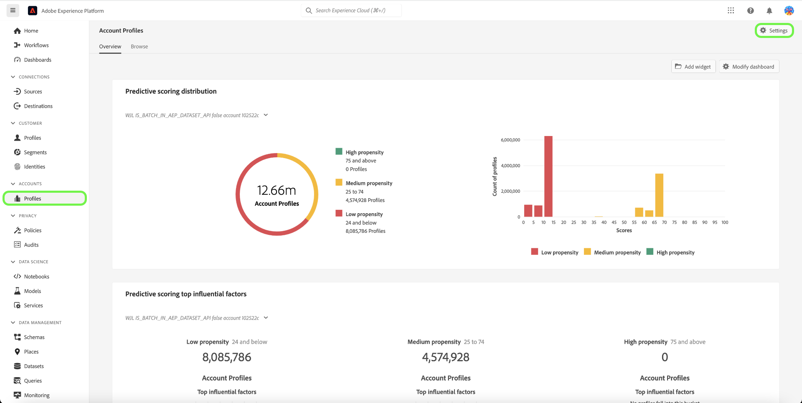

# Comptes associés dans Real-Time CDP B2B Edition

## Vue d’ensemble {#overview}

Les entreprises B2B ont souvent leurs informations client stockées dans plusieurs systèmes, chacun ne contenant que des données partielles, voire conflictuelles, pour la même entité commerciale physique. Il est donc très difficile d’avoir une visualisation précise de leurs clients, ce qui réduit l’efficacité et l’efficience de leurs efforts de marketing et de vente B2B.

| Identifiant | Nom | Site web | Secteur industriel | État | Téléphone | A une opportunité ouverte avec montant > `$1 million` |
|---|---|---|---|---|---|---|
| 1 | Acme | acme.com | Logiciel | CA | (408)536-6000 |   |
| 2 | Acme | acm.com | Logiciel | CA | 4085366000 | x |
| 3 | Acme Inc |   |   | CA | (408)5366000 |   |
| 4 | Service de conseil Acme | `http://www.acme.com/consulting` | Conseil en technologie | NY | (212)471-0904 | x |
| 5 | Acme IT |   |   | CA |   |   |

{style="table-layout:auto"}

Avec les comptes associés, [!DNL Real-Time CDP B2B] vous montre désormais une liste de comptes similaires au compte que vous êtes en train de parcourir.

Utilisez cette fonctionnalité pour afficher les profils de compte associés pour un profil de compte dans l’interface utilisateur d’Experience Platform, puis incluez les comptes associés dans vos définitions de segment afin d’élargir votre portée ou d’appliquer des critères plus larges à vos audiences.

## Activer le service de comptes associés {#enable}

Pour activer le service, sélectionnez **[!UICONTROL Profiles]** dans la barre latérale, puis **[!UICONTROL Settings]**.

Sélectionnez le bouton bascule en regard de [!UICONTROL Enable related accounts] pour activer le service, puis sélectionnez **[!UICONTROL Save]**.

## Fonctionnement {#how-it-works}

Les tâches de machine learning exécutées quotidiennement utilisent un algorithme hiérarchique pour regrouper des profils de compte similaires en groupes en fonction de trois facteurs :

* Lien du compte parent
* Domaine web
* Nom du compte

Après une tâche de traitement réussie, chaque membre du groupe de profils de compte est identifié avec la liste Comptes associés . Vous pouvez afficher la liste dans l’onglet **Comptes associés** de la page Profil de compte et utiliser les comptes associés dans les définitions de segment.

Consultez la documentation pour plus d’informations sur les tâches [Comptes liés à l’enrichissement du profil](/help/dataflows/ui/b2b/monitor-profile-enrichment.md).

## Comment afficher les comptes associés {#how-to-view}

Vous pouvez afficher les comptes associés d’un compte que vous parcourez dans l’interface utilisateur d’Experience Platform.

Consultez la documentation pour plus d’informations sur le [comment trouver des comptes associés dans l’interface utilisateur](/help/rtcdp/accounts/account-profile-ui-guide.md#related-accounts-tab).

## Utilisation des comptes associés {#how-to-use}

Vous pouvez utiliser des comptes et des comptes associés dans la segmentation. La décision d’utiliser ou non des comptes associés dans vos définitions de segment dépend de votre cas d’utilisation marketing. Par exemple, vous pouvez utiliser des comptes associés pour des campagnes publicitaires ou de marketing par e-mail pour lesquelles vous pouvez accepter une précision inférieure en échange d’une portée plus large.

Consultez un [exemple de segmentation](/help/rtcdp/segmentation/b2b.md#related-accounts) qui utilise des comptes associés.
