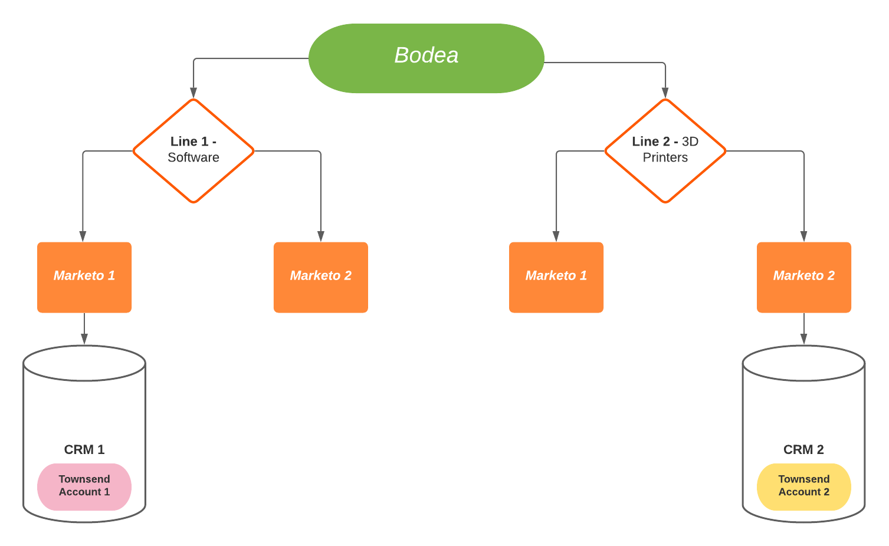

# Exemple de cas d’utilisation de la plateforme de données clients en temps réel de l’édition B2B

>[!IMPORTANT]
>
>La plateforme CDP Business to Business Edition en temps réel est actuellement en version bêta. La documentation et les fonctionnalités peuvent changer.

La plateforme de données clients en temps réel de l’édition B2B développe la plateforme de données clients en temps réel et les offres Adobe Experience Platform existantes pour prendre en charge les données et les workflows B2B. Ce document fournit un exemple de cas d’utilisation qui illustre les avantages supplémentaires fournis par l’édition B2B. Ce sont :

- Combinez les données de personne et de compte provenant de différentes sources de données cloisonnées afin de produire une vue d’ensemble plus complète qui permette une meilleure compréhension des clients et une segmentation plus précise. Pour plus d’informations, consultez la documentation sur la [création de relations de schéma XDM](./schemas/b2b.md) à utiliser avec différentes sources B2B .
- Segmenter une audience en fonction des attributs des entités associées. Cela inclut les comptes, les opportunités, les campagnes et les listes marketing. Les segments ne se limitent plus aux attributs de personne et aux événements d’expérience. Consultez la documentation sur la segmentation B2B pour plus d’exemples de création d’audiences spécifiques B2B.
   <!-- PLACEHOLDER [B2B segmentation documentation]()  -->
- prennent en charge de manière native le cas d’utilisation d’une personne liée à plusieurs comptes ;

## Cas d’utilisation

Bodea, une société de technologie, possède un nouveau produit et souhaite simultanément cibler les clients avec un email et une campagne publicitaire LinkedIn. Afin d&#39;optimiser l&#39;efficacité de leur campagne marketing, Bodea souhaite également cibler les personnes associées à ce compte existant qui ont déjà dépensé plus d&#39;un million de dollars pour ses produits, ET qui ont visité la nouvelle page produit le mois dernier.

Cependant, Bodea a deux secteurs d&#39;activité différents. La première gamme d&#39;activités de Bodea, &quot;Line 1&quot;, crée des logiciels pour l&#39;industrie automobile. Sa deuxième gamme d’activités &quot;Line 2&quot; vend des imprimantes 3D qui créent des pièces automobiles. En raison des deux secteurs d’activité de Bodea, les données sur les recettes générées par les comptes clients de Bodea ne sont pas unifiées dans une seule perspective.

Chaque secteur d’activité possède son propre système de vente : &quot;CRM 1&quot; et &quot;CRM 2&quot;. Ces deux systèmes de vente CRM sont connectés à leur propre plateforme d’automatisation marketing &quot;Marketo 1&quot; et &quot;Marketo 2&quot;. Les données de CRM 1 sont synchronisées uniquement dans Marketo 1 et les données de CRM2 ne sont synchronisées que dans Marketo 2. En fin de compte, leurs données sont conservées dans différents silos d’informations d’entreprise.

<!--  -->

## Situation actuelle des données

Comme les deux secteurs d&#39;activité de Bodea vendent à la société Townsend, les données commerciales de Townsend sont enregistrées sous la forme de deux comptes distincts dans chaque système de vente.

Dans Marketo 1, Townsend est enregistré comme compte 1. Elle a deux personnes associées (p1@townsend.com et p2@townsend.com) et une opportunité fermée de 200 000 $ (&quot;Opportunité 1&quot;) dans le CRM 1. Ces données sont synchronisées de CRM 1 vers Marketo 1.

Dans Marketo 2, Townsend est enregistré comme compte 2. Le compte 2 a également deux personnes liées (p2@townsend.com et p3@townsend.com) et une opportunité clôturée de 900 000 $ (&quot;Opportunité 2&quot;) dans le CRM 2. Ces données sont synchronisées de CRM 2 vers Marketo 2.

À des fins d’intégration et de contrôle d’entreprise supplémentaire, Bodea dispose également d’un système de gestion des données de Principal (MDM) dans lequel il conserve un enregistrement indiquant que le compte 1 dans Marketo 1 (et le CRM 1) et le compte 2 dans Marketo 2 (et le CRM 2) sont la même société.

Au cours du dernier mois, `p2@townsend.com` a visité la nouvelle page produit et la visite web a été enregistrée par Marketo 1.

## Le problème

Line 1 vient de sortir un nouveau produit logiciel et souhaite le vendre à la clientèle de premier rang existante de Bodea. Bodea lance une campagne marketing en tenant compte de cette audience cible spécifique.

Comme les informations appropriées sont enregistrées en tant que Compte 1 dans Marketo 1 et Compte 2 dans Marketo 2, l’équipe marketing de Bodea ne peut pas utiliser efficacement les informations cloisonnées.

Cela interdit à l’équipe marketing de Bodea de cibler efficacement des contacts commerciaux spécifiques dans ces entreprises avec cette nouvelle opportunité.

Jusqu&#39;à présent, Townsend a dépensé plus d&#39;un million de dollars cumulativement pour les produits bodéens sur tous leurs comptes. Cependant, un segment créé à l’aide de leur ancien système n’inclurait personne de Townsend, à moins que le total dépensé dans un seul système de vente ne totalise plus d’1 million de dollars. Cela est dû au fait que les données sur les recettes sont cloisonnées dans des comptes sous différents systèmes de vente.

Les dépenses de Townsend étant réparties entre différents systèmes de vente et ne totalisant pas individuellement plus d’un million, le segment ne trouverait personne qualifié dans Marketo 1 ou Marketo 2.

### Comment l’édition en temps réel de la plateforme CDP B2B résout le problème

Avec la plateforme CDP B2B en temps réel, l’équipe marketing de Bodea peut :

- Combinez les données provenant de toutes les sources disparates (plusieurs instances Marketo et CRM, ainsi que la gestion des données de Principal) dans l’édition B2B de la plateforme CDP en temps réel.

Avec RT-CDP B2B Edition, Bodea peut utiliser le connecteur source Marketo Engage pour importer les données B2B de Marketo 1 et Marketo 2 dans l’Experience Platform et garder ces données à jour à l’aide des applications connectées à Platform. Pour plus d’informations, voir la documentation [Connecteur source Marketo](../sources/connectors/adobe-applications/marketo/marketo.md) .

Les données B2B (Personnes, comptes, opportunités et activité ) de CRM1 sont synchronisées dans Marketo 1. De même, toutes les données B2B issues de CRM 2 sont synchronisées dans Marketo 2. Ils sont synchronisés dans Adobe Experience Platform via le connecteur source Marketo. Cependant, si Bodea souhaite importer des données additionnelles provenant d’un CRM dans Experience Platform, il peut utiliser les connecteurs CRM existants.

Pour des raisons de simplicité et dans le but de cet exemple, les gens sont identifiés par leurs emails. Les données de compte combinées pour cet exemple se présentent comme suit :

| People |
|---|
| p1@townsend.com |
| p2@townsend.com (qui a consulté la page du nouveau produit le mois dernier) |
| p3@townsend.com |

| Opportunités (à terminer) |
|---|
| Opportunité 1, 200 000 $ |
| Opportunité 2, 900 000 $ |

- Créez des segments uniques à l’aide de ces données agrégées pour diverses initiatives marketing. Dans cet exemple, le segment trouve toutes les personnes qui :

   - avoir des opportunités associées (sur tous les comptes) dont la valeur dépasse 1 million de dollars ;
   - ET
   - Ont consulté la page produit au cours du dernier mois.

- Créez une audience qui sera le destinataire le plus efficace de la nouvelle campagne marketing de Bodea. Dans cet exemple, RT-CDP, B2B Edition aidera le marketeur à identifier `p2@townsend.com` comme cible appropriée pour cette campagne marketing.

En utilisant les destinations Marketo Engage et LinkedIn, Bodea dispose d’une solution de gestion de l’expérience client de bout en bout (CXM) pour son équipe marketing. L’audience créée dans Experience Platform est envoyée à la destination Marketo où elle apparaît sous la forme d’une liste statique. Cette audience est alors automatiquement ajoutée à une campagne marketing Marketo. Simultanément, l’audience peut également être envoyée à une campagne marketing LinkedIn par l’édition RT-CDP B2B.

## Étapes suivantes

En lisant ce document, vous avez maintenant découvert les types d’objectifs et de problèmes qui peuvent être résolus à l’aide de l’édition B2B de la plateforme CDP en temps réel.

La documentation suivante est recommandée pour améliorer votre compréhension des fonctionnalités spécifiques B2B :

<!-- - [Marketo connector]() -->
- [Schémas de la plateforme de données clients en temps réel de l’édition B2B](./schemas/b2b.md)
- [Documentation sur la destination du Marketo Engage](https://experienceleague.adobe.com/docs/experience-platform/destinations/catalog/adobe/marketo-engage.html)
- [Configuration d’une destination d’audiences mappées LinkedIn](https://experienceleague.adobe.com/docs/experience-platform/destinations/catalog/social/linkedin.html#connect)

<!-- PLACEHOLDER -->
<!-- - [Account Profiles]() -->
<!-- - [B2B Segmentation examples]() -->
<!-- PLACEHOLDERS to tutorial / account profiles / B2B connectors / segmentation examples -->
