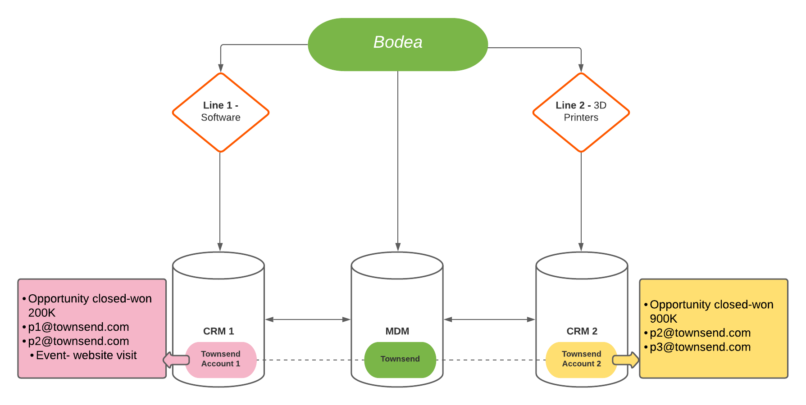

# Exemple de cas d’utilisation de Real-Time Customer Data Platform B2B edition

Real-Time Customer Data Platform B2B edition étend les offres existantes de Real-Time CDP et de Adobe Experience Platform pour prendre en charge les données et les workflows B2B. Ce document fournit un exemple de cas d’utilisation qui illustre les avantages supplémentaires fournis par l’édition B2B. Ce sont :

- Associez les données de comptes et d’utilisateurs provenant de différentes sources de données compartimentées afin de produire une vue d’ensemble offrant une meilleure compréhension des clients et permettant une segmentation plus précise. Pour plus d’informations, consultez la documentation sur la [création de relations de schémas XDM](./schemas/b2b.md) à utiliser avec des sources B2B variées.
- Segmentez une audience sur la base d’attributs d’entités liées. Cela comprend les comptes, les opportunités, les campagnes et les listes marketing. Les audiences ne sont plus limitées aux attributs de personne et aux événements d’expérience. Consultez la [documentation sur la segmentation B2B](./segmentation/b2b.md) pour obtenir plus d’exemples de création d’audiences spécifiques au B2B.
- Profitez de la prise en charge native du cas d’utilisation d’une personne liée à plusieurs comptes.

## Cas d’utilisation

Bodea, une entreprise de technologie, a un nouveau produit et souhaite cibler les clients de façon simultanée avec une campagne par e-mail et une campagne de publicité sur LinkedIn. Afin de maximiser l’efficacité de sa campagne marketing, Bodea souhaite également cibler les utilisateurs associés à ce compte existant qui ont dépensé plus d’un million de dollars sur ses produits auparavant, ET qui ont visité la nouvelle page produit au cours du dernier mois.

Cependant, Bodea a deux secteurs d’activité différents. Le premier secteur d’activité de Bodea, « Secteur 1 », crée des logiciels pour l’industrie automobile. Son second secteur d’activité, « Secteur 2 », vend des imprimantes 3D qui créent des pièces automobiles. En raison de ces deux secteurs d’activité, les données relatives au chiffre d’affaires généré par les comptes clients de Bodea ne sont pas unifiées dans une vue unique.

Chaque secteur d’activité possède son propre système de vente : « CRM 1 » et « CRM 2 ». Ces deux systèmes de vente CRM sont connectés à leur propre plateforme d’automatisation marketing « Marketo 1 » et « Marketo 2 ». Les données de CRM 1 sont synchronisées uniquement dans Marketo 1 et les données de CRM 2 sont synchronisées uniquement dans Marketo 2. En fin de compte, les données sont conservées dans différents silos d’informations d’entreprise.

## Situation actuelle des données

Comme les deux secteurs d’activité de Bodea vendent des produits à la société Townsend, les données relatives à cette société sont enregistrées comme deux comptes distincts dans chaque système de vente.

Dans Marketo 1, Townsend est enregistré comme Compte 1. Le compte contient deux utilisateurs liés (p1@townsend.com et p2@townsend.com) et une opportunité conclue de 200 000 $ (« Opportunité 1 ») dans CRM 1. Ces données sont synchronisées de CRM 1 à Marketo 1.

Dans Marketo 2, Townsend est enregistré comme Compte 2. Le compte 2 contient également deux utilisateurs liés (p2@townsend.com et p3@townsend.com) et une opportunité conclue de 900 000 $ (« Opportunité 2 ») dans CRM 2. Ces données sont synchronisées de CRM 2 à Marketo 2.

À des fins d’intégration et de contrôle supplémentaire de l’entreprise, Bodea dispose également d’un système de gestion des données principales (MDM) dans lequel elle conserve un enregistrement indiquant que le compte 1 dans Marketo 1 (et CRM 1) et le compte 2 dans Marketo 2 (et CRM 2) sont la même entreprise.

Au cours du mois dernier, `p2@townsend.com` a visité la nouvelle page produit et la visite web a été enregistrée par Marketo 1.

## Le problème

Line 1 vient de lancer un nouveau produit logiciel et souhaite le vendre à la clientèle de premier plan de Bodea. Bodea lance une campagne marketing avec cette audience cible spécifique en tête.

Les informations pertinentes au sujet de Townsend étant enregistrées comme Compte 1 dans Marketo 1 et Compte 2 dans Marketo 2, l’équipe marketing de Bodea est incapable d’utiliser efficacement les informations compartimentées.

Cela empêche l’équipe marketing de Bodea de cibler efficacement les contacts commerciaux spécifiques de ces entreprises avec cette nouvelle opportunité.

À ce jour, Townsend a dépensé plus d’un million de dollars cumulés en produits Bodea sur l’ensemble de ses comptes. Cependant, une audience créée à l’aide de son ancien système n’incluait personne de Townsend, sauf si le total des dépenses au sein d’un seul système de vente dépassait 1 million de dollars. Cela s’explique par le fait que les données relatives au chiffre d’affaires sont compartimentées dans des comptes relevant de différents systèmes de vente.

Comme les dépenses de Townsend sont fractionnées entre différents systèmes de vente et ne dépassent pas individuellement un million, la définition de segment ne trouve personne qualifié dans Marketo 1 ou Marketo 2.

### Comment Real-Time CDP B2B edition résout le problème

Avec Real-Time CDP B2B edition, l’équipe marketing de Bodea peut :

- Combinez les données de toutes les sources disparates (plusieurs instances Marketo et CRM, et la gestion des données par Principal) dans Real-Time CDP B2B edition.

Avec RT-CDP B2B edition, Bodea peut utiliser le connecteur Marketo Engage Source pour importer les données B2B de Marketo 1 et Marketo 2 dans Experience Platform et maintenir ces données à jour à l’aide des applications connectées Experience Platform. Pour plus d’informations, consultez la documentation du [connecteur source Marketo](../sources/connectors/adobe-applications/marketo/marketo.md).

Les données B2B (utilisateurs, comptes, opportunités et activité) de CRM 1 sont synchronisées dans Marketo 1. De même, toutes les données B2B de CRM 2 sont synchronisées dans Marketo 2. Elles sont synchronisés dans Adobe Experience Platform via le connecteur source Marketo. Cependant, si Bodea veut importer des données supplémentaires d’un CRM dans Experience Platform, il peut utiliser les connecteurs CRM existants.

Pour des raisons de simplicité et dans le cadre de cet exemple, les utilisateurs sont identifiés par leurs adresses e-mail. Les données de comptes combinées pour cet exemple se présentent comme suit :

| People |
|---|
| p1@townsend.com |
| p2@townsend.com (qui a visité la nouvelle page produit au cours du dernier mois) |
| p3@townsend.com |

| Opportunités (conclues) |
|---|
| Opportunité 1, 200 000 $ |
| Opportunité 2, 900 000 $ |

- Créez des audiences uniques à l’aide de ces données agrégées pour diverses initiatives marketing. Dans cet exemple, la définition de segment recherche toutes les personnes qui :

   - Disposent d’opportunités associées (sur TOUS les comptes) dont la valeur dépasse 1 million de dollars
   - ET
   - Ont visité la page produit au cours du dernier mois.

- Créez une audience constituée des destinataires les plus réceptifs à la nouvelle campagne marketing de Bodea. Dans cet exemple, l’édition B2B de RT-CDP aide le spécialiste marketing à identifier `p2@townsend.com` comme la cible souhaitée pour cette campagne marketing.

En utilisant les destinations Marketo Engage et LinkedIn, Bodea dispose d’une solution customer experience management (CXM) de bout en bout pour son équipe marketing. L’audience créée dans Experience Platform est envoyée vers la destination Marketo, où elle apparaît sous forme de liste statique. Cette audience est ensuite automatiquement ajoutée à une campagne marketing Marketo. Simultanément, l’audience peut également être envoyée à une campagne marketing LinkedIn par l’édition B2B de RT-CDP.

## Étapes suivantes

En lisant ce document, vous avez découvert les types d’objectifs et de problèmes qui peuvent être résolus à l’aide de Real-Time CDP B2B edition.

La documentation suivante est recommandée pour améliorer votre compréhension des fonctionnalités spécifiques au B2B :

- [Tutoriel complet sur Real-Time Customer Data Platform B2B edition](./b2b-tutorial.md)
- [Sources dans Real-Time Customer Data Platform B2B edition](./sources/b2b.md)
- [Schémas dans l’édition B2B de Real-time Customer Data Platform](./schemas/b2b.md)
- [Exemples de segmentation B2B](./segmentation/b2b.md)
- [Présentation des profils de compte](./accounts/account-profile-overview.md)
- [Destinations dans Real-Time Customer Data Platform B2B edition](./destinations/b2b.md)
- [Configuration d’une destination LinkedIn Matched Audiences](../destinations/catalog/social/linkedin.md)
