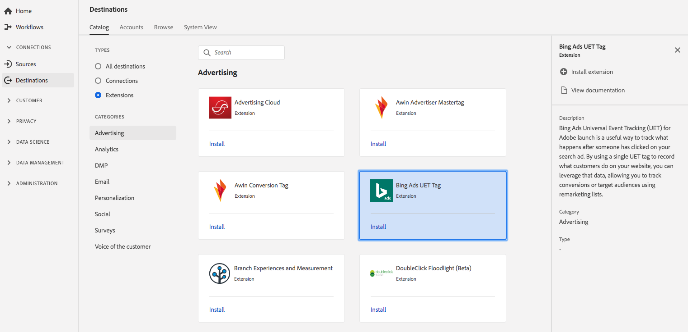

# Extension de suivi des universels Bing Ads (UET) {#bing-ads-extension}

## Aperçu {#overview}

Bing Publicités Universal  Tracking (UET) pour le lancement de la plateforme d’expérience est un moyen utile de suivre ce qui se passe après que quelqu’un a cliqué sur votre publicité de recherche. En utilisant une balise UET unique pour enregistrer ce que font les clients sur votre site Web, vous pouvez exploiter ces données, ce qui vous permet de suivre les conversions ou les    à l’aide del’outil de marketing de relance.

Bing Ads Universal Tracking (UET) est une extension publicitaire de la plateforme de données clientes Adobe en temps réel. Pour plus d’informations sur la fonctionnalité d’extension, voir la page d’extension d’ [Adobe Exchange](https://exchange.adobe.com/experiencecloud.details.100154.html).

Cette destination est une extension de lancement de plateforme d’expérience. Pour plus d’informations sur le fonctionnement des extensions de lancement dans le CDP en temps réel d’Adobe, voir Présentation [des extensions de lancement de plateforme](/help/rtcdp/destinations/experience-platform-launch-extensions.md)d’expérience.

## Conditions préalables {#prerequisites}

Cette extension est disponible dans le catalogue Destinations pour tous les clients qui ont acheté le CDP Adobe en temps réel.

Pour utiliser cette extension, vous devez accéder au lancement de la plateforme d’expérience. Le lancement de la plate-forme d’expérience est proposé aux clients d’Adobe Experience Cloud en tant que fonctionnalité à valeur ajoutée incluse. Contactez l’administrateur de votre organisation pour accéder à Launch et demandez-lui de vous accorder l’ **[!UICONTROL manage_properties]** autorisation d’installer les extensions.

## Extension d’installation {#install-extension}

Pour installer l’extension de suivi des  universels de Bing Ads (UET) :

1. Dans l’interface [CDP en temps réel d’](http://platform.adobe.com/)Adobe, accédez à **[!UICONTROL Destinations > Catalog]**.
2. Sélectionnez l’extension dans le catalogue ou utilisez la barre de recherche.
3. Cliquez sur la destination pour la mettre en surbrillance, puis sélectionnez-la **[!UICONTROL Install Extension]** dans le rail droit. Si le **[!UICONTROL Install Extension]** contrôle est grisé, vous n&#39;avez pas la **[!UICONTROL manage_properties]** permission. Voir [Conditions préalables](#prerequisites).
4. Dans la **[!UICONTROL Select available Launch property]** fenêtre, sélectionnez la propriété Launch dans laquelle vous souhaitez installer l’extension. Vous avez également la possibilité de créer une nouvelle propriété dans Lancer. Une propriété est un ensemble de règles, d’éléments de données, d’extensions configurées, d’environnements et de bibliothèques. Découvrez les propriétés dans la section [de la page](https://docs.adobe.com/content/help/en/launch/using/reference/admin/companies-and-properties.html#properties-page) Propriétés de la documentation sur le lancement.
5. Le flux de travaux vous amène à lancer pour terminer l’installation.

Pour plus d’informations sur les options de configuration de l’extension et la prise en charge de l’installation, voir la page [Bing Ads Universal Tracking (UET) sur Adobe Exchange](https://exchange.adobe.com/experiencecloud.details.100154.html).

Vous pouvez également installer l’extension directement dans l’interface [de lancement de la plateforme](https://launch.adobe.com/)d’expérience. Voir [Ajouter d’une nouvelle extension](https://docs.adobe.com/content/help/en/launch/using/reference/manage-resources/extensions/overview.html#add-a-new-extension) dans la documentation sur le lancement.

## How to use the extension {#how-to-use}

Une fois que vous avez installé l’extension, vous pouvez  configurer des règles pour cette extension directement dans Lancement.

Dans Lancer, vous pouvez configurer des règles pour vos extensions installées afin d’envoyer  données vers la destination de l’extension uniquement dans certaines situations. Pour plus d’informations sur la configuration de règles pour vos extensions, voir la documentation [sur les](https://docs.adobe.com/help/fr-FR/launch/using/reference/manage-resources/rules.translate.html)règles.

## Configuration, mise à niveau et suppression de l’extension {#configure-upgrade-delete}

Vous pouvez configurer, mettre à niveau et supprimer des extensions dans l’interface de lancement.

>[!TIP]
>
>Si l’extension est déjà installée sur l’une de vos propriétés, l’interface CDP en temps réel d’Adobe s’affiche toujours **[!UICONTROL Install]** pour l’extension. Démarrez le processus d’installation comme décrit dans [Installer l’extension](#install-extension) pour lancer et configurer ou supprimer votre extension.

Pour mettre à niveau votre extension, reportez-vous à la section Mise à niveau [de l’extension](https://docs.adobe.com/content/help/en/launch/using/reference/manage-resources/extensions/extension-upgrade.html) dans la documentation sur le lancement.
