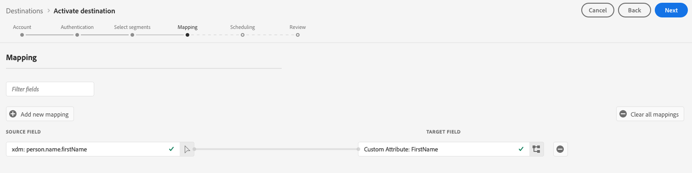
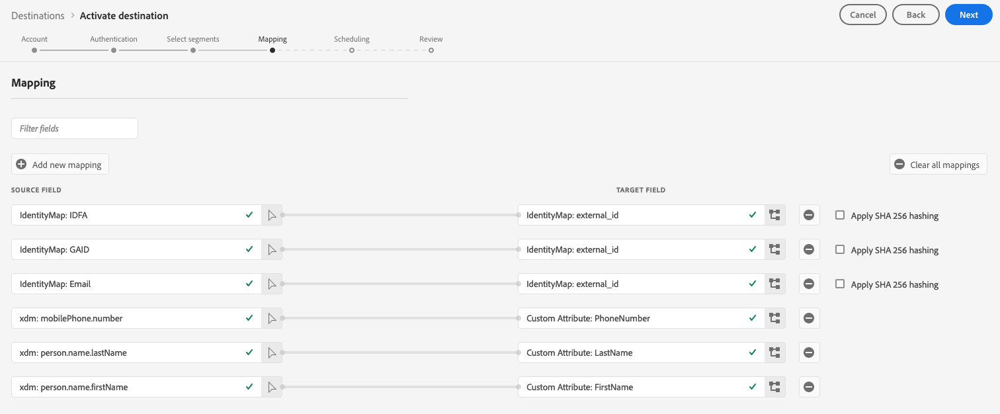

# (bêta) [!DNL Braze] destination

>[!IMPORTANT]
>
>La destination du braze à Adobe Experience Platform est actuellement en version bêta. La documentation et les fonctionnalités peuvent changer.

## Présentation {#overview}

La [!DNL Braze] destination vous aide à envoyer des données de profil à [!DNL Braze].

[!DNL Braze] est une plate-forme d&#39;engagement client complète qui permet d&#39;offrir des expériences pertinentes et mémorables entre les clients et les marques qu&#39;ils aiment.

Pour envoyer des données de profil à [!DNL Braze], vous devez d&#39;abord vous connecter à la destination.

## Spécifications de la destination {#destination-specs}

Note the following details that are specific to the [!DNL Braze] destination:

* Vous pouvez envoyer n’importe quelle [identité](../../identity-service/namespaces.md) à la [!DNL Braze] destination tant que vous la mappez à la [!DNL Braze][`external_id`](https://www.braze.com/docs/api/basics/#external-user-id-explanation).
* [!DNL Adobe Experience Platform] sont exportés vers [!DNL Braze] sous l’ `AdobeExperiencePlatformSegments` attribut.

## Cas d’utilisation {#use-cases}

En tant que spécialiste du marketing, je souhaite cible les utilisateurs dans une destination d’engagement mobile, avec des segments intégrés [!DNL Adobe Experience Platform]. En outre, je souhaite leur proposer des expériences personnalisées, basées sur des attributs de leurs [!DNL Adobe Experience Platform] profils, dès que les segments et les profils sont mis à jour dans [!DNL Adobe Experience Platform].

## Type d’exportation {#export-type}

**[!DNL Profile-based]** - vous exportez tous les membres d’un segment, ainsi que les champs de schéma de votre choix (par exemple : adresse électronique, numéro de téléphone, nom) et/ou identités, selon votre mappage de champs.
[!DNL Adobe Experience Platform] sont exportés vers [!DNL Braze] sous l’ `AdobeExperiencePlatformSegments` attribut.

## Se connecter à la destination {#connect-destination}

1. Dans **[!UICONTROL Connexions]** > **[!UICONTROL Destinations]**, sélectionnez [!DNL Braze], puis **[!UICONTROL Configurer]**.

   

   >[!NOTE]
   >
   >Si une connexion à cette destination existe déjà, un bouton **[!UICONTROL Activer]** s’affiche sur la carte de destination. Pour plus d&#39;informations sur la différence entre **[!UICONTROL Activer]** et **[!UICONTROL Configurer]**, consultez la section [Catalogue](../destinations/destinations-workspace.md#catalog) de la documentation de l&#39;espace de travail de destination.
   >
   >

1. A l’étape [!UICONTROL Compte] , vous devez fournir le jeton de votre [!DNL Braze] compte. C&#39;est ta [!DNL Braze][!DNL API] clé. Vous trouverez des instructions détaillées sur la façon d&#39;obtenir votre [!DNL API] clé ici : [Présentation](https://www.braze.com/docs/api/api_key/)de la clé d&#39;API REST. Saisissez le jeton et cliquez sur **[!UICONTROL Se connecter à la destination]**.
   

1. Cliquez sur **[!UICONTROL Suivant]**.

1. Dans l’étape [!UICONTROL Authentification] , vous devez entrer les détails de [!DNL Braze] connexion :
   * **[!UICONTROL Nom]**: entrez un nom qui vous permettra de reconnaître cette destination à l&#39;avenir.
   * **[!UICONTROL Description]**: entrez une description qui vous aidera à identifier cette destination dans le futur.
   * **[!UICONTROL Instance]** de point de terminaison : demandez à votre [!DNL Braze] représentant quelle instance de point de terminaison vous devez utiliser.
   * **[!UICONTROL Cas]** d’utilisation marketing : les cas d’utilisation marketing indiquent l’intention pour laquelle les données seront exportées vers la destination. Vous pouvez choisir parmi des cas d’utilisation marketing définis par Adobe ou créer votre propre cas d’utilisation marketing. Pour plus d’informations sur les cas d’utilisation du marketing, voir la page Gouvernance des [données dans Adobe Experience Platform](../privacy/data-governance-overview.md#destinations) . Pour plus d’informations sur les cas d’utilisation marketing définis par l’Adobe, voir la présentation [des stratégies d’utilisation des](../../data-governance/policies/overview.md#core-actions)données.

   

1. Cliquez sur **[!UICONTROL Créer une destination]**. Votre destination est maintenant créée. You can click **[!UICONTROL Save &amp; Exit]** if you want to activate segments later, or you can select **[!UICONTROL Next]** to continue the workflow and select segments to activate. In either case, see the next section, [Activate Segments](#activate-segments), for the rest of the workflow.

## Activation des segments {#activate-segments}

Pour obtenir des informations sur le processus d’activation des segments, voir [Activer les profils et les segments à une destination](activate-destinations.md#select-attributes).

## Mappage des champs {#field-mapping}

Pour envoyer correctement les données d’audience [!DNL Adobe Experience Platform] à la [!DNL Braze] destination, vous devez passer par l’étape de mappage des champs.

Le mappage consiste à créer un lien entre vos champs de schéma [!DNL Experience Data Model] (XDM) dans votre [!DNL Platform] compte et leurs équivalents correspondants à partir de la destination de la cible.

Pour mapper correctement vos champs XDM aux champs [!DNL Braze] de destination, procédez comme suit :

1. Dans l’étape [!UICONTROL Mappage] , cliquez sur **[!UICONTROL Ajouter un nouveau mappage]**.

   

2. Dans la section Champ  source, cliquez sur la flèche située en regard du champ vide.

   

3. Dans la fenêtre [!UICONTROL Sélectionner le champ] source, vous pouvez choisir entre deux catégories de champs XDM :
   * [!UICONTROL Sélectionner des attributs]: utilisez cette option pour mapper un champ spécifique de votre schéma XDM à un [!DNL Braze] attribut.

      

   * [!UICONTROL Sélectionner l&#39;espace de nommage]d&#39;identité : Utilisez cette option pour mapper un espace de nommage [!DNL Platform] d&#39;identité à un [!DNL Braze] espace de nommage.

      
   Sélectionnez votre champ source, puis cliquez sur **[!UICONTROL Sélectionner]**.

4. Dans la section Champ [!UICONTROL de] Cible, cliquez sur l’icône de mappage située à droite du champ.

   

5. Dans la fenêtre [!UICONTROL Sélectionner un champ] de cible, vous pouvez choisir entre trois catégories de champs de cible :
   * [!UICONTROL Sélectionner des attributs]: Utilisez cette option pour mapper vos attributs XDM aux attributs [!DNL Braze] standard.
   * [!UICONTROL Sélectionner l&#39;espace de nommage]d&#39;identité : Utilisez cette option pour mapper [!DNL Platform] les espaces de nommage d&#39;identité aux espaces de nommage [!DNL Braze] d&#39;identité.
   * [!UICONTROL Sélectionner des attributs]personnalisés : Utilisez cette option pour mapper les attributs XDM aux attributs personnalisés que vous avez définis dans votre [!DNL Braze] [!DNL Braze] compte.
      * Vous pouvez également utiliser cette option pour renommer les attributs XDM existants en [!DNL Braze]. Par exemple, le mappage d&#39;un attribut `lastName` XDM à un attribut personnalisé `Last_Name` dans [!DNL Braze], créera l&#39; `Last_Name` attribut dans [!DNL Braze], s&#39;il n&#39;existe pas déjà, et lui fera correspondre l&#39;attribut `lastName` XDM.

   

   Sélectionnez votre champ de cible, puis cliquez sur **[!UICONTROL Sélectionner]**.

6. Vous devriez maintenant voir votre mappage de champs dans la liste.

   

7. Pour ajouter d’autres mappages, répétez les étapes 1 à 6.

### Exemple {#mapping-example}

Supposons que votre schéma de profil XDM et votre [!DNL Braze] instance contiennent les attributs et identités suivants :

|  | Schéma de Profil XDM | [!DNL Braze] Instance |
|---|---|---|
| Attributs | <ul><li>person.name.firstName</code></li><li>person.name.lastName</code></li><li>mobilePhone.number</code></li></ul> | <ul><li>FirstName</code></li><li>LastName</code></li><li>PhoneNumber</code></li></ul> |
| Identités | <ul><li>E-mail</code></li><li>Identifiant de publicité Google (GAID)</code></li><li>Apple ID For Advertisers (IDFA)</code></li></ul> | <ul><li>external_id</code></li></ul> |

Le mappage correct se présenterait comme suit :

## Données exportées {#exported-data}

Pour vérifier si les données ont bien été exportées vers la [!DNL Braze] destination, vérifiez votre [!DNL Braze] compte. [!DNL Adobe Experience Platform] sont exportés vers [!DNL Braze] sous l’ `AdobeExperiencePlatformSegments` attribut.

## Utilisation des données et gouvernance {#data-usage-governance}

Toutes les destinations [!DNL Adobe Experience Platform] sont conformes aux règles d’utilisation des données lors de la gestion de vos données. Pour obtenir des informations détaillées sur la manière d’ [!DNL Adobe Experience Platform] appliquer la gouvernance des données, voir [Data Governance dans le CDP](/help/rtcdp/privacy/data-governance-overview.md)en temps réel.

