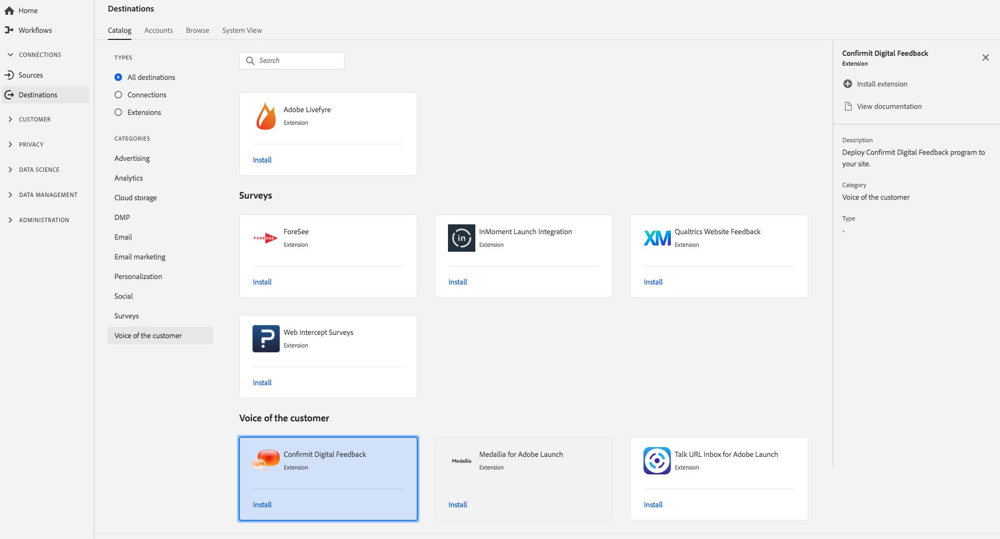

# Extension [!DNL Confirmit Digital Feedback]

## Présentation {#overview}

[!DNL Confirmit Digital Feedback] vous aide à transformer le trafic de votre site Web en informations en temps réel. With [!DNL Confirmit], unobtrusive and highly-targeted surveys can be displayed according to your requirements, encouraging visitors to provide feedback, such as:

* Commentaires sur le site web
* Satisfaction des transactions
* Motif de l’intention d’annulation
* Informations sur l’abandon de panier
* Satisfaction globale de la clientèle
* Et bien plus encore

[!DNL Confirmit] Digital Feedback est une extension de voix du client de la plateforme de données clients en temps réel d’Adobe. Pour plus d’informations sur les fonctionnalités de l’extension, consultez la page de l’extension dans [Adobe Exchange](https://exchange.adobe.com/experiencecloud.details.103247.confirmit-digital-feedback-for-adobe-launch.html).

Cette destination est une extension d’Experience Platform Launch. Pour plus d’informations sur le fonctionnement des extensions de Launch dans la plateforme de données clients en temps réel d’Adobe, consultez la [présentation des extensions d’Experience Platform Launch](/help/rtcdp/destinations/experience-platform-launch-extensions.md).

## Conditions préalables  {#prerequisites}

This extension is available in the [!DNL Destinations] catalog for all customers who have purchased Adobe Real-time CDP.

Pour utiliser cette extension, vous devez accéder à Experience Platform Launch. Experience Platform Launch est une fonctionnalité gratuite intégrée à Adobe Experience Cloud. Contactez l’administrateur de votre organisation pour accéder à Launch et demandez-lui de vous accorder l’autorisation **[!UICONTROL manage_properties]** afin que vous puissiez installer les extensions.

## Installation de l’extension {#install-extension}

To install the [!DNL Confirmit] Digital Feedback extension:

1. In the [Adobe Real-time CDP interface](http://platform.adobe.com/), go to **[!UICONTROL Destinations]** > **[!UICONTROL Catalog]**.
2. Sélectionnez l’extension dans le catalogue ou utilisez la barre de recherche.
3. Click on the destination to highlight it, then select **[!UICONTROL Configure]** in the right rail. If the **[!UICONTROL Configure]** control is greyed out, you are missing the **[!UICONTROL manage_properties]** permission. Voir les [Conditions préalables](#prerequisites).
4. Dans la fenêtre **[!UICONTROL Sélectionner la propriété Launch disponible]**, sélectionnez la propriété Launch dans laquelle vous souhaitez installer l’extension. Vous pouvez aussi créer une nouvelle propriété dans Launch. Une propriété est un ensemble de règles, d’éléments de données, d’extensions configurées, d’environnements et de bibliothèques. Pour en savoir plus sur les propriétés, consultez la [section de la page Propriétés](https://docs.adobe.com/content/help/fr-FR/launch/using/reference/admin/companies-and-properties.html#properties-page) de la documentation de Launch.
5. Le workflow vous redirige vers Launch pour terminer l’installation.

Pour plus d’informations sur les options de configuration de l’extension et la prise en charge de l’installation, consultez la [page Confirmit Digital Feedback sur Adobe Exchange](https://exchange.adobe.com/experiencecloud.details.103247.confirmit-digital-feedback-for-adobe-launch.html).

Vous pouvez aussi installer l’extension directement dans l’[interface d’Experience Platform Launch](https://launch.adobe.com/). Consultez la section [Ajout d’une nouvelle extension](https://docs.adobe.com/content/help/fr-FR/launch/using/reference/manage-resources/extensions/overview.html#add-a-new-extension) de la documentation de Launch.

## Utilisation de l’extension {#how-to-use}

Une fois que vous avez installé l’extension, vous pouvez commencer à configurer des règles pour cette extension directement dans Launch.

Dans Launch, vous pouvez configurer des règles pour vos extensions installées afin d’envoyer des données d’événement vers la destination de l’extension uniquement dans certains cas. Pour plus d’informations sur la configuration de règles pour vos extensions, consultez la [documentation des règles](https://docs.adobe.com/help/fr-FR/launch/using/reference/manage-resources/rules.html).

## Configuration, mise à niveau et suppression de l’extension {#configure-upgrade-delete}

Vous pouvez configurer, mettre à niveau et supprimer des extensions dans l’interface de Launch.

>[!TIP]
>
>Si l’extension est déjà installée sur l’une de vos propriétés, l’interface de la plateforme de données clients en temps réel d’Adobe affiche toujours **[!UICONTROL Install]** pour l’extension. Démarrez le workflow d’installation comme décrit dans [Installer l’extension](#install-extension) pour accéder à Launch et configurer ou supprimer votre extension.

Pour mettre à niveau votre extension, consultez la section [Mise à niveau d’extension](https://docs.adobe.com/content/help/fr-FR/launch/using/reference/manage-resources/extensions/extension-upgrade.html) dans la documentation de Launch.