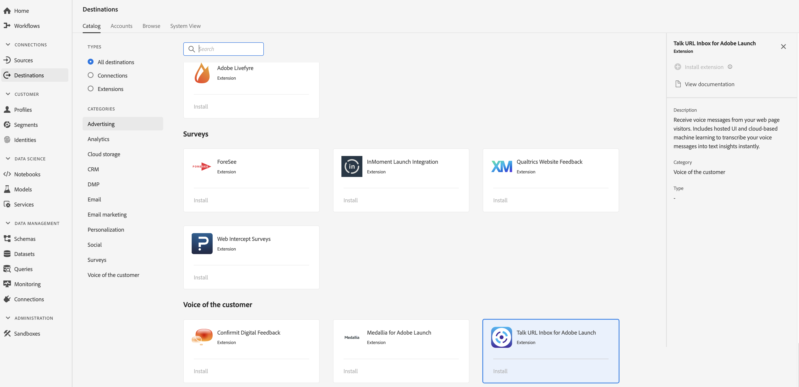

# [!DNL Talk URL Inbox] Extension {#talk-url-extension}

## Présentation {#overview}

Recevez des messages vocaux de la part des visiteurs de votre page web. Inclut l’interface utilisateur hébergée et l’apprentissage automatique dans le cloud pour transcrire instantanément vos messages vocaux en insights textuels.

[!DNL Talk URL Inbox] est une extension de voix du client de la plateforme de données clients en temps réel d’Adobe. Pour plus d’informations sur les fonctionnalités de l’extension, consultez la page de l’extension dans [Adobe Exchange](https://exchange.adobe.com/experiencecloud.details.100583.html).

Cette destination est une extension Adobe Experience Platform Launch. For more information about how Platform Launch extensions work in Adobe Real-time CDP, see [Adobe Experience Platform Launch extensions overview](/help/rtcdp/destinations/experience-platform-launch-extensions.md).

## Conditions préalables  {#prerequisites}

This extension is available in the [!DNL Destinations] catalog for all customers who have purchased Adobe Real-time CDP.

Pour utiliser cette extension, vous devez accéder à Adobe Experience Platform Launch.  Platform Launch est une fonctionnalité gratuite intégrée à Adobe Experience Cloud. Contact your organization administrator to get access to Platform Launch and ask them to grant you the **[!UICONTROL manage_properties]** permission so you can install extensions.

## Installation de l’extension {#install-extension}

Pour installer l’ [!DNL Talk URL Inbox] extension :

1. In the [Adobe Real-time CDP interface](http://platform.adobe.com/), go to **[!UICONTROL Destinations]** > **[!UICONTROL Catalog]**.
2. Sélectionnez l’extension dans le catalogue ou utilisez la barre de recherche.
3. Click on the destination to highlight it, then select **[!UICONTROL Configure]** in the right rail. If the **[!UICONTROL Configure]** control is greyed out, you are missing the **[!UICONTROL manage_properties]** permission. Voir les [Conditions préalables](#prerequisites).
4. In the **[!UICONTROL Select available Platform Launch property]** window, select the Platform Launch property in which you want to install the extension. Vous avez également la possibilité de créer une nouvelle propriété dans le lancement de plate-forme. Une propriété est un ensemble de règles, d’éléments de données, d’extensions configurées, d’environnements et de bibliothèques. Learn about properties in the [Properties page section](https://docs.adobe.com/content/help/fr-FR/launch/using/reference/admin/companies-and-properties.html#properties-page) of the Platform Launch documentation.
5. Le processus vous conduit au lancement de la plate-forme pour terminer l’installation.

Pour plus d’informations sur les options de configuration de l’extension et sur l’aide à l’installation, consultez la [page Talk URL Inbox sur Adobe Exchange](https://exchange.adobe.com/experiencecloud.details.100583.html).

You can also install the extension directly in the [Adobe Experience Platform Launch interface](https://launch.adobe.com/). See [Add a new extension](https://docs.adobe.com/content/help/fr-FR/launch/using/reference/manage-resources/extensions/overview.html#add-a-new-extension) in the Platform Launch documentation.

## Utilisation de l’extension {#how-to-use}

Une fois que vous avez installé l&#39;extension, vous pouvez début la configuration de règles pour celle-ci directement dans le lancement de la plate-forme.

Dans le lancement de plate-forme, vous pouvez configurer des règles pour vos extensions installées afin d&#39;envoyer des données de événement à la destination de l&#39;extension uniquement dans certaines situations. Pour plus d’informations sur la configuration de règles pour vos extensions, consultez la [documentation des règles](https://docs.adobe.com/help/fr-FR/launch/using/reference/manage-resources/rules.html).

## Configuration, mise à niveau et suppression de l’extension {#configure-upgrade-delete}

Vous pouvez configurer, mettre à niveau et supprimer des extensions dans l’interface de lancement de plate-forme.

>[!TIP]
>
>Si l’extension est déjà installée sur l’une de vos propriétés, l’interface de la plateforme de données clients en temps réel d’Adobe affiche toujours **[!UICONTROL Install]** pour l’extension. Kick off the installation workflow as described in [Install extension](#install-extension) to get to Platform Launch and configure or delete your extension.

To upgrade your extension, see [Extension upgrade](https://docs.adobe.com/content/help/fr-FR/launch/using/reference/manage-resources/extensions/extension-upgrade.html) in the Platform Launch documentation.