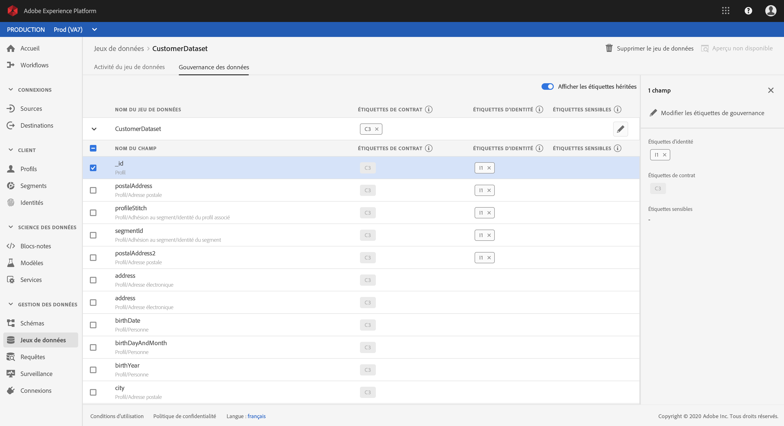
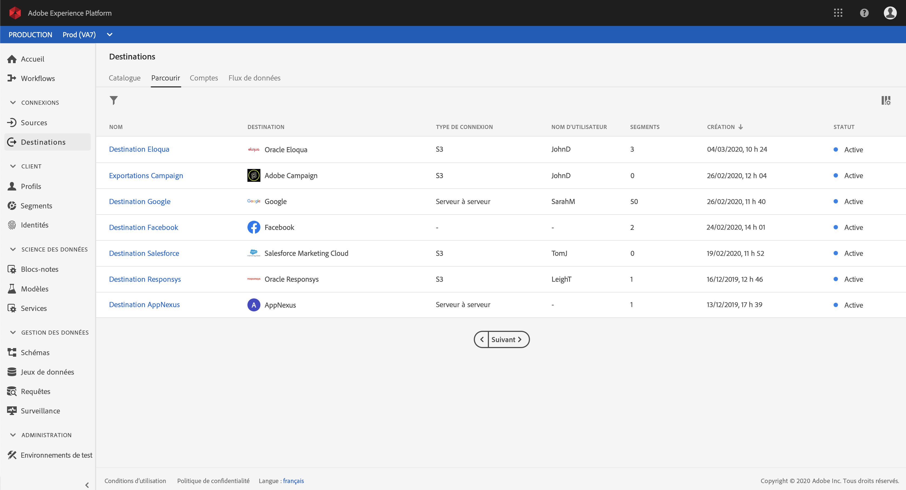
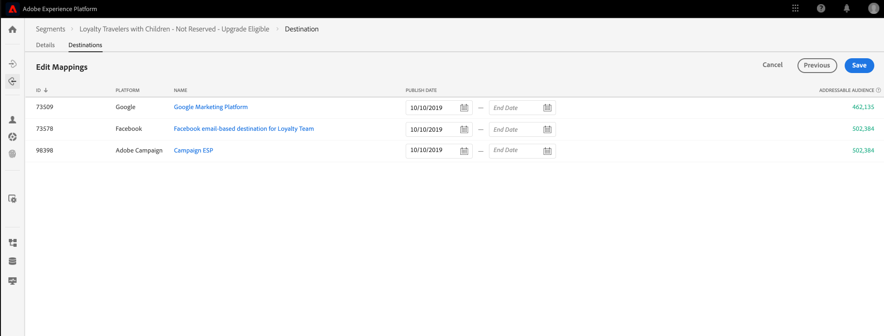

# Prise en main de la plateforme de données client en temps réel Adobe

Ce guide de prise en main vous accompagne tout au long d’un exemple de mise en œuvre de la plateforme de données client (CDP) en temps réel Adobe. Vous pouvez l’utiliser comme exemple lors de la configuration de votre propre mise en œuvre. Bien que ce guide présente des exemples spécifiques, il fournit des liens vers des informations supplémentaires que vous pouvez utiliser lors de la création de votre configuration.

Cet exemple illustre la puissance de la plateforme de données client en temps réel Adobe, optimisée par Adobe Experience Platform, pour :

* l’envoi de données à partir de plusieurs sources ;
* la fusion dans un profil client en temps réel unique ;
* la diffusion d’une expérience cohérente, pertinente et personnalisée sur tous les périphériques.

## Cas d’utilisation

Luma, une entreprise de vêtements de sport, cherche constamment à améliorer l’expérience client. L’entreprise a lancé une nouvelle initiative pour augmenter les ventes de cadeaux. Elle souhaite également réduire la surexposition, notamment les publicités intempestives que les clients reçoivent en permanence.

Actuellement, elle dépense trop sur les médias qui reciblent le client pour des articles qu’il n’achètera plus à l’avenir. Par exemple, Luma ne souhaite pas recibler une personne avec un article acheté pour quelqu’un d’autre.

Actuellement, les données de Luma sont dispersées entre plusieurs sources. Elle fait donc face à des défis importants :

* Le service marketing doit collaborer avec différentes équipes possédant chacune une source de données, notamment un site web, une application mobile, des systèmes de fidélité, un service de gestion de la relation client, etc.
* Au moment où l’équipe marketing accède aux données, elles sont souvent obsolètes et ne sont plus pertinentes pour les campagnes où le temps joue un rôle important.
* Elle doit unifier les données pour cibler une personne, pas les canaux.

Par conséquent, Luma a adopté les objectifs commerciaux suivants :

* Créer un aperçu unique en temps réel des consommateurs à partir de leurs sources de données disparates.
* Personnaliser les campagnes marketing avec des messages pertinents sur différents canaux et périphériques.

Pour atteindre ces objectifs, l’équipe marketing doit être en mesure de gérer les données client à l’échelle.

Grâce à la plateforme CDP en temps réel, optimisée par Adobe Experience Platform, l’équipe marketing de Luma peut :

1. collecter des données à partir de plateformes disparates et s’assurer qu’elles sont disponibles en aval pour d’autres activités de marketing ;
1. créer un aperçu unique en temps réel des consommateurs, indépendamment de l’origine des données ;
1. assurer une expérience cohérente, pertinente et personnalisée sur chaque point de contact.

## Étapes

Ce tutoriel comprend les étapes suivantes :

1. Création du [profil client](#customer-profile)
1. [Personnalisation](#personalizing-the-user-experience) de l’expérience utilisateur
1. Utilisation de [plusieurs sources de données](#using-multiple-data-sources)
1. [Configuration d’une source de données](#configuring-a-data-source)
1. [Collecte des données](#bringing-the-data-together-for-a-specific-customer) pour un client spécifique
1. Configuration des [segments](#segments)
1. Configuration des [destinations](#destinations)
1. [Ajout du profil sur plusieurs périphériques](#cross-device-identity-stitching).
1. [Analyse du profil](#analyzing-the-profile)

## Profil client

Lorsque les clients consultent votre site pour la première fois, vous ignorez tout d’eux.


Lors de leur navigation, les données sont capturées en temps réel et envoyées non seulement à une suite de rapports dans Adobe Analytics, mais également directement à Adobe Experience Platform. À mesure que les données sont collectées, vous commencez à constituer un aperçu unique du consommateur, basé sur les données comportementales du profil client en temps réel d’Experience Platform.

De nombreux visiteurs du site web sont probablement des clients réguliers qui ont déjà effectué des achats chez Luma.  Il est important que Luma personnalise les messages et les offres pour s’adresser aux nouveaux visiteurs et aux visiteurs réguliers, ainsi qu’aux clients connus.

### Première visite d’un nouveau client

Par exemple, un visiteur non identifié accède à la section Hommes sur le site de Luma et consulte plusieurs pulls pour la course à pied.


Lorsque le client clique pour en savoir plus sur ces produits, ces consultations des produits sont collectées dans Adobe Analytics et envoyées à Experience Platform.

<!---->

Luma peut faire correspondre le comportement du visiteur à un profil utilisateur sur Adobe Experience Platform et commencer à obtenir un aperçu plus riche du comportement de ce consommateur.

### Obtention d’un aperçu plus détaillé du client

Plus le client interagit avec le site web, plus l’aperçu se précise. Supposons, par exemple, que le visiteur ajoute un produit au panier et qu’il se connecte.

Le client se connecte et s’identifie sous le nom de Marie Dupont.


Deux identités sont fusionnées :

* Les données de navigation anonymes
* Les données existantes associées au compte de Marie Dupont

Les deux identités sont combinées dans un profil unique dans Experience Platform. Luma dispose désormais d’un aperçu unifié de ce consommateur.

Le comportement de navigation du visiteur anonyme dans la section Hommes du site pouvait laisser penser que le client était un homme. Maintenant qu’elle est connectée, Luma reconnaît Marie Dupont. Luma utilise la puissance du profil client en temps réel pour affiner les messages qui lui sont adressés via les différents canaux.

## Personnalisation de l’expérience utilisateur

Marie reçoit un message de bienvenue qui la remercie de son statut de membre Bronze et lui offre de plus amples informations sur les avantages et la manière d’améliorer son statut et d’augmenter ses points.

Elle clique sur la page d’accueil pour continuer à naviguer.


Marie bénéficie d’une expérience de page d’accueil personnalisée diffusée dynamiquement, en fonction de son profil client en temps réel dans Adobe Experience Platform.

Elle voit le contenu pertinent, grâce à la personnalisation optimisée par Adobe Sensei dans Adobe Target, qui prend en compte ses achats précédents et son intérêt pour les vêtements et l’équipement de course à pied. Luma adapte également le contenu du catalogue pour hommes à l’équipement de course pour hommes sur base de ses dernières recherches.

Plus bas sur la page, Marie découvre les produits phares, ainsi que de nouvelles recommandations basées sur ses derniers articles consultés.

Ce contenu personnalisé permet à Marie de trouver les articles qui l’intéressent rapidement. Cela augmente les conversions et offre une expérience client plus agréable.

### Récupération du client

Marie change d’activité et quitte le site, mettant fin à sa session. Luma peut utiliser ses données dans Adobe Experience Platform pour l’inciter à revenir sur le site.

La plateforme de données client en temps réel Adobe, optimisée par Adobe Experience Platform, est conçue pour la gestion de l’expérience client. Elle permet aux entreprises :

* de simplifier l’intégration et l’activation des données ;
* de gérer l’utilisation des données connues et inconnues ;
* d’accélérer les cas d’utilisation du marketing à l’échelle.

## Utilisation de plusieurs sources de données

L’équipe de Luma dispose de toutes les données comportementales et client en un seul endroit.


Elle peut envoyer des données à partir de toutes les sources suivantes :

* Données des solutions Adobe Experience Cloud existantes
* Sources autres qu’Adobe, telles que le programme de fidélité de Luma, le centre d’appel et les données du système de point de vente
* Données de flux en temps réel à partir de sources de données Luma
* Données en temps réel provenant des solutions Adobe (aucune nouvelle balise n’est requise)

Toutes ces données provenant de sources disparates sont fusionnées dans un profil client unique et unifié.

## Configuration d’une source de données

Utilisez la plateforme de données client en temps réel pour importer de nouvelles sources de données dans la plateforme. La plateforme CDP en temps réel comprend un catalogue de sources de données qui peut être ajouté au profil en quelques clics seulement.


Par exemple, pour envoyer les données de gestion de la relation client de Luma, filtrez le catalogue par *gestion de la relation client* et tous les connecteurs prêts à l’emploi contenant de la *gestion de la relation client* sont répertoriés. Pour ajouter des données de Microsoft Dynamics CRM :

1. Autorisez la connexion.

   

1. Choisissez ce que vous souhaitez importer depuis une liste recommandée de tables XDM mappées au préalable.

   <!--     -->

   Par exemple, sélectionnez **[!UICONTROL Contacts]**. Un aperçu des données des contacts est automatiquement chargé afin que vous puissiez vous assurer que tout fonctionne comme prévu.

   Adobe Experience Platform élimine une grande partie du travail manuel de ce processus en mappant automatiquement les champs standard au schéma de profil du modèle de données d’expérience (XDM).

1. Examinez les mappages des champs.

   <!--     -->

   Par exemple, revérifiez que le champ d’adresse électronique des contacts est correctement mappé.\
   Vous pouvez prévisualiser les données et effectuer un mappage avancé.

1. Définissez un planning.

   

C’est fait. Vous venez d’ajouter Microsoft CRM en tant que source de données dans Experience Platform.

### Étiquetage des données assimilées pour les stratégies d’utilisation

Luma a de nombreuses règles internes qui limitent l&#39;utilisation de certains types d&#39;informations collectées, et doit également se conformer aux préoccupations légales et de confidentialité concernant l&#39;utilisation des données. Grâce à la gouvernance des données d’Adobe Experience Platform, des libellés d’utilisation de données prédéfinis peuvent être appliqués aux jeux de données (et à des champs spécifiques de ces jeux de données), ce qui permet à Luma de classer leurs données en fonction de restrictions d’utilisation spécifiques.



Une fois les étiquettes d’utilisation des données appliquées, Luma peut alors utiliser la gouvernance des données pour créer des stratégies d’utilisation des données. Les stratégies d’utilisation des données sont des règles qui décrivent les types d’actions que vous êtes autorisé à effectuer sur les données qui contiennent certains libellés. Lorsque vous tentez d’effectuer une action dans le CDP en temps réel qui constitue une violation de la stratégie, l’action est empêchée et une alerte est donnée pour montrer quelle stratégie a été violée et pourquoi.

## Regroupement des données pour un client spécifique

Dans ce scénario, parcourez les profils à la recherche de Marie Dupont. Son profil s’affiche, avec l’adresse électronique qu’elle a utilisée pour se connecter.

<!--  -->

Toutes les informations que Luma possède sur le profil de Marie s’affichent. Cela inclut ses informations personnelles comme son adresse et son numéro de téléphone, ses préférences de communication et les segments pour lesquels elle est admissible.

| Catégorie | Description |
|---|---|
| Identités | Affiche les identités liées entre elles dans Platform à partir des interactions entre Marie et Luma sur les différents canaux et périphériques. Son ECID du site web s’affiche. Son identité comprend également l’ECID de son application mobile, son identifiant de courrier électronique, un identifiant de logiciel de gestion de la relation client du jeu de données Microsoft Dynamics récemment ajouté et un identifiant de fidélité transmis à Adobe Experience Platform par le système de fidélité de Luma. |
| Événements | Affiche toutes les données d’interaction entre Marie et la marque Luma. Cela inclut l’article qu’elle vient de consulter, l’historique de ses consultations, les courriels qu’elle a reçus, ses interactions avec le centre d’appel, ainsi que le canal et le périphérique utilisés pour chacune de ces interactions. |

Le CDP en temps réel réduit le flux de travail de l&#39;équipe marketing Luma de semaines en minutes et déverrouille les possibilités de personnalisation en fonction de ce client à 360 degrés. Le profil fusionne les données comportementales recueillies lors de sa navigation sur le site avant qu’elle ne se connecte, avec son profil client existant, créant ainsi un aperçu complet de Marie.

L’équipe marketing peut utiliser ce profil client en temps réel amélioré pour mieux personnaliser l’expérience de Marie et accroître sa fidélité à la marque Luma.

## Segments

Les puissantes fonctionnalités de segmentation d’Adobe Experience Platform permettent aux spécialistes marketing de combiner des attributs, des événements et des segments existants, en fonction des données capturées dans le profil client en temps réel.

<!--  -->

Dans ce scénario, les interactions récentes de Marie sur le site montrent un comportement différent de ses actions passées. Elle achète habituellement des vêtements pour femmes. Cependant, l’article dans son panier est un pull pour homme de taille L.

L’équipe de science des données de Luma a créé des modèles autour de la propension à acheter. Un modèle indique un changement soudain de catégorie de vêtements (hommes/femmes, par exemple) ou de taille pour le consommateur existant. Le changement de comportement d’achat de Marie suggère qu’elle n’achète pas pour elle-même.

<!--  -->

### Définition d’un segment

Modifiez ou créez un segment représentant les personnes qui abandonnent leur panier et qui semblent rechercher un cadeau :

```
Profile: Category != Preferred Category 
AND 
Product Size != Preferred Size 
in last 7 days.  
AND 
Abandoned Cart 
AND 
Loyalty member 
```

<!-- -->

Comme Marie a ajouté un article qui semble être un cadeau dans le panier et l’a abandonné, Luma peut lui proposer un emballage cadeau gratuit.

## Destinations

Lorsque vous avez ajouté le segment « Personnes abandonnant un panier contenant un cadeau », vous pouvez consulter le nombre approximatif de personnes qui font partie de ce segment. Vous pouvez intervenir et offrir une personnalisation par le biais de différents canaux.

Cliquez sur **[!UICONTROL Envoyer vers les destinations]**.

Dans la plateforme CDP en temps réel Adobe, Luma peut intervenir en toute simplicité sur les segments ciblés afin de les personnaliser.\
Nous voyons ici toutes les destinations disponibles auxquelles Luma peut envoyer cette destination, qu’il s’agisse de solutions Adobe ou de solutions autres qu’Adobe.



### Sélection des destinations

Dans ce scénario, Luma souhaite recibler cette audience en personnalisant ces destinations :

* Google, pour l’affichage
   <!--* Facebook -->
* Adobe Campaign, pour le courrier électronique

<!--  -->

### Planification des destinations

Vous pouvez également choisir un moment précis pour programmer le début ou la fin du segment. Le segment est publié et mis à jour automatiquement dans les plateformes configurées aux dates prévues.

>[!NOTE]
>Vous pouvez également cliquer dans le champ de la date pour programmer automatiquement un délai de 90 jours.

Cliquez sur **[!UICONTROL Enregistrer]** pour accéder à la page suivante.

Lorsqu’un client de cette audience effectue un achat, son abonnement à cette audience est supprimé en temps réel. Il n’est plus admissible puisque son statut a changé.

Cela permet au directeur de l’équipe des médias de Luma d’économiser des centaines de milliers de dollars en n’utilisant pas l’inventaire pour une audience qui n’est pas admissible.

### Application de stratégies d’utilisation des données pour les destinations

Adobe Experience Platform inclut des contrôles de confidentialité et de sécurité pour déterminer si un segment est disponible pour être activé sur une destination particulière.   est activée ou restreinte en fonction des objectifs marketing affectés à la destination au moment de sa création, ainsi que des stratégies d’utilisation des données définies par votre organisation.

Si votre   enfreint la politique, un avertissement s’affiche. Cet avertissement contient des informations de lignage de données qui peuvent vous aider à identifier la raison pour laquelle la stratégie a été violée et ce que vous pouvez faire pour résoudre la violation.

Grâce à ces contrôles, Experience Platform aide Luma à se conformer aux réglementations et à commercialiser de manière responsable. Ces contrôles sont souples et peuvent être modifiés pour répondre aux exigences des équipes de sécurité et de gouvernance de Luma, ce qui leur permet de répondre en toute confiance aux exigences régionales et organisationnelles de gestion des données clients connues et inconnues.

### Canevas de flux de données

Lors de l’enregistrement, un canevas visuel de flux de données affiche le segment du profil unifié mappé aux trois destinations sélectionnées.


## Ajout d’identités sur plusieurs périphériques

Marie consulte un site de réseau social sur son appareil mobile et voit une publicité Luma. Cela lui rappelle l’article qu’elle a laissé dans son panier.

Plus tard, elle ouvre sa messagerie électronique et voit les courriers électroniques reciblés. Elle clique sur un lien vers Luma à partir d’un courrier électronique.

Ce lien la dirige sur la page d’accueil mobile de Luma, où elle bénéficie d’une expérience hautement personnalisée optimisée par Adobe Target.

* Elle est accueillie en tant que membre Bronze.
* Elle voit le message « Cadeau ».
* Elle voit aussi le message « Emballage cadeau gratuit », qui fait partie des avantages de son statut de membre Bronze.
* Elle est toujours ciblée sur l’image à forte identification en raison de son intérêt pour la course à pied.

Elle achète le pull, ajoute un emballage cadeau et rédige un message pour accompagner le cadeau. Elle peut aussi choisir de recevoir un rappel l’année prochaine pour se souvenir d’acheter un cadeau à l’occasion de cet événement. Elle choisit d’activer cette option et une campagne par e-mail est prévue l’année suivante pour lui rappeler d’acheter un autre cadeau.

Grâce aux capacités de suppression d’audience, Marie ne sera pas ciblée avec ce pull pour hommes à l’avenir.

## Analyse du profil

Les spécialistes marketing de Luma utilisent Adobe Experience Platform pour analyser le segment des clients qui offrent des cadeaux sur le tableau de bord de la plateforme CDP en temps réel. Ils observent les résultats de cette initiative au fil du temps et constatent qu’elle se développe. Les clients réagissent aux offres et dépensent plus d’argent.

Ces informations permettent aux spécialistes marketing de réagir à ce signal, qui a été alimenté par la disponibilité de ces données dans la plateforme CDP et l’association de clients comme Marie à ce segment.

Luma utilise les données de cette plateforme CDP pour améliorer la fidélité et la satisfaction de ses clients.
