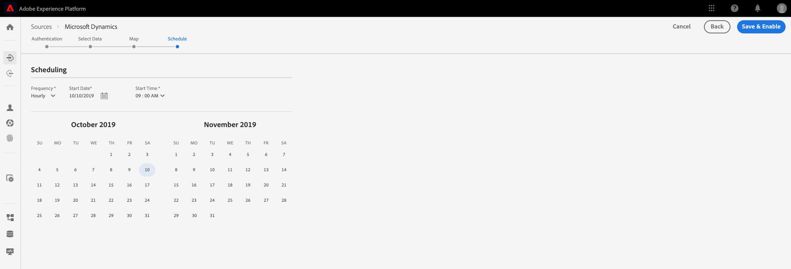

# Prise en main de la plateforme des données clients en temps réel d’Adobe

Ce guide de prise en main vous accompagne tout au long d’un exemple d’implémentation de la plateforme des données clients en temps réel d’Adobe. Vous pouvez l’utiliser comme exemple lors de la configuration de votre propre implémentation. Bien que ce guide présente des exemples spécifiques, il fournit des liens vers des informations supplémentaires que vous pouvez utiliser lors de la création de votre configuration.

Cet exemple illustre la puissance de la plateforme des données clients en temps réel d’Adobe, optimisée par Adobe Experience Platform, pour :

* ingérer des données à partir de plusieurs sources ;
* fusionner les données dans un profil client en temps réel unique ;
* diffuser une expérience cohérente, pertinente et personnalisée sur tous les appareils.

## Cas d’utilisation

Luma, une entreprise de vêtements de sport, cherche constamment à améliorer son expérience client. L’entreprise a lancé une nouvelle initiative pour augmenter les ventes de cadeaux. Elle souhaite également réduire la surexposition, notamment les publicités intempestives que les clients reçoivent en permanence.

Actuellement, elle consacre une trop grande partie de son budget pour les médias qui reciblent le client pour des articles qu’il n’achètera plus. Par exemple, Luma ne souhaite pas recibler une personne ayant acheté un article pour quelqu’un d’autre de manière ponctuelle.

Actuellement, les données de Luma sont dispersées dans plusieurs sources. Elle fait donc face à des défis importants :

* Le service marketing doit collaborer avec différentes équipes possédant chacune une source de données, notamment un site web, une application mobile, des systèmes de fidélité, un système CRM, etc.
* Au moment où l’équipe marketing accède aux données, elles sont souvent obsolètes et ne sont plus pertinentes pour les campagnes où le temps joue un rôle important.
* Elle doit unifier les données pour cibler une personne, et non les canaux.

Par conséquent, Luma a adopté les objectifs suivants :

* Créer une vue unique en temps réel des clients à partir de ses sources de données disparates
* Personnaliser les campagnes marketing avec des messages pertinents sur différents canaux et appareils

Pour atteindre ces objectifs, l’équipe marketing doit être en mesure de gérer les données clients à l’échelle.

Grâce à la plateforme des données clients en temps réel, optimisée par Adobe Experience Platform, l’équipe marketing de Luma peut :

1. collecter des données à partir de plateformes disparates et s’assurer qu’elles sont disponibles en aval pour d’autres activités marketing ;
1. créer une vue unique en temps réel des consommateurs, indépendamment de l’origine des données ;
1. offrir une expérience cohérente, pertinente et personnalisée sur chaque point de contact.

## Étapes

Ce tutoriel comprend les étapes suivantes :

1. Création du [profil client](#customer-profile)
1. [Personnalisation](#personalizing-the-user-experience) de l’expérience utilisateur
1. Utilisation de [plusieurs sources de données](#using-multiple-data-sources)
1. [Configuration d’une source de données](#configuring-a-data-source)
1. [Collecte des données](#bringing-the-data-together-for-a-specific-customer) pour un client spécifique
1. Configuration des [segments](#segments)
1. Configuration des [destinations](#destinations)
1. [Ajout du profil sur plusieurs appareils](#cross-device-identity-stitching)
1. [Analyse du profil](#analyzing-the-profile)

## Profil client

Lorsque les clients consultent votre site pour la première fois, vous ignorez tout d’eux.


Pendant leur navigation, des données sont capturées en temps réel et envoyées non seulement à une suite de rapports dans Adobe Analytics, mais également directement à Adobe Experience Platform. À mesure que les données sont collectées, vous commencez à créer une vue unique du consommateur, basée sur les données comportementales du profil client en temps réel d’Experience Platform.

De nombreux visiteurs du site web sont probablement des clients réguliers qui ont déjà effectué des achats chez Luma.  Il est important que Luma personnalise les messages et les offres pour s’adresser aux nouveaux visiteurs, aux visiteurs réguliers, ainsi qu’aux clients connus.

### Première visite d’un nouveau client

Par exemple, un visiteur non identifié accède à la section Hommes du site de Luma et consulte plusieurs sweats pour la course à pied.


Lorsque le client clique pour en savoir plus sur ces produits, ces consultations de produit sont collectées dans Adobe Analytics et envoyées à Experience Platform.

<!---->

Luma peut faire correspondre le comportement du visiteur à un profil utilisateur sur Adobe Experience Platform et commencer à obtenir une vue plus complète du comportement de ce consommateur.

### Obtention d’une vue plus détaillée du client

Plus le client interagit avec le site web, plus la vue devient précise. Supposons, par exemple, que le visiteur ajoute un produit au panier et qu’il se connecte.

Lorsqu’il se connecte, il s’identifie sous le nom de Sarah Rose.


Deux identités sont fusionnées :

* Les données de navigation anonymes
* Les données existantes associées au compte de Sarah Rose

Les deux identités sont combinées dans un profil unique dans Experience Platform. Luma dispose désormais d’une vue unifiée de ce consommateur.

Le comportement de navigation du visiteur anonyme dans la section Hommes du site pouvait laisser penser que le client était un homme. Maintenant qu’elle est connectée, Luma reconnaît Sarah Rose. Luma utilise la puissance du profil client en temps réel pour affiner les messages qui lui sont diffusés via les différents canaux.

## Personnalisation de l’expérience utilisateur

Sarah reçoit un message qui la remercie de son statut de membre Bronze et lui offre des informations supplémentaires sur les avantages de son statut et la façon de l’améliorer en augmentant son nombre de points.

Elle clique sur la page d’accueil pour continuer à naviguer.


Sarah bénéficie d’une expérience de page d’accueil personnalisée diffusée dynamiquement, en fonction de son profil client en temps réel dans Adobe Experience Platform.

Elle voit du contenu pertinent, grâce à la personnalisation optimisée par Adobe Sensei dans Adobe Target, qui prend en compte ses achats précédents et son intérêt pour les vêtements de course à pied. Luma adapte également le contenu du catalogue pour hommes à l’équipement de course pour hommes sur la base de ses dernières recherches.

Plus bas sur la page, Sarah découvre les produits phares, ainsi que de nouvelles suggestions basées sur les derniers articles consultés.

Ce contenu personnalisé permet à Sarah de trouver les articles qui l’intéressent rapidement. Cela augmente les conversions et offre une expérience client plus agréable.

### Récupération du client

Sarah change d’activité et quitte le site, mettant fin à sa session. Luma peut utiliser ses données dans Adobe Experience Platform pour l’inciter à revenir sur le site.

La plateforme des données clients en temps réel d’Adobe, optimisée par Adobe Experience Platform, a été conçue pour la gestion de l’expérience client. Elle permet aux entreprises :

* de simplifier l’intégration et l’activation des données ;
* de gérer l’utilisation des données connues et inconnues ;
* d’accélérer les cas d’utilisation marketing à l’échelle.

## Utilisation de plusieurs sources de données

L’équipe de Luma dispose de toutes les données comportementales et clients à un seul et même endroit.


Elle peut ingérer des données à partir de toutes les sources suivantes :

* Données des solutions Adobe Experience Cloud existantes
* Sources autres qu’Adobe, comme le programme de fidélité de Luma, le centre d’appels et les données du système de point de vente
* Données de flux en temps réel à partir de sources de données Luma
* Données en temps réel provenant des solutions Adobe (aucune nouvelle balise n’est requise)

Toutes ces données provenant de sources disparates sont fusionnées dans un profil client unique et unifié.

## Configuration d’une source de données

Utilisez la plateforme des données clients en temps réel pour importer de nouvelles sources de données dans la plateforme. La plateforme des données clients en temps réel comprend un catalogue de sources de données qui peut être ajouté au profil en quelques clics seulement.


Par exemple, pour ingérer les données CRM de Luma, filtrez le catalogue par *CRM*. Tous les connecteurs prêts à l’emploi contenant *CRM* sont alors répertoriés. Pour ajouter des données de Microsoft Dynamics CRM :

1. Autorisez la connexion.

   

1. Choisissez ce que vous souhaitez importer depuis une liste recommandée de tables XDM mappées au préalable.

   <!--     -->

   Par exemple, sélectionnez **[!UICONTROL Contacts]**. Un aperçu des données de contacts est automatiquement chargé afin que vous puissiez vous assurer que tout fonctionne comme prévu.

   Adobe Experience Platform élimine une grande partie du travail manuel de ce processus en mappant automatiquement les champs standard au schéma de profil XDM.

1. Examinez les mappages des champs.

   <!--     -->

   Par exemple, revérifiez que le champ d’adresse électronique des contacts est correctement mappé.\
   Vous pouvez prévisualiser les données et effectuer un mappage avancé.

1. Définissez un planning.

   

C’est fait. Vous venez d’ajouter Microsoft CRM en tant que source de données dans Experience Platform.

### Étiquetage des données ingérées pour les politiques d’utilisation

Luma dispose de nombreuses politiques internes qui limitent l’utilisation de certains types d’informations collectées et doit également prendre en compte les questions juridiques et de confidentialité liées à l’utilisation des données. Grâce à la gouvernance des données Adobe Experience Platform, des libellés d’utilisation de données prédéfinis peuvent être appliqués aux jeux de données (et à des champs spécifiques de ces jeux de données), ce qui permet à Luma de classer ses données en fonction de restrictions d’utilisation spécifiques.


Une fois les libellés d’utilisation des données appliquées, Luma peut alors utiliser la gouvernance des données pour créer des politiques d’utilisation des données. Les politiques d’utilisation des données sont des règles qui décrivent les types d’actions que vous êtes autorisé à effectuer sur les données qui contiennent certains libellés. Lorsque vous tentez d’effectuer une action dans la plateforme des données clients en temps réel qui constitue une violation de politique, cette action est bloquée et une alerte est déclenchée pour indiquer quelle politique a été violée et pourquoi.

## Regroupement des données pour un client spécifique

Dans ce scénario, parcourez les profils à la recherche de Sarah Rose. Son profil s’affiche, avec l’adresse électronique qu’elle a utilisée pour se connecter.

<!--  -->

Toutes les informations que Luma possède sur le profil de Sarah s’affichent. Elles comprennent ses informations personnelles comme son adresse et son numéro de téléphone, ses préférences de communication et les segments pour lesquels elle est admissible.

| Catégorie | Description |
|---|---|
| Identités | Affiche les identités liées entre elles dans Platform à partir des interactions entre Sarah et Luma sur les différents canaux et appareils. Son ECID du site web s’affiche. Son identité comprend également l’ECID de son application mobile, son identifiant e-mail, un identifiant CRM du jeu de données Microsoft Dynamics récemment ajouté et un identifiant de fidélité transmis à Adobe Experience Platform par le système de fidélité de Luma. |
| Événements | Affiche toutes les données d’interaction de Sarah avec la marque Luma. Ces données comprennent l’article qu’elle vient de consulter, l’historique de ses consultations, les e-mails qu’elle a reçus, ses interactions avec le centre d’appels, ainsi que le canal et l’appareil utilisés pour chacune de ces interactions. |

Le profil de la plateforme des données clients en temps réel réduit le flux de travail de l’équipe marketing de Luma et offre de nouvelles possibilités de personnalisation grâce à cette vue client à 360 degrés. Le profil fusionne les données comportementales recueillies lors de sa navigation sur le site avant qu’elle ne se connecte, avec son profil client existant, créant ainsi une vue complète de Sarah.

L’équipe marketing peut utiliser ce profil client en temps réel amélioré pour mieux personnaliser l’expérience de Sarah et accroître sa fidélité à la marque Luma.

## Segments

Les puissantes fonctionnalités de segmentation d’Adobe Experience Platform permettent aux marketeurs de combiner des attributs, des événements et des segments existants, en fonction des données capturées dans le profil client en temps réel.

<!--  -->

Dans ce scénario, les interactions récentes de Sarah sur le site montrent un comportement différent de ses actions passées. Elle achète habituellement des vêtements pour femmes. Cependant, l’article dans son panier est un sweat pour homme de taille L.

L’équipe de science des données de Luma a créé des modèles autour de la propension à acheter. Un modèle indique un changement soudain de catégorie de vêtements (hommes/femmes, par exemple) ou de taille pour le consommateur existant. Le changement de comportement d’achat de Sarah suggère qu’elle n’achète pas pour elle-même.

<!--  -->

### Définition d’un segment

Modifiez ou créez un segment représentant les personnes qui abandonnent leur panier et qui semblent rechercher un cadeau :

```
Profile: Category != Preferred Category 
AND 
Product Size != Preferred Size 
in last 7 days.  
AND 
Abandoned Cart 
AND 
Loyalty member 
```

<!-- -->

Comme Sarah a ajouté un article qui semble être un cadeau dans le panier et l’a abandonné, Luma peut lui proposer un emballage cadeau gratuit.

## Destinations

Lorsque vous avez ajouté le segment « Personnes abandonnant un panier contenant un cadeau », vous pouvez consulter le nombre approximatif de personnes qui font partie de ce segment. Vous pouvez prendre des mesures et proposer une personnalisation par le biais de différents canaux.

Cliquez sur **[!UICONTROL Envoyer vers les destinations]**.

Dans la plateforme des données clients en temps réel d’Adobe, Luma peut prendre des mesures en toute transparence sur les segments d’audience pour la personnalisation.\
Nous voyons ici toutes les destinations disponibles auxquelles Luma peut envoyer cette destination, qu’il s’agisse de solutions Adobe ou de solutions autres qu’Adobe.


### Sélection des destinations

Dans ce scénario, Luma souhaite recibler cette audience avec personnalisation sur ces destinations :

* Google, pour le display
   <!--* Facebook -->
* Adobe Campaign, pour les emails

<!--  -->

### Planification des destinations

Vous pouvez également choisir un moment précis pour planifier le début ou la fin du segment. Le segment est publié et mis à jour automatiquement dans les plateformes configurées aux dates prévues.

>[!NOTE]
>Vous pouvez également cliquer dans le champ de la date pour effectuer automatiquement une planification pendant 90 jours.

Cliquez sur **[!UICONTROL Enregistrer]** pour accéder à la page suivante.

Lorsqu’un client de cette audience effectue un achat, son appartenance à cette audience est supprimée en temps réel. Il n’est plus qualifié, puisque son statut a changé.

Le responsable de l’équipe des médias de Luma peut ainsi économiser des centaines de milliers d’euros en n’utilisant pas l’inventaire pour une audience qui n’est pas qualifiée.

### Application des politiques d’utilisation des données pour les destinations

Adobe Experience Platform comprend des contrôles de confidentialité et de sécurité pour déterminer si un segment est disponible pour activation sur une destination particulière. L’activation est possible ou restreinte en fonction de des objectifs marketing affectés à la destination au moment de sa création, ainsi que des politiques d’utilisation des données définies par votre organisation.

Si votre activité enfreint la politique, un avertissement s’affiche. Cet avertissement contient des informations de lignage de données qui peuvent vous aider à identifier la raison de la violation de la politique et ce que vous pouvez faire pour résoudre la violation.

Grâce à ces contrôles, Experience Platform aide Luma à se conformer aux réglementations et à réaliser un marketing responsable. Ces contrôles sont souples et peuvent être modifiés pour répondre aux besoins des équipes de sécurité et de gouvernance de Luma. Elles peuvent ainsi respecter en toute confiance les exigences régionales et organisationnelles de gestion des données clients connues et inconnues.

### Canevas de flux de données

Lors de l’enregistrement, un canevas visuel de flux de données affiche le segment mappé à partir du profil unifié aux trois destinations sélectionnées.


## Ajout d’identités sur plusieurs appareils

Sarah consulte un site de médias sociaux sur son appareil mobile et voit une publicité Luma. Celle-ci lui rappelle l’article qu’elle a laissé dans son panier.

Plus tard dans la journée, elle ouvre sa messagerie et découvre les e-mails reciblés. Elle clique sur un lien vers Luma depuis un e-mail.

Ce lien la redirige vers la page d’accueil mobile de Luma, où elle bénéficie d’une expérience hautement personnalisée, optimisée par Adobe Target.

* Elle est accueillie en tant que membre Bronze.
* Elle voit le message « Cadeau ».
* Elle voit aussi le message « Emballage cadeau gratuit », qui fait partie des avantages offerts pour son statut Bronze.
* Elle est toujours ciblée sur l’image à forte identification en raison de son intérêt pour la course à pied.

Elle achète le sweat, ajoute un emballage cadeau et rédige un message pour accompagner le cadeau. Elle peut aussi choisir de recevoir un rappel l’année prochaine pour se souvenir d’acheter un cadeau à l’occasion de cet événement. Elle choisit d’activer cette option et une campagne par e-mail est prévue l’année suivante pour lui rappeler d’acheter un autre cadeau.

Grâce aux possibilités de suppression d’audience, Sarah ne sera plus ciblée avec ce sweat pour hommes.

## Analyse du profil

Les marketeurs de Luma utilisent Adobe Experience Platform pour analyser le segment des clients qui offrent des cadeaux dans le tableau de bord de la plateforme des données clients en temps réel. Ils observent les résultats de cette initiative au fil du temps et constatent qu’elle se développe. Les clients réagissent aux offres et dépensent plus d’argent.

Ces informations permettent aux marketeurs de réagir à ce signal, qui a été alimenté par la disponibilité de ces données dans la plateforme des données clients et l’association de clients comme Sarah à ce segment.

Luma utilise les données de cette plateforme pour accroître la fidélité et la satisfaction de ses clients.
