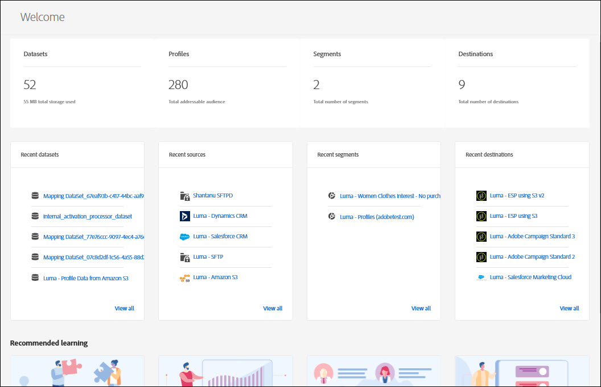

# Présentation des mesures de la plateforme de données client en temps réel

La page d’accueil de la plateforme de données client (CDP) en temps réel d’Adobe inclut un tableau de bord de mesures et s’affiche lorsque vous vous connectez à la plateforme CDP en temps réel.

La page d’accueil n’est qu’un des emplacements où les cartes de mesures apparaissent. La plateforme CDP en temps réel fournit des cartes de mesure tout au long de votre expérience. Ces mesures indiquent les données, les profils et les audiences de segments du système.

Si le système ne contient aucune donnée lorsque vous vous connectez à la plateforme CDP en temps réel, le tableau de bord de la page d’accueil n’apparaît pas. Dans ce cas, la page d’accueil propose des ressources pédagogiques pour une première expérience client. Au fur et à mesure de la collecte des données (c’est-à-dire au fur et à mesure de la création <!--sources-->des jeux de données, profils, segments et destinations ainsi que de la transmission des données au système), le tableau de bord se met automatiquement à jour pour afficher les informations sur ces données<!-- in metric cards-->.

## Affichage du tableau de bord de la page d’accueil

<!--The dashboard shows information in several areas. Each category of information displays for the time range shown beneath the data.-->

Le tableau de bord se divise en plusieurs parties<!-- two areas.--> :

* **Le tableau de classement** occupe toute la partie supérieure du tableau de bord. Le tableau de classement indique le nombre de jeux de données, de profils, de segments et de destinations du système.

   

<!-- * **Metric cards** display beneath the leaderboard. Metric cards show additional information, such as percentages or trends. Metric cards appear as data is collected.
    
Some information is shown in different ways on both the leaderboard and metric cards. -->
* La section **Éléments récents** répertorie les cinq jeux de données, sources, segments et destinations ajoutés le plus récemment au système.

   

D’autres mesures, par exemple pour les profils et les segments, sont disponibles dans d’autres parties de la plateforme de données client en temps réel.

### Jeux de données

The **[!UICONTROL Datasets]** counter shows the number of datasets in the system and the amount of data in Platform. Ce compteur est mis à jour lors de la création d’un jeu de données.

Pour plus d&#39;informations sur les jeux de données, consultez la présentation [des](../catalog/datasets/overview.md)jeux de données.

### Profils

The **[!UICONTROL Profiles]** count shows the total number of people with profiles in the Real-time Customer Profile. Il n’inclut pas les fragments de profil. Il s’agit de votre audience adressable totale.

Ce compte utilise la [stratégie de fusion](profile/merge-policies.md) par défaut telle que définie dans la configuration de la stratégie de fusion du profil unifié.

Le nombre de profils est mis à jour une fois toutes les 24 heures.

Pour plus d’informations sur les profils, consultez [Une vue unifiée de votre client dans la plateforme CDP en temps réel](profile/profile-overview.md).

### Segments

La section **[!UICONTROL Segments]** indique le nombre total de segments créés pour l’organisation. Ce nombre est mis à jour lors de la création de segments.

Pour plus d’informations sur les segments, consultez [Présentation du service de segmentation](segmentation/segmentation-overview.md).

### Destinations

La section **[!UICONTROL Destinations]** indique le nombre total de destinations créées pour l’organisation. Ce nombre est mis à jour lors de la création de destinations.

Pour plus d’informations sur les destinations, consultez [Présentation des destinations](destinations/destinations-overview.md).

<!-- ### Successful profile records

In the leaderboard **[!UICONTROL Successful profile records]** shows the total number of records that have been successfully processed into the profile.

There is also a metric card that shows the percentage of successful records. Click **[!UICONTROL View datasets]** to see more details about the profile records. Hover over the colored area of the graph to see additional details:

The number of successful profile records is updated hourly. 

For more information about profiles, see [A unified view of your customer in Real-time CDP](profile/profile-overview.md).

### Total profile records

The **[!UICONTROL Total profile records]** metric card shows the total number of data records enabled to feed into the profiles, and the percentage that are successful, updated once per day. This does not include all data in the data lake, because some data might not be enabled to feed into the profiles.

 Hover over the colored area of the graph to see additional details about the successful profiles:

Click **[!UICONTROL View profiles]** to see more details about the profile records.

For more information about profiles, see [A unified view of your customer in Real-time CDP](profile/profile-overview.md).

For more information about viewing a specific profile, see [Profile viewer](profile/profile-viewer.md).

### Failed profile records

In the leaderboard, **[!UICONTROL Failed profile records]** counts the number of records that failed to process into the profile.

The **[!UICONTROL Failed profile records]** metric card shows this count, and includes a graphical representation that helps you see how failures have trended during the time shown below the graphic. This chart is updated hourly. Click **[!UICONTROL View datasets]** to see more details about the profile records.

The number of failed profile records is updated hourly. -->

### Jeux de données récents

The **[!UICONTROL Recent datasets]** card shows the five most recent datasets created within the organization. Cette liste est mise à jour lors de la création d’un jeu de données.

Click a dataset to view the details for that item, or **[!UICONTROL View all]** to see the list of datasets. Vous pouvez ensuite cliquer sur une source spécifique pour afficher plus de détails.

Pour plus d&#39;informations sur les jeux de données, consultez la présentation [des](../catalog/datasets/overview.md)jeux de données.

### Sources récentes

The **[!UICONTROL Recent sources]** metric card shows the five most recent sources created within the organization. Cette liste est mise à jour lors de la création d’une source.

Click a source to view the details for that item, or **[!UICONTROL View all]** to see the list of sources. Vous pouvez ensuite cliquer sur une source spécifique pour afficher plus de détails.

Pour plus d’informations sur les sources, consultez [Présentation des sources](sources/sources-overview.md).

### Segments récents

The **[!UICONTROL Recent segments]** metric card shows the five most recent segments created within the organization. Cette liste est mise à jour lors de la création d’un segment.

Click a segment to view the details for that item, or **[!UICONTROL View all]** to see information about more segments.

Pour plus d’informations sur les segments, consultez [Présentation du service de segmentation](segmentation/segmentation-overview.md).

### Destinations récentes

The **[!UICONTROL Recent destinations]** metric card shows the five most recent destinations created within the organization. Cette liste est mise à jour lors de la création d’une destination.

Click a destination to view the details for that item, or **[!UICONTROL View all]** to see information about more destinations.

Pour plus d’informations sur les destinations, consultez [Présentation des destinations](destinations/destinations-overview.md).
