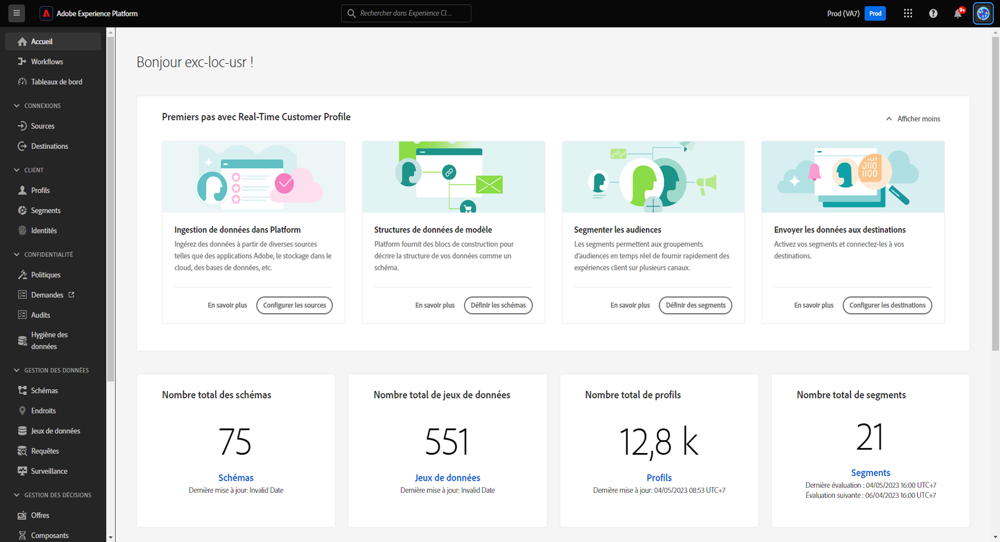
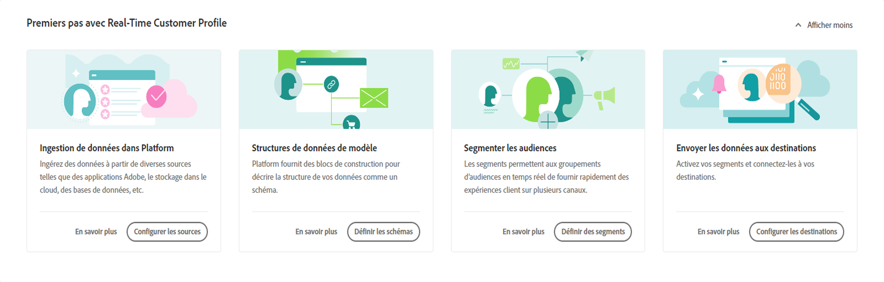
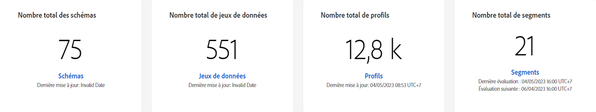
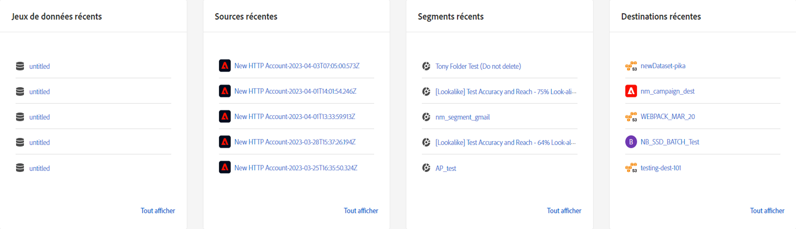
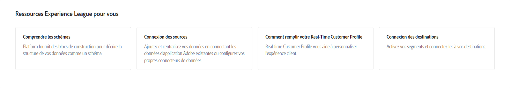

# Page d’accueil [!DNL Real-Time Customer Data Platform]

La page d’accueil d’Adobe Real-Time Customer Data Platform (Real-Time CDP) est la première page qui s’affiche après la connexion à Real-Time CDP.

La page d’accueil de Real-Time CDP comprend un widget de prise en main qui vous permet d’accéder rapidement à plusieurs fonctionnalités différentes, ainsi qu’une section de mesures qui affiche des informations à jour sur les données de votre organisation.

Ce document présente la page d’accueil de Real-Time CDP et le tableau de bord des mesures.

## Widget de prise en main

Le widget [!UICONTROL Getting started with Real-Time Customer Profile] est divisé en quatre sections :

* **Ingérer des données dans Experience Platform** : ce widget vous dirige vers le catalogue des sources. Utilisez le catalogue de sources pour sélectionner une source et ingérer vos données dans Experience Platform. Sélectionnez **[Configurer les sources]** pour accéder au catalogue de sources. Pour plus d’informations, consultez la [vue d’ensemble des sources](../sources/home.md).
* **Structures de données de modèle** : ce widget vous dirige vers la présentation des schémas. Utilisez la présentation des schémas pour rechercher des schémas existants ou créer un plan directeur qui décrit la structure de vos données. Sélectionnez **[!UICONTROL Create schema]** pour accéder à l’interface de création de schéma. Pour plus d’informations, consultez la [présentation des schémas](../xdm/home.md).
* **Créer des audiences** : ce widget vous dirige vers le créateur de segments dans l’interface utilisateur. Utilisez le Créateur de segments pour interagir avec les éléments de données Profil et définir les critères de votre définition de segment. Sélectionnez **[!UICONTROL Create audience]** pour accéder au créateur de segments. Pour plus d’informations, reportez-vous à la [ présentation de Segmentation Service ](../segmentation/home.md).
* **Envoyer les données aux destinations** : ce widget vous dirige vers le catalogue des destinations. Utilisez le catalogue des destinations pour sélectionner une destination à laquelle vous pouvez ensuite vous connecter et envoyer des audiences. Sélectionnez **[!UICONTROL Set up destinations]** pour accéder au catalogue des destinations. Pour plus d’informations, reportez-vous à la [vue d’ensemble des destinations](../destinations/home.md).

## Tableau de bord des mesures {#metrics-dashboard}

>[!CONTEXTUALHELP]
>id="platform_home_metrics_totalProfiles"
>title="Nombre total de profils"
>abstract="Nombre total de profils de votre organisation dans Experience Platform. Ce nombre est basé sur la politique de fusion de votre organisation et n’inclut pas les fragments de profil. Le nombre de profils est mis à jour une fois toutes les 24 heures."
>additional-url="https://experienceleague.adobe.com/docs/experience-platform/profile/ui/user-guide.html?lang=fr#profile-count" text="En savoir plus dans la documentation."

Le tableau de bord des mesures affiche des informations à jour sur vos données Experience Platform. Le tableau de bord se divise en deux sections :

### Tableau des scores

Le tableau des scores indique le nombre total actuel de schémas, de jeux de données, de profils et d’audiences dans votre organisation, ainsi que leur date de mise à jour la plus récente.

* **Total des schémas** : le compteur **Total des schémas** affiche le nombre de schémas dans le système. Ce compteur est mis à jour lors de la création d’un schéma. Pour plus d’informations, consultez la [présentation des schémas](../xdm/home.md).
* **Total des jeux de données** : le compteur **Total des jeux de données** affiche le nombre de jeux de données dans le système et la quantité de données dans Experience Platform. Ce compteur est mis à jour lorsqu’un jeu de données est créé. Pour plus d’informations sur les jeux de données, consultez la [présentation des jeux de données](../catalog/datasets/overview.md).
* **Nombre total de profils** : le nombre **Profils** indique le nombre total de profils de votre organisation dans Experience Platform. Il n’inclut pas les fragments de profil. Il s’agit de votre audience adressable totale. Ce nombre utilise la [politique de fusion](profile/merge-policies.md) par défaut définie dans la configuration de la politique de fusion dans le profil client en temps réel. Le nombre de profils est mis à jour une fois toutes les 24 heures. Sélectionnez **[!UICONTROL Profiles]** pour accéder à la page Aperçu des profils et afficher toutes les mesures de votre profil. Pour plus d’informations sur les profils, consultez la [présentation du profil client en temps réel](../profile/home.md).
* **Nombre total d’audiences** : le compteur **Nombre total d’audiences** affiche le nombre total d’audiences créées pour votre organisation. Ce nombre est mis à jour lors de la création de nouvelles audiences. Pour plus d’informations sur les audiences, consultez la [ présentation de Segmentation Service ](../segmentation/home.md).

### Éléments récents

Éléments récents répertorie les modifications les plus récentes apportées à votre organisation. Dans l’exemple ci-dessous, les modifications les plus récentes concernent les jeux de données, les sources, les audiences et les destinations.

* **Jeux de données récents** : la carte **[!UICONTROL Recent datasets]** affiche les cinq jeux de données les plus récents créés au sein de l’organisation. Cette liste est mise à jour lorsqu’un nouveau jeu de données est créé. Sélectionnez un jeu de données pour afficher les détails de cet élément ou sélectionnez **[!UICONTROL View all]** pour obtenir une liste de jeux de données. De là, vous pouvez sélectionner une source spécifique pour obtenir plus de détails. Pour plus d’informations sur les jeux de données, consultez la [présentation des jeux de données](../catalog/datasets/overview.md).
* **Sources récentes** : la carte des mesures **[!UICONTROL Recent sources]** affiche les cinq sources les plus récentes créées au sein de l’organisation. Cette liste est mise à jour lorsqu’une nouvelle source est créée. Sélectionnez une source pour afficher les détails de cet élément ou sélectionnez **[!UICONTROL View all]** pour obtenir une liste de sources. De là, vous pouvez sélectionner une source spécifique pour obtenir plus de détails. Pour plus d’informations sur les sources, consultez [Présentation des sources](../sources/home.md).
* **Audiences récentes** : la carte de mesure **[!UICONTROL Recent audiences]** affiche les cinq audiences les plus récentes créées au sein de l’organisation. Cette liste est mise à jour lorsqu’une nouvelle audience est créée. Sélectionnez une audience pour afficher les détails de cet élément, ou sélectionnez **[!UICONTROL View all]** pour obtenir une liste d’audiences. Pour plus d’informations sur les audiences, voir [Présentation de Segmentation Service](../segmentation/home.md).
* **Destinations récentes** : la carte des mesures **[!UICONTROL Recent destinations]** affiche les cinq destinations les plus récentes créées au sein de l’organisation. Cette liste est mise à jour lorsqu’une nouvelle destination est créée. Sélectionnez une destination pour afficher les détails de cet élément ou sélectionnez **[!UICONTROL View all]** pour obtenir une liste de destinations. Pour plus d’informations, reportez-vous à la [vue d’ensemble des destinations](../destinations/home.md).

## Ressources

Enfin, le widget Ressources vous fournit des ressources de documentation supplémentaires auxquelles vous pouvez vous référer. Ces cas comprennent notamment :

* [Compréhension des schémas](../xdm/schema/composition.md)
* [Connexion des sources](../sources/home.md)
* [Comment remplir votre profil client en temps réel](../profile/home.md)
* [Connexion des destinations](../destinations/home.md)
* [Gérer l’accès](../access-control/abac/overview.md)

<!-- ### Successful profile records

In the leaderboard **[!UICONTROL Successful profile records]** shows the total number of records that have been successfully processed into the profile.

There is also a metric card that shows the percentage of successful records. Select **[!UICONTROL View datasets]** to see more details about the profile records. Hover over the colored area of the graph to see additional details:

The number of successful profile records is updated hourly. 

For more information about profiles, see [A unified view of your customer in Real-Time CDP](profile/profile-overview.md).

### Total profile records

The **[!UICONTROL Total profile records]** metric card shows the total number of data records enabled to feed into the profiles, and the percentage that are successful, updated once per day. This does not include all data in the data lake, because some data might not be enabled to feed into the profiles.

 Hover over the colored area of the graph to see additional details about the successful profiles:

Select **[!UICONTROL View profiles]** to see more details about the profile records.

For more information about profiles, see [A unified view of your customer in Real-Time CDP](profile/profile-overview.md).

For more information about viewing a specific profile, see [Profile viewer](profile/profile-viewer.md).

### Failed profile records

In the leaderboard, **[!UICONTROL Failed profile records]** counts the number of records that failed to process into the profile.

The **[!UICONTROL Failed profile records]** metric card shows this count, and includes a graphical representation that helps you see how failures have trended during the time shown below the graphic. This chart is updated hourly. Select **[!UICONTROL View datasets]** to see more details about the profile records.

The number of failed profile records is updated hourly. -->
