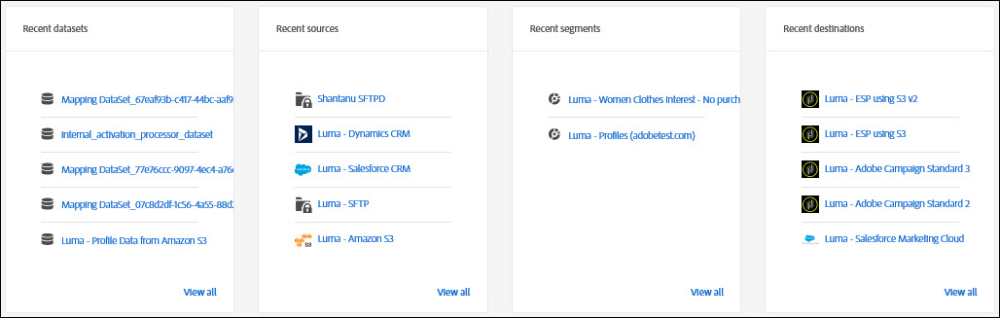

# Présentation des mesures de la plateforme de données clientes en temps réel

La page d’accueil Adobe Real-time Customer Data Platform (CDP en temps réel), qui comprend un tableau de bord de mesures, s’affiche lorsque vous vous connectez au CDP en temps réel.

La page d’accueil n’est qu’un des emplacements où les cartes de mesure apparaissent. Le CDP en temps réel fournit des cartes de mesure tout au long de votre expérience. Ces mesures vous informent sur les données, le profil et les audiences de segments du système.

Si le système ne contient aucune donnée lorsque vous vous connectez au CDP en temps réel, le tableau de bord de la page d’accueil n’apparaît pas. Dans ce cas, la page d’accueil fournit du matériel pédagogique pour une première expérience utilisateur. Au fur et à mesure de la collecte des données (c’est-à-dire au fur et à mesure de la création des <!--sources-->jeux de données, des profils, des segments et des destinations et du flux des données dans le système), le tableau de bord se met automatiquement à jour pour afficher les informations sur ces données<!-- in metric cards-->.

## Affichage du tableau de bord de page d’accueil

<!--The dashboard shows information in several areas. Each category of information displays for the time range shown beneath the data.-->

Le tableau de bord est divisé en<!-- two areas.-->:

* **Le tableau de bord** se trouve en haut du tableau de bord. Le tableau de bord indique le nombre de jeux de données, de profils, de segments et de destinations dans le système.

   

<!-- * **Metric cards** display beneath the leaderboard. Metric cards show additional information, such as percentages or trends. Metric cards appear as data is collected.
    
Some information is shown in different ways on both the leaderboard and metric cards. -->
* **Les éléments** récents répertorient les cinq jeux de données, sources, segments et destinations les plus récents ajoutés au système.

   

D’autres mesures, par exemple pour les profils et les segments, sont disponibles dans d’autres parties de la plateforme de données clientes en temps réel.

### Jeux de données

Le compteur **[!UICONTROL Datasets]** indique le nombre de jeux de données dans le système et la quantité de données dans la plateforme. Ce compteur est mis à jour lorsqu’un jeu de données est créé.

Pour plus d’informations sur les jeux de données, voir [Assimilation de données dans Adobe Experience Platform](https://www.adobe.io/apis/experienceplatform/home/tutorials/alltutorials.html#!api-specification/markdown/narrative/tutorials/data_ingestion_tutorial/data_ingestion_tutorial.md).

### Profils

Le nombre de **[!UICONTROL profils]** indique le nombre total de personnes avec des profils dans le profil du client en temps réel. Il n’inclut pas les fragments de profil. Il s’agit de votre audience adressable totale.

Ce nombre utilise la stratégie [de](profile/merge-policies.md) fusion par défaut telle qu’elle est définie dans la configuration de la stratégie de fusion dans le profil unifié.

Le nombre de profils est mis à jour une fois toutes les 24 heures.

Pour plus d’informations sur les profils, voir [Une vue unifiée de votre client dans le CDP](profile/profile-overview.md)en temps réel.

### Segments

**[!UICONTROL Les segments]** indiquent le nombre total de segments créés pour l’organisation. Ce nombre est mis à jour lorsque de nouveaux segments sont créés.

Pour plus d’informations sur les segments, voir Présentation [du service](https://www.adobe.io/apis/experienceplatform/home/profile-identity-segmentation/profile-identity-segmentation-services.html#!end-user/markdown/segmentation_overview/segmentation.md)de segmentation.

### Destinations

**[!UICONTROL Destinations]** indique le nombre total de destinations créées pour l’organisation. Ce nombre est mis à jour lorsque de nouvelles destinations sont créées.

Pour plus d’informations sur les destinations, voir Présentation des [destinations](destinations/destinations-overview.md).

<!-- ### Successful profile records

In the leaderboard **[!UICONTROL Successful profile records]** shows the total number of records that have been successfully processed into the profile.

There is also a metric card that shows the percentage of successful records. Click **[!UICONTROL View datasets]** to see more details about the profile records. Hover over the colored area of the graph to see additional details:

The number of successful profile records is updated hourly. 

For more information about profiles, see [A unified view of your customer in Real-time CDP](profile/profile-overview.md).

### Total profile records

The **[!UICONTROL Total profile records]** metric card shows the total number of data records enabled to feed into the profiles, and the percentage that are successful, updated once per day. This does not include all data in the data lake, because some data might not be enabled to feed into the profiles.

 Hover over the colored area of the graph to see additional details about the successful profiles:

Click **[!UICONTROL View profiles]** to see more details about the profile records.

For more information about profiles, see [A unified view of your customer in Real-time CDP](profile/profile-overview.md).

For more information about viewing a specific profile, see [Profile viewer](profile/profile-viewer.md).

### Failed profile records

In the leaderboard, **[!UICONTROL Failed profile records]** counts the number of records that failed to process into the profile.

The **[!UICONTROL Failed profile records]** metric card shows this count, and includes a graphical representation that helps you see how failures have trended during the time shown below the graphic. This chart is updated hourly. Click **[!UICONTROL View datasets]** to see more details about the profile records.

The number of failed profile records is updated hourly. -->

### Jeux de données récents

La carte **[!UICONTROL Récents jeux]** de données présente les cinq jeux de données les plus récents créés au sein de l’entreprise. Cette liste est mise à jour lorsqu’un nouveau jeu de données est créé.

Cliquez sur un jeu de données pour afficher les détails de cet élément ou **[!UICONTROL Afficher tout]** pour afficher la liste des jeux de données. A partir de là, vous pouvez cliquer sur une source spécifique pour plus de détails.

Pour plus d’informations sur les jeux de données, voir [Assimilation de données dans Adobe Experience Platform](https://www.adobe.io/apis/experienceplatform/home/tutorials/alltutorials.html#!api-specification/markdown/narrative/tutorials/data_ingestion_tutorial/data_ingestion_tutorial.md).

### Sources récentes

La carte de mesure Sources **** récentes présente les cinq sources les plus récentes créées au sein de l’organisation. Cette liste est mise à jour lorsqu’une nouvelle source est créée.

Cliquez sur une source pour afficher les détails de cet élément ou **[!UICONTROL Afficher tout]** pour afficher la liste des sources. A partir de là, vous pouvez cliquer sur une source spécifique pour plus de détails.

Pour plus d’informations sur les sources, voir Présentation des [sources](sources/sources-overview.md).

### Segments récents

La carte de mesure des segments **** récents présente les cinq segments les plus récents créés au sein de l’entreprise. Cette liste est mise à jour lorsqu’un nouveau segment est créé.

Cliquez sur un segment pour afficher les détails de cet élément ou **[!UICONTROL Afficher tout]** pour afficher des informations sur d’autres segments.

Pour plus d’informations sur les segments, voir Présentation [du service](https://www.adobe.io/apis/experienceplatform/home/profile-identity-segmentation/profile-identity-segmentation-services.html#!end-user/markdown/segmentation_overview/segmentation.md)de segmentation.

### Destinations récentes

La carte de mesure Destinations **** récentes présente les cinq destinations les plus récentes créées au sein de l’entreprise. Cette liste est mise à jour lorsqu’une nouvelle destination est créée.

Cliquez sur une destination pour afficher les détails de cet élément ou **[!UICONTROL Afficher tout]** pour afficher des informations sur d’autres destinations.

Pour plus d’informations sur les destinations, voir Présentation des [destinations](destinations/destinations-overview.md).
