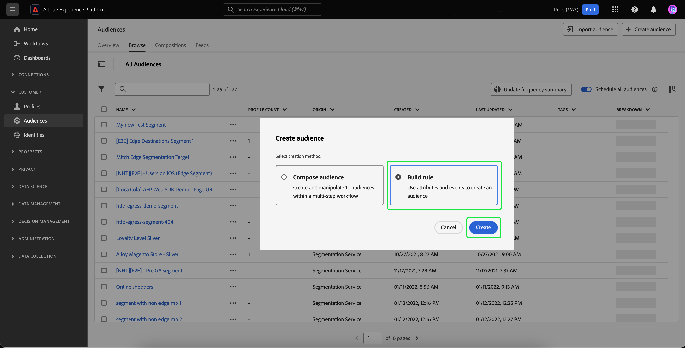

# Reciblage hors site des visiteurs non authentifiés

>[!AVAILABILITY]
>
>Cette fonctionnalité est disponible pour les clients qui disposent d’une licence Real-Time CDP (App Service), Adobe Experience Platform Activation, Real-Time CDP, Real-Time CDP Prime, Real-Time CDP Ultimate. Consultez la [description des produits](https://helpx.adobe.com/fr/legal/product-descriptions.html) pour en savoir plus sur ces packages et contactez votre représentant ou représentante Adobe pour obtenir plus d’informations.

Découvrez comment créer une audience de visiteurs non authentifiés et la recibler à l’aide d’identifiants durables fournis par les partenaires.

## Pourquoi tenir compte de ce cas pratique ? {#why-use-case}

Avec l’élimination progressive des cookies tiers, les spécialistes du marketing numérique doivent réinventer leurs stratégies de réengagement avec les visiteurs anonymes. Les marques qui choisissent de s’intégrer aux fournisseurs d’identité pour la reconnaissance des visiteurs en temps réel peuvent également tirer parti des identifiants de partenaire fournis pour le reciblage de médias payants hors site.

Malgré un volume élevé de trafic, de nombreuses marques enregistrent une baisse significative à l’étape de conversion. Les visiteurs interagissent avec le contenu et les démonstrations de produits, mais partent sans s’inscrire ou effectuer un achat.

Non seulement vous pouvez créer des audiences basées sur l’engagement sur site pour personnaliser les messages marketing, mais vous pouvez également utiliser la prise en charge par l’Adobe des identifiants de partenaire pour réengager les visiteurs sur les destinations de médias payants.

## Prérequis et planification {#prerequisites-and-planning}

Lors de la planification du reciblage des visiteurs non authentifiés, tenez compte des conditions préalables suivantes lors de votre processus de planification :

- Ai-je configuré les identifiants des partenaires avec les espaces de noms d’identité appropriés ?

En outre, pour mettre en oeuvre le cas d’utilisation, vous utiliserez les fonctionnalités et éléments d’interface utilisateur de Real-Time CDP suivants. Assurez-vous de disposer des autorisations de contrôle d’accès en fonction des attributs nécessaires pour toutes ces zones ou demandez à votre administrateur système de vous accorder les autorisations nécessaires.

- [Audiences](../../segmentation/home.md)
- [Attributs calculés](../../profile/computed-attributes/overview.md)
- [Destinations](../../destinations/home.md)
- [SDK Web](../../edge/home.md)

## Obtention de données de partenaire dans Real-Time CDP {#get-data-in}

Pour créer une audience de visiteurs non authentifiés, vous devez d’abord obtenir les données de vos partenaires dans Real-Time CDP.

Pour savoir comment importer au mieux des données dans Real-Time CDP à l’aide du SDK Web, veuillez lire le [sections sur la gestion des données et la collecte des données d’événement](./onsite-personalization.md#data-management) du cas d’utilisation de la personnalisation sur site.

## Transfert des identifiants fournis par les partenaires {#bring-partner-ids-forward}

Après avoir importé les identifiants fournis par le partenaire dans un jeu de données d’événement, vous devrez intégrer ces données aux enregistrements de profil. Vous pouvez le faire en utilisant des attributs calculés.

Les attributs calculés vous permettent de convertir rapidement les données comportementales de profil en valeurs agrégées au niveau du profil. Par conséquent, vous pouvez utiliser ces expressions, telles que &quot;total d’achat sur toute la durée de vie&quot;, dans le profil, ce qui vous permet d’utiliser facilement l’attribut calculé dans vos audiences. Vous trouverez plus d’informations sur les attributs calculés dans la section [présentation des attributs calculés](../../profile/computed-attributes/overview.md).

Pour accéder aux attributs calculés, sélectionnez **[!UICONTROL Profils]** suivie de **[!UICONTROL Attributs calculés]** et **[!UICONTROL Création d’un attribut calculé]**.

![La variable [!UICONTROL Création d’attributs calculés] est mis en surbrillance en plus du bouton [!UICONTROL Attributs calculés] dans la [!UICONTROL Profils] workspace.](../assets/offsite-retargeting/create-ca.png)

La variable **[!UICONTROL Création d’un attribut calculé]** s’affiche. Sur cette page, vous pouvez utiliser les composants pour créer votre attribut calculé.

>[!NOTE]
>
>Pour plus d’informations sur la création d’attributs calculés, veuillez lire le [guide de l’interface utilisateur des attributs calculés](../../profile/computed-attributes/ui.md).

Pour ce cas d’utilisation, vous pouvez créer un attribut calculé qui, si l’ID de partenaire existe, obtient la valeur la plus récente de l’ID de partenaire au cours des dernières 24 heures.

À l’aide de la barre de recherche, vous pouvez rechercher et ajouter l’événement &quot;Identifiant de partenaire&quot; au canevas d’attribut calculé.

![La variable [!UICONTROL Événements] et la barre de recherche sont mises en surbrillance.](../assets/offsite-retargeting/ca-add-partner-id.png)

Après avoir ajouté l’événement &quot;Identifiant de partenaire&quot; à la définition, définissez la condition de filtrage d’événement sur **[!UICONTROL Existe]**, définissez la condition de filtrage des événements sur . **[!UICONTROL Le plus récent]** valeur de l’identifiant de partenaire ajouté, avec une période de recherche arrière de 24 heures.

Attribuez à l’attribut calculé un nom et une description appropriés (par exemple, &quot;Identifiant de partenaire&quot;), puis sélectionnez **[!UICONTROL Publier]** pour terminer le processus de création d’attributs calculé.

## Création d’une audience à l’aide de l’attribut calculé {#create-audience}

Maintenant que vous avez créé l’attribut calculé, vous pouvez utiliser cet attribut calculé pour créer une audience. Dans cet exemple, vous allez créer une audience composée des visiteurs qui ont consulté votre site web plus de 5 fois ce mois-ci, mais qui ne se sont pas encore inscrits.

Pour créer une audience, sélectionnez **[!UICONTROL Audiences]**, suivie de **[!UICONTROL Créer une audience]**.

![La variable [!UICONTROL Créer une audience] est mise en surbrillance.](../assets/offsite-retargeting/create-audience.png)

Une boîte de dialogue s’affiche, vous demandant de choisir entre [!UICONTROL Composer l’audience] et [!UICONTROL Créer une règle]. Sélectionner **[!UICONTROL Créer une règle]** suivie de **[!UICONTROL Créer]**.

La page Créateur de segments s’affiche. Sur cette page, vous pouvez utiliser les composants pour créer votre audience.

>[!NOTE]
>
>Pour plus d’informations sur l’utilisation du créateur de segments, veuillez lire le [Guide de l’interface utilisateur du créateur de segments](../../segmentation/ui/segment-builder.md).

Pour atteindre l’objectif de recherche de ces visiteurs, vous devez d’abord ajouter une **[!UICONTROL Page vue]** à votre audience. Sélectionnez la variable **[!UICONTROL Événements]** sous **[!UICONTROL Champs]**, puis effectuez un glisser-déposer de l’élément **[!UICONTROL Page vue]** et l’ajouter au canevas de la section des événements.

![La variable [!UICONTROL Événements] dans le [!UICONTROL Champs] est mise en surbrillance lors de l’affichage de la fonction [!UICONTROL Page vue].](../assets/offsite-retargeting/add-page-view.png)

Sélectionnez le nouveau **[!UICONTROL Page vue]** . Modifier la période de recherche en amont de **[!UICONTROL N’importe quelle heure]** to **[!UICONTROL Ce mois-ci]** et modifiez la règle d’événement pour inclure **Au moins 5**.

![Détails de l’ajout [!UICONTROL Page vue] s’affichent.](../assets/offsite-retargeting/edit-event.png)

Après avoir ajouté votre événement, vous devez ajouter un attribut . Puisque vous travaillez avec des visiteurs non authentifiés, vous pouvez ajouter l’attribut calculé que vous venez de créer. Cet attribut calculé nouvellement créé vous permet de lier des identifiants de partenaire à une audience.

Pour ajouter l’attribut calculé, sous **[!UICONTROL Attributs]**, sélectionnez **[!UICONTROL XDM Individual Profile]**, suivie de **[!UICONTROL _atag]**, **[!UICONTROL SystemComputedAttributes]**, et **[!UICONTROL PartnerID]**. Maintenant, ajoutez le **[!UICONTROL Valeur]** de l’attribut calculé à la section attributs du canevas.

En outre, recherchez **[!UICONTROL Email personnel]** et ajoutez le **[!UICONTROL Adresse]** attribute below **[!UICONTROL PartnerID]** à la section attributs du canevas.

![La variable [!UICONTROL PartnerID] attribut calculé et le [!UICONTROL Adresse électronique personnelle] sont mises en surbrillance sur le canevas du créateur de segments.](../assets/offsite-retargeting/added-attributes.png)

Maintenant que vous avez ajouté vos attributs, vous devez définir leurs critères d’évaluation. Pour **[!UICONTROL PartnerID]**, définissez le critère sur **[!UICONTROL existe]** et pour **[!UICONTROL Adresse]**, définissez le critère sur **[!UICONTROL n’existe pas]**.

Vous avez maintenant créé avec succès une audience qui recherche les visiteurs de haute intensité qui ont un identifiant fourni par un partenaire, mais qui ne se sont pas encore inscrits pour votre site. Nommez votre audience &quot;Reciblage des utilisateurs non authentifiés&quot; et sélectionnez **[!UICONTROL Enregistrer]** pour terminer la création de votre audience.

## Activer votre audience {#activate-audience}

Une fois votre audience créée, vous pouvez désormais l’activer vers les destinations en aval. Sélectionner **[!UICONTROL Audiences]** dans le rail de navigation de gauche, recherchez l’audience que vous venez de créer, cliquez sur l’icône représentant des points de suspension, puis sélectionnez **[!UICONTROL Activer la destination]**.

>[!NOTE]
>
>Tous les types de destinations, y compris les destinations basées sur des fichiers, prennent en charge l’activation de l’audience avec les identifiants de partenaire.
>
>Pour plus d’informations sur l’activation d’audiences vers une destination, veuillez lire le [présentation de l’activation](../../destinations/ui/activation-overview.md).

La variable **[!UICONTROL Activer la destination]** s’affiche. Sur cette page, vous pouvez sélectionner la destination vers laquelle vous souhaitez activer votre destination. Après avoir sélectionné la destination de votre choix, sélectionnez **[!UICONTROL Suivant]**.

La variable **[!UICONTROL Planification]** s’affiche. Sur cette page, vous pouvez créer un planning qui détermine la fréquence d’activation de l’audience. Sélectionner **[!UICONTROL Créer un planning]** pour créer un planning pour l’activation de l’audience.

![La variable [!UICONTROL Créer un planning] est mise en surbrillance.](../assets/offsite-retargeting/select-create-schedule.png)

La variable [!UICONTROL Planification] s’affiche. Sur cette page, vous pouvez créer le planning de l’activation de votre audience. Après avoir configuré le planning, sélectionnez **[!UICONTROL Créer]** pour continuer.

Après avoir confirmé les détails de la planification, sélectionnez **[!UICONTROL Suivant]**.

La variable **[!UICONTROL Sélectionner des attributs]** s’affiche. Sur cette page, vous pouvez sélectionner les attributs à exporter avec l’audience activée. Vous souhaitez inclure au minimum l’ID de partenaire, car cela vous permet d’identifier les visiteurs que vous prévoyez de recibler. Sélectionner **[!UICONTROL Ajouter un nouveau mappage]** et recherchez l’attribut calculé. Après avoir ajouté les attributs nécessaires, sélectionnez **[!UICONTROL Suivant]**.

![Les deux [!UICONTROL Ajouter un nouveau mappage] et l’attribut calculé sont mis en surbrillance.](../assets/offsite-retargeting/add-new-mapping.png)

La variable **[!UICONTROL Réviser]** s’affiche. Sur cette page, vous pouvez consulter les détails de l’activation de votre audience. Si vous êtes satisfait des détails fournis, sélectionnez **[!UICONTROL Terminer]**.

![La variable [!UICONTROL Réviser] s’affiche, avec les détails de l’activation de l’audience.](../assets/offsite-retargeting/review-destination-activation.png)

Vous avez maintenant activé une audience d’utilisateurs non authentifiés vers une destination en aval pour un reciblage supplémentaire.

## Autres cas d’utilisation {#other-use-cases}

Vous pouvez explorer d’autres cas d’utilisation activés grâce à la prise en charge des données des partenaires dans Real-Time CDP :

- [Interagir et acquérir de nouveaux clients](./prospecting.md) en utilisant les données des partenaires.
- [Personnalisation des expériences sur site](./offsite-retargeting.md) grâce à la reconnaissance des visiteurs par les partenaires.
- [Complémenter les profils propriétaires](./supplement-first-party-profiles.md) avec les attributs fournis par le partenaire.
