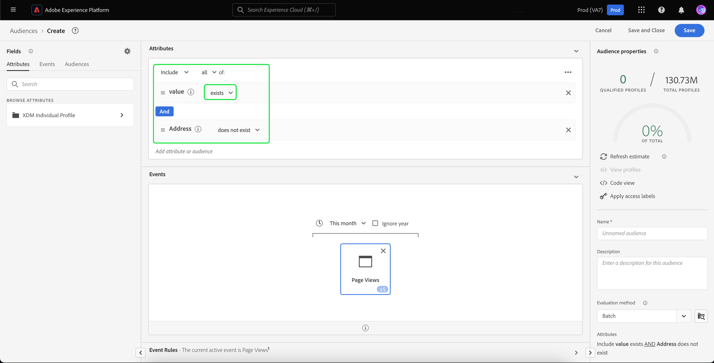

# Reciblage hors site des visiteurs non authentifiés

>[!AVAILABILITY]
>
>Cette fonctionnalité est disponible pour les clients qui disposent d’une licence Real-Time CDP (App Service), Adobe Experience Platform Activation, Real-Time CDP, Real-Time CDP Prime, Real-Time CDP Ultimate. Consultez la [description des produits](https://helpx.adobe.com/fr/legal/product-descriptions.html) pour en savoir plus sur ces packages et contactez votre représentant ou représentante Adobe pour obtenir plus d’informations.

Découvrez comment créer une audience de visiteurs non authentifiés et les recibler à l’aide d’identifiants durables fournis par les partenaires.

## Pourquoi envisager ce cas d’utilisation {#why-use-case}

Avec l’élimination progressive des cookies tiers, les spécialistes du marketing numérique doivent réimaginer leurs stratégies pour interagir avec les visiteurs anonymes. Les marques qui choisissent de s’intégrer aux fournisseurs d’identité pour la reconnaissance des visiteurs en temps réel peuvent également tirer parti des identifiants durables fournis par les partenaires pour le reciblage des médias achetés hors site.

Malgré un volume de trafic élevé, de nombreuses marques enregistrent une baisse significative au stade de la conversion. Les visiteurs participent à des démonstrations de contenu et de produit, mais repartent sans s’inscrire ni effectuer d’achat.

Non seulement vous pouvez créer des audiences en fonction de l’engagement sur site pour personnaliser les messages marketing, mais vous pouvez également utiliser la prise en charge d’Adobe pour les identifiants de partenaire afin de réengager les visiteurs sur les destinations de médias achetés.

## Prérequis et planification {#prerequisites-and-planning}

Lors de la planification du reciblage des visiteurs non authentifiés, tenez compte des conditions préalables suivantes au cours du processus de planification :

- Ai-je configuré les identifiants de partenaire avec les espaces de noms d’identité appropriés ?

En outre, afin d’implémenter le cas d’utilisation, vous utiliserez les fonctionnalités et éléments d’interface utilisateur de Real-Time CDP ci-dessous. Assurez-vous de disposer des autorisations de contrôle d’accès basé sur les attributs nécessaires pour toutes ces zones ou demandez à votre administrateur système de vous accorder les autorisations nécessaires.

- [Audiences](/help/segmentation/home.md)
- [Attributs calculés](/help/profile/computed-attributes/overview.md)
- [Destinations](/help/destinations/home.md)
- [Collecte de données](/help/collection/home.md)

## Transfert de données de partenaire dans Real-Time CDP {#get-data-in}

Pour créer une audience de visiteurs non authentifiés, vous devez d’abord placer les données de votre partenaire dans Real-Time CDP.

Pour découvrir comment importer au mieux des données dans Real-Time CDP à l’aide de Web SDK, consultez les sections [gestion des données et collecte de données d’événement](./onsite-personalization.md#data-management) du cas d’utilisation de la personnalisation sur site.

## Transfert des identifiants fournis par le partenaire {#bring-partner-ids-forward}

Après avoir importé les identifiants fournis par le partenaire dans un jeu de données d’événement, vous devez intégrer ces données dans les enregistrements de profil. Vous pouvez le faire en utilisant des attributs calculés.

Les attributs calculés vous permettent de convertir rapidement les données comportementales de profil en valeurs agrégées au niveau du profil. Par conséquent, vous pouvez utiliser ces expressions, telles que « total des achats sur la durée de vie » pour le profil, ce qui vous permet d’utiliser facilement l’attribut calculé au sein de vos audiences. Vous trouverez plus d’informations sur les attributs calculés dans la [présentation des attributs calculés](/help/profile/computed-attributes/overview.md).

Pour accéder aux attributs calculés, sélectionnez **[!UICONTROL Profiles]**, puis **[!UICONTROL Computed attributes]** et **[!UICONTROL Create computed attribute]**.

![Le bouton [!UICONTROL Create computed attributes] est mis en surbrillance en plus de l’onglet [!UICONTROL Computed attributes] dans l’espace de travail [!UICONTROL Profiles].](../assets/offsite-retargeting/create-ca.png)

La page **[!UICONTROL Create computed attribute]** s’affiche. Sur cette page, vous pouvez utiliser les composants pour créer votre attribut calculé.

>[!NOTE]
>
>Pour plus d’informations sur la création d’attributs calculés, consultez le [guide de l’interface utilisateur des attributs calculés](/help/profile/computed-attributes/ui.md).

Pour ce cas d’utilisation, vous pouvez créer un attribut calculé qui, si l’ID de partenaire existe, obtient la valeur la plus récente de l’ID de partenaire au cours des dernières 24 heures.

À l’aide de la barre de recherche, vous pouvez localiser et ajouter l’événement « Identifiant du partenaire » que [vous avez créé lors du cas d’utilisation de la personnalisation sur site](#get-data-in) à la zone de travail des attributs calculés.

![L’onglet [!UICONTROL Events] et la barre de recherche sont mis en surbrillance.](../assets/offsite-retargeting/ca-add-partner-id.png)

Après avoir ajouté l’événement « ID de partenaire » à la définition, définissez la condition de filtrage d’événement sur **[!UICONTROL Exists]**, définissez la condition de filtrage d’événement sur la valeur **[!UICONTROL Most Recent]** de l’ID de partenaire ajouté, et avec une période de recherche en amont de 24 heures.

Attribuez un nom approprié (par exemple, « ID de partenaire ») et une description à l’attribut calculé, puis sélectionnez **[!UICONTROL Publish]** pour terminer le processus de création de l’attribut calculé.

## Créer une audience à l’aide de l’attribut calculé {#create-audience}

Maintenant que vous avez créé l’attribut calculé, vous pouvez utiliser cet attribut calculé pour créer une audience. Dans cet exemple, vous allez créer une audience composée de visiteurs qui ont visité votre site web plus de 5 fois ce mois-ci, mais qui ne se sont pas encore inscrits.

Pour créer une audience, sélectionnez **[!UICONTROL Audiences]**, puis **[!UICONTROL Create audience]**.

![Le bouton [!UICONTROL Create audience] est mis en surbrillance.](../assets/offsite-retargeting/create-audience.png)

Une boîte de dialogue s’affiche, vous demandant de choisir entre [!UICONTROL Compose audience] et [!UICONTROL Build rule]. Sélectionnez **[!UICONTROL Build rule]** suivi de **[!UICONTROL Create]**.

![Le bouton [!UICONTROL Build rule] est mis en surbrillance.](../assets/offsite-retargeting/select-build-rule.png)

La page du Créateur de segments s’affiche. Sur cette page, vous pouvez utiliser les composants pour créer votre audience.

>[!NOTE]
>
>Pour plus d’informations sur l’utilisation du créateur de segments, consultez le [guide de l’interface utilisateur du créateur de segments](/help/segmentation/ui/segment-builder.md).

Pour atteindre l’objectif de trouver ces visiteurs, vous devez d’abord ajouter un événement **[!UICONTROL Page View]** à votre audience. Sélectionnez l’onglet **[!UICONTROL Events]** sous **[!UICONTROL Fields]**, puis effectuez un glisser-déposer de l’événement **[!UICONTROL Page View]** et ajoutez-le à la zone de travail de la section Événements.

![L’onglet [!UICONTROL Events] de la section [!UICONTROL Fields] est mis en surbrillance lors de l’affichage du [!UICONTROL Page View]événement.](../assets/offsite-retargeting/add-page-view.png)

Sélectionnez l’événement **[!UICONTROL Page View]** nouvellement ajouté. Remplacez la période de recherche en amont de **[!UICONTROL Any time]** par **[!UICONTROL This month]**, puis modifiez la règle d’événement pour inclure **Au moins 5**.

![Les détails de l’événement [!UICONTROL Page View] ajouté s’affichent.](../assets/offsite-retargeting/edit-event.png)

Après avoir ajouté votre événement, vous devez ajouter un attribut. Puisque vous travaillez avec des visiteurs non authentifiés, vous pouvez ajouter l’attribut calculé que vous venez de créer. Cet attribut calculé nouvellement créé vous permet de lier les identifiants de partenaire à une audience.

Pour ajouter l’attribut calculé, sous **[!UICONTROL Attributes]**, sélectionnez **[!UICONTROL XDM Individual Profile]**, suivi de **[l’identifiant du client de votre organisation](/help/xdm/api/getting-started.md#know-your-tenant-id).**, **[!UICONTROL SystemComputedAttributes]** et **[!UICONTROL PartnerID]**. Ajoutez maintenant la **[!UICONTROL Value]** de l’attribut calculé à la section des attributs de la zone de travail.

En outre, recherchez **[!UICONTROL Personal Email]** et ajoutez l’attribut **[!UICONTROL Address]** ci-dessous **[!UICONTROL PartnerID]** la section Attributs de la zone de travail.

![L’attribut calculé [!UICONTROL PartnerID] et l’attribut [!UICONTROL Personal Email Address] sont mis en surbrillance dans la zone de travail du créateur de segments.](../assets/offsite-retargeting/added-attributes.png)

Maintenant que vous avez ajouté vos attributs, vous devez définir leurs critères d’évaluation. Par **[!UICONTROL PartnerID]**, définissez le critère sur **[!UICONTROL exists]** et, par **[!UICONTROL Address]**, définissez le critère sur **[!UICONTROL does not exist]**.

Vous avez maintenant créé une audience qui recherche les visiteurs à forte intensité qui disposent d’un identifiant fourni par un partenaire, mais qui ne se sont pas encore inscrits à votre site. Nommez votre audience « Reciblage des utilisateurs non authentifiés » et sélectionnez **[!UICONTROL Save]** pour terminer la création de votre audience.

## Activer votre audience {#activate-audience}

Après avoir créé votre audience, vous pouvez maintenant l’activer vers des destinations en aval. Sélectionnez **[!UICONTROL Audiences]** sur le rail de navigation de gauche, recherchez l’audience que vous venez de créer, sélectionnez l’icône représentant des points de suspension, puis sélectionnez **[!UICONTROL Activate to destination]**.

![Le bouton [!UICONTROL Activate to destination] est mis en surbrillance.](../assets/offsite-retargeting/activate-to-destination.png)

>[!NOTE]
>
>Tous les types de destination, y compris les destinations basées sur des fichiers, prennent en charge l’activation des audiences avec des identifiants de partenaire.
>
>Pour plus d’informations sur l’activation des audiences vers une destination, veuillez lire la [présentation de l’activation](/help/destinations/ui/activation-overview.md).

La page **[!UICONTROL Activate destination]** s’affiche. Sur cette page, vous pouvez sélectionner la destination vers laquelle activer la destination. Après avoir sélectionné la destination de votre choix, sélectionnez **[!UICONTROL Next]**.

La page **[!UICONTROL Scheduling]** s’affiche. Sur cette page, vous pouvez créer une planification qui détermine la fréquence d’activation de l’audience. Sélectionnez **[!UICONTROL Create schedule]** pour créer un planning d’activation de l’audience.

![Le bouton [!UICONTROL Create schedule] est mis en surbrillance.](../assets/offsite-retargeting/select-create-schedule.png)

La fenêtre contextuelle [!UICONTROL Scheduling] s’affiche. Sur cette page, vous pouvez créer le planning d’activation de votre audience. Après avoir configuré le planning, sélectionnez **[!UICONTROL Create]** pour continuer.

Après avoir confirmé les détails de la planification, sélectionnez **[!UICONTROL Next]**.

La page **[!UICONTROL Select attributes]** s’affiche. Sur cette page, vous pouvez sélectionner les attributs à exporter avec l’audience activée. Au minimum, vous souhaiterez inclure l’ID de partenaire, car cela vous permettra d’identifier les visiteurs que vous prévoyez de recibler. Sélectionnez **[!UICONTROL Add new mapping]** et recherchez l’attribut calculé. Après avoir ajouté les attributs nécessaires, sélectionnez **[!UICONTROL Next]**.

![Le bouton [!UICONTROL Add new mapping] et l’attribut calculé sont mis en surbrillance.](../assets/offsite-retargeting/add-new-mapping.png)

La page **[!UICONTROL Review]** s’affiche. Sur cette page, vous pouvez consulter les détails de l’activation de votre audience. Si les détails fournis vous conviennent, sélectionnez **[!UICONTROL Finish]**.

![La page [!UICONTROL Review] s’affiche, affichant les détails de l’activation de l’audience.](../assets/offsite-retargeting/review-destination-activation.png)

Vous avez maintenant activé une audience d’utilisateurs non authentifiés vers une destination en aval pour un reciblage plus poussé.

## Autres cas d’utilisation {#other-use-cases}

Vous pouvez explorer d’autres cas d’utilisation activés par le biais de la prise en charge des données des partenaires dans Real-Time CDP :

- [Interagissez et acquérez de nouveaux clients](./prospecting.md) en utilisant les données des partenaires.
- [Personnaliser les expériences sur site](./offsite-retargeting.md) avec reconnaissance des visiteurs assistée par des partenaires.
- [Complétez les profils propriétaires](./supplement-first-party-profiles.md) avec les attributs fournis par le partenaire.
