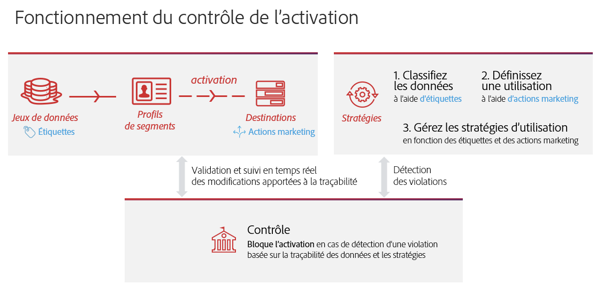
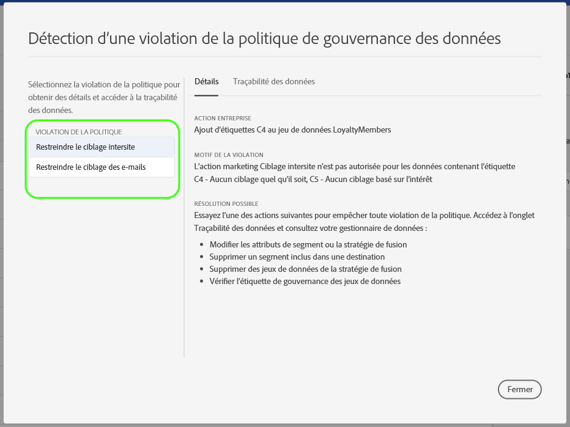
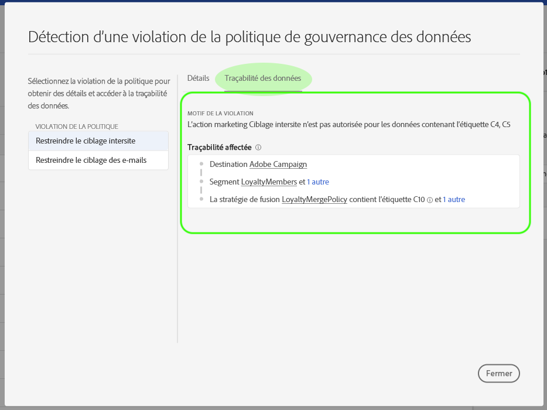

# Gouvernance des données sur la plateforme CDP en temps réel

La plateforme de données client (CDP) en temps réel rassemble les données de plusieurs systèmes d’entreprise, ce qui permet aux spécialistes marketing de mieux identifier, comprendre et impliquer leurs clients. Ces données peuvent être soumises à des restrictions d’utilisation définies par votre organisation ou par des réglementations juridiques. Il est donc important de s’assurer que la plateforme CDP en temps réel est conforme aux stratégies d’utilisation lors de la gestion de vos données.

La gouvernance des données Adobe Experience Platform vous permet de gérer les données client et de garantir la conformité aux réglementations, restrictions et stratégies applicables à l’utilisation des données. Elle joue un rôle essentiel sur la plateforme CDP en temps réel, ce qui vous permet de définir des stratégies d’utilisation, de classer vos données en fonction de ces stratégies et de rechercher les violations de stratégies lors de l’exécution de certaines actions de marketing.

La plateforme CDP en temps réel repose sur Adobe Experience Platform. La plupart des fonctionnalités de gouvernance des données sont donc abordées dans la documentation d’Experience Platform. Ce document est destiné à compléter la [présentation de la gouvernance des données](../../data-governance/home.md) pour Experience Platform et décrit les fonctionnalités de gouvernance disponibles dans la plateforme CDP en temps réel. Les sujets suivants sont abordés :

* [Appliquer des étiquettes d’utilisation sur les données](#labels)
* [Gérer des stratégies d’utilisation des données](#policies)
* [Appliquer des stratégies d’utilisation des données](#enforcement)

## Appliquer des étiquettes d’utilisation sur les données {#labels}

La gouvernance des données vous permet d’appliquer des étiquettes d’utilisation sur les données, soit au niveau du jeu de données, soit au niveau du champ du jeu de données. Les étiquettes d’utilisation des données vous permettent de classer les données en fonction des stratégies d’utilisation qui s’appliquent à ces données.

Pour plus d’informations sur l’utilisation des étiquettes d’utilisation des données, consultez le [Guide de l’utilisateur des étiquettes d’utilisation des données](../../data-governance/labels/overview.md) pour Adobe Experience Platform.

## Définir des restrictions sur les destinations

Vous pouvez définir des restrictions d’utilisation des données sur une destination en définissant des cas d’utilisation marketing pour cette destination. La définition de cas d’utilisation pour les destinations vous permet de rechercher les violations de la stratégie d’utilisation et de vous assurer que les  ou segments envoyés vers cette destination sont compatibles avec les règles de gouvernance des données.

Les cas d’utilisation marketing peuvent être définis pendant la phase de _configuration_ pour le flux de travail _Modifier la destination_ . Pour plus d’informations, voir la documentation de destination.

## Gérer des stratégies d’utilisation des données {#policies}

Les stratégies d’utilisation des données doivent être définies et activées pour que les étiquettes d’utilisation des données prennent en charge efficacement la conformité des données. Les stratégies d’utilisation des données sont des règles qui décrivent les types d’actions de marketing que vous êtes autorisé, ou non, à effectuer sur des données de la plateforme CDP en temps réel. Pour plus d’informations, consultez la section « Stratégies d’utilisation des données » dans la [présentation de la gouvernance des données](../../data-governance/home.md) d’Experience Platform.

Adobe Experience Platform propose plusieurs **stratégies principales** pour les cas d’utilisation courants de l’expérience client. Ces stratégies peuvent être consultées en adressant une requête à l’[API du service stratégique des étiquettes DULE (Data Usage Labeling and Enforcement)](https://www.adobe.io/apis/experienceplatform/home/api-reference.html#!acpdr/swagger-specs/dule-policy-service.yaml), comme illustré dans la section « Répertorier toutes les stratégies » du [Guide du développeur du service stratégique](../../data-governance/policies/overview.md). Vous pouvez également créer vos propres **stratégies personnalisées** pour modéliser des restrictions d’utilisation personnalisées, comme illustré dans la section « Créer une stratégie » du guide du développeur.

## (Beta) Enforce data usage compliance {#enforce-data-usage-compliance}

>[!IMPORTANT]
>Cette fonctionnalité est actuellement en version bêta et n’est pas disponible pour tous les utilisateurs. Il peut être activé sur demande. La documentation et la fonctionnalité peuvent changer.

Une fois que les données sont étiquetées et que les stratégies d’utilisation sont définies, vous pouvez appliquer les stratégies d’utilisation des données. Lors de l’activation  segments  vers des destinations dans le CDP en temps réel, la gouvernance des données applique automatiquement les stratégies d’utilisation en cas de violation.

Le diagramme suivant illustre comment l’application des politiques est intégrée dans le flux de données du segment   :

Lorsqu’un segment est activé pour la première fois, le service de stratégie DULE vérifie les violations de stratégie en fonction des facteurs suivants :

* Les libellés d’utilisation des données s’appliquent aux champs et aux jeux de données du segment à activer.
* Objectif marketing de la destination.

### Messages de violation de stratégie {#enforcement}

Si une violation de stratégie survient lors de la tentative d’activation d’un segment (ou de la [modification d’un segment](#policy-enforcement-for-activated-segments)déjà activé), l’action est empêchée et une fenêtre contextuelle s’affiche indiquant qu’une ou plusieurs stratégies ont été violées. Sélectionnez une violation de stratégie dans la colonne de gauche de la fenêtre contextuelle pour afficher les détails de cette violation.

L’onglet *Détails* de la fenêtre contextuelle indique l’action qui a déclenché la violation, la raison pour laquelle la violation s’est produite et fournit des suggestions pour résoudre le problème.

Cliquez sur Liaison des **données** pour effectuer le suivi des destinations, des segments, des stratégies de fusion ou des jeux de données dont le ou les libellés de données ont déclenché la violation.

Une fois qu’une violation a été déclenchée, le bouton **Enregistrer** est désactivé pour le   jusqu’à ce que les composants appropriés soient mis à jour pour se conformer aux stratégies d’utilisation des données.

### Application des stratégies pour les segments activés {#policy-enforcement-for-activated-segments}

L’application de la stratégie s’applique toujours aux segments une fois qu’ils ont été activés, ce qui limite toute modification apportée à un segment ou à sa destination qui entraînerait une violation de la stratégie. En raison des nombreux composants impliqués dans l’activation des segments vers les destinations, l’une des actions suivantes peut potentiellement déclencher une violation :

* Mise à jour des libellés d’utilisation des données
* Modification des jeux de données d’un segment
* Modification des prédicats de segment
* Modification des configurations de destination

Si l’une des actions ci-dessus déclenche une violation, cette action est empêchée d’être enregistrée et un message de violation de stratégie s’affiche, afin de vous assurer que vos segments activés continuent à respecter les stratégies d’utilisation des données lors de leur modification.

## Étapes suivantes

Maintenant que vous avez découvert les principales fonctionnalités de gouvernance des données sur la plateforme CDP en temps réel et la méthode utilisée par Experience Platform pour les activer, reportez-vous à la [documentation relative à la gouvernance des données sur Adobe Experience Platform](../../data-governance/home.md). La documentation offre des présentations sur les principaux concepts de la gouvernance des données, ainsi que sur les workflows détaillés de gestion des étiquettes et des stratégies d’utilisation des données.