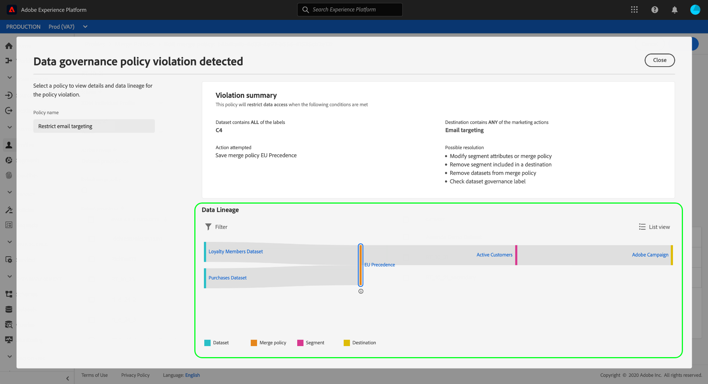

# [!DNL Data Governance] dans CDP en temps réel

[!DNL Real-time Customer Data Platform] (CDP en temps réel) rassemble les données de plusieurs systèmes d’entreprise, ce qui permet aux spécialistes du marketing de mieux identifier, comprendre et impliquer leurs clients. Ces données peuvent être soumises à des restrictions d’utilisation définies par votre organisation ou par des réglementations juridiques. Il est donc important de s’assurer que la plateforme des données clients en temps réel est conforme aux politiques d’utilisation lors de la gestion de vos données.

Adobe Experience Platform [!DNL Data Governance] allows you to manage customer data and ensure compliance with regulations, restrictions, and policies applicable to data use. Elle joue un rôle essentiel dans la plateforme des données clients en temps réel, ce qui vous permet de définir des politiques d’utilisation, de classer vos données en fonction de ces politiques et de rechercher les violations de politiques lors de l’exécution de certaines actions marketing.

Real-time CDP is built on top of Adobe Experience Platform, and therefore the majority of [!DNL Data Governance] capabilities are covered in the [!DNL Experience Platform] documentation. Ce document est destiné à compléter la [présentation de la gouvernance des données](../../data-governance/home.md) pour et décrit les fonctionnalités de gouvernance disponibles dans la plateforme des données clients en temps réel. [!DNL Experience Platform] Les sujets suivants sont abordés :

* [Application des libellés d’utilisation aux données](#labels)
* [Gestion des politiques d’utilisation des données](#policies)
* [Application de la conformité de l’utilisation des données](#enforce-data-usage-compliance)

## Application des libellés d’utilisation aux données  {#labels}

[!DNL Data Governance] vous permet d’appliquer des étiquettes d’utilisation à vos données, soit au niveau du jeu de données, soit au niveau du champ de jeu de données. Les libellés d’utilisation des données vous permettent de classer les données en fonction des politiques d’utilisation qui s’appliquent à celles-ci.

Pour plus d’informations sur l’utilisation des libellés d’utilisation des données, consultez le [Guide de l’utilisateur des libellés d’utilisation des données](../../data-governance/labels/overview.md) pour Adobe Experience Platform.

## Configuration des cas d’utilisation marketing pour les destinations {#destinations}

Vous pouvez définir des restrictions d’utilisation des données sur une destination en définissant des cas d’utilisation marketing (également appelés actions marketing) pour cette destination. Un cas d’utilisation marketing pour une destination indique l’intention des données qui seront exportées vers cette destination.

>[!NOTE]
>
>Pour plus d’informations sur les actions marketing et leur utilisation dans les stratégies d’utilisation des données, voir la présentation [des stratégies](../../data-governance/policies/overview.md) d’utilisation des données dans la [!DNL Experience Platform] documentation.

La définition de cas d’utilisation marketing sur les destinations vous permet de vous assurer que les profils ou segments envoyés vers ces destinations sont conformes aux stratégies d’utilisation des données. Par conséquent, vous devez ajouter des cas d’utilisation marketing appropriés à vos destinations en fonction des besoins de votre entreprise pour appliquer des restrictions de stratégie à l’activation.

Les cas d’utilisation marketing ne peuvent être sélectionnés que lors de la configuration d’une destination pour la première fois. Selon le type de destination que vous utilisez, la possibilité de configurer des cas d’utilisation marketing s’affiche à différents moments du processus de configuration. Consultez la documentation [sur les](../destinations/destinations-overview.md#data-governance) destinations pour connaître les étapes de configuration de votre destination particulière.

## Gestion des politiques d’utilisation des données  {#policies}

Les politiques d’utilisation des données doivent être définies et activées pour que les libellés d’utilisation des données prennent en charge efficacement la conformité des données. Les politiques d’utilisation des données sont des règles qui décrivent les types d’actions marketing que vous êtes autorisé, ou non, à effectuer sur des données de la plateforme des données clients en temps réel. See the &quot;Data usage policies&quot; section in the [!DNL Experience Platform] [Data Governance overview](../../data-governance/home.md) for more information.

Adobe Experience Platform propose plusieurs politiques fondamentales pour les cas d’utilisation courants de l’expérience client. Ces stratégies peuvent être affichées dans l’interface utilisateur en accédant à l’espace de travail **[!UICONTROL Stratégies]** et en sélectionnant l’onglet **[!UICONTROL Parcourir]** . Pour obtenir des instructions plus détaillées sur l’utilisation de stratégies dans l’interface utilisateur, notamment sur la manière de créer vos propres stratégies personnalisées, consultez le guide [d’utilisation des](../../data-governance/policies/user-guide.md) stratégies dans la documentation [!DNL Experience Platform] .

## Application de la conformité de l’utilisation des données {#enforce-data-usage-compliance}

Une fois que les données sont étiquetées et que les stratégies d’utilisation sont définies, vous pouvez appliquer les stratégies d’utilisation des données. When activating audience segments to destinations in Real-time CDP, [!DNL Data Governance] automatically enforces usage policies should any violations occur.

Le diagramme suivant illustre la procédure d’intégration des politiques dans le flux de données de l’activation des segments :

When a segment is first activated, [!DNL Policy Service] checks for policy violations based on the following factors:

* Les libellés d’utilisation des données ont été appliquées aux champs et aux jeux de données du segment à activer.
* Objectif marketing de la destination.

>[!NOTE]
>
>Si des étiquettes d’utilisation de données n’ont été appliquées qu’à certains champs d’un jeu de données (plutôt qu’à l’ensemble du jeu de données), l’application de ces étiquettes de niveau champ sur l’activation se fait uniquement dans les conditions suivantes :
>* Les champs sont utilisés dans la définition de segment.
>* Les champs sont configurés en tant qu’attributs prévisionnels pour la destination de la cible.

### Liaison des données {#lineage}

Dans le CDP en temps réel, la lignée de données joue un rôle clé dans la manière dont les stratégies sont appliquées. En termes généraux, le lignage de données fait référence à l’origine d’un ensemble de données et à ce qui s’y passe (ou où il se déplace) au fil du temps.

Dans le contexte [!DNL Data Governance]de, le lignage permet aux étiquettes d’utilisation des données de se propager des jeux de données aux services en aval qui utilisent leurs données, tels que le Profil client en temps réel et les destinations. Cela permet d&#39;évaluer et d&#39;appliquer les politiques à plusieurs points clés du parcours des données à travers la plate-forme et fournit un contexte aux consommateurs de données quant aux raisons pour lesquelles une violation de la politique a eu lieu.

En temps réel, les mesures d&#39;application des politiques concernent les lignées suivantes :

1. Les données sont ingérées dans le CDP en temps réel et stockées dans **des jeux de données**.
1. Les profils clients sont identifiés et construits à partir de ces jeux de données en fusionnant des fragments de données conformément à la stratégie **de** fusion.
1. Les groupes de profils sont divisés en **segments** basés sur des attributs communs.
1. Les segments sont activés pour les **destinations** en aval.

Chaque étape du calendrier ci-dessus représente une entité qui peut contribuer à la violation d&#39;une politique, comme indiqué dans le tableau ci-dessous :

| Etape de la gamme de données | Rôle dans l&#39;application des politiques |
| --- | --- |
| Jeu de données | Les jeux de données contiennent des étiquettes d’utilisation des données (appliquées au niveau du jeu de données ou du champ) qui définissent les cas d’utilisation pour lesquels le jeu de données entier ou des champs spécifiques peuvent être utilisés. Des violations de stratégie se produisent si un jeu de données ou un champ contenant certaines étiquettes est utilisé à des fins restreintes par une stratégie. |
| Fusionner la stratégie | Les stratégies de fusion sont les règles utilisées par Plateforme pour déterminer comment les données seront hiérarchisées lors de la fusion de fragments provenant de plusieurs jeux de données. Des violations de stratégie se produiront si vos stratégies de fusion sont configurées de sorte que les jeux de données avec des étiquettes restreintes soient activés pour une destination. Pour plus d’informations, consultez le guide sur les stratégies [de](../../profile/ui/merge-policies.md) fusion. |
| Segment | Les règles de segmentation définissent les attributs à inclure dans les profils client. En fonction des champs inclus par une définition de segment, le segment hérite des étiquettes d’utilisation appliquées pour ces champs. Des violations de stratégie se produiront si vous activez un segment dont les étiquettes héritées sont restreintes par les stratégies applicables de la destination de la cible, en fonction de son cas d’utilisation marketing. |
| Destination | Lors de la configuration d’une destination, une action marketing (parfois appelée cas d’utilisation marketing) peut être définie. Ce cas d’utilisation correspond à une action marketing telle que définie dans une stratégie d’utilisation des données. En d’autres termes, le cas d’utilisation marketing que vous définissez pour une destination détermine les stratégies d’utilisation des données applicables à cette destination. Des violations de stratégie se produiront si vous activez un segment dont les étiquettes d’utilisation sont restreintes par les stratégies applicables de la destination de la cible. |

Lorsque des violations de stratégie se produisent, les messages qui s’affichent dans l’interface utilisateur fournissent des outils utiles pour explorer la lignée de données de contribution de la violation afin de résoudre le problème. Vous trouverez plus de détails dans la section suivante.

### Messages de violation de politique  {#enforcement}

Si une violation de politique se produit lors de la tentative d’activation d’un segment (ou de la [modification d’un segment déjà activé](#policy-enforcement-for-activated-segments)), l’action est bloquée et une fenêtre contextuelle s’affiche indiquant qu’une ou plusieurs politiques ont été violées. Once a violation has triggered, the **[!UICONTROL Save]** button is disabled for the entity you are modifying until the appropriate components are updated to comply with data usage policies.

Sélectionnez une violation de politique dans la colonne de gauche de la fenêtre contextuelle pour afficher les détails de celle-ci.

Le message de violation fournit un résumé de la stratégie qui a été violée, y compris les conditions que la stratégie est configurée pour vérifier, l&#39;action spécifique qui a déclenché la violation et une liste de solutions possibles pour le problème.

Un graphique de lignage de données s’affiche sous le résumé de la violation, ce qui vous permet de visualiser les jeux de données, les stratégies de fusion, les segments et les destinations impliqués dans la violation de la stratégie. L&#39;entité que vous modifiez actuellement est mise en surbrillance dans le graphique, ce qui indique le point du flux à l&#39;origine de la violation. Vous pouvez sélectionner un nom d&#39;entité dans le graphique pour ouvrir la page de détails de l&#39;entité en question.

Vous pouvez également utiliser l&#39;icône **[!UICONTROL Filtrer]** () pour filtrer les entités affichées par catégorie. Au moins deux catégories doivent être sélectionnées pour que les données s’affichent.

Sélectionnez vue **[!UICONTROL de]** Liste pour afficher la lignée de données en tant que liste. Pour revenir au graphique visuel, sélectionnez vue **[!UICONTROL de]** chemin.

### Application des politiques pour les segments activés  {#policy-enforcement-for-activated-segments}

L’application de la politique s’applique toujours aux segments une fois qu’ils ont été activés, ce qui limite toute modification apportée à un segment ou à sa destination qui entraînerait une violation de la politique. En raison du fonctionnement de la lignée [de](#lineage) données dans l’application des stratégies, l’une des actions suivantes peut potentiellement déclencher une violation :

* Mise à jour des libellés d’utilisation des données
* Modification des jeux de données d’un segment
* Modification des prédicats de segment
* Modification des configurations de destination

Si l’une des actions ci-dessus déclenche une violation, l’enregistrement de cette action est bloquée et un message de violation de politique s’affiche, ce qui vous permet de vérifier que les segments que vous avez activés continuent à respecter les politiques d’utilisation des données lors de leur modification.

## Étapes suivantes

Now that you have been introduced to the key [!DNL Data Governance] features on Real-time CDP and how [!DNL Experience Platform] enables them, please continue to the [documentation for Data Governance on Adobe Experience Platform](../../data-governance/home.md). The documentation provides overviews of essential [!DNL Data Governance] concepts, as well as step-by-step workflows for managing data usage labels and policies.

La vidéo suivante présente une vue d’ensemble du protocole CDP en temps réel, y compris l’utilisation de cas d’utilisation marketing sur les destinations et des exemples de workflows pour différents scénarios : [!DNL Data Governance]

>[!VIDEO](https://video.tv.adobe.com/v/33631?quality=12&learn=on)