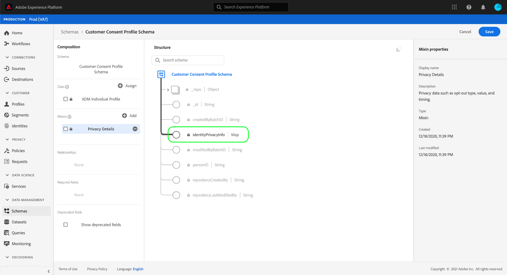
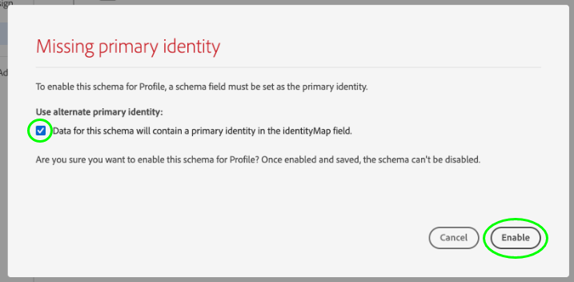

# Créer des jeux de données pour capturer les données de consentement IAB TCF 2.0

Afin de [!DNL Real-time Customer Data Platform] traiter les données de consentement des clients conformément à l&#39;IAB [!DNL Transparency & Consent Framework] (TCF) 2.0, ces données doivent être envoyées à des ensembles de données dont les schémas contiennent des champs de consentement TCF 2.0.

Plus précisément, deux jeux de données sont nécessaires pour capturer les données de consentement TCF 2.0 :

* Jeu de données basé sur la [!DNL XDM Individual Profile] classe, activé pour une utilisation dans [!DNL Real-time Customer Profile].
* Jeu de données basé sur la [!DNL XDM ExperienceEvent] classe.

Ce document décrit les étapes à suivre pour configurer ces deux ensembles de données afin de collecter les données de consentement IAB TCF 2.0. Pour une présentation du flux de travail complet à configurer [!DNL Real-time CDP] pour TCF 2.0, consultez la présentation [de la conformité à la norme](./overview.md)IAB TCF 2.0.

## Conditions préalables 

Ce tutoriel nécessite une compréhension du fonctionnement des composants suivants d’Adobe Experience Platform :

* [Modèle de données d’expérience (XDM)](../../../xdm/home.md)[!DNL Experience Platform] : cadre normalisé selon lequel Experience organise les données d’expérience client.
   * [Bases de la composition du schéma](../../../xdm/schema/composition.md) : en savoir plus sur les blocs de création de base des schémas XDM.
   * [Créez un schéma dans l’interface utilisateur](../../../xdm/tutorials/create-schema-ui.md): Didacticiel sur les bases de l’utilisation de l’éditeur de Schéma.
* [Service](../../../identity-service/home.md)d&#39;identité Adobe Experience Platform : Vous permet de relier les identités des clients à partir de vos sources de données disparates entre différents périphériques et systèmes.
* [Profil](../../../profile/home.md)client en temps réel : Exploite [!DNL Identity Service] cette fonction pour vous permettre de créer des profils clients détaillés à partir de vos jeux de données en temps réel. [!DNL Real-time Customer Profile] Profile extrait les données du lac de données et conserve les profils clients dans sa propre banque de données distincte.

## Structure du schéma de consentement {#structure}

Deux mixins XDM fournissent des champs de consentement client requis pour la prise en charge de TCF 2.0 : l&#39;une pour les données basées sur les enregistrements ([!DNL XDM Individual Profile]), l&#39;autre pour les données basées sur les séries chronologiques ([!DNL XDM ExperienceEvent]) :

| Schéma | Description |
| --- | --- |
| Mélange de confidentialité des profils | Ce mixin capture les préférences actuelles de consentement d’un client. Lorsqu&#39;elles sont utilisées dans un schéma [!DNL Profile]activé, les valeurs fournies dans ce mélange sont considérées comme la source de vérité quant à la manière dont l&#39;application du consentement doit s&#39;appliquer aux données d&#39;un client. |
| [!DNL Experience Event] mixin confidentialité | Ce mixin capture les préférences de consentement d’un client à un moment donné. Les données capturées dans ces champs peuvent être utilisées pour suivre les modifications des préférences de consentement d’un client au fil du temps. |

Bien que le cas d’utilisation de chaque mixin soit différent, les champs spécifiques qu’ils fournissent sont à peu près les mêmes. Ces champs sont expliqués plus en détail dans la section suivante.

### Champs de mixage de consentement {#privacy-mixin}

Bien que chaque mélange de confidentialité varie en structure et en types de champs qu’ils contiennent, ils fournissent tous deux l’ `xdm:consentString` attribut, dont les sous-champs sont nécessaires pour que l’application de la norme TCF 2.0 se fasse. La structure de ces champs est illustrée ci-dessous, ainsi que les types de valeurs auxquels ils s’attendent :

```json
{
  "xdm:consentString": {
    "xdm:consentStandard": "IAB TCF",
    "xdm:consentStandardVersion": "2.0",
    "xdm:consentStringValue": "BObdrPUOevsguAfDqFENCNAAAAAmeAAA.PVAfDObdrA.DqFENCAmeAENCDA",
    "xdm:gdprApplies": true,
    "xdm:containsPersonalData": false
  }
}
```

| Propriété | Description |
| --- | --- |
| `xdm:consentString` | Contient les données de consentement mises à jour du client et d’autres informations contextuelles. |
| `xdm:consentStandard` | Cadre de consentement auquel s’appliquent les données. Pour la conformité TCF, la valeur doit être &quot;IAB TCF&quot;. |
| `xdm:consentStandardVersion` | Numéro de version du cadre de consentement indiqué par `xdm:consentStandard`. Pour la conformité à la norme TCF 2.0, la valeur doit être &quot;2.0&quot;. |
| `xdm:consentStringValue` | Chaîne de consentement générée en fonction des paramètres de consentement sélectionnés par le client. |
| `xdm:gdprApplies` | Valeur booléenne indiquant si le RGPD s’applique ou non à ce client. La valeur doit être définie sur &quot;true&quot; pour que l’application de TCF 2.0 se produise. La valeur par défaut est &quot;false&quot; si elle n’est pas incluse. |
| `xdm:containsPersonalData` | Valeur booléenne indiquant si la mise à jour du consentement contient ou non des données personnelles. La valeur par défaut est &quot;false&quot; si elle n’est pas incluse. |

## Créer des schémas de consentement client {#create-schemas}

In the Platform UI, click **[!UICONTROL Schemas]** in the left navigation to open the *[!UICONTROL Schemas]workspace *. À partir de là, suivez les étapes décrites dans les sections ci-dessous pour créer chaque schéma requis.

>[!NOTE]
>
>Si vous souhaitez utiliser des schémas XDM existants pour capturer des données de consentement, vous pouvez modifier ces schémas au lieu de les créer. Cependant, lors de la modification des schémas existants, il est important de suivre les [principes de l&#39;évolution](../../../xdm/schema/composition.md#evolution) du schéma pour éviter de rompre les changements.

### Créer un schéma de consentement basé sur les enregistrements {#profile-schema}

Dans l’onglet **[!UICONTROL Parcourir]** de l’espace de travail *Schémas *, créez un schéma en fonction de la classe**[!DNL XDM Individual Profile]**. Une fois le schéma ouvert dans l’éditeur de Schémas, cliquez sur **[!UICONTROL Ajouter]**sous la section *[!UICONTROL Mélanges]*située sur le côté gauche de la trame.


The *[!UICONTROL Add mixin]* dialog appears. A partir de là, sélectionnez **[!UICONTROL Profil de confidentialité]** dans la liste. Vous pouvez également utiliser la barre de recherche pour affiner les résultats afin de localiser plus facilement le mixin. Une fois le mixin sélectionné, cliquez sur **[!UICONTROL Ajouter le mixin]**.


Le canevas de l’éditeur de Schémas réapparaît, ce qui vous permet de revoir la structure des champs de chaîne de consentement ajoutés.



À partir de là, répétez les étapes ci-dessus pour ajouter les mixins supplémentaires suivants au schéma :

* [!UICONTROL IdentityMap]
* [!UICONTROL Zone de capture de données pour le Profil]
* [!UICONTROL Détails de la personne profil]
* [!UICONTROL Détails personnels du profil]


Si vous modifiez un schéma existant déjà activé pour une utilisation dans [!DNL Real-time Customer Profile], cliquez sur **[!UICONTROL Enregistrer]** pour confirmer vos modifications avant de passer à la section relative à la [création d&#39;un jeu de données en fonction de votre schéma](#dataset)de consentement. Si vous créez un nouveau schéma, suivez les étapes décrites dans la sous-section ci-dessous.

#### Enable the schema for use in [!DNL Real-time Customer Profile]

Pour [!DNL Real-time CDP] associer les données de consentement qu&#39;il reçoit à des profils clients spécifiques, le schéma de consentement doit être activé pour une utilisation dans [!DNL Real-time Customer Profile].

>[!NOTE]
>
>L&#39;exemple de schéma illustré dans cette section utilise son `identityMap` champ comme identité Principale. Si vous souhaitez définir un autre champ en tant qu’identité Principale, veillez à utiliser un identifiant indirect, tel qu’un identifiant de cookie, et non un champ directement identifiable qui est interdit d’utilisation dans les publicités basées sur des intérêts, comme une adresse électronique. Consultez votre conseiller juridique si vous ne savez pas quels champs sont restreints.
>
>Pour savoir comment définir un Principal champ d&#39;identité pour un schéma, consultez le didacticiel [de création de](../../../xdm/tutorials/create-schema-ui.md#identity-field)schéma.

Pour activer le schéma pour [!DNL Profile], cliquez sur le nom du schéma dans le rail de gauche pour ouvrir la boîte de dialogue des propriétés *[!UICONTROL du]* Schéma dans le rail de droite. A partir de là, cliquez sur le bouton bascule **[!UICONTROL Profil]** .


Une fenêtre contextuelle s’affiche, indiquant une identité Principale manquante. Cochez la case pour utiliser une autre identité Principale, car l&#39;identité Principale sera contenue dans le champ identityMap.

<br>

Enfin, cliquez sur **[!UICONTROL Enregistrer]** pour confirmer vos modifications.


### Créer un schéma de consentement basé sur une série chronologique {#event-schema}

Dans l’onglet **[!UICONTROL Parcourir]** de l’espace de travail *Schémas *, créez un schéma en fonction de la classe**[!DNL XDM ExperienceEvent]**. Une fois le schéma ouvert dans l’éditeur de Schémas, cliquez sur **[!UICONTROL Ajouter]**sous la section *[!UICONTROL Mélanges]*située sur le côté gauche de la trame.


The *[!UICONTROL Add mixin]* dialog appears. Sélectionnez **[!UICONTROL Expérience événement privacy mixin]** dans la liste. Vous pouvez également utiliser la barre de recherche pour affiner les résultats afin de localiser plus facilement le mixin. Une fois le mixin sélectionné, cliquez sur **[!UICONTROL Ajouter le mixin]**.


Le canevas de l’éditeur de Schémas réapparaît, affichant les champs de chaîne de consentement ajoutés.


À partir de là, répétez les étapes ci-dessus pour ajouter les mixins supplémentaires suivants au schéma :

* [!UICONTROL IdentityMap]
* [!UICONTROL Détails de l’environnement ExperienceEvent]
* [!UICONTROL Détails Web d’ExperienceEvent]
* [!UICONTROL Détails de l’implémentation d’ExperienceEvent]

Une fois les mixins ajoutés, terminez en cliquant sur **[!UICONTROL Enregistrer]**.


## Créer des jeux de données basés sur vos schémas de consentement {#datasets}

Pour chacun des schémas requis décrits ci-dessus, vous devez créer un jeu de données qui, en fin de compte, assimilera les données de consentement de vos clients. Le jeu de données basé sur le [!DNL XDM Individual Profile] schéma doit être activé pour [!DNL Real-time Customer Profile], tandis que le jeu de données basé sur le [!DNL XDM ExperienceEvent] schéma ne doit pas être [!DNL Profile]activé.

Pour commencer, sélectionnez **[!UICONTROL Datasets]** dans le volet de navigation de gauche, puis cliquez sur **[!UICONTROL Créer un dataset]** dans le coin supérieur droit.


On the next page, select **[!UICONTROL Create dataset from schema]**.


Le processus _[!UICONTROL Créer un jeu de données à partir du schéma]_s&#39;affiche, en commençant à l&#39;étape_[!UICONTROL  Sélectionner un schéma]_ . Dans la liste fournie, recherchez l’un des schémas de consentement que vous avez créés précédemment. Vous pouvez éventuellement utiliser la recherche pour affiner les résultats et faciliter la localisation de votre schéma. Cliquez sur le bouton radio en regard du schéma pour le sélectionner, puis cliquez sur **[!UICONTROL Suivant]** pour continuer.


L’étape _[!UICONTROL Configurer le jeu de données]_apparaît. Fournissez un nom et une description uniques et facilement identifiables pour le jeu de données avant de cliquer sur**[!UICONTROL  Terminer ]**.


La page de détails du jeu de données nouvellement créé s&#39;affiche. Si le jeu de données est basé sur votre [!DNL XDM ExperienceEvent] schéma, le processus est terminé. Si le jeu de données est basé sur votre [!DNL XDM Individual Profile] schéma, la dernière étape du processus consiste à activer le jeu de données pour l&#39;utiliser dans [!DNL Real-time Customer Profile]. Dans le rail de droite, cliquez sur le bouton bascule **[!UICONTROL Profil]** pour activer le jeu de données.


Suivez à nouveau les étapes ci-dessus pour créer un autre jeu de données requis pour la conformité à la norme TCF 2.0.

## Étapes suivantes

En suivant ce didacticiel, vous avez créé deux jeux de données qui peuvent maintenant être utilisés pour collecter les données de consentement des clients :

* Jeu de données [!DNL Profile]activé basé sur votre [!DNL XDM Individual Profile] schéma.
* Jeu de données basé sur votre [!DNL XDM ExperienceEvent] schéma qui n&#39;est pas activé pour [!DNL Profile].

Vous pouvez maintenant revenir à la présentation [de l’](./overview.md#merge-policies) IAB TCF 2.0 pour poursuivre le processus de configuration de [!DNL Real-time CDP] la conformité à la version 2.0 de TCF.