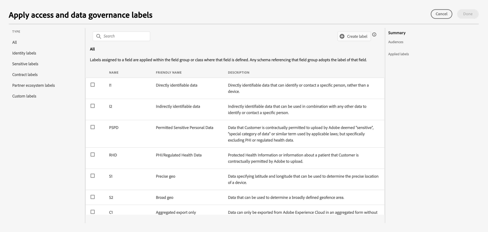

# Créateur d’audience dans Real-Time Customer Data Platform

Basé sur Adobe Experience Platform, [!DNL Adobe Real-Time Customer Data Platform] peut utiliser l’ensemble des fonctionnalités du Créateur d’audience qui font partie d’[!DNL Experience Platform]. L’espace de travail fournit des commandes intuitives pour la création et la modification de règles, telles que le glisser-déposer de mosaïques utilisées pour représenter les propriétés des données.

{zoomable="yes"}

## Champs {#fields}

>[!CONTEXTUALHELP]
>id="platform_b2b_audiencebuilder_showfullxdmschema"
>title="Afficher le schéma XDM complet"
>abstract="Par défaut, seuls les champs contenant des données sont affichés. Activez cette option pour afficher tous les champs du schéma XDM."

>[!CONTEXTUALHELP]
>id="platform_b2b_audiencebuilder_showrelationselectors"
>title="Afficher les sélecteurs de relation"
>abstract="Par défaut, les relations standard de votre organisation sont utilisées. Activez cette option pour afficher les sélecteurs de relation utilisés."

>[!CONTEXTUALHELP]
>id="platform_b2b_audiencebuilder_showconstrainedfields"
>title="Afficher les champs contraints"
>abstract="Par défaut, seuls les champs qui ne sont soumis à aucune contrainte sont affichés. Activez cette option pour afficher les champs soumis à des contraintes."

Lors de l’utilisation du Créateur d’audience pour les comptes, vous pouvez utiliser des attributs de compte ou des audiences existantes comme champs de votre audience.

Vous pouvez sélectionner l’icône  pour ajuster les paramètres des champs affichés.

{zoomable="yes"}

>[!NOTE]
>
>La section **[!UICONTROL Options de champ]** est actuellement en version bêta et n’est disponible que pour certains clients et clientes. Pour plus d’informations, contactez l’Assistance clientèle d’Adobe.

La section [!UICONTROL Paramètres] s’affiche. Dans cette section, vous pouvez mettre à jour les champs affichés ainsi que la relation des champs.

Pour les **[!UICONTROL options de champ]**, vous pouvez afficher uniquement les champs contenant des données ou le schéma XDM complet.

Pour la **[!UICONTROL Relation des champs]**, vous pouvez utiliser les relations standard pour votre organisation ou afficher les sélecteurs de relation.

{width="300"}

### Attributs {#attributes}

L’onglet [!UICONTROL Attributs] vous permet de parcourir les attributs de compte appartenant à la classe XDM Business Account, ainsi que les attributs basés sur les opportunités et les personnes. Chaque dossier peut être développé pour afficher des attributs supplémentaires, où chaque attribut est une mosaïque qui peut être glissée sur la zone de travail [créateur de règles](#rule-builder-canvas) au centre de l’espace de travail.

Lors de la sélection d’un attribut, vous pouvez afficher des données de résumé en sélectionnant l’icône [informations](../../images/icons/info.png). Les données de synthèse comprennent des informations telles que les valeurs principales, une explication du champ, ainsi que le pourcentage de comptes contenant des valeurs pour cet attribut.

{width="300"}

Si un attribut est renseigné par moins de 25 % des comptes, l’icône  s’affiche à la place. Les mêmes données de résumé s’affichent pour l’attribut, quelles que soient les conditions.

{width="300"}

>[!NOTE]
>
>Les données récapitulatives ne sont disponibles que si l’attribut appartient au schéma Compte, Personne ou Opportunité . En outre, les premières valeurs ne s’affichent que si le champ ne contient **pas** trop de valeurs différentes et si les valeurs de ces champs sont généralement répétées.
>
>Ces données récapitulatives sont mises à jour **quotidiennement**.

Pour obtenir un guide plus détaillé sur le Créateur d’audience, consultez le [guide d’utilisation du Créateur d’audience](../../segmentation/ui/segment-builder.md){target="_blank"}.

### Audiences {#audiences}

L’onglet **[!UICONTROL Audiences]** répertorie toutes les audiences basées sur les personnes et les comptes disponibles dans Experience Platform.

Vous pouvez placer le pointeur de la souris sur l’icône  en regard d’une audience pour afficher des informations sur celle-ci, notamment son identifiant, sa description et la hiérarchie des dossiers permettant de la localiser.

{zoomable="yes"}

## Zone de travail du créateur de règles {#rule-builder-canvas}

Une audience créée dans le créateur d’audiences est un ensemble de règles utilisées pour décrire les caractéristiques ou les comportements clés d’une audience cible. Ces règles sont créées à l’aide du canevas du créateur de règles, situé au centre du créateur d’audiences.

Pour ajouter une nouvelle règle à votre définition de segment, faites glisser une mosaïque de l’onglet **[!UICONTROL Champs]** et déposez-la sur la zone de travail du créateur de règles.

{zoomable="yes"}

Pour plus d’informations sur l’utilisation de la zone de travail du créateur de règles, consultez la [documentation du créateur de segments](../../segmentation/ui/segment-builder.md#rule-builder-canvas){target="_blank"}.

### Conteneurs {#containers}

Les règles d’audience sont évaluées dans l’ordre dans lequel elles sont répertoriées. Vous pouvez utiliser des conteneurs pour mieux contrôler l’ordre d’exécution grâce à l’utilisation de requêtes imbriquées.

Pour plus d’informations sur les conteneurs, consultez la [documentation du créateur de segments](../../segmentation/ui/segment-builder.md#containers){target="_blank"}.

## Propriétés de l’audience {#properties}

La section **[!UICONTROL Propriétés de l’audience]** affiche des informations sur l’audience, notamment une taille estimée de l’audience. Vous pouvez également spécifier des détails sur votre audience, y compris son nom, sa description et ses balises.

{width="300"}

Le **[!UICONTROL Comptes qualifiés]** indique le nombre réel de comptes qui correspondent aux règles de l’audience. Ce nombre est mis à jour toutes les 24 heures, après l’exécution de la tâche de segmentation.

Le **[!UICONTROL Comptes estimés]** indique le nombre approximatif de comptes basés sur l’exemple de tâche. Vous pouvez mettre à jour cette valeur après avoir ajouté de nouvelles règles ou conditions et sélectionné **[!UICONTROL Actualiser l’estimation]**.

{width="300"}

Vous pouvez sélectionner **[!UICONTROL Afficher les comptes]** pour afficher un échantillon des comptes qui répondraient aux critères de l’audience avec les règles actuelles.

{width="300"}

L’**[!UICONTROL affichage du code]** fournit une description textuelle du code des règles de l’audience.

Vous pouvez sélectionner **[!UICONTROL Appliquer les libellés d’accès]** pour appliquer les libellés d’accès appropriés à l’audience. Pour plus d’informations sur les libellés d’accès, consultez le [guide de gestion des libellés](../../access-control/abac/ui/labels.md){target="_blank"}.

Le reste de la section des propriétés de l’audience vous permet de modifier des détails liés à l’audience du compte, y compris le nom, la description et les balises.

{width="300"}

Vous **pouvez pas** la méthode d’évaluation pour les audiences de compte, car toutes les audiences de compte sont évaluées à l’aide de la segmentation par lots.

## Étapes suivantes {#next-steps}

Le Créateur d’audience fournit un workflow complet qui vous permet de créer des audiences à partir des données de votre compte professionnel XDM.

Pour en savoir plus sur Segmentation Service pour les données de profil client, veuillez lire la [présentation de Segmentation Service](../../segmentation/home.md){target="_blank"}.
